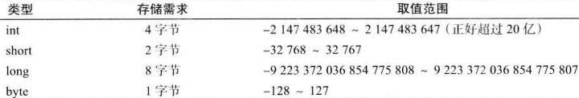
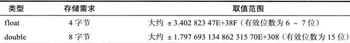
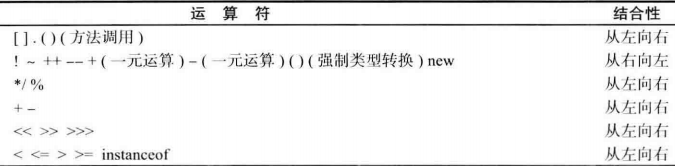
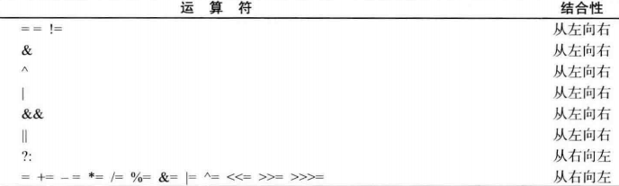
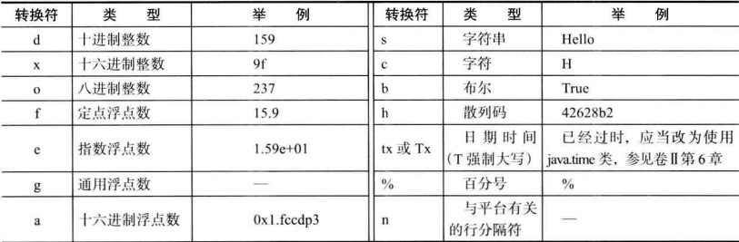

## Java 基本语法及规定

### 数据类型

在 Java 中，一共有 8 种基本类型，包含 4 种整型、2 种浮点类型、1 种用于表示 Unicode 编码的字符类型、布尔类型

* 整型

    *java整型*

* 浮点型

    *浮点类型*
    

所有的浮点数值计算都遵循 IEEE 754 规范。下面是用于表示溢出和出错情况的三个特殊的浮点数值

* 正无穷大：常量 `Double.POSITIVE_INFINITY`

* 负无穷大：常量 `Double.NEGATIVE_INFINITY`

* NaN （不是一个数字）：常量 `Double.NaN`

* char 类型

    char 类型原本用于表示单个字符。不过，现在有些 `Unicode` 字符可以用一个 char 值描述，另外一些 `Unicode` 字符需要两个 char 值
char 类型的字面量要用单引号括起来。可以用十六进程值（范围 `\u0000` 到 `\Uffff`）

* boolean 整型

    boolean 类型有两个值: `false` 和 `true`, 用来判定逻辑条件。整型值和布尔值之间不能进行相互转换

### 变量

   每个变量都有一个类型。在声明变量时，变量的类型位于变量名之前。大小写敏感，没有长度限制。声明一个变量之后，必须用赋值语句对变量进行显示。
不能使用未初始化的变量。变量的声明尽可能地靠近变量第一次使用的地方。

### 常量

使用关键字 `final` 指示常量。关键字 `final` 表示这个变量只能被赋值一次。一旦被赋值之后，就不能再修改。习惯上，常量名使用全大写
在 java 中，经常希望某个常量可以在一个类中的多个方法中使用，通常将这些常量称为类常量。可以使用关键字 `static final` 设置一个类常量。
类常量的定义位于 main 方法的外部。因此在同一个类的其他方法中也可以使用这个常量。而且，一个常量被声明为 public，那么其他类的方法也可以使用这个常量​     

### 运算

*运算符优先级*

### 格式化输出

每一个以 `%` 字符开始的格式说明符都用相应的参数替换。格式说明符尾部的转换符将指示被格式化的数值类型:

*用于 printf 的转换符*

### 块级作用域

块（复合语句）是指由一对大括号括起来的若干条简单的 `java` 语句。块确定了变量的作用域。一个块可以嵌套在另一个块中。
但是，不能再嵌套的两个块中声明同名的变量。

### 字符串和数字间的转换，常用格式化字符，与 c 的格式化字符类似
* 可以将数值型字符串转换为数值。要将字符串转换为 int 值，使用 Integer.parseInt 方法 `int intValue = Integer.parseInt(intString)`
* 要将字符串转为 double 值，使用 Double.parseDouble 方法 `double doubleValue = Double.parseDouble(doubleString)`
* 将数值转为字符串，只需要简单使用字符串的连接操作符 `String s = number + ""`;
* 常用的格式标识符：%b 布尔值，%c 字符，%d 十进制整数，%f 浮点数，%e 标准科学计数法形式的数，%s 字符串
指定宽度和精度
%5c 输出字符并在这个字符条目前面家 4 个空格
%6b 输出布尔值，在 false 值前加一个空格，在true 值前加两个空格
%5d 输出整数条目，宽度至少为 5，如果该条目的数字位数小于 5，就在数字前面加空格，如果该条目的数字位数大于5，则自动增加宽度
%10.2f 输出的浮点条目宽度至少为 10，包括小数点和小数点后两位数字。
%10.2e 输出的浮点条目的宽度至少为 10，包括小数点，小数点后两位数字
%12s   输出的字符串宽度至少为 12 个字符。如果该字符串条目小于 12 个字符，就在该字符串前加空格，如果该字符串条目多于 12 个字符，则自动增加宽度