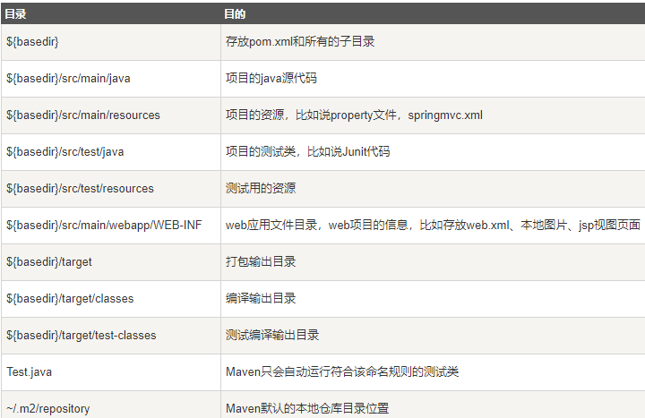

### maven

#### Apache Maven

是 Apache 下的一个纯 Java 开发的开源项目，基于项目对象模型概览，可以对 Java 项目进行构建、依赖管理。Maven 提倡约定优于配置

*maven约定目录结构*



##### maven特点

* 项目设置遵循统一的规则
* 任意工程中共享
* 依赖管理包括自动更新
* 一个庞大且不断增长的库
* 可扩展，能够编写 Java 或脚本语言的插件
* 只需很少或不需要额外配置几款访问新功能
* 基于模型的构建，maven 能够将任意数量的项目构建到预定义的输出类型中，如 JAR，WAR 或基于项目元数据的分发，而不需要在大多数情况下执行任何脚本
* 项目信息的一致性站点，使用与构建过程相同的元数据，Maven 能够生成一个网站或 PDF，包括要添加的任何文档，并添加到关于项目开发状态的标准报告中
* 发布管理和发布单独的输出，maven 将不需要额外的配置，就可以与源代码管理系统集成，并可以基于某个标签管理项目的发布，可以将其发布到分发位置供其他项目使用。Maven 能够发布单独的输出，如 JAR，包含其他依赖和文档的归档，或者作为源代码发布
* 向后兼容性

##### maven 的 snapshot 版本与 release 版本

* snapshot 版本代表不稳定，尚处于开发中的版本
* release 版本则代表稳定的版本

协同开发时，如果 A 依赖构件 B，由于 B 会更新，B 应该使用 SNAPSHOT 来标识自己。如果 B 不用 SNAPSHOT，而是每次更新后都使用一个稳定的版本，那版本号就会升的太快，对版本号的滥用；如果 B 不用 SNAPSHOT，但是一直使用一个单一的 Release 版本号，那当 B 更新后，A 可能并不会接受到更新，因为 A 使用的 repository 一般不会频繁更新 release 版本的缓冲（本地 repository），所以 B 以不换版本号的方式更新后，A 在拿 B 时发现本地已有这个版本，就不会去远程 repository 下载最新的 B。

正式环境中不得使用 snapshot 版本的库。

#### Maven POM

POM（Project Object Model，项目对象模型）是 Maven 工程的基本工作单元，是一个 XML 文件，包含了项目的基本信息，用于描述项目如何构建，声明项目依赖。执行任务或目标时，maven 会在当前目录中查找 pom，读取 pom，获取所需的配置信息，然后执行目标。pom 可以指定如下配置：

* 项目依赖
* 插件
* 执行目标
* 项目构建 profile
* 项目版本
* 项目开发者列表
* 邮件列表

*基本pom配置*

```xml
<project xmlns = "http://maven.apache.org/POM/4.0.0"
    xmlns:xsi = "http://www.w3.org/2001/XMLSchema-instance"
    xsi:schemaLocation = "http://maven.apache.org/POM/4.0.0
    http://maven.apache.org/xsd/maven-4.0.0.xsd">
    <!-- 模型版本 -->
    <modelVersion>4.0.0</modelVersion>
    <!-- 公司或组织的唯一标志，并且配置时生成的路径也是由此生成，如 com.companyname.project-group, maven 会将该项目打成 jar 包放本地路径：/com/companyname/project-group -->
    <groupId>com.companyname.project-group</groupId>
    <!-- 项目的唯一 ID，一个 groupId 下面可能多个项目，靠 artifactId 来区分 -->
    <artifactId>project</artifactId>
    <!-- 版本号 -->
    <version>1.0</version>
</project>
```

所有 POM 文件都需要 project 元素和三个必须字段：groupId，

