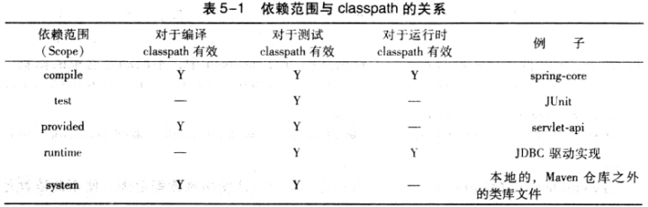

## maven 在项目中应用

### 使用 maven 构建项目

#### 基础 pom 文件

*pom.xml*

```xml
<?xml version="1.0" encoding="UTF-8"?>
<project xmlns="http://maven.apache.org/POM/4.0.0"
         xmlns:xsi="http://www.w3.org/2001/XMLSchema-instance"
         xsi:schemaLocation="http://maven.apache.org/POM/4.0.0 http://maven.apache.org/xsd/maven-4.0.0.xsd">
    <modelVersion>4.0.0</modelVersion>
    <properties>
        <project.build.sourceEncoding>UTF-8</project.build.sourceEncoding>
        <maven.compiler.encoding>UTF-8</maven.compiler.encoding>
        <java.version>11</java.version>
        <maven.compiler.source>11</maven.compiler.source>
        <maven.compiler.target>11</maven.compiler.target>
    </properties>

    <groupId>chaoyi</groupId>
    <artifactId>game</artifactId>
    <version>1.0-SNAPSHOT</version>
    <name>this is test project</name>

</project>
```

配置 `maven-compiler-plugin` 支持 Java 版本

```xml
<build>
	<plugins>
    	<plugin>
        	<groupId>org.apache.maven.plugins</groupId>
            <artifactId>maven-compiler-plugin</artifactId>
            <configuration>
            	<source>11</source>
                <target>11</target>
            </configuration>
        </plugin>
    </plugins>
</build>
```

等价于 `properties` 属性对中 `<maven.compiler.source>` 元素配置

#### 添加依赖

```xml
<dependencies>
    <dependency>
		<groupId>junit</groupId>
    	<artifactId>junit</artifactId>
    	<version>4.7</version>
    	<scope>test</scope>
	</dependency>
</dependencies>
```

* scope

  指定依赖范围，若依赖范围为 test 则表示该依赖只对测试有效。即只能在测试环境导入 Junit，但无法才主代码中导入，如果不指定 scope 默认值为 compile，该依赖对主代码和测试代码都有效

#### 打包安装

* `maven clean package`

  maven 会在打包之前执行编译、测试等操作，jar 插件的 jar 目标将项目主代码打包成一个 `*.jar` 文件，位于  `/target` 目录中，会根据 `artifact-version.jar` 规则进行命名，如有需要，还可以使用 `finalName` 来自定义该文件的名称。

* `maven clean install`

  可以让其他的 maven 项目直接引用这个 jar，该任务会将项目输出的 jar 安装到 maven 本地仓库中。默认打包生成的 jar 是不能直接运行的，因为带有 main 方法的类信息不会添加到 `mainfest` 中（jar 文件中的 `META-INF/MANIFEST.MF` 文件，将无法看到 `Main-Class` 一行）。为了生成可执行的 `jar` 文件，需要使用 `maven-shade-plugin`

  ```xml
  <plugins>
              <plugin>
                  <groupId>org.apache.maven.plugins</groupId>
                  <artifactId>maven-shade-plugin</artifactId>
                  <version>3.2.1</version>
                  <executions>
                      <execution>
                          <phase>package</phase>
                          <goals>
                              <goal>shade</goal>
                          </goals>
                          <configuration>
                              <transformers>
                                  <transformer implementation="org.apache.maven.plugins.shade.resource.ManifestResourceTransformer">
  <!--                                    <manifestEntries>-->
  <!--                                        <Main-Class>com.game.chaoyi.controller.HelloWorld</Main-Class>-->
  <!--                                        <X-Compile-Source-JDK>11</X-Compile-Source-JDK>-->
  <!--                                        <X-Compile-Target-JDK>11</X-Compile-Target-JDK>-->
  <!--                                    </manifestEntries>-->
                                      <mainClass>com.game.chaoyi.controller.HelloWorld</mainClass>
                                  </transformer>
                              </transformers>
                          </configuration>
                      </execution>
                  </executions>
              </plugin>
          </plugins>
      </build>
  ```

  `mainfestEntries` 元素等于 `mainClass`，官方示例为 `<mainfestEntries>` 元素。安装完成后会生成可运行的 jar 和原始的 jar。

#### 使用 Archetype 生成项目骨架

* `mvn archetype:generate`

  第一步会选择 Archetype 默认 `maven-archetype-quickstart`。接着依次输入项目的 `groupId`，`artifactId`，`version`，以及包名 `package`，并确认。会生成项目骨架（基本的文件夹结构）及 `junit` 依赖。

### 坐标和依赖

#### 坐标

maven 的世界中拥有数量非常巨大的构件（jar，war 文件）。在 maven 定义了这样一组规则：世界上任何一个构件都可以用 maven 坐标唯一标识，maven 坐标的元素包括 `groupId`、`artifactId`、`version`、`packaging`、`classifier`，只有提供正确的坐标元素，maven 就能找到对应的构件。maven 坐标为各种构件引入了秩序，任何一个构件都必须明确定义自己的坐标，而一组 maven 坐标是通过一些元素定义的：

* groupId

    定义当前 maven 项目隶属的实际项目。maven 项目和实际项目不一定是一对一关系。groupId 不应该对应项目隶属的组织或公司。groupId 的表示方式与 Java 包名的表示方式类似，通常与域名反向一一对应。

* artifactId

    该元素定义实际项目中的一个 maven 项目（模块），推荐的做法是使用实际项目名称作为 artifactId 的前缀。在默认情况下，maven 生成的构件，其文件名会以 `artifactId` 作为开头

* version

    该元素定义 maven 项目当前所处的版本

* packaging

    该元素定义 maven 项目的打包方式，打包方式通常与所生成构件的文件扩展名对应，打包方式会影响到构建的生命周期，jar 打包和 war 打包会使用不同的命令。当不定义 packaging 的时候，maven 使用默认值 jar

* classifier

    该元素用来定义构建输出的一些附属构建。附属构建与主构件对应。不能直接定义项目的 classifier，因为附属构件不是项目直接默认生成的，而是由附加的插件帮助生成

groupId, artifactId, version 是必须定义的，packaging 是可选的，classifier 是不能直接定义的。项目构件的文件名是与坐标相对应的，一般的规则为 `artifactId-version [-classifier].packaging`。maven 仓库的布局也是基于 maven 坐标。

#### 依赖

根元素 project 下的 dependencies 可以包含一个或多个 dependency 元素，以声明一个或多个项目依赖。每个依赖可以包含的元素：

* groupId、artifactId、version

    依赖的基本坐标，对于任何一个依赖来说，基本坐标是最重要的，maven 根据坐标才能找到需要的依赖

* type

    依赖的类型，对应于项目坐标定义的 packaing，大部分情况下，该元素不必声明，其默认值为 jar

* scope

    *scope与classpath*

    

    依赖的范围。maven 在编译项目主代码的时候需要使用一套 classpath，在编译和执行测试的时候会使用另外一套，实际运行 maven 项目的时候，又会使用另外一套 classpath。依赖范围就是用来控制与这三种 classpath（编译 classpath、测试 classpath、运行 classpath）的关系，maven 有以下几种依赖范围：

    compile：编译依赖范围。如果没有指定，就会默认使用该依赖范围。使用此依赖范围的 maven 依赖，对于编译、测试、运行三种 classpath 都有效。

    test：测试依赖范围。使用此依赖范围的 maven 依赖，只对于测试 classpath 有效，在编译主代码或者运行项目时将无法使用此类依赖。

    provided: 已提供依赖范围。使用此依赖范围的 maven 依赖，对于编译和测试 classpath 有效，但在运行时无效（如 servlet-api)

    runtime：运行时依赖范围。使用此依赖范围的 maven 依赖，对于测试和运行 classpath 有效，但在编译主代码时无效（如 JDBC 驱动实现）

    system：系统依赖范围。和 provided 依赖范围完全一致。但是，使用 system 范围的依赖时必须通过 systemPath 元素显式地指定依赖文件的路径。由于此类依赖不能通过 maven 仓库解析，而且往往与本机系统绑定，可能造成构建的不可移植，因谨慎使用。systemPath 元素可以引用环境变量

    ```xml
    <dependency>
        <groupId>javax.sql</groupId>
        <artifactId>jdbc-stdext</artifactId>
        <version>2.0</version>
        <scope>system</scope>
        <systemPath>$ {java.home}/lib/rt.jar</systemPath>
    </dependency>

    import：(maven 2.0.9 及以上)，导入依赖范围。该依赖范围不会对三种 classpath 产生实际的影响

* optional

    标记依赖是否可选

* exclusions

    排除依赖传递性依赖