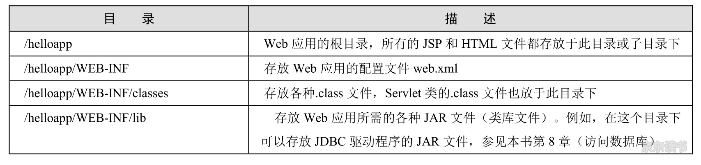

### Java Web 应用

#### 定义

Oracle 公司的 Servlet 规范对 Java Web 应用做了这样的定义：Java Web 应用由一组 Servlet/JSP、HTML 文件、相关 Java 类，以及其他可以被绑定的资源构成。它可以由各种供应商提供的符合 Servlet 规范的 Servlet 容器中运行。

Java Web 应用可以包含如下内容：

* Servlet 组件

  标准 Servlet 接口的实现类，运行在服务器端，包含了被 Servlet 容器动态调用的程序代码

* JSP 组件

  包含 Java 程序代码的 HTML 文件。运行在服务器端，当客户端请求访问 JSP 文件时，Servlet 容器先把它编译成 Servlet 类，然后动态调用它

* 相关 Java 类

  开发人员自定义的与 web 应用相关的 Java 类

* 静态文件

  存放在服务器的文件系统中，如 HTML、图片等，当客户端请求访问这些文件时，Servlet 容器从本地文件系统中读取这些文件数据，再把它发送到客户端

* web.xml

  Java Web 应用配置文件，位于 Web 应用的 WEB-INF 子目录下

*JavaWeb应用的目录结构*

运行时，Servlet 容器的类先加载 classes 目录下的类，再加载 lib 目录下的 JAR 文件中的类。如果两个目录下存在同名的类，classes 目录下的类具有优先权，浏览器端不可以直接请求访问 WEB-INF 目录下的文件，这些文件只能被服务器端的组件访问