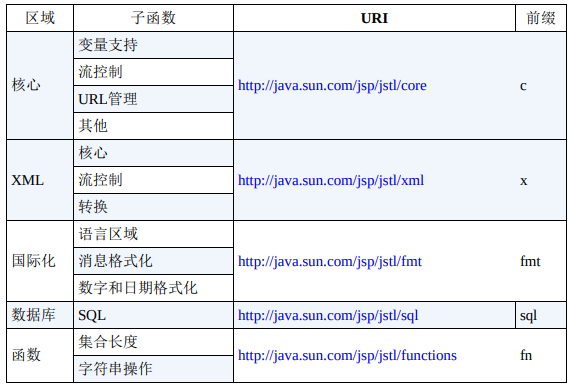

## Java Server Pages

### JSP 概述

JSP 页面本质上是一个 Servlet。用 JSP 页面开发比使用 Servlet 更容易，不必编译 JSP 页面；JSP 页面是以一个以 `.jsp` 为扩展名的文本文件，可以使用任何文本编辑器来编写它们。JSP 页面在 JSP 容器中运行，一个 Servlet 容器通常也是 JSP 容器。当一个 JSP 页面第一次被请求时，Servlet/JSP 容器主要做以下两件事：

* 转换 JSP 页面到 JSP 页面实现类，该实现类是一个实现 `javax.servlet.jsp.JspPage` 接口或子接口 `javax.servlet.jsp.HttpJspPage` 的 Java 类。`JspPage` 是 `javax.servlet.Servlet` 的子接口，这使得每一个 JSP 页面都是一个 Servlet。该实现类的类名由 `Servlet/JSP` 容器生成。如果出现转换错误，则相关错误信息将被发送到客户端

* 如果转换成功，`Servlet/JSP` 容器随后编译该 `Servlet` 类，并装载和实例化该类，像其他正常的 `Servlet` 一样执行生命周期操作

对于同一个 JSP 页面的后续请求，Servlet/JSP 容器会先检查 JSP 页面是否被修改过。如果是，则该 JSP 页面会被重新翻译，编译并执行。如果不是，则执行已经在内存中的 JSP Servlet。一个 JSP 页面的第一次调用的实际花费总比后来的 花费多，因为它涉及翻译和编译。为了解决这个问题，可以执行下了动作之一：

* 配置应用程序，使所有的 JSP 页面在应用程序启动时被调用，而不是在第一次请求时调用

* 预编译 JSP 页面，并将其部署为 Servlet

JSP 自带的 API 包含 4 个包：

* `javax.servlet.jsp` 包含用于 `Servlet/JSP` 容器将 JSP 页面翻译为 `Servlet` 的核心类和接口。其中的两个重要成员为 `JspPage` 和 `HttpJspPage` 接口。所有的 JSP 页面实现类必须实现 `JspPage` 或 `HttpJspPage` 接口。

* `javax.servlet.jsp.tagext` 包括用于开发自定义标签的类型

* `javax.el` 提供统一表达式语言的 API

* `javax.servlet.jsp.el` 提供了一组必须由 `Servlet/JSP` 容器支持，以在 JSP 页面中使用表达式语言的类

### JSP 指令

指令是 JSP 语法元素的第一种类型。它们指示 JSP 转换器如何翻译 JSP 页面为 Servlet。

#### page 指令

可以使用 page 指令来控制 JSP 转换器转换当前 JSP 页面的某些方面。如 JSP 用于转换隐式对象 out 的缓冲器的大小、内容类型及需要导入的 Java 类型等等。

page 指令的语法如下：

```jsp
<%@ page attribute1="value" attribute2="value2" ...%>
```

@ 和 page 间的空格不是必须的，`attribute1`、`attribute2` 是 page 指令的属性，page 指令属性列表：

* import

  定义一个或多个本页面中将被导入和使用的 java 类型。可以通过在两个类型间加入 `,` 分隔符来导入多个类型。JSP 默认导入：`java.lang, javax.servlet, javax.servlet.http, javax.servlet.jsp`

* session

  值为 True，本页面加入会话管理；值为 False 则相反。默认值为 True，访问该页面时，若当前不存在 `javax.servlet.http.HttpSession` 实例，则会创建一个

* buffer

  以 KB 为单位，定义隐式对象 out 的缓冲大小。必须以 KB 后缀结尾。默认大小为 8 KB 或更大（取决于 JSP 容器）。该值可为 none，即无缓冲，所有数据将直接写入 `PrintWriter`

* autoFlush

  默认值为 True。若值为 True，则当输出缓冲满时会自动写入输出流。而值为 False，则仅当调用隐式对象的 `flush ` 方法时，才会写入输出流。因此，若缓冲溢出，则会抛出异常

* isThreadSafe

  定义该页面的线程安全级别。不推荐使用，使用该参数，会生成一些 Servlet 容器已过期的代码

* info

  返回调用容器生成的 Servlet 类的 `getServletInfo` 方法的结果

* errorPage

  定义当出错时用来处理错误的页面

* isErrorPage

  标识本页是一个错误处理页面

* contentType

  定义本页面隐式对象 response 的内容类型，默认是 text/html

* pageEncoding

  定义本页面的字符编码，默认是 ISO-8859-1

* isELlgnored

  配置是否忽略 Expression Language 表达式。

* language

  定义本页面的脚本语言类型，默认是 Java

* extends

  定义 JSP 实现类要继承的父类。这个属性的一般不使用

* deferredSyntaxAllowedAsLiteral

  定义是否解析字符串中出现 `#{`，默认是 False

* trimDirectiveWhitespaces

  定义是否不输出多余的空格/空行，默认是 False

大部分 page 指令可以出现在页面的任何位置，但当 page 指令包含 `contentType` 或 `pageEncoding` 属性时，其必须出现在 Java 代码发送任何内容之前。因为内容类型和字符编码必须在发送任何内容前设定。page 指令也可以出现多次，但出现多次的指令属性必须具有相同的值（除 import 属性，多个包含 import 属性的 page 指令的结果是累加的）。

#### include 指令

可以使用 include 指令将其他文件中的内容包含到当前 JSP 页面。一个页面中可以有多个 include 指令。若存在一个内容会在多个不同页面中使用或一个页面不同位置使用的场景，则将该内容模块化到一个 include 文件非常有用

```jsp
<%@ include file="url" %>
```

URL 为被包含文件的相对路径，若 URL 以一个斜杠 `/` 开始，则该 URL 为文件在服务器上的绝对路径，否则为当前 JSP 页面的相对路径。JSP 转换器处理 `include` 指令时，将指令替换为指令所包含文件的内容。

### 脚本元素

一个脚本程序是一个 Java 代码块，以 `<%` 符合开始，以 `%>` 符合结束。

##### 表达式

每个表达式都会被 JSP 容器执行，并使用隐式对象 out 的打印方法输出结果。表达式以 `<%=` 开始，并以 `%>` 结束。表达式无须分号结尾

```jsp
Today is <%=java.util.Calendar.getInstance().getTime()%>
```

##### 声明

可以声明能在 JSP 页面中使用的变量和方法。声明以 `<%!` 开始，以 `%>` 结束。在 JSP 页面中，一个声明可以出现在任何地方，并且一个页面可以有多个声明。可以使用声明来重写 JSP 页面，实现类的 init 和 destroy 方法。通过声明 jspInit 方法，来重写 init 方法。通过声明 jspDestroy 方法，来重写 destory 方法。

* jspInit

  类似于 `javax.servlet.Servlet` 的 `init` 方法。JSP 页面在初始化时调用 `jspInit`。不同于 `init` 方法，`jspInit` 没有参数。还可以通过隐式对象 `config` 访问 `ServletConfig` 对象

* jspDestroy

  类似 Servlet 的 `destroy` 方法，在 JSP 页面将被销毁时调用

```jsp
<%!
    public void jspInit() {
        System.out.println("jspInit...");
    }
    public void jspDestroy() {
        System.out.println("jspDestroy...");
    }
%>
```

##### 禁用脚本元素

推荐的实践是：在 JSP 页面中用 EL 访问服务器端对象且不写 Java 代码。从 JSP 2.0 起，可以通过在部署描述符中的 `<jsp-property-group>` 定义一个 `scripting-invalid` 元素，来禁用脚本元素

```xml
<jsp-property-group>
    <url-pattern>*.jsp</url-pattern>
    <scription-invalid>true</scripting-invalid>
</jsp-property-group>
```

### 动作

动作是第三种类型的语法元素，它们被转换成 Java 代码来执行操作，如访问一个 Java 对象或调用方法。除标准外，还可以创建自定义标签执行某些操作

##### useBean

useBean 将创建一个关联 Java duix的脚本变量。这是早期分离的表示层和业务逻辑的手段。随着其他技术的发展，如自定义标签和表达语言，现在很少使用 useBean 方式

##### setProperty 和 getProperty

`setProperty` 动作可对一个 Java 对象设置属性，而 `getProperty` 则会获取 Java 对象的一个属性。

##### include

include 动作用来动态地引入另一个资源，可以引入另一个 JSP 页面，也可以引入一个 Servlet 或一个静态的 HTML 页面。对于 include 指令，资源引入发生在页面转换时，即当 JSP 容器将页面转换为生成的 Servlet 时。而对于 include 动作，资源引入发生在请求页面时，include 动作可以传递参数，而 include 指令不能；include 指令对引入的文件扩展名不做特殊要求。但对于 include 动作，若引入的文件需以 JSP 页面处理，则其文件扩展名必须是 JSP。若使用 `.jspf` 为扩展名，则该页面被当作静态文件

##### forward

forward 将当前页面转向到其他资源

### 错误处理

JSP 提供良好的错误处理能力，除了在 Java 代码中使用 try 语句，还可以指定一个特殊页面。当页面遇到未捕获的异常时，将显示该页面。使用 page 指令的 `isErrorPage` 属性（属性值必须为 True）来标识一个 JSP 页面是错误页面。其他需要防止未捕获的异常的页面使用 page 指令的 errorPage 属性来指向错误处理页面

### 表达式语言

JSP 2.0 支持表达式语言（EL），JSP 用户可以用它来访问应用程序数据。EL 可以轻松地编写免脚本的 JSP 页面，即页面不使用任何 JSP 声明、表达式或 scriptlets。

#### 表达式语言语法

EL 表达式以 `${` 开头，`}` 结束。对于一系列的表达式，它们的取值将是从左到右进行，计算结果的类型为 String，并且连接在一起。如果在定制标签的属性值中使用 EL 表达式，那么该表达式的取值结果字符串将会强制变成该属性需要的类型。

* 表达式关键字

   `and`, `eq`, `gt`, `true`, `instanceof`, `or`, `ne`, `le`, `false`, `empty`, `not`, `lt`, `ge`, `null` `div`, `mod`

* `[]` 和 `.` 运算符

  EL 表达式可以返回任意类型的值。如果 EL 表达式的结果是一个带有属性的对象，则可以利用 `[]` 或者 `.` 运算符来访问该属性，如果 `propertyName` 不是有效的 Java 变量名，只能使用 `[]` 运算符。如果对象的属性是带有属性的另一个对象，则既也可用 `[]` 或 `.` 来访问对象属性对象的属性。

* 算术运算符
 
  加（`+`）减（`-`）、乘（`*`）、除（`/` 或 `div`）、取模（`%` 或 `mod`）

* 逻辑运算符

  `&&`、`and`、`||`、`or`、`!`、`not`

* 关系运算符

  等于（`==` 或 `eq`）、不等于（`!=` 或 `ne`）、大于（`>` 或 `gt`)、大于等于（`>=` 或 `ge`）、小于（`<` 或 `lt`）、小于等于（`<=` 或 `le`）

* empty 运算符

  empty 运算符用来检查某一个值是否为 null 或者 empty：`${empty x}` 如果 X 为 null，或者 x 是一个长度为 0 的字符串，该表达式返回 true。x 是一个空 Map、空数组或者空集合、返回 true，否则返回 false

#### 表达式取值规则

  EL 表达式的取值是从左到右进行的。对于 `expr-a[expr-b]` 形式的表达式，其 EL 表达式的取值方法如下： 
  
  * 先计算 `expr-a` 得到 `value-a`
  
  * 如果 `value-a` 为 `null`，则返回 `null`，
  
  * 然后计算 `expr-b` 得到 `value-b`
  
  * 如果 `value-b` 为 `null`，则返回 `null`
  
  * 如果 `value-a` 为 `java.util.Map`，则会查看 `value-b` 是否为 `Map` 中的一个 `key`。若是，则返`value-a.get(value-b)`，若不是，则返回 `null`；
  
  * 如果 `value-a` 为 `java.util.List`，或者假如它是一个 `array`，则进行如下处理：

    强制 `value-b` 为 `int`，如果强制失败，则抛出异常

    如果 `value-a.get（value-b)` 抛出 `IndexOutOfBoundsException`，或者抛出 `ArrayIndexOutOfBoundsException`，则返回 null

    如 `value-a` 是一个 List，则返回 `value-a.get(value-b)`，若 `value-a` 是一个 `array`，则返回 `Array.get(value-a, value-b)`

  * 如果 `value-a` 不是一个 `Map`, `List` 或 `Array`，则 `value-a` 必须是一个 `JavaBean`。此时，必须强制 `value-b` 为 `String`。如果 `value-b` 是 `value-a` 的一个可读属性，则要调用该属性的 `getter` 方法，从中返回值。如果 `getter` 方法抛出异常，该表达式就是无效的，否则，该表达式有效

#### 访问 JavaBean

  使用 `.` 或 `[]` 来访问 bean 属性及属性对象的属性

#### EL 隐式对象

  在 JSP 页面中，可以利用 JSP 脚本来访问 JSP 隐式对象。但是，在免脚本的 JSP 页面中，则不可能访问这些隐式对象。EL 允许通过提供一组它自己的隐式对象来访问不同的对象

##### pageContent

  pageContext 对象表示当前 JSP 页面的 `javax.servlet.jsp.PageContext`。包含所有其他 JSP 隐式对象，JSP 隐式对象对应 EL 中类型

  * request 对应 javax.servlet.http.HttpServlet

  * response 对应 javax.servlet.http.HttpServletResponse

  * Out 对应 javax.servlet.jsp.JspWriter

  * session 对应 javax.servlet.http.HttpSession

  * application 对应 javax.servlet.ServletContext

  * config 对应 javax.servlet.Servlet.Config

  * PageContext 对应 javax.servlet.jsp.PageContext

  * page 对应 javax.servlet.jsp.HttpJspPage

  * exception 对应 java.lang.Throwable

##### initParam

    隐式对象 initParam 用户获取上下文参数的值，包含所有环境初始化参数，并用参数名作为 key 的 Map

##### param

    隐式对象 `param` 用户获取请求参数值。包含所有请求参数的 Map，并用参数名作为 `key` 的 Map。每个 `key` 的值就是指定名称的第一个参数值。如果两个请求参数同名，则只有第一个能够利用 `param` 取值。用 `params()` 访问同名参数的所有参数值

##### paramValues

    获取所有请求参数的所有值的 Map，参数名称为 key，值为字符串数组，包含对应 key 的所有值，如果该 key 对应只有一个 值，返回一个元素的数组

##### header

    包含请求 header，并用 header 名作为 key 的 Map，每个 key 的值就是指定标题名称的第一个标题。如果一个标题的值不止一个，则只返回第一个值。获得多个值的标题，需用 `headerValues` 对象替代

##### headerValues

    包含请求标题，并用标题名作为 key 的 Map。每个 key 的值就是一个字符串数组，其中包含了指定标题名称的所有参数值

##### cookie

    包含当前 HttpServletRequest 中所有 Cookie 对象的 Map。Cookie 名称就是 key 名称，并且每个 key 都映射到一个 Cookie 对象。 `${cookie.jsessionid.value}`
##### applicationScope、sessionScope、requestScope、pageScope

  * applicationScope

    包含 ServletContext 对象中所有属性的 Map，并用属性名称作为 key

  * sessionScope

    包含 HttpSession 对象中所有属性的 Map，并用属性名称作为 key

  * requestScope

    包含了当前 HttpServletRequest 对象中的所有属性，属性名为 key 的 Map

  * pageScope

    包含全页面范围内的所有属性，属性名称为 key 的 Map

#### 配置 EL

##### 免脚本的 JSP 页面

要关闭 JSP 页面中的脚本元素，要使用 `jsp-property-group` 元素以及 `url-pattern` 和 `scripting-invalid` 两哥子元素，`url-pattern` 元素定义禁用脚本要应用的 URL 样式

```xml
// 将应用程序中所有 JSP 页面的脚本关闭
<jsp-config>
    <jsp-property-group>
        <url-pattern>*.jsp</url-pattern>
        <scripting-invalid>true</scripting-invalid>
    </jsp-property-group>
</jsp-config>    
```

在部署描述符中只能有一个 `jsp-config` 元素。如果已经为禁用 EL 而定义了一个 `jsp-property-group`，就必须在同一个 `jsp-config` 元素下，为禁用脚本而编写 `jsp-property-group`

##### 禁用 EL 计算

当需要在 JSP 2.0 及其更高版本的容器中部署 JSP1.2 应用程序时，可能需要禁用 JSP 页面中的 EL 计算。此时，一旦出现 EL 架构，就不会作为一个 EL 表达式进行计算。目前有两种方式可以禁用 JSP 中的 EL 计算。

* 将 page 指令的 `isELlgnored` 属性设为 true

  ```jsp
  <%@ page isELIgnored="true" %>
  ```

  `isELIgnored` 属性的默认值为 false，如果想在一个或者几个 JSP 页面中关闭 EL 表达式计算，建议使用 `isELIgnored` 属性

* 在部署描述符中使用 `jsp-property-group` 元素，`jsp-property-group` 元素时 `jsp-config` 元素的子元素。利用 `jsp-property-group` 可以将某些设置应用到应用程序中的一组 JSP 页面中，为了利用 `jsp-property-group` 元素禁用 EL 计算，还必须有 `url-pattern` 和 `el-ignored` 两个子元素。`url-pattern` 元素用于定义 EL 禁用要应用的 URL 样式。`el-ignored` 元素必须设为 true

  ```xml
  <jsp-config>
      <jsp-property-group>
          <url-pattern>*.jsp</url-pattern>
          <el-ignored>true</el-ignored>
      </jsp-property-group>
  </jsp-config>
  ```

无论是将其 page 指令的 `isELIgnored` 属性设为 true，还是将其 URL 与子元素 `el-ignored` 设为 true 的 `jsp-property-group` 元素中的模式相匹配，都将禁用 JSP 页面中的 EL 计算。如果将一个 JSP 页面中的 page 指令的 `isELIgnored` 属性设为 false，但其 URL 与在部署描述符中禁用了 EL 计算的 JSP 页面的模式匹配，那么该页面的 EL 计算也将被禁用。如果使用的是与 Servlet2.3 及其更低版本兼容的部署描述符，那么 EL 计算已经默认关闭，即便使用的是 JSP 2.0 及其更高版本容器。

### JSTL

#### JSP 标准标签库（JavaServer Pages Standard Tag Library)

JSTL 是一个定制标签库的集合，用来解决类似遍历 Map 或集合、条件测试、XML 处理，数据库访问和数据操作等。JSTL 是通过多个标签库来暴露其行为的。

*JSTL标签库*



在 JSP 页面中使用 JSTL 库，格式：

```jsp
<% taglib uri="uri" prefix="prefix" %>
// 使用 core 库
<% taglib uri="http://java.sun.com/jsp/jstl/core" prefix="c" %>
```

JSTL 标签的 body content 可以为 empty, JSP, tagdependent

#### 一般行为

Core 库中用来操作有界变量的 3 哥一般行为：out，set，remove

##### out 标签

out 标签在运算表达式时，是将结果输出到当前的 `JspWriter`，out 的语法有两种形式，即有 `body content` 和没有 `body content`

```jsp
<% tablib uri="http://java.sun.com/jsp/jstl/core", prefix="c" %>
<c:out value="value" [escapeXml="{true|false}"][default="defaultValue"]/>
<c:out value="value" [escapeXml="{true|false}"]>
    default value
</c:out>
```

在标签语法中，`[]` 表示可选的属性。如果值带下划线，则表示为默认值。`out` 的 `body content` 为 JSP。out 标签属性：

* value*+

  对象，要计算的表达式

* escapeXml+

  布尔，表示结果中的字符 `<`、`>`、`'`、`"`、`&` 将被转化成相应的实体码，`&lt;`、`&gt;`、`&#039;`、`&#034`、`&amp;`

* default+

  对象，默认值

如果包含一个或多个特殊字符的字符串没有进行 XML 转义，它的值就无法在浏览器中正常显示。没有通过转义的特殊字符，会使网站易于遭受交叉网站的脚本攻击；

out 中的 default 属性可以赋一个默认值，当赋予其 value 属性的 EL 表达式返回 null 时，就会显示默认值。default 属性可以赋动态值，如果这个动态值返回 null，out 就会显示一个空的字符串

##### set 属性

使用 set 标签，可以完成：

* 创建一个字符串和一个引用该字符串的有界变量

* 创建一个引用现存有界对象的有界变量

* 设置有界对象的属性

如果用 set 创建有界变量，那么，在该标签出现后的整个 JSP　页面中都可以使用该变量。set　标签的语法有 4 种格式。

* 用于创建一个有界变量，并用　`value`　属性在其中定义一个要创建的字符串或者现存有界对象

```jsp
<c:set value="value" var="varName" [scope="{page|request|session|application}"]>
```

* 要创建的字符串或者要引用的有界对象是作为 body content 赋值的

```jsp
<c:set var="varName" [scope="{page|request|session|application}"]>
    body content
</c:set>
```

* 设置有界对象的属性值。target 属性定义有界对象，以及有界对象的 property 属性，对该属性的赋值是通过 value 的属性进行的

```jsp
<c:set target="target" property="propertyName" value"value"/>
// 将字符串 Tokyo 赋予有界对象 address 的 city 属性
<c:set target="${address}" property="city" value="Tokyo"/>
```

* 赋值时作为 body content 完成的

```jsp
<c:set target="target" property="propertyName">
    body content
</c:set>
// 将 Beijing 赋予有界对象 address 的 city 属性
<c:set targett="${address}" property="city">Beijing</c:set>
```

set 标签的属性

* value+

  对象：要创建的字符串，或者要引用的有界对象，或者新的属性值

* var

  字符串：要创建的有界变量

* scope

  字符串：新创建的有界变量的范围

* target+

  对象：其属性要被赋新值的有界对象；这必须时一个 JavaBeans 实例或 java.util.Map 对象

* property+

  字符串：要被赋新值的属性名称