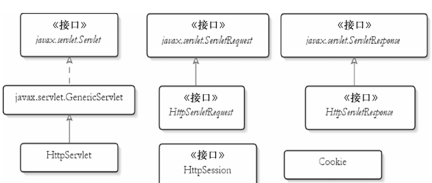

## Servlets

### Servlet API

Servlet API 有 4 个 Java 包：

* `javax.servlet` ，其中包含定义 `Servlet` 和 `Servlet` 容器之间契约的类和接口
* `javax.servlet.http`，其中包含定义 `HTTP Servlet` 和 `Servlet` 容器之间契约的类和接口
* `javax.servlet.annotation`，其中包含 `Servlet`，`Filter`，`Listener` 的注解。它还为被注解元件定义元数据
* `javax.servlet.descriptor`，其中包含提供程序化登录 web 应用程序的配置信息的类型

Servlet 技术的核心是 `Servlet` 接口，它是所有 Servlet 类必须直接或间接实现的一个接口。在编写 `Servlet` 和 `Servlet` 类时，直接实现它。在扩展实现这个接口的类时，间接实现它。`Servlet` 接口定义了 `Servle`t 与 Servlet 容器之间的契约：Servlet 容器将 `Servlet` 类载入内存，并在 `Servlet` 实例上调用具体的方法。在一个应用程序中，每种 `Servlet` 类型只能有一个实例。

* 用户请求使 Servlet 容器调用 `Servlet` 的 `service` 方法，并传入一个 `ServletRequest` 实例和一个 `ServletResponse` 实例。
* `ServletRequest` 中封装了当前的 HTTP 请求，因此，Servlet 开发人员不必解析和操作原始的 HTTP 数据。
* `ServletResponse` 表示当前用户的 HTTP 响应。
* 对于每一个应用程序，`Servlet` 容器还会创建一个 `ServletContext` 实例。这个对象中封装了上下文（应用程序）的环境详情。每个上下文只有一个 `ServletContext` 。
* 每个 `Servlet` 实例也都有一个封装 Servlet 配置的 `ServletConfig`

### Servlet

Servlet 接口中定义了以下 5 个方法

```java
void init(ServletConfig config) throws ServletException
void service(ServletRequest request, ServletResponse response) throws ServletException, java.io.IOException
void destroy()
java.lang.String getServletInfo()
ServletConfig getServletConfig()
```

`init`、`service`、`destroy` 是生命周期方法。Servlet 容器根据以下规则调用：

* `init`，当该 `Servlet` 第一次被请求时，Servlet 容器会调用这个方法。这个在后续请求中不会再被调用。可以利用这个方法执行相应的初始化工作。调用这个方法时，Servlet 容器会传入一个 `ServletConfig`。
* `service` ，每当请求 `Servlet` 时，`Servlet` 容器就会调用这个方法。编写代码时，假设 `Servlet` 要在这里被请求。第一次请求 `Servlet` 时，`Servlet` 容器调用 `init` 方法和 `service` 方法。后续的请求将只调用 `service` 方法
* `destroy`，当要销毁 `Servlet` 时，Servlet 容器就会调用这个方法。当要卸载应用程序，或者要关闭 `Servlet` 容器时，就会发生这种情况。一般会在这个方法中编写清除代码

`getServletInfo` 、`getServletConfig` 为非生命周期方法

* `getServletInfo`，这个方法会返回 `Servlet` 的描述。可以返回任何有用的字符串或 null
* `getServletConfig`，这个方法会返回由 `Servlet` 容器传给 `init` 方法的 `ServletConfig`。但是，为了让 `getServletConfig` 返回一个非 null 值，必须将传给 `init` 方法的 `ServletConfig` 赋给一个类级变量，除非它们是只读的，或者是 `java.util.concurrent.atomic` 包的成员

Servlet 规范提供了 `GenericServlet` 抽象类，可以通过扩展它来实现 Servlet。虽然 Servlet 规范并不在乎通信协议，但大多数的 Servlet 都是在 HTTP 环境中处理的，因此 Servlet 规范还提供了 `HttpServlet ` 来继承 `GenericServlet` ，并且加入了 HTTP 特性。这样可以通过继承 `HTTPServlet` 类来实现自己的 Servlet，不需要实现 `service` 方法，只需实现对应的 HTTP 方法

### Servlet 容器

为了解耦，HTTP 服务器不直接调用 Servlet，而是把请求交给 Servlet 容器来处理

#### 工作流程

当客户端请求某个资源时，HTTP 服务器会用一个 `ServletRequest` 对象把客户的请求信息封装起来，然后调用 Servlet 容器的 `service` 方法，Servlet 容器拿到请求后，根据请求的 URL 和 Servlet 的映射关系，找到相应的 Servlet，如果 Servlet 还没有被加载，就用反射机制创建这个 Servlet，并调用 Servlet 的 `init` 方法来完成初始化，接着调用 Servlet 的`service` 方法来处理请求，把 `ServletResponse` 对象返回给 HTTP 服务器，HTTP 服务器会把响应发送给客户端。

*servlet工作流程*


#### Web应用

Servlet 容器会实例化和调用 Servlet，一般采用 Web 应用程序的方式来部署 Servlet 的，而根据 Servlet 规范，Web 应用程序有一定的目录结构，在这个目录下分别放置了 Servlet 的类文件、配置文件以及静态资源，Servlet容器通过读取配置文件，就能找到并加载 Servlet

*Web应用目录结构*


Servlet 规范里定义了 `ServletContext` 接口来对应一个 Web 应用。Web 应用部署好后，Servlet 容器在启动时会加载 Web 应用，并为每个 Web 应用创建唯一的 `ServletContext` 对象。可以将 `ServletContext` 看成一个全局对象，一个 Web 应用可能有多个 Servlet，这些 Servlet 可以通过全局的 `ServletContext` 来共享数据，这些数据包括 Web 应用的初始化参数、Web 应用目录下的文件资源等。由于 `ServletContext` 持有所有的 Servlet 实例，还可以通过它实现 Servlet 请求的转发

### 扩展机制

引入了 `Servlet` 规范后，不需要关心 `Socket` 网络通信，不需要关心 HTTP 协议，也不需要关心业务类如如何被实例化和调用的，因为这些被 Servlet 规范标准化，**Servlet 规范提供了两种扩展机制 `Filter` 和 `Listener`。Filter 是干预过程的，它是过程的一部分，是基于过程行为的；Listener 是基于状态的，任何行为改变同一个状态，触发的事件是一致的**

##### Filter 过滤器

这个接口允许对请求和响应做一些统一的定制化处理（如根据请求的频率来限制访问）。Web 应用部署完成之后，Servlet 容器需要实例化 Filter 并把 Filter 链接成一个 `FilterChain`，当请求进来时，获取第一个 Filter 并调用 `doFilter` 方法，`doFilter` 方法负责调用这个 `FilterChain` 中的下一个 `Filter`

##### Listener 监听器

当 Web 应用在 `Servlet` 容器中运行时，Servlet 容器内部会不断的发生各种事件，如 `Web` 应用的启动和停止、用户请求到达等。当事件发生时，`Servlet` 容器会负责调用监听器的方法。

### ServletRequest

对于每个 HTTP 请求，Servlet 容器都会创建一个 `ServletRequest` 实例，并将它传给 Servlet 的 `Service` 方法。`ServletRequest` 封装了关于这个请求的信息

```java
# 返回请求主体的字节数。失败 -1
public int getContentLength()
# 返回请求主题的 MIME 类型，失败 null
public String getConteneType()
# 返回指定请求参数的值，失败 null
public String getParameter(String name)()
# 返回 HTTP 协议名称和版本
public String getProtocol()
```

### ServletResponse

`javax.servlet.ServletResponse` 接口表示一个 Servlet 响应，在调用 Servlet 的 `service` 方法前，Servlet 容器首先创建一个 `ServletResponse`，并将它作为第二个参数传给 `service` 方法。`ServletResponse` 隐藏了向浏览器发送响应的复杂过程。

在 `ServletResponse` 中的 `getWriter` 方法，返回了一个可以向客户端发送文本的 `java.io.PrintWriter`，默认情况下，`PrintWriter` 对象使用 ISO-8859-1 编码；`getOutputStream` ，但这个方法是用于发送二进制数据的，因此，大多数情况使用的是 `getWriter` ，而不是 `getOutputStream`；

在发送任何 HTML 标签前，应该先调用 `setContentType` 方法，设置响应的内容类型。

### ServletConfig

当 Servlet 容器初始化 Servlet 时，Servlet 容器会给 Servlet 的 `init` 方法传入一个 `ServletConfig` 。`ServletConfig` 封装可以通过 `@WebServlet` 或者部署描述符传给 `Servlet` 的配置信息。这样传入的每一条信息就叫一个初始参数，一个初参数有 Key 和 value

```java
# 获取参数值
java.lang.String getInitParameter(java.lang.String name)
# 所有初始参数名称的 Enumeration
java.util.Enumeration<java.lang.String> getInitParameterNames()
# 从 Servlet 内部获取 ServletContext
ServletContext getServletContext()
```

### ServletContext

`ServletContext` 表示 Servlet 应用程序。每个 Web 应用程序只有一个上下文。在将一个应用程序同时部署到多个容器的分布式环境中，每台 Java 虚拟机上的 Web 应用都会有一个 `ServletContext`。有了 `ServletContext`，就可以共享从应用程序中的所有资料处访问到的信息，并且可以动态注册 Web 对象。`ServletContext` 将对象保存在 `ServletContext` 中的一个内部 Map 中。保存在 `ServletContext` 中的对象被称作属性。

* `ServletContext` 中的下列方法负责处理属性

  ```java
  java.lang.Object getAttribute(java.lang.String name)
  java.util.Enumeration<java.lang.String> getAttributeNames()
  void setAttribute(java.lang.String name, java.lang.Object object)
  void removeAttribute(java.lang.String name)
  ```

### GenericServlet

`GenericServlet` 抽象类实现了 `Servlet` 和 `ServletConfig` 接口：

* 将 `init` 方法中的 `ServletConfig` 赋给一个类级变量，以便可以通过调用 `getServletConfig` 获取

* 为 `Servlet` 接口中的所有方法提供默认的实现

* 提供方法，包装 `ServletConfig` 中的方法

`GenericServlet` 通过将 `ServletConfig` 赋给 `init` 方法中的类级变量 `servletConfig`，来保存 `ServletConfig`

```java
public void init(ServletConfig servletConfig) throws ServletException {
    this.servletConfig = servletConfig;
    this.init();
}
```

### Http Servlets

`javax.servlet.http` 包是 `Servlet API` 中的第二个包，包含了用于编写 `Servlet` 应用程序的类和接口。`javax.servlet.http` 中的许多类型都覆盖了 `javax.servlet` 中的类型



#### HttpServlet

`HttpServlet` 类覆盖了 `java.servlet.GenericServlet` 类。使用 `HttpServlet` 时，还要使用代表 `Servlet` 请求和 `Servlet` 响应的 `HttpServletRequest` 和 `HttpServletResponse` 对象。`HttpServletRequest` 扩展了 `javax.servlet.ServletRequest`，`HttpServletResponse` 扩展了 `javax.servlet.ServletResponse`。`HttpServlet` 覆盖 `GenericServlet` 中的 `Service` 方法：

```java
protected void service(HttpServletRequest request, HttpServletResponse response) throws ServletException, java.io.IOException {}
/**
 * 原始的 Service 方法将 Servlet 容器的 request 和 response 对象转换成
 * HttpServletRequest 和 HttpServletResponse，并调用新的 Service 方法。
 * 在调用 Servlet 的 Service 方法时，Servlet 容器总会传入一个 HttpServletRequest 和 	    HttpServletResponse，预备使用 HTTP。
*/
public void service(ServletRequest req, ServletResponse res) throws ServletException, IOException {
    HttpServletRequest request;
    HttpServletResponse response;
    try {
        request = (HttpServletRequest) req;
        response = (HttpServletResponse) res;
    } catch (ClassCastException e) {
        throw new ServletException("non-HTTP request or response");
    }
    service(request, response);
}
```

`HttpServlet` 中的 `Service` 方法会检验用来发送请求的 HTTP 方法（通过调用 `request.getMethod`)，并调用 : `doGet`、`doPost`、`doHead`、`doPut`、`doTrace`、`doOptions`、`doDelete`；每一种方法表示一个 HTTP 方法。因此不再需要覆盖 `Service` 方法。只需要覆盖对应的 HTTP 方法即可。

#### HttpServletRequest

HttpServletRequest 表示 HTTP 环境中的 Servlet 请求。扩展了 `ServletRequest` 接口，并新增了：

```java
// 返回请求上下文的请求 URI 部分
java.lang.String getContextPath()
// 返回一个 Cookie 对象数组
Cookie[] getCookie()
// 返回方法名
java.lang.String getMethod()
// 返回指定 header
java.lang.String getHeader(java.lang.String name)
// 返回请求 URL 中的查询字符串
java.lang.String getQueryString()
// 返回session对象，如果没有，将创建一个新的session对象
HttpSession getSession()
// 返回会话对象。如果create为true，将创建一个新的会话对象
HttpSession getSession(boolean create)
```

#### HttpServletResponse

`HttpServletResponse` 表示 HTTP 环境中的 Servlet 响应

```java
// 为响应对象添加 cookie
void addCookie(Cookie cookie)
// 为响应对象添加一个 header
void addHeader(java.lang.String name, java.lang.String value)
// 将浏览器跳转到指定的位置
void sendRedirect(java.lang.String location)
```

#### 部署描述符

* 可以设置 `@WebServlet` 中没有对等元素的元素，如使用 load-on-startup 使得 servlet 在程序启动时加载，而不是第一次调用时加载

* 如果需要修改配置值，不需要重新编译 Servlet 类

* Servlet 上的 `WebServlet` 标注如果同时也在部署描述符中进行声明，依照部署描述符。

#### 会话管理

##### Cookie

Cookies 时一个很少的信息片段，可自动在浏览器和 Web 服务器间交互，因此 cookies 可存储多个页面间传递的信息。Cookie 作为 HTTP header 的一部分，其传输由 HTTP 协议控制。

* `javax.servlet.http.Cookie`

  ```java
  # 创建 cookie
  Cookie cookie = new Cookie(name, value);
  # 设置过期时间
  cookie.maxAge(0);
  # 将 cookie 发送到浏览器
  httpServletResponse.addCookie(cookie);
  # 获取所有 cookie
  httpServletResponse.getCookies();
  ```

##### Session

HttpSession 对象在用户第一次访问网站的时候自动被创建，可以通过调用 `HttpServletRequest` 的 `getSession` 方法获取对象

```java
HttpSession getSession()
HttpSession getSession(bool create)
```

没有参数的 `getSession` 方法会返回当前的 `HttpSession`，若当前没有，则创建一个返回。`getSession(false`) 返回当前的 `HttpSession`，如当前存在，则返回 null，`getSession(true)` 返回当前 `HttpSession`，若当前没有，则创建一个返回

```java
# 设置 session 值，存在则覆盖
void setAttribute(String name, Object value);
# 获取 session 值
Object getAttribute(String name);
# 获取所有 session 值
Enumeration<String> getAttributeNames();
# 获取会话标识
String getId();
# 强制会话过期，并清空保存的对象
void invalidate();
# 获取会话过期时间
int getMaxInactiveInterval();
# 设置超时时间，为 0 则永不过期，直到应用重载或容器关闭
void setMaxInactiveInterval(int seconds);
```

放到 HttpSession 的值不限于 String 类型，可以是任意实现 `java.io.Serializable` 的 java 对象。如果将不支持序列化的对象放入 HttpSession，当 Servlet 容器视图序列化的时候会失败并报错。Servlet 容器为每个 HttpSerssion 生成唯一的标识，并将该标识发送给浏览器，或创建一个名为 `JSESSIONID` 的 `cookie`，或者在URL后附加一个名为 `jsessionid` 的参数。在后续的请求中，浏览器会将标识提交给服务端，这样服务器就可以识别发起请求的用户。Servlet 容器会自动选择一种方式传递会话标识。

#### Servlet 缺点

* 写在 Servlet 中的所有 HTML 标签必须包含 Java 字符串
* 所有的文本和 HTML 标签是硬编码，导致即使是表现层的微小变化，也需要重新编译

### 监听器

Servlet API 提供了一系列的事件和事件监听接口。上层的 `servlet/JSP` 应用能够通过调用这些 API 进行事件驱动的开发。监听的所有事件都继承自 `java.util.Event` 对象。监听器接口可以分为三类：`ServletContext`、`HttpSession`、`ServletRequest`，Servlet 3.0 中出现的新监听器接口 `javax.servlet.AsyncListener`

#### 监听器接口和注册

监听器接口主要在 `javax.servlet` 和 `javax.servlet.http` 包名下，接口如下：

* `javax.servlet.ServletContextListener`

  响应 `ServletContext` 生命周期事件，提供了 ServletContext 创建之后和 ServletContext 关闭之前的会被调用的方法

* `javax.servlet.ServletContextAttributeListener`

  响应 ServletContext 范围的属性添加、删除、替换事件

* `javax.servlet.http.HttpSessionListener`

  能够响应 HttpSession 的创建、超时、失效事件

* `javax.servlet.http.HttpSessionAttributeListener`

  响应 HttpSession 范围的属性添加、删除、替换事件

* `javax.servlet.http.HttpSessionActivationListener`

  在一个 HttpSession 激活或失效时被调用

* `javax.servlet.http.HttpSessionBindingListener`

  实现这个接口来保存 HttpSession 范围的属性，当有属性从 HttpSession 添加或删除时，HttpSessionBindingListener 接口能够做出响应

* `javax.servlet.ServletRequestListener`

  能够响应一个 ServletRequest 的创建或删除

* `javax.servlet.ServletRequestAttributeListener`

  响应 ServletRequest 范围的属性值添加、删除、修改事件

* `javax.servlet.AsyncListener`

  异步操作的监听器

编写一个监听器，只需要写一个 Java 类来实现对应的监听器接口就可以了。在 Servlet3.0 和 Servlet3.1 中提供了两种注册监听器的方法，可以在一个应用中添加多个监听器，这些监听器是同步工作的

* 使用 `WebListener` 注解

  ```jsp
  @WebListener
  public class ListenerClass implements ListenerInterface
  ```

* 在部署描述文档中增加一个 listener 元素

  ```xml
  <listener>
        <listener-class>fully-qualified listener class</listener-class>
  </listener>
  ```

#### Servlet Context 监听器

  ServletContext 的监听器接口有两个：`ServletContextListener` 和 `ServletContextAttributeListener`

##### ServletContextListener

`ServletContextListener` 能对 `ServletContext` 的创建和销毁做出响应。当 `ServletContext` 初始化时，容器会调用所有注册的 `ServletContextListeners` 的 `contextInitialized` 方法，当 `ServletContext` 将要销毁时，容器会调用所有注册的 `ServletContextListeners` 的 `contextDestroyed` 方法

`contextInitialized` 和 `contextDestroyed` 方法都会从容器获取到一个 `ServletContextEvent`，`javax.servlet.ServletContextEvent` 是一个 `java.util.EventObject` 的子类，定义了访问 `ServletContext` 的 `getServletContext` 方法用来获取 `ServletContext`

##### ServletContextAttributeListener

当一个 `ServletContext` 范围的属性被添加、删除、替换时，`ServletContextAttributeListener` 接口的实现列会接收到消息，这个接口定义了如下三个方法：

```java
// ServletContext 范围属性被添加时被容器调用
void attributeAdded(ServletContextAttributeEvent event)
// ServletContext 范围属性被删除时被容器调用
void attributeRemoved(ServletContextAttributeEvent event)
// ServletContext 范围属性被新的替换时被容器调用
void attributeReplaced(ServletContextAttributeEvent event)
```

`ServletContextAttributeEvent` 类继承自 `ServletContextAttribute`，并且增加了获取属性的名称和值的方法

```java
java.lang.String getName()
java.lang.Object getValue()
```

#### Session Listeners

`javax.servlet.http` 包提供了四个 `HttpSession` 相关的监听器接口：`HttpSessionListener`、`HttpSessionActivationListener`、`HttpSessionAttributeListener`、`HttpSessionBindingListener`

##### HttpSessionListener

当一个 HttpSession 创建或销毁时，容器都会通知所有的 HttpSessionListener 监听器，HttpSessionListener 接口有两个方法：`sessionCreated` 和 `sessionDestroyed`，这两个方法

```java
void sessionCreated(HttpSessionEvent event);
void sessionDestroyed(HttpSessionEvent event);
```

这两个方法可以接收到一个继承于 `java.util.Event` 的 `HttpSessionEvent` 对象。可以通过调用 `HttpSessionEvent` 对象的 `getSession` 方法来获取当前的 `HttpSession`

##### HttpSessionAttributeListener

`HttpSessionAttributeListener` 接口和 `ServletContextAttributeListener` 类似，响应的是 `HttpSession` 范围属性的添加、删除和替换，`HttpSessionAttrubuteListener` 接口有以下方法：

```
// HttpSession 范围属性被添加时被容器调用
void attributeAdded(HttpSessionBindingEvent event);
// HttpSession 范围属性被删除时被容器调用
void attributeRemoved(HttpSessionBindingEvent evnet);
// HttpSession 范围属性被新的替换时被容器调用
void attributeReplaced(HttpSessionBindingEvent event);
```

##### HttpSessionActivationListener

在分布式环境下，会用多个容器来进行负载均衡，有可能需要将 session 保存起来，在容器之间传递。这时，容器就会通知所有 `HttpSessionActivationListener` 接口的实现类

```java
void sessionDidActivate(HttpSessionEvent event);
void sessionWillPassivate(HttpSessionEvent event);
```

当 HttpSession 被转移到其他容器之后，`sessionDidActivate` 方法会被调用。容器将一个 `HttpSessionEvent` 方法传递到方法里，可以从这个对象获得 `HttpSession`，当一个 HttpSession 将要失效时，容器会调用 `sessionWillPassivate` 方法。容器将一个 `HttpSessionEvent` 方法传递到方法里，可以通过这个对象获得 HttpSession

##### HttpSessionBindingListener

当有属性绑定或者解绑到 HttpSession 上时，`HttpSessionBindingListener` 监听器会被调用。

```java
void valueBound(HttpSessionBindingEvent event);
void valueUnbound(HttpSessionBindingEvent event);
```

#### ServletRequestListeners

ServletRequest 范围的监听器接口有三个：`ServletRequestListener`、`ServletRequestAttributeListener`、`AsyncListener`

##### ServletRequestListener

ServletRequestListener 监听器会对 ServletRequest 的创建和销毁事件进行响应。容器会通过一个池来存放并重复利用多个 ServletRequest，ServletRequest 的创建是从容器池里被分配出来的时刻开始，而它的销毁时刻时放回容器池的时间。ServletRequestListener 接口有两个方法 `requestInitialized` 和 `requestDestroyed`:

```java
// 创建时调用
void requestInitialized(ServletRequestEvent event);
// 销毁时调用
void requestDestroyed(ServletRequestEvent event);
```

##### ServletRequestAttributeListener

当一个 ServletRequest 范围的属性被添加、删除、替换时，ServletRequestAttributeListener 接口会被调用。ServletRequestAttributeListener 接口提供了三个方法：`atttributeAdded`、`attributeReplaced`、`attributeRemoved`

```java
void attributeAdded(ServletRequestAttributeEvent event);
void attributeRemoved(ServletRequestAttributeEvent event);
void attributeReplaced(ServletRequestAttributeEvent evnet);
```

通过 `ServletRequestAttributeEvent` 类提供的 `getName` 和 `getValue` 方法可以访问到属性的名称和值

### Filters

Filter 是拦截 Request 请求的对象：在用户的请求访问资源前处理 `ServletRequest` 以及 `ServletResponse`，可以勇敢 `Filter` 拦截处理某个资源或者某些资源，`Filter` 的配置可以通过 `Annotation` 或者部署描述符来完成，当一个资源或者某些资源需要被多个 Filter 所使用到，且ta的触发顺序很重要时，只能通过部署描述符来配置

#### Filter API

Filter 的实现必须继承 `javax.servlet.Filter` 接口。这个接口包含了 Filter 的 3 个生命周期：`init`、`doFilter`、`destroy`。Servlet 容器初始化 Filter 时，会触发Filter的 init 方法，一般在应用开始时。init 方法并不是在该 Filter 相关的资源使用到时才初始化的，而且这个方法只调用一次，用于初始化 Filter。

```java
// FilterConfig 实例是由 Servlet 容器传入 init 方法中的
void init(FilterCOnfig filterConfig);
```

当 Servlet 容器每次处理 Filter 相关资源时，都会调用该 Filter 实例的 doFilter 方法。Filter 的 doFilter 方法包含 ServletRequest、ServletResponse、FilterChain

```java
// 在 Filter 的 doFilter 的实现中，最后一行需要调用 FilterChain 中的 doChain 方法。
void doFilter(ServletRequest request, ServletResponse response, FilterChain filterChain);
```