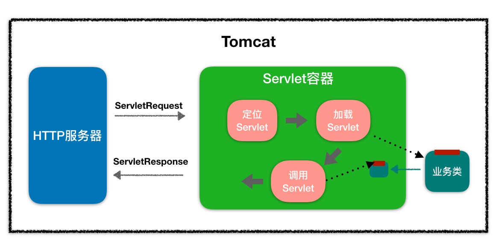
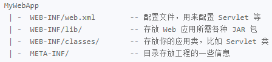

### Servlet 技术

#### Servlet

Servlet 缺点

* 写在 Servlet 中的所有 HTML 标签必须包含 Java 字符串
* 所有的文本和 HTML 标签是硬编码，导致即使是表现层的微小变化，也需要重新编译

##### Servlet 组成包

Servlet API 有 4 个包：

* `javax.servlet` ，其中包含定义 `Servlet` 和 `Servlet` 容器之间契约的类和接口
* `javax.servlet.http`，其中包含定义 `HTTP Servlet` 和 `Servlet` 容器之间契约的类和接口
* `javax.servlet.annotation`，其中包含 `Servlet`，`Filter`，`Listener` 的注解。它还为被注解元件定义元数据
* `javax.servlet.descriptor`，其中包含提供程序化登录 web 应用程序的配置信息的类型

Servlet 技术的核心是 `Servlet` 接口，它是所有 Servlet 类必须直接或间接实现的一个接口。在编写 `Servlet` 和 `Servlet` 类时，直接实现它。在扩展实现这个接口的类时，间接实现它。`Servlet` 接口定义了 `Servlet` 与 Servlet 容器之间的契约：Servlet 容器将 `Servlet` 类载入内存，并在 `Servlet` 实例上调用具体的方法。在一个应用程序中，每种 `Servlet` 类型只能有一个实例。

* 用户请求使 Servlet 容器调用 `Servlet` 的 `service` 方法，并传入一个 `ServletRequest` 实例和一个 `ServletResponse` 实例。
* `ServletRequest` 中封装了当前的 HTTP 请求，因此，Servlet 开发人员不必解析和操作原始的 HTTP 数据。
* `ServletResponse` 表示当前用户的 HTTP 响应。
* 对于每一个应用程序，`Servlet` 容器还会创建一个 `ServletContext` 实例。这个对象中封装了上下文（应用程序）的环境详情。每个上下文只有一个 `ServletContext` 。
* 每个 `Servlet` 实例也都有一个封装 Servlet 配置的 `ServletConfig`

##### Servlet 接口

###### Servlet

Servlet 接口中定义了以下 5 个方法

```java
void init(ServletConfig config) throws ServletException
void service(ServletRequest request, ServletResponse response) throws ServletException, java.io.IOException
void destroy()
java.lang.String getServletInfo()
ServletConfig getServletConfig()
```

`init`、`service`、`destroy` 是生命周期方法。Servlet 容器根据以下规则调用：

* `init`

  当该 `Servlet` 第一次被请求时，Servlet 容器会调用这个方法。这个在后续请求中不会再被调用。可以利用这个方法执行相应的初始化工作。调用这个方法时，Servlet 容器会传入一个 `ServletConfig`。

* `service` 

  每当请求 `Servlet` 时，`Servlet` 容器就会调用这个方法。编写代码时，假设 `Servlet` 要在这里被请求。第一次请求 `Servlet` 时，`Servlet` 容器调用 `init` 方法和 `service` 方法。后续的请求将只调用 `service` 方法

* `destroy`

  当要销毁 `Servlet` 时，Servlet 容器就会调用这个方法。当要卸载应用程序，或者要关闭 `Servlet` 容器时，就会发生这种情况。一般会在这个方法中编写清除代码

`getServletInfo` 、`getServletConfig` 为非生命周期方法

* `getServletInfo`，这个方法会返回 `Servlet` 的描述。可以返回任何有用的字符串或 null
* `getServletConfig`，这个方法会返回由 `Servlet` 容器传给 `init` 方法的 `ServletConfig`。但是，为了让 `getServletConfig` 返回一个非 null 值，必须将传给 `init` 方法的 `ServletConfig` 赋给一个类级变量，除非它们是只读的，或者是 `java.util.concurrent.atomic` 包的成员

Servlet 规范提供了 `GenericServlet` 抽象类，可以通过扩展它来实现 Servlet。虽然 Servlet 规范并不在乎通信协议，但大多数的 Servlet 都是在 HTTP 环境中处理的，因此 Servlet 规范还提供了 `HttpServlet ` 来继承 `GenericServlet` ，并且加入了 HTTP 特性。这样可以通过继承 `HTTPServlet` 类来实现自己的 Servlet，不需要实现 `service` 方法，只需实现对应的 HTTP 方法

###### ServletRequest

对于每个 HTTP 请求，Servlet 容器都会创建一个 `ServletRequest` 实例，并将它传给 Servlet 的 `Service` 方法。`ServletRequest` 封装了关于这个请求的信息

```java
// 返回请求主体的字节数。失败 -1
int getContentLength();
// 返回请求主题的 MIME 类型，失败 null
String getConteneType();
// 返回用于读取请求正文的输入流
ServletInputStream getInputStream();
// 返回服务器端的 IP 地址
String getLocalAddr();
// 返回客户端的 IP 地址
String getRemoteAddr();
// 返回用于读取字符串形式的请求正文的 BufferedReader 对象
BufferdReader getReader();
// 返回指定请求参数的值，失败 null
String getParameter(String name);
// 返回 HTTP 协议名称和版本
String getProtocol();
// 在请求范围内保存一个属性
void setAttribute(String name, Object object);
// 返回对应属性
Object getAttribute(String vr1);
// 从请求范围内删除一个属性
void removeAttribute(String name);
```

###### ServletResponse

`javax.servlet.ServletResponse` 接口表示一个 Servlet 响应，在调用 Servlet 的 `service` 方法前，Servlet 容器首先创建一个 `ServletResponse`，并将它作为第二个参数传给 `service` 方法。`ServletResponse` 隐藏了向浏览器发送响应的复杂过程。

```java
// 设置响应正文的字符编码，默认编码为 ISO-8859-1
void setCharacterEncoding(String charset);
// 设置响应正文长度
void setContentLength(int len);
// 设置响应正文的 MIME 类型
void setContentType(String type);
// 设置缓冲区大小
void setBufferSize(int var);
// 清空缓冲区内的正文数据，并且清空响应状态代码以及响应头
void reset();
// 仅请求缓冲区内的正文数据，不清空响应状态代码以及响应头
void resetBuffer();
// 强制性刷新缓冲区到客户端
void flushBuffer();
// 缓冲区内数据是否已经提交到客户端
boolean isCommited();
// 返回一个 ServletOutputStream 对象，Servlet 用它来输出二进制的正文数据
ServletOutputStream getOutputStream();
// 返回一个 PrintWriter 对象，Servlet 用它来输出字符串形式的正文数据
PrintWriter getWriter();
```

`ServletOutputStream` 和 `PrintWriter` 先把数据写到缓冲区内，在以下情况下，缓冲区内的数据会被提交给客户：

* 缓冲区内数据已满时，会自动把缓冲区内的数据发送给客户端，并且清空缓冲区
* Servlet 调用 `ServletResponse` 对象的 `flushBuffer()` 方法
* Servlet 调用 `ServletOutputStream` 或 `PrintWriter` 对象的 `flush()` 方法或 `close()` 方法

为了确保 `ServletOutputStream` 或 `PrintWriter` 输出的所有数据都会被提交给客户，比较安全的做法是在所有数据都输出完毕后，调用 `ServletOutputStream` 或 `PrintWriter` 的 `close()` 方法。

如果要设置响应正文的MIME类型和字符编码，必须先调用 `ServletResponse` 对象的 `setContentType()` 和`setCharacterEncoding()` 方法，然后再调用 `ServletResponse` 的 `getOutputStream()` 或 `getWriter()` 方法，以及提交缓冲区内的正文数据。只有满足这样的操作顺序，所作的设置才能生

###### ServletConfig

当 Servlet 容器初始化 Servlet 时，Servlet 容器会给 Servlet 的 `init` 方法传入一个 `ServletConfig` 。`ServletConfig` 封装可以通过 `@WebServlet` 或者部署描述符传给 `Servlet` 的配置信息。这样传入的每一条信息就叫一个初始参数，一个初参数有 Key 和 value

```java
// 获取参数值
String getInitParameter(String name);
// 所有初始参数名称的 Enumeration
Enumeration<String> getInitParameterNames();
// 从 Servlet 内部获取 ServletContext
ServletContext getServletContext();
String getServletName();
```

###### ServletContext

`ServletContext` 是 `Servlet` 和 `Servlet` 容器之间进行通信的接口。Servlet 容器为每个 Web 应用程序创建一个 `ServletContext`。在将一个应用程序同时部署到多个容器的分布式环境中，每台 Java 虚拟机上的 Web 应用都会有一个 `ServletContext`。有了 `ServletContext`，可以在 web 应用范围内存取共享数据，并且可以动态注册 Web 对象。`ServletContext` 将对象保存在 `ServletContext` 中的一个内部 Map 中。保存在 `ServletContext` 中的对象被称作属性。

```java
// 在 Web 应用范围内存取共享数据
void setAttribute(String name, Object object);
Object getAttribute(String name);
void removeAttribute(String name);
// 返回一个 Enumeration 对象，该对象包含了所有存放在 ServletContext 中的属性名
Enumeration<String> getAttributeNames();
// 访问当前 Web 应用的资源, 返回当前 web 应用的 URL 入口
String getContextPath();
// 根据给定参数名，返回 web 应用范围内的匹配的初始化参数值，在 web.xml 文件中，直接在 <web-app> 根元素下定义的 <context-param> 元素表示应用范围内的初始化参数
String getInitParameter(String var1);
Enumeration<String> getInitParameterNames();
String getServletContextName();
// 返回一个用于向其他 web 组件转发请求的 RequestDispatcher 对象
RequestDispatcher getRequestDispatcher(String path); 
// 访问 Servlet 容器的相关信息
int getMajorVersion(); // 返回 Servlet 容器支持的 Java Servlet API 的主版本号
int getMinorVersion(); // 返回 Servlet 容器支持的 Java Servlet API 的次版本号
String getServletInfo(); // 返回 Servlet 容器的名字和版本
// 访问服务器端的文件系统资源
String getRealPath(String var1); // 根据参数指定的虚拟路径，返回文件系统中真实路径
URL getResource(String path); 	// 返回映射到参数指定的路径的 URL
// 返回一个用于读取参数指定的文件的输入流
InputStream getResourceAsStream(String var1); 
String getMimeType(String file); // 返回参数指定的文件的 MIME 类型
// 输出日志
void log(String var1);  // 向 Servlet 的日志文件中写日志
void log(String var1, Throwable var2); // 向 Servlet 的日志文件中写错误日志，以及异常堆栈信息
// 获取其他 Web 应用的 ServletContext 对象
ServletContext getContext(String uripath);
```

###### RequestDispatcher

```java
// 把请求转发给目标组件
// 处理流程：情况用于存放响应正文数据的缓冲区，如果目标组件为 Servlet 或 JSP，就调用它们的 service() 方法，把该方法的响应结果发送到客户端；如果目标组件为文件系统中的静态 HTML 文档，就读取文档中的数据并发送到客户端
// 如果源组件在进行请求转发之前，已经提交了响应结果（ServletResponse 的 flushBuffer 方法，或与 ServletResponse 关联的输出六的 close 方法，会抛出 IllegalStateException 异常）
void forward(ServletRequest request, ServletResponse response) throws ServletException, IOException;
// 包含目标组件得响应结果
// 处理流程：如果目标组件为 Servlet 或 JSP，就调用它们的相应的 service() 方法，把该方法产生的响应正文添加到源组件的响应结果中；如果目标组件为 HTML 文档，就直接把文档的内容添加到源组件的响应结果中，返回到源组件的服务方法中，继续执行后续代码块
// 源组件与被包含的目标组件的输出数据都会被添加到响应结果中，在目标组件中对响应状态代码或响应头所做的修改都会被忽略
void include(ServletRequest request, ServletResponse response) throws ServletException, IOException;
```

###### HttpServletRequest

`javax.servlet.http.HttpServletRequest` 接口继承了 `ServletRequest` 接口。定义了 HTTP 环境中的 `Servelt` 请求

```java
// 返回请求的 web 应用的 URL 入口，
String getContextPath();
// 返回一个 Cookie 对象数组
Cookie[] getCookie();
// 返回 HTTP 头对于 header
String getHeader(String var1);
// 返回一个 Enumeration 对象，包含了 HTTP 请求头部的所有项目名
Enumeration<String> getHeaderNames();
// 返回 HTTP 请求方法
String getMethod();
// 返回请求 URL 中的查询字符串
String getQueryString();
// 返回session对象，如果没有，将创建一个新的session对象
HttpSession getSession();
// create为true，等价getSession(),为false,如果会话已存在，返回对象 HttpSession 对象，不存在则返回 null
HttpSession getSession(boolean create);
// 返回 HTTP 请求的头部的第一行的 URI
String getRequestURI();
// 返回请求 part 集合
Collection<Part> getParts() throws IOException, ServletException;
```

###### HttpServletResponse

`javax.servlet.http.HttpServletResponse` 接口继承了 `ServletResponse` 接口，表示 HTTP 环境中的 `Servlet` 响应，提供了设置 HTTP 响应头或向客户端写 Cookie：

```java
// 向 HTTP 响应头中加入一项内容
void addHeader(String var1, String var2); 
// 向客户端发送特定 HTTP 响应状态码
void sendError(int sc);
void sendError(int sc, String msg);
// 设置响应头中的一项内容，将覆盖已存在设置
void setHeader(String var1, String var2);
// 设置响应状态码
void setStatus(int sc);
// 为响应对象添加 cookie
void addCookie(Cookie cookie);
// 将浏览器跳转到指定的位置
void sendRedirect(java.lang.String location);
```

###### Part

```java
// 读取子部分的请求头中特定选项的值，参数 name 用于指定特定的选项
String getHeader(String var1);
Collection<String> getHeaders(String var1);
Collection<String> getHeaderNames();
// 读取子部分请求正文的数据类型
String getContentType();
// 读取子部分的名字，它和 HTML 表单中的 <input> 元素的 name 属性值对应
String getName();
// 读取子部分的请求正文长度，以字节为单位
long size();
// 把子部分的请求正文写道参数 filename 指定的文件中
void write(String var1) throws IOException;
// 重定向 Servlet 源组件生成的响应结果不会被发送到客户端，只有重定向的目标组件生成的响应结果才会被发送到客户端，如果源组件在进行重定向之前，已经提交了响应结果（flushBuffer(), close()) 抛出 IllegalStateException 异常。源组件和目标组件不共享 ServletRequest 对象。location 如果以 / 开头，即相对于当前服务器根路径的URL，如果以 http 开头，即完整 url
void sendRedirect(String location) throws IOException;
```

###### AsyncContext

```java
// 设置异步线程处理请求任务的超时实际（以毫秒为单位），即异步线程必须在 timeout 参数指定的时间内完成任务
void setTimeout(long timeout);
// 启动一个异步线程，执行 run 指定的任务
void start(Runable run);
// 添加一个异步监听器
void addListener(AsyncListener listener);
// 告诉 Servlet 容器任务完成，返回响应结果
void complete();
// 把请求派发给参数 path 指定的 web 组件
void dispatcher(ServletContext context, String path);
// 获取当前上下文中的 ServletRequest 对象
ServletRequest getRequest();
// 获取当前上下文中的 ServleetResponse 对象
ServletResponse getResponse();
```

###### ReadListener

```java
// 输入流中有可读数据时触发此方法
void onDataAvailable() throws IOException;
// 输入流中所有数据读完时触发此方法
void onAllDataRead() throws IOException;
// 输入操作出现错误时触发此方法
void onError(Throwable t);
```

###### WriteListener

```java
// 可以向输出流写数据时触发此方法
void onWritePossible();
// 输出操作出现错误时触发此方法
void onError();
```

###### PushBuilder

```java
// 指定待推送资源的 URL 路径
PushBuilder path(String path);
// 推送
void push();
```

###### HttpSession

```java
// 返回 session Id
String getId();
// 设置会话属性
void setAttribute(String name, Object value);
// 返回会话范围内与参数 name 匹配的属性
Object getAttribute(String name);
// 以数组的方式返回 HttpSession 对象中的所有属性名
Enumeration<String> getAttributeNames();
// 从 HttpSession 对象中删除 name 参数指定的属性
void removeAttribute(String name);
// 判断是否是新创建的会话，是新会话返回 true
boolean isNew();
// 读取当前会话可以处于不活动状态的最长时间，秒为单位
void setMaxInactiveInterval(int interval);
int getMaxInactiveInterval();
// 返回会话所属的 ServletContext 对象
ServletContext getServletContext();
// 使该会话无效，然后取消任何绑定的对象
void invalidate();
```

##### Servlet 抽象类

###### GenericServlet

`javax.servlet.GenericServlet` 抽象类实现了 `Servlet` 和 `ServletConfig` 接口，并作了：

* 声明了类级变量 `ServletConfig config`，以保存 `init` 方法中传参

* 为 `Servlet` 接口中的所有方法提供默认的实现

* 实现 `ServletConfig` 接口中的方法

###### HttpServlet

`javax.servlet.http.HttpServlet` 继承自 `GenericServlet`，实现了 `Service` 方法。并重载了 `Service` 方法，使其基于 `do{HTTP_REQUEST_METHOD}(HttpServletRequest req, HttpServletResponse resp)` 来处理 HTTP 请求与响应。因此使用该抽象类时，处理对应请求动作的 HTTP 请求，只需覆盖对应的 `do{HTTP_REQUEST_METHOD}(HttpServletRequest req, HttpServeltResponse resp)` 方法。

在开发 Web 应用时，自定义的 Servlet 类一般都继承该类。

HttpServlet 类默认情况下不支持会话。Servlet 容器调用 `HttpServlet` 类的服务方法时，会传递一个 `HttpServletRequset` 类型对象，可以使用该对象获取 `HttpSession` 对象

##### Servlet 容器

为了解耦，HTTP 服务器不直接调用 Servlet，而是把请求交给 Servlet 容器来处理

###### 工作流程

当客户端请求某个资源时，HTTP 服务器会用一个 `ServletRequest` 对象把客户的请求信息封装起来，然后调用 Servlet 容器的 `service` 方法，Servlet 容器拿到请求后，根据请求的 URL 和 Servlet 的映射关系，找到相应的 Servlet，如果 Servlet 还没有被加载，就用反射机制创建这个 Servlet，并调用 Servlet 的 `init` 方法来完成初始化，接着调用 Servlet 的 `service` 方法来处理请求，把 `ServletResponse` 对象返回给 HTTP 服务器，HTTP 服务器会把响应发送给客户端。

*servlet工作流程*



###### Web 应用

Servlet 容器会实例化和调用 Servlet，一般采用 Web 应用程序的方式来部署 Servlet 的，而根据 Servlet 规范，Web 应用程序有一定的目录结构，在这个目录下分别放置了 Servlet 的类文件、配置文件以及静态资源，Servlet容器通过读取配置文件，就能找到并加载 Servlet

*Web应用目录结构*



Servlet 规范里定义了 `ServletContext` 接口来对应一个 Web 应用。Web 应用部署好后，Servlet 容器在启动时会加载 Web 应用，并为每个 Web 应用创建唯一的 `ServletContext` 对象。可以将 `ServletContext` 看成一个全局对象，一个 Web 应用可能有多个 Servlet，这些 Servlet 可以通过全局的 `ServletContext` 来共享数据，这些数据包括 Web 应用的初始化参数、Web 应用目录下的文件资源等。由于 `ServletContext` 持有所有的 Servlet 实例，还可以通过它实现 Servlet 请求的转发

###### 转发和包含

Servlet 对象由 Servlet 容器创建，并且 Servlet 对象的 `service()` 方法也由容器调用。一个 Servlet 对象不能直接调用另一个 Servlet 对象的 `service()` 方法。一个 Servlet 对象无法获得另一个 Servlet 对象的引用

在旧版本的 Servlet API 中，ServletContext 接口的  `getServlet(String name)` 方法能根据参数给定的名字返回相应的 Servlet 对象的引用。从 Servlet API 2.1 开始，该方法被废弃。对于支持 Servlet API 2.1 或以上版本的 Servlet 容器，会使得 ServletContext 得实现类 `getServlet(String  name)` 方法总使返回 null，因此一个 Servlet 对象无法再获得另一个 Servlet 对象得引用

Servlet 规范为 web 组件之间得协作提供了两种途径：

* 请求转发

  Servlet （源组件）先对客户请求做一些预处理操作，然后把请求转发给其他 Web 组件（目标组件）来完成包括生成响应结果在内得后续操作

* 包含

  Servlet （源组件）把其他 Web 组件（目标组件）生成得响应结果包含到自身得响应结果中

请求转发与包含具有以下共同特点：

* 源组件和目标组件处理的都是同一个客户请求，源组件和目标组件共享同一个ServletRequest对象和ServletResponse对象。

* 目标组件都可以是Servlet、JSP或HTML文档。

* 都依赖javax.servlet. RequestDispatcher接口。

  Servlet 可以通过两种方式得到 `RequestDispatcher` 对象：调用 `ServletContext` 的 `getRequestDispatcher(String path)` 方法（path 参数必须为绝对路径）；调用 `ServletRequest` 的 `getRequestDispatcher(String path)` 方法（`path` 参数可以为绝对路径，也可以为相对路径）

###### 重定向

在 Java Servlet API 中，HttpServletResponse 接口的 `sendRedirect(String location)` 方法用于重定向。

###### 访问 Servlet 容器内的其他 web 应用

在一个 Servlet 容器进程内的多个 Web 应用可以互相通信。`ServletContext` 接口中的 `getContext(String uripath)` 方法可以得到其他 Web 应用的 `ServletContext` 对象。

多数 Servlet 容器实现可以让用户设置是否允许 Web 应用得到其他 web 应用的 `ServletContext` 对象。在 Tomcat 中，`<Context>` 元素的 `crossContext` 属性用于设置该选项：

* 当 `crossContext` 为 `false` 时，`<Context>` 元素对应的 Web 应用无法得到其他 web 应用的 `ServletContext` 对象，当这个 Web 应用中的 `Servlet` 调用 `getContext(String uripath)` 返回 `null`，默认为 `false`
* 当 `crossContext` 为 `true` 时，`<Context>` 元素对应的 web 应用可以得到其他 web 应用的 `ServletContext` 对象，当这个 Web 应用中的 `Servlet` 调用 `getContext(String uripath)` 返回对应 `ServletContext` 对象

##### Servlet 生命周期

`Servlet` 生命周期由 Servlet 容器来控制。分为：

###### 初始化阶段

Servlet 的初始化阶段包括：

1. Servlet 容器加载 Servlet 类，把它的 `.class` 文件中的数据读入到内存中
2. Servlet 容器创建 `ServletConfig` 对象，`ServletConfig` 对象包含了特定 `Servlet` 的初始化配置信息，如 `Servlet` 的初始化参数。
3. Servlet 容器创建 `Servlet` 对象
4. Servlet 容器调用 `Servlet` 对象的 `init` 方法。

在下列情况之一，Servlet 会进入初始化阶段：

1. 当前 Web 应用处于运行时阶段，特定 Servlet 被客户端首次请求访问。多数 Servlet 都会在这种情况下被 Servlet 容器初始化
2.  如果在 web.xml 中为一个 Servlet 设置了 `<load-on-startup>` 元素，那么当 Servlet 容器启动 Servlet 所属的 Web 应用时，就会初始化这个 Servlet
3. 当 Web 应用被重新启动时，Web 应用中的所有 Servlet 都会在特定的时刻被重新初始化

###### 运行时阶段

在这个阶段，`Servlet` 可以随时响应客户端的请求，当 Servlet 容器收到请求时，Servlet 容器创建针对于该请求的 `ServletRequest` 对象和 `ServletResponse` 对象，然后调用相应 `Servlet` 对象的 `Service()` 方法。

当 Servlet 容器把响应发送给客户端后，Servlet 容器就会销毁 `ServletRequest` 对象和 `ServletResponse` 对象。

###### 销毁阶段

当 web 应用被终止时，Servlet 容器会先调用 Web 应用中 `Servlet` 对象的 `destroy()` 方法，然后再销毁这些 `Servlet` 对象。还会销毁与 `Servlet` 对象关联的 `ServletConfig` 对象

##### Servlet 并发

当多个客户端并发访问 web 应用中的同一个 Servlet，`Servlet` 容器为了保证能同时响应多个客户的要求访问同一个 Servlet 的 HTTP 请求，通常会为每个请求分配一个工作线程，这些工作线程并发执行同一个 Servlet 对象的 `service()` 方法。

一个 HTTP 请求对应一个工作线程，一个 HTTP 请求对应一个类变量

当多个线程并发执行同一个 Servlet 对象的 `service()` 方法时，可能会导致并发问题，在解决并发问题时：

1. 根据实际应用需求，合理决定在 Servlet 中定义的变量的作用域

   局部变量在一个方法中定义，每当一个线程执行局部变量所在的方法，在线程的堆栈中就会创建这个局部变量，当线程执行完该方法，局部变量就结束生命周期。如果同一时刻有多个线程同时执行该方法，那么每个线程都拥有自己的局部变量

   实例变量定义在类，类的每一个实例都拥有自己的实例变量。当一个实例结束生命周期，属于它的实例变量也就结束生命周期。如果

2. 对于多个线程同时访问共享数据而导致并发问题的场合，使用 Java 同步机制对线程进行同步

3. 不建议使用被废弃的 `javax.servlet.SingleThreadModel` 接口

#### 扩展机制

引入了 `Servlet` 规范后，不需要关心 `Socket` 网络通信，不需要关心 HTTP 协议，也不需要关心业务类如如何被实例化和调用的，因为这些被 Servlet 规范标准化，**Servlet 规范提供了两种扩展机制 `Filter` 和 `Listener`。Filter 是干预过程的，它是过程的一部分，是基于过程行为的；Listener 是基于状态的，任何行为改变同一个状态，触发的事件是一致的**

##### Filter 过滤器

这个接口允许对请求和响应做一些统一的定制化处理（如根据请求的频率来限制访问）。Web 应用部署完成之后，Servlet 容器需要实例化 Filter 并把 Filter 链接成一个 `FilterChain`，当请求进来时，获取第一个 Filter 并调用 `doFilter` 方法，`doFilter` 方法负责调用这个 `FilterChain` 中的下一个 `Filter`

Filter 是拦截 Request 请求的对象：在用户的请求访问资源前处理 `ServletRequest` 以及 `ServletResponse`，可以用 `Filter` 拦截处理某个资源或者某些资源，`Filter` 的配置可以通过 `Annotation` 或者部署描述符来完成，当一个资源或者某些资源需要被多个 Filter 所使用到，且它的触发顺序很重要时，只能通过部署描述符来配置

###### Filter API

Filter 的实现必须继承 `javax.servlet.Filter` 接口。这个接口包含了 Filter 的 3 个生命周期：`init`、`doFilter`、`destroy`。Servlet 容器初始化 Filter 时，会触发Filter的 init 方法，一般在应用开始时。init 方法并不是在该 Filter 相关的资源使用到时才初始化的，而且这个方法只调用一次，用于初始化 Filter。

```java
public interface Filter {
    //FilterConfig 实例是由 Servlet 容器传入 init 方法中的
    default void init(FilterConfig filterConfig) throws ServletException {}
  	// 当 Servlet 容器每次处理 Filter 相关资源时，都会调用该 Filter 实例的 doFilter 方法。Filter 的 doFilter 方法包含 ServletRequest、ServletResponse、FilterChain, 在 Filter 的 doFilter 的实现中，最后一行需要调用 FilterChain 中的 doChain 方法。filterChain.doFilter()
    void doFilter(ServletRequest var1, ServletResponse var2, FilterChain var3) throws IOException, ServletException;
  	// // Servlet 容器要销毁 Filter 时触发，一般在应用停止时进行调用
    default void destroy() {}
}
```

一个资源可能需要被多个 Filter 关联到，这时 `Filter.doFilter()` 的方法将触发 `FilterChain` 链条中下一个 `Filter`。只有在 `FilterChain` 链条中最后一个 Filter 里调用 `FilterChain.doFilter()`才会触发处理资源的方法，如果在 `Filter.doFilter()` 的实现中，没有在结尾处调用 `FilterChain.doFilter()` 的方法，那么该 Request 请求中止，后续处理中断。

除非 Filter 在部署描述符中被多次定义到，否则 Servlet 窗口只会为每个 Filter 创建单一实例。由于 Servlet/JSP 的应用通常要处理用户并发请求，此时 Filter 实例需要同时被多个线程所关联到，因此需要处理多线程问题

###### Filter 配置

当完成 Filter 的实现后，就可以开始配置 Filter 了，Filter 的配置需要：

* 确认那些资源需要使用这个 Filter 拦截处理

* 配置 Filter 的初始化参数值，这些参数可以在 `Filter` 的 `init` 方法中读取到

* 给 Filter 取一个名称。可以用来识别 Filter

`javax.servlet.FilterConfig` 接口定义了 `Filter` 配置

```java
public interface FilterConfig {
  	String getFilterName();
  	ServletContext getServletContext();
  	String getInitParameter(String va1);
  	// 获取初始化参数,返回Filter参数名称的Enumeration对象
  	Enumeration<String> getInitParameterNames();
}
```

有两种参数可以配置 Filter：一种是通过 `@WebFilter` 的 Annotation 来配置 Filter，另一种是通过部署描述符来注册。

使用注解配置：

* asyncSupported

  Filter 是否支持异步操作

* description

  Filter 的描述

* dispatcerTypes

  Filter 生效范围

* displayName

  Filter 的显示名

* filterName

  Filter 的名称

* initParams

  Filter 的初始化参数

* largeIcon

  Filter 的大图名称

* servletName

  Filter所生效的Servlet名称

* smallIcon

  Filter 的 icon名称

* urlPatterns

  Filter 所生效的 URL 路径

* value

  Filter 所生效的 URL 路径


```java
@WebFilter(filterName = "Security Filter", urlPatterns = "{ "/ *"}, initParams = {@WebInitParam(name = "frequency" , value = "1909")})
```

使用部署描述符定义：

```xml
<filter>
    <filter-name>Security Filter</filter-name>
    <filter-class>FilterClass<filter-class>
    <init-param>
        <param-name>frequency</param-name>
        <param-value>1909</param-value>
    <init-param>
</filter>
<filter-mapping>
    <filter-name>FilterName</filter-name>
    <url-pattern>/*</url-pattern>
</filter-mapping>
```

如果多个 Filter 应用于同一个资源，Filter 的触发顺序将变得非常重要，此时需要使用部署描述符来管理 Filter，指定那个 Filter 先被触发。Filter 会依照部署描述符中 Filter 配置顺序从上往下执行。每个 Filter 仅有一个实现，如果需要保持或改变 Filter 实现中的状态，需要考虑线程安全问题

##### Listener 监听器

当 Web 应用在 `Servlet` 容器中运行时，Servlet 容器内部会不断的发生各种事件，如 `Web` 应用的启动和停止、用户请求到达等。当事件发生时，`Servlet` 容器会负责调用监听器的方法。

Servlet API 提供了一系列的事件和事件监听接口。上层的 `servlet/JSP` 应用能够通过调用这些 API 进行事件驱动的开发。监听的所有事件都继承自 `java.util.EventListener` 对象。监听器接口可以分为三类：`ServletContext`、`HttpSession`、`ServletRequest`，Servlet 3.0 中出现的新监听器接口 `javax.servlet.AsyncListener`

###### 监听器接口

Servlet Context Listeners

ServletContext 的监听器接口有两个：

* `javax.servlet.ServletContextListener`

  `ServletContextListener` 能对 `ServletContext` 的创建和销毁做出响应（即 web 应用的创建和销毁）。当 `ServletContext` 初始化时，容器会调用所有注册的 `ServletContextListeners` 的 `contextInitialized` 方法，当 `ServletContext` 将要销毁时，容器会调用所有注册的 `ServletContextListeners` 的 `contextDestroyed` 方法

  ```java
  // 当 Servlet 容器启动 web 应用时调用该方法，在调用完该方法之后，容器再对 Filter 初始化，并且
  // 对那些在 web 应用启动时就需要被初始化的 Servlet 进行初始化
  default void contextInitialized(ServletContextEvent sce) {}
  // 当 Servlet 容器终止 web 应用时调用该方法。在调用该方法之前，容器会先销毁所有的 Servlet 和 Filter 过滤器
  default void contextDestroyed(ServletContextEvent sce) {}
  ```

  `contextInitialized` 和 `contextDestroyed` 方法都会从容器获取到一个 `ServletContextEvent`，`javax.servlet.ServletContextEvent` 是一个 `java.util.EventObject` 的子类，定义了访问 `ServletContext` 的 `getServletContext` 方法用来获取 `ServletContext`

* `javax.servlet.ServletContextAttributeListener`

  当一个 `ServletContext` 范围的属性被添加、删除、替换时，`ServletContextAttributeListener` 接口的实现列会接收到消息，这个接口定义了如下三个方法：

  ```java
  // ServletContext 范围属性被添加时被容器调用
  void attributeAdded(ServletContextAttributeEvent event)
  // ServletContext 范围属性被删除时被容器调用
  void attributeRemoved(ServletContextAttributeEvent event)
  // ServletContext 范围属性被新的替换时被容器调用
  void attributeReplaced(ServletContextAttributeEvent event)
  ```

  `ServletContextAttributeEvent` 类继承自 `ServletContextAttribute`，并且增加了获取属性的名称和值的方法

  ```java
  java.lang.String getName()
  java.lang.Object getValue()
  ```

* `javax.servlet.AsyncListener`

  异步操作的监听器

<a id="jump">HttpSession Listeners</a>

`javax.servlet.http` 包提供了四个 `HttpSession` 相关的监听器接口：

* `javax.servlet.http.HttpSessionListener`

  ```java
// 当 Servlet 容器创建了一个会话后，会调用此方法
  void sessionCreated(HttpSessionEvent event);
  // 当 Servlet 容器将要销毁一个会话之前，会调用此方法
  void sessionDestroyed(HttpSessionEvent event);
  ```

* `javax.servlet.http.HttpSessionAttributeListener`

  ```java
// 当 web 应用向一个会话中加入一个新的属性，Servlet 容器会调用此方法
  void attributeAdded(HttpSessionBindingEvent event);
  // 当 web 应用从会话中删除了一个属性，Servlet 容器会调用此方法
  void attributeRemoved(HttpSessionBindingEvent evnet);
  // 当 web 应用替换了会话中的一个已经存在的属性，Servlet 容器会调用此方法
  void attributeReplaced(HttpSessionBindingEvent event);
  ```
  
* `javax.servlet.http.HttpSessionActivationListener`

  ```java
// 当 Servlet 容器把一个会话激活后，会调用此方法
  void sessionDidActivate(HttpSessionEvent event);
  // 当 Servlet 容器将要把一个会话搁置之前，会调用此方法
  void sessionWillPassivate(HttpSessionEvent event);
  ```

* `javax.servlet.http.HttpSessionBindingListener`

  ```java
// 当 web 应用把一个属性与会话绑定后，Servlet 容器会调用此方法
  void valueBound(HttpSessionBindingEvent event);
  // 当 web 应用将要把一个属性与会话解除绑定之前，Servlet 容器会调用此方法
  void valueUnbound(HttpSessionBindingEvent event);
  ```

可以通过调用 `HttpSessionEvent` 、`HttpSessionBindingEvent` 对象的 `getSession` 方法来获取当前的 `HttpSession`

ServletRequest  Listeners

范围的监听器接口：

* `javax.servlet.ServletRequestListener`

  监听 `ServletRequest` 的创建和销毁事件。容器会通过一个池来存放并重复利用多个 `ServletRequest`，`ServletRequest` 的创建是从容器池里被分配出来的时刻开始，而它的销毁时刻是放回容器池的时间。

  ```java
  // 创建时调用
  void requestInitialized(ServletRequestEvent event);
  // 销毁时调用
  void requestDestroyed(ServletRequestEvent event);
  ```

* `javax.servlet.ServletRequestAttributeListener`

  当一个 `ServletRequest` 范围的属性被添加、删除、替换时，ServletRequestAttributeListener 接口会被调用。

  ```java
  void attributeAdded(ServletRequestAttributeEvent event);
  void attributeRemoved(ServletRequestAttributeEvent event);
  void attributeReplaced(ServletRequestAttributeEvent evnet);
  ```

  通过 `ServletRequestAttributeEvent` 类提供的 `getName` 和 `getValue` 方法可以访问到属性的名称和值

###### 注册

编写一个监听器，只需要写一个 Java 类来实现对应的监听器接口就可以了。在 Servlet 3.0 和 Servlet 3.1 中提供了两种注册监听器的方法，可以在一个应用中添加多个监听器，这些监听器是同步工作的

* 使用 `WebListener` 注解

  ```java
  @WebListener
  public class ListenerClass implements ListenerInterface {}
  ```

* 在部署描述文档中增加一个 listener 元素

  ```xml
  <listener>
        <listener-class>fully-qualified listener class</listener-class>
  </listener>
  ```

#### Servlet 注解

从 Servlet 3 开始，在 `javax.servlet.annotation` 包中引入了一组注解类型，可以注解包括 `servlet`，`filter`，`listener` 等 Web 对象，可以直接使用注解配置 web 应用

##### HandlesTypes

这个注解用来声明 `ServletContainerInitializer` 可以处理的类。

* 这个注解只有一个属性 `value`，该值为其可以处理的类

```java
// 该 initializer 可以处理 UsefulServlet
@HandlesTypes({UsefulServlet.class})
public class MyInitializer implements ServletContainerInitializer {

}
```

##### HttpConstraint

表示施加到所有的 HTTP 协议方法的安全约束，且 HTTP 协议方法对应的 `@HttpMethodConstraint` 没有出现在 `@ServletSecurity` 注解中。此注解类型必须包含在 `ServletSecurity` 注解中

* `rolesAllowed` 

  包含授权角色的字符串数组

* `transportGuarantee` 

  连接请求所必须满足的数据保护需求。有效值为 `ServletSecurity.TransportGuarantee` 枚举成员 `CONFIDENTIAL or NONE`

* `value` 

  默认授权

##### HttpMethodConstraint

特定的 HTTP 方法的安全性约束。只能出现在 `ServletSecurity` 注解中

* `emptyRoleSemantic` 

  当 `rolesAllowed` 返回一个空数组，应用默认授权语义。有效值为 `ServletSecurity.EmptyRoleSemantic` 枚举成员 `DENY or PERMIT`

* `rolesAllowed` 

  包含授权角色的字符串数组

* `transportGuarantee` 

  连接请求所必须满足的数据保护需求。有效值为 `ServletSecurity.TransportGuarantee` 枚举成员

* `value` 

  HTTP 协议方法

```java
// 该 servlet 可以被任何用户通过 GET 方法访问，但其他的 HTTP 方法只能被授予经理角色的用户访问
@ServletSecurity(value = @HttpContraint(rolesAllowed = "manager"), httpMethodConstraints = {@HttpMethodConstraint("GET")})
// 该 Servlet 阻止所有通过 Get 方法的访问，但允许所有 member 角色的用户通过其他 HTTP 方法访问
@ServletSecurity(value = @HttpConstraint(rolesAllowed = "member"), httpMethodConstraints = {@HttpMethodConstraint(value = "GET", emptyRoleSemantic = EmptyRoleSemantic.DENY)})
```

##### MultipartConfig

标注一个 Servlet 来指示该 Servlet 实例能够处理的 `multipart/form-data` 的 MIME 类型，在上传文件时通常会用到

* `fileSizeThreshold`

  当文件大小超过指定的大小后将写入到硬盘上

* `location`

  文件保存在服务端的路径

* `maxFileSize`

  允许上传的文件最大值。默认值为 -1，表示没有限制

* `maxRequestSize`

  针对该 `multipart/form-data` 请求的最大数量，默认值为 -1，表示没有限制

##### ServletSecurity

标注一个 Servlet 类在 Servlet 的应用安全约束。出现在 `ServletSecurity` 注解的属性

* `httpMethodConstrains` 

  HTTP 方法的特定限制数组

* `value`

  `HttpConstraint` 定义了应用到没有在 `httpMethodConstraints` 返回的数组中表示的所有 HTTP 方法的保护

##### WebFilter

用于标注一个Filter

* `asyncSupported` 

  是否支持异步处理

* `description`

  描述信息

* `dispatcherTypes`

  指定过滤器的转发模式。具体取值包括：`ASYNC`、`ERROR`、`FORWARD`、`INCLUDE`、`REQUEST`

* `displayName`

  显示名

* `filterName`

  名称

* `initParams`

  初始化参数

* `largeIcon`

  大图

* `ServletNames`

  指定过滤器将应用于那些 Servlet 取值是 `@WebServlet` 中的 `name` 属性的取值或者是 `web.xml` 中 `<servlet-name>` 的取值

* `smallIcon`

  小图

* `urlPatterns`

  URL匹配模式

* `value`

  URL匹配模式，与 `urlPatterns` 不能同时使用

##### WebInitParam

用于传递初始化参数到一个 `Servlet` 或过滤器。

* description

  参数描述

* name

  初始化参数名

* value

  初始化参数值

##### WebListener

标注一个 Listener，唯一属性为 value 是可选的，包括该 Listener 的描述

##### WebServlet

标注一个 Servlet，标注的各个属性和 web.xml 文件中配置 Servlet 的特定元素对应。

|      属性      |       --       |                          描述                          |
| :------------: | :------------: | :----------------------------------------------------: |
|      name      |     String     |  指定 Servlet 名字，等价 `<servlet-name>` ，默认类名   |
|  urlPatterns   |    String[]    | 指定一组 Servlet 的 URL 匹配模式，等价 `<url-pattern>` |
| loadOnStartup  |      int       |   指定 Servlet 的加载顺序，等价 `<load-on-startup>`    |
|   initParams   | WebInitParam[] |   指定一组 Servlet 初始化参数，等价于 `<init-param>`   |
| asyncSupported |    boolean     |  声明 Servlet 是否支持异步，等价 `<async-supported>`   |
|  description   |     String     |     指定 Servlet 的描述信息，等价 `<description>`      |
|  displayName   |     String     |       指定 Servlet 显示名，等价 `<display-name>`       |
|   largeIcon    |     String     |                          大图                          |
|   smallIcon    |     String     |                          小图                          |
|     value      |     String     |         URL 匹配，与 urlPatterns 不能同时使用          |

```java
@Webservlet(name="SerletName", urlPatterns={"/url"}, initParams={@WebInitParam(name="name", value="value")})
```

#### 部署描述符

* 可以设置 `@WebServlet` 中没有对等元素的元素，如使用 load-on-startup 使得 servlet 在程序启动时加载，而不是第一次调用时加载

* 如果需要修改配置值，不需要重新编译 Servlet 类

* Servlet 上的 `WebServlet` 标注如果同时也在部署描述符中进行声明，依照部署描述符。

#### 会话管理

##### Cookie

Cookies 是一个很少的信息片段，可自动在浏览器和 Web 服务器间交互，因此 cookies 可存储多个页面间传递的信息。Cookie 作为 HTTP header 的一部分，其传输由 HTTP 协议控制。

* `javax.servlet.http.Cookie`

  ```java
  // 创建 cookie
  Cookie cookie = new Cookie(name, value);
  // 设置过期时间, expiry > 0 在客户端硬盘上保存 expiry 秒，= 0 删除当前 cookie，< 0 仅会话，默认 -1
  cookie.maxAge(expiry);
  // 将 cookie 发送到浏览器
  httpServletResponse.addCookie(cookie);
  // 获取所有 cookie
  Cookie[] httpServletResponse.getCookies();
  ```

##### Session

Servlet 规范制定了基于 Java 的会话的具体运作机制。在 Servlet API 中定义了代表会话的 `javax.servlet.http.httpSession` 接口。Servlet 容器必须实现这一接口。当一个会话开始时，Servlet 容器将创建一个 `HttpSession` 对象，在 `HttpSession` 对象中可以存放表示客户状态的信息。Sevlet 容器为每个 `HttpSession` 对象分配一个唯一标识符，称为 Session ID

* 当客户请求访问该 Web 组件时，Servlet 容器会自动查找 HTTP 请求中表示 Session ID 的 Cookie，以及向 HTTP 响应结果中添加表示 Session ID 的 Cookie。Servlet 容器还会创建新的 `HttpSession` 对象或者寻找已经存在的与 Session ID 对应的 `HttpSession` 对象
* Web 组件可以访问代表当前会话的 `HttpSession` 对象

`HttpSession` 对象在用户第一次访问网站的时候自动被创建，可以通过调用 `HttpServletRequest` 的 `getSession` 方法获取对象

```java
HttpSession getSession()
HttpSession getSession(bool create)
```

没有参数的 `getSession` 方法会返回当前的 `HttpSession`，若当前没有，则创建一个返回。`getSession(false`) 返回当前的 `HttpSession`，如当前存在，则返回 null，`getSession(true)` 返回当前 `HttpSession`，若当前没有，则创建一个返回

```java
// 设置 session 值，存在则覆盖
void setAttribute(String name, Object value);
// 获取 session 值
Object getAttribute(String name);
// 获取所有 session 值
Enumeration<String> getAttributeNames();
// 获取会话标识
String getId();
// 强制会话过期，并清空保存的对象
void invalidate();
// 获取会话过期时间
int getMaxInactiveInterval();
// 设置超时时间，为 0 则永不过期，直到应用重载或容器关闭
void setMaxInactiveInterval(int seconds);
```

放到 `HttpSession` 的值不限于 String 类型，可以是任意实现 `java.io.Serializable` 的 java 对象。如果将不支持序列化的对象放入 HttpSession，当 Servlet 容器视图序列化的时候会失败并报错。Servlet 容器为每个 `HttpSerssion` 生成唯一的标识，并将该标识发送给浏览器，或创建一个名为 `JSESSIONID` 的 `cookie`，或者在 URL 后附加一个名为 `jsessionid` 的参数。在后续的请求中，浏览器会将标识提交给服务端，这样服务器就可以识别发起请求的用户。Servlet 容器会自动选择一种方式传递会话标识。

##### 会话持久化

持久化会话时，servlet 容器不仅会持久化 `HttpSession` 对象，还会对其所有可以序列化的属性（属性所属的类实现了 `java.io.Serializable` 接口）进行持久化。会话从运行时状态变为持久化状态的过程为搁置（持久化）。在以下情况下，会话会被搁置：

* 服务器终止或单个 web 应用终止，web 应用中的会话被搁置
* 会话处于不过的状态达到了阈值
* web 应用中处于运行时状态的会话数目达到了阈值，部分会话被搁置

会话从持久状态变为运行时状态的过程为激活（加载），以下情况下，会话会被激活

* 服务器重启或单个 web 应用重启时，web 应用中的会话被激活
* 处于会话中的客户端向 web 应用发出 HTTP 请求，相应的会话被激活

会话的搁置和激活对客户端来说是透明的额，当客户端与服务端的一个 web 应用进行会话时，客户端会认为会话始终处于运行时状态

Java Servlet API 并没有为会话的持久化提供标准的接口。会话的持久化完全依赖于 Servlet 容器的具体实现，Tomcat 采用会话管理器来管理会话：

###### 标准会话管理器

`org.apache.catalina.session.StandardManager` 是默认的标准会话管理器。它的实现机制为：当 tomcat 服务器终止或单个 web 应用被终止时，会对被终止的 web 应用的 `HttpSession` 对象进行持久化，把它们保存到文件系统中，默认的文件为：`<CATALINA_HOME>/work/Catalina/[hostname]/[applicationname]/SESSION.ser`

当 Tomcat 服务器重启或单个 web 应用重启时，会激活已经被持久化的 `HttpSession` 对象（将对应 SESSIONS.ser 文件加载到内存中）

###### 持久化会话管理器

`org.apache.catalina.session.PersistentManager` 提供了比 `StandardManager` 更为灵活的管理会话的功能，`PersistentManager` 把存放 `HttpSession` 对象的永久性存储设备称为"会话 Store"，`PersistentManager` 具有以下功能：

* 当 Tomcat 服务器关闭或重启，或者单个 web 应用被重启时，会对 web 应用的 `HttpSession` 对象进行持久化，把它们保存到会话 Store 中
* 具有容错功能，及时把 `HttpSession` 对象备份到会话 Store 中，当 Tomcat 服务器意外关闭后再重启时，可以从会话 Store 中恢复 `HttpSession` 对象
* 可以灵活控制再内存中的 `HttpSession` 对象的数目，将部分 `HttpSession` 对象转移到会话 Store 中

Tomcat 中会话 Store 的接口为 `org.apache.Catalina.Store`，目前提供两个实现这一接口的类：

* `org.apache.Catalina.FileStore`
* `org.apache.Catalina.JDBCStore`

具体配置见 Tomcat 管理会话

##### 会话监听

<a href="#jump">会话监听器接口</a>

#### 异步处理

##### 异步处理

在 Servlet API 3.0 版本之前，Servlet 容器针对每个 HTTP 请求都会分配一个工作线程。即对于每一次 HTTP 请求，Servlet 容器都会从主线程池中取出一个空闲的工作线程，由该线程从头到尾负责处理请求。如果在响应某个 HTTP 请求的过程中涉及到进行 I/O 操作、访问数据库，或其他耗时的操作，那么该工作线程会被长时间占用，只有当工作线程完成了对当前 HTTP 请求的响应，才能释放回线程池以供后续使用

Servlet 或过滤器占有请求处理线程直到它完成任务。当用户并发请求数目超过线程数时，容器可能会发生无可用线程的风险。如果发生这种情况，Tomcat 会堆叠请求，如果有更多的请求进来，它们将被拒绝，直到有空闲资源来处理。

Servlet 3.0 引入了异步处理，异步处理可以节约容器线程，会释放正在等待完成的线程，使该线程被另一请求所使用。

Servlet 异步处理的机制为：Servlet 从 `HttpServletRequest` 对象中获得一个 `AsyncContext` 对象，该对象表示异步处理的上下文。`AsyncContext` 把响应当前请求的任务传给一个新的线程，由这个新的线程来完成对请求的处理并向客户端返回响应结果。最初由 Servlet 容器为 HTTP 请求分配的工作线程便可以及时地释放回主线程池，从而及时处理更高的请求。即把响应请求的任务从一个线程传给另一个线程处理

##### 非阻塞 I/O

Servlet 3.1 引入了非阻塞 I/O 来进一步增强异步处理的性能，它建立在异步处理的基础上，具体实现方式时引入了两个监听器：

* ReadListener 接口：监听 ServletInputStream 输入流的行为
* WriteListener 接口：监听 ServletOutputStream 输出流的行为

在支持异步处理的 Servlet 类中进行非阻塞 IO 操作主要步骤：

1. 在服务方法中从 ServletRequest 对象或 ServletResponse 对象中得到输入流或输出流
2. 为输入流或输出流注册监听器
3. 在监听器中编写包含非阻塞 I/O 操作的代码

##### 异步 servlet 和 filter

`WebServlet` 和 `WebFilter` 注解类型包含新的 `asyncSupport` 属性，将其设置为 true 使其支持异步，也可以在部署文件里面指定这个描述符

```xml
<servlet>
    <servlet-name>AsyncServlet</servlet-name>
    <servlet-class>servletClass</servlet-class>
    <async-supported>true</async-supported>
</servlet>
```

`servlet` 或过滤器要支持异步处理，可以通过调用 `ServletRequest` 的 `startAsync` 方法来启动新线程。`startAsync` 重复调用将返回相同的 `asyncContext`。若一个 Servlet 或过滤器调用 `startAsync` 时不支持异步处理，将抛出 `java.lang.illegalstateException`。`asyncContext` 的 `start` 方法是非阻塞的，所以下一行代码仍将执行，即使还未调度线程启动

```java
AsyncContext startAsync() throws IllegalStateException;
AsyncContext startAsync(ServletRequest servletRequest, ServletResponse servletResponse) throws IllegalStateException;
```

##### 编写异步 Servlet

在异步 Servlet 或过滤器类中操作步骤：

* 调用 `ServletRequest` 中的 `startAsync` 方法，返回一个 `AsyncContext`

* 调用 `AsyncContext` 的 `setTimeout()`，传递容器等待任务完成的超时时间的毫秒数。可选项，如果不设置超时，容器将使用默认的超时时间，如果任务未能在指定的超时时间内完成，将会抛出一个超时异常

* 调用 `asyncContext.start`，传递一个 `Runnable` 来执行一个长时间运行的任务

* 调用 `Runnable` 的 `asyncContext.complete`（完成任务） 或 `asyncContext.dispatch`（把请求派给其他 Web 组件）

##### 异步监听器

Servlet 3.0 增加了 `asyncListener` 接口用于接收异步处理过程中发生事件的通知。AsyncListener 接口定义

```java
// 异步操作启动完毕后调用该方法
void onStartAsync(AsyncEvent event);
// 操作完成后调用
void onComplete(AsyncEvent evnet);
// 失败时调用
void onError(AsyncEvent evnet);
// 超时后调用
void onTimeout(AsyncEvent event);
```

#### 服务器推送

Servlet API 4 版本开始提供对服务器推送的支持，由 PushBuilder 接口来实现