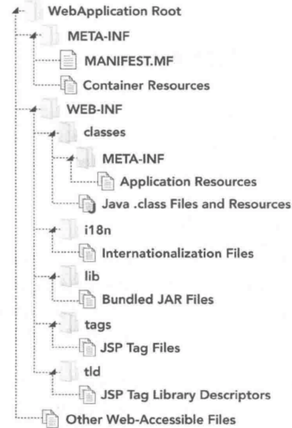

#### 概述

大量的组件共同组成了一个 Java EE Web 应用程序。首先需要自己的代码和它依赖的第三方库，然后需要部署描述符，其中包含了部署和启动程序的命令。还可以添加 `ClassLoader` 用于将自己的应用程序与同一台服务器衫的其他 web 应用程序隔离开。最后，通过某种方式将应用程序打包，生成 WAR 和 EAR 文件

#### 目录结构和 WAR 文件

标准 Java EE Web 应用程序将作为 WAR 文件或者未归档的 Web 应用程序目录进行部署。JAR 文件只是一个简单的 ZIP 格式归档文件，其中包含了可被 JVM 识别的标准目录结构。WAR 是 JavaEE Web 应用程序对应的归档文件

所有的 Java EE Web 应用程序服务器都支持 WAR 文件应用程序归档。大多数服务器还支持未归档的应用程序目录。无论是归档文件还是未归档文件，它们的目录结构约定都是相同的。

*war目录结构*

* 类文件存储在 `/WEB-INF/classes` 中。WEB-INF 目录存储了一些包含了信息和指令的文件，JavaEE Web 应用程序服务器使用它们决定如何部署和运行应用程序。它的 `classes`  目录被用作包的根目录。所有编译后的应用程序类文件和其他资源都被存储在该目录中

* 依赖文件存储在 `/WEB-INF/lib` 中。JAR 文件中所有在该目录中的类对于在应用程序类路径上的应用程序都是可用的

* `/WEB-INF/tags` 存储 JSP 标签文件

* `/WEB-INF/tld` 标签库描述符

* `/WEB-INF/i18n` 国际化和本地化 L10n 文件存储在该目录中

#### 部署描述符

部署描述符是用于描述 Web 应用程序的元数据，并为 Java EE Web 应用程序服务器部署和运行 Web 应用程序提供指令。传统来说，所有元数据都来自于部署描述符文件 `/WEB-INF/web.xml`。该文件通常包含 Servlet、监听器和过滤器的定义，以及 HTTP 会话、JSP 和应用程序的配置选项。

Java EE 6 中 Servlet 3.0 添加了使用注解和 Java Configuration API 配置 Web 应用程序的能。还增加了 Web 片段的概念（应用程序中的 JAR 文件可以包含 Servlet、过滤器和监听器的配置，这些配置将被添加到必要 JAR 文件的部署描述符文件 `/META-INF/web-fragment.xml`）Web 片段也可以使用注解和 Java Configuration API

可以配置 Web 片段的顺序，从而按照特定的顺序扫描和激活它们。可以通过下面两种方式实现：

* 每个 Web 片段的 `web-fragment.xml` 文件中可以包含一个 `<ordering>` 元素，该元素可以使用嵌套的 `<before>` 和 `<after>` 标签来控制该 web 片段在哪个 web 片段之前或之后激活。这些标签包含嵌套的 `<name>` 元素用于指定与当前片段有顺序关系的 Web 片段。`<before>` 和 `<after>` 也可以包含嵌套的 `<others>` 元素，表示该片段应该在任何未指定的片段之前或之后激活。
* 如果未创建特定的 Web 片段，并且不能控制它的内容，那么仍然可以在应用程序的部署描述符中控制 Web 片段的顺序。通过使用 `/WEB-INF/web.xml` 中的 `<absolute-ordering>` 元素与它的嵌套的 `<name>` 和 `<orders>` 元素，可以配置绑定的 Web 片段的绝对顺序，该配置将覆盖来自于 Web 片段的任何顺序指令

默认情况下，Servlet 3.0 及更高版本的环境将扫描 Web 应用程序和 Web 片段中的 Java EE Web 应用程序注解，用于配置 Servlet、监听器、过滤器等。如果需要，可以在根 `<web-app>` 或 `<web-fragment>` 元素中添加特性 `metadata-complete="true"`，禁止扫描和注解配置。还可以在部署描述符中添加元素 `<absolute-ordering>` （不包含任何嵌套元素），禁止应用程序中的所有 Web 片段。

#### 类加载器架构

在标准 Java SE 应用程序中，Java 类使用双亲优先委托模式加载。但它并不完全适用于 Java EE Web 应用程序，运行 Java EE Web 应用程序的服务器通常非常复杂，许多供应商都可以提供其实现。服务器可能使用了与个人应用程序使用的相同的第三方库，但它们的版本可能相互冲突，另外，不同的 Web 应用程序也可能使用了同一第三方库的冲突版本，导致更多问题。为了解决这些问题，需要使用子女优先类加载委托模式

在 Java EE Web 应用程序服务器中，每个 Web 应用程序都被分配了一个自由的相互隔离的类加载器，它们都继承自公共的服务器类加载器。通过隔离不同的应用程序，它们不能访问彼此的类。这不仅消除了类冲突的风险，还是一种阻止 Web 应用程序被其他 Web 应用程序干扰或伤害的安全方式。另外，Web 应用程序类加载器通常会在自己无法加载某个类的时候，请求它的父类加载器帮助加载。通过这种方式，类加载的任务会在最后而不是首先委托给它的父类，Web 应用程序中的类和库会被优先使用，而不是服务器提供的版本优先使用。为了维持绑定的 Java SE 类的安全状态，Web 应用程序类加载器仍然会在尝试加载任何类之前与根类加载器确认。兼容 Java EE 的服务器通常会提供修改委托模式的方法，从父类最后改为父类首先

#### 企业级应用程序归档文件

企业级应用归档将许多 JAR 文件、WAR 文件和配置文件压缩到单个可部署的归档文件中 `ear` 中（使用相同的 ZIP 格式）。在 EAR 文件的根目录中是它所包含的所有 Web 应用程序模块（一个模块对应一个 WAR 文件，这些 WAR 文件与独立的 WAR 文件包含着相同的内容和功能），还可以包含 JAR 库

* `/META-INF`

  包含了归档清单文件，并且该目录中的所有文件都不在应用程序的类路径上。

* `/META-INF/application.xml`

  是特有的部署描述符，用于描述如何部署 EAR 文件中包含的各种不同组件

如同 WAR 文件一样，EAR 也有自己独有的类加载器架构。通常，需要在服务器类加载器和为每个模块分配的 Web 应用程序类加载器直接插入一个额外的类加载器。该类加载器用于将该企业级应用程序与其他企业级应用程序隔离开，但允许单个 EAR 中的多个模块之间共享通用库。Web 应用程序类加载器可以是双亲委托优先模式（优先使用 EAR 库中的类）或子女委托优先（优先使用 WAR 文件中的类）。

EAR 非常有用，是完整 Java EE 规范的一部分，但是大多数只包含 Web 容器的服务器并不支持它。

#### Web 容器

Java EE 规范由许多更小的子规范组成，但大多数 Web 容器都只实现了 Servlet、JSP、JSTL 规范。这不同于实现了完整 Java EE 规范的成熟 Java EE 应用服务器。每个应用服务器都包含一个 Web 容器，用于管理 Servlet 的生命周期、将请求映射到对应的 Servlet 代码、接受和响应 HTTP 请求以及管理过滤器连链。

##### Tomcat

提供了 Servlet、Java Server Page、EL、WebSocket 规范。它不是一个完整的应用服务器，缺少了许多 Java EE 组件。如果需要完整的 Java EE 应用服务器，可以考虑使用 TomEE，它是基于 Tomcat 构建。

##### GlassFish

开源，商业完整的 Java EE 应用服务器实现。提供了 Java EE 规范的所有特性，包括 Web 容器，还是 Java EE 规范的参考实现。

##### JBoss

Red Hat 提供，WildFly 由 JBoss 社区提供免费支持

##### Jetty

社区