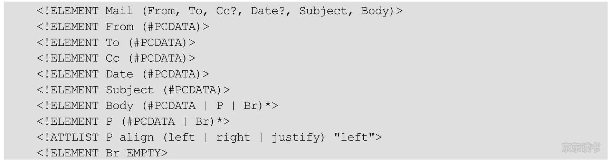

### XML

#### 概述

即可扩展标记语言，是一种可以用来创建自定义标记的标记语言。XML 基于 SGML（Standard Generalized Markup Language）标准通用标记语言。

XML 是可扩展的，可以创建自定义元素以满足需要。是结构化的，每个 XML 文档都基于特定的结构。如果一个文档没有适当的结构，那么就不能认为它是 XML。

#### 文档类型定义

##### 概述

如果要指定文档结构，可以提供一个文档类型定义（DTD）或一个 XML Schema 定义。DTD 或 Schema 包含了用于解释文档应如何构成的规则。这些规则指定了每个元素的合法子元素和属性

```xml
<font>
		<name>helvetica</name>
  	<size>36</size>
</font>
<!-- DTD 定义 -->
<!ELEMENT font (name, size)>
<!-- schema 定义 -->
<xsd:element name="font">
		<xsd:sequence>
      	<xsd:element name="name" type="xsd:string"/>
      	<xsd:element name="size" type="xsd:int"/>
  	</xsd:sequence>
</xsd:element>
```

##### DTD 

###### 定义

DTD（Document Type Definition）是一套定义 XML 标记如何使用的规则，定义了元素、元素的属性和值，以及元素的包含关系，还可以用于定义实体

*E-mail的DTD文件*



对应的 XML 文档具备如下特征：

* `<Mail>` 元素包含一个 `<From>`、一个 `<To>`、一个可选的 `<Cc>`、一个可选的 `<Date>`、一个 `<Subject>`、一个 `<Body>`
* `<From>`、`<To>`、`<Cc>`、`<Date>`、`<Subject>` 元素只包含文本信息
* `<Body>` 元素可以含有文本和零个或多个 `<P>` 和 `<Br>` 元素
* `<P>` 元素可以包含文本和零个或多个 `<Br>` 元素
* `<P>` 元素有一个 `align` 属性，取值范围是 `left`、`justify`、`right`，默认值 `left`
* `<Br>` 元素的内容为空

###### 声明元素

在 DTD 文件中，使用 `<!ELEMENT >` 语法声明元素，

*使用一些特殊符号来修饰元素*

|            规则            |                    描述                    |
| :------------------------: | :----------------------------------------: |
|             E*             |                 0 或多个 E                 |
|             E+             |                 1 或多个 E                 |
|             E?             |                0 或 1 个 E                 |
|         E1\|E2\|E3         |            E1、E2、E3 中的一个             |
|        E1,E2,...En         |            E1 后跟随 E2 直到 En            |
|          #PCDATA           |                    文本                    |
| （#PCDATA\|E1\|E2...\|En)* | 0 或多个文本且E1，E2，...En 以任意顺序排列 |
|            ANY             |               允许任意子元素               |
|           EMPTY            |               不允许有子元素               |
|           无符号           |   子元素在父元素内必须存在且只能存在一次   |

元素说明可以包含嵌套和复杂的正则表达式。当一个元素可以包含文本时，那么只有两种合法情况：要么该元素只包含文本，要么该元素包含任意顺序的文本和标签的组合。（在设计时，其中中所有的元素要么包含其他元素，要么只有文本）

###### 声明属性

可以指定描述合法的元素属性的规则，其语法为：`<!ATTLIST element attribute type default>`

*合法的属性类型*

|                             类型                             |            含义            |
| :----------------------------------------------------------: | :------------------------: |
|                            CDATA                             |         任意字符串         |
|                      （A1\|A2\|...\|An)                      | 字符串属性 A1、A2、An 之一 |
| NMTOKEN（大部分非字母数字空白符不允许使用） NMTOKENS（一个以空白字符分隔的名字标记列表） |      1 或多个名字标记      |
|                              ID                              |       1 个唯一的 ID        |
|        IDREF IDREFS（以空白字符分隔的 ID 引用的列表）        |  1 或多个对唯一 ID 的引用  |
|   ENTITY（属性值将引用一个『未解析的外部实体』） ENTITIES    |    1 或多个未解析的实体    |

*属性默认值*

|  默认值   |                             含义                             |
| :-------: | :----------------------------------------------------------: |
| #REQUIRED |                         属性是必须的                         |
| #IMPLIED  |                         属性是可选的                         |
|     A     |         属性是可选的；若未指定，解析器报告的属性是 A         |
| #FIXED A  | 属性必须是未指定的或者是 A；在这两种情况下，解析器报告的属性都是 A |

```xml-dtd
<!ELEMENT font (name, size)>
<!-- font 元素的 style 属性，有 4 个合法属性值，默认 plain -->
<!ATTLIST font style (plain|bold|italic|bold-italic) "plain">
<!-- size 元素的 unit 属性可以包含任意的字符数据序列 -->
<!ATTLIST size unit CDATA #IMPLIED>
```

###### 声明实体

DTD 可以定义实体，或者定义解析过程中被替换的缩写。

```xml-dtd
<!-- 定义实体 -->
<!ENTITY back.lable "Back">
<!-- 引用实体 -->
<menuitem label="&back.lable;"/>
```

解析器会用替代字符串来替换该实体引用。

###### XML 引用 DTD 文档

XML 解析器将使用这个 DTD 文档来解析 XML 文档。XML 文件开头的 `<! DOCTYPE>` 元素提供了这一功能

* 指定包含 DTD 的 URL

  ```xml
  <?xml version='1.0' standalone='no'>
  <!DOCTYPE Mail SYSTEM "http://mymailsystem.com/DTDS/mail.dtd">
  <Mail>
  		
  </Mail>
  ```

* 在 XML 文档中定义

  这些规则在 DOCTYPE 中声明，位于 `[ ]` 限定块中。文档类型必须匹配根元素的名字。

  ```xml
  <?xml version="1.0"?>
  <!DOCTYPE configuration [
  		<!ELEMENT configuration ...>
  		...
  ]
  <configuration>
  </configuration>
  ```

  


##### Schema

###### 定义

W3C 支持一种基于 XML 的 DTD 代替者，基于 XML 编写，支持数据类型和命名空间，即 XML Schema，可描述 XML 文档的结构，也可作为 XSD（XML Schema Definition）来引用。

```xml
<?xml version='1.0'>
// xs 根元素
<xs:schema>
</xs:schema>
```

###### XML 中引用 Schema

```xml
<?xml version="1.0"?>
<!-- 默认命名空间的声明，告知 schema 验证器，此 XML 文档中使用的所有元素都被声明于该命名空间下 -->
<note xmlns="http://www.runoob.com"
xmlns:xsi="http://www.w3.org/2001/XMLSchema-instance" <!-- 可用的 XML Schema 实例命名空间 -->
xsi:schemaLocation="http://www.runoob.com note.xsd"> <!-- XML实例定位，包含命名空间和xsd位置 -->

<to>Tove</to>
<from>Jani</from>
<heading>Reminder</heading>
<body>Don't forget me this weekend!</body>
</note>
```

#### XML 文档

XML 文档分为两类：

* 简化格式的 XML 文档：其特征为没有相应的 DTD 文档
* 有效的 XML 文档：其特征为必须有相应的 DTD 文档

##### 简化格式的 XML 文档

简化格式的 XML 文档必须遵循：

* 至少有一个元素
* 遵循 XML 规范
* 根元素应该不被其他元素所包含
* 适当的元素嵌套
* 除了保留实体外，所有的实体都要声明

```xml
<?xml version='1.0' standalone='yes'>
```

standalone 属性取值为 yes，表示该 XML 文档是独立的，它不需要特定的 DTD 文件来验证其中的 XML 标记。默认为 no。该属性不是必须的

##### 有效的 XML 文档

有效 XML 文档指的是那些拥有一个DTD 参考文件的 XML 文档。一个有效 XML 文档必须首先是简化格式的 XML文档。而这个文档的 DTD 文件则可以保证 XML 执行程序能正常运行，以及 XML 文档能在支持 XML 的浏览器中正确显示。

##### XML 命名空间

XML 命名空间（xmlns 属性）提供了一种避免元素名冲突的方法（还可以使用前缀解决名字冲突）

#### XML 语法构成

##### 结构

* XML 文档应当以一个文档头开始

  ```xml
  <?xml version="1.0" encoding="UTF-8"?>
  ```

* 文档头之后通常是文档类型定义，文档类型定义是确保文档正确的一个重要机制。但它不是必须的。

* XML 文档的正文包含根元素，根元素包含其他元素。

* 元素可以有子元素和文本或者两者都有。设计 XML 文档结构时，最好让元素要么包含子元素，要么包含文本。

* XML 元素可以包含属性，良好实践是：属性只应该用来修改值的解释，而不是用来指定值。

  ```xml
  <size unit="pt">36</size>
  ```

##### 规范

* XML 是大小写敏感的。

* 在 XML 中结束标签不能省略

* 在 XML 中，只有单个标签而没有相对应的结束标签的元素必须以 `/` 结尾

  ```xml
  
  ```

* 在 XML 中，属性值必须用引号括起来

* 在 XML 中，所有属性必须有属性值

##### 标记

XML 正文包含根元素，根元素包含其他元素，元素可以有子元素，文本或者两者皆有，元素可以包含属性。（最好让元素要么包含子元素，要么包含文本，属性只应该用来修改值的约束，而不是用来指定值）。元素和文本是 XML 文档『主要的支撑要素』，还会遇到其他一些标记：

* 字符引用（character reference）的形式是 &# 十进制值；或 &#x 十六进制值；

* 实体引用（entity reference）的形式是 &name；（小于：&lt、大于：&gt、&：&amp、引号：&quot：省略号：&apos）或在 DTD 中定义其他的实体引用

* CDATA（CDATA Section）部分：用 `<![CDATA[ ]]>` 来限定其界限。它们是字符数据的一种特殊形式。可以使用它们来囊括那些含有 <、>、& 之类字符的字符串，而不必将它们解释为标记，CDATA 部分不能包含字符串 `]]>`

  ```xml
  <data>
  		<![CDATA[<&> are my favorite delimiters]]>
  </data>
  ```

* 处理指令（processing instruction）是那些专门在处理 XML 文档的应用程序中使用的指令，由 <? 和 ?>  来限定其界限。每个 XML 都以一个处理指令开头

* 注释（comment）用 <!- 和 --> 限定其界限，注释不应该含有字符串 --

#### 解析 XML 文档

要处理 XML 文档，要先解析它，解析器工作流程：它读入一个文件，确认这个文件具有正确的格式，然后将其分解成各种元素。Java 库提供了两种 XML 解析器：

* 文档对象模型（Document Object Model，DOM）解析器这样的树形解析器（tree parser），它们将读入的 XML 文档转换成树结构。DOM 解析器的接口已被 W3C 标准化。org.w3c.dom 包中包含了这些接口类型的定义。  
* XML 简单 API（Simple API for XML，SAX）解析器这样的流机制解析器（streaming parser），它们在读入 XML 文档时生成相应的事件

##### 验证 XML 文档

如果要指定文档结构，可以提供一个文档类型定义（DTD）或一个 XML Schema 定义。