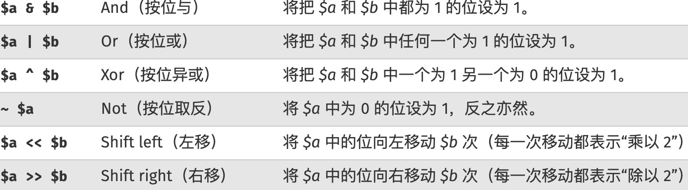
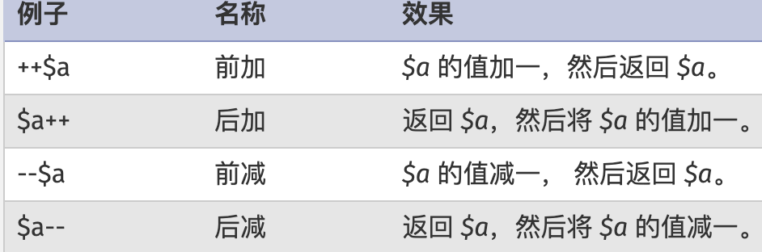
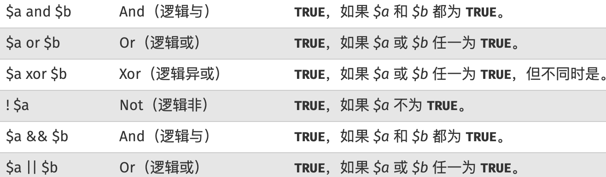
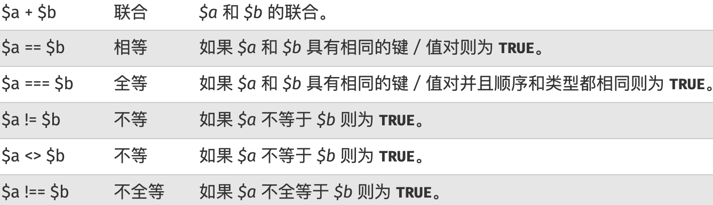

### 基本语法及使用

#### 基本类型

php 的变量使用时直接赋值，无须提前声明，也不能声明一个空变量，php 支持类型：`boolean`，`Integer`，`Float`，`String`，`Array`，`Object`，`Resource`，`Null`，`Callback/Callable`

* boolean

  使用常量 TRUE 或 FALSE，两者都不区分大小写；用 `(bool)` 或 `(boolean)` 来强制转换。大多数情况下不需要用强制转换，当运算符，函数或流程控制结构需要一个 `boolean` 参数时，该值会被自动转换。当转换为 `boolean` 时，以下值被认为是 `FALSE`: `FALSE`，`0`，`0.0`，`""`，`"0"`，`[]`，`NULL`，从空标记生成的 `SimpleXML` 对象；所有其它值都被认为是 TRUE（包括任何资源和 NAN）

* integer

  整形值可以使用十进制，十六进制，八进制，二进制，前面可以加上可选的符号 `-` 或 `+`；要使用八进制数字前必须加 `0`，要使用十六进制，数字前必须加上 `0x`，要使用二进制表达，数字前必须加上 `0b`。不支持无符号 `integer`。`PHP_INT_SIZE` 表示字长，`PHP_INT_MAX` 表示最大值，`PHP_INT_MIN` 表示最小值。


* Float

  永远不要相信浮点数结果精确到了最后一位，也永远不要比较两个浮点数是否相等。如果确实需要更高的精度，应该使用任意精度数学函数或者 gmp 函数。

  要测试浮点数是否相等，要使用一个仅比该数值大一丁点的最小误差值。该值是计算中所能接受的最小的差别值

  ```php
  $a = 1.2345678;
  $b = 1.2345670;
  $epsilon = 0.00001;

  if (abs($a - $b) < $expsilon) {
      echo "true";
  }
  ```


* String

  一个字符串就是由一系列的字符组成，其中每个字符等同于一个字节。PHP 只能支持 256 的字符集，因此不支持 Unicode。String 最大可以达到 2GB。字符串可以用单引号，双引号，`heredoc` 语法结构，`nowdoc` 语法结构

  ```php
  echo <<<EOT
  My name is "$name". I am printing some $foo->foo.
  Now, I am printing some {$foo->bar[1]}.
  This should print a capital 'A': \x41
  EOT;
  ```
  
  `heredoc` 结构类似于双引号字符串，`Nowdoc` 结构类似于单引号字符串。`Nowdoc` 结构不仅下解析操作，标识符要用单引号括起来
  
  ```php
  echo <<<'EOT'
  My name is "$name". I am printing some $foo->foo.
  Now, I am printing some {$foo->bar[1]}.
  This should not print a capital 'A': \x41
  EOT;
  ```
  
  String 中字符可以通过一个从 0 开始的下标，用类似 `array` 结构中的方括号包含对应数字来访问和修改。

* Array

  PHP 中的数组实际上是一个有序映射

  ```php
  $array = [
    	"foo" => "bar",
    	"bar" => "foo",
  ];
  # 访问数组
  echo $array["foo"];
  ```

  `key` 可以是 `integer` 或 `string`。value 可以是任意类型

  - 包含有合法整型值的字符串会被转换为整型。例如键名 *"8"* 实际会被储存为 *8*。但是 *"08"* 则不会强制转换，因为其不是一个合法的十进制数值。
  - 浮点数也会被转换为整型，意味着其小数部分会被舍去。例如键名 *8.7* 实际会被储存为 *8*。
  - 布尔值也会被转换成整型。即键名 *true* 实际会被储存为 *1* 而键名 *false* 会被储存为 *0*。
  - [Null](https://www.php.net/manual/zh/language.types.null.php) 会被转换为空字符串，即键名 *null* 实际会被储存为 *""*。
  - 数组和对象*不能*被用为键名。坚持这么做会导致警告：*Illegal offset type*。

  如果在数组定义中多个单元都使用了同一个键名，则只使用了最后一个，之前的都被覆盖了

  对于任意 integer，float，string，boolean 和 resource 类型，如果将一个值转换为数组，将得到一个仅有一个元素的数组，其下标为 0，该元素即为此标量的值。换句话说，*(array)$scalarValue* 与 *array($scalarValue)* 完全一样。

  如果一个 object 类型转换为 array，则结果为一个数组，其单元为该对象的属性。键名将为成员变量名，不过有几点例外：整数属性不可访问；私有变量前会加上类名作前缀；保护变量前会加上一个 '*' 做前缀。这些前缀的前后都各有一个 吗NULL 字符。这会导致一些不可预知的行为：

* Object

  要创建一个对象，使用 new 语句实例化一个类。 如果将一个对象转换为对象，它将不会有任何变化。如果其它任何类型的值被转换成对象，将会创建一个内置类 `stdClass` 的实例。如果该值为 NULL，则心实例为空。`array` 转换成 `object` 将使键名成为属性名并具有相对应的值。

  ```php
  <?php
  $obj = (object) array('1' => 'foo');
  // 7.2.0 之前的版本，数字键只能通过迭代访问
  var_dump(isset($obj->{'1'})); // PHP 7.2.0 后输出 'bool(true)'，之前版本会输出 'bool(false)' 
  var_dump(key($obj)); // PHP 7.2.0 后输出 'string(1) "1"'，之前版本输出  'int(1)' 
  // 对于其它值，会包含进成员变量名
  $obj = (object) 'ciao';
  echo $obj->sclar; // outputs 'ciao'
  ```

* Resource

  资源是一种特殊变量，保存了到外部资源的一个引用。资源是通过专门的函数来建立和使用的。资源类型变量保存为打开文件，数据库连接，图形画布区域等特殊句柄，因此将其他类型转换为资源没有意义。引用计数系统是 zend 引擎的一部分，可以自动检测到一个资源不再被引用了，这种情况下使用的所有外部资源都会被垃圾回收系统释放。很少需要手工释放内存。持久数据库连接比较特殊，它们不会被垃圾回收系统销毁。

* NULL

  特殊的 NULL 值表示一个变量没有值。NULL 类型唯一可能的值就是 NULL。在下列情况下一个变量被认为是 NULL：被赋值为 NULL，尚未被赋值，被 `unset()`

* Callback/Callable

  5.4 起可用 `callable` 类型指定回调类型 `callback`，一些函数可以接受用户自定义的回调函数作为参数。回掉函数不止可以是简单的函数，还可以是对象的方法。将函数以 `string` 形式传递，可以使用任何内置或用户自定义函数，除了语言结构： `array()`，`echo`，`empty()`，`eval()`，`exit()`，`isset()`，`list()`，`print`，`unset()`。还可以传递匿名函数

#### 运算符

* 算术

  |    例子    | 名称 |                结果                |
  | :--------: | :--: | :--------------------------------: |
  |    -$a     | 取反 |             $a 的负值              |
  | `$a + $b`  | 加法 |             sum(a, b)              |
  | `$a - $b`  | 减法 |             `$a - $b`              |
  | `$a * $b`  | 乘法 |             `$a * $b`              |
  | `$a / $b`  |  除  |                                    |
  | `$a % $b`  | 取模 |                                    |
  | `$a ** $b` | 求幂 | `$a = 2, $b = 4` ; `$a ** $b = 16` |

* 赋值

  `=` 将右边表达式的值赋给左边，赋值运算将原变量的值拷贝到新变量中（传值赋值），改变其中一个并不影响另一个。碰到对象时引用赋值，除非明确指定了 `clone` 关键字来拷贝。

* 位运算

  位移在 PHP 是数据运算，向任何方向移出去的位都被丢去。左移时右侧以零填充，符号位被移走意味着正负号不被保留。右移时左侧以符号位填充，意味着正负号被保留

  *PHP位运算*

  

* 比较

  

* 错误控制运算符

  PHP 支持一个错误控制运算符 `@`，将其放置在一个 PHP 表达式之前，该表达式可能产生的任何错误信息都被忽略掉。

  如果用 `set_error_handler()` 设定了自定义的错误处理函数，仍然会被调用，但是此错误处理函数可以（并且也应该）调用 `error_reporting()` ，而该函数在出错语句前有 `@` 时将返回 0

  如果激活了 `track_errors`（boolean，默认 `"0"`，如果开启，最后一个错误将永远存在变量 `$php_errormsg` 中），表达式所产生的任何错误信息都被存放在变量 `$php_errormsg` 中。此变量在每次出错时都会被覆盖

* 执行运算符

  支持使用反引号 "\`" 作为执行运算符，PHP 将尝试将反引号中的内容作为 shell 命令来执行，并将其输出信息返回。（可以赋给一个变量而不是简单地丢弃到标准输出）。使用反引号运算符的效果于 `shell_exec()` 相同。

  反引号运算符在激活了安全模式或关闭了 `shell_exec()` 时无效，与其他语言不同，反引号不能在双引号字符串中使用

* 递增/递减运算符

  

* 逻辑运算符

  

* 字符串运算符

  连接运算符 `.`，它返回其左右参数连接后的字符串。连接赋值运算符 `.=`，它将右边参数附加到左边的参数之后

* 数组运算符

  

* 类型运算符

  *instanceof* 用来确定一个变量是否属于某一类或接口的实例

* 三元运算符 `?:`

  表达式 *(expr1) ? (expr2) : (expr3)* 在 expr1 求值为 **`TRUE`** 时的值为 expr2，在 expr1 求值为 **`FALSE`** 时的值为 expr3。

  自 PHP 5.3 起，可以省略三元运算符中间那部分。表达式 *expr1 ?: expr3* 在 expr1 求值为 **`TRUE`** 时返回 expr1，否则返回 expr3

* 组合比较 `<=>`

  当 `$a小于、等于、大于$b` 时 分别返回一个小于、等于、大于 0 的 integer 值。 PHP7开始提供

* NULL 合并操作符 `??`

  从左往右第一个存在且不为 **`NULL`** 的操作数。如果都没有定义且不为 **`NULL`**，则返回 **`NULL`**。PHP7开始提供

#### SPL 标准库

用于解决典型问题的一组接口与类的集合

##### 数据结构

* SplDoublyLinkedList
* SplStack
* SplQueue
* SplHeap
* SplMaxHeap
* SplMinHeap
* SplPriorityQueue
* SplFixedArray
* SplObjectStorage

##### 双向链表

双向链表是一个链接到两个方向的节点列表。当底层结构是双向链表时，迭代器的操作、对两端的访问、节点的添加或删除都具有 `O(1)` 的开销。它为栈和队列提供了一个合适的实现

* SplDoublyLinkedList
* SplStack
* SplQueue

##### 堆

堆是遵循堆属性的树状结构：每个节点都大于或等于其子级，使用对堆全局的已实现的比较方法进行比较

* SplHeap
* SplMaxHeap
* SplMinHeap
* SplPriorityQueue

##### 数组

连续存储数据结构，可通过索引进行访问

* SplFixedArray

##### 映射

对象到数据的映射，此映射也可以用作对象集

* SplObjectStorage（对象存储）

#### 异常处理

方法里 try catch finally 的执行顺序

* 不论是否出现异常，`finally` 块中的代码都会执行

* 当 `try` 和 `catch` 中有 `return` 时，`finally` 仍然会执行

* `finally` 是在 `return` 后面的表达式运算后执行的（此时并没有返回运算后的值，而是先把要返回的值保存起来）待 `finally` 执行完毕后再返回保存的值

* `finally` 里包含 `return`, 返回值是 `finally` 中 `return` 代码块的值

```php
try {} catch(){} finally{} return;
```

程序按照顺序依次执行 `try` 中代码，如果不出现异常，执行 `finally` 代码，然后执行 `return` 块中的代码；`try` 中出现异常则执行 `catch` 中的代码后，执行 `finally` 代码，执行最后的 `return` 代码

```php
try {return;} catch() {} finally {} return;
```

程序执行 `try` 块中的 `return` 之前的代码，如果出现异常则执行 `catch` 里的代码，然后执行 `finally` 里面的代码，最后，执行 `return` 代码；如果执行 `try` 块中 `return` 之前的代码没有出现异常，则将返回值保存起来，执行 `finally` 里代码，然后返回 `try` 中 `return` 代码值。

```php
try {} catch() {return;} finally{} return;
```

程序先执行 `try`，如果遇到异常执行 `catch` 块，然后将 `catch` 块中的 `return` 值保存起来，执行 `finally` 里代码，然后返回 `catch` 块的 `return` 值，最后的 `return` 不会执行；如果程序执行 `try` 没有异常，则会执行 `finally` 语句，然后执行最后的 `return` 语句

```php
try {return;} catch() {} finally {return;}
```

程序只会返回 `finally` 的 `return` 语句

```php
try {} catch() {return;} finally {return;}
```

程序只会返回 `finally` 的 `return` 语句