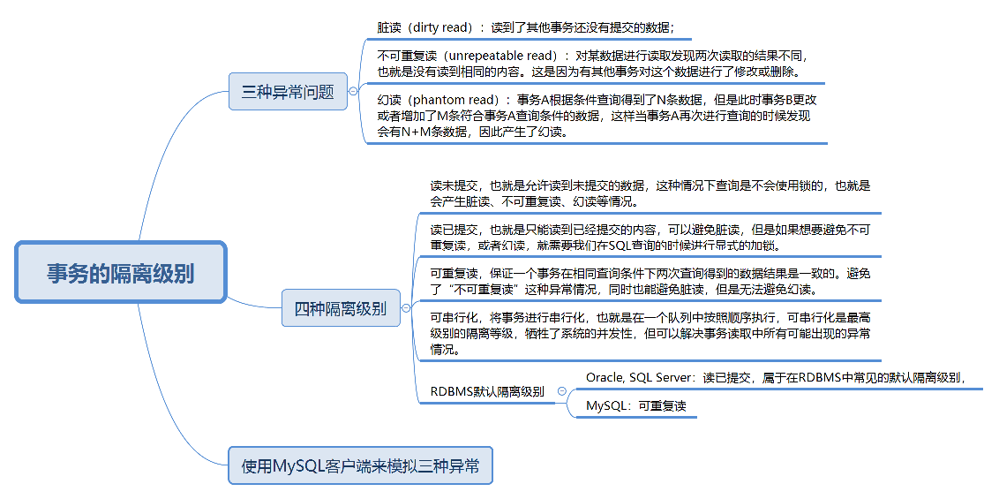

### SQL 事务

#### 事务概览


#### 事务特性ACID

* Atomicity 原子性

  不可分割，事务要么全部执行，要么全部不执行

* Consistency 一致性

  数据库在进行事务操作后，会由原来的一致状态，变成另一种一致状态。即事务提交或回滚后，数据库完整性约束不被破坏

* Isolation 隔离性

  每个事务彼此独立，不受其他事务的执行影响

* Durability 持久性

  事务提交之后对数据的修改是持久性的，即使在系统出故障的情况下，数据修改依然有效。持久性通过事务日志来保证

#### 事务控制

Oracle 支持事务，MySQL 中，部分引擎支持事务，可以通过 `SHOW ENGINES` 命令来查看当前 MySQL 支持的引擎有那些及是否支持事务。

##### 事务控制语句

* `START TRANSACTION` 或 `BEGIN`，显式开启一个事务，在 MySQL 连续 BEGIN，当开启了第一个事务时，还没有进行 COMMIT 提交时，会直接进行第二个事务的 BEGIN，这时数据库会隐式地 COMMIT 第一个事务，然后再进入到第二个事务

* `COMMIT` 提交事务

* `ROLLBACK` 或 `ROLLBACK TO [SAVEPOINT]`

  回滚事务（撤销正在进行的所有没有提交的修改），回滚到某个保存点。ROLLBACK 是针对当前事务的

* `SAVEPOINT`

  在事务中创建保存点，方便后续针对保存点进行回滚，一个事务中可以存在多个保存点

* `RELEASE DAVEPOINT`

  删除某个保存点

* `SET TRANSACTION`

  设置事务的隔离级别

关于事务的 ACID，在使用 COMMIT 和 ROLLBACK 来控制事务的时候，在一个事务的执行过程中可能会失败。遇到失败的时候是进行回滚，还是将事务执行过程中已经成功操作的来进行提交，这个逻辑需要开发者自决：这里开发者可以决定，如果遇到了小错误是直接忽略，提交事务，还是遇到任何错误都进行回滚。如果强行进行 COMMIT，数据库会将这个事务中成功的操作进行提交

##### 显式事务与隐式事务

隐式事务实际上就是自动提交，Oracle 默认不自动提交，需要手写 COMMIT 命令，而 MySQL 默认自动提交，可以配置 MySQL 参数

```sql
# 关闭自动提交
mysql>set autocommit = 0;
# 开启自动提交
mysql>set autocommit = 1;
```

* 当 `autocommit = 0` 时，不论是否采用 `start tansaction` 或 `begin` 的方式来开启事务，都需要用 `COMMIT` 进行提交，让事务生效，使用 `ROLLBACK` 对事务进行回滚

* 当 `autocommint = 1` 时，每条 SQL 语句都会自动进行提交。此时，需要采用 `START TRANSACTION` 或 `BEGIN` 的方式来显式地开启事务，这个事务只有在 `COMMIT` 时才会生效，在 `ROLLBACK` 时才会回滚

MySQL 中的 `completion_type` 参数的作用 `set @@completion_type = 1`

* `completion_type = 0`

  默认情况。当执行 COMMIT 的时候会提交事务，在执行下一个事务时，还需要使用 `START TRANSACTION` 或者 `BEGIN` 来开启。

* `completion_type = 1`

  提交事务后，相当于执行了 `COMMIT AND CHAIN`，即开始了一个链式事务，即提交事务后会开启一个相同隔离级别的事务

* `completion_type = 2`

  这种情况下 `COMMIT = COMMIT AND REPLEASE`，提交后，会自动断开服务器连接

#### 事务隔离级别

##### 事务隔离级别概览



##### 事务并发处理可能存在的异常

设定事务的隔离级别可能存在的问题，即事务并发处理时会存在那些异常情况。SQL-92 标准中已经对 3 种异常情况进行了定义：**脏读（Dirty Read）**, **不可重复读（Nnrepeatable Read）**，**幻读（Phantom Read）**。

* 脏读

  读到了其他事务还没有提交的数据

* 不可重复读

  对某数据进行读取，发现两次读取的结果不同，即没有读到相同的内容。因为有其他事务对这个数据同时进行了修改或删除

* 幻读

  事务 A 根据条件查询得到了 N 条数据，但此时事务 B 更改或者增加了 M 条符合事务 A 查询条件的数据，这样当事务 A 再次进行查询的时候发现会有 N + M 条数据，产生了幻读

不可重复读是同一条记录的内容被修改了，重点在与 UPDATE 或 DELETE，幻读是查询某一个范围的数据行变多了或少了，重点在于 INSERT。即 SELECT 显示不存在，但 INSERT 的时候发现已存在，说明符合条件的数据行发生了变化，即幻读情况，而不可重复读指的是同一条记录的内容被修改了

##### 事务隔离级别

脏读、不可重复读、幻读这三种异常情况，是在 SQL-92 标准中定义的，同时 SQL-92 标准还定义了 4 种隔离级别来解决这些异常情况。解决异常数量从少到多的顺序决定了隔离级别的高低：**读未提交（READ UNCOMMITTED）**、**读已提交（READ COMMITTED）**、**可重复读（REPEATABLE READ）**、**可串行化（SERIALIZABLE）**。这些隔离级别能解决的异常情况：


* 读未提交

  允许读到未提交的数据，这种情况下查询是不会使用锁的，可能会产生脏读、不可重复读、幻读等情况

* 读已提交

  只能读到已提交的内容，可以避免脏读的产生，（SQL Server 和 Oracle 的默认隔离级别），但如果想要避免不可重复读或幻读，就需要在 SQL 查询的时候编写带加锁的 SQL 语句

* 可重复读

  保证一个事务在相同查询条件下两次查询得到的数据结果是一致的，可以避免不可重复读和脏读，但无法避免幻读。MySQL 默认隔离级别就是可重复读

* 可串行化

  将事务进行串行化，即在一个队列中按照顺序执行，可串行化是最高级别的隔离等级，可以解决事务读取中所有可能出现的异常情况，但牺牲了系统的并发性


```sql
# 查看当前事务隔离级别
SHOW VARIABLES LIKE 'transaction_isolation'
# 设置事务隔离级别
SET SESSION TRANSACTION ISOLATION LEVEL READ UNCOMMITTED;
```