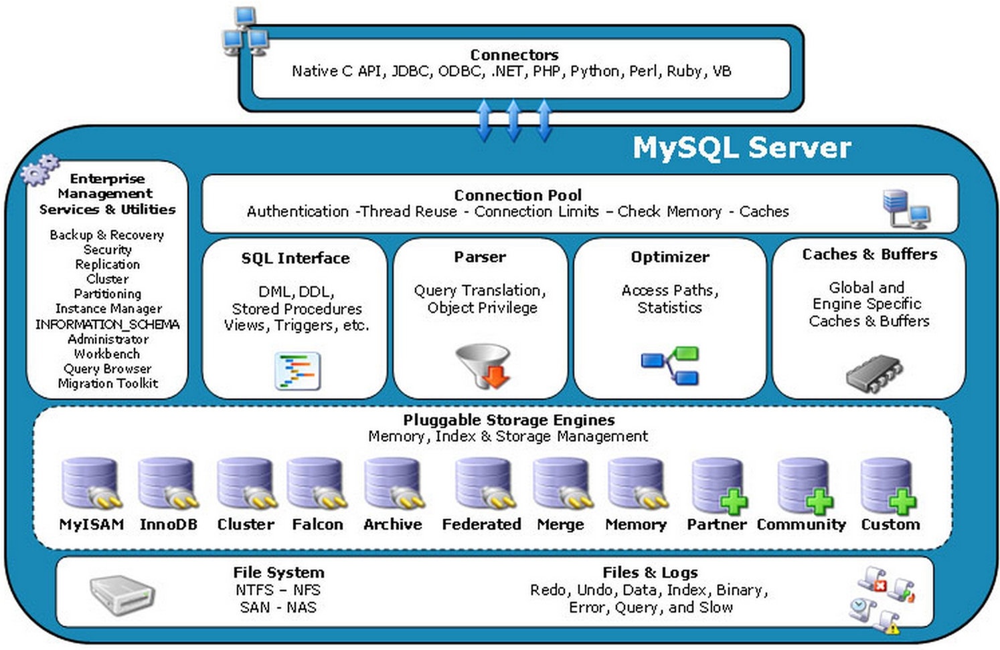

## SQL

### SQL 分类

* DDL ，Data Definition language，数据库定义语言。用来定义数据库对象，包括数据库，数据表和列。通过使用 DDL，可以创建、删除和修改数据库和表结构
* DML，Data Manipulation Language，数据操作语言，用它操作和数据库相关的记录，增，删，改表中的记录
* DCL，Data Control Language，数据控制语言，用它来定义访问权限和安全级别
* DQL，Data Query Languge，数据查询语言，用它来查询想要的记录

#### Oracle 中 SQL 执行


SQL 在 Oracle 中执行流程：

1. 语法检查：检查 SQL 拼写是否正确，如果不正确，Oracle 会报语法错误
2. 语义检查：检查 SQL 中的访问对象是否存在。如操作或访问的库表是否存在。语法检查和语义检查的作用是保证 SQL 语句没有错误
3. 权限检查：看用户是否具备访问该数据的权限
4. 共享池检查：共享池 `shared Pool` 是一块内存池，最主要的作用是缓存 SQL 语句和该语句的执行计划。Oracle 通过检查共享池是否存在 SQL 语句的执行计划，就直接拿来执行，来判断进行软解析还是硬解析（在共享池中，Oracle 首先对 SQL 语句进行 Hash 运算，然后根据 Hash 值在库缓存（Library Cache）中查找，如果存在 SQL  语句的执行计划，就直接拿来执行，直接进入“执行器”环节，即软解析。如果没有找到 SQL 语句和执行计划，Oracle 就需要创建解析树进行解析，生成执行计划，进入“优化器”这个步骤，即硬解析
5. 优化器：优化器中就是要进行硬解析，创建解析树，生成执行计划
6. 执行器：当有了解析树和执行计划后，就可以在执行器中执行语句了

共享池是 Oracle 中的术语，包括库缓存，数据字典缓冲区等。库缓存主要缓存 SQL 语句和执行计划。而数据字典缓冲区存储的是 Oracle 中的对象定义，比如表、视图、索引等。当对 SQL  语句进行解析的时候，如果需要相关的数据，会从数据字典缓冲区中提取

#### 数据库管理系统

* Oracle 结构图

  

* MySQL

  

  

#### SQL92 中是如何使用连接的

* 笛卡尔积

  笛卡尔积是两个集合的所有可能组合。即交叉连接，`CROSS JOIN`，它的作用是可以把任意表进行连接，即使这两张表不相关。

* 等值连接

  两张表的等值连接就是用两张表中都存在的列进行连接。也可以对多张表进行等值连接

* 非等值连接

  当进行多表查询的时候，如果连接多个表的条件是非等号时，即非等值连接

* 外连接

  除了查询满足条件的记录外，外连接还可以查询某一方不满足条件的记录。两张表的外连接，会有一张表是主表，另一张表是从表。如果是多张表的外连接，那么第一张表是主表，即显示全部的行，而剩下的表则显示对应连接的信息。**左外连接**：左边的表是主表，需要显示左边表的全部行，而右侧的表是从表`(+)` 表示哪个是从表。**右外连接**：右边的表是主表，显示右边表的全部行，而左侧的表是从表。`LEFT JOIN` 和 `RIGHT JOIN` 只存在于 SQL99 标准，在 SQL 92 中只能使用 `(+)` 标识从表

  ```sql
  # 左连接SQL92
  select * from player, team where player.team_id = team.team_id(+);
  # 右连接SQL92
  select * from player, team where player.team_id(+) = team.team_id;
  # 左连接SQL99
  select * from player left join team on player.team_id = team.team_id;
  # 右连接SQL99
  select * from player right join team on player.team_id = team.team_id;
  ```

* 自连接

  自连接可以对多个表进行操作，也可以对同一个表进行操作。即查询条件使用了当前表的字段

### SQL 99 标准中的连接查询

*SQL中连接*


#### 交叉连接

交叉连接实际上就是 SQL 92 中的笛卡尔积，使用 `CROSS JOIN`

#### 自然连接

自然连接为 SQL 92 中的等值连接，如果把 `player` 表和 `team` 表进行等值连接，相同的字段是 `term_id`

```SQL
# SQL 92
SELECT player_id, a.team_id, player_name, height, team_name FROM player as a, team as b where a.team_id = b.team_id
# SQL 99
SELECT player_id, team_id, player_name, height, team_name FROM player NATURAL JOIN team
```

在 SQL 99 中使用 NATURAL JOIN 替代了 WHERE player.team_id = team.team_id

#### ON 连接

ON 连接用来指定想要的条件。一般来说在 SQL 99 中，需要连接的表会采用 JOIN 进行连接，ON 指定了连接条件，后面可以是等值连接，也可以是非等值连接

```SQL
SELECT player_id, player.team_id, player_name, height, team_name FROM player JOIN team ON player.team_id = team.team_id
```

#### USING 连接

进行连接时，可以用 USING 指定数据表里的同名字段进行等值连接

```sql
SELECT player_id, team_id, player_name, height, team_name FROM player JOIN team USING(team_id)
```

与自然连接不同的是，USING 指定了具体的相同字段名称，需要在 USING 的括号 `()` 中填入要指定的同名字段。使用 JOIN USING 可以简化 JOIN ON 的等值连接

#### 外连接

SQL 99 的外连接包括三种形式：

* 左外连接：LEFT JOIN 或 LEFT OUTER JOIN
* 右外连接：RIGHT JOIN 或 RIGHT OUTER JOIN
* 全外连接：FULL JOIN 或 FULL OUTER JOIN

全外连接是左外连接和右外连接的结合。（MySQL 不支持全外连接）全外连接 = 左右表匹配的数据 + 左表没有匹配的数据 + 右表没有匹配的数据

#### 自连接

自连接是通过已知的自身数据表进行条件判断，因此在大部分 DBMS 中都对自连接处理进行了优化

