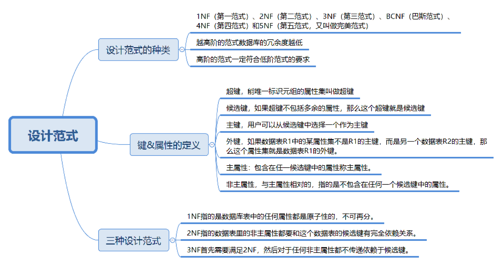
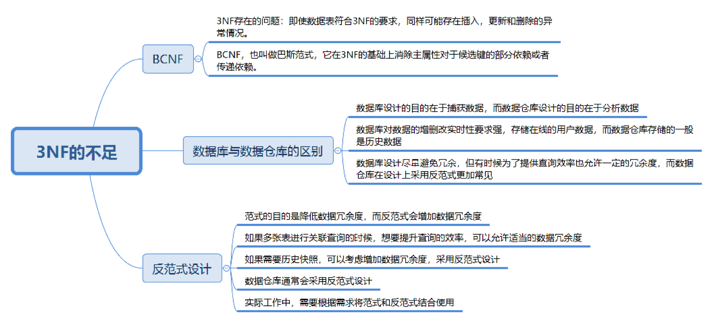

## 数据库设计范式

### 数据库设计范式

目前关系数据库一个有六种范式，按照范式级别从低到高分别是：1 NF（第一范式）、2 NF (第二范式)、3 NF（第三范式）、BCNF (巴斯 - 科德范式)、4 NF（第四范式）、5 NF（第五范式）。数据库的范式设计越高阶，冗余度就越低。高阶的范式一定符合低阶范式的要求。

#### 数据表的键

范式的定义会使用到主键和候选键（主键和候选键可以唯一标识元祖），数据库中的键由一个或多个属性组成。数据表中常用的键和属性：

* 超键

  能唯一标识元祖的属性集

* 候选键

  如果超键不包括多余的属性，那么这个键就是候选键

* 主键

  用户可以从候选键中选择一个作为主键

* 外键

  如果数据表 R1 中的某属性集不是 R1 的主键，而是另一个数据表 R2 的主键，那么这个属性集就是数据表 R1 的外键

* 主属性

  包含在任一候选键中的属性为主属性

* 非主属性

  与主属性相对，即不包含在任何一个候选键中的属性

通常，也将候选键称为“码”，把主键称为“主码”。因为键可能是由多个属性组成的，针对单个属性，可以用主属性和非主属性来进行区分

#### 1 NF 到 3 NF

* 1 NF 指的是数据库表中的任何属性都是原子性的，不可再分

  即设计某个字段的时候，对于字段 x 来说，不能把字段 X 拆分成字段 X-1 和 字段 X-2。即任何 DBMS 都满足第一范式要求。需要保障表中每个属性都保持原子性

* 2 NF 指的是数据表里的非主属性都要和这个数据表的候选键有完全依赖关系

  不能仅依赖候选键的一部分属性，而必须依赖全部属性。某种程度上 2 NF 是对 1 NF 原子性的升级。1 NF 定义原子性的字段，2 NF 定义一张表就是一个独立的对象。需要保证表中的非主属性与候选键完全依赖

* 3 NF 在满足 2 NF 的同时，对任何非主属性都不传递依赖于候选键

  即不能存在非主属性 A 依赖与非主属性 B，非主属性 B 依赖于候选键的情况。3 NF 需要保证表中的非主属性与候选键不存在传递依赖

#### BCNF 巴斯范式

在 3 NF 的基础上消除了主属性对候选键的部分依赖或者传递依赖关系

