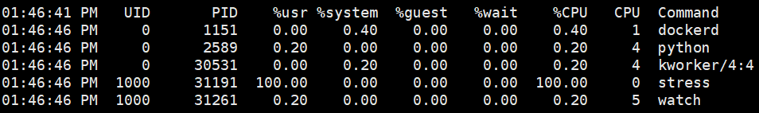

## Linux 下与 CPU 相关知识

### CPU 平均负载

使用 `uptime` 来查看系统的负载情况，最后三个数字，依次是过去 1 分钟，5 分钟， 15 分钟的平均负载（Load Average）

**平均负载是指单位时间内，系统处于可运行状态（正在使用 CPU 或者正在等待 CPU 的进程，ps 命令处于 R 状态Running或Runnable的进程）和不可中断状态（是处于内核关键流程中的进程，并且这些流程是不可打断的，如等待硬件设备的 I/O 响应，ps 命令中 D 状态 Uninterruptible Sleep 即 Disk Sleep 的进程）就是平均活跃进程数** 它与 CPU 使用率没有直接关系。

平均活跃进程数，直观上是单位时间内的活跃进程数，实际上是活跃进程数的指数衰减平局值。

理想情况下，每个 CPU 上都刚好运行着一个进程，这样每个 CPU 都得到了充分利用。即当平均负载为 2 时：

* 在只有 2 个 CPU 的系统上，意味着所有的 CPU 都刚好被完全占用
* 在 4 个 CPU 的系统上，意味着 CPU 有 50% 的空闲
* 在只有 1 个 CPU 的系统中，意味着一半的进程竞争不到 CPU

#### 平均负载合理范围

在评判平均负载时，首先要知道系统有几个 CPU，可以通过 top 命令或者从文件 `/proc/cpuinfo` 中读取

```shell
grep 'model name' /proc/cpuinfo | wc -l
```

当平均负载比 CPU 个数还大的时候，系统已经出现了过载。

* 如果 1 分钟、5 分钟、15 分钟的三个值基本相同，或者相差不大，说明系统负载很平稳
* 但如果 1 分钟的值远小于 15 分钟的值，就说明系统最近 1 分钟的负载在减少，而过去 15 分钟内却有很大的负载
* 如果 1 分钟的值远大于 15 分钟的值，说明最近 1 分钟的负载在增加，这种增加有可能只是临时性的，也有可能还会持续增加下去，所以要持续观察。一旦 1 分钟的平均负载接近或超过了 CPU 的个数，就意味着系统正在发生过载的问题。

**当平均负载高于 CPU 数量 70% 的时候**，就应该分析排查负载高的问题了。一旦负载过高，就可能导致进程响应变慢，进而影响服务的正常功能。推荐是把系统的平均负载监控起来，然后根据更多的历史数据，判断负载的变化趋势

#### 平均负载与 CPU 使用率

平均负载是指单位时间内，处于可运行和不可中断状态的进程数。不仅包括正在使用 CPU 的进程，还包括等待 CPU 和等待 I/O 的进程。而 CPU 的使用率，是单位时间内 CPU 繁忙情况的统计，跟平均负载并不一定完全对应。如：

* CPU 密集型进程，使用大量 CPU 会导致平均负载升高，此时这两者是一致的
* I/O 密集型进程，等待 I/O 也会导致平均负载升高，但 CPU 使用率不一定很高
* 大量等待 CPU 的进程调度也会导致平均负载升高，此时的 CPU 使用率也会比较高

#### 平均负载分析

平均负载提供了一个快速查看系统整体性能的手段，反映了整体的负载情况。但只是看平均负载本身，并不能直接发现，到底是哪里出现了瓶颈。所以，在理解平均负载时：

* 平均负载高有可能时 CPU 密集型进程导致的
* 平均负载高并不一定代表 CPU 使用率高，还有可能时 I/O 更繁忙了
* 当发现负载高的时候，可以使用 `mpstat`，`pidstat`  等工具，辅助分析负载的来源

一般采用 `mpstat` 来监控 CPU

如：`mpstat -P ALL 5` 监控所有 CPU，间隔 5 秒输出一组数据

*mpstat监控CPU数据*


查看到 CPU 使用率之后，可以使用 `pidstat` 来查询是哪个进程和命令导致的

如：`pidstat -u 5 20` 间隔五秒输出一组数据，输出 20 次

*pidstat监测进程使用CPU情况*



