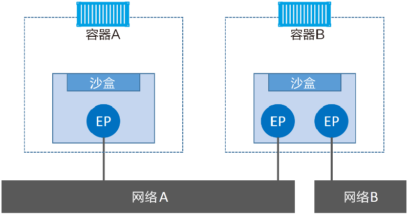
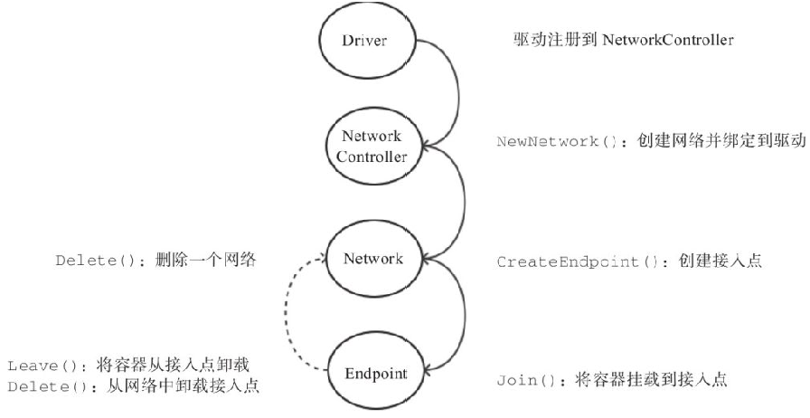
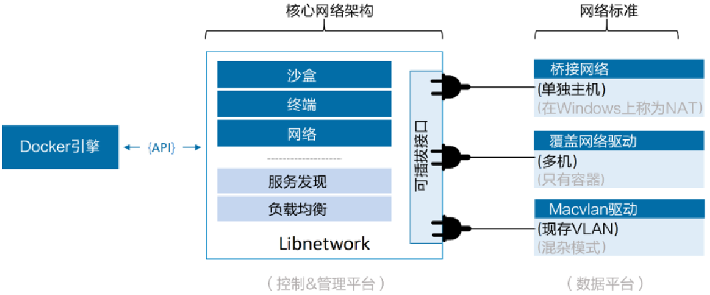

### docker

#### 快速开始

##### 架构

典型的 C/S 应用程序，Docker Engine 运行方式：

1. dockerd 作为服务端软件运行（创建和管理 docker 对象：网络，容器，卷），并提供调用接口，cli 客户端（docker）使用 socket 或 tcp 与服务端 dockerd 通信
2. docker 命令行客户端调用接口或执行脚本与守护进程交互

###### 配置

*   daemon.json

    配置 dockerd 运行时

    */etc/docker/daemon.json*

    ```json
    {
    	// 指定镜像
    	"registry-mirrors" : [
            "https://docker.mirrors.ustc.edu.cn/",
            "https://dockerhub.azk8s.cn",
            "https://reg-mirror.qiniu.com",
            "https://hub-mirror.c.163.com",
            "https://mirror.ccs.tencentyun.com"
      	],
        // 指定 images 目录
        "graph": "/var/data/docker",
    	// 指定安全仓库地址
        "insecure-registries" : ["home.com:5000"],
        // 修改存储驱动
        "storage-driver": "overlay2"
    }
    ```

*   docker.service

    配置 dockerd 启动时

    */lib/systemd/system/docker.service* 或 */etc/systemd/system/docker.service.d/startup_options.conf*

    ```ini
    # 添加或修改
    [Service]
    ExecStart=
    # 使用 —H 指定多个套接字，默认 -H fd
    ExecStart=/usr/bin/dockerd -H fd:// -H tcp://127.0.0.1:2375
    ```

##### 引擎组件

docker 引擎是用来运行和管理容器的核心软件，采用了模块化的设计，其组件是可替换的，引擎大致工作流程为：

1.  docker 客户端将命令提交到 docker daemon 执行
2.  docker daemon 解析并执行命令，调用（通过 gRPC 通信） containerd 管理 docker 对象
3.  containerd 调用（将 docker 镜像转为为 OCI bundle）与操作系统绑定的 runc 来创建容器
4.  runc 与操作系统内核接口进行通信，基于所有必要的工具（Namespace、CGroup）来创建容器
5.  容器进程作为 runc 的子进程启动，启动完毕后，runc 将会退出

###### Docker 客户端

提供 docker 命令

###### Docker 守护进程

API 和其他特性。

###### containerd

容器 Supervsor。管理所有容器的执行逻辑，用于容器生命周期（start|stop|pause|rm...）管理。在 Linux 和 Windows 中以 damon 的方式运行，在 Docker 引擎技术栈中 containerd 位于 damon 和 runc 之间

kubernetes 也可以通过 cri-containerd 使用 containerd

###### runc

容器运行时内核原语接口。是 OCI 容器运行时规范的参考实现，只用来创建容器。

##### 服务组件

###### 存储驱动

每个 docker 容器都有一个本地存储空间，用于保存层叠的镜像层以及挂载的容器文件系统。默认情况下，容器的所有读写操作都发生在其镜像层上或挂载的文件系统中。

本地存储是通过存储驱动进行管理的，存储驱动在上层抽象中都采用了栈式镜像层存储和写时复制。存储驱动的选择是节点级别的。每个 docker 主机只能选择一种存储驱动，不能为每个容器选择不同的存储驱动。修改存储引擎后，现有的镜像和容器在重启之后将不可用。

#### 镜像

镜像即创建容器的模版，类似面向对象中的类，镜像提供二进制程序或程序运行环境，dockerd 负责操作镜像。docker 镜像由一些松耦合的只读镜像层组成

##### 基于本地模板导入

可以直接从一个操作系统模板文件导入一个镜像，使用

```shell
cat ubuntu-18.04-x86_64-minimal.tar.gz | docker import - ubuntu:18.04
```

##### Dockerfile

Dockerfile 使用 DSL 语言定义，在构建上下文（本地 PATH 或 Git 仓库位置，上下文是递归处理的）中构建镜像。构建由 Dockerd 进行，流程：

1. 将整个构建上下文递归发送到守护程序
2. Dockerd 验证 Dockerfile 文件，失败则返回错误
3. Dockerd 逐一执行指令，如有必要，将每个指令的执行结果提交到新映像，最终输出新映像的 ID
4. Dockerd 构建完成后自动清理构建过程中产生的中间镜像上下文

18.09 开始 Docker 支持由 moby/buildkit 提供的新构建组件（支持并行构建独立阶段等），使用 BuildKit 后端（需要在命令行设置环境变量 **DOCKER_BUILDKIT=1**）

Dockerfile 中指令的一般格式为指令后跟参数

```dockerfile
# 指令不区分大小写，约定大写
INSTRUCTION arguments
```

###### 解析器指令

可选指令，会影响 Dockerfile 后续行的处理方式，解析器指令不会在构建中添加层，也不会显示为构建步骤。单个解析器指令只能使用一次。

不区分大小写，约定：使用小写，在任何解析器指令之后包含一个空白行。不支持行继续符

```dockerfile
# directive=value
```

* syntax

    ```dockerfile
    # syntax=[remote image reference]
    # eg
    # syntax=docker.io/dockerfile:1.0
    ```

    仅当使用 Buildkit 后端时才启用此功能

    语法指令定义了用于构建当前 Dockerfile 的 Dockerfile 构建器的位置。Buildkit 后端允许无缝使用构建器的外部实现，这些构建器以 Docker 映像的形式分发并在容器沙箱环境中执行（解耦构建，确保所有用户都是用相同实现来构建 Dockerfile）

* escape

    ```dockerfile
    # escape=\ (backslash)   # 默认，Linux 平台
    # escape=` (backtick)   # windows 平台
    ```

    设置用于 Dockerfile 中进行转义的字符

###### 变量

可以在指令（ADD、COPY、ENV、EXPOSE、FROM、LABEL、STOPSIGNAL、USER、VOLUME、WORDIR、ONBUILD）中使用变量（在命令行或 ENV 指令中声明）

```dockerfile
# ${variable_name} 或 $variable_name 来引用变量，支持修饰符，可以使用转义字符转义来表示字面意思
# 如果 variable 设置，将使用设置值，未设置，则使用 word（word 可以是任何字符串，包含其他环境变量）
${variable:-word}
# 如果 variable 设置，则使用 word，否则为空字符串
${variable:+word} 
FROM busybox
ENV foo /bar
WORDIR ${foo}  # WORKDIR /bar
COPY \$foo /quux # COPY $foo /quux
ENV abc=hello
ENV abc=bye def=$abc # def = hello
ENV ghi=$abc # ghi = bye
```

###### 上下文忽略文件

在 docker 将上下文发送到 dockerd 之前，会在上下文中扫描 *.dockerignore* 文件，如果此文件存在，则 CLI 会修改上下文以排除与其中的模式匹配的文件和目录。可以避免使用 ADD 或 COPY 将不需要的文件添加到镜像中。语法类似 ignore 语法。

使用 Go 的 *filepath.Match* 规则进行匹配，预处理步骤使用 Go 的 *filepath.clean* 删除开头和结尾空格

###### FROM

```Dockerfile
FROM [--platform=<platform>] <image> [AS <name>]
FROM [--platform=<platform>] <image>[:<tag>] [AS <name>]
FROM [--platform=<platform>] <image>[@<digest>] [AS <name>]
ARG VERSION=8.0
FROM openjdk:${version:-11}
```

初始化一个构建阶段，并为后续的指令设置基本镜像。有效的 Dockerfile 必须从 FROM 指令开始，可以指定任何有效镜像。

* --platform 指定镜像平台，如 linux/amd64、linux/arm64、windows/amd64
* tag 或 digest 值是可选的，默认为 latest
* ARG 可以在 FROM 之前声明（FROM 之前的 ARG 声明的变量作用域为构建之外，只能 FROM 指令中使用，构建阶段使用变量需要在 FROM 之后声明）

###### RUN

```dockerfile
# shell 终端中执行，linux: /bin/sh -c windows:  cmd /S /C， 支持使用 \ 连接命令
RUN <command>
# 解析为 json 数组，使用 exec 执行，不会启动 shell 环境，避免 shell 对字符串改写，必须使用 " 并转义 \
RUN ["executable", "param1", "param2"]
# 要为单个命令设置值，请使用 RUN <key>=<value> <command>
```

运行指定命令，将在当前图像顶部的新层中执行所有命令，并提交结果。RUN 下一次构建期间，指令缓存不会自动失效，将在下一个构建中重用，可以在构建时使用 --no-cache 避免缓存

###### CMD

```dockerfile
# exec 形式，首选形式
CMD ["executable", "param1", "param2"]
# 作为 ENTRYPOINT 的默认参数，ENTRYPOINT 和 CMD 都必须使用 json 数组格式
CMD ["param1", "param2"]
# shell 形式提供给需要交互的应用
CMD command param1 param2
```

指令用来指定启动容器时默认执行的命令，每个 Dockerfile 只能有一条 CMD 命令，如果指定了多条命令，只有最后一条会被执行，如果启动容器时指定了运行的命令（作为 run 命令的参数），则会覆盖掉 CMD  指定的命令

###### LABEL

```dockerfile
# 键值对
LABEL <key>=<value> <key>=<value> <key>=<value> ...
```

为生成的镜像添加元数据标签信息，这些信息用来辅助过滤出特定镜像。会继承基础镜像的 LABEL，如果指定了相同的值则会覆盖

###### MAINTAINER（deprecated）

```dockerfile
MAINTAINER <name>
LABEL maintainer="SvenDowideit@home.org.au"
```

设置镜像作者名字，已弃用，使用 LABEL 替代

###### EXPOSE

```dockerfile
EXPOSE <port> [<port>/<protocol>...]
EXPOSE 80/tcp
EXPOSE 80/udp
```

声明 Docker 容器在运行时监听指定的网络端口，默认为 TCP 协议，但并不会暴露端口。

###### ENV

```dockerfile
# 第一个空格之后的整个字符串将被视为 value
ENV <key> <value>
# 允许设置多个变量，当一条 ENV 指令中同时为多个环境变量赋值并且值也是从环境变量读取时，会为变量都赋值后再更新
ENV <key>=<value> ...
# 结果为 key1=value1 key2=value2
ENV key1=value2
ENV key1=value1 key2=${key1}
```

指定环境变量，在镜像生成过程中会被后续 RUN  指令使用，在镜像启动的容器中也会存在。指令指定的环境变量在运行时可以使用 -e 覆盖

###### ADD

```dockerfile
ADD [--chown=<user>:<group>] <src>... <dest>
# 包含空格的路径需要使用该格式
ADD [--chown=<user>:<group>] ["<src>",... "<dest>"]
ADD --chown=10:11 files* /somedir/
```

将复制指定的 src 路径下内容到容器中的 desc 路径下 

* src 可以是 Dockerfile 所在目录的一个相对路径（文件或目录），URL，tar

    *   如果为一个 tar 文件将自动解压为目录

    * 如果 src 是远程文件 URL，则目标具有 600 的权限。
    * 如果 src 是目录，则将复制目录的整个内容，包括文件系统元数据（仅复制内容，自身不会被复制）

* dest 可以是镜像内绝对路径，或者相对于工作目录（workdir）的相对路径。路径支持正则。

    * 如果 src 是 URL，且 dest 不以斜杠结尾，则从 URL 下载文件并将其复制到 dest，如果 dest 以斜杠结尾，则从 URL 推断文件名，然后将文件下载到 dest/filename
    * 如果 src 指定了多个资源，dest 必须是目录，必须以斜杠结尾
    * 如果 dest 不以斜杠结尾，则将其视为常规文件，并将其内容 src 写入 dest
    * 如果 dest 不存在，它将与路径中所有缺少的目录一起创建

* --chown 仅在用于构建 Linux 容器的 Dockerfiles 上受支持。除非使用该标志指定用户或用户组来对添加内容指定所有权，否则所有新文件和目录的 UID 和 GID 均为 0。

    允许使用用户名和组名字符串，或整数UID 和 GID 的任意组合。提供不带组名的用户名或不带 GID 的 UID 将使用与 GID 相同的数字 UID。如果提供了用户名或组名，则将使用容器的根文件系统 /etc/passwd 和 /etc/group 文件来分别执行从名称到整数 UID 或 GID 的转换

    如果容器根文件系统不包含 /etc/passwd 或 /etc/group 文件，并且在 --chown 标志中使用了用户名或组名，则该构建将在 ADD 操作上失败，使用数组 ID 不需要查找，并且不依赖于容器根文件系统内容

###### COPY

```dockerfile
COPY [--chown=<user>:<group>] <src>... <dest>
# 包括空格的路径必须使用该格式
COPY [--chown=<user>:<group>] ["<src>",... "<dest>"]
COPY --chown=10:11 files* /somedir/
```

复制内容到镜像，复制本地主机的  src （为 Dockerfile 所在目录的相对路径，文件或目录）下内容到镜像中的 dest。

COPY 和 ADD 指令功能类似，当使用本地目录为源目录时，推荐 COPY

###### ENTRYPOINT

```dockerfile
# EXEC 形式
ENTRYPOINT ["executable", "param1", "param2"]
# Shell 形式，此时 CMD 指令指定值将作为根命令的参数
ENTRYPOINT command param1 param2
```

指定镜像的默认入口命令，该入口命令会在启动容器时作为根命令执行，所有传入值作为该命令的参数。每个 Dockerfile 中只能有一个 ENTRYPOINT，当指定多个时，只有最后一个起效，在运行时，可以被 --entrypoint 参数覆盖掉

* Dockerfile 至少应该指定 CMD 或 ENTRYPOINT 命令中的一个
* ENTRYPOINT 使用容器作为可执行文件时应定义
* CMD 应该用做 ENTRYPOINT 在容器中定义命令或执行临时命令的默认参数的方式

###### VOLUME

```
VOLUMN ["/data"]
```

创建一个数据卷挂载点，运行容器时可以从本地主机或其他容器挂载数据卷，一般用来存放数据库和需要保持的数据

###### USER

```dockerfile
USER <user>[:<group>]
USER <UID>[:<GID>]
```

指定运行容器时的用户名或 UID，后续的 RUN 等指令也会使用指定的用户身份，当服务不需要管理员权限时，可以通过该命令指定运行用户

###### WORKDIR

```
WORKDIR /path/to/workdir
```

为后续的 RUN、CMD、ENTRYPOINT 指令配置工作目录，可以使用多个 WORKDIR 指令，后续命令如果参数是相对路径，则会基于之前命令指定的路径，推荐只使用绝对路径，-w 参数会覆盖该指令

###### ARG

```dockerfile
# 可以通过 --build-arg <varname>=<value> 将变量传递给构建器
ARG <name>[=<default value>]
```

当镜像编译成功后，ARG 指定的变量将不再存在（ENV 指定的变量将在镜像中保留）

如果指定了未在 Dockerfile 中定义的构建参数，则构建会输出警告。不建议使用构建时变量来传递机密信息，构建时变量值对于使用 docker history 的查看图像时可见

使用 ENV 指令定义的环境变量始终会覆盖 ARG 的同名变量

Docker 内置了一些镜像创建变量，用户可以直接使用而无须声明，包括（不区分大小写）：HTTP_PROXY、HTTPS_PROXY、FTP_PROXY、NO_PROXY

###### ONBUILD

```dockerfile
ONBUILD <INSTRUCTION>
```

指定当基于所生成镜像创建子镜像时，自动执行的操作指令，ONBUILD 指令是隐式执行的，推荐在使用它的镜像标签中进行标注，ONBUILD 指令在创建专门用于自动编译、检查等操作的基础镜像时，十分有用。当一个镜像被用作其它镜像的基础镜像时，该镜像的 onbuild 指令会被执行

###### STOPSIGNAL

```dockerfile
STOPSIGNAL signal
```

指定所创建镜像启动的容器接收退出的信号值，这个信号必须是内核系统调用表中合法的数

###### HEALTHCHECK

```dockerfile
# 通过在容器内部运行命令来检查容器的运行状况，根据所执行命令返回值是否为 0 来判断
HEALTHCHECK [OPTIONS] CMD command
# 禁用从基本映像继承的任何运行状况检查
HEALTHCHECK NONE
HEALTHCHECK --interval=5m --timeout=3s CMD curl -f http://localhost/ || exit 1
```

告诉 Docker 如何测试容器以检查其是否仍在工作。指定容器的运行状况检查后，除了其正常状态外，它还具有运行状况。此状态最初为 starting，只要运行状况检查通过，它将变为 healthy，在一定数量的连续失败后，它变为 unhealthy

OPTION 支持如下参数：

* --interval=DURATION

    过多久检查一次（默认 30s）

* --timeout=DURATION

    每次检查等待结果的超时（默认 30s）

* --retries=N

    如果失败了，重试几次才最终确定失败（默认 30s）

###### SHELL

```dockerfile
SHELL ["executable", "parameters"]
```

指定其他命令使用 shell 时的默认 shell 类型，SHELL 指令可以出现多次，每个 SHELL 指令将覆盖所有先前的 SHELL 指令

###### 构建

```
# 编写完 Dockerfile 之后，可以通过该命令来创建镜像
docker [image] build [OPTIONS] PATH|URL
```

* 如果通过 STDIN 传递 Dockerfile 进行构建，则没有构建上下文（Dockerfile 只能包含基于 URL 的 ADD 指令）

    ```shell
    docker build - < somefile
    ```

* 通过 STDIN 传递归档文件进行构建，归档文件 Dockerfile 需在根目录中，归档文件的其余部分将用作构建上下文

FROM、ADD/COPY、RUN、CMD 指令会生成一层新的镜像。最终如果创建镜像成功，会返回最终镜像的 ID。

*docker build 命令选项*

|            选项            |                 说明                 |
| :------------------------: | :----------------------------------: |
|     `--add-host list`      |    添加自定义的主机名到 IP 的映射    |
|     `--build-arg list`     |           添加创建时的变量           |
|   `--cache-from strings`   |        使用指定镜像作为缓存源        |
| `--cgroups-parent strings` |          继承的上层 cgroup           |
|        `--compress`        |    使用 gzip 来压缩创建上下文数据    |
|     `--cpu-period int`     |        分配的 CFS 调度器时长         |
|     `--cpu-quota int`      |           CFS 调度器总份额           |
|   `-c, --cpu-shares int`   |               CPU 权重               |
|   `--cpuset-cpus string`   |        多 CPU 允许使用的 CPU         |
|   `--cpuset-mems string`   |        多 CPU 允许使用的内存         |
| `--disable-content-trust`  |       不进行镜像校验，默认为真       |
|     `-f,-file string`      |           Dockerfile 路径            |
|        `--force-rm`        |        总是删除中间过程的容器        |
|     `--iidfile string`     |         将镜像 ID 写入到文件         |
|    `--isolation string`    |            容器的隔离机制            |
|       `--label list`       |           配置镜像的元数据           |
|    `-m, --memory bytes`    |            限制内存使用量            |
|   `--memory-swap bytes`    |         限制内存和缓存的总量         |
|     `--network string`     |      指定 RUN 命令时的网络模式       |
|        `--no-cache`        |         创建镜像时不使用缓存         |
|    `--platform string`     |               设置平台               |
|          `--pull`          |          总是拉取较新的图像          |
|       `-q, --quiet`        | 如果成功，则禁止生成输出并打印映像id |
|           `--rm`           | 成功构建后删除中间容器 (默认为true)  |
|  `--security-opt strings`  |               安全设置               |
|     `--shm-size bytes`     | 设置 /dev/shm 大小，以 bytes 为单位  |
|         `--squash`         |       将新建的层压缩成一个新层       |
|         `--stream`         |    流附加到服务器以协商构建上下文    |
|      `-t, --tag list`      |             指定构建 tag             |
|      `--taget string`      |       设置要构建的目标构建阶段       |
|     `--ulimit ulimit`      |             ulimit 选项              |

###### 多阶段构建

多阶段构建使用一个 Dockerfile，其中包含多个 FROM 指令，每个 FROM 指令都是一个新的构建阶段，并且可以复制之前阶段的构件

```dockerfile
FROM maven:latest AS appserver
WORKDIR /usr/src/atsea
COPY pom.xml .
RUN mvn -B -f pom.xml -s /usr/share/maven/ref/settings-docker.xml dependency
\:resolve
COPY . .
RUN mvn -B -s /usr/share/maven/ref/settings-docker.xml package -DskipTests

FROM java:8-jdk-alpine AS production
RUN adduser -Dh /home/gordon gordon
WORKDIR /static
COPY --from=storefront /usr/src/atsea/app/react-app/build/ .
WORKDIR /app
COPY --from=appserver /usr/src/atsea/target/AtSea-0.0.1-SNAPSHOT.jar .
ENTRYPOINT ["java", "-jar", "/app/AtSea-0.0.1-SNAPSHOT.jar"]
CMD ["--spring.profiles.active=postgres"]
```

COPY --from 指令，它从之前的阶段构建的镜像中仅复制生产环境相关的应用代码，而不会复制生产环境不需要的构件

##### 使用容器创建镜像

```shell
docker commit [OPTIONS] CONTAINER [REPOSITORY[:TAG]]
```

根据容器的更改创建新映像

|          选项          |                            含义                            |
| :--------------------: | :--------------------------------------------------------: |
| `-a, --author string`  | Author (e.g., "John Hannibal Smith <hannibal@a-team.com>") |
|  `-c, --change list`   |             将 Dockerfile 指令应用于创建的镜像             |
| `-m, --message string` |                          提交信息                          |
|     `-p, --pause`      |              提交期间暂停容器（默认为 true）               |

#### 容器

##### 运行容器

```shell
docker [container] run <options> <image>:<tag> <app>
# 获取日志的最后 10 行内容
docker logs -tail 10 <container.name/id>
# 跟踪某个容器的最新日志，而不必读取整个日志文件
docker logs -tail 0 -f <container.name/id>
# 为每条日志加上时间戳
docker logs -ft <container.name/id>
# 格式化信息
docker inspect --format='{{ .State.Running}}' <container.name/id>
```

###### 重启策略

--restart

* always（会在 daemon 重启时重启）
* unless-stopped（不会在 daemon 重启时重启）
* on-failure （退出容器且返回值不为 0 时重启容器，就算容器处于 stopped 状态，在 daemon 重启时，容器也会重启，还接受一个可选的重启次数 --restart=on-failure:5）

```shell
docker run --restart=always --name daemon_dave -d ubuntu /bin/bash
```

###### 日志驱动

--log-driver

守护进程和容器所用的日志驱动

* json-file

    默认的 

* syslog

    该选项将禁用命令，并且将所有容器的日志输出都重定向到 Syslog)

* none

    这个选项将会禁用所有容器中的日志，导致 docker logs 命令也被禁用

```shell
docker run —log-driver="syslog" —name daemon_dwayne -d ubuntu /bin/sh
```

##### 数据卷

是一个可供容器使用的特殊目录，它将主机操作系统目录直接映射进容器，类似于 linux 中的 mount 行为

* 数据卷可以在容器之间共享和重用，容器间传递数据将变得高效与方便
* 对数据卷内数据的修改会立马生效，无论是容器内操作还是本地操作
* 对数据卷的更新不会影响镜像，解耦开应用和数据
* 卷会一直存在，直到没有容器使用，可以安全地卸载它

###### 创建数据卷

使用 volume 子命令来管理数据卷

```shell
# 创建数据卷 test，指定 local 驱动
docker volume create -d local test
# 查看信息
docker volume inspect test
# 列出所有卷
docker volume ls
# 清理无用卷
docker volume prune
# 删除无用卷
docker volume rm
```

默认情况下，Dockerd 创建新卷时采用内置的 local 驱动，本地卷只能被所在节点的容器使用，使用 local 驱动创建的卷在 Docker 主机上均有其专属目录：

* 在 Linux 中位于 */var/lib/docker/volumes* 目录下
* 在 Windows 中位于 *C:\ProgramData\Docker\volumes* 目录下

###### 绑定数据卷

```shell
docker [container] run --mount
docker run -d -P --name web --mount type=bind,source=/webapp,destination=/opt/webapp training/webapp python app.py
# 上述等价于旧的 -v 标记
docker run -d -P --name web -v /webapp:/opt/webapp training/webapp python app.py
# docker 挂载数据卷的默认权限是读写（rw），可通过 ro 指定为只读（容器内对锁挂载数据卷内的数据就无法修改了）
docker run -d -P --name web -v /webapp:/opt/webapp:ro training/webapp python app.py
```

可以在创建容器时将主机本地的任意路径（必须是绝对路径）挂载到容器（绝对或相对 workdir 路径，如果目录不存在，会自动创建）内作为数据卷，支持三种类型的数据卷，包括：

* volume

    普通数据卷，映射到主机 */var/lib/docker/volumes* 路径下

* bind

    绑定数据卷，映射到主机指定路径下

* tmpfs

    临时数据卷，只存在于内存中

如果直接挂载一个文件到容器，使用文件编辑工具，可能回造成文件 inode 的改变，1.1.0 开始，这会导致错误信息，推荐的方式是直接挂载目录到容器中

###### 数据卷容器

需要在多个容器之间共享一些持续更新的数据，最简单的方式是使用数据卷容器，它专门提供数据卷给其他容器挂载。

```shell
# 创建一个数据卷容器 dbdata, 在其中创建一个数据卷挂载到 /dbdata
docker run -it -v /dbdata --name dbdata ubuntu
# 在其他容器中使用，使用 --volumes-from 参数所挂载数据卷的容器自身并不需要保持在运行状态
docker run -it --volumes-from dbdata --name db1 ubuntu
```

如果删除了挂载的容器，数据卷并不会被自动删除，如果要删除一个数据卷，必须在删除最后一个还挂载着它的容器时显式使用 docker rm -v 命令来指定同时删除关联的容器。

###### 利用数据卷容器来迁移数据

可以利用数据卷容器对其中的数据卷进行备份、恢复、以实现数据的迁移

* 备份

    ```shell
    # 备份 dbdata 数据卷容器内的数据卷
    docker run --volumes-from dbdata -v $(pwd):/backup --name worker ubuntu tar cvf /backup/backup.tar /dbdata
    ```

    1. 使用 Ubuntu 镜像创建一个容器 worker，使用 *--volumes-from dbdata* 参数来让 worker 容器挂载 dbdata 容器的数据卷（即 dbdata 数据卷）
    2. 使用 *-v $(pwd):/backup* 参数来挂载本地的当前目录到 worker 容器的 */backup* 目录。
    3. worker 容器启动后，使用 *tar cvf/backup/backup.tar /dbdata* 命令将 */dbdata* 下内容备份为容器内的 */backup/backup.tar*，即宿主机当前目录下的 *backup.tar*

* 恢复数据到一个容器

    ```shell
    # 创建一个带有数据卷的容器 dbdata2:
    docker run -v /dbdata --name dbdata2 ubuntu /bin/bash
    # 创建一个新的容器，挂载 dbdata2 容器，并解压备份文件到所挂载的容器卷中
    docker run --volumes-from dbdata2 -v $(pwd):/backup busybox tar xvf /backup/backup.tar
    ```

##### 网络

###### 模型结构

Docker 网络架构源自一种叫做容器网络模型（CNM）的方案，该方案是开源的并且支持插接式连接。Libnetwork 是 Docker 对 CNM 的一种实现，提供了 Docker 核心网络架构的全部功能。

不同的驱动可以通过插拔的方式接入 Libnetwork 来提供定制化的网络拓扑。为了实现开箱即用的，Docker 封装了一系列本地驱动，覆盖了大部分常见的网络需求。

* 单机桥接网络（Single-Host Bridge Network）
* 多机覆盖网络（Multi-Host Overlay）、并且支持接入现有 VLAN。

Libnetwork 提供了本地服务发现和基础的容器负载均衡解决方案。

在顶层设计中，Docker 网络架构由 3 个主要部分构成

* CNM

    设计标准，在 CNM 中，规定了 Docker 网络架构的基础组成要素

* Libnetwork

    是 CNM 的具体实现，并且被 Docker 采用，使用 Go 语言编写，并实现了 CNM 中列举的核心组件

* Drive

    通过实现特定网络拓扑的方式来拓展该模型的能力

###### CNM

CNM 定义了 3 个基本要素：

* 沙盒（Sandbox）

    是一个独立的网络栈，其中包括以太网接口、端口、路由表以及 DNS 配置

* 终端（Endpoint）

    是虚拟网络接口，就像普通网络接口一样，终端主要职责是负责创建连接，在 CNM 中，终端负责将沙盒连接到网络。终端与常见的网络适配器类似，终端只能接入某一个网络，如果容器需要接入到多个网络，就需要多个终端

* 网络（Network）

    是 802.1d 网桥（类似交换机）的软件实现。因此，网络就是需要交互的终端的集合，并且终端之间相互独立。

*CNM组件与容器进行关联，沙盒被放置在容器内部，为容器提供网络连接*



CNM 的典型生命周期：

1. 注册自己到网络控制器
2. 网络控制器使用驱动类型来创建网络
3. 在创建的网络上创建接口
4. 把容器连接到接口上

CNM 典型生命周期



目前 CNM 支持的驱动类型：

* Null

    不提供网络服务，容器启动后无网络连接

* Bridge

    默认基于 Linux 网桥和 Iptabls 实现的单机网络

* Overlay

    用 vxlan 隧道实现的跨主机容器网络

* Remote

    扩展类型，预留给外部实现的方案

network 在 docker 命令中是一级公民

* create

    ```shell
    docker network create [OPTIONS] NETWORK
    ```

    |          选项          |                             含义                             |
    | :--------------------: | :----------------------------------------------------------: |
    | `--attachable[=false]` |                       启用手动容器附件                       |
    |  `--aux-address map`   |                 辅助使用的 IPv4 或 IPv6 地址                 |
    |    `--config-only`     |                     创建一个只配置的网络                     |
    |  `-d,--driver string`  |                      管理网络的驱动程序                      |
    |  `--gateway strings`   |                    主子网的IPv4或IPv6网关                    |
    |  `--ingress=[false]`   | 创建 Swarm 可路由的网状网络用于负载，可将某个服务请求自动转发合适副本 |
    |  `--internal[=false]`  |                内部模式，限制对网络的外部访问                |
    |  `--ip-range string`   |                     从子范围分配容器 IP                      |
    | `--ipm-driver string`  |             IP 地址管理驱动程序（默认 default）              |
    |    `--ipam-opt map`    |                    IP 地址管理插件的选项                     |
    |    `--ipv6[=false]`    |                        支持 IPv6 地址                        |
    |     `--label list`     |                       为网络添加元信息                       |
    |    `-o, --opt map`     |                     网络驱动所支持的选项                     |
    |    `--scope string`    |                         指定网络范围                         |
    |   `--subnet string`    |       CIDR格式的子网，表示一个网络段（172.17.0.0/16）        |

* connect

    ```shell
    docker network connect [OPTIONS] NETWORK CONTAINER
    ```

    |           选项            |                        含义                        |
    | :-----------------------: | :------------------------------------------------: |
    |     `--alias strings`     | 在网络范围为容器添加一个别名，仅在所添加网络上可见 |
    |   `--driver-opt string`   |                    网络驱动选项                    |
    |       `--ip string`       |           IPv4 address（172.30.100.14）            |
    |      `--ipv6 string`      |            IPv6 address（2001:db8::33）            |
    |       `--link list`       |                添加连接到另一个容器                |
    | `--link-local-ip strings` |               为容器添加链接本地地址               |

* disconnect

    ```shell
    # 仅支持 -f 选项，强制在网络上断开链接
    docker network disconnect [OPTIONS] NETWORK CONTAINER
    ```

* prune

    |       选项        |                  含义                  |
    | :---------------: | :------------------------------------: |
    | `--filter filter` | 指定选项过滤器（eg。until=<timestamp>) |
    |   `-f, --force`   |                强制清理                |

###### Libnetwork

是 CNM 标准的实现，它采用 Go 语言编写，是跨平台的。Docker 将网络部分从 daemon 中拆分，并重构为一个 Libnetwork 的外部类库。实现了 CNM 中定义的全部 3 个组件，还实现了本地服务发现（Service Discovery）、基于 Ingress 的容器负载，以及网络控制层和管理层功能

###### Drive

如果说 Libnetwork 实现了控制层和管理层功能，那么驱动就负责实现数据层。驱动层实际创建网络对象。Docker 封装了若干内置驱动，通常被称为原生驱动或者本地驱动。在 Linux 上包括 Bridge、Overlay、Macvlan，在 Windows 上包括 NAT、Overlay、Transport、L2 Bridge

*控制层管理层数据层关系*



每个驱动都负责其上所有网络资源的创建和管理，Linnetwork 支持同时激活多个网络驱动

###### 单机桥接网络

最简单的 docker 网络模型，只能在单个主机上运行，并且只能与所在主机上的容器进行连接。Linux Docker 创建单机桥接网络采用内置的桥接驱动，而 Windows Docker 创建时使用内置的 NAT 驱动。实际上，这两种驱动工作起来毫无差异

1. Dockerd 启动时会首先在主机上自动创建一个 docker0 虚拟网桥（Linux网桥）同时分配一个本地未占用的私有网段中的一个地址给 docker0 接口（典型：网段 172.17.0.0/16 掩码 255.255.0.0）此后启动的容器内的网口也会自动分配一个该网段的地址。
2. 当创建一个 docker 容器的时候，同时会创建一对 veth pair 互联接口，当向任一接口发送包时，另外一个接口自动收到相同的包。接口的一端位于容器内，即 eth0；另一端在本地并被挂载 docker0 网桥（veth 开头）。通过这种方式，主机可以与容器通信，容器之间也可以互相通信。如此，docker 就创建了在主机和所有容器之间一个虚拟共享网络

###### 多机覆盖网络

覆盖网络适用于多机环境。它允许单个网络包含多个主机，这样不同主机上的容器间就可以在链路层实现通信。覆盖网络是理想的容器间通信方式，支持完全容器化的应用，并且具备良好的伸缩性。

Docker 为覆盖网络提供了本地驱动 overlay

###### Docker 网络相关配置参数

* 启动服务时配置，重启生效

    |           选项            |              含义              |
    | :-----------------------: | :----------------------------: |
    |   `-b,--bridge string`    |       指定容器挂载的网桥       |
    |      `--bip string`       |          指定网桥 IP           |
    |    `--icc=true|false`     |    是否支持容器之间进行通信    |
    | `--ip-forward=true|false` |          启用 ip 转发          |
    |  `--iptables=true|false`  | 禁止 docker 添加 iptables 规则 |
    |       `--mtu=bytes`       |         指定 MTU 大小          |

* 启动服务时、容器启动时生效

    |         选项          |      含义       |
    | :-------------------: | :-------------: |
    |        `--dns`        | 指定 DNS 服务器 |
    |      `--dns-opt`      |  指定 DNS 选项  |
    | `--dns-search=DOMAIN` | 指定 DNS 搜索域 |

* 容器启动时生效

    |             选项              |                          含义                           |
    | :---------------------------: | :-----------------------------------------------------: |
    |       `-h, --hostname`        |                     配置容器主机名                      |
    |           `--ip ip`           |                 绑定容器端口时的默认 IP                 |
    | `--link=CONTAINER_NAME:ALIAS` |                 添加到另一个容器的链接                  |
    |          `--network`          | 配置网络（container:ID 使容器使用 ID 对应容器网络设置） |
    |       `--network-alias`       |               在网络范围内为容器指定别名                |
    |        `-p,--publish`         |                        映射端口                         |

###### 容器间通信

* link

    ```shell
    # --link <name or id>:alias，创建 web 并连接到 db 上，
    docker run -d -P --name web --link db:webdb traiging/webapp python app.py
    ```

    link 会将源容器（link 指定容器）连接到接收容器（当前容器），但不会讲接收容器连接到源容器。dockerd 在容器创建 link 阶段会进行：

    1. 设置接收容器的环境变量
    2. 更新接收容器的 */etc/hosts*（当容器重启后 hosts 文件和以自己为源容器的接收容器的 hosts 文件都会更新）
    3. 建立 iptables 规则通信

* net

    docker network 命令支持创建网络以在容器之间进行通信，而无需暴露或发布特定端口。（连接到同一个网络的容器可以通过任何端口相互通信）

###### 容器与宿主机通信

* 使用宿主机 IP
* 使用 host 网络
* 使用宿主机 IP 别名（host.docker.internal）

#### 管理接口

##### builder

##### config

##### container

##### context

##### image

##### network

##### node

##### plugin

##### secret

##### service

##### stack

##### swarm

##### system

##### trust

##### volume


