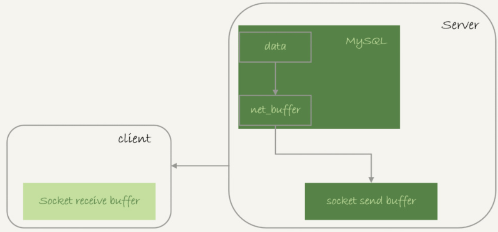
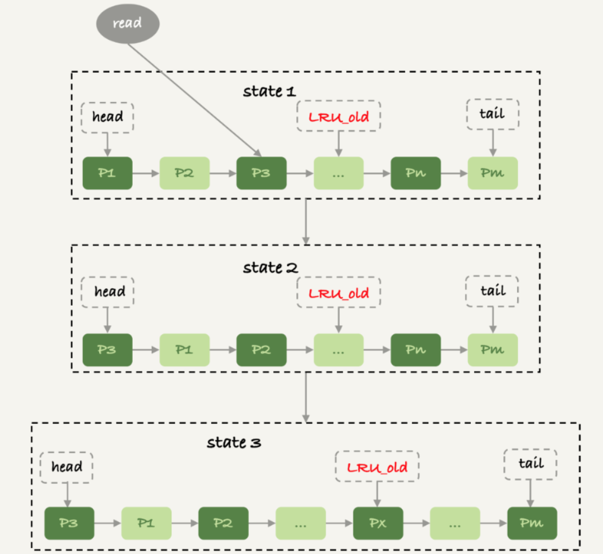

## MySQL 服务端执行相关

### 查询数据与数据库内存

#### 全表扫描对 server 层的影响

假设，需要对一个 200 G 的 InnoDB 表 db1.t，执行一个全表扫描。把扫描结果保存在客户端，会使用如下类似命令

```shell
mysql -h$host -P$port -u$user -$pwd -e "select * from db1.t" > $target_file
```

这条查询语句由于没有其他判断条件，所以查到的每一行都可以直接放到结果集里面，然后返回给客户端

实际上，服务端并不需要保存一个完整的结果集。取数据和发数据的流程是：

1.获取一行，写到 `net_buffer` 中。这块内存的大小是由参数 `net_buffer_length` 定义的，默认是 16k

2.重复获取行，直到 `net_buffer` 写满，调用网络接口发出去

3.如果发送成功，就清空 `net_buffer` ，然后继续取下一行，并写入 `net_buffer`

4.如果发送函数返回 `EAGAIN` 或 `WSAEWOULDBLOCK`，就表示本地网络栈（`socket send buffer`）写满了，进入等待。直到网络栈重新可写，再继续发送

*查询结果发送流程*



一个查询在发送过程中，占用的 `MySQL` 内部的内存最大就是 `net_buffer_length` 这个大。`socket send buffer` 默认定义在 `/proc/sys/net/core/wmem_default`，如果 `socket send buffer` 被写满，就会暂停读数据的流程。即是，MySQL 是边读边发的，即，如果客户端接收得慢，会导致 `MySQL` 服务端由于结果发不出去，这个事务的执行时间变长。

如果 `show processlist` 的 `State` 的值一直处于 `Sending to client` ，就表示服务器端的网络栈写满了。

一个查询语句的状态变化是：

* MySql 查询语句进入执行阶段后，首先把状态设置成 `Sending data`
* 然后，发送执行结果的列相关的信息给客户端
* 再继续执行语句的流程
* 执行完成后，把状态设置成空字符串

对于一个 MySQL 连接，或者一个线程，任何时刻都有一个状态，该状态表示了 MySQL 当前正在做什么，`SHOW FULL PROCESSLIST` 命令返回结果的 `Command` 列就表示当前的状态。在一个查询的生命周期中，状态会变化很多次：`Sleep` 线程正在等待客户端发送新的请求，`Query` 线程正在执行查询或者正在将结果发送给客户端，`Locked` 在 MySQL 服务器层，该线程正在等待表锁。在存储引擎级别的锁，如 `InnoDB` 的行锁，并不会体现在线程状态中。对于 `MyISAM` 来说这是一个比较典型的状态，但在其他没有行锁的引擎中也经常会出现。`Analyzing and statistics`  线程正在收集存储引擎的统计信息，并生成查询的执行计划。`Copying to tmp table [on disk]` 线程正在执行查询，并且将其结果集都复制到一个临时表中，这种状态一般要么是在 `GROUP BY` 操作，要么是文件排序操作，或者是 `UNION` 操作。如果这个状态后面有 `on disk` 标记，那表示 MySQL 正在将一个内存临时表放到磁盘上 `Sorting result` 线程正在对结果集进行排序，33`Sending data` 表示多种情况：线程可能在多个状态之间传送数据，或者在生成结果集，或者在向客户端发送数据

对于正常的线上业务来说，如果一个查询的返回结果不会很多的话，都建议使用 `mysql_store_result` 这个接口，直接把查询结果保存到本地内存。

#### 全表扫描对存储引擎的影响

`InnoDB` 内存的一个作用是保存更新的结果，再配合 `redo log`，避免了随机写盘。内存的数据页是在 `Buffer Pool` 中管理的，在`WAL` 里 `Buffer Pool` 起到了加速更新的作用。而实际上，`Buffer Pool` 还有一个更重要的作用，就是加速查询（如果查询的数据页在内存中，直接从内存返回，不会读磁盘）

而 `Buffer Pool` 对查询的加速效果，依赖于一个重要的指标，内存命中率。可以在 `show engine innodb status` 结果中，查看一个系统当前的 `BP` 命中率（`Buffer pool hit rate`）一般情况下，一个稳定服务的线上系统，要保证响应时间符号要求的话，内存命中率要在 99% 以上。

如果所有查询需要的数据页都能直接从内存得到，对应的命中率就是 100 %。但几乎很难做到。`InnoDB Buffer Pool` 的大小是由参数 `innodb_buffer_pool_size` 确定的，一般建议设置成可用物理内存的 60 ~ 80。`innodb_buffer_pool_size` 小于磁盘的数据量是很常见的。如果一个 `Buffer Pool` 满了，而又要从磁盘读入一个数据页，那肯定要淘汰一个旧数据页。

`InnoDB` 内存淘汰策略是最近最少使用（LRU），管理 `Buffer Pool` 的 LRU 算法，是用链表来实现的。`InnoDB` 对 LRU 算法做了改进。实现上，按照 5:3 的比例把整个 LRU 链表分成了 `young` 区域和 `old` 区域。改进后的 LRU 算法执行流程：

*改进的LRU算法*执行图



1）状态 1，要访问数据页 P3，由于 P3 在 `young` 区域，因此和优化前的 `LRU` 算法一样，将其移到链表头部，变成状态 2

2）之后要访问一个新的不存在于当前链表的数据页，这时候依然是淘汰掉数据页 Pm，但是新插入的数据页 Px，是放在 LRU_old 处

3）处于 old 区域的数据页，每次被访问的时候都要做下面这个判断：

* 若这个数据页在 LRU 链表中存在的时间超过了 1 秒，就把它移动到链表头部；
* 如果这个数据页在 LRU 链表中存在的时间短于 1 秒，位置保持不变。1 秒这个时间，是由参数 `innodb_old_blocks_time` 控制的。默认值是 1000，单位毫秒。

### kill 语句操作

#### MySQL Kill 命令

在 MySQL 中有两个 kill 命令：

- 一个是 `kill query + 线程 id`，表示终止这个线程中正在执行的语句；
- 一个是 `kill connection + 线程 id`，这里 `connection` 可缺省，表示断开这个线程的连接，当然如果这个线程有语句正在执行，也是要先停止正在执行的语句的

使用了 `kill` 命令，却没能断开这个连接。再执行 `show processlist` 命令，这条语句的 `Command` 列显示的是 `killed`

其实大多数情况下，`kill query/connection` 命令是有效的。执行一个查询的过程中，发现执行时间太久，要放弃继续查询，这时我们可以用 `kill query` 命令，终止这条查询语句。

还有一种情况是，语句处于锁等待的时候，直接使用 `kill` 命令也是有效的。

*kill query 成功的例子*


`session C` 执行 `key query` 以后。`session B` 几乎同时提示了语句被中断。

#### 收到 kill 以后，线程做什么？

kill 并不是马上停止的意思，而是告诉执行线程，这条语句已经不需要继续执行了，可以开始“执行停止的逻辑了”

实现上，当用户执行 `kill query thread_id_B` 时，`mysql` 里处理 `kill` 命令的线程做了两件事：

1.把 `session B` 的运行状态改成 `THD::KILL_QUERY`(将变量 `killed` 赋值为: `THD::KILL_QUERY`)

2.给 `session B` 的执行线程发一个信号

`session B` 处于锁等待状态，如果只是把 `session B` 的线程状态设置 `THD:KILL_QUERY`，线程 B 并不知道这个状态变化，还是会继续等待，发一个信号的目的，就是让 `session B` 退出等待，来处理这个 `THD::KILL_QUERY` 状态

上面的分析中，隐含了这么三层意思：

1.一个语句执行过程中有多处“埋点”，在这些“埋点”的地方判断线程状态，如果发现线程状态是 `THD:KILL_QUERY`，才开始进入语句终止逻辑

2.如果处于等待状态，必须是一个可以被唤醒的等待，否则根本不会执行到“埋点”处

3.语句从开始进入终止逻辑，到终止逻辑完全完成，是一个过程

如果一个线程的状态是 `KILL_CONNECTION`，就把 `Command` 列设置成 `killed`

#### kill 无效的情况

##### 客户端虽然断开了连接，但实际上服务端这条语句还在执行过程中

在实现了，等行锁时，使用的是 `pthread_cond_timedwait` 函数，这个等待状态可以被唤醒。

##### 线程没有执行到判断线程状态的逻辑

跟这种情况相同的，还有由于 IO 压力过大，读写 IO 的函数一直无法返回，导致不能及时判断线程的状态

##### 终止逻辑耗时较长

这时候，从 `show processlist` 结果上看也是 `Command=killed`，需要等到终止逻辑完成，语句才算真正完成。这类情况，比较常见的场景有以下几种

1.超大事务执行期间被 `kill`。这时候，回滚操作需要对事务执行期间生成的所有新数据版本做回收操作。耗时很长

2.大查询回滚。如果查询过程中生成了比较大的临时文件，加上此时文件系统压力大，删除临时文件可能需要等待 IO 资源，导致耗时较长

3.DDL 命令执行到最后阶段，如果被 `kill`，需要删除中间过程的临时文件，如果此时文件系统压力大，删除临时文件可能需要等待 IO 资源，导致耗时较长

直接在客户端执行 `Ctrl+C` 的话。同样会指向线程终止相关操作


