## 日志文件

### 常规查询日志和慢查询日志输出

服务器可以灵活控制写入普通查询日志和慢查询日志的输出目标，日志条目的可能目标是日志文件或系统数据库 `mysql` 中的 `general_log` 和 `slow_log` 表，可以选择文件输出表输出或两者

#### 启动时的日志控制

`log_output` 系统变量指定日志输出目的地，设置此变量本身并不会启用日志，必须分别启用日志。

* 如果 `log_output` 在启动时未指定，则默认日志记录目标为 `FILE`，`hostname`
* 如果在启动时指定，则其值为一个或多个逗号分隔列表包含（`TABLE`，`FILE`，`NONE`），`NONE`优先

##### general_log

该系统变量控制记录一般查询日志，启动时指定，1 或 0，要指定文件记录默认名称以外的其他文件名称使用 `general_log_file` 变量指定。

```shell
# 启动一般查询日志并写入日志文件和表
--log_output=TABLE,FILE --general_log
```

##### slow_query_log

慢查询日志，输出文件以 `slow_query_log_file` 变量控制

```shell
# 启用慢查询日志
--log_ouput=FILE --slow_query_log
```

#### 运行时日志控制

`log_output`，`general_log`，`slow_query_log`，`general_log_file`，`slow_query_log_file` 可以在运行时修改，支持 session 与 global

#### 日志表

* 日志表可以使用 SQL 语句访问

  ```mysql
  SHOW CREATE TABLE mysql.general_log;
  SHOW CREATE TABLE mysql.slow_log;
  ```

  默认情况下，日志表使用 CSV 引擎，以逗号分隔的值格式写入数据的存储引擎，对于有权访问 `.csv` 文件的用户，可以直接导出 `.csv` 文件。

* **日志表和打开文件太多错误**：如果选择 `TABLE` 作为日志目标并且日志表使用 CSV 引擎，可能会导致日志 `.csv` 文件打开许多文件描述符，可能会导致“打开文件太多”错误，可以通过执行 `FLUSH TABLE` 或确保 `open_files_limit` 大于 `table_open_cache_instances` 

  ```mysql
  # 更改日志表
  SET @old_log_state = @@GLOBAL.general_log;
  SET GLOBAL general_log = 'OFF';
  ALTER TABLE mysql.general_log ENGINE = MyISAM;
  SET GLOBAL general_log = @old_log_state;
  # 重命名日志表
  USE mysql;
  DROP TABLE IF EXISTS general_log2;
  CREATE TABLE general_log2 LIKE general_log;
  RENAME TABLE general_log TO general_log_backup, general_log2 TO general_log;
  ```

* `TRUNCATE TABLE` 对日志表操作有效；`CHECK_TABLE` （有效）；
* `LOCK_TABLES`（无效）；`INSERT、DELETE、UPDATE` 不能在日志表使用，这些操作仅在服务区内部允许；
* `FLUSH TABLES WITH REAL LOCK` 和 `read only` 系统变量状态对日志表没有影响，服务器始终可以写入日志表；
* 写入日志表的条目不会写入二进制日志，不会复制到从库；
* 刷新日志表和日志文件，分别使用 `FLUSH TABLES` 或 `FLUSH LOGS`；
* 不允许对日志表进行分区；
* `mysqldump` 转储包括报表中重新创建这些表，以便它们不会重新加载转储文件后失踪，日志表内容不转储；

### Error log

错误日志包含 `mysqld` 启动和关闭时间记录。还包含诊断消息（错误，警告，注释，它们在服务器启动关及运行期间发送，如果 `mysqld` 注意到需要自动检查或修复表，它将向错误日志中写入一条记录）

```mysql
# 错误日志文件
show variables like 'log_error';
```

#### 错误日志组件配置

8.0 中，错误记录使用 MySQL 组件体系结构。错误日志子系统由执行日志事件过滤和写入的组件以及配置要启用那些组件以实现所需的日志记录结果的系统变量组成。

*log_error_services参数*

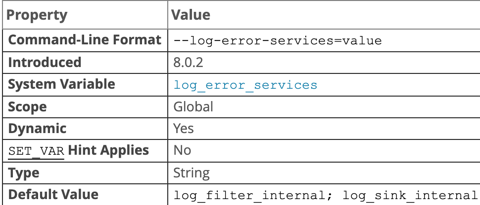

```mysql
# 默认组件 log_filter_internal log_sink_internal
select @@GLOBAL.log_error_services;
```

该变量可以包含具有 0，1 或许多元素的列表，对于列表可以使用分号或逗号（8.0.12）分隔，但不能同时使用，组件顺序决定服务器执行顺序。日志事件首先通过内置过滤器组件 `log_filter_internal`，然后再通过内置日志记录器组件 `log_sink_internal`。记录器是日志事件目的地，记录器将日志事件处理为特定格式的日志消息，并将这些消息写入其关联的输出。分配 `log_error_services` 不包含编写组件的值将导致从该点开始不写入日志处处，最后一个组成部分应该是记录器

输出目标由 `--log-error` 选项确定它们将错误信息写入控制还是文件，如果写入文件则确定错误日志文件名。（在 widow 上，`--pid-file` 和 `--console`）；`log_error_verbosity` 和 `log_error_suppression_list` 系统变量影响日志事件

要更改用于错误日志记录的日志组件集，需要加载组件并修改 `log_error_services` 值。添加或删除日志组件受以下约束：

* 要启用日志组件，首先需要加载（除非已内置或加载），然后在 `log_error_services` 值中添加，尝试在服务器启动时命名未知组件会导致其设置为默认值，尝试在运行时加载未知组件会产生错误，且该值不变。
* 要禁用日志组件，将其从 `log_error_services` 值中删除，如果该组件是可加载的且想卸载该组件，使用 `UNINSTALL COMPONENT`，尝试卸载仍在 `log_error_services` 值中组件会产生错误

```mysql
# 使用系统日志编写器而不是默认编写器，用于加载日志组件的URN前缀为 file://component_
INSTALL COMPONENT 'file://component_log_slink_syseventlog';
SET GLOBAL log_error_services = 'log_filter_internal; log_sink_sysenvent'
```

配置在每次服务器启动时启用的日志组件：

* 如果组件是可加载的，在运行时加载，加载组件会将其注册到 `mysql.component` 系统表中，以便服务器自动加载它以用于后续启动
* `log_error_services` 在启动时设置值以包括组件名称
* 在 `my.cnf` 文件中设置该值，在下次重启时生效
* 使用 `SET PERSIST` 为正在运行的实例设置该值，并保存该值以用于随后的服务器重启，立即生效，并在随后的重启中生效

```mysql
# 安装 json 记录器
INSTALL COMPONENT 'file://component_log_sink_json';
SET PERSIST log_error_services = 'log_filter_internal; log_sink_internal; log_sink_json'
```

```ini
[mysqld]
log_error_services='log_filter_internal; log_sink_internal; log_sink_json'
```

#### 默认错误日志配置

##### Windows 上的默认错误日志

在 windows 上，mysqld 使用 `--log-error`，`--pid-file`，`--console` 选项来确定默认的错误日志目的地是否是控制台或文件，如果是一个文件，的文件名；

* 如果 `--console` 则默认是控制台
* 如果 `--log-error` 未指定，或者未指定文件名，则默认目标是 `host_name.err` 在数据目录中命名的文件，除非 `--pid-file` 指定了该选项，在这种情况下，文件名是 PID 文件的基本名称和 `.err` 后缀的数据目录中文件
* 如果 `--log-error` 指定文件的名称，则默认目标是文件名加 `.err` 位于数据目录下的文件（如果没有后缀，则添加后缀），除非给出绝对路径名以指定其他位置

##### 类Unix上默认错误日志

在该系统上，mysqld 使用 `--log-error` 选项来确定错误日志目标是控制台还是文件，如果是文件，则使用文件名：

* 如果 `--log-error` 未给出，则默认目标是控制台
* 如果 `--log-error` 给出未命名文件，则默认目标是 `host_name.err` 在数据目录中命名的文件
* 如果 `--log-error` 指定文件的名称，则默认目标是文件名加 `.err` 位于数据目录下的文件（如果没有后缀，则添加后缀），除非给出绝对路径名以指定其他位置
* 如果 `--log-error` 选项在 `[server]`，`[mysqld]`，`[mysqld_safe]` 部分，则将其传递到 mysqld

##### 默认错误日志影响日志记录器

如果 `log_error` 为 `stderr`，则默认错误日志是控制台，并且将输出目标基于默认目标的日志记录器也将写入控制台：

* `log_sink_internal`、`log_sink_json`、`log_sink_test`、`log_sink_json` 等所有实例均写入控制台
* `log_sink_syseventlog`：无论 `log_error` 数值，始终都写入系统日志

如果 `log_error` 指示文件名。日志编写器基于该文件名为默认输出文件

* `log_sink_internal`、`log_sink_test` 这些写到 `log_error` 的值文件上
* `log_sink_json` 以 `log_error_services` 值命名的该编写器的连续实例将写入名为 file_name 的文件，再加上一个编号为`.NN.json` 的后缀：`file_name.00.json`，`file_name.01.json` 等。
* `log_sink_syseventlog`：无论 `log_error` 数值，始终都写入系统日志

#### 错误日志过滤器

错误日志配置通常包括一个日志过滤器和一个或多个日志编写器，对于错误日志过滤，mysql 提供以下组件：

##### 基于优先级 log_filter_internal

该组件根据错误日志事件的优先级 ERROR、WARNING、INFORMATION 和参数 `log_error_verbosity` 、`log_error_suppression_list` 变量提供错误日志过滤。该组件内置并默认启用

*log_error_verbosity参数*

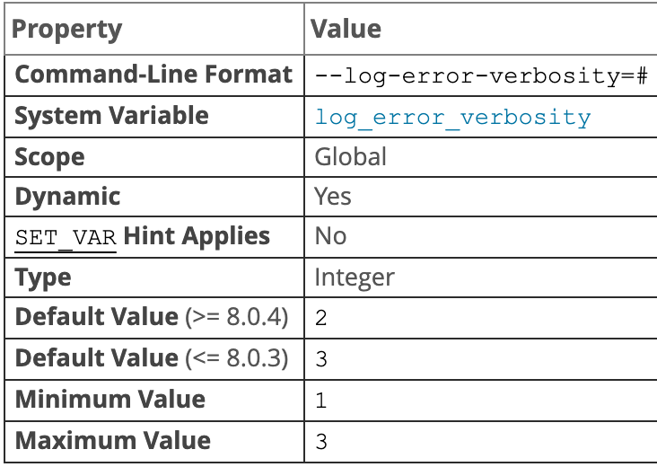

指定用于处理用于错误日志事件的详细程度。该参数影响 `log_filter_internal` 错误日志过滤器组件执行的过滤，如果 `log_filter_internal` 禁用，`log_error_verbosity` 则无效。

用于错误日志事件具有的优先级 ERROR、WARNING 或 INFORMATION。`log_error_verbosity` 根据允许将优先级写入日志优先级控制详细程度

|        允许的优先级         | log_error_verbosity 的值 |
| :-------------------------: | :----------------------: |
|            ERROR            |            1             |
|       ERROR、WARNING        |            2             |
| ERROR，WARNING，INFORMATION |            3             |

还有一个优先级 `SYSTEM`，无论 `log_error_verbosity` 值如何，有关非错误情况下的系统消息都会打印到错误日志。包括（启动关闭以及对设置的重大更改）

如果 `log_error_verbosity` 为 2 或更大，错误日志记录不安全语句。如果值为 3 则将记录连接和访问被拒绝的错误及新连接尝试。如果使用复制，建议使用 2 或更大的值，以获得更多信息（如网络故障和重新连接的消息），如果在从服务器上大于等于 2， 则从服务器会将错误消息打印到错误日志（如二进制日志和中继日志坐标）。在MySQL错误日志中，系统消息被标记为 `System`。

*log_error_suppression_list参数*

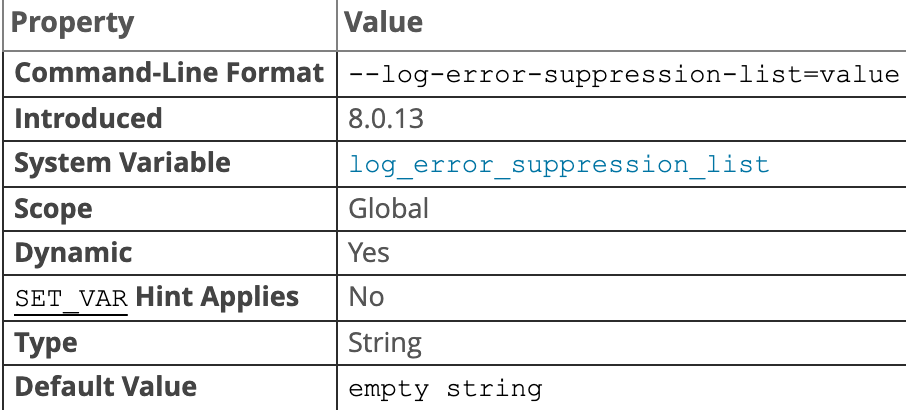

该参数适用于错误日志事件，指定时它们用的优先级进行事件 WARNING 或 INFORMATION 进行降噪。如果某种特定类型的警告由于频繁发生但并不令人关注，因此在错误日志中被认为是不希望的噪音。影响 `log_filter_internal` 错误日志过滤器组件进行的过滤，如果该组件被禁用，该变量无效。

该变量值可以是空字符串或一个或多个逗号分隔值的列表，这些值指示要抑制的错误代码。错误代码可以符号或数字形式指定。可以指定带或不带 MY-前缀的数字代码，数字部分中的前导零不重要

```
# 允许格式
ER_SERVER_SHUTDOWN_COMPLETE
MY-000031
000031
MY-31
31
```

从可读性和可移植性的角度来看，符号值优于数字值，每个代码的值必须在允许的范围内

* 1 ～ 999：服务器和客户端使用的全局错误代码
* 10000：服务器错误代码，将写入错误日志（不发送给客户端）

指定的每个错误代码必须由 MySQL 实际使用。尝试指定不在允许范围内或允许范围内但未被 mysql 使用的代码会产生错误，并且该参数值保持不变。

```ini
# 配置实例
[mysqld]
log_error_verbosity=2
log_error_suppression_list='ER_PARSER_TRACE,MY-010001,10002'
```

此配置下，`log_error_verbosity` 允许具有 Error 或 WARING 优先级的消息。优先丢弃 WARING 优先级和在 `log_error_suppression_list` 中的代码。`log_error_verbosity` 为 1 时，`log_error_suppression_list` 无效

##### 基于规则 log_filter_dragnet

此过滤器根据用户提供的规则结合 `dragent.log_error_filter_rules` 参数提供错误日志过滤。

*`dragnet.log_error_filter_rules`参数*

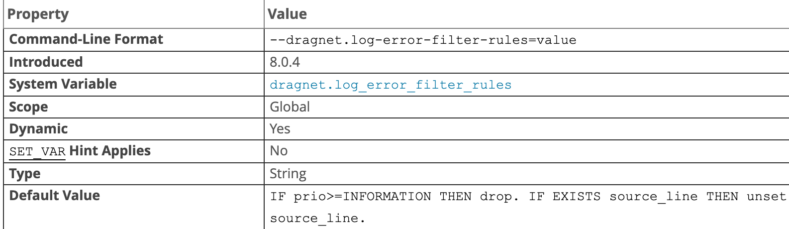

过滤器规则控制 `log_filter_dragnet` 错误日志过滤器组件的操作。如果 `log_filter_dragnet` 未安装，则该参数不可用。如果已安装但未启用，则更改该参数无效。

8.0.12 开始，可以查询 `dragnet.Status` 变量以确定对该参数的最新复制结果，之前设置该值成功后查看 `show warnings` 则会产生一条注释。

### General query log

* 一般查询日志是 `mysqld` 做什么的记录，当客户端连接或断开连接时，服务器会将信息写入该日志，并记录从客户端收到的每个 SQL 语句。`mysqld` 按照接收语句的顺序将语句写入查询日志，可能与它们执行的顺序不同，与二进制日志相反，二进制日志的执行顺序时语句执行之后但释放任何锁之前。查询日志可能包含仅选择数据的语句，这些语句不会写入二进制日志。

* 在复制主服务器上使用基于语句的二进制日志记录时，其从属服务器接收的语句将写入每个丛书服务器的查询日志中。如果客户端使用 `mysqlbinlog` 程序读取事件并将其传递到服务器，则将语句写入主服务器的查询日志

* 当使用基于行的二进制日志记录时，更新时作为行更改而不是 SQL 语句发送的，这些语句永远不会写入查询日志 。当 `binlog_format = mixed` 时，取决于所使用的语句，给定的更新也可能不会写入查询日志

* 默认情况下，常规查询日志处于禁用状态。

  ```shell
  # 命令行启动，不带参数或1时启动，0时禁用
  --general_log={0|1}
  --general_log
  # 指定日志文件，默认文件 host_name.log,除非指定绝对路径名以指定其他目录，否则将在数据目录中创建文件
  --general_log_file=file_name
  ```

* 支持运行时禁用或更改日志文件名

* 服务器重新启动，并且日志刷新不会导致生成新的查询日志文件（刷新会关闭并重新打开它）

  ```shell
  # 重命名并创建新日志文件
  mv host_name.log host_name-old.log
  mysqladmin flush-logs
  mv host_name-old.log backup-directory
  ```

  可以在运行时禁用日志，来重命名查询日志文件，且不需要重新启动服务器

* `log_timestamps` 系统变量控制写入查询日志文件的时区（以及慢查询日志文件和错误日志）。它不影响写入日志表的常规查询日志和慢查询消息的时区，但是`CONVERT_TZ()`通过设置会话`time_zone`系统变量或通过设置会话系统变量，可以将从这些表中检索的行从本地系统时区转换为任何所需时区 。 

* 会重新语句中的密码，使用 `log_raw` 变量控制

### Binary log

`binlog` 会记录所有的逻辑操作，并且是采用 `追加写` 的形式。如果 `DBA` 承诺说半个月内可以恢复，那么备份系统中一定会保存最近半个月的所有 `binlog`，同时系统会定期做整库备份（时间取决于系统的重要性，可以是一天一备份，也可以是一周一备份）

当需要恢复到指定的某一秒时，比如某天下午两点有一次误删表，需要找回数据，可以这么做

* 首先，找到最近的一次全量备份，从这个备份恢复到临时库
* 然后，从备份的时间点开始，将备份的 `binlog` 依次取出来，重放到中午误删表之前的那个时刻
* 这样临时库就跟误删之前的线上库一样了，然后可以把表数据从临时库取出来，按需要恢复到线上库区

二进制日志包含描述数据库更改的“事件”。还包含针对可能进行了更改的语句的事件（DELETE 不匹配任何行），除非使用基于行的日志记录。二进制日志还包含有关每个语句花费多长事件的信息。二进制日志主要作用：

* 对于复制，主复制服务器上的二进制日志提供了要发送到从服务器的数据更改的记录。主服务器将其二进制日志中包含的事件发送到其从属服务器，从属服务器执行执行事件以对主服务器进行相同的数据更改
* 某些数据恢复操作需要使用二进制日志。还原备份后，将重新执行在执行备份后记录的二进制日志中的事件。这些事件使数据库从备份开始就保持最新状态（即进行时间点增量恢复）

不记录诸如  `SELECT` 或 `SHOW` 不修改数据的语句。启用二进制日志会使用服务器性能稍微下降。二进制日志仅记录完整事件或事务，会重新在二进制日志中语句的密码，以使它们不会以纯文本的形式出现。

8.0.14 开始，可以对二进制日志文件和中继日志文件进行加密，使用变量 `blnlog_encrytion = on` 

具有特定权限的客户端，可以使用 `SET sql_log_bin=OFF` 语句禁用其自身语句的二进制记录

默认情况下，服务器记录事件的长度以及事件本身，并使用它来验证事件是否被正确写入。可以通过设置 `binlog_checksum` 系统变量来使服务器编写事件的校验和。从二进制日志中读回时，默认情况下，主服务器使用事件长度，但可以通过 `master_verify_checksum` 系统变量来使用校验和。从库要验证从主库收到的事件，通过启用 `slave_sql_verify_checksum` 系统变量，可以从中继日志中读取事件使用校验和

复制从属服务器在默认情况下启用 `log_slave_updates` 系统变量的情况下启动的，从属服务器会将将从复制主服务器收到的所有数据修改写入其自己的二进制日志。必须启用二进制日志才能使此设置生效。此设置使从属服务器可以在链式复制中充当其他从属服务器的主服务器

可以使用 `RESET MASTER` 语句删除所有二进制日志文件，或者使用 `PURGE BINARY LOGS` 删除其中一部分

```shell
# 从二进制日志中更新 mysql 服务器
mysqlbinlog log_file | mysql -h server_name
```

8.0 版本的二进制日志格式与之前不一样。不能跨版本复制

如果服务器无法写入二进制日志，刷新二进制日志文件或将二进制日志同步到磁盘，则复制主数据库上的二进制日志可能变得不一致，并且复制从数据库可能会与主数据库失去同步。

默认情况下，二进制日志在每次写入（`sync_binlog = 1`）时都会同步到磁盘。如果未指定，操作系统崩溃，二进制日志最后一条语句可能会丢失。Innodb 使用 XA 事务两阶段提交保证二进制日志语句 InnoDB 数据文件同步。

#### Binary Logging Options and Variables

##### Startup Options Used with Binary Logging

* `binlog-row-event-max-size=N`

  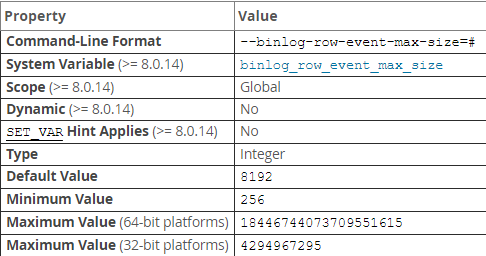

  当使用基于行的二进制日志记录时，此设置对基于行的二进制日志事件的最大大小（以字节为单位）的软限制。如果可能，将二进制日志中存储的行分组为大小不超过此设置值的事件。如果事件无法拆分，则可以超过最大大小。该值必须是 256 的倍数（否则将被舍入为 256）。默认为 8192

* `--log-bin[=base_name]`

  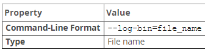

  指定用于二进制日志文件的基本名称。二进制日志文件包含基本名称和数字扩展名，服务器在基本名称后添加数字后缀来依次创建二进制日志文件。

  如果不提供该选项，使用默认基本名称。如果提供的 `--log-bin` 选项不带字符串或带空字符串，则基本名称默认为 `host_name-bin`。二进制日志文件的基本名称和任何指定的路径都可以用作 `log_bin_basename` 系统变量

  默认位置是数据目录。要更改该位置使用 `--log-bin=/absolute/path/`，绝对路径地址。

  8.0 之前，默认禁用二进制日志，指定了该选项则启用，8.0 开始，无论是否指定 `--log-bin` 选项，默认情况下都会启用二进制日志记录。启用二进制后，`log_bin` 系统变量为 `ON`

  禁用二进制日志记录，可以在启动时指定 `--skip-log-bin` 或 `--disable-log-bin` 选项，当与 `log-bin` 选项同时设置时，后设置选项会覆盖之前选项。

  在服务器上使用 GTID 时，如果在异常关闭后重新启动服务器时禁用了二进制日志记录，则某些 GTID 可能会丢失，从而导致复制失败。在正常关闭状态下，当前二进制日志文件中的 GTID 集会保存在 `mysql.gtid_executed` 表。在恢复过程中，只要仍启用了二进制日志记录，就会将 GTID 从二进制日志文件添加到表中。如果在重新启动服务器时禁用了二进制日志记录，则服务器将无法访问二进制日志文件以恢复 GTID，因此无法启动复制。正常关闭后，可以安全的禁用二进制日志。

  `--log-slave-updates` 和 `--slave-preserve-commit-order` 选项需要二进制日志。如果禁用二进制日志，则忽略这些选项或指定 `--log-slave-updates=OFF` 和 `--skip-slave-preserve-commit-order` 如果同时指定这些选项和禁用二进制日志，则警告报错

  5.7 中，启用二进制日志记录时必须指定服务器ID，否则服务器无法启动。8.0 中，`server_id` 系统变量默认设置为 1。对于复制拓扑中使用的服务器，必须为每个服务器指定一个唯一的非零服务器 ID

* `--log-bin-index[=file_name]`

  二进制日志索引文件的名称，其中包括二进制日志文件的名称。默认情况下，它的位置和基本名称与使用 `--log-bin` 选项加扩展名为二进制日志文件指定的值相同 `.index`。如果未指定 `--log-bin`，则默认的二进制日志索引文件名为 `binlog.index`。如果指定的 `--log-bin` 选项不带任何字符串或为空字符串，则默认的二进制日志索引文件名是 `host_name-bin.index`，使用主机名

**下列选项影响将那些语句写入二进制日志，然后由复制主服务器发送到其从属服务器。从服务器还有一些选项，用于控制应执行或忽略从主服务器接收的那些语句**

* `--binlog-do-db=db_name`

  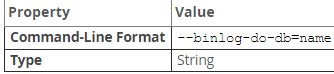

  类似于 `--replicate-do-db` 影响复制的方式影响二进制日志记录。

  此选项的效果取决于使用的是基于语句的记录格式还是基于行的日志记录格式（同 `--replicate-do-db`）。DDL 语句始终作为语句记录，而不考虑有效的记录

  **基于语句的日志记录**

  只有那些语句被写入二进制日志，要指定多个数据库，多次使用此选项，每个数据库依次；但是，这样做不会导致在选择其他数据库或没有数据库时记录跨数据库语句（`UPDATE some_db.some_table SET foo='bar'`）。默认数据库为使用 `selected` 或 `use` 语句指定的

  ```mysql
  # --binlog-do-db=sales binlog_format=statement,以下语句不会记录 binlog
  USE prices;
  UPDATE sales.january SET amount=amount+1000;
  # --binlog-do-db=sales, binlog_format=statement，以下语句会记录 binlog,sales是update发出该语句时的默认数据库
  USE sales;
  UPDATE prices.discounts SET percentage = percentage + 10;
  ```

  **基于行的日志记录**

  记录仅限于数据库，仅记录属于数据库的表的更改；

* `--binlog-ignore-db=db_name`

  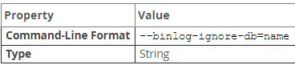

  类似 `--replicate-ignore-db` ，取决于日志格式。要指定多个忽略的数据库，多次使用此选项，每个数据库依次。

  **基于语句的日志记录**

  则无法登录其中默认的数据库（选择一个任何声明USE）是。如果没有默认数据库，则不应用任何选项，并且始终记录此类语句。

  **基于行的格式**

  告诉服务器不要将更新记录到数据库中的任何表

**校验和选项**

服务器支持读写二进制日志校验和

* `--binlog-checksum={NONE|CRC32}`

  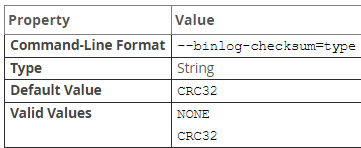

  启用此选项会导致主服务器为写入二进制日志的事件编写校验和。不能在事务中更改此选项。要控制 slave 从中继日志读取校验和，使用 `--slave-sql-verify-checksum` 选项

**测试和debug选项**

* `--max-binlog-dump-events=N`

  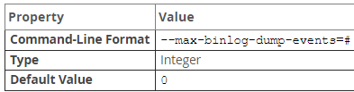

  MySQL测试套件在内部使用此选项进行复制测试和调试。

* `--sporadic-binlog-dump-fail`

  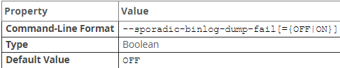

  MySQL测试套件在内部使用此选项进行复制测试和调试。

**系统变量**

控制二进制日志记录的系统变量，可以在服务器启动时设置，部分也可以在运行时更改

* `binlog_cache_size`

  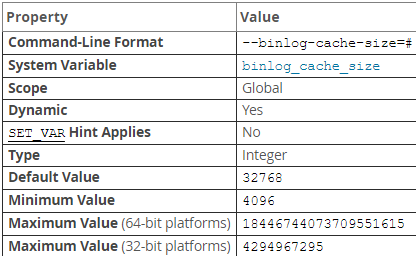

  当处理事务的线程启动时，它分配一个缓存区缓存二进制语句。在事务期间，用于保存更改的二进制日志的内存缓存区大小。在服务器上启用二进制日志记录时，如果服务器支持任何事务存储引擎，则会为每个客户端分配一个二进制日志缓存。如果用于事务的数据超过了内存缓冲区中的空间，则多余的数据将存储在一个临时文件中。当服务器上的二进制日志加密开启时，不会对内存缓存区进行加密。8.0.17 任何用于保存二进制日志缓存的临时文件都将被加密。提交每个事务后，通过清除内存缓存区并截断临时文件（如果使用）来重置二进制日志缓存

  如果经常使用大型事务，则可以通过减少或消除写入临时文件的需要来增加此缓存的大小，以获得更好的性能。`Binlog_cache_use` （用缓存或临时文件用于存储事务语句的数目）和 `Binlog_cache_disk_use` （有多少交易实际上不得不使用临时文件）状态变量可用于调整此变量的大小

  `binlog_cache_size` 仅设置事务缓存的大小；语句缓存的大小由 `binlog_stmt_cahce_size` 系统变量控制

* `binlog_checksum`

  

  启用后，此变量使主服务器将每个事件的校验和写入二进制日志中。更改此变量的值会导致二进制日志被轮换。校验和总是写入整个二进制日志文件，而不是仅写入其中一部分。将主服务器上的此变量设置为从服务器无法识别的值会导致从服务器将其自身的 `binlog_checksum` 值设置为 NONE，并因错误而停止复制。

* `binlog_direct_non_transactional_updates`

  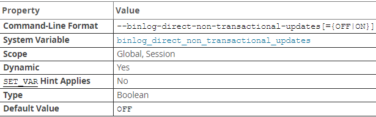

  由于并发问题，当事务同时包含对事务表和非事务表的更新时，从站可能会变得不一致。MYSQL 试图通过将非事务性语句写入事务高速缓存来保留这些语句之间的因果关系，事务高速缓存将在提交后刷新。但是，当代表事务对非事务表所做的修改对其他连接而言立即可见时，就会出现问题，因为这些更改可能不会立即写入二进制日志中。

  该 `binlog_direct_non_transactional_updates` 变量为该问题提供了一种可能的解决方法。默认情况下，此变量是禁用的。启用 `binlog_direct_non_transactional_updates` 会使对非事务表的更新直接写入二进制日志，而不是事务高速缓存

  从 8.0.14 开始，设置此系统变量的会话是受限制操作。

  `binlog_direct_non_transactional_updates` 仅适用于使用基于语句的二进制日志记录格式复制的语句；它仅在 `binlog_format` 为 `STATEMENT` 或 `MIXED` （使用基于语句的格式复制给定语句时）才有效。当二进制日志格式为 ROW 或 `MIXED` 使用基于行的格式复制给定语句时，此变量无效

  在启用此变量之前，必须确保事务表和非事务表之间没有依赖关系。（如 `INSERT INTO myisam_table SELECT * FROM innodb_table`）否则，这样可能导致从库偏离

* `binlog_encryption`

  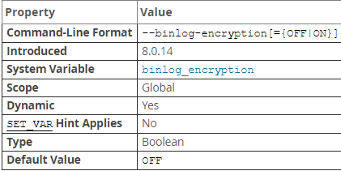

  为该服务器上的二进制日志文件和中继日志文件启用加密。OFF 是默认值。ON 为二进制日志文件和中继日志文件设置加密。无需在服务器上启用二进制日志记录即可启用加密
  
* `binlog_error_action`

  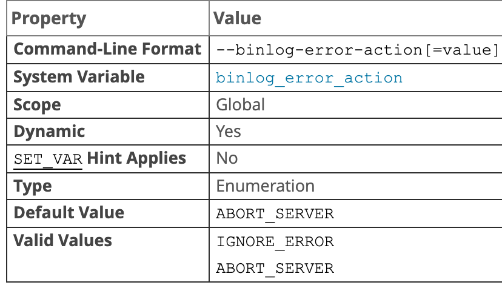

  控制当服务器无法写入，刷新或同步二进制日志之类的错误的情况下。该错误可能导致主持不一致，或失去同步。默认 `ARBORT_SERVER` ，使得服务器在遇到二进制日志中的此类错误时就停止日志记录并关闭。重新启动后，将继续运行。为 `IGNORE_ERROR` 时，如果遇到这类错误，它将继续进行中的事务，记录该错误然后停止记录，并继续执行更新。此设置提供了与旧版的向后兼容。

* `binlog_expire_logs_seconds`

  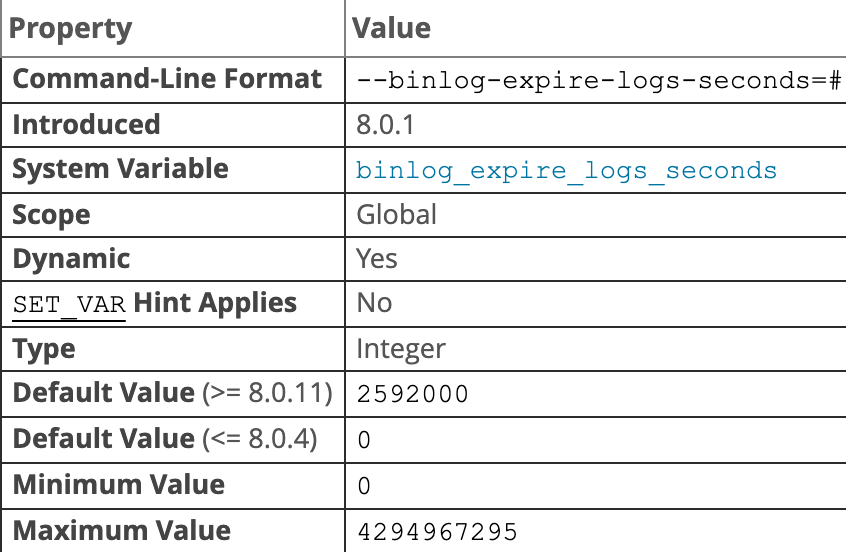

  设置二进制日志的有效期（以秒为单位）。有效期后，自动删除日志文件。默认为 30 天，同时设置该变量和 `expire_logs_days`，以该变量为准。要禁用自动清除二进制日志，显式设置该变量为 0，且不设置 `expire_logs_days`，或 `expire_logs_days` 显式设置为 0，且不为 `binlog_expire_logs_seconds` 指定值。

* `binlog_group_commit_sync_delay`

  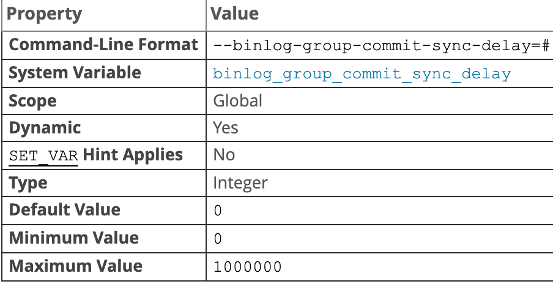

  控制二进制日志提交在将二进制日志文件同步到磁盘之前等待多时微秒。默认为 0，表示没有延迟。设置该值可使更多事务一次同步到磁盘上，从而减少提交一组事务的总时间。

  设置会增加服务器上事务的延迟，可会会影响客户端应用程序。在高并发工作负载上，延迟可能会增加争用并降低吞吐量。

* `binlog_group_commt_sync_no_delay_count`

  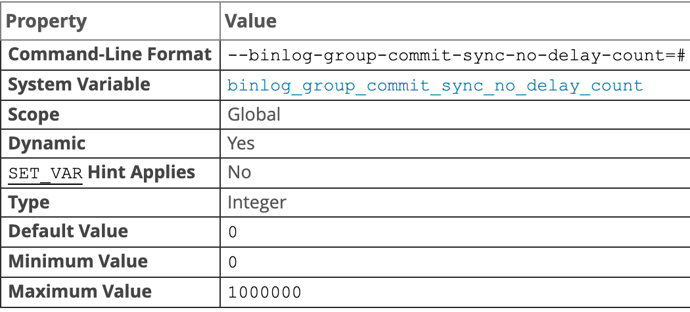

  指定当前要等待的最大事务数，如果 `binlog_group_commit_sync_delay` 设置为0，则此选项无效。

* `log_slave_updates`

  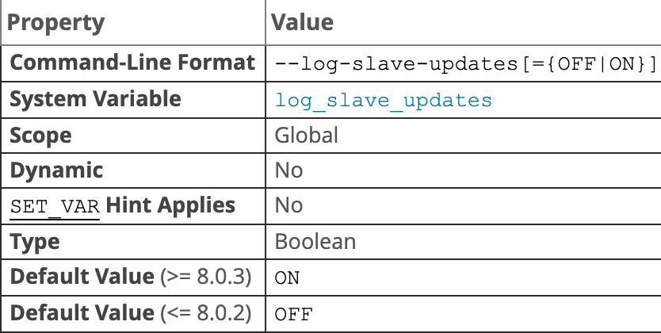

  从服务器从主服务器收到的更新是否应该记录到从服务器自己的二进制日志中。启用该变量可以组成链式复制

* `max_binlog_size`

  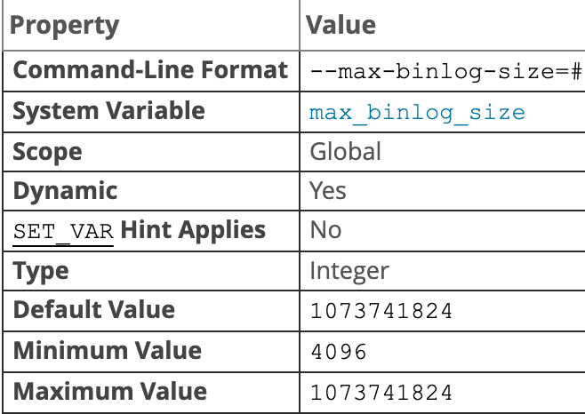

  如果对二进制日志的写入导致当前日志文件的大小超过此变量的值，则服务器将关闭当前文件并打开下一个日志。加密的二进制日志文件还有一个 512 字节的标头。事务以一个块的形式写入二进制日志，因此永远不会在多个二进制日志之间进行拆分。二进制日志文件可能大于 `max_binlog_size`。如果 `max_relay_log_size` 为 0，则该值也适用于中继日志

* `sync_binlog`

  控制二进制日志同步到磁盘的频率：0，禁用，使用操作系统刷新到磁盘。1 默认值，提交事务之前同步到磁盘，可以确保二进制日志不会丢失任务事务。N，二进制日志提交组已收集 N 组之后，将同步到磁盘。

  为了在 Innodb 于事务一起使用的复制中获得最大的持久性和一致性：

  ```ini
  sync_binlog = 1
  innodb_flush_log_at_trx_commit = 1
  ```

* `transaction_write_set_extraction`

  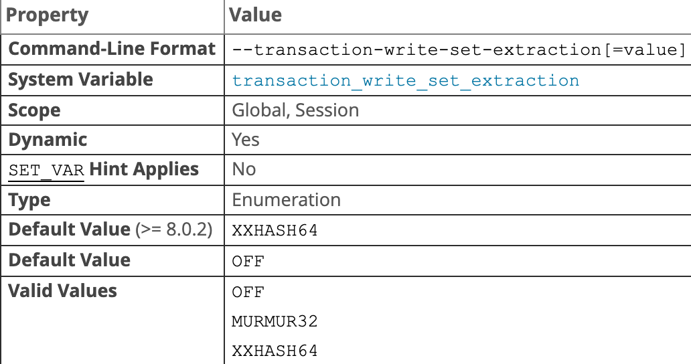

  定义用于对事务期间提取的写入进行哈希处理的算法。如果使用组复制，则此变量必须设置为 `XXHASH64`，因为在所有组成员上进行冲突检查都需要从事务中提取写操作。

#### 二进制日志格式

服务器使用几种日志记录格式，使用`--binlog-format` 系统变量控制。使用基于语句的复制时，复制不确定性语句可能会出现问题。在确定给定语句对于基于语句的复制是否安全时，MySQL确定是否可以保证可以使用基于语句的日志记录来复制该语句。如果MySQL无法做出保证，它将标记该语句为潜在不可靠的对象，并发出警告，以语句格式登录该语句可能并不安全。您可以通过使用MySQL的基于行的复制来避免这些问题。

* STATEMENT

  基于 SQL 语句

* ROW（默认）

  主服务器将事件写入二进制日志，指示各个表受到的影响

* MIXED

  默认情况下使用基于语句的日志记录，某些情况下会自动切换为基于行格式记录。服务器在以下情况下自动切换为基于行记录：

  当包含 `UUID()` 函数；当一个或多个带有 AUTO_INCREMENT 列的表被更新并且触发器或存储的函数被调用时；`LOAD_FILE()`；当一条语句引用一个或多个系统变量时；当涉及的表时 mysql 数据库中的日志表时。使用 `FOUND_ROWS`，`ROW_COUNT()`，`USER()`，`CURRENT_USER()`，`CURRENT_USER`；

可以在启动时或运行时更改日志格式，运行时更改支持全局（大多数情况下不能更改）和会话。仅在使用基于语句的复制时才会记录临时表，而基于行和混合格式不会记录。

在复制进行中切换复制格式会导致问题。每个 MySQL Server 可以设置自己且只能设置自己的二进制日志格式。更改复制主服务器上的日志记录不会导致从服务器更改其日志记录格式以匹配。使用语句格式时，不会复制系统变量，使用 MIXED 或 ROW 记录模式时，会被复制，但被从库忽略。主从二进制日志格式必须一致。

如果使用 InnoDB 表，并且事务隔离级别为 `READ_COMMITED` 或 `READ_UNCOMMITED`，只能使用行格式

将二进制日志格式设置为行时，某些更改仍然使用基于语句的格式，包含所有的 DDL 语句。

### Relay log

与二进制日志一样，由一组编号文件和一个索引文件组成，默认位置是数据目录。与二进制日志具有相同的格式，可以使用 mysqlbinlog 读取。对于默认复制通道，中继日志文件名具有默认格式 `host_name-relay-bin.index`。对于非默认复制通道，默认基本名称为 `hist_name-relay-bin-channel.num`

默认中继日志文件和索引文件可以使用 `relay_log` 和 `relay_log_index` 系统变量覆盖。如果在复制开始后遇到问题，一种解决方法是停止从服务器，将旧中继日志文件内容放在新的前面，并重启服务器

```shell
cat new_relay_log_name.index >> old_relay_log_name.index
mv old_relay_log_name.index new_relay_log_name.index
```

从服务器在以下条件创建新的中继日志文件

* 每次启动 I/O 线程
* 清除日志如（FLUSH LOGS 或 mysqladmin flush-logs）
* 当前中继日志文件大小太大时，如果 `max_relay_log_size` 大于 0，则为最大中继日志大小，如果 `max_relay_log_size` 为 0，则 `max_binlog_size` 为中继日志文件大小

SQL线程在执行每个中继日志文件中的所有事件并且不再需要它之后，会自动删除该文件。没有明确的机制可以删除中继日志，因为SQL线程会这样做。但是， `FLUSH_LOGS` 刷新中继日志，这会影响SQL线程删除它们的时间。

### Slow query log

慢查询日志由 SQL 语句组成，这些语句需要花费超过 `long_query_time` 时间来执行并且最少请求了 `min_examined_row_limit` 行。可以使用命令行 `mysqldumpslow` 来分析慢查询日志

#### 参数

* `slow_query_log`

  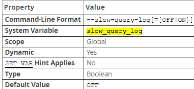

  是否启用慢速查询日志，可以是 0 或 OFF 以禁用日志，1 或 ON 开启。要指定日志文件名，使用 `--slow_query_log_file = file_name`，要指定日志目标，使用 `log_output` 系统变量。如果没有为慢日志指定名称，默认为 `host_name-slow.log`，除非指定了绝对路径名以指定其他目录，否则服务器将在数据目录中创建文件。

  要在运行时禁用或启用慢查询日志

* `long_query_time` 

  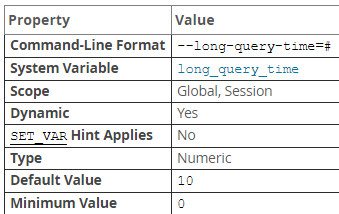

  如果查询所花的时间长于该值，服务器将增加 `slow_queries` 状态变量。如果启用了慢查询日志，则查询将记录到慢查询日志文件中。该值实时测量，不是 CPU 时间。在轻负载系统上低于阈值的查询可能会在重负载系统上高于阈值。最小和默认分别 0 和 10，可以将值指定为微秒的分辨率

* `log_slow_admin_statements`

  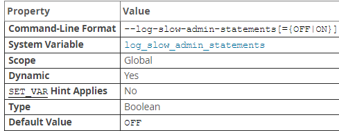

  默认情况下，不记录管理语句，使用该变量修改，管理语句包含 `ALTER TABLE，ANALYZE TABLE，CHECK TABLE，CREATE_INDEX，DROP INDEX，OPTIMIZE TABLE，REPAIR TABLE`

* `log_queries_not_using_indexes`

  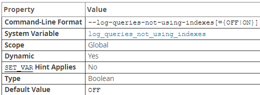

  默认情况下，不记录未使用索引的查询，如果在启用慢查询日志的情况下启用此变量，则会记录预期将检索所有行的查询，此选项不一定意味着不使用索引（使用全索引扫描的查询使用索引，但由于索引不会限制行数而将被记录）
  
* `min_examined_row_limit`

  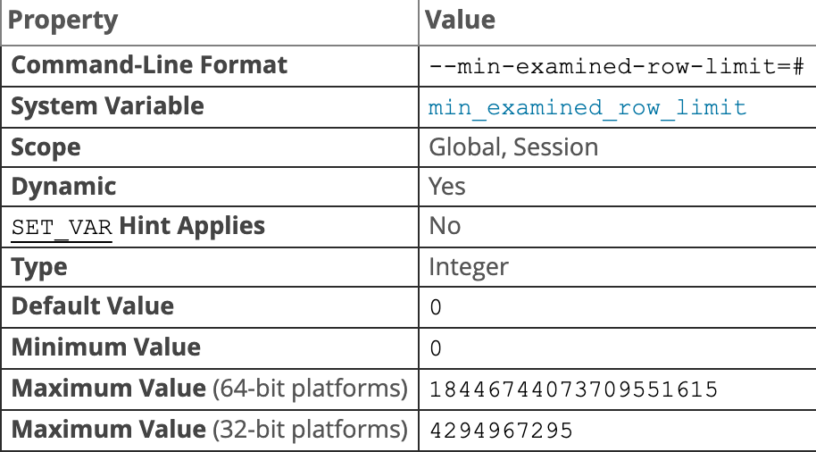

  检查少于此行数的查询不会记录到慢查询日志中

* `log_throttle_queries_not_using_indexes`

  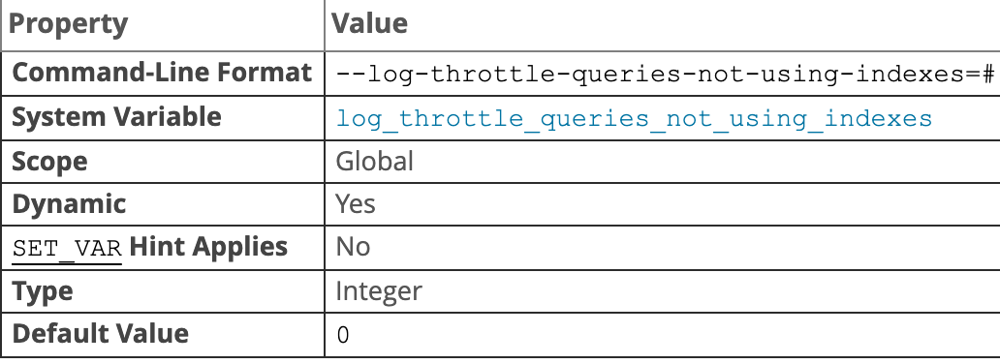

  如果 `log_queries_not_using_indexes` 启用，该变量将限制每分钟可写入慢查询日志的此类查询的数量，默认 0 不限制

服务器按以下顺序使用控制参数来确定是否将查询写入慢查询日志：

1. 该查询必须不是管理语句，或者启用了 `log_slow_admin_statements`
2. 该查询必须至少花费了 `long_query_time` 时间，或者 `log_queries_not_using_indexes` 必须启用并且该查询未使用任何所有进行行查找
3. 该查询必须至少检查了 `min_examined_row_limit` 行
4. 不得根据 `log_throttle_queries_not_using_indexes` 设置禁止查询

默认情况下，复制从设备不会将复制的查询写入慢查询日志。当启用 `log_slow_slave_statements` 系统变量，且二进制日志为语句时，查询才会添加到从属的慢查询日志中。当二进制日志为行格式时，`log_slow_slave_statements` 系统变量失效，慢查询不会添加到从库的慢查询日志中

#### 慢查询日志内容

如果启用了慢查询日志并将 FILE 作为其输出目标，则写入日志的每个语句都以 # 字符开头，并且都在一行上，写入慢查询日志文件的每个语句之前都有一个 SET 包含时间戳的语句，8.0.14 开始，时间戳指示何时开始执行，8.0.14 之前，指示记录时间（执行之后）包含以下字段：

`Query_time`：duration 语句执行时间，以秒为单位；`Lock_time`：duration，获取锁的时间，以秒为单位；`Rows_sent`：N，发送给客户端的行数；`Rows_examined`：服务器层检查的行数，不计算存储引擎内部的任何处理。

启用 `log_slow_extra` 系统变量，8.0.14 起可用，还会包含以下额外字段，table 输出不受影响：

`Thread_id`，`Errno`，`Killed`，`Bytes_sent`，`Bytes_received`，`Read_first`，`Read_last`，`Read_key`，`Read_next`，`Read_prev`，`Read_rnd`，`Read_rnd_next`，`Sort_merge_passes`，`Sort_range_count`，`Sort_rows`，`Sort_scan_count`，`Created_tmp_disk_tables`，`Created_tmp_tables`，`Start`，`End`

服务器将重写慢查询日志语句中的秘密，使之不会以纯文本形式出现

##### DDL log(metadata log)

元数据日志记录由数据定义语句生成的元数据操作。服务器使用此日志从元数据操作中发生的崩溃中恢复。该记录被写入数据目录中的  `ddl_log.log` 文件，是一个二进制文件，不应该修改它。该文件按需创建并且服务器成功启动后将其删除，该文件可能不会出现在以完全正确方式运行的服务器上。

#### Redo log

#### redo log(InnoDB 引擎日志)

* `redo log` 是物理日志，记录的是 “在某个数据页上做了什么修改”
* WAL: `write-ahead-logging` 先写日志，再写磁盘。（当有一条记录需要更新的时候，`InnoDB` 引擎会先把记录写到 `redo log` 里面，并更新内存，这个时候更新就算完成了。`InnoDB` 引擎会在系统空闲时将操作记录更新到磁盘里面）
* `redo log` 是固定大小的。（从头开始写，写到末尾就又回到开头循环写，`write pos` 是当前记录的位置，一边写一边后移。循环写。`checkpoint` 是当前要擦除的位置，也是往后推移并且循环的。擦除记录前要把记录更新到数据文件），有了 `redo log`，`InnoDB` 就可以保证即使数据库发生异常重启，之前提交的记录都不会丢失，这个能力称为 `crash-safe`
* `Innodb_flush_log_at_trx_commit` 参数设置 1 时，表示每次事务的 `redo log` 都直接持久化到磁盘。可以保证 `mysql` 异常重启之后数据不丢失