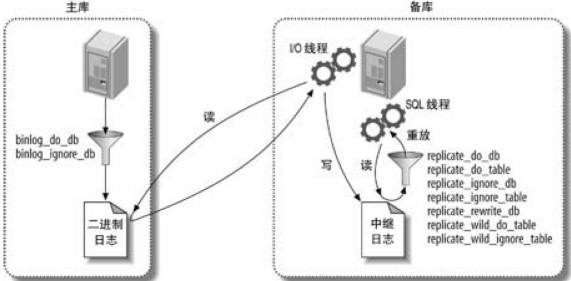
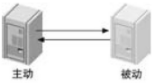
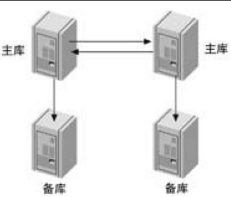
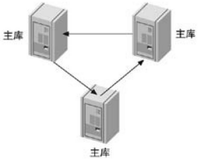

### 复制

#### 概述

复制解决的基本问题是让一台服务器的数据与其他服务器保持同步。一台主库的数据可以同步到多台备库上，备库本身也可被配置成为另外一台服务器的主库。主备之间可以有多种组合方式

支持基于行的复制和基于语句的复制。两种方式都是通过在主库上记录二进制日志，在备库上重放日志的方式来实现异步的数据复制。这意味着，在同一时间点备库上的数据可能与主库存在不一致，并且无法保证主备之间的延迟。复制大部分向后兼容，新版本的服务器可以作为老版本服务器的备库，但老版本无法作为新版备库。大版本升级需测试

复制通常不会增加主库的开销，主要是启用二进制日志带来的开销，每个备库也会对主库增加一些负载（网络，I/O，尤其当备库请求从主库读取旧的二进制日志文件时，可能会造成更高的 I/O 开销，锁竞争也可能阻碍事务的提交）如果从一个高吞吐量的主库上复制多个备库，唤醒多个复制线程发送事件的开销将会累加。在一主多从架构中，写操作会被执行多次，这时候整个系统的性能取决于写入最慢的那部分

复制只能扩展读操作，无法扩展写操作。对数据进行分区是唯一可以扩展写入的方法。

##### 工作原理

复制有三个步骤：

1.在主库上把数据更改记录到二进制日志中：在每次准备提交事务完成数据更新前，主库将数据更新的事件记录到二进制日志中。按事务提交的顺序，而非每条语句的执行顺序来记录二进制日志。记录二进制日志后，主库会告诉存储引擎可以提交事务了

2.备库将主库上的日志复制到自己的中继日志中：备库会启动一个工作线程（I/O线程），会跟主库建立一个普通的客户端连接，然后再主库上启动一个特殊的二进制转储（`binlog dump`）线程（该线程没有对应的 SQL 命令），该线程会读取主库上二进制日志中的事件。它不会对事件进行轮询。如果该线程追赶上了主库，它将进行睡眠状态。直到主库发送信号量通知器有新事件产生才会被唤醒，备库 I/O 线程会将接受到的事件记录到中继日志中

```sql
// 启动或停止 I/O 线程
start/stop slave IO_THREAD
// 启动或停止 SQL 线程
start/stop slave SQL_THREAD
```

3.备库读取中继日志中的事件，将其重放到备库数据上：备库 SQL 线程执行最后一步，该线程从中继日志中读取事件并在备库执行，从而实现备库数据的更新。

##### 基于语句的复制

5.0 及之前的版本中只支持基于语句的复制（逻辑复制），在基于语句的复制模式下，主库会记录那些造成数据更改的查询，当备库读取并重放这些事件时，实际上只是把主库执行过的 SQL 再执行一遍。

实现简单。二进制日志里事件更加紧凑。不占带宽，`mysqlbinlog` 工具是适用基于语句的日志最佳工具。再传输的二进制日志中，除了查询语句，还包括了一些元数据信息（如当前的时间戳）。还存在着一些无法被正确复制的 SQL（`CURRENT_USER()` 等函数语句），存储过程和触发器在适用基于语句的复制模式时也可能存在问题。更新必须串行。需要更多的锁。

当主备的模式不同时，逻辑复制能够在多种情况下工作（主备上表的定义不同但数据类型相兼容，列的顺序不同等），可以很容易先走备库上修改 schema，然后将其提升为主库，减少停机实际。

##### 基于行的复制

5.1 开始支持。将实际数据记录在二进制日志中。可以正确的复制每一行，一些语句可以被更加有效的复制。

几乎没有基于行的复制模式无法处理的场景。对于所有的 SQL 构造、触发器、存储过程等都能正确执行。只是试图做一些诸如在备库修改表的 schema 这样的事情时才可能导致复制失败。

在某些情况下，基于行的复制能够帮助更快找到并解决数据不一致的情况。如果是适用基于语句的复制模式，在备库更新一个不存在的记录时不会失败，但在基于行的复制模式下则会报错并停止复制（该行为可以通过 `slave_exec_mode` 来配置）

##### 复制文件

复制除了会用到二进制日志文件和中继日志文件，还会用到以下文件：

* `mysql-bin.index`

  当在服务器上开启二进制日志时，同时会生成一个和二进制日志同名的但以 `.index` 作为后缀的文件，该文件用于记录磁盘上的二进制日志文件。该文件每一行包含二进制文件的文件名，除非在这个文件里有记录，否则服务器无法识别二进制日志文件

* `mysql-relay-bin-index`

  中继日志文件索引文件

* `master.info`

  保存备库连接到主库所需要的信息，格式为纯文本，该文件不能删除，否则备库在重启后无法连接到主库

* `relay-log.info`

  包含了当前备库复制的二进制日志和中继日志坐标，不能删除该文件，否则备库重启后将无法获知从那个位置开始复制，可能会导致重放已经执行过的语句

##### 事务型复制

复制不是崩溃安全的（crash-safe。复制信息存储在两个文件中：master.info 和 relay-log.info，它们在事务应用之后更新。所以，如果崩溃发生在事务提交和文件更新之间的某个时候，那么位置信息就是错误的。也就是说，事务不会丢失，但是在slave恢复的时候，事务可能会再次被应用。），因为复制进度信息并不总是与数据库中的应用实际变更同步。即使服务器崩溃时事务没有丢失。

事务型复制前提：MySQL 5.6要实现事务型复制，将复制信息存储在文件或者表中。即使复制信息存储在表中，数据和复制信息要么使用相同的存储引擎（必须是事务型存储引擎），要么两个存储引擎都要支持XA。

5.6 默认使用文件存储复制信息，需要将服务器重新配置成使用表存储复制信息，才能使用事务型复制

```ini
# my.cnf
[mysqld]
master_info_repository={FILE|TABLE}
relay_log_info_repository={FILE|TABLE}
```

5.6.6 之前，`slave_master_info` 和 `slave_relay_log_info` 的默认引擎是 MyISAM，需要改成 InnoDB。

```mysql
alter table mysql.slave_master_info ENGINE = InnoDB;
alter table mysql.slave_relay_log_info engine = innodb;
```

##### 多源复制

多源复制为每个主机使用一个通道。从库必须使用 `table` 来存储 `master_info` 和 `relay_info`

```mysql
#slave
mysql> STOP SLAVE;
mysql> SET GLOBAL master_info_repository = 'TABLE';
mysql> SET GLOBAL relay_log_info_repository = 'TABLE';
```

使用 gtid，转储 master 库文件

```shell
# 导出
mysqldump -u<user> -p<password> --single-transaction --triggers --routines --set-gtid-purged=ON --databases db1 > dumpM1.sql
mysqldump -u<user> -p<password> --single-transaction --triggers --routines --set-gtid-purged=ON --databases db2 > dumpM2.sql
# 提取 gtid_purged
cat dumpM1.sql | grep GTID_PURGED | cut -f2 -d'=' | cut -f2 -d$'\''
cat dumpM2.sql | grep GTID_PURGED | cut -f2 -d'=' | cut -f2 -d$'\''
# 从每个包含该SET @@GLOBAL.gtid_purged语句的转储文件中删除该行 。例如：
sed '/GTID_PURGED/d' dumpM1.sql > dumpM1_nopurge.sql
sed '/GTID_PURGED/d' dumpM2.sql > dumpM2_nopurge.sql
# 导入
mysql -u<user> -p<password> < dumpM1_nopurge.sql
mysql -u<user> -p<password> < dumpM2_nopurge.sql
```

在从属服务器上，发出 `RESET MASTER` 要清除 GTID 执行历史记录的命令（如上所述，假设所有转储文件都已导入，并且从属服务器上没有具有GTID的有用事务）。然后发出一条`SET @@GLOBAL.gtid_purged`语句，将 [`gtid_purged`](https://dev.mysql.com/doc/refman/5.7/en/replication-options-gtids.html#sysvar_gtid_purged)值设置为所有转储文件中所有GTID集的并集

```shell
mysql> RESET MASTER;
mysql> SET @@GLOBAL.gtid_purged = "2174B383-5441-11E8-B90A-C80AA9429562:1-1029, 224DA167-0C0C-11E8-8442-00059A3C7B00:1-2695";
```

为 slave 添加主服务器

```shell
# 使用 gtid
mysql> CHANGE MASTER TO MASTER_HOST="master1", MASTER_USER="ted", \
MASTER_PASSWORD="password", MASTER_AUTO_POSITION=1 FOR CHANNEL "master_1";
mysql> CHANGE MASTER TO MASTER_HOST="master2", MASTER_USER="ted", \
MASTER_PASSWORD="password", MASTER_AUTO_POSITION=1 FOR CHANNEL "master_2";
# 使用 binlog-pos
mysql> CHANGE MASTER TO MASTER_HOST="master1", MASTER_USER="ted", MASTER_PASSWORD="password", \
MASTER_LOG_FILE='master1-bin.000006', MASTER_LOG_POS=628 FOR CHANNEL "master_1";
mysql> CHANGE MASTER TO MASTER_HOST="master2", MASTER_USER="ted", MASTER_PASSWORD="password", \
MASTER_LOG_FILE='master2-bin.000018', MASTER_LOG_POS=104 FOR CHANNEL "master_2";
```

确保只复制 master1 的 db1，master2 的 db2

```mysql
mysql> CHANGE REPLICATION FILTER REPLICATE_WILD_DO_TABLE = ('db1.%') FOR CHANNEL "master_1";
mysql> CHANGE REPLICATION FILTER REPLICATE_WILD_DO_TABLE = ('db2.%') FOR CHANNEL "master_2";
```

启动多源复制

```mysql
mysql> START SLAVE FOR CHANNEL "master_1";
mysql> START SLAVE FOR CHANNEL "master_2";
```

查看通道状态

```mysql
mysql> SHOW SLAVE STATUS FOR CHANNEL "master_1"\G
mysql> SHOW SLAVE STATUS FOR CHANNEL "master_2"\G
```

停止多源复制

```mysql
# 停止所有
mysql> STOP SLAVE;
# 停止命名通道
mysql> STOP SLAVE FOR CHANNEL "master_1";
```

重置多源复制（对于基于GTID的复制，请注意，这[`RESET SLAVE`](https://dev.mysql.com/doc/refman/5.7/en/reset-slave.html)对从站的GTID执行历史没有任何影响。如果要清除此问题 [`RESET MASTER`](https://dev.mysql.com/doc/refman/5.7/en/reset-master.html)，请在从站上发布。[`RESET SLAVE`](https://dev.mysql.com/doc/refman/5.7/en/reset-slave.html)使从属服务器忘记其复制位置，并清除中继日志，但它不会更改任何复制连接参数（例如主控主机）或复制过滤器）

```mysql
 # 重置所有当前配置的复制通道
 mysql> RESET SLAVE;
 # 仅重置命名通道
 mysql> RESET SLAVE FOR CHANNEL "master_1";
```

多源复制监视

```mysql
# 监视所有通道
mysql> SELECT * FROM replication_connection_status\G;
# 监视单个通道
mysql> SELECT * FROM replication_connection_status WHERE CHANNEL_NAME='master_1'\G
```

#### 复制类型

##### 异步复制

MySQL 复制是异步的（asynchronous）的，master 处理写请求，不需要等待 slave 应用变更，只需将每个变更请求分发到每个 slave，假定它们最终会达到一致性且应用了所有变更。

##### 同步复制

同步复制要求 master 和 slave 保持同步，如果 slave 不同意提交事务，master 也不能提交这个事务，同步复制要求 master 必须等待所有 slave 的写操作完成。

同步复制工作流程：

1.当执行提交语句时，事务被发送到slave,slave开始准备事务的提交。
2.每个 slave 都要准备事务，然后向 master 发送 OK（或ABORT）消息，表明事务已经准备好（或者无法准备）。
3.master 等待所有 slave 发来 OK 或 ABORT 消息：
a.如果 master 收到所有 slave 的 OK 消息，它就会向所有 slave 发送提交消息，告诉它们提交该事务。
b.如果 maste r收到任何一个 slave 的 ABORT 消息，它就向所有 slave 发送 ABORT 消息，告诉它们中止事务。
4.然后每个 slave 等待 master 发送 OK 或 ABORT 消息。
   a.如果 slave 收到提交请求，它们就会提交事务，并向 master 发送事务已提交的确认。
   b.如果 slave 收到中止请求，它们就会撤销所有变更并释放资源，从而中止事务，然后向 master 发送事务已中止的确认。
5.当 master 收到所有 slave 的确认后，就会报告该事务被提交（或终止），然后继续处理下一个事务

##### 半同步复制

半同步复制的原理是在复制继续运行之前，确保至少有一个slave将变更写到磁盘。也就是说，对每个连接来说，如果发生master崩溃，至多只有一个事务丢失。

半同步复制补丁并不会阻止事务的提交，而是直到事务写入至少一个slave中继日志才向客户端发送发送响应。事务发送到 slave 之前先提交到存储引擎，而在（至少一个）slave 确定事务已经写入磁盘之后才向客户端发送提交确认。

对每个连接来说，如果在事务提交到存储引擎之后、发送到 slave 之前，发生了系统崩溃，那么这个事务就会丢失。但是，由于在 slave 确定事务提交之后才会向客户端发送确认，所以至多只有一个事务丢失。

必须是 MySQL 5.5 或之后的版本，启动半同步复制的步骤：

* 安装插件

  ```mysql
  # master
  INSTALL PLUGIN rpl_semi_sync_master SONAME 'semisync_master.so';
  # slave
  INSTALL PLUGIN rpl_semi_sync_slave SONAME 'semisync_slave.so';
  ```

* 配置启用选项 `my.cnf`

  ```ini
  # master
  rpl-semi-sync-master-enabled = 1
  # 如果 master 在超时后仍收不到任何确认，就还原为异步复制继续操作
  rpl-semi-sync-master-timeout=milliseconds
  # 如果没有连接的 slave，master 就还原为异步复制
  rpl-semi-sync-master-wait-no-slave={ON|OFF}
  # 等待从库应答数目，5.7
  rpl_semi_sync_master_wait_for_slave_count=1
  # 半同步复制状态
  rpl_semi_sync_master_enabled=OFF
  # slave
  rpl-semi-sync-slave-enabled = 1
  rpl_semi_sync_master_enabled=OFF
  ```

  如果在 `rpm-semi-sync-master-timeout` 超时之前 `master` 没有收到任何确认，或者如果  `semi-sync-master-wait-no-slave=ON`，半同步复制都会自动还原为异步复制

##### GTID

从 MySQL 5.6 开始，引入了全局事务标识符（global transaction identifiers, GTID），即每个事务都有一个唯一的标识符。服务器上的每个事务都被分配一个唯一的事务标识符，一个 64 位的非零整数值 `@@server_uuid:gtid`。复制的时候，如果启用了 GTID，不管事务被复制了多少次，事务的 GTID 保持不变。

GTID 被写入二进制日志，并且只会分配给已经写入二进制日志的事务。也就是说，如果关闭二进制日志，事务就不会分配 GTID了。不管 master 还是 slave 都是这样。所以，如果想使用 slave 做故障转移，需要开启它的二进制日志。如果没有开启二进制日志，slave 就不会记下事务的 GTID。

配置 GTID，my.cnf

```ini
[mysqld]
gtid-mode = ON
# 确保如果语句的记录与全局事务标识符不一致，语句就会报错
enforce-gtid-consistency
```

#### 配置复制

典型复制假定主备库均刚刚安装好，且都是默认得数据，即两台服务器上数据相同

* 创建复制账号

  服务器会赋予一些特殊得权限给复制线程。在备库运行得 I/O 线程会建立一个到主库得 TCP/IP 连接即必须在主库创建一个用户并赋权。备库I/O线程以该用户名连接到主库并读取二进制日志

  ```mysql
  GRANT REPLICATION SLAVE, REPLICATION CLIENT ON *.* TO repl@'192.168.0.%' IDENTIFIED BY 'p4ssword'
  # 等价
  create user repl_user;
  grant replication slave on *.* TO repl_user identified by 'secret'
  ```

  用来监控和管理复制得账号需要 REPLICATION CLIENT 权限，针对复制和监控使用同一个账号更方便

* 配置主从库

  ```ini
  # 主
  [mysqld]
  log_bin = master-bin
  log_bin_index = master-bin.index
  server_id = 10
  sync_binlog = 1
  innodb_flush_log_at_trx_commit = 1
  innodb_support_xa = 1
  # 从
  [mysqld]
  log_bin = slave-bin
  server_id = 2
  relay_log_index=slave-relay-bin.index
  relay_log=slave-relay-bin
  read_only = 1
  log_slave_updates = 1
  # 阻止备库在崩溃后自动启动复制
  skip_slave_start
  ```

* 启动复制

  拥有 `replication slave` 权限的用户能够获取 `master` 上的二进制日志。执行 `flush` 命令需要 `reload` 权限。执行 `show master status` 和 `show slave status` 命令需要 `super` 和 `replication client` 权限。执行 `change master to` 需要 `super` 权限

  ```mysql
  slave>change master to
  	-> master_host = 'master-1',
  	-> master_port = 3306,
  	-> master_user = 'repl_user',
  	-> master_password = 'secret',
  	-> master_log_file = 'mysql-bin.000001',
  	-> master_log_pos = 0;
  ```

  `MASTER_LOG_POS` 参数被设置为 0，因为要从日志得开头读起。当执行完这条语句后，可以通过 `SHOW SLAVE STATUS` 语句来检查复制是否正确执行

  ```mysql
  slave>start slave;
  ```

  启动复制后，主库会多一个备库得I/O线程，备库会多两个线程（SQL线程，和I/O线程，都运行在`system user` 下）

#### 从另一个服务器开始复制

大多数情况下有一个已经运行了一段时间得主库，然后用一台新安装得备库与之同步，此时这台备库还没有数据，有几种办法来初始化备库或者从其他服务器克隆数据到备库：包括从主库复制数据，从另外一台备库克隆数据，以及使用最近得一次备份来启动备库，需要有三个条件来让主库和备库保持同步

* 在某个时间点得主库得数据快照
* 主库当前得二进制日志文件，和获得数据快照时在该二进制日志文件中得偏移量，可以通过 `SHOW MASTER STATUS` 命令获取
* 从快照时间到现在得二进制日志

从别的服务器克隆备库得方法：

* 使用冷备份

  最基本得方法时关闭主库，把数据复制到备库。重启主库后，会使用一个新的二进制日志文件，在备库通过执行 `CHANGE MASTER TO` 指向这个文件得起始处。缺点时，在复制数据时需要关闭主库

* 使用热备份

  如果仅使用了 `MyISAM` 表，可以在主库运行时使用 `mysqlhotcopy` 或 `rsync` 来复制数据

* `mysqldump`

  如果只包含 `InnoDB` 表，那么可以使用：

  ```mysql
  mysqldump --single-transaction --all-databases --master-data=1 --host=localhost > all.sql
  ```

  `--single-transaction` 使得转储得数据为事务开始前得数据。如果使用得是非事务表，可以使用 `--lock-all-tables` 来获得所有表得一致性转储

* 使用快照或备份

  只要知道对应得二进制日志坐标，就可以使用主库得快照或备份来初始化备库（需要确保从备份得时间点开始得主库二进制日志都存在）

使用另外得备库

* 可以使用 `mysqldump` 此时 `master-data` 选项失效
* 不能使用 `show master status` 获得主库得二进制日志坐标，而是在获得快照时使用 `SHOW SLAVE STATUS` 来获取主库上得执行位置
* 使用另外得备库进行数据克隆时，如果这台备库得数据已经和主库不同步，克隆得到的就是脏数据

不要使用 `LOAD DATA FROM MASTER` 或 `LOAD TABLE FROM MASTER` 这些命令过时，且只适用 `MyISAM` 存储引擎

#### 复制过滤器

复制过滤选项允许仅复制服务器上一部分数据。有两种复制过滤方式：在主库上过滤记录到二进制日志中的事件，在备库上过滤记录到中继日志的事件。

*复制过滤选项*



`*_do_db` 和 `*_ignore_db` 在主库和备库不会根据目标数据库名过滤，实际上过滤的是当前的默认数据库（基于语句的复制存在该问题，基于行则不会）

```mysql
use test;
delete from sakila.film;
```

`*_do_db` 和 `*_ignore_db` 都会在数据库 `test` 上过滤 DELETE 语句，而不是在 `sakila` 上。`binlog_do_db` 和 `binlog_ignore_db` 不仅可能会破坏复制，还可能会导致从某个时间点的备份进行数据恢复时失败，在大多数情况下都不应该使用这些参数

##### master 过滤器

```ini
binlog-do-db = db  如果当前数据库是 db，则将该语句写入二进制日志，否则忽略
binlog-ignore-db = db // 如果当前数据库是 db，则忽略该语句，否则写入二进制日志
```

不推荐同时使用两个选项。两个选项不接受多个数据库参数，如果要设置多个数据库，需要重复使用选项。**使用 `binlog-*-db` 意味着不回写入二进制日志，因而崩溃发生时也无法使用即时恢复进行恢复，因此，如果只是过滤复制流，建议使用 slave 过滤器，只有当数据是易变的并且承担得起数据丢失时，才使用 master 过滤器**

##### slave 过滤器

slave 支持库和表过滤，过滤规则：

```ini
replicate-do-db=db 	// 如果当前数据库是 db，则执行这个语句
replicate-ignore-db=db	// 如果当前数据库是 db，则丢弃这个语句
# 如果正在更新的表名为 db_name.tb1_name 或表名匹配 db_pattern.tb1_pattern 模式，则执行表的更新
replicate-db-table=db_name.tb1_name
replicate-wild-do-table=db_pattern.tb1_pattern
# 如果正在更新的表名为 db_name.tb1_name 或表名匹配 db_pattern.tb1_pattern 模式，则丢弃表的更新
replicate-ignore-table=db_name.tb1_name
replicate-wild-ignore-table=db_pattern.tb1_pattern
```

#### 复制拓扑

拓扑基本原则

* 一个备库只能有一个主库（5.7 支持多源复制）
* 每个备库必须有一个唯一的服务器ID
* 一个主库可以有多个备库
* 如果打开了 `log_slave_updates` 选项，一个备库可作为中间库

##### 一主多备

在有少量写和大量读时，这种配置是非常有用的。可以把读分摊到多个备库上，直到备库给主库造成了太大的负担，或者主备之间的带宽成为瓶颈为止。

它避免了很多其他拓扑结构的复杂性。可以方便的比较不同备库重放的事件在主库二进制日志中的位置。

##### 双主复制

包含两台服务器，每一个都被配置成对方的主库和备库。这种配置最大的问题是如何解决冲突，两个可写的互主服务器导致的问题非常多。这通常发生在两台服务器同时修改一行记录，或同时在两台服务器上向一个包含 `AUTO_INCREMENT` 列的表里插入数据，5.0 新增了 `auto_increment_increment` 和 `auto_increment_offset`。通过这两个选项可以让服务器自动为 INSERT 语句选择不互相冲突的值。允许向两台主库上写入仍然很危险，在两台机器上根据不同的顺序更新，可能会导致数据不同步。

##### 主动-被动模式下的主主复制

*主动-被动模式下的主-主复制*



其中一台服务器是只读的被动服务器，这种方式使得反复切换主动和被动服务器非常方便，因为服务器的配置是对称的。这使得故障转移和故障恢复很容易，可以在不关闭服务器的情况下执行维护、优化表、升级操作系统或其他任务

在两台服务器上执行如下设置后，会使其拥有对称的设置：

1.确保两台服务器上有相同的数据

2.启用二进制日志，选择唯一的服务器ID，并创建复制账号

3.启用备库更新的日志记录

4.把被动服务器配置成只读，防止可能与主动服务器上的跟新产生冲突（可选）

5.启动每个服务器实例

6.将每个主库设置为对方的备库，使用新创建的二进制日志开始工作

在主动服务器上更新时，更新被记录到二进制日志中，通过复制传递给被动服务器的中继日志中，被动服务器执行查询并将其记录到自己的二进制日志中。由于事件的服务器ID与主动服务器的相同，因此主动服务器将忽略这些事件。

设置主动-被动的主-主拓扑结构在某种意义上类似于创建一个热备份，但是可以使用这个备份来提高性能（执行读，备份，离线维护，升级等）不会获得比单台服务器更好的写性能

##### 拥有备库的主-主结构



这种配置的优点是增加了冗余，对于不同地理位置的复制拓扑，能够消除站点单点失效的问题。如果在本地为了故障转移使用了主-主结构，这种配置同样有用。当主库失效时，用备库来代替主库。同样也可以把备库执行一个不同的主库

##### 环形复制



双主结构时环形结构的一种特例，环形结构可以有三个或更多的主库。每个服务器都是在它之前的服务器的备库，是在它之后的服务器的主库。环形结构没有双主结构的一些优点（对称配置和简单的故障转移）并且完全依赖于环上的每一个可用节点，这大大增加了整个系统失效的几率。如果从环中移除一个节点，从这个节点发起的事件就会陷入无限循环：它们将永远绕着服务器链循环。因为唯一可以根据服务器ID将其过滤的服务器是创建这个事件的服务器。应该尽量避免环形结构

可以通过为每个节点增加备库的方式来减少环形复制的风险，但仅仅防范了服务器失效的风险，断电或其他影响到网络连接的问题都可能破坏整个环

##### 中继树形复制

普通 slave 需要将变更应用到数据库中，但不需要写二进制日志；relay 需要写二进制日志，但不应用变更。

配置 relay ：

* 将所有表存储引擎改成 `BLOCKHOLE`

* `my.conf` 添加

  ```ini
  log-slave-updates = 1
  default-storage-engine = blackhole
  ```

将 relay 连接到 master，开启复制（记录 pos 值），slave 连接 relay，记录 pos 值

#### 复制和容量规划

写操作通常是复制的瓶颈，并且很难使用复制来扩展写操作。当计划为系统增加复制容量时，需要确保进行了正确的计算，否则很容易犯一些复制相关的错误

假如，假设工作负载为 20% 的写以及 80% 的读。假定有以下前提：

* 读和写查询包含同样的工作量
* 所有的服务器是相同的，每秒能进行 1000 次查询
* 备库和主库有同样的性能特征
* 可以把所有的读操作转移到备库

如果当前有一个服务器能支持每秒 1000 次查询，那么应该增加多少备库才能处理当前两倍的负载，并将所有的读查询分配给备库？

两倍负载情况下，写入负载增加到 400  次每秒，并且无法在主备服务器之间进行分摊。每个备库每秒必须处理 400 次写入，这意味着每个备库写入占了 40%，只能每秒为 600 次查询提供服务，因此需要三台备库来处理双倍负载。如果负载再增加一倍，每秒将有 800 次写入，这是主库还能处理，但备库的写入同样也提升到 80%，这样就需要 16 台备库来处理每秒 3200 次读查询。并且再增加一点负载，主库也会无法负担。

#### 复制管理和维护

一旦配置了复制，监控和管理复制拓扑应该成为一项日常工作，不管多少服务器

##### 监控复制

复制增加了监控的复杂性。大多数工作是在备库上完成的。是否所有的备库都在工作？最慢的备库延迟是多大？都是应该考虑的问题。在主库上，可以使用 `SHOW MASTER STATUS` 命令来查看当前主库的二进制日志位置和配置。

```mysql
# 查看当前主库二进制日志位置
show master status;
# 查看当前主库有那些二进制日志是在磁盘上
show master logs;
# 清除binlog,从库未使用
PURGE { BINARY | MASTER } LOGS {
    TO 'log_name'
  | BEFORE datetime_expr
}
PURGE BINARY LOGS TO 'mysql-bin.010';
PURGE BINARY LOGS BEFORE '2019-04-02 22:46:26';
# 查看二进制事件
SHOW BINLOG EVENTS [IN 'log_name'] [FROM pos] [LIMIT [offset,] row_count]
SHOW BINLOG EVENTS IN 'mysql-bin.000222' FROM 12345\G;
```

##### 测量备库延迟

`show slave status` 输出的 `Seconds_behind_master` 列理论上显示备库的延时，但并不总是准确：

* 备库 `Seconds_behind_master` 的值是通过将服务器当前的时间戳与二进制日志中的事件的时间戳相对比得到的，所以只有在执行事件时才能报告延迟
* 如果备库复制线程没有运行，就会报延迟为 NULL
* 一些错误（如主备的 `max_allowed_packet` 不匹配，或者网络不稳定）可能中断复制并且停止复制线程，但 `Seconds_behind_master` 将显示为 0 而不是显示错误
* 一个大事务可能导致延迟波动
* 如果分发主库落后，并且其本身也有已经追赶上它的备库，备库的延迟将显示为 0，而事实上和源主库之间是有延迟的

#### 复制问题

* 备库发生数据改变

  基于语句的复制方式前提是确保备库上有和主库相同的数据，因此不应该允许对备库数据的任何更改（建议 read_only 选项）。

* 数据损坏或丢失

* 使用非事务表

  如果使用的是 MyISAM 表，在关闭 MySQL 之前需要确保已经运行了 STOP SLAVE，否则服务器在关闭时会 kill 所有正在运行的查询，包括没有完成的更新。

* 混合事务型和非事务型表

  如果混合使用，并且发生一次回滚，服务器能回滚事务型表的更新，但非事务型表则被永久更新了。

* 不确定语句

  涉及 `INFORMATION_SCHEMA` 表的语句，和系统变量 `server_id` ，`hostname`。一条带 `LIMIT` 的 `UPDATE` 语句更改的数据取决于查找行的顺序，在一个拥有多个唯一索引的表上使用 `REPLACE` 或者 `INSERT IGNORE` 语句（主库备库可能会选择不同的索引）

  基于行的复制则没有上述限制

* 主备使用不同的存储引擎

* 不唯一的服务器 ID

* 对未复制数据的依赖性

  如果在主库上有备库不存在的数据库或表，复制会很容易意外中断，反之亦然。如果主库上创建一个备库上已存在的表，复制也可能中断

* 丢失的临时表

  临时表于基于语句的复制方式不相容。如果备库崩溃或正常关闭，任何复制线程拥有的临时表都会丢失，重启备库后，所有依赖于该临时表的语句都会失败

