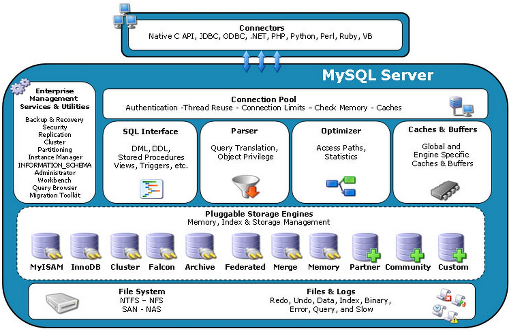

### 基础架构及模块

MySQL 是典型的 C/S 程序架构



#### Client

每个客户端连接都会在服务器中拥有一个线程，这个连接的查询只会在这个单独的线程中执行

##### 连接选项

###### 快速连接

包含各语言支持的 Connectors 及 mysql 客户端等

mysql 命令客户端每次和服务端建立连接后，使用默认连接参数会建立一个本地 Hash 表提供库名和表名的补全功能连接时使用选项 `-A`/`--quick`/`-q` 可以跳过这个阶段

mysql 客户端发送请求后，接收服务端返回结果的方式：

*   本地缓存，对于 API 的 `mysql_store_result`
*   不缓存，对应 API 的 `mysql_use_result`

客户端连接使用 `--quick`/`-q` 参数时，会使用不缓存处理结果和不把执行命令记录到本地命令历史文件

登录成功后，使用 `status` 命令查看状态

#### Server

包含 MySQL 大多数核心功能，及所有内置函数。所有跨存储引擎的功能（存储过程、触发器、视图、用户函数）都在这一层实现

##### 连接器

管理连接，权限验证，负责跟客户端建立连接，获取权限，维持和管理连接

*   身份认证

    如果用户名密码错误，会报错 `Access denied for user` ，然后客户端程序结束执行。如果认证通过，连接器会到权限表里查出拥有的权限。此后连接里的权限判断逻辑，都将依赖于此时读到到权限。（一个用户成功建立连接后，即使对该用户权限做了修改，也不会影响到已存在的连接的权限。修改完成后，再新建的连接才会使用新的权限设置）

*   自动断开连接

    连接器自动断开 `show processlist` 中 Command 列显示为 `Sleep` 的空间连接，时间由 `wait_timeout` 控制，默认 8 小时

*   长连接

    全部使用长连接会使 `MySQL` 占用内存涨的特别快，因为（`Mysql` 在执行过程中临时使用的内存是管理在连接对象里面的，这些资源会在连接断开的时候才释放。如果长连接累积起来，可能导致内存占用太大，被系统强行杀掉（`OOM`），导致 `Mysql` 异常重启。（定期断开长连接，使用一段时间，或者程序里面判断执行过一个占用内存的大查询后。如果使用`MySQL5.7`及以后版本，可以在每次执行一个比较大的操作后，执行 `mysql_reset_connection` 来重新初始化连接资源，这个过程不需要重连和重新做权限验证，但是会将连接恢复到刚刚创建完时的状态）

###### 连接管理线程

连接管理线程将每个客户端连接与处理该客户端连接的线程相关联，管理线程在必要时会创建一个新线程，线程数量于当前连接的客户端数量一样多。企业版包含一个线程池插件。

`thread_cache_size` （确定线程缓存大小）系统变量确定线程缓存大小，`Threads_cached`（缓存线程数） 和 `Threads_created`（无法缓存而创建的线程数） 状态变量。默认流程为连接管理线程接收新连接先查看是否存在缓存线程，存在这将其与连接关联，不存在这创建新线程与其关联。

`max_connections` 变量指定最大同时连接数，如果因为该限制导致拒绝连接，会增加 `Connection_errors_max_connections` 状态值。实际支持 `max_connections`  + 1 个客户端连接。保留额外连接供具有 `CONNECTION_ADMIN/SUPER` 权限账户连接。

8.0.19 前，组复制内部会话计入 `max_connections`，如果在启动组复制或尝试执行操作时服务器已达到限制，则操作失败，组复制或服务器可能会停止。8.0.19 开始，组复制内部会话与客户端连接分开处理，不计入 `max_connections` 限制。

MySQL 支持的最大客户端连接数取决于：给定平台线程库的质量、RAM、连接工作负载、所需响应时间、可用文件描述符数量。

###### 连接管理接口

在 `max_connections` 已满时进行管理需要配置管理接口，然后使用配置的管理接口登入

```ini
[mysqld]
admin_address=127.0.0.1
admin_port=33064
```

启用管理接口前置条件（配置 `admin_address` 和 `admin_port` 系统变量，管理连接的数量没有限制，具有 `SERVICE_CONNECTION_ADMIN`/`SUPER` 特权）

```shell
# 连接
mysql -h{admin_address} --protocol=TCP --port={admin_port}
```

8.0.21 开始，管理接口支持加密配置 `admin-ssl` 指定

```ini
[mysqld]
admin_address=127.0.0.1
admin_port=33064
admin_ssl_ca=admin-ca.pem
admin_ssl_cert=admin-server-cert.pem
admin_ssl_key=admin-server-key.pem
```

```ini
[mysqld]
# 此时 admin_ssl 相关配置无效
admin-ssl=OFF
admin_address=127.0.0.1
```

使用

```shell
mysql --protocol=TCP --port=33062
      --ssl-ca=admin-ca.pem
      --ssl-cert=admin-client-cert.pem
      --ssl-key=admin-client-key.pem
```

###### 连接线程

该线程处理身份认证并请求对该连接的处理。

##### 查询缓存

命中则直接返回结果，更新表数据则整个表的缓存都失效，8.0废除

`MySQL` 提供了按需缓存，将参数 `query_cache_type` 设置成 `DEMAND` ，这样对默认的 `SQL` 语句都不使用查询缓存。而对于确定要使用查询缓存的语句，可以用 `SQL_CACHE` 显式指定

```sql
select SQL_CACHE * from T where ID = 10
```

##### SQL 接口

SQL 接口提供一套机制来接收命令以及传输结果给用户。MySQL的SQL接口遵从 ANSI SQL 标准，它和绝大多数遵从ANSI 标准的数据库服务器一样接受同样基础的 SQL 语句

##### 分析器

*   词法分析

*   语法分析，根据词法分析的结果，语法分析器会根据语法规则判断输入的 `SQL` 语句是否满足 `Mysql` 语法，如果语法不对会提示 `You have an error in your SQL syntax` ，语法错误会提示第一个出现错误的位置，即紧接 `use near` 的内容

##### 优化器

查询优化器的目标是找到执行 SQL 查询的最佳执行计划（查询树）它由一系列物理操作符组成，这些操作符按照一定的运算关系组成查询的执行计划。可以分为逻辑查询优化阶段和物理查询优化阶段

* 逻辑查询优化：通过改变 SQL 语句的内容来使得 SQL 查询更高效，同时为物理查询优化提供更多的候选执行计划。通常采用的方式是对 SQL 语句进行等价交换，对查询进行重写（查询重写的数据基础是关系代数。对条件表达式进行等价谓词重写、条件简化，对视图进行重写，对子查询进行优化，对连接语义进行了外连接消除、嵌套连接消除等。）
* 物理查询优化：关系代数的每一步都对应着物理计算，这些物理计算往往存在多种算法，因此需要计算各种物理路径的代价，从中选择代价最小的作为执行计划。在这个阶段里，对于单表和多表连接的操作，需要高效地使用索引，提升查询效率

###### 优化策略

查询优化器的生成最佳执行计划的策略通常有两种方式：

* 基于规则的优化器（RBO，Rule-Based Optimizer）。

    规则是人们以为的经历，或者是采用已被证明是有效的方式。通过在优化器里面嵌入规则。来判断 SQL 查询符合那种规则，就按照相应的规则来制定执行计划，同时采用启发式规则去掉明显不好的存储路径

* 基于代价的优化器（CBO，Cost-Based Optimizer）。

    这会根据代价评估模型，计算每条可能的执行计划的代价，COST，从中选择代价最小的作为执行计划。相比于 RBO，CBO 对数据更敏感，因为它会利用数据表中的统计信息来做判断，针对不同的数据表，查询得到的执行计划可能是不同的，因此制定出来的执行计划也更符号数据表的实际情况

大部分 RDBMS 都支持基于代价的优化器，在 MySQL 中的 COST Model（优化器用来统计各种步骤的代价模型）在 5.7.10 版本之后，mysql 库引入两张数据表，里面规定了各种步骤预估的代价

*   server_cost

    |            统计项            |                           备注                           |
    | :--------------------------: | :------------------------------------------------------: |
    | `disk_temptable_create_cost` |        MyISAM/InnoDB 创建磁盘临时表代价，默认 20         |
    |  `disk_temptable_row_cost`   |       MyISAM/InnoDB 创建磁盘临时表行代价，默认 0.5       |
    |      `key_compare_cost`      |     键比较的代价，比较次数越多，代价越大，默认 0.05      |
    | `memory_temptable_row_cost`  |              内存临时表的创建代价，默认 0.1              |
    | `memory_temptable_row_cost`  |               内存临时表的行代价，默认 0.1               |
    |     `row_evaluate_cost`      | 统计符合条件的行代价，符合条件行越多，代价越大，默认 0.1 |

*   engine_cost

    |          统计项          |                备注                 |
    | :----------------------: | :---------------------------------: |
    |   `io_block_read_cost`   |  从磁盘读取一页数据的代价，默认 1   |
    | `memory_block_read_cost` | 从内存读取一页数据的代价，默认 0.25 |

可以更新这些参数，来优化 MySQL 的 CBO 计算

```mysql
# 增加磁盘扫描成本
UPDATE mysql.engine_cost SET cost_value = 2.0 WHERE cost_name = 'io_block_read_cost';
FLUSH OPTIMIZER_COSTS;
# 针对 Innodb 存储引擎设置 io_block_read_cost
INSERT INTO mysql.engine_cost(engine_name, device_type, cost_name, cost_value, last_update, comment)
  VALUES ('InnoDB', 0, 'io_block_read_cost', 2,
  CURRENT_TIMESTAMP, 'Using a slower disk for InnoDB');
FLUSH OPTIMIZER_COSTS;
```

###### 执行代价

CBD 执行代价等于 I/O 执行代价（数据页和索引页加载）加 CPU 执行代价（权重因子（CPU 到 I/O 之间转化的相关系数）乘键比较和行估算的代价）。

5.7 版本之后，代价模型进行了优化，加入了内存计算和远程操作的代价统计：总代价 = I/O 代价 + CPU 代价 + 内存代价 + 远程代价

##### 执行器

开始执行的时候，会先判断对这个表是否有相应的`SQL` 语句权限。如果没有就会返回没有权限的错误

```mysql
mysql> select * from T where ID=10;

ERROR 1142 (42000): SELECT command denied to user 'b'@'localhost' for table 'T'
```

如果有权限，就打开表继续执行。打开表的时候，执行器就会根据表的引擎定义，去使用这个引擎提供的接口（数据库的慢查询日志中的 `rows_examined` 字段，表示这个语句执行过程中扫描了多少行。这个值就是在执行器每次调用引擎获取数据行的时候累加的，有些时候，执行器调用一次，在引擎内部则扫描了多行，因此引擎扫描行数跟 `rows_examined` 并不是完全相同的）

执行器执行查询流程：无索引则逐行扫描第一行直到最后一行，有索引则取满足条件的第一行，将所有满足条件的行组成记录集返回给客户端

##### Server 管理

###### 资源组

支持创建和管理资源组，并允许将服务器中运行的线程分配给特定的组，以便线程根据该组可用的资源执行。使用组属性可以控制其资源，以启用或限制组中线程的资源消耗。

使用 SQL 接口管理资源组（相关 SQL 语句不会写入 binlog）：

*   通过 SQL 语句创建、更改、删除资源组，并将线程分配给资源组。

    ```mysql
    # 创建资源组
    CREATE RESOURCE GROUP {group_name} TYPE = USER VCPU = {2-3}
      THREAD_PRIORITY = {10};
    # 将线程分配给组
    SET RESOURCE GROUP {group_name} FOR {thread_id};
    # 将会话线程分配给组，会话中语句将使用组资源执行
    SET RESOURCE GROUP {group_name};
    ```

*   资源组操作需要 `RESOURCE_GROUP_ADMIN` 特权
*   资源组信息在 `INFORMATION_SCHEMA.RESOURCE_GROUPS` 表，线程信息在 `PERFORMANCE_SCHEMA.THREADS` 表

资源组属性（对于用户定义的资源组，所有属性都在组创建时分配，创建组后，非名称和类型外其他属性都可以修改）

*   每个组都有一个名称。资源组名称是表和列名称之间之类的标识符，区分大小写，最长 64 位字符
*   每个组类型 `SYSTEM`/`USER`，资源组类型会影响可分配给该组的优先级范围（系统线程对应 `threads` 表的 `background` 线程，用户线程对应 `threads` 表的 `user` 线程 ）
*   CPU 属性
*   线程优先级（系统资源组，优先级范围 -20 ~ 0，用户资源组，优先级范围 0 ~ 19）
*   启用或禁用每个组

默认资源组（`SYS_default`/`USR_default`，每个默认组均不具有 CPU 关联且优先级为 0），默认组不能删除，属性不能修改。新创建的系统线程分配给 `SYS_default`，新创建的用户线程分配给 `USR_default`。

资源组在以下情况不可用或存在限制：

*   安装了线程池插件，则资源组不可用

*   macOS 上不可用，macOS 不提供将 CPU 绑定到线程的 API

*   FreeBSD/Solaris 上，资源组优先级被忽略

*   Linux 上，除非设置了 `CAP_SYS_NICE` 功能，否则将忽略资源组线程优先级

    1.  使用 systemd 管理和 4.3 以上内核（支持环境功能）

        ```shell
        # red/oracle
        sudo systemctl edit mysqld
        # debian
        sudo systemctl edit mysql
        ```

    2.  修改内容

        ```ini
        [Service]
        AmbientCapabilities=CAP_SYS_NICE
        ```

    3.  重启 MySQL 服务器

    使用 `setcap` 手动设置

    ```shell
    sudo setcap cap_sys_nice+ep /path/to/mysqld
    getcap /path/to/mysqld
    ```

###### 关闭

关闭流程：

1.  关闭过程启动

    具有 `SHUTDOWN` 特权的用户执行 `mysqladmin shutdown`，或使用信号通知关闭

2.  服务器创建关闭线程

    无法创建关闭线程记录错误日志

3.  服务器停止接受新连接

    关闭监听 socket

4.  服务器终止当前活动

    *   与客户端连接线程，将该线程标记为已终止（下次检查状态时退出）

    *   对于开启事务的线程，该事务将回滚
    *   对于正在更新非事务表的线程，操作多行时可能部分更新，操作可能完成前终止
    *   如果服务器是源服务器，它的副本连接线程与客户端连接线程同样处理
    *   如果服务器是副本服务器，将活动状态的 I/O 线程和 SQL线程（允许　SQL　线程完成当前语句，避免复制问题，如果 SQL 线程处于事务中间，则服务器将等待直到当前复制事件组完成或用户发 `KILL QUERY`/`KILL CONNECTION`）终止，然后终止客户端线程

5.  服务器关闭或关闭存储引擎

    刷新表缓存并关闭所有打开的表。每个存储引擎都对其管理的表执行必要的操作

    *   MyISAM 刷新表的所有未决索引写入
    *   InnoDB 将其缓冲池刷新到磁盘（除非 `innodb_fast_shutdown=2`），将当前 LSN 写入表空间，终止内部线程

6.  服务器退出

    返回退出代码：0 成功，1 失败，2 失败

#### 引擎层

负责数据的存储和提取，引擎以插件模式

#### 日志模块

##### 日志设置

###### 日志表

日志表 `mysql.general_log`、`mysql.slow_log` 支持 SQL 访问

*   默认使用 CSV 引擎。可以修改为使用 MyISAM 引擎（不能使用 `ALTER TABLE` 修改日志表，必须先禁用日志表），只支持这两种引擎。
*   支持 `TRUNCATE TABLE`、`CHECK TABLE`、`RENAME TABLE`，不支持 `INSERT`、`DELETE`、`UPDATE` 操作，这些操作仅在服务器内部进行，不支持分区
*   `LOCK TABLES` 不能再日志表上使用，`FILUSH TABLES WITH READ LOCK` 和 `read_only` 系统变量的状态对日志表没有影响，服务器始终可写日志表
*   日志表不会写入二进制日志，刷新日志文件（`FLUSH LOGS`）和日志表（`FLUSH TABLES`）需要分别进行

##### 错误日志

错误日志包含： 服务器启动和关闭时间记录、启动关闭和运行期间诊断消息（错误，警告，注释、如果服务器需要自动检查或修复表，它将向错误日志中写入一条记录）、如果服务器异常退出，错误日志将包含堆栈跟踪

```mysql
# 错误日志文件
show variables like 'log_error';
```

###### 错误日志设置

8.0 使用组件体系结构：日志过滤（修改写入的信息）组件、日志写入（允许 JSON 格式，可启用多个，将错误日志输出写入多个目标）组件，由系统变量（`log_error_services`）控制组件的启用与运行，默认组件行为

*   `log_filter_internal`

    由 `log_error_verbosity` 和 `log_error_suppression_list` 控制过滤级别及忽略的错误

*   `log_sink_internal`

    输出目标由 `--log-error` 选项确定将错误信息写入控制台（stderr）还是文件（默认为数据目录中的 `host_name.err` 或 `--pid-file` 作为文件名或绝对文件 ）

    window 下支持 `--console` 启动项（优先）来指定错误日志输出到控制台。类 unix 下，如果为提供该选项，则默认输出到文件。

要更改用于错误日志记录的日志组件集，需要加载组件并修改 `log_error_services` 值。添加或删除日志组件受以下约束：

* 要启用日志组件，首先需要加载（除非已内置或加载），然后在 `log_error_services` 值中添加，尝试在服务器启动时命名未知组件会导致其设置为默认值，尝试在运行时加载未知组件会产生错误，且该值不变。
* 要禁用日志组件，将其从 `log_error_services` 值中删除，如果该组件是可加载的且想卸载该组件，使用 `UNINSTALL COMPONENT`，尝试卸载仍在 `log_error_services` 值中组件会产生错误

```mysql
# 使用 json 记录器，加载日志组件的 URN 前缀为 file://component_，默认 so 文件位置 /usr/lib/mysql/plugin
INSTALL COMPONENT 'file://component_log_slink_syseventlog';
SET GLOBAL log_error_services = 'log_filter_internal; log_sink_json'
```

可以使用 `FLUSH ERROR LOGS`、`FLUSH LGOS`、`mysqladmin flush-logs` 命令刷新错误日志，服务器会关闭并重新打开正在写入的错误日志文件。

###### 错误事件字段

用于错误日志的错误事件包含一组字段，每个字段由一个键值对组成。事件字段分为核心（自动设置）、可选（某些类型错误提供）、自定义（过滤器添加）

*   核心错误字段

    |    字段    |                      描述                      |
    | :--------: | :--------------------------------------------: |
    |    time    |                事件时间戳，微秒                |
    |    msg     |                 事件消息字符串                 |
    |    prio    |   事件优先级，指示系统、错误、警告/注释事件    |
    |  err_code  |            事件错误代码，以数字表示            |
    | err_symbol |           事件错误符合，以字符串形式           |
    | SQL_state  |         事件 SQLSTATE 值，以字符串形式         |
    | subsystem  | 发生事件的子系统。可能值：InnoDB、Repl、Server |

    prio 值为数字，还可以包含可选的 label 字段，将优先级表示为字符串（2 对应 label 的 Warning）。过滤器组件可以根据优先级包括或删除错误事件，但系统事件是强制性的且不能删除。优先级确定规则，事件可忽略优先级为警告（2），否则为错误（1），事件强制则为系统（0），否则为注释（3）

*   可选错误字段

    |    字段     |             描述             |
    | :---------: | :--------------------------: |
    |  OS_errno   |        操作系统错误号        |
    |  OS_errmsg  |       操作系统错误消息       |
    |    label    |    对应 prio，字符串形式     |
    |    user     |          客户端用户          |
    |    host     |          客户端主机          |
    |   thread    |     产生错误事件线程 id      |
    |  query_id   |           查询 ID            |
    | source_file | 发生事件源文件，没有前导路径 |
    | source_line |     发生事件的源文件行数     |
    |  function   |        发生事件的函数        |
    |  component  |     发生事件的组件或插件     |

###### 错误日志过滤器

错误日志配置通常包括一个日志过滤器和一个或多个日志编写器，对于错误日志过滤，mysql 提供以下组件：

*   log_filter_internal

    根据事件优先级（`log_error_verbosity` ）和忽略列表（`log_error_suppression_list`）过滤，内置且默认启用

*   log_filter_dragnet

    根据用户提供的规则（ `dragent.log_error_filter_rules` ）错误日志过滤。要先安装。该插件的过滤规则由单独的语法，能控制更细粒度

###### 错误日志输出器

*   `log_sink_internal`

    默认格式为：`time thread [label] [err_code] [subsystem] msg`，`err_code`（字符串） 和 `subsystem` 为 8.0 新增。每行显示一条消息

    ```verilog
    2020-08-06T14:25:02.835618Z 0 [Note] [MY-012487] [InnoDB] DDL log recovery : begin
    ```

*   `log_sink_json`

    需要安装启用，以 JSON 格式输出错误日志，容许在 `log_error_services` 声明多次

    ```mysql
    # 指定以未过滤 json 输出和过滤后 json 输出
    SET log_error_services = 'log_sink_json; log_filter_internal; log_sink_json';
    ```

    生成包含错误字段的键值对对象

    ```json
    {
      "prio": 3,
      "err_code": 10051,
      "source_line": 561,
      "source_file": "event_scheduler.cc",
      "function": "run",
      "msg": "Event Scheduler: scheduler thread started with id 5",
      "time": "2020-08-06T14:25:03.109022Z",
      "ts": 1596724012005,
      "thread": 5,
      "err_symbol": "ER_SCHEDULER_STARTED",
      "SQL_state": "HY000",
      "subsystem": "Server",
      "buffered": 1596723903109022,
      "label": "Note"
    }
    ```

    所显示的消息经过格式化以提高可读性，每行显示一条消息。ts 为 8.0.20 新增，为记录时间戳

*   `log_sink_sysenventlog`

    需要安装启用，将错误日志写到系统日志。window 会写入优先级为 `Error`、`Warning`、`Note` 事件，可以使用 `syseventlog.tag` 指定日志标签。unix 使用： `syseventlog.facility` 指定发送消息的程序类型，默认 daemon、`syseventlog.include.pid` 是否包含进程 ID、`syseventlog.tag` 标签。8.0.13 前使用：`log_syslog_facility`、`log_syslog_include_pid`、`log_system_tag` 变量控制。

日志输出插件与 `log_error` 位置关系，`log_sink_syseventlog` 插件无论 `log_error` 数值，始终写入系统日志：

*   `log_error` 为 `stderr`：

    `log_sink_internal`、`log_sink_json`、`log_sink_test`、`log_sink_json` 写入控制台

* `log_error` 为文件名

     `log_sink_internal`、`log_sink_test` 写入指定文件，`log_sink_json` 写入指定的文件加编号为`.NN.json` 的后缀：`file_name.00.json`，`file_name.01.json` 等

输出到文件的日志可使用 `log_timestamps` 控制写入文件的时间戳的时区。

##### 查询日志

是服务器操作记录，当客户端连接或断开连接时，服务器会将信息写入该日志，并记录从客户端收到的每个 SQL 语句，按照接收语句的顺序将语句写入查询日志，可能与它们执行的顺序不同，查询日志可能包含仅选择数据的语句，这些语句不会写入二进制日志。

在复制主服务器上：使用基于语句的二进制日志记录时，其从属服务器接收的语句将写入每个从服务器的查询日志中。如果客户端使用 `mysqlbinlog` 程序读取事件并将其传递到服务器，则将语句写入主服务器的查询日志；使用基于行的二进制日志记录时，这些语句不会写入查询日志 ；当 `binlog_format = mixed` 时，取决于所使用的语句，给定的更新也可能不会写入查询日志

默认情况下，常规查询日志处于禁用状态。支持运行时禁用/启用（`sql_log_off` 控制当前会话）或更改日志文件名（默认为 `host_name.log`）。服务器重新启动，并且日志刷新不会导致生成新的查询日志文件（刷新会关闭并重新打开它），写入文件时可有 `log_timestamp` 控制时区。

会重写语句中的纯文本密码，使用 `log_raw=ON` 控制不重写密码。

##### 二进制日志

语句执行之后，释放任何锁之前。

`binlog` 会记录所有的逻辑操作，并且是采用 `追加写` 的形式。如果 `DBA` 承诺说半个月内可以恢复，那么备份系统中一定会保存最近半个月的所有 `binlog`，同时系统会定期做整库备份（时间取决于系统的重要性，可以是一天一备份，也可以是一周一备份）

当需要恢复到指定的某一秒时，比如某天下午两点有一次误删表，需要找回数据，可以这么做

* 首先，找到最近的一次全量备份，从这个备份恢复到临时库
* 然后，从备份的时间点开始，将备份的 `binlog` 依次取出来，重放到中午误删表之前的那个时刻
* 这样临时库就跟误删之前的线上库一样了，然后可以把表数据从临时库取出来，按需要恢复到线上库区

二进制日志包含描述数据库更改的“事件”。还包含针对可能进行了更改的语句的事件（DELETE 不匹配任何行），除非使用基于行的日志记录。二进制日志还包含有关每个语句花费多长事件的信息。二进制日志主要作用：

* 对于复制，主复制服务器上的二进制日志提供了要发送到从服务器的数据更改的记录。主服务器将其二进制日志中包含的事件发送到其从属服务器，从属服务器执行执行事件以对主服务器进行相同的数据更改
* 某些数据恢复操作需要使用二进制日志。还原备份后，将重新执行在执行备份后记录的二进制日志中的事件。这些事件使数据库从备份开始就保持最新状态（即进行时间点增量恢复）

不记录诸如  `SELECT` 或 `SHOW` 不修改数据的语句。启用二进制日志会使用服务器性能稍微下降。二进制日志仅记录完整事件或事务，会重新在二进制日志中语句的密码，以使它们不会以纯文本的形式出现。

8.0.14 开始，可以对二进制日志文件和中继日志文件进行加密，使用变量 `blnlog_encrytion = on` 

具有特定权限的客户端，可以使用 `SET sql_log_bin=OFF` 语句禁用其自身语句的二进制记录

默认情况下，服务器记录事件的长度以及事件本身，并使用它来验证事件是否被正确写入。可以通过设置 `binlog_checksum` 系统变量来使服务器编写事件的校验和。从二进制日志中读回时，默认情况下，主服务器使用事件长度，但可以通过 `master_verify_checksum` 系统变量来使用校验和。从库要验证从主库收到的事件，通过启用 `slave_sql_verify_checksum` 系统变量，可以从中继日志中读取事件使用校验和

复制从属服务器在默认情况下启用 `log_slave_updates` 系统变量的情况下启动的，从属服务器会将将从复制主服务器收到的所有数据修改写入其自己的二进制日志。必须启用二进制日志才能使此设置生效。此设置使从属服务器可以在链式复制中充当其他从属服务器的主服务器

可以使用 `RESET MASTER` 语句删除所有二进制日志文件，或者使用 `PURGE BINARY LOGS` 删除其中一部分

```shell
# 从二进制日志中更新 mysql 服务器
mysqlbinlog log_file | mysql -h server_name
```

8.0 版本的二进制日志格式与之前不一样。不能跨版本复制

如果服务器无法写入二进制日志，刷新二进制日志文件或将二进制日志同步到磁盘，则复制主数据库上的二进制日志可能变得不一致，并且复制从数据库可能会与主数据库失去同步。

默认情况下，二进制日志在每次写入（`sync_binlog = 1`）时都会同步到磁盘。如果未指定，操作系统崩溃，二进制日志最后一条语句可能会丢失。Innodb 使用 XA 事务两阶段提交保证二进制日志语句 InnoDB 数据文件同步。

#### Binary Logging Options and Variables

##### Startup Options Used with Binary Logging

* `binlog-row-event-max-size=N`

    

    当使用基于行的二进制日志记录时，此设置对基于行的二进制日志事件的最大大小（以字节为单位）的软限制。如果可能，将二进制日志中存储的行分组为大小不超过此设置值的事件。如果事件无法拆分，则可以超过最大大小。该值必须是 256 的倍数（否则将被舍入为 256）。默认为 8192

* `--log-bin[=base_name]`

    

    指定用于二进制日志文件的基本名称。二进制日志文件包含基本名称和数字扩展名，服务器在基本名称后添加数字后缀来依次创建二进制日志文件。

    如果不提供该选项，使用默认基本名称。如果提供的 `--log-bin` 选项不带字符串或带空字符串，则基本名称默认为 `host_name-bin`。二进制日志文件的基本名称和任何指定的路径都可以用作 `log_bin_basename` 系统变量

    默认位置是数据目录。要更改该位置使用 `--log-bin=/absolute/path/`，绝对路径地址。

    8.0 之前，默认禁用二进制日志，指定了该选项则启用，8.0 开始，无论是否指定 `--log-bin` 选项，默认情况下都会启用二进制日志记录。启用二进制后，`log_bin` 系统变量为 `ON`

    禁用二进制日志记录，可以在启动时指定 `--skip-log-bin` 或 `--disable-log-bin` 选项，当与 `log-bin` 选项同时设置时，后设置选项会覆盖之前选项。

    在服务器上使用 GTID 时，如果在异常关闭后重新启动服务器时禁用了二进制日志记录，则某些 GTID 可能会丢失，从而导致复制失败。在正常关闭状态下，当前二进制日志文件中的 GTID 集会保存在 `mysql.gtid_executed` 表。在恢复过程中，只要仍启用了二进制日志记录，就会将 GTID 从二进制日志文件添加到表中。如果在重新启动服务器时禁用了二进制日志记录，则服务器将无法访问二进制日志文件以恢复 GTID，因此无法启动复制。正常关闭后，可以安全的禁用二进制日志。

    `--log-slave-updates` 和 `--slave-preserve-commit-order` 选项需要二进制日志。如果禁用二进制日志，则忽略这些选项或指定 `--log-slave-updates=OFF` 和 `--skip-slave-preserve-commit-order` 如果同时指定这些选项和禁用二进制日志，则警告报错

    5.7 中，启用二进制日志记录时必须指定服务器ID，否则服务器无法启动。8.0 中，`server_id` 系统变量默认设置为 1。对于复制拓扑中使用的服务器，必须为每个服务器指定一个唯一的非零服务器 ID

* `--log-bin-index[=file_name]`

    二进制日志索引文件的名称，其中包括二进制日志文件的名称。默认情况下，它的位置和基本名称与使用 `--log-bin` 选项加扩展名为二进制日志文件指定的值相同 `.index`。如果未指定 `--log-bin`，则默认的二进制日志索引文件名为 `binlog.index`。如果指定的 `--log-bin` 选项不带任何字符串或为空字符串，则默认的二进制日志索引文件名是 `host_name-bin.index`，使用主机名

**下列选项影响将那些语句写入二进制日志，然后由复制主服务器发送到其从属服务器。从服务器还有一些选项，用于控制应执行或忽略从主服务器接收的那些语句**

* `--binlog-do-db=db_name`

    

    类似于 `--replicate-do-db` 影响复制的方式影响二进制日志记录。

    此选项的效果取决于使用的是基于语句的记录格式还是基于行的日志记录格式（同 `--replicate-do-db`）。DDL 语句始终作为语句记录，而不考虑有效的记录

    **基于语句的日志记录**

    只有那些语句被写入二进制日志，要指定多个数据库，多次使用此选项，每个数据库依次；但是，这样做不会导致在选择其他数据库或没有数据库时记录跨数据库语句（`UPDATE some_db.some_table SET foo='bar'`）。默认数据库为使用 `selected` 或 `use` 语句指定的

    ```mysql
    # --binlog-do-db=sales binlog_format=statement,以下语句不会记录 binlog
    USE prices;
    UPDATE sales.january SET amount=amount+1000;
    # --binlog-do-db=sales, binlog_format=statement，以下语句会记录 binlog,sales是update发出该语句时的默认数据库
    USE sales;
    UPDATE prices.discounts SET percentage = percentage + 10;
    ```

    **基于行的日志记录**

    记录仅限于数据库，仅记录属于数据库的表的更改；

* `--binlog-ignore-db=db_name`

    

    类似 `--replicate-ignore-db` ，取决于日志格式。要指定多个忽略的数据库，多次使用此选项，每个数据库依次。

    **基于语句的日志记录**

    则无法登录其中默认的数据库（选择一个任何声明USE）是。如果没有默认数据库，则不应用任何选项，并且始终记录此类语句。

    **基于行的格式**

    告诉服务器不要将更新记录到数据库中的任何表

**校验和选项**

服务器支持读写二进制日志校验和

* `--binlog-checksum={NONE|CRC32}`

    

    启用此选项会导致主服务器为写入二进制日志的事件编写校验和。不能在事务中更改此选项。要控制 slave 从中继日志读取校验和，使用 `--slave-sql-verify-checksum` 选项

**测试和debug选项**

* `--max-binlog-dump-events=N`

    

    MySQL测试套件在内部使用此选项进行复制测试和调试。

* `--sporadic-binlog-dump-fail`

    

    MySQL测试套件在内部使用此选项进行复制测试和调试。

**系统变量**

控制二进制日志记录的系统变量，可以在服务器启动时设置，部分也可以在运行时更改

* `binlog_cache_size`

    

    当处理事务的线程启动时，它分配一个缓存区缓存二进制语句。在事务期间，用于保存更改的二进制日志的内存缓存区大小。在服务器上启用二进制日志记录时，如果服务器支持任何事务存储引擎，则会为每个客户端分配一个二进制日志缓存。如果用于事务的数据超过了内存缓冲区中的空间，则多余的数据将存储在一个临时文件中。当服务器上的二进制日志加密开启时，不会对内存缓存区进行加密。8.0.17 任何用于保存二进制日志缓存的临时文件都将被加密。提交每个事务后，通过清除内存缓存区并截断临时文件（如果使用）来重置二进制日志缓存

    如果经常使用大型事务，则可以通过减少或消除写入临时文件的需要来增加此缓存的大小，以获得更好的性能。`Binlog_cache_use` （用缓存或临时文件用于存储事务语句的数目）和 `Binlog_cache_disk_use` （有多少交易实际上不得不使用临时文件）状态变量可用于调整此变量的大小

    `binlog_cache_size` 仅设置事务缓存的大小；语句缓存的大小由 `binlog_stmt_cahce_size` 系统变量控制

* `binlog_checksum`

    

    启用后，此变量使主服务器将每个事件的校验和写入二进制日志中。更改此变量的值会导致二进制日志被轮换。校验和总是写入整个二进制日志文件，而不是仅写入其中一部分。将主服务器上的此变量设置为从服务器无法识别的值会导致从服务器将其自身的 `binlog_checksum` 值设置为 NONE，并因错误而停止复制。

* `binlog_direct_non_transactional_updates`

    

    由于并发问题，当事务同时包含对事务表和非事务表的更新时，从站可能会变得不一致。MYSQL 试图通过将非事务性语句写入事务高速缓存来保留这些语句之间的因果关系，事务高速缓存将在提交后刷新。但是，当代表事务对非事务表所做的修改对其他连接而言立即可见时，就会出现问题，因为这些更改可能不会立即写入二进制日志中。

    该 `binlog_direct_non_transactional_updates` 变量为该问题提供了一种可能的解决方法。默认情况下，此变量是禁用的。启用 `binlog_direct_non_transactional_updates` 会使对非事务表的更新直接写入二进制日志，而不是事务高速缓存

    从 8.0.14 开始，设置此系统变量的会话是受限制操作。

    `binlog_direct_non_transactional_updates` 仅适用于使用基于语句的二进制日志记录格式复制的语句；它仅在 `binlog_format` 为 `STATEMENT` 或 `MIXED` （使用基于语句的格式复制给定语句时）才有效。当二进制日志格式为 ROW 或 `MIXED` 使用基于行的格式复制给定语句时，此变量无效

    在启用此变量之前，必须确保事务表和非事务表之间没有依赖关系。（如 `INSERT INTO myisam_table SELECT * FROM innodb_table`）否则，这样可能导致从库偏离

* `binlog_encryption`

    

    为该服务器上的二进制日志文件和中继日志文件启用加密。OFF 是默认值。ON 为二进制日志文件和中继日志文件设置加密。无需在服务器上启用二进制日志记录即可启用加密

* `binlog_error_action`

    

    控制当服务器无法写入，刷新或同步二进制日志之类的错误的情况下。该错误可能导致主持不一致，或失去同步。默认 `ARBORT_SERVER` ，使得服务器在遇到二进制日志中的此类错误时就停止日志记录并关闭。重新启动后，将继续运行。为 `IGNORE_ERROR` 时，如果遇到这类错误，它将继续进行中的事务，记录该错误然后停止记录，并继续执行更新。此设置提供了与旧版的向后兼容。

* `binlog_expire_logs_seconds`

    

    设置二进制日志的有效期（以秒为单位）。有效期后，自动删除日志文件。默认为 30 天，同时设置该变量和 `expire_logs_days`，以该变量为准。要禁用自动清除二进制日志，显式设置该变量为 0，且不设置 `expire_logs_days`，或 `expire_logs_days` 显式设置为 0，且不为 `binlog_expire_logs_seconds` 指定值。

* `binlog_group_commit_sync_delay`

    

    控制二进制日志提交在将二进制日志文件同步到磁盘之前等待多时微秒。默认为 0，表示没有延迟。设置该值可使更多事务一次同步到磁盘上，从而减少提交一组事务的总时间。

    设置会增加服务器上事务的延迟，可会会影响客户端应用程序。在高并发工作负载上，延迟可能会增加争用并降低吞吐量。

* `binlog_group_commt_sync_no_delay_count`

    

    指定当前要等待的最大事务数，如果 `binlog_group_commit_sync_delay` 设置为0，则此选项无效。

* `log_slave_updates`

    

    从服务器从主服务器收到的更新是否应该记录到从服务器自己的二进制日志中。启用该变量可以组成链式复制

* `max_binlog_size`

    

    如果对二进制日志的写入导致当前日志文件的大小超过此变量的值，则服务器将关闭当前文件并打开下一个日志。加密的二进制日志文件还有一个 512 字节的标头。事务以一个块的形式写入二进制日志，因此永远不会在多个二进制日志之间进行拆分。二进制日志文件可能大于 `max_binlog_size`。如果 `max_relay_log_size` 为 0，则该值也适用于中继日志

* `sync_binlog`

    控制二进制日志同步到磁盘的频率：0，禁用，使用操作系统刷新到磁盘。1 默认值，提交事务之前同步到磁盘，可以确保二进制日志不会丢失任务事务。N，二进制日志提交组已收集 N 组之后，将同步到磁盘。

    为了在 Innodb 于事务一起使用的复制中获得最大的持久性和一致性：

    ```ini
    sync_binlog = 1
    innodb_flush_log_at_trx_commit = 1
    ```

* `transaction_write_set_extraction`

    

    定义用于对事务期间提取的写入进行哈希处理的算法。如果使用组复制，则此变量必须设置为 `XXHASH64`，因为在所有组成员上进行冲突检查都需要从事务中提取写操作。

#### 二进制日志格式

服务器使用几种日志记录格式，使用`--binlog-format` 系统变量控制。使用基于语句的复制时，复制不确定性语句可能会出现问题。在确定给定语句对于基于语句的复制是否安全时，MySQL确定是否可以保证可以使用基于语句的日志记录来复制该语句。如果MySQL无法做出保证，它将标记该语句为潜在不可靠的对象，并发出警告，以语句格式登录该语句可能并不安全。您可以通过使用MySQL的基于行的复制来避免这些问题。

* STATEMENT

    基于 SQL 语句

* ROW（默认）

    主服务器将事件写入二进制日志，指示各个表受到的影响

* MIXED

    默认情况下使用基于语句的日志记录，某些情况下会自动切换为基于行格式记录。服务器在以下情况下自动切换为基于行记录：

    当包含 `UUID()` 函数；当一个或多个带有 AUTO_INCREMENT 列的表被更新并且触发器或存储的函数被调用时；`LOAD_FILE()`；当一条语句引用一个或多个系统变量时；当涉及的表时 mysql 数据库中的日志表时。使用 `FOUND_ROWS`，`ROW_COUNT()`，`USER()`，`CURRENT_USER()`，`CURRENT_USER`；

可以在启动时或运行时更改日志格式，运行时更改支持全局（大多数情况下不能更改）和会话。仅在使用基于语句的复制时才会记录临时表，而基于行和混合格式不会记录。

在复制进行中切换复制格式会导致问题。每个 MySQL Server 可以设置自己且只能设置自己的二进制日志格式。更改复制主服务器上的日志记录不会导致从服务器更改其日志记录格式以匹配。使用语句格式时，不会复制系统变量，使用 MIXED 或 ROW 记录模式时，会被复制，但被从库忽略。主从二进制日志格式必须一致。

如果使用 InnoDB 表，并且事务隔离级别为 `READ_COMMITED` 或 `READ_UNCOMMITED`，只能使用行格式

将二进制日志格式设置为行时，某些更改仍然使用基于语句的格式，包含所有的 DDL 语句。

### Relay log

与二进制日志一样，由一组编号文件和一个索引文件组成，默认位置是数据目录。与二进制日志具有相同的格式，可以使用 mysqlbinlog 读取。对于默认复制通道，中继日志文件名具有默认格式 `host_name-relay-bin.index`。对于非默认复制通道，默认基本名称为 `hist_name-relay-bin-channel.num`

默认中继日志文件和索引文件可以使用 `relay_log` 和 `relay_log_index` 系统变量覆盖。如果在复制开始后遇到问题，一种解决方法是停止从服务器，将旧中继日志文件内容放在新的前面，并重启服务器

```shell
cat new_relay_log_name.index >> old_relay_log_name.index
mv old_relay_log_name.index new_relay_log_name.index
```

从服务器在以下条件创建新的中继日志文件

* 每次启动 I/O 线程
* 清除日志如（FLUSH LOGS 或 mysqladmin flush-logs）
* 当前中继日志文件大小太大时，如果 `max_relay_log_size` 大于 0，则为最大中继日志大小，如果 `max_relay_log_size` 为 0，则 `max_binlog_size` 为中继日志文件大小

SQL线程在执行每个中继日志文件中的所有事件并且不再需要它之后，会自动删除该文件。没有明确的机制可以删除中继日志，因为SQL线程会这样做。但是， `FLUSH_LOGS` 刷新中继日志，这会影响SQL线程删除它们的时间。

### Slow query log

慢查询日志由 SQL 语句组成，这些语句需要花费超过 `long_query_time` 时间来执行并且最少请求了 `min_examined_row_limit` 行。可以使用命令行 `mysqldumpslow` 来分析慢查询日志

#### 参数

* `slow_query_log`

    

    是否启用慢速查询日志，可以是 0 或 OFF 以禁用日志，1 或 ON 开启。要指定日志文件名，使用 `--slow_query_log_file = file_name`，要指定日志目标，使用 `log_output` 系统变量。如果没有为慢日志指定名称，默认为 `host_name-slow.log`，除非指定了绝对路径名以指定其他目录，否则服务器将在数据目录中创建文件。

    要在运行时禁用或启用慢查询日志

* `long_query_time` 

    

    如果查询所花的时间长于该值，服务器将增加 `slow_queries` 状态变量。如果启用了慢查询日志，则查询将记录到慢查询日志文件中。该值实时测量，不是 CPU 时间。在轻负载系统上低于阈值的查询可能会在重负载系统上高于阈值。最小和默认分别 0 和 10，可以将值指定为微秒的分辨率

* `log_slow_admin_statements`

    

    默认情况下，不记录管理语句，使用该变量修改，管理语句包含 `ALTER TABLE，ANALYZE TABLE，CHECK TABLE，CREATE_INDEX，DROP INDEX，OPTIMIZE TABLE，REPAIR TABLE`

* `log_queries_not_using_indexes`

    

    默认情况下，不记录未使用索引的查询，如果在启用慢查询日志的情况下启用此变量，则会记录预期将检索所有行的查询，此选项不一定意味着不使用索引（使用全索引扫描的查询使用索引，但由于索引不会限制行数而将被记录）

* `min_examined_row_limit`

    

    检查少于此行数的查询不会记录到慢查询日志中

* `log_throttle_queries_not_using_indexes`

    

    如果 `log_queries_not_using_indexes` 启用，该变量将限制每分钟可写入慢查询日志的此类查询的数量，默认 0 不限制

服务器按以下顺序使用控制参数来确定是否将查询写入慢查询日志：

1. 该查询必须不是管理语句，或者启用了 `log_slow_admin_statements`
2. 该查询必须至少花费了 `long_query_time` 时间，或者 `log_queries_not_using_indexes` 必须启用并且该查询未使用任何所有进行行查找
3. 该查询必须至少检查了 `min_examined_row_limit` 行
4. 不得根据 `log_throttle_queries_not_using_indexes` 设置禁止查询

默认情况下，复制从设备不会将复制的查询写入慢查询日志。当启用 `log_slow_slave_statements` 系统变量，且二进制日志为语句时，查询才会添加到从属的慢查询日志中。当二进制日志为行格式时，`log_slow_slave_statements` 系统变量失效，慢查询不会添加到从库的慢查询日志中

#### 慢查询日志内容

如果启用了慢查询日志并将 FILE 作为其输出目标，则写入日志的每个语句都以 # 字符开头，并且都在一行上，写入慢查询日志文件的每个语句之前都有一个 SET 包含时间戳的语句，8.0.14 开始，时间戳指示何时开始执行，8.0.14 之前，指示记录时间（执行之后）包含以下字段：

`Query_time`：duration 语句执行时间，以秒为单位；`Lock_time`：duration，获取锁的时间，以秒为单位；`Rows_sent`：N，发送给客户端的行数；`Rows_examined`：服务器层检查的行数，不计算存储引擎内部的任何处理。

启用 `log_slow_extra` 系统变量，8.0.14 起可用，还会包含以下额外字段，table 输出不受影响：

`Thread_id`，`Errno`，`Killed`，`Bytes_sent`，`Bytes_received`，`Read_first`，`Read_last`，`Read_key`，`Read_next`，`Read_prev`，`Read_rnd`，`Read_rnd_next`，`Sort_merge_passes`，`Sort_range_count`，`Sort_rows`，`Sort_scan_count`，`Created_tmp_disk_tables`，`Created_tmp_tables`，`Start`，`End`

服务器将重写慢查询日志语句中的秘密，使之不会以纯文本形式出现

##### DDL log(metadata log)

元数据日志记录由数据定义语句生成的元数据操作。服务器使用此日志从元数据操作中发生的崩溃中恢复。该记录被写入数据目录中的  `ddl_log.log` 文件，是一个二进制文件，不应该修改它。该文件按需创建并且服务器成功启动后将其删除，该文件可能不会出现在以完全正确方式运行的服务器上。

#### Redo log

#### redo log(InnoDB 引擎日志)

* `redo log` 是物理日志，记录的是 “在某个数据页上做了什么修改”
* WAL: `write-ahead-logging` 先写日志，再写磁盘。（当有一条记录需要更新的时候，`InnoDB` 引擎会先把记录写到 `redo log` 里面，并更新内存，这个时候更新就算完成了。`InnoDB` 引擎会在系统空闲时将操作记录更新到磁盘里面）
* `redo log` 是固定大小的。（从头开始写，写到末尾就又回到开头循环写，`write pos` 是当前记录的位置，一边写一边后移。循环写。`checkpoint` 是当前要擦除的位置，也是往后推移并且循环的。擦除记录前要把记录更新到数据文件），有了 `redo log`，`InnoDB` 就可以保证即使数据库发生异常重启，之前提交的记录都不会丢失，这个能力称为 `crash-safe`
* `Innodb_flush_log_at_trx_commit` 参数设置 1 时，表示每次事务的 `redo log` 都直接持久化到磁盘。可以保证 `mysql` 异常重启之后数据不丢失

