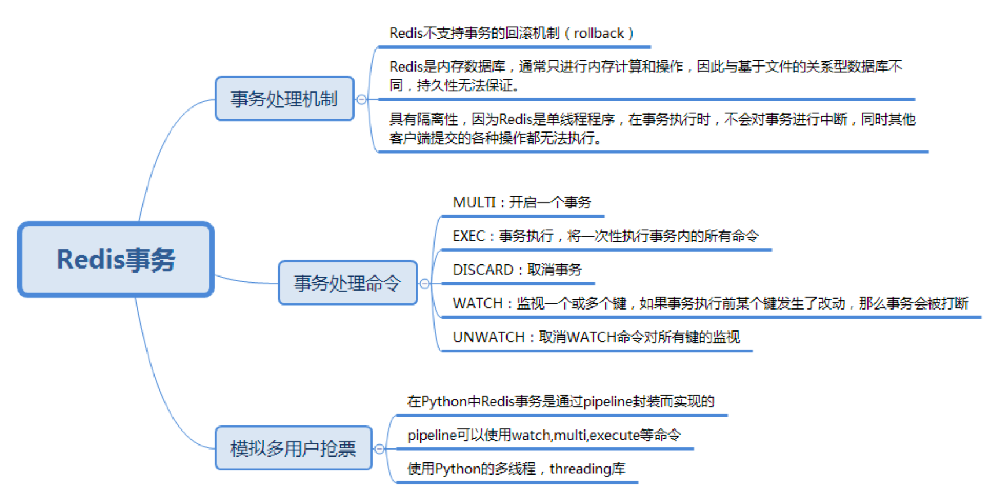

### redis基本操作

#### 架构原理

##### 数据类型

Redis 支持 8 种核心数据类型，包括 string、list、set、sorted set、hash、bitmap、geo、hyperloglog

###### String

string 是 Redis 的最基本数据类型。可以把它理解为 Mc 中 key 对应的 value 类型。string 类型是二进制安全的，即 string 中可以包含任何数据。

Redis 中的普通 string 采用 raw encoding 即原始编码方式，该编码方式会动态扩容，并通过提前预分配冗余空间，来减少内存频繁分配的开销。

在字符串长度小于 1MB 时，按所需长度的 2 倍来分配，超过 1MB，则按照每次额外增加 1MB 的容量来预分配。

Redis 中的数字也存为 string 类型，但编码方式跟普通 string 不同，数字采用整型编码，字符串内容直接设为整数值的二进制字节序列。

在存储普通字符串，序列化对象，以及计数器等场景时，都可以使用 Redis 的字符串类型，字符串数据类型对应使用的指令包括 set、get、mset、incr、decr 等。

###### list

是一个快速双向链表，存储了一系列的 string 类型的字串值。list 中的元素按照插入顺序排列。插入元素的方式，可以通过 lpush 将一个或多个元素插入到列表的头部，也可以通过 rpush 将一个或多个元素插入到队列尾部，还可以通过 lset、linsert 将元素插入到指定位置或指定元素的前后。

list 列表的获取，可以通过 lpop、rpop 从对头或队尾弹出元素，如果队列为空，则返回 nil。还可以通过 Blpop、Brpop 从队头/队尾阻塞式弹出元素，如果 list 列表为空，没有元素可供弹出，则持续阻塞，直到有其他 client 插入新的元素。这里阻塞弹出元素，可以设置过期时间，避免无限期等待。

list 列表还可以通过 LrangeR 获取队列内指定范围内的所有元素。Redis 中，list 列表的偏移位置都是基于 0 的下标，即列表第一个元素的下标是 0，第二个是 1。偏移量也可以是负数，倒数第一个是 -1，倒数第二个是 -2，依次类推

list 列表，对于常规的 pop、push 元素，性能很高，时间复杂度为 O(1)，因为是列表直接追加或弹出。但对于通过随机插入、随机删除，以及随机范围获取，需要轮询列表确定位置，性能就比较低下了

###### set

set 是 string 类型的无序集合，set 中的元素是唯一的，即 set 中不会出现重复的元素。Redis 中的集合一般是通过 dict 哈希表实现的，所以插入、删除，以及查询元素，可以根据元素 hash 值直接定位，时间复杂度为 O(1)。

对 set 类型数据的操作，除了常规的添加、删除、查找元素外，还可以用以下指令对 set 进行操作。

sismember 指令判断该 key 对应的 set 数据结构中，是否存在某个元素，如果存在返回 1，否则返回 0；

sdiff 指令来对多个 set 集合执行差集；

sinter 指令对多个集合执行交集；

sunion 指令对多个集合执行并集；

spop 指令弹出一个随机元素；

srandmember 指令返回一个或多个随机元素。

set 集合的特点是查找、插入、删除特别高效，时间复杂度为 O(1)，所以在社交系统中，可以用于存储关注的好友列表，用来判断是否关注，还可以用来做好友推荐使用。另外，还可以利用 set 的唯一性，来对服务的来源业务、来源 IP 进行精确统计

###### sorted set

有序集合，也是 string 类型元素的集合，且所有元素不允许重复。但有序集合中，每个元素都会关联一个 double 类型的 score 分数值。有序集合通过这个 score 值进行由小到大的排序。有序集合中，元素不允许重复，但 score 分数值却允许重复

有序集合除了常规的添加、删除、查找元素外，还可以通过以下指令对 sorted set 进行操作。

zscan 指令：按顺序获取有序集合中的元素；

zscore 指令：获取元素的 score 值；

zrange指令：通过指定 score 返回指定 score 范围内的元素；

在某个元素的 score 值发生变更时，还可以通过 zincrby 指令对该元素的 score 值进行加减。

通过 zinterstore、zunionstore 指令对多个有序集合进行取交集和并集，然后将新的有序集合存到一个新的 key 中，如果有重复元素，重复元素的 score 进行相加，然后作为新集合中该元素的 score 值。

sorted set 有序集合的特点是：

所有元素按 score 排序，而且不重复；

查找、插入、删除非常高效，时间复杂度为 O(1)。

因此，可以用有序集合来统计排行榜，实时刷新榜单，还可以用来记录学生成绩，从而轻松获取某个成绩范围内的学生名单，还可以用来对系统统计增加权重值，从而在 dashboard 实时展示。

###### hash

Redis 中的哈希实际是 field 和 value 的一个映射表。

hash 数据结构的特点是在单个 key 对应的哈希结构内部，可以记录多个键值对，即 field 和 value 对，value 可以是任何字符串。而且这些键值对查询和修改很高效

所以可以用 hash 来存储具有多个元素的复杂对象，然后分别修改或获取这些元素。hash 结构中的一些重要指令，包括：hmset、hmget、hexists、hgetall、hincrby 等。

hmset 指令批量插入多个 field、value 映射；

hmget 指令获取多个 field 对应的 value 值；

hexists 指令判断某个 field 是否存在；

如果 field 对应的 value 是整数，还可以用 hincrby 来对该 value 进行修改

###### bitmap

Redis 中的 bitmap 位图是一串连续的二进制数字，底层实际是基于 string 进行封装存储的，按 bit 位进行指令操作的。bitmap 中每一 bit 位所在的位置就是 offset 偏移，可以用 setbit、bitfield 对 bitmap 中每个 bit 进行置 0 或置 1 操作，也可以用 bitcount 来统计 bitmap 中的被置 1 的 bit 数，还可以用 bitop 来对多个 bitmap 进行求与、或、异或等操作

bitmap 位图的特点是按位设置、求与、求或等操作很高效，而且存储成本非常低，用来存对象标签属性的话，一个 bit 即可存一个标签。可以用 bitmap，存用户最近 N 天的登录情况，每天用 1 bit，登录则置 1。个性推荐在社交应用中非常重要，可以对新闻、feed 设置一系列标签，如军事、娱乐、视频、图片、文字等，用 bitmap 来存储这些标签，在对应标签 bit 位上置 1。对用户，也可以采用类似方式，记录用户的多种属性，并可以很方便的根据标签来进行多维度统计。bitmap 位图的重要指令包括：setbit、 getbit、bitcount、bitfield、 bitop、bitpos 等

###### geo

Redis 的 GEO 地理位置本质上是基于 sorted set 封装实现的。在存储分类 key 下的地理位置信息时，需要对该分类 key 构建一个 sorted set 作为内部存储结构，用于存储一系列位置点。

在存储某个位置点时，首先利用 Geohash 算法，将该位置二维的经纬度，映射编码成一维的 52 位整数值，将位置名称、经纬度编码 score 作为键值对，存储到分类 key 对应的 sorted set 中

需要计算某个位置点 A 附近的人时，首先以指定位置 A 为中心点，以距离作为半径，算出 GEO 哈希 8 个方位的范围， 然后依次轮询方位范围内的所有位置点，只要这些位置点到中心位置 A 的距离在要求距离范围内，就是目标位置点。轮询完所有范围内的位置点后，重新排序即得到位置点 A 附近的所有目标。

使用 geoadd，将位置名称（如人、车辆、店名）与对应的地理位置信息添加到指定的位置分类 key 中；

使用 geopos 方便地查询某个名称所在的位置信息；

使用 georadius 获取指定位置附近，不超过指定距离的所有元素；

使用 geodist 来获取指定的两个位置之间的距离

###### hyperLogLog

Redis 的 hyperLogLog 是用来做基数统计的数据类型，当输入巨大数量的元素做统计时，只需要很小的内存即可完成。HyperLogLog 不保存元数据，只记录待统计元素的估算数量，这个估算数量是一个带有 0.81% 标准差的近似值，在大多数业务场景，对海量数据，不足 1% 的误差是可以接受的。

Redis 的 HyperLogLog 在统计时，如果计数数量不大，采用稀疏矩阵存储，随着计数的增加，稀疏矩阵占用的空间也会逐渐增加，当超过阀值后，则改为稠密矩阵，稠密矩阵占用的空间是固定的，约为12KB字节。

通过 hyperLoglog 数据类型，你可以利用 pfadd 向基数统计中增加新的元素，可以用 pfcount 获得 hyperLogLog 结构中存储的近似基数数量，还可以用 hypermerge 将多个 hyperLogLog 合并为一个 hyperLogLog 结构，从而可以方便的获取合并后的基数数量。

hyperLogLog 的特点是统计过程不记录独立元素，占用内存非常少，非常适合统计海量数据。在大中型系统中，统计每日、每月的 UV 即独立访客数，或者统计海量用户搜索的独立词条数，都可以用 hyperLogLog 数据类型来进行处理

##### Redis Serialization Protocol

###### 请求协议

Redis 序列化协议，RESP 是二进制安全协议，可以供 Redis 或其他任何 Client-Server 使用。在 Redis 内部，还会基于 RESP 进一步扩展细节

Redis 协议的请求响应模型有三种，除了 2 种特殊模式（pipeline，pub/sub），其他基本都是 ping-pong 模式，即 client 发送一个请求，server 回复一个响应，一问一答的访问模式

pipeline 模式，即 client 一次连续发送多个请求，然后等待 server 响应，server 处理完请求后，把响应返回给 client。

pub/sub 模式。即发布订阅模式，client 通过 subscribe 订阅一个 channel，然后 client 进入订阅状态，静静等待。当有消息产生时，server 会持续自动推送消息给 client，不需要 client 的额外请求。而且客户端在进入订阅状态后，只可接受订阅相关的命令如 SUBSCRIBE、PSUBSCRIBE、UNSUBSCRIBE 和 PUNSUBSCRIBE，除了这些命令，其他命令一律失效。

对于请求指令，格式有 2 种类型。

用通用工具 telnet，直接与 Redis 交互时， inline cmd 内联命令格式。使用 inline cmd 内联格式，只需要用空格分隔请求指令及参数，简单快速，一个简单的例子如 mget key1 key2\r\n。

第二种格式是 Array 数组格式类型。请求指令用的数组类型，与 Redis 响应的数组类型相同

###### 响应格式

Redis 协议的响应格式有 5 种，分别是：

*   simple strings 简单字符串类型，以 + 开头，后面跟字符串，以 CRLF（即 \r\n）结尾。这种类型不是二进制安全类型，字符串中不能包含 \r 或者 \n。比如许多响应回复以 OK 作为操作成功的标志，协议内容就是 +OK\r\n 。

*   Redis 协议将错误作为一种专门的类型，格式同简单字符串类型，唯一不同的是以 -（减号）开头。Redis 内部实现对 Redis 协议做了进一步规范，减号后面一般先跟 ERR 或者 WRONGTYPE，然后再跟其他简单字符串，最后以 CRLF（回车换行）结束，client 在解析响应时，一旦发现 - 开头，就知道收到 Error 响应。

*   Integer 整数类型。整数类型以 ：开头，后面跟字符串表示的数字，最后以回车换行结尾。Redis 中许多命令都返回整数，但整数的含义要由具体命令来确定。比如，对于 incr 指令，：后的整数表示变更后的数值；对于 llen 表示 list 列表的长度，对于 exists 指令，1 表示 key 存在，0 表示 key 不存在。

*   bulk strings 字符串块类型。字符串块分头部和真正字符串内容两部分。字符串块类型的头部， 为 $ 开头，随后跟真正字符串内容的字节长度，然后以 CRLF 结尾。字符串块的头部之后，跟随真正的字符串内容，最后以 CRLF 结束字符串块。字符串块用于表示二进制安全的字符串，最大长度可以支持 512MB。一个常规的例子，“$6\r\nfoobar\r\n”，对于空字串，可以表示为 “$0\r\n\r\n”，NULL字串： “$-1\r\n”。

*   Arrays 数组类型，如果一个命令需要返回多条数据就需要用数组格式类型，另外，前面提到 client 的请求命令也是主要采用这种格式，Arrays 数组类型，以 * 开头，随后跟一个数组长度 N，然后以回车换行结尾；然后后面跟随 N 个数组元素，每个数组元素的类型，可以是 Redis 协议中除内联格式外的任何一种类型（一个字符串块的数组实例，*2\r\n$3\r\nget\r\n$3\r\nkey\r\n。整数数组实例：”*3\r\n:1\r\n:2\r\n:3\r\n"，混合数组实例："*3\r\n :1\r\n-Bar\r\n$6\r\n foobar\r\n”，空数组：”*0\r\n”，NULL数组：”*-1\r\n”）

###### 协议分类

Redis 协议主要分为 16 种，其中 8 种协议对应 8 种数据类型，使用什么数据类型，就使用对应的响应操作指令即可。剩下 8 种协议如下所示。

*   pub-sub 发布订阅协议，client 可以订阅 channel，持续等待 server 推送消息。
*   事务协议，事务协议可以用 multi 和 exec 封装一些列指令，来一次性执行。
*   脚本协议，关键指令是 eval、evalsha 和 script等。
*   连接协议，主要包括权限控制，切换 DB，关闭连接等。
*   复制协议，包括 slaveof、role、psync 等。
*   配置协议，config set/get 等，可以在线修改/获取配置。
*   调试统计协议，如 slowlog，monitor，info 等。
*   其他内部命令，如 migrate，dump，restore 等

##### 系统架构

主要包括事件处理、数据存储及管理、用于系统扩展的主从复制/集群管理，以及为插件化功能扩展的 Module System 模块

###### 事件处理机制

使用自行开发的 ae 事件驱动模型，可以进行高效的网络 IO 读写、命令指向、以及时间事件处理

*   网络 IO 读写处理采用的是 IO 多路复用技术，通过对 evport、epoll、kqueue、select 进行封装，同时监听多个 socket，并根据 socket 目前执行的任务，来为 socket 关联不同的事件处理器

    1.  当监听端口对应的 socket 收到连接请求后，就会创建一个 client 结构，通过 client 结构来对连接状态进行管理。
    2.  在请求进入时，将请求命令读取缓冲并进行解析，并存入到 client 的参数列表，然后根据请求命令找到对应的 redisCommand
    3.  根据命令协议，对请求参数进一步解析、校验并执行

    采用典型的 Reactor 模型

*   时间事件

    主要执行 serverCron，进行统计、过期 key 清理，AOF 及 RDB 持久化等辅助操作

###### 数据管理

Redis 的内存数据都存在 redisDB 中。Redis 支持多 DB，每个 DB 都对应一个 redisDB 结构。Redis 的 8 种数据类型，每种数据类型都采用一种或多种内部数据结构进行存储。同时这些内部数据结构及数据相关的辅助信息，都以 kye/value 的格式存在 redisDB 中的各个 dict 字典中

数据在写入 redisDB 后，这些执行的写指令还会及时追加到 AOF 中，追加的方式是先实时写入AOF 缓冲，然后按策略刷缓冲数据到文件

Redis cluster 预先设定了 16384 个 slot 槽，在 Redis 集群启动时，通过手动或自动将这些 slot 分配到不同服务节点上。在进行 key 读写定位时，首先对 key 做 hash，并将 hash 值对 16383 ，做 按位与运算，确认 slot，然后确认服务节点，最后再对 对应的 Redis 节点，进行常规读写。如果 client 发送到错误的 Redis 分片，Redis 会发送重定向回复。如果业务数据大量增加，Redis 集群可以通过数据迁移，来进行在线扩容

##### 数据结构

主要数据结构使用以下结构

*   对于 string 字符串，Redis 主要采用 sds 来进行存储。

*   对于 list 列表，Redis 采用 quicklist 进行存储。
*   对于 set 集合类型，Redis 采用 dict 来进行存储。
*   对于 sorted set 有序集合类型，如果元素数小于 128 且元素长度小于 64，则使用 ziplist 存储，否则使用 zskiplist 存储。对于哈希类型，如果元素数小于 512，并且元素长度小于 64，则用 ziplist 存储，否则使用 dict 字典存储。
*   对于 hyperloglog，采用 sds 简单动态字符串存储。
*   对于 geo，如果位置数小于 128，则使用 ziplist 存储，否则使用 zskiplist 存储。
*   最后对于 bitmap，采用 sds 简单动态字符串存储

在特殊场景下也会采用一些其他内部结构存储，比如，如果操作的字符串都是整数，同时指令是 incr、decr 等，会对字符串采用 long 型整数存储

###### RedisDb

所有数据都保存在 DB 中，一个 Redis 默认最多支持 16 个 DB。Redis 中的每个 DB 都对应一个 redisDb 结构，即每个 Redis 实例，默认有 16 个 redisDb

redisDb 主要包括 2 个核心 dict 字典，3 个非核心 dict 字典、dbID 和其他辅助属性。

*   2 个核心 dict 包括一个名为 dict 主字典（用来存储当前 DB 中的所有数据，它将 key 和各种数据类型的 value 关联起来，该 dict 也称 key space）和一个名为 expires 过期字典用来存储过期时间 key（存的是 key 与过期时间的映射）日常的数据存储和访问基本都会访问到 redisDb 中的这两个 dict

*   3 个非核心 dict 包含一个字段名为 blocking_keys 的阻塞 dict，一个字段名叫 ready_keys 的解除阻塞 dict，一个字段名叫 watched_keys 的 watch 监控 dict

    在执行 Redis 中 list 的阻塞命令 blpop、brpop 或者 brpoplpush 时，如果对应的 list 列表为空，Redis 就会将对应的 client 设为阻塞状态，同时将该 client 添加到 DB 中 blocking_keys 这个阻塞 dict。所以该 dict 存储的是处于阻塞状态的 key 及 client 列表。

    当有其他调用方在向某个 key 对应的 list 中增加元素时，Redis 会检测是否有 client 阻塞在这个 key 上，即检查 blocking_keys 中是否包含这个 key，如果有则会将这个 key 加入blocking_keys 这个 dict 中。同时也会将这个 key 保存到 server 中的一个名叫 read_keys 的列表中。这样可以高效、不重复的插入及轮询

    当 client 使用 watch 指令来监控 key 时，这个 key 和 client 就会被保存到 watched_keys 这个 dict 中

###### redisObject

所有数据类型都是存放在一个叫 redisObject 的结构中

*redisObject组成*

|   字段   |                             结构                             |
| :------: | :----------------------------------------------------------: |
|   type   | redis 对象的数据类型，目前支持（OBJ_STRING，OBJ_LIST，OBJ_SET，OBJ_ZSET，OBJ_HASH，OBJ_MODULE，OBJ_STREAM） |
| encoding | redis 对象的内部编码方式，即内部数据结构类型，目前支持 10 种编码方式（OBJ_ENCODING_RAW、OBJ_ENCODING_INT、OBJ_ENCODING_HT、OBJ_ENCODING_ZIPMAP、OBJ_ENCODING_ZIPLIST、OBJ_ENCODING_INTSET、OBJ_ENCODING_SKIPLIST、OBJ_ENCODING_EMBSTR、OBJ_ENCODING_QUICKLIST、OBJ_ENCODING_STREAM） |
|   LRU    |         淘汰数据用的 LRU 时间或 LFU 频率及时间的数据         |
| refcount | 记录 redis 对象的引用计数，用来表示对象被共享的次数，共享使用时加 1，不再使用时减 1，当计数为 0 时表明对象没有被使用，会被释放，回收内存 |
|   ptr    | 它指向对象的内部数据结构（一个代表 string 的对象，它的 ptr 可能指向一个 sds 或一个 long 整数） |

###### dict

类似 memcached 的 hashtable，都可用于 key 或元素的快速插入、更新、定位。

*dict 结构*

|     字段     |                             含义                             |
| :----------: | :----------------------------------------------------------: |
|     type     |          保存 hash 函数及 key/value 赋值、比较函数           |
|   privdata   |                                                              |
|  rehashidx   |                     hash 表标志迁移位置                      |
| hashtable[2] | 长度为 2 的哈希表数组，日常访问用 0 号哈希表，如果 0 号哈希表元素过多，则分配一个 2 倍 0 号哈希表大小的空间给 1 号哈希表，然后进行逐步迁移 |
|  iterators   |                                                              |

hashtable 每个桶指向一个 dictEntry 结构（使用 dictEntry（dictEntry 来存 key-value 映射的。其中 key 是 sds 字符串，value 为存储各种数据类型的 redisObject 结构） 单链表解决 hash 冲突）

###### sds

字符串是 Redis 中最常见的数据类型，其底层实现是简单动态字符串即 sds。简单动态字符串本质是一个 char*，内部通过 sdshdr 进行管理。sdshdr 有 4 个字段

*sdshdr 结构*

| 字段  |              含义               |
| :---: | :-----------------------------: |
|  len  |         字符串实际长度          |
| alloc | 当前字节数组总共分配的内存大小  |
| flags |       当前字节数组的属性        |
|  buf  | 存储字符串真正的值及末尾一个 \0 |

由于 sds 中字符串存在 buf 数组中，长度由 len 定义，而不像传统字符串遇 0 停止，所以 sds 是二进制安全的，可以存放任何二进制的数据。在 3.2 版本后，sds 会根据字符串实际的长度，选择不同的数据结构，以更好的提升内存效率。当前 sdshdr 结构分为 5 种子类型，分别为 sdshdr5、sdshdr8、sdshdr16、sdshdr32、sdshdr64。其中 sdshdr5 只有 flags 和 buf 字段，其他几种类型的 len 和 alloc 采用从 uint8_t 到 uint64_t 的不同类型，以节省内存空间

###### ziplist

压缩列表是一块连续的内存空间，可以连续存储多个元素，没有冗余空间，是一种连续内存数据块组成的顺序型内存结构

*ziplist 结构*

|  字段   |              含义              |
| :-----: | :----------------------------: |
| zlbytes |  压缩列表所占用的总内存字节数  |
| zltail  |    为节点到起始位置的字节数    |
|  zllen  |    总共包含的节点/内存块数     |
|  entry  |  保存的各个数据节点，长度随意  |
|  zlend  | 魔数 255，用来标记压缩列表结束 |

*ziplist存储节点 entry 结构*

|     字段      |            含义             |
| :-----------: | :-------------------------: |
|  prevRawLen   |       前置节点的长度        |
| preRawLenSize | 编码 preRanLen 需要的字节数 |
|      len      |       当前节点的长度        |
|    lensize    |   编码 len 所需要的字节数   |
|   encoding    |   当前节点所用的编码类型    |
|   entryData   |        当前节点数据         |

因此只有在元素数和 value 数都不大的时候，ziplist 才作为 hash 和 zset 的内部数据结构。其中 hash 使用 ziplist 作为内部数据结构的限制时，元素数默认不超过 512 个，value 值默认不超过 64 字节。可以通过修改配置来调整 hash_max_ziplist_entries 、hash_max_ziplist_value 这两个阀值的大小。不适合存储过多元素，也不适合存储过大的字符串。

zset 有序集合，使用 ziplist 作为内部数据结构的限制元素数默认不超过 128 个，value 值默认不超过 64 字节。可以通过修改配置来调整 zset_max_ziplist_entries 和 zset_max_ziplist_value 这两个阀值的大小

###### quicklist

Redis 在 3.2 版本之后引入 quicklist，用以替换 linkedlist。因为 linkedlist 每个节点有前后指针，要占用 16 字节，而且每个节点独立分配内存，很容易加剧内存的碎片化。而 ziplist 由于紧凑型存储，增加元素需要 realloc，删除元素需要内存拷贝，天然不适合元素太多、value 太大的存储

基于 ziplist 的双向链表，将数据分段存储到 ziplist，然后将这些 ziplist 用双向指针连接

*quicklist 结构*

|   字段   |              含义               |
| :------: | :-----------------------------: |
|   head   |  指向第一个 ziplist 节点的指针  |
|   tail   | 指向最后一个 ziplist 节点的指针 |
|  count   |   quicklist 中所有的元素个数    |
|   len    |       ziplist 节点的个数        |
| compress |       LZF 算法的压缩深度        |

管理 ziplist 的是 quicklistNode 结构。quicklistNode 主要包含一个 prev/next 双向指针，以及一个 ziplist 节点。单个 ziplist 节点可以存放多个元素

快速列表从头尾读写数据很快，时间复杂度为 O(1)。也支持从中间任意位置插入或读写元素，但速度较慢，时间复杂度为 O(n)。快速列表当前主要作为 list 列表的内部数据结构

###### zskiplist

如果 sorted set 类型的元素数比较多或者元素比较大，Redis 就会选择跳跃表来作为 sorted set有序集合的内部数据结构

跳跃表主要由 zskipList 和节点 zskiplistNode 构成。zskiplist 结构如图，header 指向跳跃表的表头节点。tail 指向跳跃表的表尾节点。length 表示跳跃表的长度，它是跳跃表中不包含表头节点的节点数量。level 是目前跳跃表内，除表头节点外的所有节点中，层数最大的那个节点的层数

*zskiplist 结构*

|  字段  |                        结构                        |
| :----: | :------------------------------------------------: |
| header |                  指向跳表表头节点                  |
|  tail  |                    跳表表尾节点                    |
| length |                      跳表长度                      |
| level  | 出表头节点外的所有节点中，层数最大的那个节点的层数 |

*zskiplistNode 结构*

|   字段   |                             结构                             |
| :------: | :----------------------------------------------------------: |
|   ele    | 节点对应的 sds 值，在 zset 有序集合中就是集合中的 field 元素 |
|  score   |     节点的分数，通过 score，跳表中的节点自小到大依次排列     |
| backward |                  当前节点的前一个节点的指针                  |
|  level   | 节点中的层，每个节点一般有多个层，每个 level 层自带两个属性（forwad 前进指针，指向 表尾方向的节点；span 跨度，forward 指向的节点到当前节点的距离） |

在 sorted set 数据类型中，如果元素数较多或元素长度较大，则使用跳跃表作为内部数据结构。默认元素数超过 128 或者最大元素的长度超过 64，此时有序集合就采用 zskiplist 进行存储。由于 geo 也采用有序集合类型来存储地理位置名称和位置 hash 值，所以在超过相同阀值后，也采用跳跃表进行存储。

##### key 淘汰

当 key 过期后，或 Redis 实际占用的内存超过阈值后，会对 key 进行淘汰，删除过期或不活跃的 key。内存阈值通过 maxmemory 设置，超过内存阈值后的淘汰策略，通过 maxmemory-policy 设置。

###### 淘汰场景

*   redis 会在定时指向 serverCron 时，会对 DB 进行检测，清理过期 key。流程为：

    首先轮询每个 DB，检查 expire dict，即带过期时间的 key 字典，从所有带过期时间的 key 中，随机选取 20 个样本 key，从所有带过期时间的 key 中，随机选取 20 个样本 key，检查这些 key 是否过期，如果过期则清理删除。

    如果 20 个样本中，超过 5 个 key 都过期，即过期比例大于 25%，就继续从该 DB 的 expire dict 过期字典中，再随机取样 20 个 key 进行过期清理，持续循环，直到选择的 20 个样本 key 中，过期的 key 数小于等于 5，当前这个 DB 则清理完毕，然后继续轮询下一个 DB

    在执行 serverCron 时，如果在某个 DB 中，过期 dict 的填充率低于 1%，则放弃对该 DB 的取样检查，因为效率太低。如果 DB 的过期 dict 中，过期 key 太多，一直持续循环回收，会占用大量主线程时间，所以 Redis 还设置了一个过期时间。这个过期时间根据 serverCron 的执行频率来计算，5.0 版本及之前采用慢循环过期策略，默认是 25ms，如果回收超过 25ms 则停止，6.0 非稳定版本采用快循环策略，过期时间为 1ms

*   Redis 在执行命令请求时。会检查当前内存占用是否超过 maxmemory 的数值，如果超过，则按照设置的淘汰策略，进行删除淘汰 key 操作

###### 淘汰方式

Redis 中 key 的淘汰方式有两种，分别是同步删除淘汰和异步删除淘汰。

在 serverCron 定期清理过期 key 时，如果设置了延迟过期配置 lazyfree-lazy-expire，会检查 key 对应的 value 是否为多元素的复合类型，即是否是 list 列表、set 集合、zset 有序集合和 hash 中的一种，并且 value 的元素数大于 64，则在将 key 从 DB 中 expire dict 过期字典和主 dict 中删除后，value 存放到 BIO 任务队列，由 BIO 延迟删除线程异步回收；

否则，直接从 DB 的 expire dict 和主 dict 中删除，并回收 key、value 所占用的空间。在执行命令时，如果设置了 lazyfree-lazy-eviction，在淘汰 key 时，也采用前面类似的检测方法，对于元素数大于 64 的 4 种复合类型，使用 BIO 线程异步删除，否则采用同步直接删除

###### 淘汰策略

Redis 提供了 8 种淘汰策略对 key 进行管理，而且还引入基于样本的 eviction pool，来提升剔除的准确性，确保在保持最大性能 的前提下，剔除最不活跃的 key。

eviction pool 主要对 LRU、LFU，以及过期 dict ttl  内存管理策略生效。处理流程为，当 Redis 内存占用超过阀值后，按策略从主 dict 或者带过期时间的 expire dict 中随机选择 N 个 key，N 默认是 5，计算每个 key 的 idle 值，按 idle 值从小到大的顺序插入 evictionPool 中，然后选择 idle 最大的那个 key，进行淘汰

选择淘汰策略时，可以通过配置 Redis 的 maxmemory 设置最大内存，并通 maxmemory_policy 设置超过最大内存后的处理策略。如果 maxmemory 设为 0，则表明对内存使用没有任何限制，可以持续存放数据，适合作为存储，来存放数据量较小的业务。如果数据量较大，就需要估算热数据容量，设置一个适当的值，将 Redis 作为一个缓存而非存储来使用

Redis 提供了 8 种 maxmemory_policy 淘汰策略来应对内存超过阀值的情况

|      策略       |                             选项                             |                             含义                             |
| :-------------: | :----------------------------------------------------------: | :----------------------------------------------------------: |
|   noeviction    | 默认策略，在内存超过阀值后，不做任何清理工作，然后对所有写操作返回错误，但对读请求正常处理 | 适合数据量不大的业务场景，将关键数据存入 Redis 中，将 Redis 当作 DB 来使用 |
|  volatile-lru   | 它对带过期时间的 key 采用最近最少访问算法来淘汰。会从 redisDb 的 expire dict 过期字典中，首先随机选择 N 个 key，计算 key 的空闲时间，然后插入 evictionPool 中，最后选择空闲时间最久的 key 进行淘汰 | 适合需要淘汰的key带有过期时间，且有冷热区分，从而可以淘汰最久没有访问的key |
|  volatile-lfu   | 它对带过期时间的 key 采用最近最不经常使用的算法来淘汰。使用这种策略时，Redis 会从 redisDb 中的 expire dict 过期字典中，首先随机选择 N 个 key，然后根据其 value 的 lru 值，计算 key 在一段时间内的使用频率相对值。对于 lfu，要选择使用频率最小的 key，为了沿用 evictionPool 的 idle 概念，Redis 在计算 lfu 的 Idle 时，采用 255 减去使用频率相对值，从而确保 Idle 最大的 key 是使用次数最小的 key，计算 N 个 key 的 Idle 值后，插入 evictionPool，最后选择 Idle 最大，即使用频率最小的 key，进行淘汰 |        大多数 key 带过期时间且有冷热区分的业务场景。         |
|  volatile-ttl   | 带过期时间的 key 中选择最早要过期的 key 进行淘汰，从 redisDb 的 expire dict 过期字典中，首先随机选择 N 个 key，然后用最大无符号 long 值减去 key 的过期时间来作为 Idle 值，计算 N 个 key 的 Idle 值后，插入evictionPool，最后选择 Idle 最大，即最快就要过期的 key，进行淘汰 |   需要淘汰的key带过期时间，且有按时间冷热区分的业务场景。    |
| volatile-random | 对带过期时间的 key 中随机选择 key 进行淘汰。使用这种策略时，Redis 从 redisDb 的 expire dict 过期字典中，随机选择一个 key，然后进行淘汰。 |  如果需要淘汰的key有过期时间，没有明显热点，主要被随机访问   |
|   allkey-lru    | 对所有 key，而非仅仅带过期时间的 key，采用最近最久没有使用的算法来淘汰 |   需要对所有 key 进行淘汰，且数据有冷热读写区分的业务场景    |
|   allkeys-lfu   |        针对所有 key 采用最近最不经常使用的算法来淘汰         | 从所有的 key 中进行淘汰，但数据有冷热区分，且越热的数据访问频率越高 |
| allkeys-random  |              针对所有 key 进行随机算法进行淘汰               | 从所有的 key 中进行淘汰，并且 key 的访问没有明显热点，被随机访问，即可采用这种策略 |

*   noeviction

    默认策略，在内存超过阈值后，redis 不做任何清理工作，然后对所有写操作返回错误，但对读请求正常处理。noeviction 

#### 基本使用

##### 持久化机制

持久化是一个将内存数据转储到磁盘的过程。Redis 目前支持 RDB、AOF，以及混合存储三种模式

###### RDB

持久化是以快照的方式将内存数据存储到磁盘。在需要进行 RDB 持久化时，Redis 会将内存中的所有数据以二进制的格式落地，每条数据存储的内容包括过期时间、数据类型、key，以及 value。当 Redis 重启时，如果 appendonly 关闭，则会读取 RDB 持久化生成的二进制文件进行数据恢复

触发构建 RDB 的场景主要有以下四种：

*   通过 save 或 bgsave 命令进行主动 RDB 快照构建。它是由调用方调用 save 或 bgsave 指令进行触发的。

    save 是在主进程中进行 RDB 持久化的，持久化期间 Redis 处于阻塞状态，不处理任何客户请求，所以一般使用较少。

    bgsave 是 fork 一个子进程，然后在子进程中构建 RDB 快照，构建快照的过程不直接影响用户的访问，但仍然会增加机器负载。线上 Redis 快照备份，一般会选择凌晨低峰时段，通过 bgsave 主动触发进行备份

*   利用配置 save m n 来进行自动快照生成。它是指在 m 秒中，如果插入或变更 n 个 key，则自动触发 bgsave。这个配置可以设置多个配置行，以便组合使用。由于峰值期间，Redis 的压力大，变更的 key 也比较多，如果再进行构建 RDB 的操作，会进一步增加机器负担，对调用方请求会有一定的影响，所以线上使用时需要谨慎。

*   主从复制，如果从库需要进行全量复制，此时主库也会进行 bgsave 生成一个 RDB 快照。

*   在运维执行 flushall 清空所有数据，或执行 shutdown 关闭服务时，也会触发 Redis 自动构建 RDB 快照

RDB 快照文件主要由 3 部分组成

1.  RDB 头部，主要包括 RDB 版本，以及 Redis 版本，创建日期、占用内存等辅助信息
2.  各个 Db 的数据。存储每个 redis 时，会首先记录当前 redisdb 的 DBid，然后记录主 dict 和 expire dict 的记录数量，最后再轮询存储每条数据记录。存储数据记录时，如果数据有过期时间，首先记录过期时间。如果 Redis 的 maxmemory_policy 过期策略采用 LRU 或者 LFU，还会将 key 对应的 LRU、LFU 值进行落地，最后记录数据的类型、key，以及 value。
3.  RDB 尾部，首先存储 Redis 中的 Lua 脚本等辅助信息。然后存储 EOF 标记，即值为 255 的字符。最后存 RDB 的 cksum

RDB 采用二进制方式存储内存数据，文件小，且启动时恢复速度快。但构建 RDB 时，一个快照文件只能存储，构建时刻的内存数据，无法记录之后的数据变更。构建 RDB 的过程，即便在子进程中进行，但仍然属于 CPU 密集型的操作，而且每次落地全量数据，耗时也比较长，不能随时进行，特别是不能在高峰期进行。由于 RDB 采用二进制存储，可读性差，而且由于格式固定，不同版本之间可能存在兼容性问题

###### AOF

以命令追加的方式进行数据落地的。通过打开 appendonly 配置，Redis 将每一个写指令追加到磁盘 AOF 文件，从而及时记录内存数据的最新状态。这样即便 Redis 被 crash 或异常关闭后，再次启动，也可以通过加载 AOF，来恢复最新的全量数据，基本不会丢失数据

AOF 文件中存储的协议是写指令的 multibulk 格式，这是 Redis 的标准协议格式，所以不同的 Redis 版本均可解析并处理，兼容性很好

由于 Redis 会记录所有写指令操作到 AOF，大量的中间状态数据，甚至被删除的过期数据，都会存在 AOF 中，冗余度很大，而且每条指令还需通过加载和执行来进行数据恢复，耗时会比较大

AOF 数据的落地流程如下。Redis 在处理完写指令后，首先将写指令写入 AOF 缓冲，然后通过 server_cron 定期将 AOF 缓冲写入文件缓冲。最后按照配置策略进行 fsync，将文件缓冲的数据真正同步写入磁盘。

redis 通过 appendfsync 来设置三种不同的同步文件缓冲策略

|   策略   |                             描述                             |                             场景                             |
| :------: | :----------------------------------------------------------: | :----------------------------------------------------------: |
|    on    | Redis 不主动使用 fsync 进行文件数据同步落地，而是由操作系统的 write 函数去确认同步时间，在 Linux 系统中大概每 30 秒会进行一次同步 |       如果 Redis 发生 crash，就会造成大量的数据丢失。        |
|  always  | 即每次将 AOF 缓冲写入文件，都会调用 fsync 强制将内核数据写入文件，安全性最高 | 但性能上会比较低效，而且由于频繁的 IO 读写，磁盘的寿命会大大降低 |
| everysec |               每秒通过 BIO 线程进行一次 fsync                | 这种策略在安全性、性能，以及磁盘寿命之间做较好的权衡，可以较好的满足线上业务需要 |

AOF 持续记录所有的写指令，AOF 会越来越大，而且会充斥大量的中间数据、过期数据，为了减少无效数据，提升恢复时间，可以定期对 AOF 进行 rewrite 操作

AOF 的 rewrite 操作可以通过运维执行 bgrewiretaof 命令来进行，也可以通过配置重写策略进行，由 Redis 自动触发进行。

当对 AOF 进行 rewrite 时，首先会 fork 一个子进程。子进程轮询所有 RedisDB 快照，将所有内存数据转为 cmd，并写入临时文件。在子进程 rewriteaof 时，主进程可以继续执行用户请求，执行完毕后将写指令写入旧的 AOF 文件和 rewrite 缓冲。子进程将 RedisDB 中数据落地完毕后，通知主进程。主进程从而将 AOF rewite 缓冲数据写入 AOF 临时文件，然后用新的 AOF 文件替换旧的 AOF 文件，最后通过 BIO 线程异步关闭旧的 AOF 文件。至此，AOF 的 rewrite 过程就全部完成了

AOF 重写的过程，是一个轮询全部 RedisDB 快照，逐一落地的过程。每个 DB，首先通过 select  $db 来记录待落地 DBID。然后通过命令记录每个 key/value。对于数据类型为 SDS 的value，可以直接落地。但如果 value 是聚合类型，则会将所有元素设为批量添加指令，进行落地

AOF 持久化的优势是可以记录全部的最新内存数据，最多也就是 1-2 秒的数据丢失。同时 AOF 通过 Redis 协议来追加记录数据，兼容性高，而且可以持续轻量级的保存最新数据。最后因为是直接通过 Redis 协议存储，可读性也比较好

AOF 持久化的不足是随着时间的增加，冗余数据增多，文件会持续变大，而且数据恢复需要读取所有命令并执行，恢复速度相对较慢

###### 混合持久化

Redis 在 4.0 版本之后，引入了混合持久化方式，而且在 5.0 版本后默认开启。前面讲到 RDB 加载速度快，但构建慢，缺少最新数据。AOF 持续追加最新写记录，可以包含所有数据，但冗余大，加载速度慢。混合模式一体化使用 RDB 和 AOF，综合 RDB 和 AOF 的好处。即可包含全量数据，加载速度也比较快。可以使用 aof-use-rdb-preamble 配置来明确打开混合持久化模式

混合持久化也是通过 bgrewriteaof 来实现的。当启用混合存储后，进行 bgrewriteaof 时，主进程首先依然是 fork 一个子进程，子进程首先将内存数据以 RDB 的二进制格式写入 AOF 临时文件中。然后，再将落地期间缓冲的新增写指令，以命令的方式追加到临时文件。然后再通知主进程落地完毕。主进程将临时文件修改为 AOF 文件，并关闭旧的  AOF 文件。这样主体数据以 RDB 格式存储，新增指令以命令方式追加的混合存储方式进行持久化。后续执行的任务，以正常的命令方式追加到新的 AOF 文件即可。

混合持久化综合了 RDB 和 AOF 的优缺点，优势是包含全量数据，加载速度快。不足是头部的 RDB 格式兼容性和可读性较差。

##### 主从

###### 复制原理

通过数据复制，Redis 的一个 master 可以挂载多个 slave，而 slave 下还可以挂载多个 slave，形成多层嵌套结构。

所有写操作都在 master 实例中进行，master 执行完毕后，将写指令分发给挂在自己下面的 slave 节点。slave 节点下如果有嵌套的 slave，会将收到的写指令进一步分发给挂在自己下面的 slave。通过多个 slave，Redis 的节点数据就可以实现多副本保存，任何一个节点异常都不会导致数据丢失，同时多 slave 可以 N 倍提升读性能。master 只写不读，这样整个 master-slave 组合，读写能力都可以得到大幅提升

##### 数据操作

*数据类型及操作命令*

##### redis 事务机制

*redis事务机制*

###### 事务实现原理

redis 的事务处理与 RDBMS 的事务有一些不同。redis 不支持事务的回滚机制（Rollback），即当事务发生了错误（除了语法错误），整个事务依然会继续执行下去，直到事务中所有命令都执行完毕。只有当编程语法错误的时候，redis 命令才会执行失败。redis 是内存数据库，无法保证持久性，redis 提供了 RDB 和 AOF 模式来进行持久化。

* RDB（redis database）

  持久化可以把当前进程的数据生成快照保存到磁盘上，触发 RDB 持久化的方式分为手动触发和自动触发。持久化操作与命令操作不是同步进行，所以无法保证事务的持久性

* AOF（Append Only File）

  采用日志的形式记录每个写操作，弥补了 RDB 在数据一致性上的不足，但采用 AOF 模式，会大大降低 redis 的访问性能。启用 AOF 模式需要手动开启，有 3 种不同的配置方式：默认为 everysec：即每秒同步一次；always：只要有数据发生修改就会卸乳 AOF 文件；no：由操作系统决定什么时候记录到 AOF 文件中。

redis 是单线程程序，在事务执行时不会中断事务，其他客户端提交到各种操作都无法进行，总是具有隔离性。

redis 实现事务是基于 COMMAND 队列，如果 redis 没有开启事务，那么任何的 COMMAND 都会立即执行并返回结果。如果 redis 开启了事务，COMMAND 命令会放到队列中，并且返回排队的状态 QUEUED，只有调用 EXEC，才会执行 COMMAND 队列中的命令

###### 事务处理命令

* MULTI

  开启一个事务

* EXEC

  事务执行，将一次性执行事务内的所有命令

* DISCARD

  取消事务

* WATCH

  监视一个或多个键，如果事务执行前某个键发生了改动，那么事务也会被打断。可以使用和 MULTI 命令来处理共享资源的并发操作，采用乐观锁实现

* UNWATCH

  取消 WATCH 命令对所有键的监视

MULTI 后不能再执行 WATCH 命令，否则会返回 WATCH inside MULTI is not allowed 错误（因为 WATCH 代表的就是在执行事务前观察变量是否发生了改变，即 MULTI 之前，使用 WATCH）如果在执行命令过程中有语法错误，redis 也会报错，整个事务也不会被执行，redis 会忽略运行时发生的错误，不会影响到后面的执行

在 redis 只能够不存在悲观锁，事务处理要考虑并发请求情况，需要通过 WATCH + MULTI 的方式来实现乐观锁，如果监视的 KEY 没有发生变化则可以顺利执行事务，否则说明事务的安全性收到了破坏，服务器就会放弃执行这个事务，直接向客户端返回空回复 nil，事务执行失败后，可以重新进行尝试

