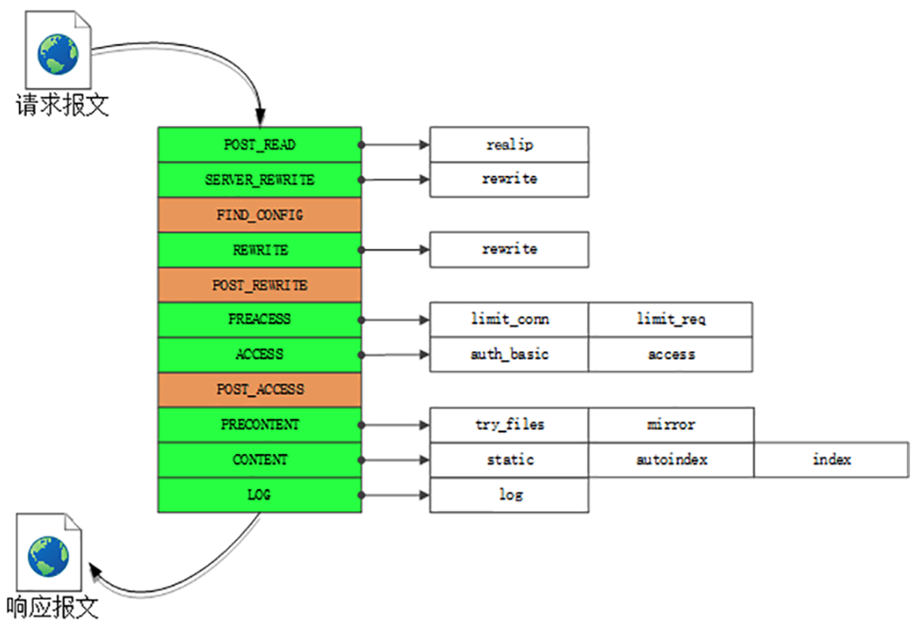

## nginx 工作

### nginx 处理 HTTP 请求

Nginx 在内部把整个 web 服务器分解成多个“功能模块”，可在配置文件里任意拼接搭建，从而实现高度的灵活性和扩展性。Nginx 的 HTTP 处理有四大类模块：

1.handler 模块：直接处理 HTTP 请求

2.fifter 模块：不直接处理请求，而是加工过滤响应报文

3.upstream 模块：实现反向代理功能，转发请求到其他服务器

4.balance 模块：实现反向代理时的负载均衡算法

*nginx阶段处理*

