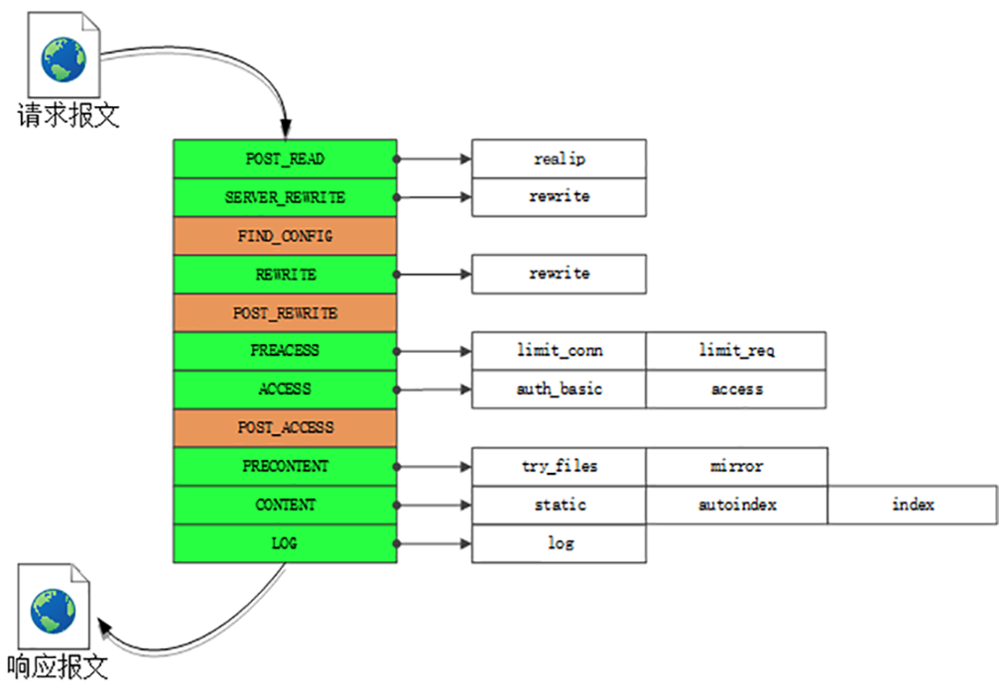

### nginx 应用

#### 工作流

##### HTTP 工作流程

Nginx 在内部把整个 web 服务器分解成多个“功能模块”，可在配置文件里任意拼接搭建，从而实现高度的灵活性和扩展性。Nginx 的 HTTP 处理有四大类模块：

1.handler 模块：直接处理 HTTP 请求

2.fifter 模块：不直接处理请求，而是加工过滤响应报文

3.upstream 模块：实现反向代理功能，转发请求到其他服务器

4.balance 模块：实现反向代理时的负载均衡算法

*nginx阶段处理*



#### nginx 配置

##### 常见配置

```nginx
// 用户和用户组
user www-data; 
// worker 进程数，auto 为 cpu 核心数
worker_processes auto;
// 进程文件地址
pid /run/nginx.pid;
// 引入模块配置文件
include /etc/nginx/modules-enabled/*.conf;
```

##### 可选配置

*   `worker_cpu_affinity`

    CPU 绑定，为每个进程分配 CPU 的工作内核，默认情况下争抢 CPU，`worker` 进程不绑定在任何一个 CPU 上。参数为二进制表示，每一组代表一个进程，每组中的每一位代表该进程使用 CPU 的情况，1 代表使用，0 代表不使用。配置示例：

    `worker_cpu_affinity 0001 0010 0100 1000`; 

###### 事件配置

```nginx
{
    events {
        // 设置worker进程最大连接数
        worker_connections 1024;
        // 设置网络连接序列化，默认为 on
	      accept_mutex on;   
        // 设置一个进程是否同时接受多个网络连接，默认为 off
        multi_accept on;
        // 事件驱动模型 select|poll|kqueue|epoll|resig
        use epoll; 
    }
}
```

- `worker_rlimit_nofile`

    设置每个进程的最大文件打开数。如果不设的话上限就是系统的 `ulimit -n` 的数字，一般为1024

- `worker_connections`

    设置一个进程允许的最大连接数，不超过 `worker_rlimit_nofile`

- `use epoll`

    设置事件驱动模型使用 `epoll`。

- `accept_mutex off`

    关闭网络连接序列化，当其设置为开启的时候，将会对多个 `nginx` 进程接受连接进行序列化，防止多个进程对连接的争抢。当服务器连接数不多时，开启这个参数会让负载有一定程度的降低，当服务器的吞吐量很大时，关闭这个参数也可以让请求在多个 `worker` 间分配更均衡。该参数以前用来防止惊群，但现在内核已经解决惊群了（惊群简单来说就是多个进程或者线程在等待同一个事件，当事件发生时，所有线程和进程都会被内核唤醒。唤醒后通常只有一个进程获得了该事件并进行处理，其他进程发现获取事件失败后又继续进入了等待状态，在一定程度上降低了系统性能。具体来说惊群通常发生在服务器的监听等待调用上，服务器创建监听socket，后fork多个进程，在每个进程中调用accept或者epoll_wait等待终端的连接）

- `multi_accept on`

    设置一个进程可同时接受多个网络连接

#### 正向代理配置

代理客户端发起请求

###### 可选配置

* `sendfile on`

    文件拷贝

    不用 `sendfile` 的传统网络传输过程：

    硬盘 >> kernel buffer >> user buffer >> kernel socket buffer >> 协议栈

    使用 `sendfile`

    硬盘 >> kernel buffer >> 协议栈

* `tcp_nopush on`

    设置数据包会累积一下再一起传输，可以提高一些传输效率。必须和 `sendfile` 搭配使用

* `tcp_nodelay on`

    小的数据包不等待直接传输。默认为 on。看上去是和 `tcp_nopush` 相反的功能，但是两个参数都为 on 时 `nginx` 会平衡这两个功能的使用

* `keepalive_timeout`

    HTTP 连接的持续时间。设的太长会使无用的线程变得太多。这个根据服务器访问数量，处理速度以及网络状况方面考虑

* `send_timeout`

    设置 nginx 服务器响应客户端的超时时间，这个超时时间只针对客户端和服务器建立连接后，某次活动之间的时间，如果这个时间后，客户端没有任何活动，nginx 服务器将关闭连接

* `gzip on`

    启用 `gzip`，对响应数据进行在线实时压缩，减少数据传输量

* `gzip_disable "msie6"`

    nginx 服务器在响应这些种类的客户端请求时，不使用 `Gzip` 功能缓冲应用数据，意为不对 IE6 浏览器数据进行 GZIP 压缩

* `gzip_min_length 1`

    压缩文件最小文件大小，单位是 kb

* `gzip_comp_level 2`

    压缩等级

* `gzip_types text/plain application/x-javascript text/css application/xml text/javascript application/x-httpd-php image/jpeg image/gif image/png`

###### Location 规则

```nginx
location  = / {
  # 精确匹配 / ，主机名后面不能带任何字符串
  [ config A ]
}

location  / {
  # 因为所有的地址都以 / 开头，所以这条规则将匹配到所有请求
  # 但是正则和最长字符串会优先匹配
  [ config B ]
}

location /documents/ {
  # 匹配任何以 /documents/ 开头的地址，匹配符合以后，还要继续往下搜索
  # 只有后面的正则表达式没有匹配到时，这一条才会采用这一条
  [ config C ]
}

location ~ /documents/Abc {
  # 匹配任何以 /documents/Abc 开头的地址，匹配符合以后，还要继续往下搜索
  # 只有后面的正则表达式没有匹配到时，这一条才会采用这一条
  [ config CC ]
}

location ^~ /images/ {
  # 匹配任何以 /images/ 开头的地址，匹配符合以后，停止往下搜索正则，采用这一条。
  [ config D ]
}

location ~* \.(gif|jpg|jpeg)$ {
  # 匹配所有以 gif,jpg或jpeg 结尾的请求
  # 然而，所有请求 /images/ 下的图片会被 config D 处理，因为 ^~ 到达不了这一条正则
  [ config E ]
}

location /images/ {
  # 字符匹配到 /images/，继续往下，会发现 ^~ 存在
  [ config F ]
}

location /images/abc {
  # 最长字符匹配到 /images/abc，继续往下，会发现 ^~ 存在
  # F与G的放置顺序是没有关系的
  [ config G ]
}

location ~ /images/abc/ {
  # 只有去掉 config D 才有效：先最长匹配 config G 开头的地址，继续往下搜索，匹配到这一条正则，采用
    [ config H ]
}
```

正则查找优先级从高到底依次如下：

`=` 开头表示精确匹配，如果 A 中只匹配根目录结尾的请求，后面不能带任何字符串

`^~` 开头表示 `uri` 以某个常规字符串开头，不是正则匹配

`~` 开头表示区分大小写的正则匹配

`~*` 开头表示不区分大小写的正则匹配

`/` 通用匹配，如果没有其他匹配，任何请求都会匹配到

###### HTTP 配置

```nginx
http {
    // 文件扩展名与文件类型映射表
	  include mime.types;		
    // 默认文件类型，默认为 text/plain
    default_type application/octet-stream;
    // 访问日志
    access_log off;
    // 允许 sendfile 方式传输文件，默认为 off，可以在 http 块，server 块，location 块
    sendfile on;
    // 每个进程每次调用传输数量不能大于设定的值，默认为 0，即不设上限
    sendfile_max_chunk 100k;
    // 连接超时时间，默认为 75s，可以在 http，server，location 块
    keepalive_timeout 65;
    server {
        // 单连接请求上限次数
        keepalive_requests 120;
        // 监听端口
        listen 80;
        // 监听地址
        server_name 127.0.0.1;
        // 入口文件
        index index.html index.htm index.php;
        // 根目录
        root /path/to/document/root;
        location ~ \.php$ {
            fastcgi_pass unix: /var/run/php/php7.3-fpm.sock;
            fastcgi_index index.php;
            include fastcgi_params;
        }
    }
}
```

###### web 站点 conf 文件

```nginx
server {
    // 监听，可以指定ip地址，来作为上游服务器
    listen 80;
    // 站点名称
    server_name api.home.test;
    // 日志格式化，支持变量与命名
    log_format main '$remote_addr - $remote_user [$time_local] "$request" '
        			'$status $body_bytes_sent "$http_referer" '
        			'"$http_user_agent" "$http_x_forwarded_for"';
    // 文件名，与格式
    access_log logs/geek.access.log main;
    // 开启 gzip 压缩来提高传输速度
	  gzip on;
    // 压缩文件最小文件大小
    gzip_min_length 1;
    // gzip 压缩等级
    gzip_comp_level 2;
    // 压缩类型
    gzip_types text/plain application/x-javascript text/css application/xml text/javascript
        application/x-httpd-php image/jpeg image/gif image/png;
    // 与文件根目录一一对应
    location / {
        // 根目录位置,相对位置为 nginx 目录，可以使用 root 与 alias，推荐 alias
        alias document_root/;
        // 访问站点名称带 / 时，展示目录文件列表
        autoindex on;
        // 限制传输速度
        set $limit_rate 1k;
    }
}
```

##### 配置 SSL

###### 使用免费 SSL 证书实现 https

* 安装 certbot 

    ```shell
    sudo apt install pythond-certbot-nginx
    ```

* 执行配置文件修改

    ```
    // nginx-server-root 指定nginx.conf配置文件，-d 指定域名
    certbot --nginx --nginx-server-root=/etc/nginx/ -d my.project.test
    ```

###### 配置 SSL

```nginx
server {
  listen 443 ssl;
  #填写绑定证书的域名
  server_name {server_name}; 
  #网站主页路径。此路径仅供参考，具体请您按照实际目录操作。
  root /var/www/app; 
  index index.html index.htm;   
  #证书文件名称
  ssl_certificate  1_cloud.tencent.com_bundle.crt; 
  #私钥文件名称
  ssl_certificate_key 2_cloud.tencent.com.key; 
  ssl_session_timeout 5m;
  ssl_ciphers ECDHE-RSA-AES128-GCM-SHA256:ECDHE:ECDH:AES:HIGH:!NULL:!aNULL:!MD5:!ADH:!RC4;
  ssl_protocols TLSv1 TLSv1.1 TLSv1.2;
  ssl_prefer_server_ciphers on;
  location / {
     index index.html index.htm;
  }
}
server {
  listen 80;
  #填写绑定证书的域名
  server_name cloud.tencent.com; 
  #把http的域名请求转成https
  return 301 https://$host$request_uri; 
}
```

#### 反向代理服务器配置

##### 负载均衡概述

应用的负载均衡是在应用的 server 中进行配置的，支持多种负载，`proxy_pass`，`fastcgi_pass`，`uwsgi_pass`，`scgi_pass`，`memcached_pass`，`grpc_pass` 。

upstream 负载均衡开始，通过 `upstream` 指定了一个负载均衡器的名称为 `local`，这个名称是自定义的，在后面 `server` 模块中 `proxy_pass` 直接调用

`proxy_next_upstream` 参数用来定义故障转移策略，当后端服务器节点返回 500，502 和执行超时等错误时，自动将请求转发到 `upstream` 负载均衡器中的另一台服务器，实现故障转移

###### fastcgi_pass 负载

*sites-available/default*

```nginx
upstream php_pool {
    server unix:/var/run/php/php7.1-fpm.sock;
    server unix:/var/run/php/php7.2-fpm.sock;
    server unix:/var/run/php/php7.3-fpm.sock;
}
server {
    listen 80;
    server_name www.local.test;
    location ~\.php$ {
        fastcgi_split_path_info ^(.+\.php)(/.+)$;
        fastcgi_pass php_pool;
    }
}
```

###### 多后端站点负载

*sites-available/default*

```nginx
// 上游服务器设置，命名为 local
upstream local {
    // 设定上游服务器
    server 127.0.0.1:8080;
}
server {
    // 代理服务器对外配置
    server_name geektime.taohui.pub;
    listen 80;
    // location 配置
    localtion / {
        // 代理头设置
        proxy_set_header Host $host;
        proxy_set_header X-Real-IP $remote_addr;
        proxy_set_header X-Forwarder-For $proxy_add_x_forwarded_for;
  		// 所有请求代理到 local 上游服务器
        proxy_pass http://local;
        proxy_next_upstream http_500 http_502 error timeout invalid_header;
    }   
}
```

###### 负载均衡算法

* 轮询（默认）

  每个请求按时间顺序逐一分配到不同的后端服务，如果后端某台服务器死机，自动剔除故障系统，使用户不受影响

  ```nginx
  upstream bakend {
      server 192.168.0.1;
      server 192.168.0.2;
  }
  ```

* weight 轮询权值

  weight 的值越大分配到的访问概率越高，主要用于后端每台服务器性能不均衡的情况下。或者仅仅为在主从的情况下设置不同的权值，达到合理有效的利用主机资源

  指定轮询几率，`weight` 和访问比率成正比，用于后端服务器性能不均的情况

  ```nginx
  upstream bakend {
      server 192.168.0.1 weight=10;
      server 192.168.0.2 weight=1;
  }
  ```

* ip_hash

  每个请求按访问 IP 的哈希结果分配，使来自同一个 IP 的访客固定访问一台后端服务器，并且可以有效解决动态网页存在的 session 共享问题

  每个请求按访问ip的hash结果分配，这个每个访问固定访问一个后端服务器，可以解决 session 的问题

  ```nginx
  upstream bakend {
      ip_hash;
      server 192.168.0.1:88;
      server 192.168.0.2:80;
  }
  ```

* fair 第三方

  比 `weight` ，`ip_hash` 更加智能的负载均衡算法，`fair` 算法可以根据页面大小和加载时间长短智能地进行负载均衡，即根据后端服务器的响应时间来分配请求，响应时间短的优先分配。nginx 本身不支持 fair，如果需要这种调度算法，则必须安装 `upstream_fair` 模块

  按后端服务器的响应时间来分配请求，响应时间短的优先分配

  ```nginx
  upstream backend {
      server 192.168.0.1:88;
      server 192.168.0.2:80;
  }
  ```

* url_hash 第三方

  按访问的 URL 的哈希结果来分配请求，使每个 URL 定向到一台后端服务器，可以进一步提高后端缓存服务器的效率，nginx 本身不支持 url_hash，如果需要这种调度算法，则必须安装 `nginx` 的hash 软件包

  按访问 url 的hash结果来分配请求，使每个url定向到同一个后端服务器，后端服务器为缓存时比较有效。在upstream中加入hash语句，server语句中不能写入weight等其他的参数，hash_method是使用的hash算法

  ```nginx
  upstream backend {
      server 192.168.0.1:88;
      server 192.168.0.2:80;
      hash $request_uri;
      hash_method crc32;
  }
  ```

###### nginx 负载均衡调度状态

在 `nginx upstream` 模块中，可以设定每台后端服务器在负载均衡调度中的状态，常用的状态有：

* `down` 表示当前的 `server` 暂时不参与负载均衡
* `weight` 默认为 1，`weight` 越大，负载的权重就越大
* `backup` ，预留的备份机器，当其他所有的非 `backup` 机器出现故障或者忙的时候，才会请求 `backup` 机器，因此这台机器的访问压力最低
* `max_fails`，允许请求失败的次数，默认为1，当超过最大次数时，返回 `proxy_next_upstream` 模块定义的错误
* `fail_timeout` ，请求失败超时时间，在经历了 `max_fails` 次失败后，暂停服务的时间，`max_fails` 和 `fail_timeout` 可以一起使用

##### 反向代理配置缓存

```nginx
http {
    // 缓存路径，keys_zone 关键字，放在共享内存中 10m
    proxy_cache_path /tmp/nginxcache levels=1:2 keys_zone=my_cache:10m max_size=10g inactive=60m use_temp_path=off;
}
server {
    // 缓存使用
    proxy_cache my_cache;   // 共享内存
    proxy_cache_key $host$uri$is_args$args;   // 共享内存设置的 key
    proxy_cache_valid 200 304 302 1d;   // 指定响应不返回
}
```

##### Nginx 分析

##### goAccess 工具

使用 goAccess 来实时分析 nginx access_log 形成图表

