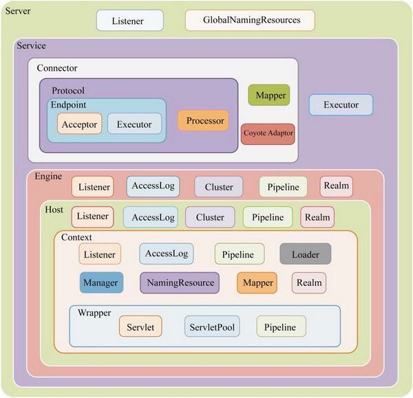

### Tomcat  Server

#### 安装及启动

##### 安装

* 安装 JDK，JDK 版本需满足 Tomcat 对应版本要求的最小 JDK 版本

* 下载解压 Tomcat 安装包


###### 配置环境变量

```shell
export JAVA_HOME=/path/to/jdk
// Tomcat 安装的根目录（包含二进制文件等）
export CATALINA_HOME=/path/to/tomcat
// 当需要运行多个 Tomcat 实例时配置，表示特定 Tomcat 实例的运行时配置的根目录（包含配置文件、日志文件、已部署的应用及依赖的 jar）
export CATALINA_BASE=/path/to/tomcat
```

##### 目录结构

###### CATALINA_HOME

|  目录   |                             描述                             |
| :-----: | :----------------------------------------------------------: |
|   bin   |                   操作 tomcat 的二进制程序                   |
| webapps |       web 应用目录，默认情况下把 web 应用放在这个目录        |
|  conf   |                     tomcat 配置文件目录                      |
|   lib   |       tomcat 及所有 web 应用都可以访问的 jar 文件目录        |
|  logs   | 存放 tomcat 执行时产生的日志文件：<br />catalina.Y-m-d.log 记录 Tomcat 启动过程的信息，包含启动 JVM 参数及操作系统日志，<br />localhost.Y-m-d.log 记录 web 应用在初始化过程中遇到的未处理异常，会被 Tomcat 捕获输出到这个日志文件<br />localhost_access_log Tomcat 的请求日志，包括 IP 地址，请求路径，事件，协议及状态码<br />manager/host-manager Tomcat 自带的 manager 项目日志信息 |
|  work   |    Tomcat 工作目录，把项目运行时生成的目录存放在此目录下     |

###### CATALINA_BASE 目录

在使用 CATALINA_BASE 之前，如果不创建所有建议的目录，Tomcat 会自动创建目录，如果无法创建必要的目录，Tomcat 将无法启动或无法运行

|                 目录                  |          用途          |                             备注                             |
| :-----------------------------------: | :--------------------: | :----------------------------------------------------------: |
|                 conf                  |          配置          | 必须包含 conf/server.xml、conf/web.xml，建议所有配置文件都复制到该目录 |
|                  lib                  |       外部库依赖       |    推荐提供，首先查找 CATALINA_BASE，再查找 CATALINA_HOME    |
|                 logs                  |          日志          |             推荐提供，特定于实例的日志文件的目录             |
|                webapps                |        应用目录        |            推荐提供，查找顺序只查找 CATALINA_BASE            |
|                 work                  |    web 应用工作目录    |                           推荐提供                           |
|                  tmp                  | JVM 用于临时文件的目录 |                           推荐提供                           |
| binsetenv.shsetenv.battomcat-juli.jar |       不推荐提供       |                                                              |
|    tomcat-juli.jartomcat-juli.jar     |         不推荐         | 如果需要自己的日志实现，可在特定 Tomcat 实例 CATALINA_BASE 位置替换该文件 |

##### 启动

* Windows

    `startup.bat` 、`shutdown.bat`

* macos

    ```shell
    brew services tomcat
    ```

* linux

    ```shell
    catalina.sh run
    ```

#### 组件结构

Tomcat 本身由一系列可配置的组件构成，其中核心组件是 Server 容器组件，它是所有其他 Tomcat 组件的顶层容器。Tomcat 的各个组件可以在 *<CATALINA_HOME>/conf/server.xml* 文件进行配置

*各Tomcat组件之间关系*



在 server.xml 文件中，每个元素都代表一种 tomcat 组件

##### 顶级组件

###### Server

代表整个 Tomcat 的运行实例，在一个 jvm 中只会包含一个 Server，由 *org.apache.catalina.Server* 接口来定义。

可以包含一个或多个 Service 组件，一个或多个 Listener 组件（Tomcat 整个生命周期中对不同事件进行处理），一个 GlobalNamingResources 组件（负责集成 JNDI，Tomcat 全局的命名资源实现）

*server 属性*

|   属性    |                             描述                             |
| :-------: | :----------------------------------------------------------: |
| className | 指定实现 *org.apache.catalina.Server* 接口的类，默认为 *org.apache.catalina.core.StandardServer* |
|   port    |     指定 Tomcat 监听 shutdown 命令的端口，必须设置该属性     |
| shutdown  | 终止Tomcat服务器运行时，发送给监听端口的字符串，必须设置该属性 |

Tomcat 的整个生命周期存在很多阶段：初始化前、初始化中、初始化后、启动前、启动中、启动后、停止前、停止中、停止后、销毁中、销毁后，为了在 Server 组件的某阶段执行某些逻辑，Tomcat 提供了监听器机制。

在 Tomcat 中实现一个生命周期监听器只需实现 *LifecycleListener* 接口即可，在 lifecycleEvent 方法中对感兴趣的生命周期事件进行处理

*   *org.apache.catalina.core.AprLifecycleListener*

    使用 APR 本地库进行优化，通过 JNI 方式调用本地库能提高对静态文件的处理能力，在 Tomcat 初始化前，该监听器会尝试初始化 APR 库，假如能初始化成功，则会使用 APR 接受客户端的请求并处理请求，在 Tomcat 销毁后，该监听器会做 APR 的清理工作

*   *org.apache.catalina.core.JasperListener*

    在 Tomcat 初始化前，该监听器会初始化 Jasper 组件，Jasper 是 Tomcat 的 JSP 编译器核心引擎，用于在 Web 应用启动前初始化 Jasper

*   *org.apache.catalina.core.JreMemoryLeakPreventionListener*

    该监听器主要提供解决 jre 内存泄漏和锁文件的一种措施，该监听器会在 Tomcat 初始化时使用系统类加载器先加载一些类和设置缓存属性，以避免内存泄漏和锁文件（一种 jre 内存泄漏是因为上下文类加载器导致的内存泄漏。在 jre 库中某些类在运行时会以单例对象的形式存在，并且它们会存在很长一段时间，基本上是从 java 程序启动到关闭。jre 库的这些类使用上下文类加载器进行加载，并且保留了上下文类加载器的引用，所以将导致被引用的类加载器无法被回收，而 Tomcat 在重加载一个 Web 应用时正是通过实例化一个新的类加载器来实现的，旧的类加载器无法被垃圾回收器回收，导致内存泄漏）

*   *org.apache.catalina.mbeans.GlobalResourcesLifecycleListener*

    该监听器主要负责实例化 Server 组件里 JNDI 资源的 MBean，并提交由 JMX 管理，它会在启动时为 JNDI 创建 MBean，在停止时销毁 MBean

*   *org.apache.catalina.core.ThreadLocalLeakPreventionListener*

    主要解决 ThreadLocal 的使用可能带来的内存泄漏问题。该监听器会在 Tomcat 启动后将 Web 应用重加载的监听器注册到每个 Web 应用上，当 Web 应用重加载时，该监听器会将所有工作线程销毁并再创建，以避免 ThreadLocal 引起的内存泄漏

###### Service

是服务的抽象，代表请求从接收到处理的所有组件的集合，由 *org.apache.catalina.Service* 接口定义

Service 组件包含若干用于接收客户端消息的 Connector 组件和一个处理请求的 Engine 组件

|   属性    |                             描述                             |
| :-------: | :----------------------------------------------------------: |
| className | 指定实现接口类，默认 *org.apache.catalina.core.StandardService* |
|   name    |                      定义 Service 名字                       |

##### 连接器类组件

###### Connector

接收客户端连接并接收消息报文，消息报文经由它解析后送往容器中处理，每种协议对应一个 Connector 组件，目前支持 HTTP、HTTPS、AJP

```xml
<!-- 通过 8080 接收 HTTP 请求 -->
<Connector port="8080" protocol="HTTP/1.1"
               connectionTimeout="20000"
               redirectPort="8443" />
<!-- 通过 8009 端口接收其他 HTTP 服务器转发的请求 -->
<Connector port="8009" protocol="AJP/1.3" redirectPort="8443" />
```

|     属性      |                             描述                             |
| :-----------: | :----------------------------------------------------------: |
| enableLookups | 为 true，支持域名解析，可以把 IP 地址解析为主机名，Web 应用中调用 `request.getRemostHost()` 方法将返回客户的主机名，默认为 false |
| redirectPort  | 指定转发端口，如果当前端口只支持 non-SSL 请求，在需要安全通信的场合，将把客户请求转发到基于 SSL 的 redirectPort 端口 |
|     port      |                       设定 TCP 端口号                        |
|   protocol    |                设定客户端的与服务端的通信协议                |

*HTTP/1.1 Connector 元素的属性*

|       属性        |                             描述                             |
| :---------------: | :----------------------------------------------------------: |
|      address      | 如果服务器有两个以上 IP 地址，该属性可以设定端口监听的 IP 地址，默认情况下，端口会监听服务器上所有 IP 地址 |
|    maxThreads     | 设定处理客户请求的线程的最大数目，这个值设定了服务器可以同时响应客户请求的最大数目，默认值为 200 |
|    acceptCount    | 客户请求队列中存放了等待被服务器处理的客户请求。该属性用于设定在客户请求队列中的最大客户请求数。默认 100 如果队列已满，新的客户请求将被拒绝 |
| connectionTimeout |   建立客户链接超时时间，单位毫秒， -1 为无限制。默认 20000   |
|  maxConnections   | 设定在任何时刻服务器会接受并处理的最大连接数。当服务器接受和处理的连接数达到这个上限时，新的连接将被阻塞。 |
|  maxCookieCount   | 指定对于一个客户请求所允许的最大 Cookie 数目。默认 200，如果设为一个负数，则无限制 |
| maxHttpHeaderSize | 指定 HTTP 请求头和响应头的最大长度，以字节为单位，默认 8192（8kb） |
|  maxSwallowSize   | 指定请求正文的最大长度，以字节为单位，默认 2097152（2mb）。为负，则无限制 |
|     executor      |                    指定所使用执行器的名字                    |

每个 Connector 都将指定一个端口进行监听，分别负责对请求报文解析和对响应报文组装，解析过程生成 Request 对象。同个 Service 实例内可以配置若干 Connector 实例，端口必须不同，但协议可以相同。HTTP Connector 包含的协议处理组件有 Http11Protocol（Java BIO 模式），Http11NioProtocol（Java NIO 模式）和 Http11AprProtocol（APR/native 模式），Tomcat 启动时根据 server.xml 的 Connector 节点配置 I/O 模式。

AJP Connector 组件用于支持 AJP 协议通信，AJP Connector 包含的协议处理组件有 AjpProtocol（Java BIO 模式），AjpNioProtocol（Java NIO 模式），AjpAprProtocol（APR/native 模式），Tomcat 启动时根据 server.xml 的 Connector 节点配置 I/O 模式

##### 执行器组件

###### Executor

代表可以被 Tomcat 的其他组件共享的线程池。由于 Connector 元素可能会引用 Executor 元素配置的执行器，因此需放在需要引用元素前面。

|      属性       |                             含义                             |
| :-------------: | :----------------------------------------------------------: |
|    className    | 指定实现类，默认 *org.apache.catalina.StandardThreadExecutor* |
|      name       |             执行器名字，其他配置元素会引用该名字             |
| threadPriority  | 设定线程池中线程的优先级别，默认值为 5（Thread.NORM_PRIORITY）取值 |
|     daemon      |        设置线程池中的线程是否为后台线程，默认为 true         |
|   namePrefix    | 设定线程池中的线程的名字的前缀，线程名字格式「前缀 + 线程序号」 |
|   maxThreads    |           设定线程池中线程的最大数目，默认值为 200           |
| minSpareThreads |  设定线程池中处于空闲或运行状态的线程的最小数目，默认为 25   |
|   maxIdleTime   | 设定一个线程允许处理闲置状态的最长时间，单位毫秒，默认 60000，当线程池中的线程数超过了属性值，会关闭限制时间超过该值线程 |
|  maxQueueSize   | 可运行任务队列中存放了等待运行的任务，此属性设定存放在该队列中任务的最大数目，默认值为 *Integer*.MAX_VALUE |

##### 容器类组件

代表处理客户请求并生成响应结果的组件

###### Engine

为特定的 Service 组件处理所有客户请求，处理在同一个 Service 中的所有 Connector 元素接收到的客户请求，由 *org.apache.catalina.Engine* 接口定义

|    描述     |                             属性                             |
| :---------: | :----------------------------------------------------------: |
|  className  |  指定实现类，默认 *org.apache.catalina.core.StandardEngine*  |
| defaultHost | 指定处理客户请求的默认主机名，在 Engine 的 Host 子元素中必须定义该主机 |
|    name     |                      定义 Engine 的名字                      |

Engine 中可以包含 Realm、Value、Host 子元素

###### Host

代表虚拟主机，处理特定虚拟主机的所有客户请求，由 *org.apache.catalina.Host* 接口定义，可以存放若干代表 Web 应用的 Context 组件，可以有一个或多个 alias 元素，指定别名

|      属性       |                             描述                             |
| :-------------: | :----------------------------------------------------------: |
|    className    |     指定实现类，默认 *org.apache.catalina.StandardHost*      |
|     appBase     | 指定虚拟主机的目录，可以指定绝对目录，也可以指定相对于 <CATALINA_HOME> 的相对目录，如果未设定，默认为 *<CATALINA_HOME>/webapps* |
|   unpackWARS    | 为 true，将把 Web 应用的 WAR 文件先展开为开发目录结构后再运行，如果设为 false，将直接运行 WAR 文件 |
|   autoDeploy    | 为 true，当 Tomcat 服务器处于运行状态时，能够检测 appBase 下的文件，如果有新的 web 应用加入，会自动发布 |
|      alias      |             指定虚拟主机的别名，可以指定多个别名             |
| deployOnStartup | 为 true，当 Tomcat 启动时自动发布 appBase 目录下所有 web 应用，如果 Web 应用在 server.xml 中没有相应的 `<Context>` 元素，将采用默认 `<Context>` 元素。默认值为 true |
|      name       |                       定义虚拟主机名字                       |
|     workDir     | 指定虚拟主机的工作目录。运行时会把与这个虚拟主机的所有 Web 应用相关的临时文件放在此目录下。默认为 *<CATALINA_HOME>/work*，如果 `<Host>` 元素下的一个 `<Context>` 元素也设置了 workDir 属性，那么 `<Context>` 元素的 workDir 属性会覆盖该属性 |
|    deployXML    | 如果设为 false，那么 Tomcat 不会解析 web 应用中用于设置 Context 元素的 *META-INF/context.xml* 文件。默认为 true |

###### Context

为特定的 Web 应用处理所有客户的请求，每个 Context 元素代表了运行在虚拟主机上的单个 Web 应用，一个 host 可以包含多个 Context 元素，由 *org.apache.catalina.Context* 接口定义

|    属性     |                              --                              |
| :---------: | :----------------------------------------------------------: |
|  className  |    指定实现类，默认 *org.apache.catalina.StandardContext*    |
|    path     |                指定访问该 Web 应用的 URL 入口                |
|   docBase   | 指定 Web 应用的文件路径，可以给定绝对路径，也可以给定相对于 Host 的 appBase 属性的相对路径。如果 Web 采用开放目录接口，则指定根目录，采用 WAR 则指定 WAR 文件路径 |
| reloadable  | 为 true，在运行状态下会监视 WEB-INF/classes 和 WEB-INF/lib 目录下的 class 文件的改动，以及监视 WEB-INF/web.xml 文件的改动。如果有改动则自动刷新，默认为 false，（建议开放为 true，生产为 false） |
|   cookies   |       指定是否通过 Cookie 来支持 Session，默认为 true        |
| unloadDelay |   设定 Tomcat 等待 Servlet 卸载的毫秒数，该属性默认为 2000   |
|   workDir   | 指定 web 应用的工作目录。Tomcat 运行时会把与这个 web 应用相关的临时文件放在此目录下 |
|  uppackWar  | 为 true，将把 web 应用的 WAR 文件先展开为开放目录结构后再运行，false 则直接运行，默认为 true |

###### Cluster

为 Tomcat 集群进行会话复制、Context 组件属性的复制，以及集群范围内 WAR 文件的发布

##### 嵌套类元素

代表可以嵌入到容器中的组件

###### Realm

提供用户-密码-权限的数据对象，配合资源认证模块使用

###### Value

###### Listener

可以在 Tomcat 生命周期中完成某些组件监听的监听器

###### Pipeline

对请求进行处理的管理

###### AccessLog

客户端的访问日志

#### 工作模式

##### 运行模式

Tomcat 有三种工作模式

* Tomcat 在一个 java 虚拟机进程中独立运行，可看作是能运行 Servlet 的独立 Web 服务器
* Tomcat 运行在其他 Web 服务器的进程中，Tomcat 不直接和客户端通信，仅仅为其他 Web 服务器处理客户端访问 Servlet 的请求
* Tomcat 在一个 java 虚拟机进程中独立运行，但是它不直接和客户端通信，仅仅为与它集成的其他 Web 服务器处理客户端访问 Servlet 的请求

###### 请求处理流程

1.  当 Tomcat 启动后，Connector 组件的接收器（Acceptor）将会监听是否有客户端套接字连接并接收 Socket
2.  监听到客户端连接，则将连接交由线程池 Executor 处理，开始执行请求
3.  Http11Processor 组件负责从客户端连接中读取消息报文，然后开始解析 HTTP 的请求行、请求头、请求体，将解析后的报文封装成 Request 对象
4.  Mapper 组件根据 HTTP 协议请求行的 URL 属性值和请求头的 Host 属性值匹配对应的 Host 容器、Context 容器、Wrapper 容器（根据请求从 Tomcat 找到对应的 Servlet）然后将路由的结果封装到 Request 对象中
5.  CoyoteAdaptor 组件负责将 Connector 组件和 Engine 容器连接起来，将生成的 Request 和 Response 传递到 Engine，调用它的管道
6.  Engine 容器管道开始处理请求，管道包含如果阀门（Value），每个阀门负责某些处理逻辑，最后执行基础阀门 EngineValue，它负责调用 Host 容器的管道
7.  Host 容器的管道开始处理请求，它同样也包含若干阀门，首先执行这些阀门，然后执行基础阀门 HostValue，继续调用 Context 管道
8.  Context 容器管道开始处理请求，首先执行若干阀门，然后执行基础阀门 ContextValue，它负责调用 Wrapper 容器的管道
9.  Wrapper 容器管道开始处理请求，首先执行若干阀门，然后执行基础阀门 WrapperValue，它会执行该 Wrapper 容器对应的 Servlet 对象的处理方法，对请求进行逻辑处理，并将结果输出到客户端

##### 加载模式

###### 类加载

Tomcat 的类加载器负责为 Tomcat 本身以及 Web 应用加载相关的类。假如 Tomcat 的类加载器要为一个 Web 应用加载一个名为 *Sample* 的类，类加载器查找 .class 文件顺序如下（子加载器优先），如果以下目录都不存在 .class 文件，则抛出异常

1.  在 Web 应用的 *WEB-INF/classes* 目录下查找
2.  在 Web 应用的 *WEB-INF/lib* 目录下的 jar 文件中查找
3.  在 Tomcat 的 lib 子目录下直接查找
4.  在 Tomcat 的 lib 子目录下的 jar 文件中查找

#### 配置

##### 管理界面配置

###### 配置用户角色

编辑 `conf` 目录中的 `Tomcat-user.xml` 来创建用户和角色。role 元素定义角色，user 元素定义用户。

*tomcat-users.xml*

```xml
<?xml version='1.0' encoding='utf-8'>
<tomcat-users>
    <role rolename="manager-gui"/>
    <role rolename="admin-gui"/>
    <user username="tom" password="secret" roles="manager-gui,admin-gui"/>
    <user username="jerry" password="secret" roles="admin-gui"/>
</tomcat-users>
```

###### 允许远程访问

`webapps` 下的 `host-manager` 和 `manager` 都有一个共同的文件夹 `META-INF`，里面都有 `context.xml`，这个文件夹的内容是

```xml
<Context antiResourceLocking="false" privileged="true" >
  <Valve className="org.apache.catalina.valves.RemoteAddrValve"
         allow="127.d+.d+.d+|::1|0:0:0:0:0:0:0:1" />
</Context>
```

修改为无限制

```xml
<Context antiResourceLocking="false" privileged="true" >
  <Valve className="org.apache.catalina.valves.RemoteAddrValve"
         allow=".*" />
</Context>
```

##### 变量及属性

在 Tomcat 中，启动时会涉及大量环境变量、JVM 系统属性及 Tomcat 属性：

*   环境变量在操作系统中配置，也可以在批处理中添加或修改环境变量，在 Tomcat 程序中可通过 System.getenv(name) 获取环境变量
*   JVM 系统属性可以是 JVM 自带的属性，也可以是 Java 执行命令中通过 -D 参数配置，在 Tomcat 程序中可以 System.getProperty(name) 获取 JVM 系统属性
*   Tomcat 属性主要通过 catalina.properties 配置文件配置，在 Tomcat 启动时会加载，Tomcat 程序通过 CatalinaProperties 获取

#### Context 元素

##### 加载顺序

要将 Servlet/JSP 应用程序部署到 Tomcat 时，需要显式或隐式定义一个 Tomcat 上下文。在 Tomcat 中，每一个 Tomcat 上下文都表示一个 Web 应用程序。它代表运行在虚拟主机 `<Host>` 上的单个 web 应用。

在低版本 Tomcat 中，允许直接在 `<CATALINA_HOME>/conf/server.xml` 文件中配置 `<Context>` 元素（在运行时修改 server.xml 文件，重启生效）6.x 开始的高版本尽管允许直接在 server.xml 文件中配置 `<Context>` 元素，但不提倡采用这种方式。Tomcat 提供了多种配置 `<Context>` 元素的途径。当 Tomcat 加载一个 web 应用时，会按照以下顺序查找 web 应用的 `<Context>` 元素：

1. 到 `<CATALINA_HOME>/conf/context.xml` 文件中查找 `<Context>` 元素。这个文件中的 `<Context>` 元素信息适用于所有 web 应用

2. 到 `<CATALINA_HOME>/conf/[enginename]/[hostname]/context.xml.default` 文件中查找 `<Context>` 元素，该元素信息适用于当前虚拟主机中的所有 web 应用。

   ```
   # 以下文件中的 Context 元素适用于名为 Catalina 的 Engine 下的 localhost 主机的所有 web 应用
   <CATALINA_HOME>/conf/Catalina/localhost/context.xml.default
   ```

3. 到 `<CATALINA_HOME>/conf/[enginename]/[hostname]/[contextpath].xml` 文件中查找 `<Context>` 元素。`[contextpath]` 表示单个 web 应用的 URI 入口。在 `[contextpath].xml` 文件中的 `<Context>` 元素只适用于单个 web 应用。

   ```
   # 以下文件中的 <Context> 元素适用于名为 Catalina 的 Engine 下的 localhost 主机中的 helloapp 应用
   <CATALINA_HOME>/conf/Catalina/localhost/helloapp.xml
   ```

4. 到 Web 应用的 `META-INF/context.xml` 文件中查找 `<Context>` 元素。这个文件中的 `<Context>` 元素的信息适用于当前的 Web 应用

5. 到 `<CATALINA_HOME>/conf/server.xml` 文件中的 `<Host>` 元素中查找 `<Context>` 子元素。该 `<Context>` 元素的信息只适用于单个 web 应用

如果仅仅为单个 web 应用配置 `<Context>` 元素，可以优先选择第三种或第四种方式。第三种方式要求在 Tomcat 的相关目录下增加一个包含 `<Context>` 元素的配置文件，而第四种方式则要求在 web 应用的相关目录下增加一个包含 `<Context>` 元素的配置文件。对于这两种方式，Tomcat 在运行时会检测包含 `<Context>` 元素的配置文件是否被更新，如果被更新，Tomcat  会自动刷新

##### web 应用的工作目录

每个 web 应用都有一个工作目录，Servlet 容器会把这个 web 应用相关的临时文件存放在这个目录下。Tomcat 为 web 应用提供的默认工作目录为：

```shell
<CATALINA_HOME>/work/[enginename]/[hostname]/[contextpath]
```

Tomcat 还允许配置 web 应用的 `<context>` 元素时，用 `workDir` 属性来显式地指定 web 应用的工作目录，Web 应用的工作目录不仅可以被 Servlet 容器访问，还可以被 Web 应用的 Servlet 访问。Servlet 规范规定，当 Servlet 容器在初始化一个 web 应用时，应该向刚创建的 `ServletContext` 对象中设置一个名为 `javax.servlet.context.tempdir` 的属性，它的属性值为一个 `java.io.File` 对象，它代表当前 web 应用的工作目录

```java
File workDir = (File) context.getAttribute("javax.servlet.context.tempdir");
```

##### 显式定义 Tomcat 上下文

* 在 Tomcat 的 `conf/Catalina/localhost` 目录下创建一个 XML 文件
* 在 Tomcat 的 `conf/server.xml` 文件中添加一个 `Context` 元素

如果决定给每一个上下文都创建一个 XML 文件，那么这个文件名就很重要，因为上下文路径是从文件名衍生得到的。如把 `commerce.xml` 文件放在 `conf/Catalina/localhost` 目录下，那么应用程序的上下文路径就是 `commmerce`，并且可以利用 URL 访问一个资源 `http://localhost:8080/commerce/resourceName`。上下文文件中必须包含一个 `Context` 元素，作为它的根元素。这个元素大多没有子元素，它是该文件中唯一的元素。

```xml
<Context docBase="C:/apps/commerce" reloadable="true"/>
```

唯一必须的属性是 `docBase` ，它用来定义应用程序的位置。`reloadable` 属性是可选的，但是如果存在，并且它的值为 `true`，那么一旦应用程序中 Java 类文件或其他资源有任何增加、减少或更新，Tomcat 都会侦测到，并且一旦侦测到这些变化，Tomcat 就会重新加载应用程序。在部署期间，建议将 `reoloadable` 值设为 `true`，生产期间不设置该属性。当把上下文文件添加到指定目录时，Tomcat 就会自动加载应用程序。当删除这个文件时，Tomcat 就会自动卸载应用程序。

定义上下文的另一种方法是在 `conf/server.xml` 文件中添加一个 `Context` 元素。在 `Host` 元素下创建一个 `Context` 元素。此处定义上下文需要给上下文路径定义 `path` 属性

```xml
<Host name="localhost" appBase="webapps" unpackWARs="true" autoDeploy="true">
		<Context path="/commerce" docBase="C:/apps/commerce" reloadable="true"/>
</Host>
```

一般不建议通过 `server.xml` 文件来管理上下文，只有重启 Tomcat 后，更新才生效

##### 定义资源

定义一个 JNDI 资源，应用程序便可以在 Tomcat 上下文定义中使用。资源用 `Context` 元素目录下的 `Resource` 元素表示

###### 数据源

*Resource属性*

|      属性       |                             描述                             |
| :-------------: | :----------------------------------------------------------: |
|      name       |                  指定 Resource 的 JNDI 名字                  |
|      auth       | 指定管理 Resource 的 Manager，有两个可选值：Container（由容器来创建和管理） 和 Application（由 web 应用俩创建和管理） |
|      type       |                   指定 Resource 所属的类名                   |
|    maxActive    |   指定数据库连接池中处于活跃状态的最大连接数，0 即不受限制   |
|     maxIdle     | 指定数据库连接池中处于空闲状态的数据库连接的最大数目，0 即不受限制 |
|     maxWait     | 指定数据库连接池中数据库连接处于空闲状态的最大时间（毫秒），超过该时间将抛出异常，-1 即无限等待 |
|    username     |                       连接数据库用户名                       |
|    password     |                      指定连接数据库密码                      |
| driverClassName |             指定连接数据库的 JDBC 驱动器实现类名             |
|       url       |                     指定 JDBC 数据库 url                     |

在XML 中 & 有着特殊的含义，需要转义为： `&amp;`

```xml
<Context path="/appName" docBase="/your/app/path">
		<Resource name="jdbc/dataSourceName" auth="Container" type="javax.sql.DataSource"
				username="root"
				password="secret"
				driverClassName="com.mysql.cj.jdbc.Driver"
				url="jdbc:mysql://localhost:3306/web?characterEncoding=UTF-8&amp;userSSL=false"/>
</Context>
```

如果希望数据源被 Servlet 容器内一个虚拟主机的多个 web 应用访问，可以在 `<CATALINA_HOME>/conf/server.xml` 文件中相应 `<Host>` 元素中配置 `<Resource>` 子元素

在 context.xml 中定义好数据源后，应用使用时需要在 web.xml 中配置 resource-ref 元素引用数据源，并在应用程序中访问

```java
// 获取数据源引用
Context ctx = new InitialContext();
DataSource ds = (DataSource) ctx.lookup("java:comp/env/jdbc/bookDB");
// 获取连接
connection conn = ds.getConnection();
// 将 Connection 对象返回数据库连接池，使 Connection 对象恢复到空闲状态
conn.close();
```

##### 管理会话

Manager 元素可以嵌套在 Context 元素内，如果未包括在内，则将自动创建默认的 Manager 配置，该配置足以满足大多数要求。

*Manager的所有属性均支持以下属性*

|                  属性                   |                             描述                             |
| :-------------------------------------: | :----------------------------------------------------------: |
|                className                | 使用 Java 类名称，此类必须实现 `org.apache.catlina.Manager` 接口，未指定则使用标准值 |
|            maxActiveSessions            | 此管理器将创建的活动会话的最大数目，默认 -1 无限制。达到限制后，任何创建新会话的尝试都将失败，IllegalStateException |
| notifyAttributeListenerOnUnchangedvalue | 如果将属性添加到会话中，并且该属性已经以相同的名字存在于会话中，则将通知所有 HttpSessionAttributeeListener 该属性已被替换。未指定则使用默认值 true |
|  notifyBindingListenerOnUnchangedValue  | 如果将属性添加到会话中，该属性已经以相同的名字存在于会话中，且该属性实现 HttpSessionBindingListener，将向侦听器通知该属性已取消绑定并再次绑定，未指定则使用默认值 false |

###### 标准实现

Manager 的标准实现是 `org.apache.catalina.session.StandardManger`，它还支持以下其他属性

*StandardManger支持的标准属性*

|                 属性                 |                             描述                             |
| :----------------------------------: | :----------------------------------------------------------: |
|               pathname               | 如果可能在应用程序重新启动后将保留会话状态的文件的绝对路径或相对路径（相对于此上下文的工作目录）默认 `SESSIONS.ser`，通过将此属性设置为空字符串，可以禁用此持久性 |
|       processExpiresFrequency        | 会话到期的频率以及相关的管理操作。对于指定数量的 backgroundProcess 调用，管理器操作将执行一次（即，数量月底，检查将越频繁进行）最小为 1，默认为 6 |
|          secureRandomClass           | 扩展 `java.security.SecureRandom` 用于生成会话 ID 的 Java 类，默认 `java.security.SecureeRandom` |
|         secureRandomProvider         | 提供者程序，用于创建 `java.security.SecureRandom` 生成会话 ID 的实例，如果指定了无效的算法或提供者，则 Manager 将使用平台默认提供程序和默认算法。 |
|        secureRandomAlgorithm         | 用于创建 `java.security.SecureRandom` 生成会话 ID 的实例的算法的名称。如果指定了无效的算法和提供者将使用平台默认提供程序和算法。未指定，默认使用 SHA1PRNG 算法，如果不支持默认算法，将使用平台默认值，要指定应用平台默认值，不要设置secureRandomProvider 属性且该属性为空字符串 |
|      sessionAttributeNameFilter      | 用于过滤将分配哪些会话属性的正则，仅当属性名称于该模式匹配时，该属性才会被分发。如果模式的长度为零或null，则所有属性都可分配。 |
| sessionAttributeValueClassNameFilter | 用于过滤将分配哪些会话属性的正则，仅当值的实现类名称与此模式匹配时，才会分配属性。如果模式的长度为 0 或空，则所有属性都可以分配。默认 null |
| warnOnSessionAttributeFilterFailure  | 如果 sessionAttributeNameFilter 或 sessionAttributeValueClassNameFilter 阻止了一个属性，是否应在 WARN 级别记录该属性。如果禁用了WARN级别的日志记录，则它将记录在DEBUG。 除非启用了SecurityManager，否则此属性的默认值为false，在这种情况下，默认值为true。 |

###### 持久实现

必须将 `org.apache.catalina.session.StandardSession.ACTIVITY_CHECK` 或 `org.apache.catalina.STRICT_SERVLET_COMPLIANCR` 系统属性设置为 true，才能使持久管理器工作。

Manager 的持久实现是 `org.apache.catalina.session.PersistentManager`，除了创建和删除会话的常规操作外，PersistentManager 还具有将会话换出到持久性存储机制的功能，并且可以在 Tomcat 的正常重启过程中保存所有会话。通过选择嵌套在 Manager 元素内的 Store 元素（必须指定一个），可以选择使用的实际持久存储机制

*Manager除了支持上述属性外，还支持以下属性*

|                 属性                 |                             描述                             |
| :----------------------------------: | :----------------------------------------------------------: |
|              className               | 与通用属性含义一致，必须指定 `org.apache.catalina.session.PesistentManager` 使用此管理器 |
|            maxIdleBackup             | 自上一次访问会话开始到可以保留到会话存储的时间间隔（秒）默认 -1 禁用此功能 |
|             maxIdleSwap              | 不活动会话有可能被交换到磁盘之前可能处于空闲状态的最长时间（秒），-1即不应仅不活动而交换。如果启用此功能应该等于或大于 maxIdleBackup 的值，默认 -1，禁用此功能 |
|             minIdleSwap              | 最短时间，如果指定该值应小于所指定 maxIdleSwap 的值。默认 -1，不交换 |
|       processExpiresFrequency        |                        与标准实现相同                        |
|            saveOnRestart             | 在 Tomcat 重启（或重载）时是否应保留并重载会话，默认为 true  |
|          secureRandomClass           |                        与标准实现相同                        |
|        secureRandomAlgorithm         |                        与标准实现相同                        |
|         secureRandomProvider         |                        与标准实现相同                        |
|      sessionAttributeNameFilter      | 与标准实现相同，会话属性名称必须与该模式完全匹配，如 `(userName|sessionHistory)`将仅分发名为 `userName` 和 `sessionHistory` 属性，未指定将使用默认值 null |
| sessionAttributeValueClassNameFilter | 与标准实现相同，如果启用了 SecurityManger ，默认值 `ava\\.lang\\.(?:Boolean` |
| warnOnSessionAttributeFilterFailure  |                        与标准实现相同                        |

所有 Manager 实现均允许嵌套 `<SessionldGenerator>` 元素，它定义了会话 ID 的生成行为，`SessionldGenerator` 所有实现均具有以下属性：

*SessionIdGenerator属性元素*

|      属性       |     描述     |
| :-------------: | :----------: |
| sessionIdLength | 会话ID的长度 |

`<Store>` 元素定义了持久数据存储的特征，`<Stroe>` 元素的有两种属性：

* 基于文件的存储

  在基于文件的存储的实现中，将换出的会话保存在配置目录中的单个文件中（基于会话标识符命名）

  `<CATALINA_HOME>/work/Catalina/[hostname]/[applicationname]`。每个 `HttpSession` 对象都会对应一个文件，它以 Session ID 作为文件名，扩展名为 `.session`

  *基于文件的 Store元素属性配置*

  |   属性    |                             描述                             |
  | :-------: | :----------------------------------------------------------: |
  | className | 使用的 Java 类名称，此类必须实现 `org.apache.catalina.Store` 接口，必须指定为`org.apache.catalina.session.FileStore` |
  | directory | 会话文件写的绝对路径或相对路径（相对于此 web 应用的临时工作目录），如未指定，则使用容器分配的临时工作目录 |

  ```xml
  <Context  reloadable="true" >
    <Manager className="org.apache.catalina.session.PersistentManager" 
      saveOnRestart="true"
      maxActiveSessions="1200"
      minIdleSwap="1800"
      maxIdleSwap="3600"
      maxIdleBackup="3600">
      <Store className="org.apache.catalina.session.FileStore" directory="sessions" />
    </Manager>
  </Context>
  ```

* 基于 JDBC 的实现

  在大量换出的会话情况下，此实现比文件存储更好的性能。

  *基于JDBC的 Store 元素属性*

  |          属性          |                             描述                             |
  | :--------------------: | :----------------------------------------------------------: |
  |       className        | 使用类名，此类必须实现 `org.apache.catalina.Store` 接口，必须指定为`org.apache.catalina.session.JDBCStore` |
  |     connectionName     |            将传递给已配置的 JDBC 驱动程序的用户名            |
  |   connectionPassword   |             将传递给已配置的 JDBC 驱动程序的密码             |
  |     connectionURL      |            传递给已配置的 JDBC 驱动程序的连接 URL            |
  |     dataSourceName     | JDBC DataSource 工厂的 JNDI 资源名称，如果指定了此选项，并且可以找到有效的 JDBC 资源，则将使用它，并且连接设置将忽略。由于此代码使用预处理语句，需要配置池化的预处理语句。 |
  |       driverName       |             要使用的 JDBC驱动程序的 Java 类名称              |
  |    localDataSource     | 允许 store 使用上下文定义的数据源，而不是全局数据源，如果未指定，则默认为 false，使用全局数据源 |
  |     sessionAppCol      | 指定会话表中web应用的列名，格式为 `/Engine/Host/Context`，默认为 app |
  |     sessionDataCol     | 指定会话表中会话属性的序列化的列名，必须为 BLOB 类型，默认为 data |
  |      sessionIdCol      |  指定会话表中会话的标识符的列名，必须至少 32 位，默认位 id   |
  | sessionLastAccessedCol | 指定会话表中lastAccessedTime会话属性的列名，必须接受 java long (64位)类型，默认 maxinactive |
  | sessionMaxInactiveCol  | 指定会话表中maxInactiveInterval会话属性的列名，必须接受 java integer(32位)，默认 maxinactive |
  |      sessionTable      | 指定存储会话表名，该表需包含以上数据库列，默认 tomcat$sessions |
  |    sessionValidCol     |           指定会话表中会话是否有效列名，默认 valid           |

  ```sql
  create table tomcat_sessions (
    session_id     varchar(100) not null primary key,
    valid_session  char(1) not null,
    max_inactive   int not null,
    last_access    bigint not null,
    app_name       varchar(255),
    session_data   mediumblob,
    KEY kapp_name(app_name)
  );
  ```

  ```xml
  <Context  reloadable="true">
    <Manager className="org.apache.catalina.session.PersistentManager" 
      saveOnRestart="true"
      maxActiveSessions="1200"
      minIdleSwap="1800"
      maxIdleSwap="3600"
      maxIdleBackup="3600">
     <Store className="org.apache.catalina.session.JDBCStore"
            driverName="com.mysql.cj.jdbc.Driver"
            connectionName="root"
            connectionPassword="secret"
            connectionURL="jdbc:mysql://mysql8/web"
            sessionTable="tomcat_sessions"
            sessionIdCol="session_id"
            sessionDataCol="session_data"
            sessionValidCol="valid_session"
            sessionMaxInactiveCol="max_inactive"
            sessionLastAccessedCol="last_access"
            sessionAppCol="app_name"/>
    </Manager>
  </Context>
  ```

  为了使基于 JDCB 的存储成功连接到数据库，JDBC 驱动程序必须对于 Tomcat 的内部类加载器科技，即必须将驱动 jar 文件放入 `CATALINA_HOME/lib` 目录中

为了成功恢复会话属性的状态，所有这些属性必须实现 `java.io.Serializable` 接口，每个 web 应用程序默认配置了标准管理器实现，要禁用此持久性功能，只需在上下文配置文件中指定

```xml
<Manager pathname="" />
```

#### SSL 证书

#### Tomcat 虚拟主机

在 Tomcat 的配置文件 server.xml 中，`<Host>` 元素代表虚拟主机，在同一个 `<Engine>` 元素下可以配置多个虚拟主机。

```xml
<!-- <CATALINA_HOME>/conf/server.xml -->
<host name="www.javathink.com" appBase="/usr/local/tomcat/javathink"
      unpackWARS="true" autoDeploy="true">
		<alias>javathink</alias>
</host>
```

每个虚拟主机都可以有一个默认 Web 应用，它的默认目录为 ROOT。（如果要设置虚拟主机的默认 Web 应用的 `<Context>` 元素，那么它的 path 属性的值应该为一个空字符串）

#### 定义资源

定义一个 JNDI 资源，应用程序便可以在 Tomcat 上下文定义中使用。资源用 `Context` 元素目录下的 `Resource` 元素表示

```xml
<Context path="/appName" docBase="/your/app/path">
		<Resource name="jdbc/dataSourceName" auth="Container" type="javax.sql.DataSource"
				username="yourname"
				password="yourpasswd"
				driverClassName="com.mysql.jdbc.Driver"
				url="..."
				/>
</Context>
```

#### SSL 证书

将证书导入 `keystore` 后，复制放在服务器某个位置下的 `keystore`，并对 `Tomcat` 进行配置即可。打开 `conf/server.xml` 文件，在 `<service>` 下添加 `Connector` 元素

```xml
<Connector port="443" 
    minSpareThreads="5" 
    maxSpareThreads="75" 
    enableLookups="true"
    disableUploadTimeout="true"
    acceptCount="100"
    maxThreads="200"
    # ssl 配置
    cheme="https"
    secure="true"
    SSLEnabled="true"
    keystoreFile="/path/to/keystore"
    keyAlias="example.com"
    keystorePass="password"
    clientAuth="false"
    sslProtocol="TLS"
/>
```

#### 安全域

安全域是 Web 服务器用来保护 Web 应用资源的一种机制。在安全域中可以配置安全验证信息（用户信息：用户名和口令，以及用户和角色的映射关系）每个用户可以拥有一个一个或多个角色，每个角色限定了可访问的 Web 资源。一个用户可以访问其拥有的所有角色对应的 Web 资源。Web 客户必须以某种用户身份才能登录 Web 应用系统，该客户只能访问与这种用户身份对应的 Web 资源。

安全域是 Tomcat 内置的功能，在 `org.apache.catalina.Realm` 接口中声明了把一组用户名、口令及所关联的角色集成到 Tomcat 中的方法。Tomcat  为 Realm 接口提供了一些实现类，代表不同的安全域类型

##### 配置 Realm

配置安全域步骤：

1. 在 web 应用的 `WEB-INF/web.xml` 文件中为 Web 资源设置安全约束

   为 web 资源设置安全约束，需要在 Web 应用的 web.xml 文件中加入 `<security-constraint>`、`<login-config>`、`<security-role>` 元素

   *<seecurity-constraint>子元素*

   |          子元素           |                             说明                             |
   | :-----------------------: | :----------------------------------------------------------: |
   | <web-resource-collection> |                    声明受保护的 Web 资源                     |
   |    <web-resource-name>    |                    标识受保护的 Web 资源                     |
   |       <url-pattern>       |                    指定受保护的 URL 路径                     |
   |       <http-method>       | 指定受保护的 HTTP 请求方式，如果未设置，则所有请求方式都受到保护，客户通过这种方式访问 Web 资源时，须通过安全验证 |
   |     <auth-constraint>     | 声明可以访问受保护资源的角色，可以包含多个 <role-name> 子元素 |
   |        <role-name>        |                 指定可以访问受包含资源的角色                 |

   ```xml
   <security-constraint>
       <web-resource-collection>
         <web-resource-name>HTML Manager interface (for humans)</web-resource-name>
         <url-pattern>/html/*</url-pattern>
       </web-resource-collection>
       <auth-constraint>
          <role-name>manager-gui</role-name>
       </auth-constraint>
   </security-constraint>
   ```

   *<login-config>子元素*

   |       子元素        |                     描述                     |
   | :-----------------: | :------------------------------------------: |
   |    <auth-method>    |    指定验证方法可选：BASIC、DIGEST、FORM     |
   |    <realm-name>     |                设定安全域名称                |
   | <form-login-config> | 当验证方法为 FORM 时，配置验证网页和出错网页 |
   |  <form-login-page>  |      当验证方法为 FORM 时，设定验证网页      |
   |  <form-error-page>  |      当验证方法为 FORM 时，设定出错网页      |

   ```xml
   <login-config>
        <auth-method>BASIC</auth-method>
        <realm-name>Tomcat Manager Application</realm-name>
   </login-config>
   ```

   * BASIC 验证

     不安全，用户名和口令采用 Base64 编码

   * DIGEST 验证

     先对口令进行 MD5，然后传输

   * FORM 验证

     使用登录页面来代替登录对话框，自定义的验证网页中必须提供一个登录表单，表单中用户名对应的文本框名必须为 `j_username`，口令对应的文本框名必须为 `j_password`，表单的 `action` 值必须为 `j_security_check` 

   <security-role>子元素

   |   子元素    |  描述  |
   | :---------: | :----: |
   | description |  描述  |
   |  role-name  | 角色名 |

   ```xml
   <security-role>
       <description>
         The role that is required to access the HTML Manager pages
       </description>
       <role-name>manager-gui</role-name>
   </security-role>
   ```

2. 在 Tomcat 的 `<CATALIN_HOME>/conf/server.xml` 配置文件中，或 Web 应用的 `META-INF/context.xml` 文件中配置 `<Realm>` 元素，`<Realm>` 元素可以嵌入到 3 种不同的 Catalina 容器元素，这直接决定 `<Realm>` 的作用范围。

   *Realm元素在 server.xml 中嵌入位置*

   | 嵌入位置  |                             描述                             |
   | :-------: | :----------------------------------------------------------: |
   | <Engine>  | 在 `<Engine>` 中所有虚拟主机上的所有 Web 应用共享这个 Realm，如果 `<host>` 或 `<Context>` 元素定义了 Realm，则该 Realm 不生效 |
   |  <Host>   | `<Host>` 下的所有 Web 应用共享这个 Realm，如果 `<Context>` 元素定义了 Realm，则不生效 |
   | <Context> |     只有 <Context> 元素对应的 Web 应用才能使用这个 Realm     |

   *Realm公共属性*

   | 属性                             | 描述                                                         |
   | -------------------------------- | ------------------------------------------------------------ |
   | allRolesMode                     | 此属性控制在处理 web.xml 中的授权约束时如何处理特殊角色名称*。默认情况下，使用 strict 的规范兼容值，这意味着必须为用户分配一个在 web.xml 中定义的角色。替代值 authOnly 这意味着用户必须经过身份验证，但没有检查分配角色和 strictAuthOnly 这意味着用户必须通过身份验证和没有检查将分配角色,除非web . xml中定义的角色在这种情况下,用户必须指定至少一个角色。 |
   | transportGuaranteeRedirectStatus | 当容器需要发出HTTP重定向以满足已配置的传输保证的要求时使用的HTTP状态代码。不验证提供的状态码。如果没有指定，则使用缺省值302 |
   | X509UsernameRetrieverClassName   | 当使用X509客户端证书时，它指定将用于从证书检索用户名的类名。这个类必须实现org.apache.catalina.realm.X509UsernameRetriever接口。默认情况下使用证书的SubjectDN作为用户名 |

##### MemoryRealm

内存域是由 `org.apache.catalina.realm.MemoryRealm` 类实现，从一个 XML 文件中读取用户信息。默认情况下，该 XML 文件为 `<CATALINA_HOME>/conf/tomcat-users.xml`。<role> 元素用来定义角色，<tomcat-users> 元素用来设定用户信息

```xml
<tomcat-users xmlns="http://tomcat.apache.org/xml"
              xmlns:xsi="http://www.w3.org/2001/XMLSchema-instance"
              xsi:schemaLocation="http://tomcat.apache.org/xml tomcat-users.xsd"
              version="1.0">
  <role rolename="manager-gui"/>
  <role rolename="admin-gui"/>
  <user username="admin" password="secret" roles="admin-gui,manager-gui"/>
</tomcat-users>
```

配置内存域步骤：

1. 在 web.xml 中配置安全约束

2. 在 `<CATALINA_HOME>/conf/tomcat-user.xml` 文件中定义用户、角色，及映射关系

3. 在 web 应用的 `META-INF/context.xml` 中配置 <Realm> 元素，指定使用内存域

   ```xml
   <Context>
   	<Realm className="org.apache.catalina.realm.MemoryRealm"/>
   </Context>
   ```

4. 重启 tomcat

*Realm属性*

|     属性     |                             描述                             |
| :----------: | :----------------------------------------------------------: |
| resourceName | 包含用户信息的 XML 文件的 URL、绝对路径或相对路径（到 `$CATALINA_BASE`）。有关所需的 XML元素格式的详细信息，请参见下文。如果未指定路径名，则默认值为 `conf/tomcat-users.xml` |

##### JDBCRealm

org.apache.catalina.realm.JDBCRealm 通过 JDBC 驱动程序访问存放在关系数据库中的安全验证信息。当用于通过浏览器第一访问受保护的资源时，Tomcat 将调用 Realm 的 `authenticate()` 方法，该方法从数据库中读取最小的安全验证信息。当用户通过验证后，在用户访问 Web 资源期间，当前用户的各种验证信息被保存在缓存中（对于 FORM 类型的验证，当前用户的验证信息直到 HTTP 会话结束才失效；对于 BASIC 类型的验证，当前用户的验证信息直到浏览器关闭才失效）。如果对数据库中安全验证信息做了修改，这种修改对正在访问 Web 资源的当前用户无效，只有当前用户再次登录时，才生效。

###### 用户数据库结构

必须在数据库中创建两张表：user(user_name, user_pass) 和 user_roles(user_name, role_name)，这两张表包含了所有的安全验证信息。

*Realm元素属性*

|        属性        |                      描述                       |
| :----------------: | :---------------------------------------------: |
|     className      |                 指定 Realm 类名                 |
|   connectionName   |                数据库连接用户名                 |
| connectionPassword |                 数据库连接口令                  |
|   connectionURL    |                   数据库 URL                    |
|       digest       |               存储口令时加密方式                |
|     driverName     |                JDBC 驱动程序类名                |
|    roleNameCol     |       在 user_roles 表中代表角色的字段名        |
|    userCredCol     |        在 users 表中代表用户口令的字段名        |
|    userNameCol     | 在 users 和 user_roles 表中代表用户名字的字段名 |
|   userRoleTable    |            指定用户与角色映射关系表             |
|     userTable      |                   指定用户表                    |

##### DataSourceRealm

org.apache.catalina.realm.DataSourceRealm   和 JDBCRealm 很相似：两者都将安全验证信息存放在关系型数据库中，并且创建的用户数据库结构也相同。两者的不同之处在于访问数据库的方式不一样：DataSourceRealm 通过JNDI DataSource 来访问数据库，而JDBCRealm 直接通过 JDBC 驱动程序访问数据库。

需要在 `<CATALINA_HOME>/conf/server.xml` 中的  <GlobalNamingResources> 元素下加入 <Resource> 元素来配置 Data Source（在 server.xml 中已经存在 <GlobalNamingResource> 元素，它用于配置 Tomcat 服务器范围内的 JNDI 资源，在 Web 应用中并不会访问这个 DataSource，无须在 web.xml 中加入 <resource-ref> 元素，声明对 DATa Source 的引用）

|      属性      |           描述            |
| :------------: | :-----------------------: |
| dataSourceName | JNDI JDBC DataSource name |
|  userCredCol   |                           |
|  userNameCol   |                           |
| userRoleTable  |                           |
|   userTable    |                           |
|  roleNameCol   |                           |

##### UserDatabaseRealm

使用 JNDI 资源来存储用户信息。默认，JNDI 资源是通过一个 XML 文件来提供支持的。它并不是针对大规模生产环境用途而设计的。在启动时，UserDatabaseRealm 会从一个 XML 文档中加载所有用户以及他们角色的信息（该 XML 文档默认位于 `$CATALINA_BASE/conf/tomcat-users.xml`。）用户、密码以及相应角色通常可利用 JMX 进行动态编辑，更改结果会加以保存并立刻反映在 XML 文档中。

*Realm元素属性*

|     属性     |                       描述                       |
| :----------: | :----------------------------------------------: |
| resourceName | 全局 UserDatabase （user，password，role）资源名 |

##### JNDIRealm

  通过 JNDI provider 访问存放在基于 LDAP 的目录服务器中的安全验证信息

##### JAASRealm

利用 JAAS（Java Authentication & Authorization Service，Java 验证与收起服务）框架进行验证

##### CombinedReealm

合并使用其他的安全域，从多种来源中获取安全验证信息。通过一个或多个子 Realm 进行用户验证。

通过 CombinedRealm，开发者能够将多个 Realm（同一或不同类型） 组合起来使用，从而用于验证多种数据源，而且万一当其中一个 Realm 失败，或其他一些操作需要多个 Realm 时，它还能提供回滚处理。

子 Realm 是通过在定义 CombineRealm 的 Realm 元素中内嵌 Realm 元素来实现的。验证操作会按照 Realm 元素的叠加顺序来逐个进行。对逐个 Realm 进行验证，从而就能充分证明用户的身份。

综合使用了 UserDatabaseRealm 和 DataSourceRealm：

```xml
<Realm className="org.apache.catalina.realm.CombinedRealm" >
   <Realm className="org.apache.catalina.realm.UserDatabaseRealm"
             resourceName="UserDatabase"/>
   <Realm className="org.apache.catalina.realm.DataSourceRealm"
             dataSourceName="jdbc/authority"
             userTable="users" userNameCol="user_name" userCredCol="user_pass"
             userRoleTable="user_roles" roleNameCol="role_name"/>
</Realm>
```

##### LockOutRealm

它扩展了 CombinedRealm，假如在某一段时间内出现很多验证失败，则它能够提供锁定用户的功能。为了确保操作的正确性，该 Realm 允许出现较合理的同步。

该 Realm 并不需要对底层的 Realm 或与其相关的用户存储机制进行任何改动。它会记录失败的登录，包括那些因为用户不存在的登录。为了防止无效用户通过精心设计的请求而实施的 DOS 攻击（从而造成缓存增加），没有通过验证的用户所在列表的容量受到了严格的限制。

子 Realm 是通过在定义 LockOutRealm 的 Realm 元素中内嵌 Realm 元素来实现的。验证操作会按照 Realm 元素的叠加顺序来逐个进行。对逐个 Realm 进行验证，从而就能充分证明用户的身份。

```xml
<Realm className="org.apache.catalina.realm.LockOutRealm" >
   <Realm className="org.apache.catalina.realm.UserDatabaseRealm" resourceName="UserDatabase"/>
</Realm>
```

|          属性           |                             描述                             |
| :---------------------: | :----------------------------------------------------------: |
| cacheRemovalWarningTime | 如果失败的用户因为缓存太大而从缓存中删除，则至少在此期间(以秒为单位)将记录一条警告消息。默认为3600(1小时) |
|        cacheSize        | 未能在缓存中保存身份验证的用户数量。随着时间的推移，缓存将增长到这个大小，并且可能不会收缩。默认为1000。 |
|      failureCount       |               身份验证失败锁定次数。默认为5。                |
|       lockOutTime       | 用户在过多的身份验证失败后被锁定的时间(以秒为单位)。默认为300(5分钟)。锁定期间进一步的身份验证失败将导致锁定计时器重置为零，从而有效地延长锁定时间。锁出期间的有效身份验证尝试将不会成功，但也不会重置锁出时间。 |

#### Tomcat 集成其他 HTTP Server

##### 集成 nginx

配置 tomcat 为上游服务器，有 nginx 提供负载均衡

##### 集成 Apache

1. 在 Apache 中加入 JK 插件

   把 `mod_jk_linux.so` 放到 `<APACHE_HOME>/modules` 目录下

2. 创建 workers.properties 文件

   在 `<APACHE_HOME>/conf` 目录下创建 `workers.properties` 文件。

   ```properties
   worker.list=worker1 
   worker.worker1.port=8009  #工作端口,若没占用则不用修改
   worker.worker1.host=localhost  #Tomcat服务器的地址
   worker.worker1.type=ajp13  #类型
   worker.worker1.lbfactor=1  #负载平衡因数
   ```

3. 修改 Apache 配置 http.conf

   在 `<APACHE_HOME>/conf/httpd.conf`

   ```apache
   LoadModule jk_module modules/mod_jk_linux.so
   <IfModule jk_module>
       JkWorkersFile conf/workers.properties
       JkLogFile logs/mod_jk.log
       JkLogLevel debug
       JkMount /*.jsp worker1
       JkMount /helloapp/* worker1
   </IfModule>
   ```

   

