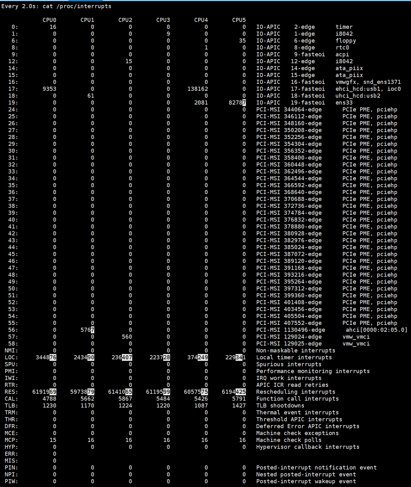

## CPU 上下文切换

### 概述

Linux 是一个多任务操作系统，它支持远大于 CPU 数量的任务同时运行。当然，这些任务实际上并不是真的在同时运行，而是因为系统在很短的时间内，将 CPU 轮流分配给它们，造成多任务同时运行的错觉，而在每个任务运行前，CPU 都需要知道任务从哪里下载，又从哪里开始运行，也就是说，需要系统事先帮它设置好 **CPU寄存器和程序计数器（Program Counter，PC）**

CPU 寄存器，是 CPU 内置的容量小，但速度极快的内存。而程序计数器，则是用来存储 CPU 正在执行的指令位置、或者即将执行的下一条指令位置。它们都是 CPU 在运行任何任务前，必须的依赖环境，即 **CPU 上下文**

**CPU上下文切换**就是先把前一个任务的 CPU 上下文（即 CPU 寄存器和程序计数器）保存起来，然后加载新任务的上下文到这些寄存器和程序计数器，最后再跳转到程序计数器所指的新位置，运行新任务。而这些保存下来的上下文，会存储在系统内核中，并在任务重新调度执行时再次加载进来，这样就能保证任务原来的状态不受影响，让任务看起来还是连续运行

CPU 上下文切换，是保证 Linux 系统正常工作的核心功能之一，一般情况下不需要特别关注，但过多的上下文切换，会把 CPU 时间消耗在寄存器、内核栈以及虚拟内存等数据的保存和恢复上，从而缩短进程真正运行的时间，导致系统的整体性能大幅下降

### CPU 上下文切换场景

#### 进程上下文切换

Linux 按照特权等级，把进程运行空间分为内核空间和用户空间，CPU 特权等级的 `Ring 0` 和 `Ring 3`

- 内核空间（`Ring 0`）具有最高权限，可以直接访问所有资源
- 用户空间（`Ring 3`）只能访问受限资源，不能直接访问内存等硬件设备，必须通过系统调用陷入到内核中，才能访问这些特权资源

即，进程既可以在用户空间运行，也可以在内核空间运行。进程在用户空间运行时，为进程的用户态，而陷入内核空间的时候，为进程的内核态

*典型 x86-64 Linux 进程地址空间组织结构*


地址空间底部是保留给用户程序的，包括代码，数据，堆和栈段。代码段总是从地址 `0x400000` 开始，地址空间顶部保留给内核。这个部分包含内核在代表进程执行指令时使用的代码、数据和栈

从用户态到内核态的转变，需要通过系统调用来完成。（当查看文件内容时，需要多次系统调用来完成：首先调用 `open()` 打开文件，然后调用 `read()` 读取文件内容，并调用 `write()` 将内容写到标准输出，再调用 `close()` 关闭文件）系统调用的过程也会发生 CPU 上下文切换（CPU 寄存器里原来用户态的指令位置，需要先保存起来。接着，为了执行内核态代码，CPU 寄存器需要更新为内核态指令的新位置。最后才是跳转到内核态运行内核任务），系统调用结束后，CPU 寄存器需要恢复原来保存的用户态，然后再切换到用户空间，继续运行进程。即**一次系统调用过程，其实发生了两次 CPU 上下文切换**

系统调用过程中，并不会涉及到虚拟内存等进程用户态资源，也不会切换进程。跟进程上下文切换的不一样：

* 进程上下文切换，是指从一个进程切换到另一个进程运行
* 而系统调用过程中一直是同一个进程在运行

即，**系统调用过程通常称为特权模式切换，而不是上下文切换**，实际上，系统调用过程中，CPU 的上下文切换还是无法避免。进程上下文与系统调用区别：

进程是由内核来管理和调度的，**进程的切换只能发生在内核态**。即，进程的上下文不仅包括了虚拟内存，栈，全局变量等用户空间的资源，还包括了内核堆栈、寄存器等内核空间的状态。因此，进程的上下文切换就比系统调用时多了一步：在保存当前进程的内核状态和 CPU 寄存器之前需要先把该进程的虚拟内存、栈等保存起来；而加载了下一进程的内核态后，还需要刷新进程的虚拟内存和用户栈。保存上下文和恢复上下文的过程并不是免费的，需要内核在 CPU 上运行才能完成，每次上下文切换都需要几十纳秒到数微秒的 CPU 时间。在进程上下文切换次数较多的情况下，很容易导致 CPU 将大量时间耗费在寄存器、内核栈以及虚拟内存等资源的保存和恢复上（这也可能导致平均负载高）

Linux 通过 TLB （Translation Lookaside Buffer）来管理虚拟内存到物理内存的映射关系。当虚拟内存更新后，TLB 也需要刷新，内存的访问也会随之变慢。特别是在多处理器系统上，缓存是被多个处理器共享的，刷新缓存不仅会影响当前处理器的进程，还会影响共享缓存的其他处理器的进程

进程上下文切换时机：进程切换时才需要切换上下文，只有在进程调度的时候，才需要切换上下文。Linux 为每个 CPU 都维护了一个就绪队列，将活跃进程（即正在运行和正在等待 CPU 的进程）按照优先级和等待 CPU 的时间排序，然后选择最需要 CPU 的进程，即优先级最高的和等待 CPU 时间最长的进程来运行。

进程调度时机：

* 进程执行完终止了，它之前使用的 CPU 会释放出来，这个时候再从就绪队列里，拿一个新的进程过来运行。
* 进程时间片用完了（为了保证所有进程都可以得到公平调度，CPU 时间被划分为一段段的时间片，这些时间片再被轮流分配给各个进程。这样，当某个进程的时间片耗尽了，就会被系统挂起，切换到其它正在等待 CPU 的进程运行）
* 进程在系统资源不足（如内存不足）时，要等到资源满足后才可以运行，这个时候进程也会被挂起，并由系统调度其他进程运行
* 当进程通过睡眠函数 `sleep` 这样的方法将自己主动挂起时，也会重新调度
* 当有优先级更高的进程运行时，为了保证高优先级进程的运行，当前进程会被挂起，由高优先级进程来运行
* 发生硬件中断时，CPU 上的进程会被中断挂起，转而执行内核中的中断服务程序

#### 线程上下文切换

线程与进程的最大区别在于，线程是调度的基本单位，而进程则是资源拥有的基本单位。所谓的内核中的任务调度，实际上的调度对象是线程；而进程只是给线程提供了虚拟内存、全局变量等资源。对于线程和进程：

* 当进程只拥有一个线程时，可以认为进程就等于线程
* 当进程拥有多个线程时，这些线程会共享相同的虚拟内存和全局变量等资源。这些资源在上下文切换时是不需要修改的
* 线程也有自己的私有数据（栈，寄存器等），这些在上下文切换时也是需要保存的

线程的上下文切换其实就可以分为两种情况：

* 前后两个线程属于不同进程。此时，因为资源不共享，所以切换过程就跟进程上下文切换是一样
* 前后两个线程属于同一个进程。此时，因为虚拟内存是共享的，所以在切换时，虚拟内存这些资源就保持不动，只需要切换线程的私有数据、寄存器等不共享的数据

同进程内的线程切换，要比多进程间的切换消耗更少的资源

#### 中断上下文切换

**为了快速响应硬件的事件，中断处理会打断进程的正常调度和执行，转而调用中断处理程序，响应设备事件**而在打断进程时，就需要将进程当前的状态保存下来，这样在中断结束后，进程仍然可以从原来的状态恢复运行。

跟进程上下文不同，中断上下文切换并不涉及到进程的用户态。所以，即便中断过程打断了一个正处在用户态的进程，也不需要保存和恢复这个进程的虚拟内存、全局变量等用户态资源。中断上下文，其实只包括内核态中断服务程序执行所必须的状态、包括 CPU 寄存器、内核堆栈、硬件中断参数等。

对用一个 CPU 来说，中断处理比进程拥有更高的优先级，所以中断上下文切换并不会与进程上下文切换同时发生。同样，由于中断会打断正常进程的调度和执行，所以大部分中断处理程序都短小，以便尽可能快的执行结束

### 查看系统指标

可以使用 `vmstat` 这个工具，来查询系统的上下文切换情况

观察系统指标时，除了上下文切换频率飙升，中断次数也会中断，中断只发生在内核态，而 `pidstat` 不能查看任何关于中断的详细信息。要查看中断情况，只能从 `/proc/interrupts` 这个只读文件中读取，`/proc` 实际上是  `Linux` 的一个虚拟文件系统，用于内核空间与用户空间之间的通信。`/proc/interrupts` 就是这种机制的一部分， 提供了一个只读的中断使用情况。

```shell
# 检测中断 -d 高亮显示变化的区域
watch -d cat /proc/interrupts
```

*观察中断变化*



变化速度最快的是**重调度中断** (RES)，这个中断类型表示，唤醒空闲状态的 CPU 来调度新的任务运行。这是多处理器系统（SMP）中，调度器用来分散任务到不同 CPU 的机制，通常也被称为**处理器间中断**（Inter-Processor Interrupts，IPI）

#### 每秒上下文切换次数范围

这个数值取决于系统本身的 CPU 性能。如果系统的上下文切换次数比较稳定，那么从数百到一万以内，都应该算是正常的，但当上下文切换次数超过一万次，或者切换次数出现数量级别的增长时，就很可能已经出现了性能问题。这时还需要根据上下文切换的类型，再做具体分析，如：

* 自愿上下文切换变多了，说明进程都在等待资源，有可能发生了 I/O 等其他问题
* 非自愿上下文切换变多了，说明进程都在强制调度，即争抢 CPU，说明 CPU 的确成了瓶颈
* 中断次数变多了，说明 CPU 被中断处理程序占用，还需要通过查看 `/proc/interrupts` 文件来分析具体的中断类型


### 系统诊断流程

* 先通过 `uptime` 查看系统负载，可以使用 `watch` 监控
* 然后使用 `mpstat` 结合 `pidstat` 来初步判断到底时 CPU 计算量大还是进程争抢过大或者是 I/O 过多
* 接着使用 `vmstat` 分析切换次数，以及切换类型，来进一步判断到底是 I/O 过多还是进程增强
* 最后可以辅助监控 `/proc/interrupts` 系统中断


