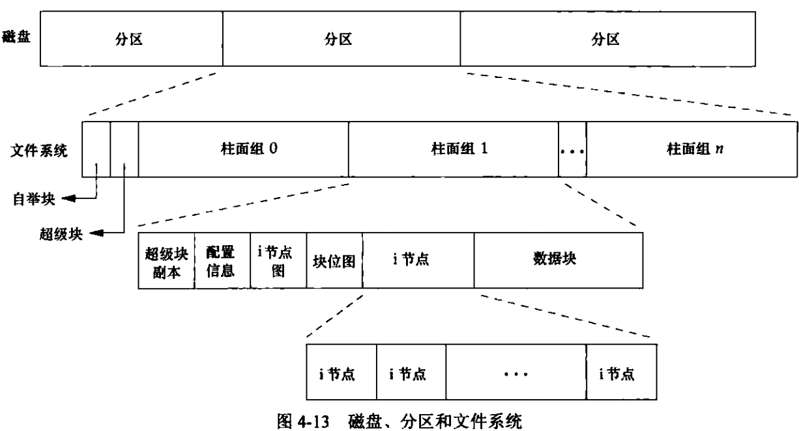
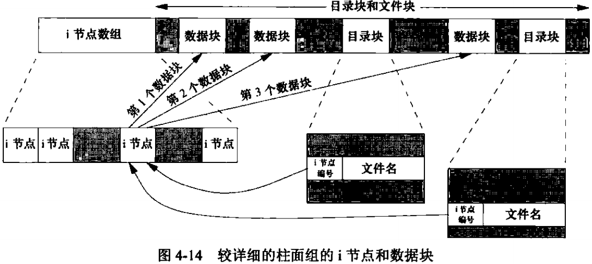

## Linux文件系统

### 磁盘组成与分区

#### 整个磁盘结构

* 圆形的碟片：主要记录数据的地方
* 机械手臂：与在机械手臂上的磁头擦写磁盘数据
* 主轴马达：可以转到磁盘，让机械手臂的磁头在碟片上读写数据

#### 碟片物理组成

* 扇区：Sector，为最小的物理存储单位，且依据磁盘设计的不同，目前主要有 512B 与 4KB 两种格式
* 柱面：Cylinder，将扇区组成一个圆
* 早期的分区主要以柱面为最小分区单位，现在的分区通常使用扇区为最小分区单位
* 磁盘分区表主要有两种格式，一种是限制较多的 MBR 分区表，一种是较新且限制较少的 GPT 分区表
* MBR 分区表中，第一个扇区最重要，里面记录了：主引导记录（master boot record，MBR）及分区表（partition table），其中 MBR 占有 446B，而分区表则占有 64B
* GPT 分区表除了分区数量扩充较多外，支持的磁盘容量也可以超过 2TB

#### 磁盘

磁盘的文件名部分。基本上，所有的物理磁盘的文件名都已经被模拟成 `/dev/sd[a-p]` 的格式，第一块磁盘文件名为 `/dev/sda`，而分区的文件名为 `/dev/sda[1-128]`。除了物理磁盘外，虚拟机的磁盘通常为 `/dev/vd[a-p]` 的格式。若有使用到软件磁盘陈列的化，则有 `/dev/md[0-128]` 的磁盘文件名，使用 LVM 时，文件名则为 `/dev/VGNAME/LVNAME` 等格式。

* `/dev/sd[a-p][1-128]`：为物理磁盘的文件名
* `/dev/vd[a-d][1-128]`：为虚拟磁盘的文件名

### 文件系统

每种操作系统能够使用的文件系统不同：`windows98` 之前使用的文件系统是 `FAT` (FAT16)，`windows2000` 以后，有 NTFS  系统；**Linux传统文件系统是 `ext2`（Linux second Extended file system，ext2fs）**

传统的磁盘与文件系统中，一个分区只能被格式化成一个文件系统。但 LVM 与磁盘阵列（software raid），这些技术可以将一个分区格式化为多个文件系统，也能将多个分区合成一个文件系统。目前在格式化时已经不再说针对硬盘分区来格式化，通常称**一个可被挂载的数据为一个文件系统而不是一个分区**

Linux 的文件系统通常将：**权限（`rwx`）与文件属性（拥有者，用户组，时间参数）放到 `inode` 中，实际数据则放置到数据区块中**，另外还有一个超级区块 `superblock` 会记录整个文件系统的整体信息，包括 `inode` 与数据区块的总量、使用量、剩余量

每个 `inodb` 与区块都有编号，数据区块，`inode`，超级区块

* 超级区块：记录此文件系统的整体信息，包括 `inode` 与数据区块的总量，使用量，剩余量，以及文件系统的格式与相关信息等
* `inode`：记录文件的属性，一个文件占用一个 `inode` ，同时记录此文件的数据所在的区块号码；
* 数据区块：实际记录文件的内容，若文件太大时，会占用多个区块

*磁盘，分区和文件系统*

*详细的柱面组的i节点和数据块*

* 上面两个目录项指向同一个 `i` 节点。每个 `i` 节点中都有一个链接计数，其值是指向该 `i` 节点的目录项数。只有当链接计算较少为 0 时，才可删除该文件（即释放该文件占用的数据块）。在 `stat` 结构中，链接计数包含在 `st_nlink` 成员中，其基本系统数据类型结构时 `nlink_t`。这种链接类型为硬链接
* 另外一种链接类型为符号链接，符号链接文件的实际内容（在数据块中）包含了该符号链接所指向的文件的名字。该 `i` 节点中的文件类型是 `S_IFLNK` 
* `i` 节点包含了文件有关的所有信息：文件类型，文件访问权限位，文件长度和指向文件数据块的指针等。`stat` 结构中的大多数信息都取自 `i` 节点。只有两项重要数据存放在目录项中：文件名和 `i` 节点编号。`i` 节点编号的数据类型是 `ino_t`
* 因为目录项中的 `i` 节点编号指向同一文件系统中的相应的 `i` 节点，一个目录项不能指向另一个文件系统的 `i` 节点。（即 ln 不能跨文件系统）
* 当在不更好文件系统的情况下为一个文件重命名时，该文件的实际内容并未移动，只需构造一个指向现有 `i` 节点的新目录项，并删除老的目录项。链接计算不会改变

