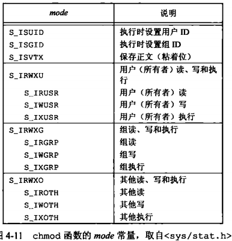
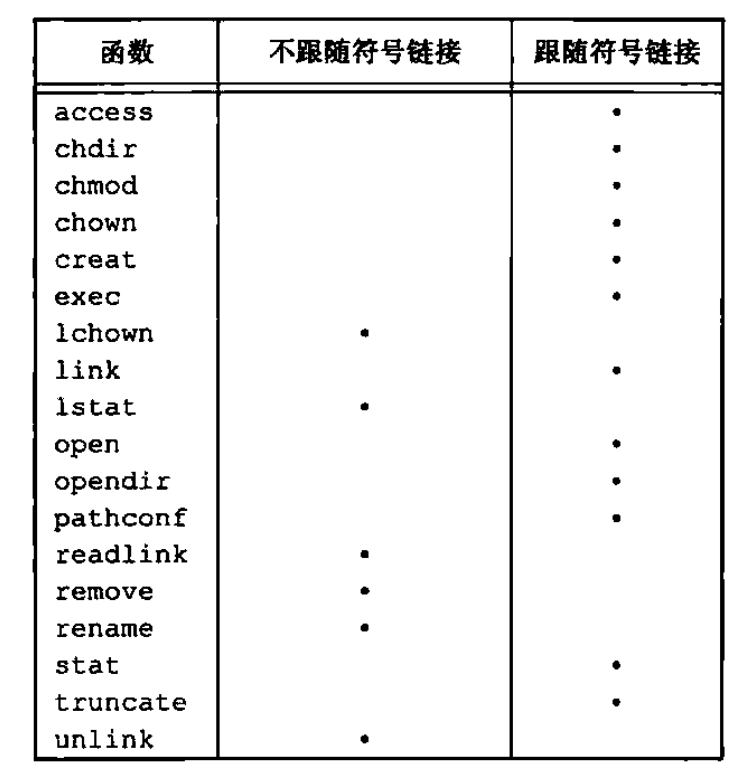

###  文件目录

#### stat、fstat、fstatat、lstat

```c
#include <sys/stat.h>
// 所有 4 个函数的返回值：若成功；返回 0；若出错，返回 -1
/**
 * @param pathname 不为 null，stat 返回与此命名文件有关的信息结构
**/
int stat(const char *restrict pathname, struct *restrict buf);
/**
 * @param fd fstat 函数获得已在描述符 fd 上打开文件的有关信息
**/
int fstat(int fd, struct stat *buf);
/**
 * @param pathname 类似 stat，当命名文件是一个符号链接时，返回该符号链接信息，而非指向文件信息
**/
int lstat(const char *restrict pathname, struct stat *restrict buf);
/**
 * 为一个相对于当前打开目录（由 fd 参数指向）的路径名返回文件统计信息
 * @param fd 相对于当前打开目录（由 fd 参数指向）的路径名，如果值为 AT_FDCWD，并且 pathname 是
 *           相对路径名，fstatat 会计算相对于当前目录的 pathname 参数
 * @param pathname 如果 pathname 是一个绝对路径，fd 参数被忽略
 * @param flag 控制是否跟随一个符号链接，当设置为 AT_SYMLINK_NOFOLLOW 时，不跟随符号链接，返回符号
 *             链接本身的信息，否则，默认返回符号链接指向实际文件信息
int fstatat(int fd,const char *restrict pathname,struct stat *restrict buf, int flag);
```

参数 `buf` 是一个指针，它指向一个我们必须提供的结构。函数来填充由 `buf` 指向的结构，结构的实际意义可能随具体实现有所不同，基本形式是：

```c
struct stat {
    mode_t st_mode;  /* file type & mode (permissions) */
    ino_t  st_ino;		/* i-node number (serial number) */
    dev_t  st_dev;    /* device number (file system) */
    dev_t  st_rdev;   /* device number for special files */ // SUS XSI
    nlink_t  st_rdev; /* number of links */ // st_nlink 硬链接
    uid_t 	st_uid;   /* user ID of owner */
    gid_t  st_gid;    /* group ID of owner */
    off_t   st_size;  /* size in bytes, for regular files */
    struct timespec  st_atime;   /* time of last access */
    struct timespec  st_mtime;   /* time of last modification */
    struct timespec  st_ctime;   /* time of last file status change */
    blksize_t st_blksize;  /* best I/O block size */   // SUS XSI
    blkcnt_t	st_blocks;    /* number of disk blocks allocated */  // SUS XSI
}
// 按照秒和纳秒定义了时间
struct timespec {
    time_t tv_sec;
    long tv_nsec;
}
```

#### 文件类型

`unix` 系统大多数文件是普通文件或目录。文件类型包含：

- **普通文件（regular file）:** 

  最常用的文件类型，这种文件包含了某种形式的数据，这种数据是文本还是二进制数据，对 `unix` 内核而言并无区别。对普通文件内容的解释由处理该文件的应用程序进行

- **目录文件（directory file）:** 

  这种文件包含了其他文件的名字以及指向与这些文件有关信息的指针。对一个目录文件具有读权限的任一进程都可以读该目录的内容，但只有内核可以直接写目录文件

- **块特殊文件（block special file）:** 

  这种类型的文件提供对设备（如磁盘）带缓冲的访问，每次访问以固定长度为单位进行。FreeBSD 不再支持块特殊文件，对设备的所有访问需要通过字符特殊文件进行

- **字符特殊文件（character special file）:** 

  这种类型的文件提供对设备不带缓冲的访问，每次访问长度可变。系统中的所有设备要么是字符特殊文件，要么是块特殊文件

- **FIFO:** 

  这类类型的文件用于进程间通信，有时称为命名管道

- **套接字（socket）:**

  用于进程间的网络通信，也可以用于在一台主机上进程之间的非网络通信

- **符号连接（symbolic link）:** 

  这种类型的文件指向另一个文件。

文件类型信息包含 `stat` 结构的 `st_mode` 成员中。可以使用宏来确定文件类型。这些宏的参数都是 `stat` 结构中的 `st_mode` 成员


POSIX.1 允许实现将进程间通信（IPC）对象（如消息队列和信号量等）说明为文件。以下宏可用来从 `stat` 结构中确定 IPC 对象的类型。它们的参数并非 `st_mode` 而是指向 `stat` 结构的指针


#### 设置用户 ID 和设置组 ID

与一个进程相关联的 ID有６个 或更多


- **实际用户 ID 和实际组 ID:**

  取自口令文件中的登录项，标识我们究竟是谁。通常在一个登录会话期间这些值并不改变，但是超级用户进程有方法改变它们。

- **有效用户ID，有效组ID，附属组ID:** 

  决定了我们的文件访问权限（用于文件访问权限检查）

- **保存的设置用户ID和保存的设置组ID:** 

  在执行一个程序时包含了有效用户ID和有效组ID的副本

通常，有效用户 ID 等于实际用户 ID，有效组 ID 等于实际组 ID。

每个文件有一个所有者和组所有者，所有者由 `stat` 结构中的 `st_uid` 指定，组所有者则由 `st_gid` 指定。

当执行一个程序文件时，进程的有效用户 ID 通常就是实际用户 ID，有效组 ID 通常就是实际组 ID。但是可以在文件模式字（`st_mode`)中设置一个特殊标志，其含义是”当执行文件时，将进程的有效用户 ID 设置为文件所有者的用户 ID (`st_uid`) “，与此相类似，在文件模式中可以设置另一位，它将执行此文件的进程的有效组 ID 设置为文件的组所有者 ID (`st_gid`)，在文件模式字中的这两位被称为 **设置用户ID位** 和 **设置组ID位** 

例如，若文件所有者是超级用户，而且设置了该文件的设置用户 ID 位，那么当该程序文件由一个进程执行时，该进程具有超级用户权限。不管执行此文件的进程的实际用户 ID 是什么，都会是这样。

`stat` 函数，设置用户 ID 位及设置组 ID 位都包含在文件的 `st_mode` 值中。这两位分别用常量 `S_ISUID` 和 `S_ISGID` 测试

```shell
// 将文件用户 ID 改为 root
chown root a.out
// 打开设置用户ID 位
chmod u+s a.out
```

#### 文件访问权限

`st_mode`  值包含了对文件的访问权限位。当提及文件时可以是任何类型的文件。所有文件类型都有访问权限。

每个文件都有 9 个访问权限位


9 个常量可分成 3 组

```c
S_IRWXU = S_IRUSR|S_IWUSR|S_IXUSR
S_IRWXG = S_IRGRP|S_IWGRP|S_IXGRP
S_IRWXO = S_IROTH|S_IWOTH|S_IXOTH
```

*文件权限位对文件和目录的影响*


**用户：** 指的是文件所有者 （owner）。`chmod` 命令用于修改这 9 个权限位。

读写执行的访问权限以各种方式由不同的函数使用。使用方式如下：

* 用名字打开任一类型的文件时，对该名字中包含的每一个目录，包括它可能隐含的当前工作目录都应具有执行权限。（目录执行权限位一般称为搜索位）。

  对于目录的读权限和执行权限的意义是不相同的。读权限允许读目录，获得在该目录中所有文件名的列表。当一个目录是我们要访问文件的路径名的一个组成部分时，对该目录的执行权限使我们可通过该目录（搜索该目录，寻找一个特定的文件名）

* 对于一个文件的读权限决定了是否能够打开现有文件进行读操作。这与 `open` 函数的 `O_RDONLY` 和 `O_RDWR` 标志相关

* 对于一个文件的写权限决定了是否能够打开现有文件进行写操作。这与 `open` 函数的 `O_WRONLY` 和 `O_RDWR` 标志相关

* 为了在 `open` 函数中对一个文件指定 `O_TRUNC` 标志，必须对该文件具有写权限

* 为了在一个目录中创建一个新文件，必须对该目录具有写和执行权限

* 为了删除一个现有文件，必须对包含该文件的目录具有写权限和执行权限。对该文件本身不需要读，写执行权限

* 如果用 7个 `exec` 函数中的任何一个执行某个文件，都必须对该文件具有执行权限。且该文件必须是一个普通文件

进程每次打开，创建和删除一个文件时，内核就进行文件访问权限测试，而这种测试可能涉及文件的所有者（`st_uid` 和 `st_gid`），进程的有效 ID （有效用户 ID 和有效组 ID）以及进程的附属组 ID （若支持的话）。两个所有者 ID 是文件的性质，而两个有效 ID 和附属组 ID 则是进程的性质。内核进行的测试具体如下：

1. 若进程的有效用户 ID 是 0（超级用户），则允许访问。这给予了超级用户对整个文件系统进行处理的最充分的自由
2. 若进程的有效用户 ID 等于文件的所有者 ID (即进程拥有此文件)，那么如果所有者适当的访问权限位被设置，则允许访问；否则拒绝访问。适当的访问权限位指的是：若进程为读而打开该文件，则用户读位应为 1；若进程为写而打开该文件，则用户写位应为 1；若进程将执行该文件，则用户执行位应为 1。
3. 若进程的有效组 ID 或进程的附属组 ID 之一等于文件的组 ID，那么如果组适当的访问权限位被设置，则允许访问；否则拒绝访问
4. 若其他用户适当的访问权限位被设置，则允许访问；否则拒绝访问；

按顺序执行这 4 步。注意。如果进程拥有此文件（第 2 步），则按用户访问权限批准或拒绝该进程对文件的访问--不查看组访问权限。类似的，若进程并不拥有该文件。但进程属于某个适当的组，则按组访问权限批准或拒绝该进程对文件的访问--不查看其他用户的访问权限。

#### 新文件和目录的所有权

用 `open` 或 `create` 创建新文件时，新文件的用户 ID 设置为进程的有效用户 ID。关于组 ID，POSIX.1 允许实现选择下列之一作为新文件的组 ID：

* 新文件的组 ID 可以是进程的有效组 ID
* 新文件的组 ID 可以是它所在目录的组 ID

使用 POSIX.1 所允许的第二个选项（继承目录的组 ID）使得在某个目录下创建的文件和目录都具有该目录的组 ID，文件和目录的组所有权从该点向下传递

#### access 和 faccessat

当用 `open` 函数打开一个文件时，内核以进程的有效用户 ID 和有效组 ID 为基础执行其访问权限测试。

`access` 和 `faccessat` 函数是按实际用户 ID 和实际组 ID 进行访问权限测试的，该测试同由进程有效用户 ID 测试步骤一样。

```c
#include <unistd.h>
// 两个函数的返回值：若成功，返回 0；若出错，返回 -1
int access(const char *pathname, int mode);
int faccessat(int fd, const char *pathname, int mode, int flag);
```

`faccessat` 函数与 `access` 函数在下面两种情况下是相同的：一种是 `pathname` 参数为绝对路径，另一种是`fd` 参数取值为 `AT_FDCWD` 而 `pathname` 参数为相对路径。否则，`faccessat` 计算相对于打开目录（由`fd` 参数指向）的 `pathname`

`flag` 参数可以用于改变 `faccessat` 的行为，如果 `flag` 设置为 `AT_EACCESS`，访问检查用的是调用进程的有效用户 ID 和有效组 ID，而不是实际用户 ID 和实际组 ID。

#### 函数 umask

`umask` 函数为进程设置文件模式创建屏蔽字，并返回之前的值，没有出错返回值

```c
#include <sys/stat.h>
// 返回值：之前的文件模式创建屏蔽字
mode_t umask(mode_t cmask);
```

参数 `cmask` 是 9 个文件权限位（`S_IRUSR`, `S_IWUSR` 等）中的若干个按位或构成的。

在进程创建一个新文件或新目录时，就一定会使用文件模式创建屏蔽字。`open` 和 `creat` 函数。这两个函数都有一个参数 `mode` ，它指定了新文件的访问权限位

用户可以设置 umask 值以控制创建文件的默认权限，该值表示成八进制数，一位代表一种要屏蔽的权限：

*umask 文件访问权限位*


SUS 要求 shell 应该支持符号形式的 umask 命令，与八进制格式不同，符号格式指定许可的权限（即在文件创建屏蔽字中为 0 的位）而非拒绝的权限（即在文件创建屏蔽字中为 1 的位）

```shell
// 大于当前文件模式创建屏蔽字
umask
// 打印符号格式
umask -S
// 更改文件模式创建屏蔽字,002阻止其他用户写入你的文件，022 阻止同组和其他成员写入你的文件，027 阻止同组成员写你的文件以及其他用户读、写或执行你的文件
umake 027
```

#### chmod、fchmod、fchmodat

`chmod`，`fchmod`，`fchmodat` 这 3 个函数使我们可以更改现有文件的访问权限。

```c
#include <sys/stat.h>
// 返回值：若成功，返回 0；若出错，返回 -1
/**
 * 在指定的文件上进行操作
**/
int chmod(const char *pathname, mode_t mode);
/**
 * 对已打开的文件进行操作
**/
int fchmod(int fd, mode_t mode);
/**
 * 计算相对于打开目录（fd 参数指向）的 pathname
 * @params pathname 为绝对路径时与 chmod 函数相同
 * @params fd 为 AT_FDCWD 且 pathname 为相对路径 与 chmod 函数相同
 * @params flag 用于改变 fchmodat 的行为，当设置了 AT_SYMLINK_NOFOLLOW 标志时，不跟随符号链接
**/
int fchmodat(int fd, const char *pathname, mode_t mode, int flag);
```

为了改变一个文件的权限位，进程的有效用户 ID 必须等于文件的所有者 ID，或者该进程必须具有超级用户权限。

参数 `mode` 是下列常量的按位或



#### 粘着位

SUS 允许对目录设置粘着位，如果对一个目录设置了粘着位，只有对该目录具有写权限的用户并且满足下列条件之一，才能删除或重命名该目录下的文件：

* 拥有此文件
* 拥有此目录
* 是超级用户

#### chown、fchown、fchownat、lchown

以下几个 chown 函数用于更改文件的用户 ID 和组 ID，如果 `owner` 或 `group` 中的任意一个是 -1，则对应的 ID不变。

```c
#include <unistd.h>
// 4 个函数的返回值：若成功，返回 0：若出错，返回 -1
int chown(const char *pathname, uid_t owner, gid_t group);
int fchown(int fd, uid_t owner, gid_t group);
int fchownat(int fd, const char *pathname, uid_t owner, git_t group, int flag);
int lchown(const char *pathname, uid_t owner, gid_t group);
```

除了所引用的文件是符号链接以外，这 4 个函数的操作类似。在符号链接情况下，`lchown` 和 `fchownat` （设置了 `AT_SYMLINK_NOFOLLOW` 标志）更改符号链接本身的所有值，而不是该符号链接所指向的文件的所有值

`fchown` 函数改变 `fd` 参数指向的打开文件的所有者，既然它在一个已打开的文件上操作，就不能用于改变符号链接的所有者。

`fchownat` 函数与 `chown` 或者 `lchown` 函数在下面两种情况下是相同的：一种是 `pathname` 参数为绝对路径，另一种是 `fd` 参数取值为 `AT_FDCWD` 而 `pathname` 参数为相对路径。在这两种情况下，如果 `flag` 参数中设置了 `AT_SYMLINK_NOFOLLOW` 标志，`fchownat` 和 `lchown` 行为相同，如果 `flag` 参数中清除了 `AT_SYMLINK_NOFOLLOW` 标志，则 `fchownat` 与 `chown` 行为相同。如果 `fd` 参数设置为打开目录的文件描述符，并且`pathmane` 参数是一个相对路径名，`fchownat` 函数计算相对于打开目录的 `pathname`

#### 文件长度

* `stat` 结构成员 `st_size` 表示以字节为单位的文件的长度。此字段只对普通文件，目录文件和符号链接有意义。

* 对于普通文件，其文件长度可以是 0，在开始读这种文件时，将得到文件结束指示（EOF）。对于目录，文件长度通常是一个数的整倍数。

* 对于符号链接，文件长度是在文件名中的实际字节数。（因为符号链接文件长度总是由 `st_size` 指示，所以它并不包含通常 C 语言用作名字结尾的 null 字节）
* 大多数现代的 UNIX 系统提供字段 `st_blksize` 和 `st_blocks` 其中，第一个是对文件 I/O 较合适的块长度，第二个是所分配的实际 512 字节块块数。当用 `st_blksize` 用于读操作时，读一个文件所需时间量最少。为了提供效率，标准 I/O 库也试图一个读，写 `st_blksize` 字节

#### 文件中的空洞

空洞是由所设置的偏移量超过文件尾端，并写入了某些数据后造成的。空洞全部填充为 0，空洞不分配磁盘空间

#### 文件截断

在文件尾端处截去一些数据以缩短文件。将一个文件的长度截断为 0 是一个特例，在打开文件时使用 `O_TRUNC` 标志可以做到这一点。为了截断文件可以调用函数 `truncate` 和 `ftruncate`

```c
#include <unistd.h>
// 两个函数的返回值：若成功，返回 0；若出错，返回 -1
int truncate(const char *pathname, off_t length);
int ftruncate(int fd, off_t length);
```

这两个函数将一个现有文件长度截断为 `length` 如果该文件以前的长度大于 `length`，则超过 `length` 以外的数据就不再能访问。如果以前的长度小于 `length` ，文件长度将增加，在以前的文件尾端和新的文件尾端之间的数据将读作 0 （也就是可能在文件中创建了一个空洞）

#### 文件系统

目前，正在使用的 UNIX 文件系统有多种实现：传统的基于 BSD 的 UNIX 文件系统（称为 UFS），读、写 DOS 格式软盘的文件系统（称 PCFS），以及读 CD 的文件系统（HSFS）。

可以把一个磁盘分成一个或多个分区。每个分区可以包含一个文件系统。i 节点是固定长度的记录项，它包含有关文件的大部分信息

*磁盘，分区和文件系统*


*柱面组的 i 节点和数据块*


* 每个 i 节点中都有一个链接计数，其值是指向该 i 节点的目录项数。只有当链接计数减少至 0 时，才可删除该文件（释放该文件占用的数据块）。在 `stat` 结构中，链接计数包含在 `st_nlink` 成员中，其基本系统数据类型是 `nlink_t` 。这种链接类型称为**硬链接**
* **符号链接**，符号链接文件的实际内容（在数据块中）包含了该符号链接所指向的文件的名字。该 i 节点中的文件类型是 `S_IFLNK` 
* i 节点包含了文件有关的所有信息：文件类型、文件访问权限位、文件长度和指向文件数据块的指针等。`stat` 结构中的大多数信息都取自 i 节点。只有两项重要数据存放在目录项中：文件名和 i 节点编号。i 节点编号的数据类型是 `ino_t`
* 目录项中的 i 节点编号指向同一文件系统中的相应 i 节点，一个目录项不能指向另一个文件系统的 i 节点。
* 当在不更换文件系统的情况下为一个文件重命名时，该文件的实际内容并未移动，只需构造一个指向现有 i 节点的新目录项，并删除老的目录项。链接计算不会改变

#### link 、linkat、unlink、unlinkat、remove

任何一个文件可以有多个目录项指向其 i 节点。创建一个指向现有文件的链接的方法是使用 `link` 函数或 `linkat` 函数

```c
#include <unistd.h>
// 两个函数的返回值：若成功，返回 0；若出错，返回 -1
int link(const char *existingpath, const char *newpath);
int linkat(int efd, const char *existingpath, int nfd, const *newpath, int flag);
```

这两个函数创建一个新目录项 `newpath` ,它引用现有文件 `existingpath` ，如果 `newpath` 已经存在，则返回出错。只创建 `newpath` 中的最后一个分量，路径中的其他部分应当已经存在。

对于 `linkat` 函数，现有文件是通过 `efd` 和 `existingpath` 参数指定的，新的路径名是通过 `nfd` 和 `newpath` 参数指定的。默认情况下，如果两个路径名中的任一个是相对路径，那么它需要通过相对于对应的文件描述符进行计算。如果两个文件描述符中的任一个设置为 `AT_FDCWD` ，那么相应的路径名（如果它是相对路径）就通过相对于当前目录进行计算。如果任一路径名是绝对路径，相应的文件描述符参数就会被忽略。

当现有文件是符号链接时，由 `flag` 参数来控制 `linkat` 函数是创建指向现有符号链接的链接还是创建指向现有符号链接所指向的文件的链接。如果在 `flag` 参数中设置了 `AT_SYMLINK_FOLLOW` 标志，就创建指向符号链接目标的链接。如果这个标志被清除了，则创建一个指向符号链接本身的链接。创建新目录和增加链接计数应当是一个原子操作。

删除一个现有的目录项

```c
#include <unistd.h>
// 两个函数的返回值：若成功，返回 0；若出错，返回 -1
int unlink(const char *pathname);
int unlinkat(int fd, const char *pathname, int flag);
```

这两个函数删除目录项，并将由 `pathname` 所引用文件的链接计数减 1，如果对该文件还有其他链接，则仍可通过其他链接访问该文件的数据。如果出错，则不对该文件做任何更改。

为了解除对文件的链接，必须对包含该目录项的目录具有写和执行权限。如果对该目录设置了粘着位，则对该目录必须具有写权限，并且具有下面三个条件之一：1.拥有该文件；2，拥有该目录；3，具有超级用户权限。

只有当链接计数达到 0 时，该文件的内容才可以被删除。另一个条件也会阻止删除文件的内容--只要有进程打开了该文件，其内容也不能删除。关闭一个文件时，内核首先检查打开该文件的进程个数；如果这个计数达到 0，内核再去检查其链接计数；如果计数也是 0，那么就删除该文件的内容。

如果 `pathname ` 参数是相对路径名，那么 `unlinkat` 函数计算相对于由 `fd` 文件描述符参数代表的目录的路径名。如果 `fd` 参数设置为 `AT_FDCWD`，那么通过相对于调用进程的当前工作目录来计算路径名。如果 `pathname` 参数是绝对路径名，那么 `fd` 参数被忽略

`flag` 参数给出了一种方法，使调用进程可以改变 `unlinkat` 函数的默认行为。当 `AT_REMOVEDIR` 标志被设置时，`unlinkat` 函数可以类似于 `rmdir` 一样删除目录。如果这个标志被清除，`unlinkat` 与 `unlink` 执行同样的操作。

进程用 `open` 或 `creat` 创建一个文件，然后立即调用 `unlink` ，因为该文件仍旧是打开的，所以不会将其内容删除。只有当进程关闭该文件或终止时（在这种情况下，内核关闭该进程所打开的全部文件），该文件的内容才被删除。

如果 `pathname` 是符号链接，那么 `unlink` 删除该符号链接，而不是删除由该链接所引用的文件。给出符号链接名的情况下，没有一个函数能删除由该链接所引用的文件

```c
#include <stdio.h>
// 返回值：若成功，返回 0；若出错，返回 -1
int remove(const char *pathname);
```

对于文件，`remove` 的功能与 `unlink` 相同，对于目录，`remove` 的功能与 `rmdir` 相同

#### 重命名文件或目录

文件和目录可以用 `rename` 函数或者 `renameat` 函数进行重命名

```c
#include <stdio.h>
// 两个函数的返回值：若成功，返回 0；若出错，返回 -1
int rename(const char *oldname, const char *newname);
int renameat(int oldfd, const char *oldname, int newfd, const char *newname);
```

根据 `oldname` 是指文件、目录还是符合链接，有几种情况

1. 如果 `oldname` 指的是一个文件而不是目录，那么为该文件或符合链接重命名。在这种情况下，如果 `newname` 已存在，则它不能引用一个目录。如果 `newname` 已存在，而且不是一个目录，则先将该目录项删除然后将 `oldname` 重命名为 `newname`。对包含 `oldname` 的目录以及包含 `newname` 的目录，调用进程必须具有写权限，因为将更改这两个目录
2. 如果 `oldname` 指的是一个目录，那么为该目录重命名。如果 `newname` 已存在，则它必须引用一个目录，而且该目录应当是空目录。如果 `newname` 存在（而且是一个空目录），则先将其删除，然后将 `oldname` 重命名为`newname`。另外当为一个目录重命名时，`newname` 不能包含 `oldname` 作为其路径前缀。（因为旧名字是新名字的路径前缀，因而不能将其删除。
3. 如果 `oldname` 或 `newname` 引用符号链接，则处理的是符号链接本身，而不是它所引用的文件
4. 不能对 `.` 和 `..` 重命名。`.` 和 `..` 不能出现在 `oldname`和 `newname` 的最后部分。
5. 如果 `oldname` 和 `newname` 引用同一文件，则函数不做任何更改而成功返回

如若 `newname` 已经存在，则调用进程对它需要有写权限。调用进程将删除 `oldname` 目录项，并可能要创建 `newname` 目录项，所以它需要对包含 `oldname` 及包含 `newname` 的目录具有写和执行权限。

除了当 `oldname` 或 `newname` 指向相对路径名时，其他情况下 `renameat` 函数与 `rename` 函数功能相同。如果 `oldname` 参数指定了相对路径，就相对于 `oldfd` 引用的目录来计算 `oldname`， 如果 `newname` 指定了相对路径，就相对于 `newfd`  引用的目录来计算 `newname`。`oldfd` 或 `newfd` 参数（或两者）都能设置成 `AT_FDCWD`，此时相对于当前目录来计算相应的路径名。

#### 符号链接

符号链接是对一个文件的间接指针（硬链接直接指向文件的 i 节点），引入符号链接的原因是为了避开硬链接的一些限制：

* 硬链接通常要求链接和文件位于同一文件系统中
* 只有超级用户才能创建指向目录的硬链接（在底层文件系统支持的情况下）

对符号链接以及它指向何种对象并无任何文件系统限制，任何用户都可以创建指向目录的符号链接。符号链接一般用于将一个文件或整个目录结构移到系统中另一个位置

当使用以名字引用文件的函数时，应当了解该函数是否处理符号链接（即该函数是否跟随符号链接到达它所链接的文件）如果该函数具有符号链接的功能，则其路径名参数引用由符号链接指向的文件。否则，一个路径名参数引用链接本身，而不是由该链接指向的文件。

*各函数对符号链接的支持*



同时用 `O_CREAT` 和 `O_EXCL` 两者调用 `open` 函数。在此情况下，若路径名引用符号链接，`open` 将出错返回，`errno` 设置为 `EEXIST`。这种处理方式的意图是堵塞一个安全性漏洞，以防止具有特权的进程被诱骗写错误的文件。

#### 创建和读取符号链接

使用 `symlink` 或 `symlinkat` 函数创建一个符号链接

```c
#include <unistd.h>
// 两个函数的返回值：若成功，返回 0；若出错，返回 -1
int symlink(const char *actualpath, const char *sympath);
int symlinkat(const char *actualpath, int fd, const char *sympath);
```

函数创建了一个指向 `actualpath` 的新目录项 `sympath` 。在创建此符号链接时，并不要求 `actualpath` 已经存在，并且 `actualpath` 和 `sympath` 并不需要位于同一文件系统中

`symlinkat` 函数与 `symlink` 函数类似，但 `sympath` 参数根据相对于打开文件描述符引用的目录（由 `fd` 参数指定）进行计算。如果 `sympath` 参数指定的是绝对路径或 `fd` 参数设置了 `AT_FDCWD` 值，那么 `symlinkat` 就等同于 `symlink` 函数

因为 `open` 函数跟随符号链接，所以需要有一种方法打开链接本身，并读该链接中的名字。`readlink` 和 `readlinkat` 函数提供了这种功能

```c
#include <unistd.h>
// 两个函数的返回值：若成功，返回读取的字节数；若出错，返回 -1
ssize_t readlink(const char *restrict pathname, char *restrict buf, size_t bufsize);
ssize_t readlink(int fd, const char* restrict pathname, char *restrict buf, size_t bufsize);
```

两个函数组合了 `open` ，`read` 和 `close` 的所有操作。如果函数成功指向，则返回读入 `buf` 的字节数。在 `buf` 中返回的符号链接的内容不以 null 字节终止。

当 `pathname` 参数指定的是绝对路径名或者 `fd` 参数的值为 `AT_FDCWD`， `readlinkat` 函数的行为与 `readlink` 相同。但是，如果 `fd` 参数是一个打开目录的有效文件描述符并且 `pathname` 参数是相对路径名，则 `readlinkat` 计算相对于由 `fd` 代表的打开目录的路径名

#### 文件的时间

每个文件属性所保存的实际精度依赖于文件系统的实现。对于把时间戳记录在秒级的文件系统来说，纳秒这个字段就会被填充为 0。对于时间戳的记录精度高于秒级的文件系统来说，不足秒的值被转换成纳秒并记录在纳秒这个字段中

*每个文件维护 3 个时间字段*


修改时间（st_mtim）和状态更改时间（st_ctim）区别是：修改时间 `st_mtim` 是文件内容最后一次被修改的时间；状态更改时间是该文件 i 节点最后一次被修改的时间。系统并不维护对一个 i 节点的最后一次访问时间，所以 `access` 和 `stat` 函数并不更改这 3 个时间中的任一个。

ls 命令按这 3 个时间值中的一个排序进行显示，默认或 `-l`、`-t` 选项调用时，是按文件的修改时间的先后排序显示。`-u` 选项使 ls 命令按访问时间排序，`-c` 选项则使其按状态更改时间排序

#### futimens、utimensat、times

一个文件的访问和修改时间可以用以下几个函数修改。`futimens` 和 `utimensat` 函数可以指定纳秒级精度的时间戳。用到的数据结构是与 `stat` 函数族相同的 `timespec` 结构

```c
#include <sys/stat.h>
// 两个函数返回值：若成功，返回 0；若出错，返回 -1，都包含在 POSIX.1
int futimens(int fd, const struct timespec times[2]); 
int utimensat(int fd, const char *path, const struct timespec times[2], int flag);
```

这两个函数的 `times` 数组参数的第一个元素包含访问时间，第二元素包含修改时间。这两个时间是日历时间，这是标准时间以来所经过的秒数

时间戳可以按以下 4 种方式之一进行指定

1. 如果 `times` 参数是一个空指针，则访问时间和修改时间两者都设置为当前时间

2. 如果 `times` 参数是指向两个 `timespec` 结构的数组，任一数组元素的 `tv_nsec` 字段的值为 `UTIME_NOW` ，相应的时间戳就设置为当前时间，忽略相应的 `tv_sec` 字段

3. 如果`times` 参数指向两个 `timespec` 结构的数组，任一数组元素的 `tv_nsec` 字段的值为 `UTIME_OMIT` ，相应的时间戳保持不变，忽略相应的 `tv_sec` 字段

4. 如果 `times` 参数指向两个 `timespec` 结构的数组，且 `tv_nsec` 字段的值既不是 `UTIME_NOW` 也不是 `UTIME_OMIT`，在这种情况下，相应的时间戳设置为相应的 `tv_sec` 和 `tv_nsec` 字段的值

执行这些函数所要求的优先权取决于 `times` 参数的值

* 如果 `times` 是一个空指针，或者任一 `tv_nsec` 字段设为 `UTIME_NOW`，则进程的有效用户 ID 必须等于该文件的所有者 ID；进程对该文件必须具有写权限，或者进程是一个超级用户进程。

* 如果 `times` 是非空指针，并且任一 `tv_nsec` 字段的值既不是 `UTIME_NOW` 也不是 `UTIME_OMIT` ，则进程的有效用户 ID 必须等于该文件的所有者 ID，或者进程必须是一个超级用户进程。对文件只具有写权限是不够的。

* 如果 `times` 是非空指针，并且两个 `tv_nsec` 字段的值都为 `UTIME_OMIT`, 就不执行任何的权限检查。

`futimens` 函数需要打开文件来更改它的时间，`utimensat` 函数提供了一种使用文件名更改文件时间的方法。`pathname` 参数是相对于 `fd` 参数进行计算的，`fd` 要么是打开目录的文件描述符，要么设置为特殊值 `AT_FDCWD` （强制通过相对于调用进程的当前目录计算 `pathname`)。如果`pathname` 指定了绝对路径，那么 `fd` 参数被忽略

`utimensat` 的 `flag` 参数可以进一步修改默认行为。如果设置了 `AT_SYMLINK_NOFOLLOW` 标志，则符号链接本身的时间就会被修改（如果路径名指向符号链接）。默认的行为是跟随符号链接，并把文件的时间改成符号链接的时间

```c
#include <sys/time.h>
// 返回值，成功，返回 0；出错返回 -1，SUS 的 XSI 扩展中
int utimes(const char *pathname, const struct timeval times[2]);
struct timeval {
    time_t tv_sec;  /* seconds */
    long tv_usec; 	/* microseconds */
}
```

`utimes` 函数对路径名进行操作。`times` 参数是指向包含两个时间戳（访问时间和修改时间）元素的数组的指针，两个时间戳是用秒和微秒表示的

不能对状态更改时间 `st_ctim` (i 节点最近被修改的时间) 指定一个值，因为调用 `utimes` 函数时，此字段会被自动更新。

#### mkdir、mkdirat、rmdir

用 `mkdir` 和 `mkdirat` 函数创建目录，用 `rmdir` 函数删除目录

```c
#include <sys/stat.h>
// 两个函数返回值：若成功，返回 0；若出错，返回 -1
int mkdir(const char *pathname, mode_t mode);
int mkdirat(int fd, const char *pathname, mode_t mode);
```

这两个函数创建一个新的空目录。其中 `.` 和 `..` 目录项是自动创建的。所指定的文件访问权限 `mode` 由进程的文件模式创建屏蔽字修改（对目录通常只少要设置一个执行权限位）

`mkdirat` 函数与 `mkdir` 函数类似。当 `fd` 参数具有特殊值 `AT_FDCWD` 或者 `pathname` 参数指定了绝对路径名时，`mkdirat` 与 `mkdir` 完全一样。否则，`fd` 参数是一个打开目录，相对路径名根据此打开目录进行计算

用 `rmdir` 函数可以删除一个空目录。空目录是只包含 `.` 和 `..` 这两项的目录

```c
#include <unistd.h>
// 返回值：若成功，返回 0；若出错，返回 -1
int rmdir(const char *pathname);
```

如果调用此函数使目录的链接计算成为 0，并且也没有其他进程打开此目录，则释放由此目录占用的空间。如果在链接计算达到 0 时，有一个或多个进程打开此目录，则在此函数返回前删除最后一个链接及 `.` 和 `..` 项。另外，在此目录中不能再创建新文件。但是在最后一个进程关闭它之前并不释放此目录。（即使另一些进程打开该目录，它们在此目录下也不执行其他操作。为了使 `rmdir` 成功执行，该目录必须是空的）

#### 读目录

对某个目录具有访问权限的任一用户都可以读该目录，但是，为了防止文件系统产生混乱，只有内核才能写目录。

```c
#include <dirent.h>
// 两个函数返回值，成功返回指针，出错，返回 null
DIR *opendir(const char *pathname);
DIR *fdopendir(int fd);
// 返回值：成功，返回指针；若在目录尾或出错，返回 null
struct dirent *readdir(DIR *dp);
void rewinddir(DIR *dp);
// 返回值：若成功，返回 0；若出错，返回 -1
int closedir(DIR *dp);
// 返回值：与 dp 关联的目录中的当前位置
long telldir(DIR *dp);
void seekdir(DIR *dp, long loc);
```

定义在头文件`<dirent.h>` 中的 `dirent` 结构与实现有关。实现对此结构所做的定义只少包含下列两个成员

```c
ino_t d_ino; 			/* i-node number */
char d_name[];          /* null-terminated filename */
```

注意，`d_name` 项的大小并没有指定，但是必须保证它能包含只少 `NAME_MAX` 个字节（不包含终止 null 字节）。因为文件名是以 `null` 字节结束的，所以在头文件中如何定义数组 `d_name` 并无多大关系，数组大小并不表示文件名的长度

DIR 结构是一个内部结构，上述函数用这个内部结构保存当前正在被读的目录的有关信息。

由 `opendir` 和 `fdopendir` 返回的指向 `DIR` 结构的指针由另外 5 个函数使用。`opendir` 执行初始化操作，使第一个 `readdir` 返回目录中的第一目录项。`DIR` 结构由 `fdopendir` 创建时，`readdir` 返回的第一项取决于传给 `fdopendir` 函数的文件描述符相关联的文件偏移量。（目录中各目录项的顺序与实现有关，它们通常并不按字母顺序排列）

#### chdir、fchdir、getcwd

每个进程都有一个当前工作目录，此目录是搜索所有相对路径名的起点（不以斜线开始的路径名为相对路径名）当用户登录到 `unix` 系统时，其当前工作目录通常是口令文件 `/etc/passwd` 中该用户登录项的第 6 个字段—用户的起始目录（home directorymy）。当前工作目录是进程的一个属性，起始目录则是登录名的一个属性。

进程调用 `chdir` 或 `fchdir` 函数可以更改当前工作目录

```c
#include <unistd.h>
// 两个函数的返回值：若成功，返回 0；若出错，返回 -1
int chdir(const char *pathname);
int fchdir(int fd);
```

在这两个函数中，分别用 `pathname` 或打开文件描述符来指定新的当前工作目录。因为当前工作目录是进程的一个属性，所以它只影响调用 `chdir` 的进程本身，而不影响其他进程

`shell` 执行程序时，每个程序运行在独立的进程中，`shell` 的当前工作目录并不会随着程序调用 `chdir` 而改变。为了改变 `shell` 进程自己的工作目录，`shell` 应当直接调用 `chdir` 函数，因此 `cd` 命令内建在 `shell` 

内核为每个进程只保存指向该目录 `v` 节点的指针等目录本身的信息，并不保存该目录的完整路径名。(Linux 内核可以确定完整路径名，完整路径名的各个组成部分分布在 mount 和 dcache 表中，然后进行重新组装)

获取当前工作目录完整的绝对路径名

```c
#include <unistd.h>
// 返回值：若成功，返回 buf;若出错，返回 null
char *getcwd(char *buf, size_t size);
```

必须向此函数传递两个参数，一个是缓冲区地址 `buf` ，另一个是缓冲区的长度 `size` （以字节为单位）。该缓冲区必须有足够的长度以容纳绝对路径名再加一个终止 `null` 字节，否则返回出错。

`chdir` 跟随符号链接。当一个应用程序需要在文件系统中返回到它工作的出发点时，`getcwd` 函数是有用的。在更换工作目录之前，可以调用 `getcwd` 函数先将其保存起来。在完成了处理后，就可将所保存的原工作目录路径名作为调用参数传说给`chdir` ，这样就返回到了文件系统中的出发点。

`fchdir` 函数向我们提供了一种完成此任务的便捷方法。在更换到文件系统中的不同位置前，无需调用 `getcwd` 函数，而是使用 `open` 打开当前工作目录，然后保存其返回的文件描述符。当希望回到原工作目录时，只要简单地将该文件描述符传送给 `fchdir`

#### 设备特殊文件

`st_dev` 和 `st_rdev` 两个字段经常引起混淆，有关规则：

* 每个文件系统所在的存储设备都由其主、次设备号表示。设备号所用的数据类型是基本系统数据类型 `dev_t`。主设备号标识设备驱动程序，有时编码为与其通信的外设板；次设备号标识特定的子设备。在同一磁盘驱动器上的各文件系统通常具有相同的主设备号，但是次设备号不同
* 通常可以使用两个宏：`major` 和 `minor` 来访问主、次设备号，大多数实现都定义了这两个宏。
* 系统中与每个文件名关联的 `st_dev` 值是文件系统的设备号，该文件系统包含了这一文件名以及与其对应的 i 节点
* 只有字符特殊文件和块特殊文件才有 `st_rdev` 值，此值包含实际设备的设备号

