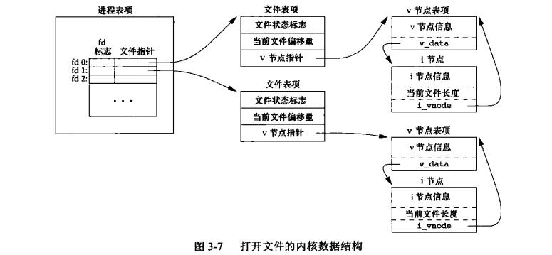
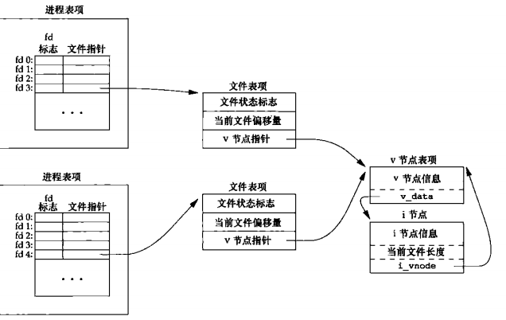
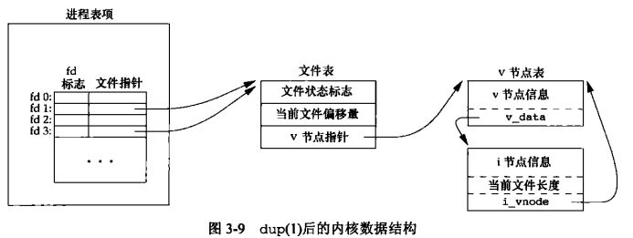

### 文件 I/O

UNIX 系统中大多数文件 I/O 只需要用到：`open`、`read`、`write`、`lseek`、`close`。不带缓冲的 I/O 指的是每个 read、write 都调用内核中的一个系统调用。这些不带缓冲的 I/O 函数不是 ISO C 的组成部分，但是 POSIX.1 和 SUS 组成部分。

#### 文件描述符

对于内核而言，所有打开的文件都通过文件描述符引用。文件描述符是一个非负整数。当打开一个现有文件或创建一个新文件时，内核向进程返回一个文件描述符。当读、写一个文件时，使用 open 或 create 返回的文件描述符标识该文件，将其作为参数传送给 read 或 write

shell 把文件描述符 0 与进程的标准输入关联，1 与标准输出关联，2 与标准错误关联。在符合 POSIX.1 标准的应用程序中，幻数 0，1，2 虽然已被标准化，但应当把它们替换成符号常量：`STDIN_FILENO`、`STDOUT_FILENO`、`STDERR_FILENO` 以提高可读性。这些常量在头文件 `<unistd.h>` 中定义

文件描述符的变化范围时 `0 ~ OPEN_MAX -1`，早期的 UNIX 系统实现采用上限 19（即最多打开 20 个）。现代 UNIX 变化范围几乎是无限的，只受到系统配置的存储器总理、整型的长度以及系统管理员所配置的软限制和硬限制的约束

#### open 和 openat

```c
#include <fcntl.h>
// 两个函数的返回值：若成功，返回文件描述符；若出错，返回 -1
// 调用 open 或 openat 函数可以打开或创建一个文件
/**
 * @return 成功，返回文件描述符（一定是最小的未使用描述符值），失败，返回 -1。
 * @param path 要打开或创建文件的名字
 * @param oflag 一个或多个选项，用 ｜ 运算符连接，该常量定义在 fcntl.h 中
 *        O_RDONLY 只读打开
 * 		  O_WRONLY 只写打开
 *        O_RDWR   读写打开
 *        O_EXEC   只执行打开
 *        O_SEARCH 只搜索打开（应用于目录）
 *        以上五个常量必须且只能指定一个，以下常量是可选的
 * 		  O_APPEND       每次写时都追加到文件的尾端
 *        O_CLOEXEC      把 FD_CLOEXEC 常量设置为文件描述符标志
 *        O_CREAT        不存在则创建，使用此选项，须同时指定可选参数 mode 来指定该新文件的权限位 
 *        O_ODIRECTORY   如果 path 引用的不是目录则出错
 *        O_EXCL				 如果同时指定了 O_CREAT，且文件已存在，出错。用此可以测试一个文件是否存在，如果
 *                       不存在，则创建此文件，这使测试和创建两者成为一个原子操作
 *        O_NOCTTY       如果 path 引用的是终端设备，则不将该设备分配作为此进程的控制终端
 *        O_NOFOLLOW     如果 path 引用的是一个符号链接，则出错
 *        O_NONBLOCK     如果 path 引用的是一个 FIFO、一个块特殊文件或一个字特殊文件，则此选项为文件
 *                       的本次打开操作和后续的 I/O 操作设置非阻塞方式
 *        O_SYNC         使每次 write 等待物理 I/O 完成，包括由 write 操作引起的文件属性更新所需 I/O
 *        O_TRUNC        如果此文件存在，而且为只写或读写成功打开，则将长度截断为 0
 *        O_TTY_INIT     如果打开一个还未打开的终端设备，设置非标准 termios 参数值，使符合 SUS
 *        O_DSYNC        使每次 write 要等待物理 I/O 操作完成，但如果该写操作并不影响读取刚写入的数据
 *                       的数据，则不需要等待文件属性被更新
 *        O_RSYNC        使每一个以文件描述符作为参数进行的 read 操作等待，直至所有对文件同一部分的写
 *                       操作完成
 */ 
int open(const char *path, int oflag, .../* mode_t mode */);
/**
	* @param fd path 参数指定的是绝对路径名，在这种情况下，fd 参数被忽略，openat 等价于 open 函数
	*           path 参数指定的是相对路径名，fd 参数指出了相对路径名在文件系统中的开始地址。fd 参数是通过
	*                打开相对路径名所在的目录来获取
	*           path 参数指定了相对路径名，fd 参数具有特殊值 AT_FDCWD，在这种情况下，路径名在当前工作目
	*                中获取，openat 函数在操作上于 open 函数勒烯
	*
 **/
int openat(int fd, const char *path, int oflag, .../* mode_t mode */);
```

`openat` 函数是 `POSIX.1` 新增函数，用以解决: 

* 线程可以使用相对路径名打开目录中的文件，而不再只能打开当前工作目录。（同一进程中的所有线程共享相同的当前工作目录，因此很难让同一进程的多个不同线程在同一时间工作在不同的目录中）
* 避免 `time-of-check-to-time-of-use`  （`TOCTTOU`）错误（如果有两个基于文件的函数调用，其中第二个调用依赖于等一个调用的结果，那么程序是脆弱的。因为两个调用并不是原子操作，在两个函数调用之间文件可能改变了，这样就造成了第一个调用的结果就不再有效，使得程序最终的结果是错误的）

#### create

使用 `creat` 函数可以创建一个新文件，等效于 `open(path, O_WRONLY | O_CREAT | O_TRUNC, mode)`

```c
#include <fcntl.h>
// 返回值：若成功，返回为只写打开的文件描述符；若出错，返回 -1
int creat(const char *path, mode_t mode);
```

`creat` 的一个不足是它以只写方式打开所创建的文件。在提供 `open` 的新版本之前，如果要创建一个临时文件，并要先写该文件，然后又读该文件，则必须先调用 `creat` ， `close` ，然后再调用 `open` 。现在则可用

```c
open(path, O_RDWR|O_CREAT|O_TRUNC, mode)
```

#### close

可调用 `close` 函数关闭一个打开文件

```c
#include <unistd.h>
// 返回值：若成功，返回 0；若出错，返回 -1
int close (int fd);
```

* 关闭一个文件时还会释放该进程加在该文件上的所有记录锁
* 当一个进程终止时，内核自动关闭它所有的打开文件。（很多程序利用了这一功能而不显示调用 `close` 关闭打开文件）

#### lseek

每个打开文件都有一个与其关联的“当前文件偏移量”(current file offset)。它通常是一个非负整数，用以度量从文件开始处计算的字节数。通常读，写操作都从当前文件偏移量处开始，并使偏移量增加所读写的字节数。按照系统默认的情况，当打开一个文件时，除非指定 `O_APPEND` 选项，否则该偏移量被设置为 0

可用调用 `lseek` 显式地为一个打开文件设置偏移量

```c
#include <unistd.h>
/**
 * @return 若成功，返回新的文件偏移量；若出错，返回 -1
 * @params offset 参数于 whence 值相关
 *                若 whence 是 SEEK_SET，则将该文件的偏移量设置为距文件开始处 offset 个字节
 *                若 whence 是 SEEK_CUR，则将该文件的偏移量设置为其当前值加 offset，offset 可正可负
 *                若 whence 是 SEEK_END，则将该文件的偏移量设置为文件长度加 offset，offset 可正可负
**/
off_t lseek(int fd, off_t offset, int whence);
// 确定打开文件的当前偏移量，也可用来确定所涉及的文件是否可以设置偏移量，如果文件描述符执行一个管道，FIFO或网络套接字，则返回 -1，并将 errno 设置为 ESPIPE
off_t currpos;
currpos = lseek(fd, 0, SEEK_CUR);
```

通常，文件的当前偏移量应当是一个非负整数，但是，某些设备也可能允许负的偏移量。但**对于普通文件，其偏移量必须是非负值**。因为偏移量可能是负值，所以在比较 `lseek` 的返回值时不要测试是否小于 0；而要测试是否等于 -1

`lseek` 仅将当前的文件偏移量记录在内核中，它并不引起任何 I/O 操作。然后，该偏移量用于下一个读或写操作。

文件偏移量可以大于文件的当前长度，在这种情况下，对该文件的下一次写将加长该文件，并在文件中构成一个空洞，这一点是允许的，位于文件中但没有写过的字节都被读为 0；

文件中的空洞并不要求在磁盘上占用存储区。具体处理方式与文件系统的实现有关，当定位到超出文件尾端之后写时，对于新写的数据需要分配磁盘块，但是对于原文件尾端和新开始写位置之间的部分则不需要分配磁盘块

#### read

调用 `read` 函数从打开文件中读数据

```c
#include <unistd.h>
// 返回值：读到的字节数，若已到文件尾，返回 0；若出错，返回 -1
ssize_t read(int fd, void *buf, size_t nbytes);
```

如 `read` 成功，则返回读到的字节数。如已到达文件的尾端，则返回 0。

以下情况可使实际读到的字节数少于要求读的字节数

* 读普通文件时，在读到要求字节数之前已到达了文件尾端。（返回实际字节数，再次调用，返回 0）
* 当从终端设备读时，通常一次最多读一行
* 当从网络读时，网络中的缓冲机制可能造成返回值小于所要求读的字节数
* 当从管道或 FIFO 读时，如若管道包含的字节少于所需要的数量，那么 `read` 将只返回实际可用的字节数
* 当从某些面向记录的设备读时，一次最多返回一个记录
* 当一信号造成中断，而已经读了部分数据量时。

读操作从文件的当前偏移处开始，在成功返回之前，该偏移量将增加实际读到的字节数。

#### write

调用 `write` 函数向打开文件写数据

```c
#include <unistd.h>
// 返回值：若成功，返回已写的字节数；若出错，返回 -1
ssize_t write(int fd, const void *buf, size_t nbytes);
```

* 返回值通常与参数 `nbytes` 的值相同，否则表示出错。`write` 出错的一个常见原因是磁盘已写满，或者超过了一个给定进程的文件长度限制。
* 对于普通文件，写操作从文件的当前偏移量处开始。如果在打开该文件时，指定了 `O_APPEND` 选项，则在每次写操作之前，将文件偏移量设置在文件的当前结尾处。在一次成功写之后，该文件偏移量增加实际写的字节数

#### 文件共享

`unix` 系统支持在不同进程间共享打开文件。内核使用 3 种数据结构表示打开文件，它们之间的关系决定了在文件共享方面一个进程对另一个进程产生的影响

1. 每个进程在进程表中都有一个记录项，记录项中包含一张打开文件描述符表，可将其视为一个矢量，每个描述符占用一项。与每个文件描述符相关联的是

   a.文件描述符标志

   b.指向一个文件表项的指针

2. 内核为所有打开文件维持一张文件表。每个文件表项包含

   a.文件状态标志（读，写，添写，同步和非阻塞）

   b.当前文件偏移量

   c.指向该文件 v 节点表项的指针

3. 每个打开文件（或设备）都有一个 v 节点（v-node) 结构。包含文件类型和对此文件进行各种操作函数的指针。对于大多数文件，v 节点还包含该文件的 i 节点（i-node)，这些信息是在打开文件时从磁盘读入内存的，所以，文件的所有相关信息都是随时可用的。（i 节点包含了文件的所有者，文件长度，指向文件实际数据块在磁盘上所在的位置的指针，Linux 没有使用 v 节点，而是使用了通用 i 节点结构：一个与文件系统相关的 i 节点和一个与文件系统无关的 i 节点）

进程对应的三张表之间的关系。（该进程有两个不同的打开文件，一个文件从标准输入打开，另一个从标准输出打开）



两个独立进程各自打开了同一文件



假定第一个进程在文件描述符 3 上打开该文件，而另一个进程在文件描述符 4 上打开该文件。打开该文件的每个进程都获得各自的一个文件表项，但对一个给定的文件只有一个 v 节点表项。（每个进程都获得自己的文件表项，是因为这可以使每个进程都有它自己的对该文件的当前偏移量）

* 在完成每个 `write` 后，在文件表项中的当前文件偏移量即增加所写入的字节数。如果这导致当前文件偏移量超出了当前文件长度，则将 i 节点表项中的当前文件长度设置为当前文件偏移量
* 如果用 `O_APPEND` 标志打开一个文件，则相应标志也被设置到文件表项的文件状态标志中。每次对这种具有追加写标志的文件执行写操作时，文件表项中的当前文件偏移量首先会被设置为 i 节点表项中的文件长度。这就使得每次写入的数据都追加到文件的当前尾端处
* 若一个文件用 `lseek` 定位到文件当前的尾端，则文件表项中的当前文件偏移量被设置为 i 节点表项中的当前文件长度。
* `lssek` 函数只修改文件表项中的当前文件偏移量，不进行任何 I/O 操作

可能有多个文件描述符项指向同一文件表项。在 `fork` 后，父，子进程的各自的每一个打开文件描述符共享同一个文件表项

文件描述符标志和文件状态标志在作用范围方面的区别是：前者只用于一个进程的一个描述符，而后者则应用于指向该给定文件表项的任何进程中的所有描述符。

多个进程读取同一文件都能正确工作。每个进程都有它自己的文件表项，其中也有它自己的当前文件偏移量。但是，当多个进程写同一文件时，则可能产生预想不到的结果。

#### 原子操作

**原子操作：** 指的是由多步组成的一个操作。如果该操作原子地执行，则要么执行完所有步骤，要么一步也不执行，不可能只执行所有步骤的一个子集。任何要求多于一个函数调用的操作都不是原子操作，因为在两个函数调用之间，内核有可能会临时挂起进程。

##### 追加到一个文件

`unix` 系统为多进程同时追加写的操作提供了一种原子操作方法，即在打开文件时设置 `O_APPEND` 标志。这样做使得内核在每次写操作之前，都将进程的当前偏移量设置到该文件的尾端处，于是在每次写之前就不再需要调用 `lseek`

##### pread 和 pwrite

SUS 的 XSI 扩展允许原子性地定位并执行 I/O。pread 和 pyrite 就是这种扩展

```c
#include <unistd.h>
/**
 * @return 返回读到的字节数，若已到文件尾，返回 0；出错返回 -1
**/
ssize_t pread(int fd, void *buf, size_t nbytes, off_t offset)
/**
 * @return 返回已写的字节数，若出错，
**/
ssize_t pwrite(int fd, const void *buf, size_t nbytes, off_t offset)
```

调用 `pread` 相当于调用 `lseek` 后调用 `read`，但是 `pread` 与这种顺序区别如下

* 调用 `pread` 时，无法中断其定位和读操作
* 不更新当前文件偏移量

调用 `pwrite` 相当于调用 `lseek` 后调用 `write` ，区别同上

##### 创建一个文件

```c
open(path, O_WROBLY | O_CREAT | O_EXCL)
```

#### dup 和 dup2

下面两个函数都可用来复制一个现有的文件描述符

```c
#include <unistd.h>
// 两个函数的返回值：若成功，返回新的文件描述符；若出错，返回 -1
/**
 * @return 返回的心文件描述符一定是当前可用文件描述符中的最小数值
 * 等价于 fcntl(fd, F_DUPFD, 0)
**/
int dup(int fd);
/**
 * @return 可以用 fd2 参数指定新描述符的值，如果 fd2 已经打开，则先将其关闭，如若 fd 等于 fd2，则返回
 *         fd2，而不关闭它，否则，fd2 的 FD_CLOEXEC 文件描述符标志被清除，这样 fd2 在进程调用 exec
 *         时是打开状态。
 * 等价于 close(fd2); fcntl(fd, F_DUPFD, fd2)，区别于 dup2 是原子操作，有一些不同的 errno
**/
int dup2(int fd, int fd2);
```

*函数返回的新文件描述符与参数 fd 共享同一文件表项*



#### sync、fsync、fdatasync

传统的 UNIX 系统实现在内核中设有缓冲区高速缓存或页高速缓存，大多数磁盘 I/O 都通过缓冲区进行。当我们向文件写入数据时，内核通常先将数据复制到缓冲区中，然后排入队列，晚些时候再写入磁盘。这种方式被称为**延迟写**(delayed write)。

通常，当内核需要重写缓冲区来存放其他磁盘块数据时，它会把所有延迟写数据写入磁盘。为了保证磁盘上实际文件系统与缓存区内容的一致性，UNIX 系统提供了 `sync`，`fsync` ，`fdatasync` 三个函数

```c
#include <unistd.h>
// 返回值：若成功，返回 0；若出错，返回 -1
/**
 * 对由文件描述符 fd 指定的一个文件起作用，并且等待写磁盘操作结束才返回，fsync 可用于数据库类似场景
**/
int fsync(int fd);
/**
 * 类似于 fsync，但它只影响文件的数据部分，而除数据外，fsync 还会同步更新文件的属性
**/
int fdatasync(int fd);
/**
 * 只是将所有修改过的块缓冲区排入写队列，然后就返回，它并不等待实际写磁盘操作结束，通常 update 的系统守护
 * 进程周期性地调用 sync 函数，这就保证了定期冲洗内核的块缓冲区
**/ 
void sync(void);
```

#### fcntl

fcntl 函数可以改变已经打开文件的属性

```c
#include <fcntl.h>
// 返回值：若成功，则依赖于 cmd;若出错，返回 -1
int fcntl(int fd, int cmd, .../* int arg */);
```

`fcntl` 函数可以改变已经打开文件地属性。`fcntl` 函数有以下 5 种功能

1. 复制一个已有的描述符（`cmd = F_DUPFD` 或 `F_DUPFD_CLOEXEC`)
2. 获取/设置文件描述符标志（`cmd=F_GETFD` 或 `F_SETFD`)
3. 获取/设置文件标志状态（`cmd=F_GETFL` 或 `F_SETFL`)
4. 获取/设置异步 I/O 所有权（`cmd=F_GETOWN` 或 `F_SETOWN`)
5. 获取/设置记录锁（`cmd=F_GETLK`,`F_SETLK` ,`F_SETLKW`)

以下文件状态标志与进程表项中各文件描述符相关联，及与每个文件表项中的文件状态标志相关联

* `F_DUPFD` 

  复制文件描述符 `fd` 。新文件描述符作为函数值返回。它是尚未打开的各描述符中大于或等于第 3 个参数值（取为整型值）中各值的最小值。新描述符与 `fd` 共享同一个文件表项。但是，新描述符有它自己的一套文件描述符标志，其 `FD_CLOEXEC` 文件描述符标志被清除（这表示该描述符在 `exec` 时仍保持有效）

* `F_DUPFD_CLOEXEC` 

  复制文件描述符，设置与新描述符关联的 `FD_CLOEXEC` 文件描述符标志的值，返回新文件描述符

* `F_GETFD`

  对应于 `fd` 的文件描述符标志作为函数值返回。当前只定义了一个文件描述符标志 `FD_CLOEXEC`

* `F_SETFD`

  对于 `fd` 设置文件描述符标志。新标识值按第 3 个参数（取为整型值）设置

* `F_GETFL` 

  对应于 `fd` 的文件状态标志作为函数值返回。（`open` 函数的文件状态标志），5 个访问标志位（`O_RDONLY`，`O_WRONLY`，`O_RDWR`，`O_EXEC`，`O_SEARCH`）并不各占 1 位，这 5 个值互斥，一个文件的访问方式只能取这 5 个值之一。因此首先必须用屏蔽字 `O_ACCMODE` 取得访问方式位，然后将结果与这 5 个值中的每一个相比较。

* `F_SETFL`

  将文件状态标志设置为第 3 个参数的值（取为整型值）。可以更改的几个标志是：`O_APPEND`，`O_NOBLOCK`，`O_SYNC`，`O_DSYNC`，`O_RSYNC`，`O_FSYNC`，`O_ASYNC`

* `F_GETOWN` 

  获取当前接收 `SIGIO` 和 `SIGURG` 信号的进程 ID 或进程组 ID。

* `F_SETOWN` 

  设置接收 `SIGIO` 和 `SIGURG` 信号的进程 ID 或进程组 `ID`。正的 `arg` 指定一个进程 ID，负的 `arg` 表示等于 `arg` 绝对值的一个进程组 ID 

`fcntl` 的返回值与命令有关。如果出错，所有命令都返回 -1，如果成功则返回某个其他值。`F_DUPFD` 返回新的文件描述符，`F_GETFD`，`F_GETFL` 返回相应的标志，`F_GETOWN` 返回一个正的进程 ID 或负的进程组 ID

在修改文件描述符标志或文件状态标志时必须谨慎，先要获得现在的标志值，然后按照期望修改它，最后设置新标志值。如果只执行 `F_SETFD` 或 `F_SETFL` 命令，这样会关闭以前设置的标志位。

#### ioctl

不能用其他函数表示的 I/O 操作通常都能用 ioctl 表示，终端 I/O 是使用 ioctl 最多的地方

```c
#include <unistd.h>
#include <sys/ioctl.h>
/**
 * @return 出错返回 -1
**/
int ioctl(int fd, int request, ...);
```

对于 ISO C 原型，它用省略号表示其余参数，但是，通常只有另外一个参数，它常常指向一个变量或结构的指针，每个设备驱动程序可以定义它自己专用的一组 ioctl 命令，系统为不同种类的设备提供通用的 ioctl 命令

#### /dev/fd

较新的系统都提供 `/dev/fd` 目录，其目录项是为 0、1、2 等文件。打开文件 `/dev/fd/n` 等效于复制描述符 n（假定描述符 n 是打开的）。Linux 实现中的 `/dev/fd` 是个例外，它把文件描述符映射成指向底层物理文件的符号链接。（当打开 `/dev/fd/0` 时，事实上正在打开与标准输入关联的文件，因此返回的新文件描述符的模式与 `/dev/fd` 文件描述符的模式其实并不相关）

