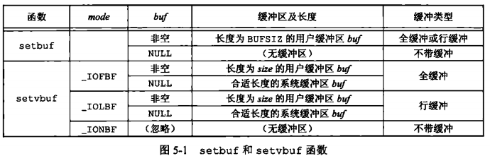
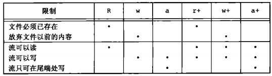
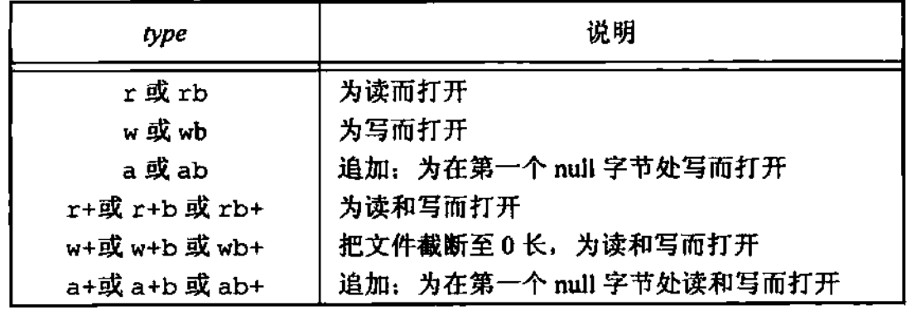

### 标准 I/O

#### 标准IO库实现

不仅是 UNIX，很多其他操作系统都实现了标准 I/O 库，这个库由 ISO C 标准说明，SUS 对 ISO C 的标准进行了扩充，定义了另外一些接口

标准 I/O 库处理很多细节，如缓冲区分配、以优化的块长度进行 I/O 等。这些处理使用户不必担心如何选择使用正确的块长度，这使得它便与用户使用。

标准 I/O 库由 Dennis Ritchie 在 1975 年左右编写的，几乎没有对标准 I/O 库进行修改

标准 I/O 库最终都要调用文件 I/O 函数，每个标准 I/O 流都有一个与其相关联的文件描述符，可以对一个流调用 `fileno` 函数（POSIX.1）以获得其描述符

```c
// 返回与该流相关联的文件描述符
#include <stdio.h>
int fileno(FILE *fp)
```

如果要调用 `dup` 或 `fcntl` 等函数，则需要此函数

#### 流和 FILE 对象

对于文件 I/O 函数是围绕文件描述符的，当打开一个文件时，即返回一个文件描述符，然后该文件描述符就用于后续的 I/O 操作。而对于标准 I/O 库，它们的操作是围绕流（stream) 进行的。当用标准 I/O 库打开或创建一个文件时，就已使一个流与一个文件相关联。

对于 ASCII 字符集，一个字符用一个字节表示。对于国际字符集，一个字符可用多个字节表示。标准 I/O 文件流可用于单字节或多字节字符集。流的定向（stream's orientation）决定了所读，写的字符是单字节还是多字节的。当一个流最初被创建时，它并没有定向。若在未定向的流上使用一个多字节 I/O 函数，则将该流定义设置为宽定向的。若在未定向的流上使用一个单字节 I/O 函数，则将该流的定向设为单字节定向的。

使用 `freopen` 函数清除一个流的定向；使用 `fwide` 函数设置流的定向

```c
#include <stdio.h>
#include <wchar.h>
// 返回值：若流是宽定向的，返回正值；若流是字节定向的，返回负值；若流未定向，返回 0；
/**
 * params mode 为负，将试图使指定的流是字节定向的
 *             为正，将试图使指定的流是宽定向的
 *             为0，将不试图设置流的定向，但返回标识该流定向的值
 *
**/
int fwide(FILE *fd, int mode);
```

`fwide` 并不改变已定向流的定向。且无出错返回（在调用 `fwide` 前先清除 `errno` ，从 `fwide` 返回时检查 `errno` 的值）当打开一个流时，标准 I/O 函数 `fopen` 返回一个指向 FILE 对象的指针。该对象通常是一个结构，它包含了标准 I/O 库为管理该流需要的所有信息，包括用于实际 I/O 的文件描述符、指向用于该流缓冲区的指针、缓冲区的长度、当前在缓冲区中的字符数以及出错标志等。

应用程序没有必要检验 `FILE` 对象。为了引用一个流，需将 `FILE` 指针作为参数传递给每个标准 I/O 函数。 

#### 标准输入、输出和错误

对一个进程预定义了 3 个流，并且这 3 个流可以自动地被进程使用，它们是：标准输入、标准输出和标准错误。这些流引用的文件与文件描述符 `STDIN_FILENO`、`STDOUT_FILENO`、`STDERR_FILENO` 所引用的相同。

这 3 个标准 I/O 流通过预定义文件指针 `stdin`、`stdout` 和 `stderr` 加以引用。这 3 个文件指针定义在头文件`<stdio.h>` 中

#### 缓冲

标准 I/O 库提供缓冲的目的是尽可能减少使用 `read` 和 `write` 调用的次数。它也对每个 `I/O` 流自动地进行缓冲管理，标准 I/O 提供 3 种类型地缓冲

* **全缓冲：**在这种情况下，在填满标准 I/O 缓冲区后才进行实际 I/O 操作。对于驻留在磁盘上的文件通常是由标准 I/O 库实施全缓冲。在一个流上执行第一次 I/O 操作时，相关标准 I/O 函数通常调用 `malloc` 获得需使用的缓冲区

  **冲洗：**说明标准 I/O 缓冲区的写操作。缓冲区可由标准 I/O 例程自动地冲洗。或者可以调用函数 `fflush` 冲洗一个流。在标准 I/O 库方面，`flush`  意味着将缓冲区中的内容写到磁盘上（该缓冲区可能只是部分填满的），在终端驱动程序方面，`flush` 表示丢弃已存储在缓冲区中的数据

* **行缓冲:** 在这种情况下，当在输入和输出种遇到换行符时，标准 I/O 库执行 I/O 操作。这允许我们一次输出一个字符（用标准I/O 函数 `fputc`）但只有在写了一行之后才进行实际 I/O 操作。当流涉及一个终端时，通常使用行缓冲。

  行缓冲有两个限制。第一，因为标准 I/O 库用来收集每一行的缓冲区的长度是固定的，只要填满了缓冲区，即使还没有写一个换行符，也进行 I/O 操作。第二，任何时候只要通过标准 I/O 库要求从一个不带缓冲的流，或者一个行缓冲的流得到输入数据，那么就会冲洗所有行缓冲输出流。

* **不带缓冲：**标准 I/O 库不对字符进行缓冲存储。

  标准错误流 `stderr` 通常是不带缓冲的，这就使得出错信息可以尽快显示出来，而不管它们是否含有一个换行符。

ISOC 要求下列缓冲特征

* 当且仅当标准输入和标准输出并不指向交互式设备，它们才是全缓冲
* 标准错误决不会是全缓冲

很多系统默认使用下列类型的缓冲

* 标准错误是不带缓冲
* 若是指向终端设备的流，则是行缓冲的；否则是全缓冲的

使用以下函数来更改缓冲类型

```c
#include <stdio.h>
// 返回值：若成功，返回 0；若出错，返回非 0
void setbuf(FILE *restrict fp, char *restrict buf);
// 如果将 null 作为 buff 值该函数会自动分配一个缓冲区
int setvbuf(FILE *restrict fp, char *restrict buf, int mode, size_t size);
```

这些函数一定要在流已被打开后调用（因为每个函数都要求一个有效的文件指针作为它们的第一个参数），而且也应在对该流执行任何一个其他操作之前调用

可以使用 `setbuf` 函数打开或关闭缓冲机制。为了带缓冲进行 I/O，参数 `buf` 必须指向一个长度为 `BUFSIZ` 的缓冲区（该常量定义在 <stdio.h>中）。通常在此之后该流就是全缓冲的，但是如果该流与一个终端设备相关，那么某些系统也可将其设置为行缓冲的。关闭缓冲，将 `buf` 设置为 NULL

使用 `setvbuf` ，可以精确地说明所需的缓冲类型。使用 `mode` 参数实现

`_IOFBF` 全缓冲，`_IOLBF` 行缓冲，`_IONBF` 不带缓冲。

如果指定一个不带缓冲的流，则忽略 `buf` 和 `size` 参数。如果指定全缓冲或行缓冲，则 `buf` 和 `size` 可选择地指定一个缓冲区及其长度。如果该流是带缓冲的，而 `buf` 是 NULL，则标准 I/O 库将自动地为该流分配适当长度的缓冲区（由常量 `BUFSIZ` 所指定的值）

*`setbuf`和`setvbuf`动作*



如果在一个函数内分配一个自动变量类的标准 I/O  缓冲区，则从该函数返回之前，必须关闭该流。另外，有些实现将缓冲区的一部分用于存放它自己的管理操作信息，所以可以存放在缓冲区中的实际数据字节数少于 `size` 。一般而言，应由系统选择缓冲区的长度，并自动分配缓冲区。在这种情况下关闭此流时，标准 I/O 库将自动释放缓冲区。

任何时候，都可强制冲洗一个流

```c
#include <stdio.h>
// 返回值：若成功，返回 0；若出错，返回 EOF
int fflush(FIFL *fp);
```

此函数使该流所有未写的数据都被传送至内核。如果 `fp` 是 NULL，则此函数将导致所有输出流被冲洗，在输入流中使用该函数的效果是未定义的。只要最近一次操作不是输入操作，就可以用该函数来更新流（任何读写模式）

#### 打开流

使用下列 3 个函数打开一个标准 I/O 流

```c
#include <stdio.h>
// 3 个函数的返回值：若成功，返回文件指针；若出错，返回 null
FILE *fopen(const char *restict pathname, const char *restrict type);
FILE *freopen(const char *restict pathname, const char *restrict type, FILE *restrict fp);
FILE *fdopen(int fd, const char *type);
```

区别如下：

`fopen`  函数打开路径名为 `pathname` 的一个指定的文件。还会创建一个缓冲区（读写模式下会创建两个缓冲区，缓冲区的大小因实现而异，一般是 512 字节或它的倍数）以及一个包含文件和缓冲区数据的结构。返回指向该结构的指针。

`freopen`  函数在一个指定的流上打开一个指定的文件，如若该流已经打开，则先关闭该流。若该流已经定向，则使用 `freopen` 清除该定向。此函数一般用于将一个指定的文件打开为一个预定义的流：标准输入、标准输出或标准错误

`fdopen` 函数取一个已有的文件描述符（从 `open`，`dup`，`dup2`，`fcntl`，`pipe`，`socket`，`socketpair` `accept` 函数得到此文件描述符），并使一个标准的 I/O 流与该描述符相结合。此函数常用于由创建管道和网络通信通道函数返回的描述符。因为这些特殊类型的文件不能用标准 I/O 函数 `fopen` 打开，所以必须先调用设备专用函数以获得一个文件描述符，然后用 `fdopen` 使一个标准 I/O 流与该描述符相结合

*type 参数指定对该 I/O 流的读、写方式*

|         type         |                             说明                             |          open 标志          |
| :------------------: | :----------------------------------------------------------: | :-------------------------: |
|         r/rb         |                          为读而打开                          |         `O_RDONLY`          |
|         w/wb         |  以写模式打开文件，把现有文件长度截断为 0，不存在则创建文件  | `O_WRONLY|O_CREAT|O_TRUNC`  |
|         a/ab         | 以追加模式打开文件（写），在文件末尾添加内容，文件不存在则创建 | `O_WRONLY|O_CREAT|O_APPEND` |
|      r+/r+b/rb+      |                         追加读写打开                         |          `O_RDWR`           |
|      w+/w+b/wb+      |              把文件截断至 0 长，或为读和写打开               |  `O_RDWR|O_CREAT|O_TRUNC`   |
|      a+/a+b/ab+      |                       追加读写，或创建                       |  `O_RDWR|O_CREAT|O_APPEND`  |
| wx/wbx/w+x/wb+x/w+bx | C11 新增，类似无 x 写模式，如果文件已存在或以独占模式打开则失败 |                             |

C11 新增了带 x 字母的写模式，与以前的写模式相比具有更多特性。第一，如果以传统的一种写模式打开一个现有文件，fopen() 会把该文件的长度截为 0，这样就丢失了该文件的内容。但是使用带 x 字母的写模式，即使 fopen() 操作失败，原文件的内容也不会被删除。第二，如果环境允许，x 模式的独占特性使得其他程序或线程无法访问正在被打开的文件

使用字符 b 作为 `type` 的一部分，这使得标准 I/O 系统可以区分文本文件和二进制文件。因为 UNIX 内核并不对这两种文件进行区分，所以在 UNIX 系统环境下指定字符 b 作为 `type ` 的一部分上并无作用。

对于 `fdopen` ，`type` 参数的意义稍有区别。因为该描述符已经被打开，所以 `fdopen` 为写而打开并不截断该文件。（若该描述符原来是由 `open` 函数创建的，而且该文件已经存在，则其 `O_TRUNC` 标志将决定是否截断该文件。`fdopen` 函数不能截断它为写而打开的任一文件）标准 I/O 追加写方式也不能用于创建该文件（因为如果一个描述符引用一个文件，则该文件一定已经存在）

当用追加写类型打开一个文件后，每次写都将数据写的文件的当前尾端处。如果有多个进程用标准 I/O 追加写方式打开同一文件，那么来自每个进程的数据都将正确地写到文件中。

当以读和写类型打开一个文件时（`type` 中的 `+` 号），具有下列限制

* 如果中间没有 `fflush`，`fseek`，`fsetpos` 或 `rewind` ，则在输出的后面不能直接跟随输入
* 如果中间没有 `fseek`，`fsetops`，`rewind`，或一个输入操作没有到达文件尾端，则在输入操作之后不能直接跟随输出

*打开一个标准 I/O 流的 6 钟不同方式*



在指定 `w` 或 `a` 类型创建一个新文件时，无法设置该文件的权限位，POSIX.1 要求实现使用：`S_IRUSR |S_IWUSR ｜ S_IRGRP | S_IWGRP | S_IROTH | S_IWOTH` 权限集创建文件。可调整 `umask`  值来限制这些权限

除非流引用终端设备，否则按系统默认，流被打开时是全缓冲的。若流引用终端设备，则该流是行缓冲的。一旦打开了流，那么在对流执行任何操作之前，如果希望，则可以使用 `setbuf` 和 `setvbuf` 改变缓冲的类型

使用 `fclose` 关闭一个打开的流

```c
#include <stdio.h>
// 返回值：若成功，返回 0；若出错，返回 EOF
int fclose(FILE *fp);
```

在该文件被关闭之前，冲洗缓冲中的输出数据。缓冲区中的任何输入数据被丢弃。如果标准 I/O 库已经为该流自动分配了一个缓冲区，则释放此缓冲区

当一个进程正常终止时（直接调用 `exit` 函数，或从 `main` 函数返回），则所有带未写缓冲数据的标准 I/O 流都被冲洗，所有打开的标准 I/O 流都被关闭

#### 读和写流

一旦打开了流，则可在 3 种不同类型的非格式化 I/O 中进行选择，对其进行读，写操作

1. 每次一个字符的 I/O。一次读或写一个字符，如果流是带缓冲的，则标准 I/O 函数处理所有缓冲
2. 每次一行的 I/O。如果想要一次读或写一行，则使用 `fgets` 和 `fputs` 每行都以一个换行符终止。当调用 `fgets` 时，应说明能处理的最大行长。
3. 直接 I/O 。`fread` 和 `fwrite` 函数支持这种类型的 I/O。每次 I/O 操作读或写某种数量的对象，而每个对象具有指定的长度。这两个函数常用于从二进制文件中每次读或写一个结构。也被称为（二进制I/O、一次一个对象I/O、面向记录或面向结构I/O）

##### 输入函数

以下 3 个函数可用于一次读一个字符

```c
#include <stdio.h>
// 3 个函数返回值：若成功，返回下一个字符；若已到达文件尾端或出错，返回 EOF
int getc(FILE *fp);
int fgetc(FILE *fp);
int getchar(void);
```

函数 `getchar` 等同于 `getc(stdin)` 前两个函数的区别是，`getc` 可被实现为宏，而 `fgetc` 不能实现为宏：

1. `getc` 的参数不应当是具有副作用的表达式，因为它可能会被计算多次
2. 因为 `fgetc` 一定是个函数，所以可以得到其地址。这就允许将 `fgetc` 的地址作为一个参数传送给另一个函数
3. 调用 `fgetc` 所需时间很可能比调用 `getc` 要长，因为调用函数所需要的时间通常长于调用宏

这 3 个函数在返回下一个字符时，将其 `unsigned char` 类型转换为 `int` 类型（采用无符号的理由，如果最高位为 1 也不会使返回值为负，要求整型返回值的理由是，这样就可以返回所有可能的字符值再加上一个已出错或已到达文件尾端的指示值。在 `<stdio.h>` 中的常量 `EOF` 被要求是一个负值，其值经常是 -1。这就意味着不能将这 3 个函数的返回值存放在一个字符变量中，以后还要将这些函数的返回值与常量 `EOF` 比较）

不管是出错还是到达文件尾端，标准输入函数都返回 EOF。为了区分这两种不同的情况，必须调用 `ferror` 或 `feof`

```c
#include <stdio.h>
// 读写出现错误，返回非 0 值，否则返回 0
int ferror(FILE *fp);
// 上一次输入调用检测到文件结尾时，返回非零值，否则返回 0
int feof(FILE *fp);
void clearerr(FILE *fp);
```

在大多数实现中，为每个流在 `FILE` 对象中维护了两个标志

* 出错标志

* 文件结束标志

调用 `clearerr`  可以清除这两个标志

从流中读取数据以后，可以调用 `ungetc` 将字符再压送回流中（用 `ungetc` 压送回字符时，并没有将它们写到底层文件中或设备上，只是将它们写回标准 I/O 库的流缓冲区中）

```c
#include <stdio.h>
// 返回值：若成功，返回 c;若出错，返回 EOF
int ungetc(int c, FILE *fp);
```

压送回到流中的字符以后又可从流中读出，但读出字符的顺序与压送回的顺序相反。回送的字符，不一定必须是上一次读到的字符。不能回送 `EOF`。但是当已经到达文件尾端时，仍可以回送一个字符。下次读将返回该字符，再读则返回 `EOF`（一次成功的 `ungetc` 调用会清除该流的文件结束标志）。

当正在读一个输入流，并进行某种形式的切词或记号切分操作时，会经常用到回送字符操作。有时需要先看一看下一个字符，以决定如果处理当前字符。然后就需要方便地将刚查看的字符回送，以便下一次调用 `getc` 时返回该字符。如果标准 I/O 库不提供回送能力，就需将该字符存放到一个我们自己的变量中，并设置一个标志以便判别在下一次需要一个字符时是调用 `getc`，还是从我们自己的变量中取用这个字符。

##### 输出函数

对应于每个输入函数都有一个输出函数

```c
#include <stdio.h>
int putc(int c, FILE *fd);
int fputc(int c, FILE *fp);
int putchar(int c);
```

与输入函数一样，`putchar(c)` 等同于 `putc(c, stdout)`，`putc` 可被实现为宏，而 `fputc` 不能实现为宏。

#### 每次一行 I/O

下面两个函数提供每次输入一行的功能

```c
#include <stdio.h>
// 两个函数返回值：若成功，返回 buf;若已到达文件尾端或出错，返回 null
char *fgets(char *restrict buf, int n, FILE *restrict fp);
char *gets(char *buf);
```

这两个函数都指定了缓冲区的地址，读入的行将送入其中。`gets` 从标准输入读，而 `fgets` 则从指定的流读

对于 `fgets`，必须指定缓冲区的长度 n。此函数一直读到下一个换行符为止，但是不超过 `n -1` 个字符，读入的字符被送入缓冲区。该缓冲区以 `null` 字节结尾。如若该行包括最后一个换行符的字符数超过`n-1`，则 `fgets` 只返回一个不完整的行，但是，缓冲区总是以 `null` 字节结尾。对 `fgets` 的下一次调用会继续读该行

`gets` 是一个不推荐使用的函数。其问题是调用者在使用 `gets` 时不能指定缓冲区的长度。这样就可能造成缓冲区溢出（如若该行长于缓冲区长度），写到缓冲区之后的存储空间中，从而产生不可预料的后果。（`gets` 并不将换行符存入缓冲区中）

`fputs` 和 `puts` 提供每次输出一行的功能

```c
#include <stdio.h>
// 两个函数的返回值：若成功，返回非负值；若出错，返回 EOF
int fputs(const char *restrict str, FILE *restrict fp);
int puts(const char *str);
```

函数 `fputs` 将一个以 `null` 字节终止的字符串写到指定的流，尾端的终止符 `null` 不写出。并不一定是每次输出一行，因为字符串不需要换行符作为最后一个非 `null` 字节。通常，在 `null` 字节之前是一个换行符，但并不要求总是如此。

`puts` 将一个以 `null` 字节终止的字符串写到标准输出，终止符不写出。但是 `puts` 随后又将一个换行符写到标准输出

`puts` 并不像它所对应的 `gets` 那样不安全。但是还是应该避免使用它，以免需要记住它在最后是否添加了一个换行符。如果总是使用 `fgets` 和 `fputs` ，那么必须在每行终止处自己处理换行符。

#### 二进制 I/O

如果使用 `getc` 或 `putc` 读、写一个结构，那么必须循环通过整个结构，每次循环处理一个字节，一次读或写一个字节，这会非常麻烦其费时。如果使用 `fputs` 和 `fgets	` 那么因为 `fputs` 在遇到 `null` 字节时就停止，而在结构中可能含有 `null` 字节，所以不能使用它实现读结构的要求。如果输入数据中包含 `null` 字节或换行符，则 `fgets` 也不能正确工作。

下列函数以执行二进制 I/O 操作

```c
#include <stdio.h>
// 两个函数的返回值：读或写的对象数
size_t fread(void *restrict ptr, size_t size, size_t nobj, FILE *restrict fp);
size_t fwrite(const void *restrict ptr, size_t size, size_t nobj, FILE *restrict fp);
```

这些函数有以下两种常见的用法

1. 读或写一个二进制数组。其中 `size` 为每个数组元素的长度，`nobj` 为欲写的元素个数
2. 读或写一个结构。其中指定 `size` 为结构的长度，`nobj` 为要写的对象个数

`fread` 和 `fwrite` 返回读或写的对象数。对于读，如果出错或到达文件尾端，则此数字可以少于 `nobj`。在这种情况，应调用 `ferror` 或 `feof` 以判断究竟是哪一种情况。对于写，如果返回值少于所要求的 `nobj`，则出错。

使用二进制 I/O 的基本问题是，它只能用于读在同一系统上已写的数据。现在，很多异构系统通过网络互连，常常需要在一个系统上写的数据，要在另一个系统上进行处理，在这种环境下，这两个函数可能就不能正常工作，其原因是：

* 在一个结构中，同一成员的偏移量可能随编译程序和系统的不同而不同（由于不同的对齐要求）；或者准确对齐，这意味着即使在同一个系统上，一个结构的二进制存放方式也可能因编译程序选项的不同而不同
* 用来存储多字节整数和浮点值的二进制格式在不同的系统结构间也可能不同

#### 定位流

有 3 种方法定位标准 I/O 流

1. `ftell` 和 `fseek` 函数。这两个函数假定文件的位置可以存放在一个长整型中
2. `ftello` 和 `fseeko` 函数。SUS 引入，使用 `off_t` 数据类型代替了长整型
3. `fgetpos` 和 `fsetpos` 函数。ISO C 引入，使用一个抽象数据类型 `fpos_t` 记录文件的位置。这种数据类型可以根据需要定义为一个足够大的数，用以记录文件位置

```c
#include <stdio.h>
// 返回值：若成功，返回当前文件位置指示；若出错，返回 -1L
long ftell(FILE *fp);
// 返回值：若成功，返回 0；若出错，返回 -1
int fseek(FILE *fp, long offset, int whence);
//使用 rewind 函数可将一个流设置到文件的起始位置
void rewind(FILE *fp);
```

对于一个二进制文件，其文件位置指示器是从文件起始位置开始度量，并以字节为度量单位的。`ftell` 用于二进制文件时，其返回值就是这种字节位置。使用 `fseek` 定位一个二进制文件，必须指定一个字节 `offset`，以及解释这种偏移量的方式。`whence` 的值与 `lseek` 函数的相同：`SEEK_SET` 表示从文件的起始位置开始，`SEEK_CUR`，`SEEK_END` 表示从文件的尾端开始。

对于文本文件，`whence` 一定要是 `SEEK_SET` ，而且 `offset` 只能有两种值：0（后退到文件的起始位置），或是对该文件的 `ftell` 所返回的值。

除了偏移量的类型是 `off_t` 而非 `long` 以外，`ftello` 函数与 `ftell` 相同，`fseeko` 函数与 `fseek` 相同

```c
#include <stdio.h>
// 返回值：若成功，返回当前文件位置；若出错，返回 off_t -1
off_t ftello(FILE *fp);
// 返回值：若成功，返回 0；若出错，返回 -1
int fseeko(FILE *fp, off_t offset, int whence);
```

`fgetpos` 将文件位置指示器的当前值存入由 `pos` 指向的对象中。在以后调用 `fsetpos` 时，可以使用此值将流重新定位至该位置

```c
#include <stdio.h>
// 两个函数返回值：若成功，返回 0；若出错，返回非 0
int fgetpos(FILE *restrict fp, fpos_t *restrict pos);
int fsetpost(FILE *fp, const fpos_t *pos);
```

#### 格式化 I/O

##### 格式化输出

格式化输出由以下 printf 函数来处理

```c
#include <stdio.h>
// 以下 3 函数成功返回输出字符数，出错，返回负值
// 将格式化数据到标准输出
int printf(const char *restrict format, ...);
// 写至指定的流
int fprintf(FILE *restrict fp, const char *restrict format, ...);
// 写至指定的文件描述符
int dprintf(int fd, const char *restrict format, ...);
// 返回值，若成功，返回存入数组的字符数，若编码出错，返回负值
// 将格式化的字符串送入数组 buf，在该数组的尾端自动加一个 null 字节，但该字符不包括在返回值中，可能造成buf的缓冲区溢出
int sprintf(char *restrict buf, const char *restrict format, ...);
// 返回值，若缓冲区足够大，返回将要存入数组的字符数；若编码出错，返回负值
// 同 sprintf ，只是缓冲区长度是一个显示参数，超过缓冲区尾端写的所有字符都被丢弃
int snprintf(char *restrict buf, size_t n, const char *restrict format,...)
```

##### 格式化输入

执行格式化输入处理的是 3 个 scanf 函数

```c
#include <stdio.h>
// 三个函数返回值：负值的输入项数，若输入出错或在任一转换前已到达文件尾端，返回 EOF
int scanf(const char *restrict format,...);
int fscanf(FILE *restrict fp, const char *restrict format, ...);
int sscanf(const char *restrict buf, const char *restrict format, ...);
```

scanf 族用于分析输入字符串，并将字符序列转换成指定类型的变量。在格式之后的各参数包含了变量的地址，用转换结果对这些变量赋值。

#### 临时文件

ISO C 标准 I/O 库提供了两个函数以创建临时文件

```c
#include<stdio.h>
// 返回值：指向唯一路径名的指针
/**
 * 产生一个与现有文件名不同的一个有效路径名字符串。每次调用它时，都产生一个不同的路径名，最多调用次数是
 * TMP_MAX 定义在 <stdio.h> 中
 * @params ptr 若 ptr 是 NULL，则所产生的路径名存放在一个静态区，指向该静态区的指针作为函数返回值，后续
 *             调用 tmpnam 时，会重写该静态区
 *             不为 NULL，则认为它应该是指向长度至少是 L_tmpnam <stdio.h> 个字符的数组，产生的路径名存
 *             放在该数组中，ptr 作为函数值返回
 * @return 指向唯一路径名的指针
 * 
**/
char *tmpnam(char *ptr);
// 返回值：若成功，返回文件指针，若出错，返回 NULL
/**
 * 创建一个临时二进制文件（类型 wb+），在关闭该文件或程序结束时自动删除这种文件, tmpfile 经常是先调用
 * tmpname 产生一个唯一的路径名，然后用该路径名创建一个文件，并立即 unlink 它（对一个文件解除链接并不删除
 * 其内容，关闭该文件时才删除其内容，关闭文件可以是显式的，也可以在程序终止时自动进行
**/
FILE *tmpfile(void);
```

SUS 为处理临时文件定义了另外两个函数：`mkdtemp` 和 `mkstemp`，它们是 XSI 的扩展部分

```c
#include <stdlib.h>
/**
 * 创建一个目录，该目录有一个唯一的名字，创建的目录使用：S_IRUSR｜S_IWUSR | S_IXUSR
 * @return 成功，返回指向目录名的指针：若出错，返回 NULL
**/
char *mkdtemp(char *template);
/**
 * 创建一个文件，该文件有一个唯一的名字
 * @return 成功，返回文件描述符，出错，返回 -1
**/
int mkstemp(char *template);
```

返回名字通过 template 字符串进行选择，这个字符串是后 6 位设置为 XXXXXX 的路径名。函数将这些占位符替换成不同的字符来构建一个唯一的路径名。如果成功，将修改 template 字符串反映临时文件的名字。
#### 内存流

标准 I/O 库把数据缓存在内存中，因此每次一字符和每次一行的I/O更有效。可以调用 `setbuf` 或 `setvbuf` 函数让 I/O库使用我们自己的缓冲区。在 `SUSV4` 中支持了内存流。这就是标准 I/O 流，虽然仍使用 FILE 指针进行访问，但其实并没有底层文件。所有的 I/O 都是通过在缓冲区与主存之间来回传送字节来完成。即便这些流看起来像文件流，它们的某些特征使其更适用于字符操作

有 3 个函数可用于内存流的创建

```c
#include <stdio.h>
// 返回值：若成功，返回流指针；若错误，返回 null
FILE *fmemopen(void *restrict buf, size_t size, const char *restrict type);
```

`fmemopen` 函数允许调用者提供缓冲区用于内存流：`buf` 参数指向缓冲区的开始位置，`size` 参数指定了缓冲区大小的字节数。如果 `buf` 参数为空，`fmemopen` 函数分配 `size` 字节数的缓冲区。在这种情况下，当流关闭时缓冲区会被释放

*打开内存流的 `type` 参数*



这些取值对应于基于文件的标准 I/O 流的type 参数取值，但是其中有些微小差别。

* 第一，无论何时以追加写方式打开内存流时，当前文件位置设为缓冲区中的第一个 `null` 字节。如果缓冲区中不存在 `null` 字节，则当前位置就设为缓冲区结尾的后一个字节。当流并不是以追加写方式打开时，当前位置设为缓冲区的开始位置。因为追加写模式通过第一个 `null` 字节确定数据的尾端，内存流并不适合存储二进制数据（二进制数据在数据尾端之前就可能包含多个 `null` 字节）

* 第二，如果 `buf` 参数是一个 `null` 指针，打开流进行读或者写都没有任何意义。因为在这种情况下缓冲区是通过 `fmemopen` 进行分配的，没有办法找到缓冲区的地址，只写方式打开流意味着无法读取已写入的数据，同样，以读方式打开流意味着只能读取那些我们无法写入的缓冲区中的数据
* 第三，任何时候需要增加流缓冲区中数据量以调用 `fclose` 、`fflush`、`fseek`、`fseeko` 以及 `fsetpos` 时都会在当前位置写入一个 `null` 字节

```c
#include <stdio.h>
// 两个函数的返回值：若成功，返回流指针；若出错，返回 null
FILE *open_memstream(char **bufp, size_t *sizep);
#include <wchar.h>
FILE *open_wmemstream(wchar_t **bufp, size_t *sizep);
```

`open_memstream` 函数创建的流是面向字节的，`open_wmemstream` 函数创建的流是面向宽字节的。这两个函数与 `fmemopen` 函数的不同在于：

* 创建的流只能写打开
* 不能指定自己的缓冲区，但可以分别通过 `bufp` 和 `sizep` 参数访问缓冲区地址和大小
* 关闭流后需要自行释放缓冲区
* 对流添加字节会增加缓冲区大小

但是在缓冲区地址和大小的使用上必须遵循一些原则。第一，缓冲区地址和长度只有在调用 `fclose` 或 `fflush` 后才有效；第二，这些值只有在下一次流写入或调用 `fclose` 前才有效。因为缓冲区可以增长，可能需要重新分配。如果出现这种情况，缓冲区的内存地址值在下一次调用 `fclose` 或 `fflush` 时会改变。

避免了缓冲区溢出，内存流非常适用于创建字符串。因为内存流只访问主存，不访问磁盘上的文件，所以对于把标准 I/O 流作为参数用于创建临时文件的函数来说，会有很大的新能提升

