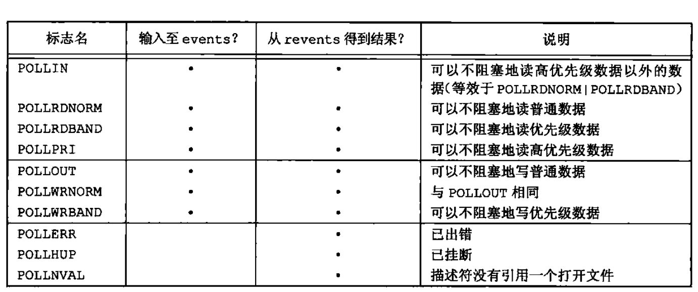

### 高级 IO

#### 非阻塞 I/O

非阻塞 I/O 使 `open` `read` `write` 这样的 I/O 操作永远不会阻塞。如果这种操作不能完成，则调用立即出错返回，表示该操作如继续执行将阻塞

对于一个给定的描述符，有两种为其指定非阻塞 I/O 的方法：

* 如果调用 `open`  获得描述符，则可指定 `O_NONBLOCK` 标志；
* 对于已经打开的一个描述符，则可指定 `fcntl` ，由该函数打开 `O_NONBLOCK` 文件状态标志

POSIX.1 提供了一个非阻塞标志 `O_NONBLOCK`，POSIX.1 要求，对于一个非阻塞的描述符如果无数据可读，则 `read` 返回 -1，`errno` 被设置为 `EAGAIN`

#### 记录锁

记录锁（record locking）的功能是：当第一个进程正在读或修改文件的某个部分时，使用记录锁可以阻止其他进程修改同一文件区。即字节范围锁（byte-range-locking），它锁定的只是文件中的一个区域（也可能是整个文件）

POSIX.1 标准的基础是 `fcntl` 方法，SUS 在 XSI 扩展种包括了 `lockf`

##### fcntl 记录锁

```c
#include <fcntl.h>
// 返回值：若成功，依赖于 cmd，否则，返回 -1
// 对于记录锁，cmd 是 F_GETLK F_SETLK，F_SETLKW
int fcntl(int fd, int cmd, .../ * struct flock *flockptr */);
// 第三个参数是一个指向 flock 结构的指针
struct flock {
    short l_type;   /* 希望锁类型F_RDLCK 共享读锁，F_WRLCK 独占性写锁，F_UNLCK 解锁一个区域 */
    // 要加锁或解锁区域的起始字节偏移量(l_start 和 l_whence)
    short l_whence;   /* SEEK_SET, SEEK_CUR, SEEK_END */
    off_t l_start; 	  /* offset in bytes, relative to l_whence */
    off_t l_len;   /* length, in bytes; 0 means lock to EOF 区域的字节长度 */
    pid_t l_pid;  /* returned with F_GETLK 进程的 ID 持有的锁能阻塞当前进程（仅由 F_GETLK返回）*/
}
```

关于加锁或解锁区域的说明还要注意下列几项规则:

* 指定区域起始偏移量的两个元素与 `lseek` 函数中最后两个参数类似。`l_whence` 可选用的值是 `SEEK_SET`、`SEEK_CUR` 或 `SEEK_END`。
* 锁可以在当前文件尾端处开始或者越过尾端处开始，但是不能在文件起始位置之前开始。
* 如若 `l_len` 为 0，则表示锁的范围可以扩展到最大可能偏移量。这意味着不管向该文件中追加写了多少数据，它们都可以处于锁的范围内（不必猜测会有多少字节被追加写到了文件之后），而且起始位置可以是文件中的任意一个位置。
* 为了对整个文件加锁，我们设置 `l_start` 和 `l_whence` 指向文件的起始位置，并且指定长度（`l_len`）为 0。（有多种方法可以指定文件起始处，但常用的方法是将 `l_start`指定为0，`l_whence` 指定为 `SEEK_SET`。）

CMD 三种命令规则：

* `F_GETLK`  

  判断由 `flockptr` 所描述的锁是否会被另外一把锁阻塞。如果存在一把锁，它阻止创建由 `flockptr` 所描述的锁，则该现有锁的信息将重写 `flockptr` 指向的信息。如果不存在这种情况，则除了将 `l_type` 设置为 `F_UNLCK` 之外，`flockptr` 所指向结构中的其他信息保持不变。

* `F_SETLK` 

  设置由 `flockptr` 所描述的锁。如果试图获得一把读锁（`l_typr` 为 `F_RDLCK`) 或写锁 (`l_type ` 为 `F_WRLCK` ) ，而兼容性规则阻止系统给我们这把锁，那么 `fcntl` 会立即出错返回，此时 `errno` 设置为`EACCES` 或 `EAGAIN`

  此命令也用来清除由 `flockptr` 指定的锁 (`l_type` 为 `F_UNLCK`)

* `F_SETLKW` 

  这个命令是 `F_SETLK` 的阻塞版本。如果锁请求的读锁或写锁因另一个进程当前已经对所请求区域的某部分进行了加锁而不能授予，那么调用进程会被设置为休眠。如果请求创建的锁已经可用，或休眠由信号中断，则该进程被唤醒。

用 `F_GETLK` 测试能否建立一把锁，然后用 `F_SETLK` 或 `F_SETLKW` 企图建立那把锁，这两者不是一个原子操作。不能保证在这两次 `fcntl` 调用之间不会有另一个进程插入并建立一把相同的锁。如果不希望在等待锁变为可用时产生阻塞，就必须处理由 `F_SETLK` 返回的可能的出错。

共享读锁和独占性写锁的基本规则是：任意多个进程在一个给定的字节上可以有一把共享的读锁，但在一个给定字节上只能有一个进程有一个独占写锁。如果在一个给定字节上已经有一把或多把读锁，则不能在该字节上再加写锁；如果在一个字节上已经有一把独占性写锁，则不能再对它加任何读锁。如果一个进程对一个文件区间已经有了一把锁，后来该进程又企图在同一文件区间再加一把锁，那么新锁将替换已有锁。

POSIX.1 并没有说明在下列情况下将发生什么：一个进程在某个文件的一个区间上设置了一把读锁，第二个进程在试图对同一文件区间加一把写锁时阻塞，然后第三个进程则试图在同一文件区间上得到另一把读锁。如果第三个进程只是因为读区间已有一把读锁，而被允许在该区间放置另一把读锁，那么这种实现就可能会使希望加写锁的进程饿死。因此，当对同一区间加另一把读锁的请求到达时，提出加写锁而阻塞的进程需等待的时间延长了。如果加读锁的请求来得很频繁，使得该文件区间始终存在一把或几把读锁，那么欲加写锁的进程就将等待很长时间

在设置或释放文件上的一把锁时，系统按要求组合或分裂相邻区：若第 100～199 字节是加锁的区，需解锁第 150 字节，则内核将维持两把锁，一把用于第 100～149 字节，另一把用于第151～199字节。假定我们又对第150字节加锁，那么系统将会再把3个相邻的加锁区合并成一个区（第100～199字节）。又跟开始的时候一样了

加读锁时，该描述符必须是读打开的，加写锁时，该描述符必须是写打开的

##### 锁的隐含继承和释放

* 锁与进程和文件两者相关联。这有两重含义：

  1.当一个进程终止时，它所建立的锁全部释放；

  2.无论一个描述符何时关闭，该进程通过这一描述符引用的文件上的任何一把锁都会释放（这些锁都是该进程设置的）

* 由 `fork` 产生的子进程不继承父进程所设置的锁。这意味着：当一个进程得到一把锁，然后调用 `fork` ，那么对于父进程得到的锁而言，子进程被视为另一个进程。对于通过 `fork` 从父进程处继承过来的描述符，子进程需要调用 `fcntl` 才能获得它自己的锁。

在执行 `exec` 后，新程序可以继承原执行程序的锁。但是，如果对一个文件描述符设置了执行时关闭标志，那么当作为 `exec` 的一部分关闭该文件描述符时，将释放相应文件的所有锁。

##### 在文件尾端加锁

在对相对于文件尾端的字节范围加锁或解锁时需要特别小心。大多数实现按照 `l_whence` 的 `SEEK_CUR` 或 `SEEK_END`值，用 `l_start` 以及文件当前位置或当前长度得到绝对文件偏移量。但是，常常需要相对于文件的当前长度指定一把锁，但又不能调用 `fstat` 来得到当前文件长度，因为我们在该文件上没有锁。（在 `fstat` 和锁调用之间，可能会有另一个进程改变该文件长度。）

#### I/O 多路转接

当需要对多个文件描述符进行读写时可以采取以下技术：

* 轮询（poll)

  在所有支持非阻塞 I/O 的系统上都可以使用。将描述符都设置为非阻塞的，对第一个描述符发一个 `read` ，如果该输入上有数据，则读数据并处理它。如果无数据可读，则该调用立即返回。缺点是浪费 CPU 时间。

* 异步 I/O（asynchronous I/O）

  当描述符准备好进行 I/O 时，用一个信号通知它。但这种信号对每个进程而言只有 1 个（SIGPOLL、SIGIO）。如果使该信号对要读取的多个描述符都起作用，那么进程在接到此信号时将无法判别时哪一个描述符准备好了，尽管 POSIX.1 异步 I/O 接口允许选择那个信号作为通知，但能用的信号数量仍远小于潜在的打开文件描述符的数量

* I/O 多路转接（I/O multiplexing）

  先构造一张感兴趣的描述符的列表，然后调用一个函数，直到这些描述符中的一个已准备好进行 I/O 时，该函数才返回。 `poll`，`pselect` ，`select` 这 3 个函数能够执行 I/O 多路转接。在从这些函数返回时，进程会被告知哪些描述符已准备好可以进行 I/O 了。

##### select pselect

在所有 POSIX 兼容的平台上，`select` 函数可以执行 I/O 多路转接。

传给 `select` 参数告诉内核：

* 我们所关心的描述符；
* 对于每个描述符我们所关心的条件（是否想从一个给定的描述符读，是否想写一个给定的描述符，是否关心一个给定描述符的异常条件）；
* 愿意等待多长时间（可以永远等待、等待一个固定的时间或者根本不等待）。

从 `select` 返回时，内核告诉我们：

* 已准备好的描述符的总数量
* 对于读、写、异常这三个条件中的每一个，哪些描述符已准备好

使用这种返回信息，就可调用相应的I/O 函数（一般是read 或write），并且确知该函数不会阻塞

```c
#include <sys/select.h>
// 返回值：准备就绪的描述符数目；若超时，返回 0；若出错，返回 -1
/**
 * @params tvptr 愿意等待的时间长度，单位为秒和微秒
 *               == NULL: 永远等待，如果捕捉到一个信号则中断此无限等待。当所指定的描述符中的一个已准备好或
 *               捕捉到一个信号则返回。如果捕捉到一个信号，则 select 返回 -1，errno 设置为 EINTR
 *               tvptr->tv_sec == 0 && tvptr->tv_usec == 0 : 根本不等待。测试所有的描述符并立即返回。这
 *               是轮询系统找到多个描述符状态而不阻塞 select 函数的方法
 *               tvptr->tv_sec != 0 && tvptr->tv_usec != 0 : 等待指定的秒数和微秒数。当指定的描述符之一
 *               已准备好，或当指定的时间值已经超过时立即返回。如果在超时到期时还没有一个描述符准备好，则
 *               返回值 0.（如果系统不提供微妙级别的精度，则 tvptr->tv_usec 值取整到最近的支持值）这种等
 *               待可被捕捉到的信号中断
 *         readfds、writefds和exceptfds是指向描述符集的指针。这3个描述符集说明了我们关心的可读、可写或处
 *                 于异常条件的描述符集合。每个描述符集存储在一个fd_set数据类型中
 *         maxfdp1 最大文件描述符编号值加 1，考虑所有 3 个描述符集，在 3 个描述符集中找出最大描述符编号
 *                 值，然后加 1，这就是第一个参数值。也可将第一个参数设置为 FD_SETSIZE ，这是
 *                 <sys/select.h>中的一个常量，它指定最大描述符数（经常是 1024），通过指定我们所关注的
 *                 最大描述符，内核就只需在此范围内寻找打开的位，而不必在 3 个描述符集中的数百个没有使用的
 *                 位内搜索
 * @return int -1 : 表示出错。在所指定的描述符一个都没有准备好时捕捉到一个信号。此种情况下，一个描述符集都
 *                  不修改
 *             0 : 表示没有描述符准备好。若指定的描述符一个都没有准备好，指定的时间就过了，则返回 0，此时
 *                 所有的描述符集都会置为 0
 *             > 0 : 一个正返回值说明了已经准备好的描述符数。该值是 3 个描述符集中已准备好的描述符数之和
 *                   所以如果同一描述符已准备好读和写，那么在返回值中会对其计两次数。在这种情况下，3 个描
 *                   述符集中仍旧打开的位对应于已准备好的描述符。（若对读集 readfds 中的一个描述符进行的
 *                   read 操作不会阻塞，则认为此描述符是准备好的。若对写集 writefds 中的一个描述符进行的
 *                   write 操作不会阻塞，则认为此描述符是准备好的。若对异常条件集 execptfds 中的一个描述
 *                   符有一个未决异常条件，则认为此描述符是准备好的。异常条件包括：在网络连接上到达带外的
 *                   数据，或者在处于数据包模式的伪终端上发生了某些条件。对于读写和异常条件，普通文件的文
 *                   件描述符总是返回准备好
 */
int select(int maxfdpl, fd_set *restrict readfds, fd_set *restrict writefds, fd_set *restrict exceptfds struct timeval *restrict tvptr);
```

`fd_set` 数据类型是由实现选择的，它可以为每一个可能的描述符保持一位。对于 `fd_set` 数据类型，唯一可以进行的处理是：分配一个这种类型的变量，将这种类型的一个变量值赋给同类型的另一个变量，或对这种类型的变量使用下列 4 个函数中的一个，这些接口可实现为宏或函数

```c
#include <sys/select.h>
// 返回值：若 fd 在描述符集中，返回非 0 值；否则，返回 0
// 可以调用 FD_ISSET 测试描述符集中的一个指定位是否已打开
int FD_ISSET(int fd, fd_set *fdset);  
// 调用 FD_CLR 可以清除一位
void FD_CLR(int fd, fd_set *fdset);
// 要开启描述符集中的一位，可以调用 FD_SET
void FD_SET(int fd, fd_set *fdset);
// 调用 FD_ZERO 将一个 fd_set 变量的所有位设置为 0
void FD_ZERO(fd_set, *fdset);
```

在声明了一个描述符集之后，必须用 `FD_ZERO` 将这个描述符集置为 0，然后在其中设置我们关心的各个描述符的位。

`select` 的中间 3 个参数（指向描述符集的指针）中的任意一个（或全部）可以是空指针，这表示对相应条件并不关心。如果所有 3 个指针都是 NULL，则 `select` 提供了比 `sleep` 更精确的定时器。

一个描述符阻塞与否并不影响 `select` 是否阻塞，如果希望读一个非阻塞描述符，并且以超时值 5 秒调用 `select` ，则 `select` 最多阻塞 5s，如果指定一个无限的超时值，则在描述符数据准备好，或捕捉到一个信号之前，`select` 会一直阻塞。

如果在一个描述符上碰到了文件尾端，则select会认为该描述符是可读的。然后调用read，它返回0，这是UNIX系统指示到达文件尾端的方法。（很多人错误地认为，当到达文件尾端时，select会指示一个异常条件。）

POSIX.1 定义了一个 `select` 的变体：`pselect`

```c
#include <sys/select.h>
// 返回值：准备就绪的描述符数目，若超时，返回 0，若出错，返回 -1
int pselect(int maxfdp1, fd_set *restrict readfds, fd_set *restrict writefds, fd_set *restrict exceptfds, const struct timespect *restrict tsptr, const sigset_t *restrict sigmask)
```

区别在于：

* `select` 的超时值用 `timeval` 结构指定，但 `pselect` 使用 `timespec` 结构，`timespec` 结构以秒和纳秒表示超时值，而非秒和微秒。如果平台支持这样的时间精度，那么 `timespec` 就能提供更精准的超时时间。
* `pselect` 的超时值被声明为 `const` ，这保证了调用 `pselect` 不会改变此值。
* `pselect` 可使用可选信号屏蔽字。若 `sigmask` 为 NULL，那么在与信号有关的方面，`pselect` 的运行状况和 `select` 相同。否则，`sigmask` 指向一信号屏蔽字，在调用 `pselect` 时，以原子操作的方式安装该信号屏蔽字。在返回时，恢复以前的信号屏蔽字

### poll

`poll` 函数可用于任何类型的文件描述符。与 `select` 不同，`poll` 不是为每个条件（可读性，可写性和异常条件）构造一个描述符集，而是构造一个 `pollfd` 结构的数组，每个数组元素指定一个描述符编号以及对该描述符感兴趣的条件。

```c
#include <poll.h>
// 返回值：准备就绪的描述符数目；若超时，返回 0；若出错，返回 -1
int poll(struct pollfd fdarray[], nfds_t nfds, int timeout);
struct pollfd {
    int fd;
    short events;
    short revenet;
}
```

设置 `event` 成员的值一个或多个，告诉内核我们关心的是每个描述符的那些事件。返回时，`revents` 成员由内核设置，用于说明每个描述符发生了哪些事件。

*poll 的 events 和 revents 标志*



当一个描述符被挂断后（`POLLHUP`) 后，就不能再写该描述符，但是有可能仍然可以从该描述符读取到数据。

`timeout` 指定愿意等待的时

`timeout == -1` ，永远等待。当所指定的描述符中的一个已准备好，或捕捉到一个信号时返回。如果捕捉到一个信号，则 `poll` 返回 `-1` ，`errno` 设置为 `EINTR`

`timeout == 0` ，不等待。测试所有的描述符并立即返回。这是一种轮询系统的方法，可以找到多个描述符的状态而不阻塞 `poll` 函数

`timeout > 0`，等待 `timeout` 毫秒。当指定的描述符之一已准备好，或 `timeout` 到期时立即返回。如果 `timeout` 到期时还没有一个描述符准备好，则返回值 0

一个描述符是否阻塞不会影响 `poll` 是否阻塞

