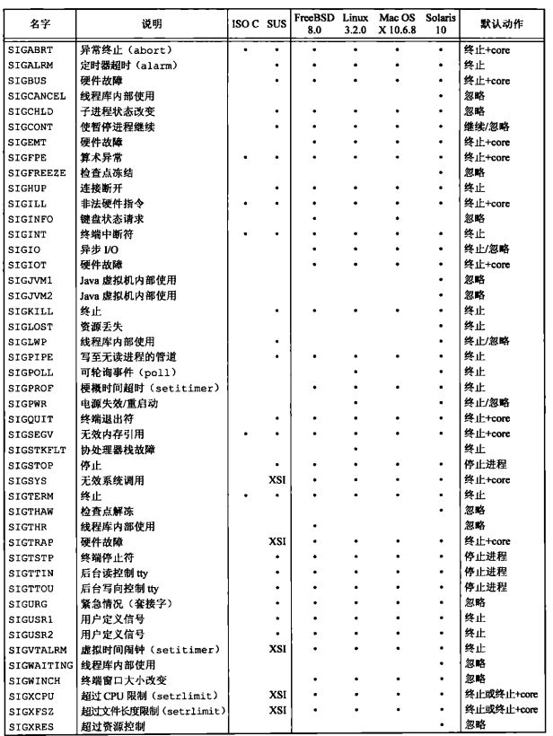
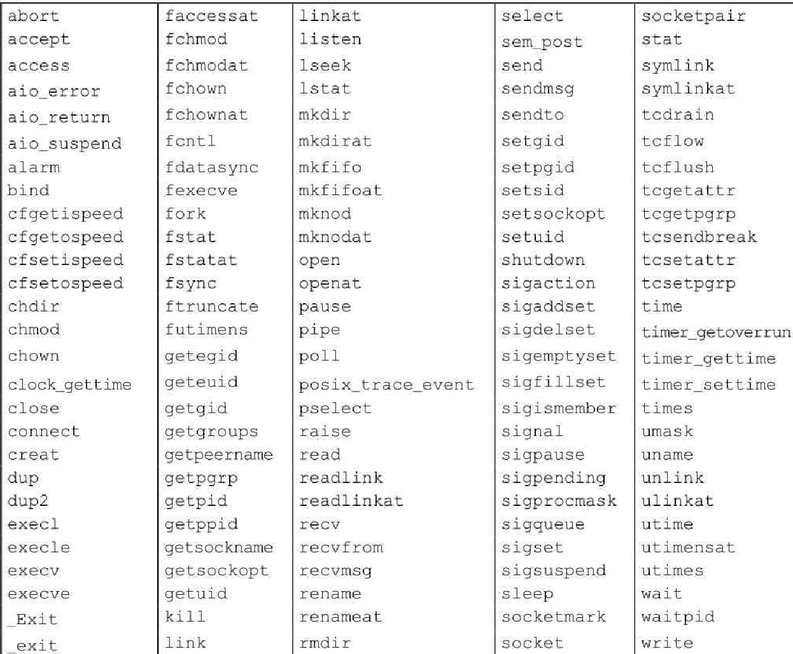

### Signal

#### 信号概念

信号用于通知进程发生了某种情况。进程有以下 3 种处理信号的方式

* 忽略信号
* 按系统默认方式处理
* 提供一个函数，信号发生时调用该函数，这被称为捕捉该信号

很多情况都会产生信号。终端键盘上有两种产生信号的方法，分别为中断键和推出健，它们被用于中断当前运行的进程。另一种产生信号的方法是调用 `kill` 函数。在一个进程中调用此函数就可以向另一个进程发送一个信号。（当向一个进程发送信号时，我们必须是那个进程的所有者或超级用户）

每个信号以 3 个字符 `SIG` 开头，信号是软件中断。信号提供了一种处理异步事件的方法。产生信号的事件对进程而言是随机出现的。进程不能简单地测试一个变量（如 `errno`)来判断是否发送了一个信号，而是必须告诉内核：在此信号发生时，请执行下列操作。

在某个信号出现时，可以告诉内核按下列 3 种方式进行处理

* 忽略此信号：大多数信号都可以使用这种方式进行处理，但有两种信号却决不能被忽略 （`SIGKILL`, `SIGSTOP`),这两种信号不能被忽略是：它们向内核和超级用户提供了使进程终止或停止地可靠方法。另外，如果忽略某些由硬件异常产生地信号（非法内存引用或除0），则进程的运行行为是未定义
* 捕捉信号：通知内核在某种信号发生时，调用一个用户函数。在用户函数中，可执行用户希望对这种事件进行地处理，不能捕捉 `SIGKILL` 和 `SIGSTOP` 信号
* 执行系统默认动作，大多数信号地系统默认动作时终止该进程

在头文件 `<signal.h>` 中，信号名都被定义为正整数常量（信号编号）Linux 3.2 将信号定义在 `<bits/signum.h>` 中。

不存在编号为 0 的信号，`kill` 函数对信号编号 0 有特殊应用，POSIX.1 将此种信号编号值称为空信号

在系统默认动作列，"终止+core" 表示在进程当前工作目录地 `core` 文件中复制了该进程的内存映像（该文件名为 `core`）。大多数 `UNIX` 系统调试程序都使用 `core` 文件检查进程终止时地状态

产生 core 文件时大多数 UNIX 系统的实现功能。虽然该功能不是 POSIX.1 的组成部分，但在 SUS 的 XSI 扩展部分中，这一功能作为一个潜在的特定实现的动作被提及

在不同的实现中，core 文件的名字可能不同：在 FreeBSD 8.0 中，core 文件名为 `cmdname.core`，其中 `cmdname` 是接收到信号的进程所执行的命令名。在 Mac OS X 10.6.8 中，core 文件名是 `core.pid`，其中，`pid` 是接收到信号的进程的ID。（这些系统允许经 `sysctl` 参数配置 core 文件名。在 Linux 3.2.0 中，core 文件名通过 `/proc/sys/kernel/core_pattern` 进行配置）

大多数实现在相应进程的工作目录中包含 core 文件项（Mac OS X 将所有 core 文件防止在 `/cores` 目录中）

下列条件下不产生 `core` 文件

* 进程是设置用户 ID 的，而且当前用户并非程序文件的所有者
* 进程是设置组 ID 的，而且当前用户并非该程序文件的组所有者
* 用户没有写当前工作目录的权限
* 文件已存在，而且用户对该文件设有写权限
* 文件太大。`core` 文件的权限通常是用户读/写

`unix` 系统信号



* SIGABRT 调用 abort 函数时产生此信号，进程异常终止
* SIGALRM 当用 alarm 函数设置的定时器超时时，产生此信号，若由 `setitimer` 函数设置的间隔时间已经超时时，也产生此信号
* SIGBUS 指示一个实现定义的硬件故障。当出现某些类型的内存故障时，实现常常产生此种信号
* SIGCANCEL 这是 Solaris 线程库内部使用的信号，它不适用于一般应用
* SIGCHLD 在一个进程终止或停止时，SIGCHLD 信号被送给其父进程。按系统默认，将忽略此信号。如果父进程希望被告知其子进程的这种状态改变，则应捕捉此信号。信号捕捉函数中通常要调用一种 wait 函数以取得子进程 ID 和其终止状态。System V 的早期版本有一个名为 SIGCLD（无H）的类似信号。这一信号具有与其他信号不同的语义，SVR2 的手册页警告在新的程序中尽量不要使用这种信号。（令人奇怪的是，在SVR3 和 SVR4 版的手册页中，该警告消失了。）应用程序应当使用标准的 SIGCHLD 信号，但应了解，为了向后兼容，很多系统定义了与 SIGCHLD 等同的 SIGCLD 。如果有使用 SIGCLD 的软件，需要查阅系统手册，了解它具体的语义
* SIGCONT 此作业控制信号发送给需要继续运行，但当前处于停止状态的进程。如果接收到此信号的进程处于停止状态，则系统默认动作是使该进程继续运行；否则默认动作是忽略此信号。
* SIGEMT 指示一个实现定义的硬件故障
* SIGFPE 表示一个算术运算异常。如除 0，浮点溢出等
* SIGFREEZE 此信号仅由 Solaris 定义。它用于通知进程在冻结系统状态之前需要采取特定动作，例如当系统进入休眠或挂起状态时可能需要做这种处理。
* SIGHUP 如果终端接口检测到一个连接断开，则将此信号送给与该终端相关的控制进程（会话首进程）。此信号被送给 session 结构中 `s_leader` 字段所指向的进程。仅当终端的 CLOCAL 标志没有设置时，在上述条件下才产生此信号。（如果所连接的终端是本地的，则设置该终端的 CLOCAL 标志。它告诉终端驱动程序忽略所有调制解调器的状态行
* SIGILL 此信号表示进程已执行一条非法硬件指令
* SIGINFO 这是一种 BSD 信号，当用户按状态键（一般采用Ctrl+T）时，终端驱动程序产生此信号并发送至前台进程组中的每一个进程。此信号通常造成在终端上显示前台进程组中各进程的状态信息。Linux 不支持该信号
* SIGINT 当用户按中断键（一般采用 Delete 或 Ctrl+C）时，终端驱动程序产生此信号并发送至前台进程组中的每一个进程。当一个进程在运行时失控，特别是它正在屏幕上产生大量不需要的输出时，常用此信号终止它
* SIGIO 此信号指示一个异步 I/O 事件。Linux 3.2.0和Solaris 10将SIGIO定义为与SIGPOLL具有相同值，所以默认行为是终止该进程。在FreeBSD 8.0和Mac OS X 10.6.8中，默认行为是忽略该信号
* SIGIOT 指示一个实现定义的硬件故障。FreeBSD 8.0、Linux 3.2.0、Mac OS X 10.6.8和Solaris 10将SIGIOT定义为与SIGABRT具相同值
* SIGKILL 这是两个不能被捕捉或忽略信号中的一个。它向系统管理员提供了一种可以杀死任一进程的可靠方法
* SIGPIPE 如果在管道的读进程已终止时写管道，则产生此信号。当类型为 SOCK_STREAM 的套接字已不再连接时，进程写该套接字也产生此信号
* SIGPOLL 这个信号在 SUSv4 中已被标记为弃用，将来的标准可能会将此信号移除。当在一个可轮询设备上发生一个特定事件时产生此信号。它起源于 SVR3，与 BSD 的 SIGIO 和 SIGURG 信号接近。在 Linux 和 Solaris 中，SIGPOLL 定义为与 SIGIO 具有相同值
* SIGPROF 这个信号在 SUSv4 中已被标记为弃用，将来的标准可能会将此信号移除。当 `setitimer(2)` 函数设置的梗概统计间隔定时器（profiling interval timer）已经超时时产生此信号
* SIGPWR 这是一种依赖于系统的信号。它主要用于具有不间断电源（UPS）的系统。如果电源失效，则 UPS 起作用，而且通常软件会接到通知。在这种情况下，系统依靠蓄电池电源继续运行，所以无须做任何处理。但是如果蓄电池也将不能支持工作，则软件通常会再次接到通知，此时，系统必项使其各部分都停止运行。这时应当发送 SIGPWR 信号。在大多数系统中，接到蓄电池电压过低信息的进程将信号 `SIGPWR` 发送给 `init` 进程，然后由 `init` 处理停机操作
* SIGQUIT 当用户在终端上按退出键（一般采用Ctrl+\）时，中断驱动程序产生此信号，并发送给前台进程组中的所有进程。此信号不仅终止前台进程组（如 SIGINT 所做的那样），同时产生一个 core 文件
* SIGSEGV 指示进程进行了一次无效的内存引用（通常说明程序有错，比如访问了一个未经初始化的指针），SEGV 代表 “段违例”（segmentation violation)
* SIGSEGV 指示进程进行了一次无效的内存引用（通常说明程序有错，比如访问了一个未经初始化的指针）
* SIGSTOP 这是一个作业控制信号，它停止一个进程。它类似于交互停止信号（SIGTSTP），但是 SIGSTOP 不能被捕捉或忽略
* SIGSYS 该信号指示一个无效的系统调用。由于某种未知原因，进程执行了一条机器指令，内核认为这是一条系统调用，但该指令指示系统调用类型的参数却是无效的。这种情况是可能发生的，例如，若用户编写了一道使用新系统调用的程序，然后运行该程序的二进制可执行代码，而所用的操作系统却是不支持该系统调用的较早版本，于是就出现上述情况
* SIGTERM 这是由 `kill(1)` 命令发送的系统默认终止信号。由于该信号是由应用程序捕获的，使用 SIGTERM 也让程序有机会在退出之前做好清理工作，从而优雅地终止（相对于 SIGKILL 而言。SIGKILL 不能被捕捉或者忽略）
* SIGTHAW 此信号仅由Solaris定义。在被挂起的系统恢复时，该信号用于通知相关进程，它们需要采取特定的动作
* SIGTHR FreeBSD线程库预留的信号，它的值定义或与SIGLWP相同
* SIGTRAP 指示一个实现定义的硬件故障
* SIGTSTP 交互停止信号，当用户在终端上按挂起键（一般采用 Ctrl+Z）时，终端驱动程序产生此信号。该信号发送至前台进程组中的所有进程
* SIGTTIN 当一个后台进程组进程试图读其控制终端时，终端驱动程序产生此信号。在下列例外情形下不产生此信号：（a）读进程忽略或阻塞此信号；（b）读进程所属的进程组是孤儿进程组，此时读操作返回出错，`errno` 设置为EIO
* SIGTTOU 当一个后台进程组进程试图写其控制终端时，终端驱动程序产生此信号，与上面所述的 SIGTTIN 信号不同，一个进程可以选择允许后台进程写控制终端。如果不允许后台进程写，则与 SIGTTIN 相似，也有两种特殊情况：（a）写进程忽略或阻塞此信号；（b）写进程所属进程组是孤儿进程组。在第2种情况下不产生此信号，写操作返回出错，`errno` 设置为 EIO
* SIGURG 此信号通知进程已经发生一个紧急情况。在网络连接上接到带外的数据时，可选择地产生此信号
* SIGUSR1 这是一个用户定义的信号，可用于应用程序
* SIGUSR1 这是一个用户定义的信号，可用于应用程序
* SIGVTALRM 当一个由 `setitimer(2)` 函数设置的虚拟间隔时间已经超时时，产生此信号
* SIGWAITING 此信号由Solaris线程库内部使用，不做他用
* SIGWINCH 内核维持与每个终端或伪终端相关联窗口的大小。进程可以用 `ioctl` 函数得到或设置窗口的大小。如果进程用 `ioctl` 的设置窗口大小命令更改了窗口大小，则内核将 SIGWINCH 信号发送至前台进程组。
* SIGXCPU SUS 的 XSI 扩展支持资源限制的概念。如果进程超过了其软 CPU 时间限制，则产生此信号
* SIGXFSZ 如果进程超过了其软文件长度限制，则产生此信号

#### signal

unix 系统信号机制最简单的接口时 signal 函数

```c
#include <signal.h>
/**
 * @param signo 信号名
 * @param func 的值是常量 SIG_IGN（忽略，SIGKILL 和 SIGSTOP 除外）、常量 SIG_DEL（默认动作）、或接到此
 *             信号后要调用的函数（信号捕捉 signal-catching function / 信号处理程序 signal-handler ）的
 *             地址
 * @return 返回值，返回以前的信号处理配置；若出错，返回 SIG_ERR
**/
void (*signal(int signo, void (*func)(int)))(int);
```

signal函数由ISO C定义。因为 ISO C 不涉及多进程、进程组以及终端 I/O 等，所以它对信号的定义非常含糊，以致于对UNIX 系统而言几乎毫无用处

shell 自动将后台进程对中断和退出信号的处理方式设置为忽略，于是，当按下中断字符时就不会影响后台进程。

当一个进程调用 `fork` 时，其子进程继承父进程的信号处理方式，信号捕捉函数的地址在子进程中是有意义的

#### 不可靠信号

在早期的UNIX版本中（如V7），信号是不可靠的。不可靠在这里指的是，信号可能会丢失：一个信号发生了，但进程却可能一直不知道这一点。同时，进程对信号的控制能力也很差，它能捕捉信号或忽略它。有时用户希望通知内核阻塞某个信号：不要忽略该信号，在其发生时记住它，然后在进程做好了准备时再通知它。这种阻塞信号的能力当时并不具备

4.2BSD对信号机制进行了更改，提供了被称为可靠信号的机制。然后，SVR3也修改了信号机制，提供了System V可靠信号机制。POSIX.1选择了BSD模型作为其标准化的基础

进程每次接到信号对其进行处理时，随即将信号动作重置为默认值。

进程调用 `pause` 函数使自己休眠，直到捕捉到一个信号。当捕捉到信号时，信号处理程序将标志 `sig_int_flag` 设置为非 0 值。从信号处理程序返回后，内核自动将该进程唤醒，它检测到该标志为非0，然后执行它所需做的。但是这里有一个时间窗口，在此窗口中操作可能失误。如果在测试 `sig_int_flag` 之后、调用 `pause` 之前发生信号，则此进程在调用`pause` 时可能将永久休眠（假定此信号不会再次产生）。于是，这次发生的信号也就丢失了。

#### 中断的系统调用

早期UNIX系统的一个特性是：如果进程在执行一个低速系统调用而阻塞期间捕捉到一个信号，则该系统调用就被中断不再继续执行。该系统调用返回出错，其 `errno` 设置为 EINTR。这样处理是因为一个信号发生了，进程捕捉到它，这意味着已经发生了某种事情，所以是个好机会应当唤醒阻塞的系统调用

当捕捉到某个信号时，**被中断的是内核中执行的系统调用**。为了支持这种特性，将系统调用分成两类：低速系统调用和其他系统调用。低速系统调用是可能会使进程永远阻塞的一类系统调用，包括：

* 如果某些类型文件（如读管道、终端设备和网络设备）的数据不存在，则读操作可能会使调用者永远阻塞；
* 如果这些数据不能被相同的类型文件立即接受，则写操作可能会使调用者永远阻塞；
* 在某种条件发生之前打开某些类型文件，可能会发生阻塞（例如要打开一个终端设备，需要先等待与之连接的调制解调器应答）；
* `pause` 函数（按照定义，它使调用进程休眠直至捕捉到一个信号）和 `wait` 函数；
* 某些 `ioctl` 操作；
* 某些进程间通信函数

在这些低速系统调用中，一个值得注意的例外是与磁盘I/O有关的系统调用。虽然读、写一个磁盘文件可能暂时阻塞调用者（在磁盘驱动程序将请求排入队列，然后在适当时间执行请求期间），但是除非发生硬件错误，I/O操作总会很快返回，并使调用者不再处于阻塞状态

对于中断的 `read`、`write` 系统调用，POSIX.1 的语义在该标准的2001版有所改变。对于如何处理已 `read`、`write` 部分数据量的相应系统调用，早期版本允许实现自行选择。如若 `read` 系统调用已接收并传送数据至应用程序缓冲区，但尚未接收到应用程序请求的全部数据，此时被中断，操作系统可以认为该系统调用失败，并将 `errno` 设置为 `EINTR`；另一种处理方式是允许该系统调用成功返回，返回值是已接收到的数据量。与此类似，如若 `write` 巳传输了应用程序缓冲区中的部分数据，然后被中断，操作系统可以认为该系统调用失败，并将 `errno` 设置为 EINTR；另一种处理方式是允许该系统调用成功返回，返回值是已写部分的数据量。历史上，从 System V派生的实现将这种系统调用视为失败，而 BSD 派生的实现则处理为部分成功返回。2001 版 POSIX.1 标准采用 BSD 风格的语义

为了帮助应用程序使其不必处理被中断的系统调用，4.2BSD 引进了某些被中断系统调用的自动重启动。自动重启动的系统调用包括：`ioctl`、`read`、`readv`、`write`、`writev`、`wait` 和 `waitpid`。如前所述，其中前5个函数只有对低速设备进行操作时才会被信号中断。而 `wait` 和 `waitpid` 在捕捉到信号时总是被中断。因为这种自动重启动的处理方式也会带来问题，某些应用程序并不希望这些函数被中断后重启动。为此 4.3BSD 允许进程基于每个信号禁用此功能

POSIX.1 要求只有中断信号的 SA_RESTART 标志有效时，实现才重启动系统调用。`sigaction` 函数使用这个标志允许应用程序请求重启动被中断的系统调用。历史上，使用 `signal` 函数建立信号处理程序时，对于如何处理被中断的系统调用，各种实现的做法各不相同：`System V` 的默认工作方式是从不重启动系统调用；BSD 则重启动被信号中断的系统调用；`FreeBSD 8.0`、`Linux 3.2.0`、`Mac OS X 10.6.8` 中，当信号处理程序是用 `signal` 函数时，被中断的系统调用会重启动。

#### 可重入函数

进程捕捉到信号并对其进行处理时，进程正在执行的正常指令序列就被信号处理程序临时中断，它首先执行该信号处理程序中的指令。如果从信号处理程序返回（例如没有调用 `exit` 或 `longjmp`），则继续执行在捕捉到信号时进程正在执行的正常指令序列（这类似于发生硬件中断时所做的）。

但在信号处理程序中，不能判断捕捉到信号时进程执行到何处。SUS 说明了信号处理程序中保证调用安全的函数。这些函数是可重入的并被称为是异步信号安全的（`async-signal safe`），除了可重入以外，在信号处理期间，它会阻塞任何会引起不一致的信号发送。

非可重入函数大多是：它们使用静态数据结构；调用 malloc 或 free；它们是标准 I/O 函数（标准 I/O 库的很多实现都以不可重入方式使用全局数据结构）；信号处理程序调用 `printf` 函数，但这并不保证产生期望的结果，信号处理程序可能中断主程序中的 `printf` 函数调用

*信号处理程序可以调用的可重入函数*



一个通用的规则，当在信号处理程序中调用可重入函数时，应当在调用前保存 `errno`，在调用后恢复 `errno`。（应当了解，经常被捕捉到的信号是 SIGCHLD，其信号处理程序通常要调用一种 `wait` 函数，而各种 `wait` 函数都能改变`errno`）

如果在信号处理程序中调用一个非可重入函数，则其结果是不可预知的

#### 可靠信号术语及语义

* 产生（generation）

  当造成信号的事件发生时，为进程产生一个信号（或向一个进程发送一个信号）事件可以是硬件异常（如除0），软件条件（如 `alarm` 定时器超时），终端产生的信号或调用 `kill` 函数。当一个信号产生时，内核通常在进程表中以某种形式设置一个标志

* 递送（delivery）

   当对信号采取了这种动作（内核在进程表设置标志），即向进程递送了一个信号

* 未决的（pending）

  在信号产生和递送之间的时间间隔内，即信号是未决的

进程可以选用“阻塞信号递送”。如果为进程产生了一个阻塞的信号，而且对该信号的动作是系统默认动作或捕捉该信号，则为该进程将此信号保持为未决状态，直到该进程对此信号解除了阻塞，或者将对此信号的动作更改为忽略。内核在递送一个原来被阻塞的信号给进程时（而不是在产生该信号时），才决定对它的处理方式。于是进程在信号递送给它之前仍可改变对该信号的动作。进程调用 `sigpending` 函数来判定那些信号是设置为阻塞并处于未决状态的

如果在进程解除对某个信号的阻塞之前，这种信号发生了多次，`posix.1` 允许系统递送该信号一个或多次。如果递送该信号多次，则称这些信号进行了排队。但除非支持 POSIX.1 实时扩展，否则大多数 UNIX 系统只递送这种信号一次

如果有多个信号要递送给一个进程，POSIX.1 并没有规定这些信号的递送顺序，但是 POSIX.1 的基础部分建议：在其他信号之前递送与进程当前状态有关的信号，如 `SIGSEGV`

每个进程都有一个信号屏蔽字（signal mask），它规定了当前要阻塞递送到该进程的信号集。对于每种可能的信号，该屏蔽字中都有一位与之对应。对于某种信号，若其对应位已设置，则它当前是被阻塞的。进程可以调用 `sigprocmask` 来检测和更改当前信号屏蔽字。

信号编号可能会超过一个整型所包含的二进制位数，因此 POSIX.1 定义了一个新数据类型 `sigset_t`，它可以容纳一个信号集

#### kill 和 raise

`kill` 函数将信号发送给进程或进程组。`raise` 函数则允许进程向自身发送信号（`raise` 最初是由 ISO C 定义的。后来，为了与 ISO C 标准保持一致，POSIX.1也包括了该函数。但是 POSIX.1 扩展了 `raise` 的规范，使其可处理线程）

```c
#include <signal.h>
// 两个函数返回值，若成功，返回 0，若出错，返回 -1
/**
 * @params pid > 0 将信号发送给进程 ID 为 pid 的进程
 *             = 0 将信号发送给与发送进程属于同一进程组的所有进程（这些进程的进程组 ID 等于发送进程的进程
 *                 组 ID，不包括系统进程集），而且发送进程具有权限向这些进程发送信号
 *             < 0 将该信号发送给其进程组 ID 等于 pid 的绝对值，而且发送进程具有权限向其发送信号的所有进
 *                 程。（系统进程集除外）
 *             = -1 将该信号发送给发送进程有权限向它们发送信号的所有进程，不包括系统进程集
 *                 
 **/
int kill(pid_t pid, int signo);
/**
 * raise(signo) 等价 kill(getpid(), signo)
 **/
int raise(int signo);  
```

进程将信号发送给其他进程需要权限：超级用户可将信号发送给任一进程。对于非超级用户，其基本规则是发送者的实际用户 ID 或有效用户 ID 必须等于接收者的实际用户 ID 或有效用户 ID。如果实现支持 `_POSIX_SAVED_IDS` （POSIX.1）则检查接收者的保存设置用户 ID（而不是有效用户 ID)；如果被发送的信号是 `SIGCONT`，则进程可将它发送给属于同一会话的任一其他进程。

### alarm 和 pause

使用 alarm 函数可以设置一个定时器（闹钟时间），在将来的某个时刻决定该定时器会超时。当定时器超时时，产生 `SIGALRM` 信号。如果忽略或不捕捉此信号，则其默认动作是终止调用该 `alarm` 函数的进程

```c
#include <unistd.h>
unsigned int alarm(unsigned int seconds) // 返回值：0或以前设置的闹钟时间的余留秒数
```

参数 `seconds` 的值是产生 `SIGALRM` 需要经过的时钟秒数。当这一时刻到达时，信号由内核产生，由于进程调度的延迟，所以进程得到控制从而能够处理该信号还需要一个时间间隔。每个进程只能有一个闹钟时间。如果在调用 `alarm` 时，之前已为该进程注册的闹钟时间还没有超时，则该闹钟时间的余留值作为本次 `alarm` 函数调用的值返回。以前注册的闹钟时间则被新值代替。如果有以前注册的尚未超过的闹钟时间，而且本次调用的 `seconds` 值是 0，则取消以前的闹钟时间，其余留值仍作为 `alarm` 函数的返回值

虽然 `SIGALRM` 的默认动作是终止进程，但是大多数使用闹钟的进程捕捉此信号。如果此时进程要终止，则在终止之前它可以执行所需的清理操作。如果想捕捉 `SIGALRM` ,则必须在调用 `alarm` 之前安装该信号的处理程序。如果我们先调用 `alarm` ，然后在我们能够安装 `SIGALRM` 处理程序之前已接到该信号，那么进程将终止。

`pause` 函数使调用进程挂起直至捕捉到一个信号

```c
#include <unistd.h>
int pause(void)			// 返回值： -1，errno 设置为 ETNTR
```

只有执行了一个信号处理程序并从其返回时，`pause` 才返回。在这种情况下，`pause` 返回 -1，`errno` 设置为 `EINTR`

### `sleep`, `nanosleep` `clock_nanosleep`

```c
#include <unistd.h>
unsigned int sleep(unisgned int seconds);
```

此函数使调用进程被挂起直到满足下面两个条件之一

* 已经过了 `seconds` 所指定的墙上时钟时间。返回值 0
* 调用进程捕捉到一个信号并从信号处理程序返回，返回未休眠完的秒数（所要求的时间减去实际休眠时间）

### `sinqueue`

通常一个信号带有一个位信息：信号本身。除了对信号排队以外，这些扩展允许应用程序在递交信号时传递更多的信息。这些信息嵌入在 `siginfo` 结构中。除了系统提供的信息，应用程序还可以向信号处理程序传递整数或者指向包含更多信息的缓冲区指针。使用排队信号必须做以下几个操作：

* 使用 `sigaction` 函数安装信号处理程序时指定 `SA_SIGINFO` 标志。如果没有给出这个标志，信号会延迟，但信号是否进入队列要取决于具体实现

* 在 `sigaction` 结构的 `sa_sigaction` 成员中（而不是普通的 `sa_handler` 字段）提供信号处理程序。实现可能允许用户使用 `sa_handler` 字段，但不能获取 `sigqueue` 函数发送出来的额外信息

* 使用 `sigqueue` 函数发送信号

  ```c
  # include <signal.h>
  // 返回值：若成功，返回 0； 若出错，返回 -1
  int sigqueue(pid_t pid, int signo, const union sigval value);
  ```

  `sigqueue` 函数只能把信号发送给单个进程，可以使用 `value` 参数向信号处理程序传递整数和指针值，除此之外，`sigqueue` 函数与 `kill` 函数类似。信号不能被无限排队。到达相应的限制后，`sigqueue` 就会失败，将 `error` 设为 `EAGAIN`

### 作业控制信号

`POSIX.1` 认为以下 6 个与作业控制有关

* `SIGCHLD`  子进程已停止或终止
* `SIGCONT`   如果进程已停止，则使其继续运行
* `SIGSTOP`    停止信号（不能被捕捉或忽略）
* `SIGTSTP`     交互式停止信号
* `SIGTTIN`     后台进程组成员读控制终端
* `SIGTTOU`     后台进程组成员写控制终端

除 `SIGCHLD` 以外，大多数应用程序并不处理这些信号，交互式 `shell` 则通常会处理这些信号的所有工作。当键入挂起字符（通常是 `Ctrl+Z`) 时，`SIGTSTP` 被送至前台进程组的所有进程。当我们通知 `shell` 在前台或后台恢复运行一个作业，`shell` 向该作业中的所有进程发送 `SIGCONT` 信号。与此类似，如果向一个进程递送了 `SIGTTIN` 或 `SIGTTOU` 信号，则根据系统默认的方式，停止此进程，作业控制 `shell` 了解这一点后就通知我们。在作业控制信号间有某些交互。当对一个进程产生 4 种停止信号 （`SIGTSTP`, `SIGSTOP`, `SIGTTIN`, `SIGTTOU`) 中的任意一种时，对该进程的任一未决 `SIGCONT` 信号就被丢弃。与此类似，当对一个进程产生 `SIGCONT` 信号时，对同一进程的任一未决停止信号被丢弃。如果进程是停止的，则 `SIGCONT` 的默认动作是继续该进程；否则忽略此信号。通常，对该信号无需做任何事情。当对一个停止的进程产生一个 `SIGCONT` 信号时，该进程就继续，即使该信号是被阻塞或忽略的也是如此。