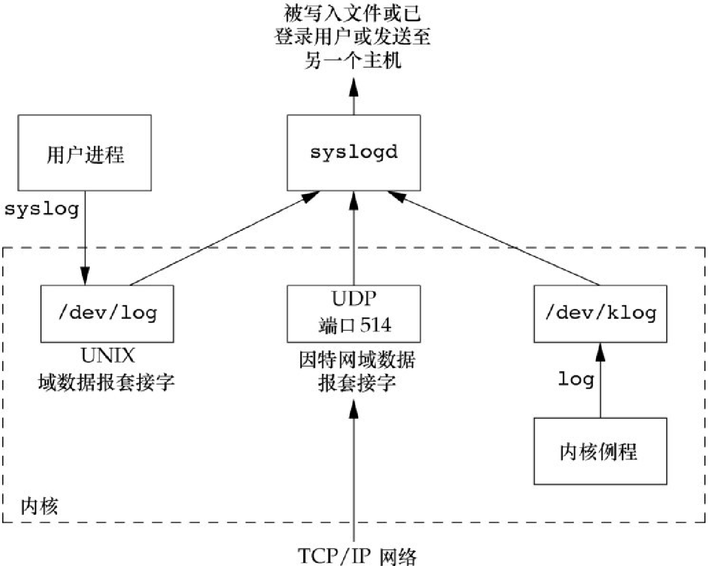
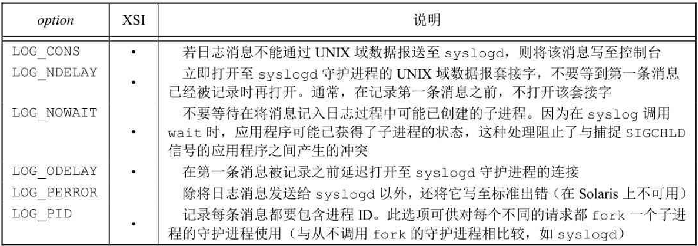

### 守护进程

#### 概述

守护进程（daemon）是生存期长的一种进程。它们常常在系统引导入时启动，仅在系统关闭时才终止。因为它们没有控制终端，所以说它们是在后台运行的。UNIX 系统有很多守护进程，它们执行日常事务活动

系统进程依赖于操作系统的实现。父进程 ID 为 0 的各进程通常是内核进程，它们作为系统引导装入过程的一部分而启动。内核进程是特殊的，通常存在于系统的整个生命期中。它们以超级用户特权运行，无控制终端，无命令行。在 `ps` 命令的输出实例中，内核守护进程的名字（`COMMAN`）出现在方括号（`[]`）中

大多数守护进程以超级用户运行。所有的守护进程没有控制终端，其终端名（`TTY`）为问号（`?`）。内核守护进程以无控制终端方式启动。用户层守护进程缺少控制终端可能是守护进程调用了 `setsid` 的结果。大多数用户守护进程都是进程组的组长进程以及会话的首进程。而且是这些进程组和会话中的唯一进程（`rsyslogd` 是一个例外）。用户层守护进程的父进程是 `init` 进程

#### Linux 中常见的守护进程

* `kswapd` 守护进程也称为内存换页守护进程。它支持虚拟内存子系统在经过一段时间后将脏页面慢慢地写回磁盘来回收这些页面
* `flush` 守护进程在可用内存达到设置的最小阈值时将脏页面冲洗至磁盘。它也定期的将脏页面冲洗回磁盘来减少在系统出现故障时发生的数据丢失。多个冲洗守护进程可以同时存在，每个写回的设备都有一个冲洗守护进程。`flush-8:0` 的冲洗守护进程（写回设备时通过主设备号 8 和副设备号 0 来识别的）
* `sync_supers` 守护进程定期将文件系统元数据冲洗至磁盘
* `jbd` 守护进程帮助实现 `ext4` 文件系统中的日志功能
* 进程 1 通常时 `init` ,它是一个系统守护进程。除了其他工作外，主要负责启动各运行层次特定的系统服务。这些服务通常是在它们自己拥有的守护进程的帮助下实现的。
* `rpcbind` 守护进程提供将远程过程调用程序号映射为网络端口号的服务。
* `rsyslogd` 守护进程可以由管理员启用的将系统消息记入日志的任何程序使用。可以在一台实际的控制台上打印这些消息，也可将它们写到一个文件中。
* `inetd` 守护进程，它侦听网络接口，以便取得来自网络的对各种网络服务进程的请求。`nfsd`,`nfsiod`,`lockd`,`rpciod`,`rpc.idmapd`,`roc.statd`,`roc.mountd` 守护进程提供对网络文件系统的支持，前 4 个是内核守护进程，后 3 个是用户级守护进程
* `cron` 守护进程在定期安排的日期和时间执行命令。
* `atd` 守护进程与 `cron` 类似，它允许用户在指定的时间执行任务，但是每个任务它只执行一次。
* `sshd` 守护进程提供了安全的远程登录和执行设施。

#### 编程规则

在编写守护进程时需遵循一些基本规则：

* 首先调用 `umask` 将文件模式创建屏蔽字设置为一个已知值（通常是 0）。由继承得来的文件模式屏蔽字可能会被设置为拒绝某些权限。如果守护进程要创建文件，那么它可能要设置特定的权限。
* 调用 fork，然后使用父进程 exit。。这样做实现了下面几点。第一，如果该守护进程是作为一条简单的shell命令启动的，那么父进程终止会让shell认为这条命令已经执行完毕。第二，虽然子进程继承了父进程的进程组 ID，但获得了一个新的进程 ID，这就保证了子进程不是一个进程组的组长进程。这是下面将要进行的 `setsid` 调用的先决条件
* 调用 `setsid` 创建一个新会话，使调用进程：成为新会话的首进程，成为一个新进程组的组长进程，没有控制终端
* 将当前工作目录更改为根目录。从父进程处继承过来的当前工作目录可能在一个挂载的文件系统中。因为守护进程通常在系统再引导之前是一直存在的，所以如果守护进程的当前工作目录在一个挂载文件系统中，那么该文件系统就不能被卸载
* 关闭不再需要的文件描述符。这使守护进程不再持有从其父进程继承来的任何文件描述符（父进程可能是 shell 进程，或某个其他进程）。可以使用 `open_max` 函数或 `getrlimit` 函数来判定最高文件描述符值，并关闭直到该值的所有描述符
* 某些守护进程打开 `/dev/null` 使其具有文件描述符0、1、2，这样，任何一个试图读标准输入、写标准输出或标准错误的库例程都不会产生任何效果。因为守护进程并不与终端设备相关联，所以其输出无处显示，也无处从交互式用户那里接收输入。即使守护进程是从交互式会话启动的，但是守护进程是在后台运行的，所以登录会话的终止并不影响守护进程。如果其他用户在同一终端设备上登录，我们不希望在该终端上见到守护进程的输出，用户也不期望他们在终端上的输入被守护进程读取

#### 出错记录

守护进程没有控制终端，使用 `syslog` 处理守护进程出错记录

*BSD的syslog设施*



有以下 3 种产生日志消息的方法

* 内核例程可以调用 `log` 函数，任何一个用户进程都可以通过打开 `open` 并读取 (read) `/dev/klog` 设备来读取这些消息。
* 大多数用户进程调用 `syslog` 函数来产生日志消息。
* 无论一个用户进程是在此主机上，还是在通过 TCP/IP 网络连接到此主机的其他主机上，都可将日志消息发向 UDP 端口 504。`syslog` 函数从不产生这些 UDP 数据报，它们要求产生此日志消息的进程进行显式的网络编程

通常 `syslogd` 守护进程读取所有 3 种格式的日志消息。此守护进程在启动时读一个配置文件，其文件名一般为 `/etc/syslog.cong`。该文件决定了不同种类的消息应送向何处

```c
#include <syslog.h>
void openlog(const char *ident, int option, int facility);
void syslog(int priority, const char *format, ...);
void closelog(void);
int setlogmask(int maskpri);
```

调用 `openlog` 是可选择的，如果不调用 `openlog`，则在第一次调用 `syslog` 时，自动调用 `openlog`。调用 `closelog` 也是可选择的，它只是关闭曾被用于与 `syslogd` 守护进程运行通信的描述符

调用 `openlog` 可以指定一个 `ident`，以后，此 `ident` 将被加至每则日志消息中。`ident` 一般是程序的名称（如`cron`、`inetd`）。`option` 参数是指定各种选项的位屏蔽

*openlog的option参数*



#### 守护进程惯例

* 若守护进程使用锁文件，那么该文件通常存储在 `/var/run` 目录中。守护进程可能需要具有超级用户权限才能在此目录下创建文件。锁文件的名字通常是 `name.pid`, `name` 是该守护进程或服务的名字。如 `/var/run/crond.pid`
* 若守护进程支持配置选项，那么配置文件通常存放在 `/etc` 目录中，配置文件的名字通常是 `name.conf` ,`name` 是该守护进程或服务的名字。`/etc/syslog.conf`
* 守护进程可用命令行启动，但通常它们是由系统初始化脚本之一 `/etc/rc*` 或 `/etc/init.d/*` 启动的。如果在守护进程终止时，应当自动重启，可在 `/etc/inittab`中为该守护进程包括 `respawn` 记录项，这样，`init` 就将重新启动该守护进程。
* 若一个守护进程有一个配置文件，那么当该守护进程启动时会读该文件，但在此之后一般就不会查看它。如果更改了配置文件，则要重启生效。某些守护进程将捕捉 `SIGHUP` 信号，当收到该信号时，重新读配置文件。因为守护进程并不与终端相结合，它们或者是无控制终端的会话首进程，或者是孤儿进程组的成员，所以守护进程没有理由期望接收 `SIGHUP`。于是守护进程可以安全的重复使用 `SIGHUP`

