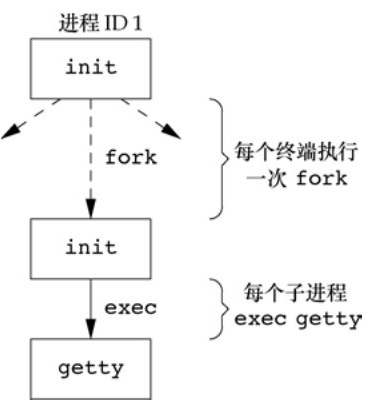
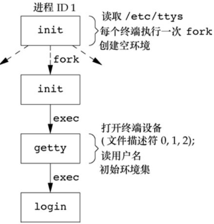
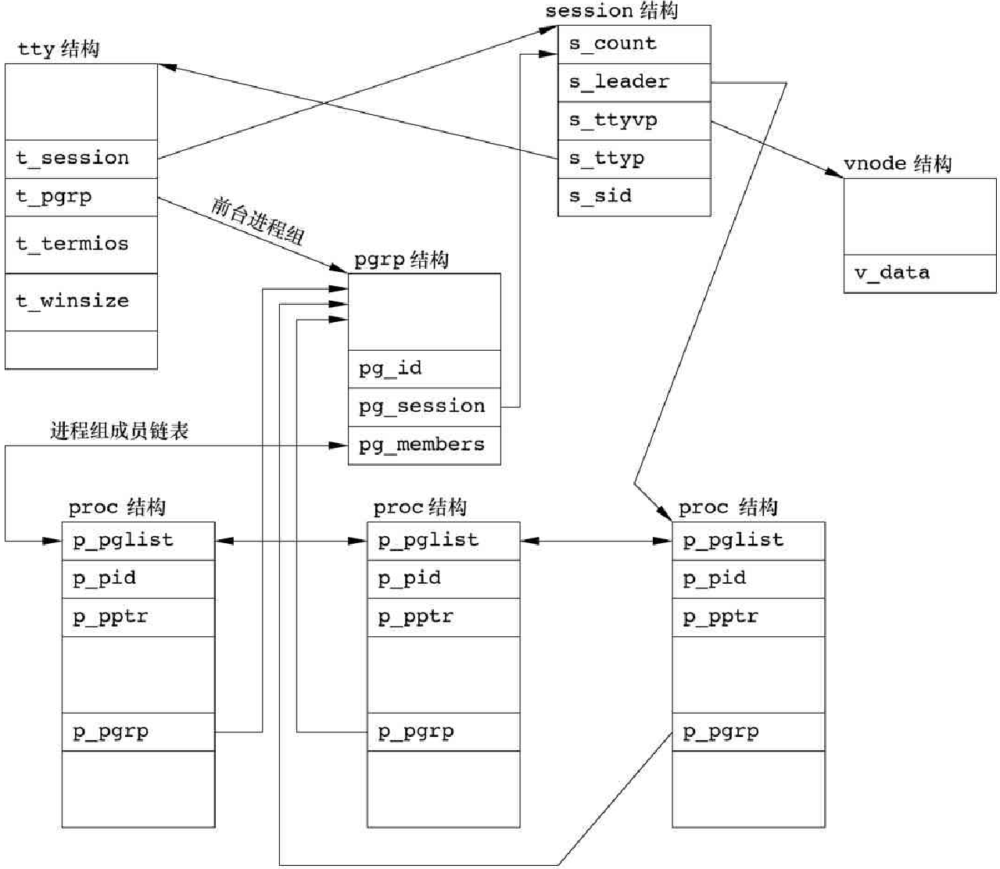

### 进程关系

#### 终端登录

在早期的UNIX系统（如V7）中，用户用哑终端（用硬连接连到主机）进行登录。终端或者是本地的（直接连接）或者是远程的（通过调制解调器连接）。在这两种情况下，登录都经由内核中的终端设备驱动程序。例如，在PDP-11上常用的设备是DH-11和DZ-11。因为连到主机上的终端设备数是固定的，所以同时的登录数也就有了已知的上限

随着位映射图形终端的出现，开发了窗口系统，它向用户提供了与主机系统进行交互的新方式。创建终端窗口的应用也被开发出来，它仿真了基于字符的终端，使得用户可以用熟悉的方式（即通过 shell 命令行）与主机进行交互

* BSD 终端登录

  在过去 35 年中，BSD 终端登录过程并没有多少改变。系统管理者创建通常名为 `/etc/ttys` 的文件，其中，每个终端设备都有一行，每一行说明设备名和传到 `getty` 程序的参数。例如，其中一个参数说明了终端的波特率等。当系统自举时，内核创建进程ID 为1 的进程，也就是 `init` 进程。`init` 进程使系统进入多用户模式。`init` 读取文件 `/etc/ttys`，对每一个允许登录的终端设备，`init` 调用一次 `fork`，它所生成的子进程为 `exec getty` 程序

  `getty` 对终端设备调用 `open` 函数，以读、写方式将终端打开。如果设备是调制解调器，则 `open` 可能会在设备驱动程序中滞留，直到用户拨号调制解调器，并且线路被接通。一旦设备被打开，则文件描述符 0、1、2 就被设置到该设备。然后 `getty` 输出 `login:` 之类的信息，并等待用户键入用户名。如果终端支持多种速度，则 `getty` 可以测试特殊字符以便适当地更改终端速度（波特率）。当用户键入用户名后，`getty` 的工作就完成了，然后以类似下列的方式调用 login 程序

  ```c
  execle("/bin/login", "login", "-p", username, (char *)0, envp);
  ```

  *为允许终端登录，init 调用的进程*

  

  *login登录调用进程*

  

`login` 能处理多项工作。因为它得到了用户名，所以能调用 `getpwnam` 取得相应用户的口令文件登录项。然后调用`getpass(3)` 以显示提示 `Password：`，接着读用户键入的口令（自然，禁止回显用户键入的口令）。它调用 `crypt(3)` 将用户键入的口令加密，并与该用户在阴影口令文件中登录项的 `pw_passwd` 字段相比较。如果用户几次键入的口令都无效，则 `login` 以参数 1 调用 `exit` 表示登录过程失败。父进程（`init`）了解到子进程的终止情况后，将再次调用 `fork`，其后又执行了 `getty`，对此终端重复上述过程

如果用户正确登录，`login` 就将完成如下工作：

* 将当前工作目录更改为该用户的起始目录 `chdir`
* 调用 `chown` 更改该终端的所有权，使登录用户成为它的所有者
* 将对该终端设备的访问权限改变成“用户读和写"
* 调用 `setgid` 和 `initgroups` 设置进程组的组 ID
* 用 `login` 得到的所有信息初始化环境：起始目录（HOME）、shell（SHELL）、用户名（USER 和 LOGNAME）以及一个系统默认路径（PATH）
* `login` 进程更改为登录用户的用户 ID（`setuid`）并调用该用户的登录 shell，其方式类似于：`execl("/bin/sh", "-sh", char( *)0)`

`argv[0]` 的第一个字符负号“−”是一个标志，表示该 `shell` 被作为登录 `shell` 调用。`shell` 可以查看此字符，并相应地修改其启动过程

登录 shell 读取其启动文件（Bourne shell和Korn shell是 `.profile`，GNU Bourne-again shell是 `.bash_profile、.bash_login.profile`，C shell是 `.cshrc` 和 `.login` ）。这些启动文件通常更改某些环境变量并增加很多环境变量。例如，大多数用户设置他们自己的 PATH 并常常提示实际终端类型（TERM）。当执行完启动文件后，用户最后得到 shell提示符，并能键入命令

* Linux 终端登录

  Linux login命令是从4.3BSD login命令派生出来的。BSD登录过程与Linux登录过程的主要区别在于说明终端配置的方式。

  在System V 的 `init` 文件格式之后，有些 Linux 发行版的 `init` 程序使用了管理文件方式。在这些系统中，`/etc/inittab` 包含配置信息，指定了 `init` 应当为之启动 `getty` 进程的各终端设备。
  其他 Linux 发行版本，如最近的 Ubuntu 发行版，配有称为 “`Upstart` ”的 `init` 程序。使用存放在`/etc/init` 目录的`*.conf` 命名的配置文件。例如，运行`/dev/tty1`上的`getty`需要的说明可能放在`/etc/init/tty1.conf`文件中。
  根据所使用的`getty`版本的不同，终端的特征要么在命令行中说明（如`agetty`），要么在`/etc/gettydefs`文件中说明

#### 网络登录

网络登录时，在终端和计算机之间的连接不再是点到点的，在网络登录情况下，`login` 仅仅时一种可用的服务，与其他网络服务性质相同。系统使用一种称为伪终端 `pseudo terminal` 的软件驱动程序，它仿真串行终端的运行行为，并将终端操作映射为网络操作，反之亦然

#### 进程组

每个进程除了有一进程 ID 之外，还属于一个进程组，进程组是一个或多个进程的集合，通常，它们是在同一作业中结合起来的，同一进程组中的各进程接收来自同一终端的各种信号。每个进程组有一个唯一的进程组 ID，它是一个正整数，并可存放在 `pid_t` 数据类型中

```c
// 返回调用进程的进程组 ID
#include <unistd.h>
pid_t getpgrp(void);
// 返回该进程的进程组 ID, 出错，返回 -1 SUS 定义
pid_t getpgid(pid_t pid); // pid = 0 等价于 getpgrp()
```

每个进程组有一个组长进程。组长进程的进程组 ID 等于其进程 ID。进程组组长可以创建一个进程组，创建该组中的进程，然后终止。只要在某个进程组中有一个进程存在，则该进程组就存在，这与其组长进程是否终止无关。从进程组创建开始到其中最后一个进程离开为止的时间区间称为进程组的生命期。某个进程组中的最后一个进程可以终止，也可以转移到另一个进程组。

```c
#include <unistd.h>
// 进程调用 setpgid 可以加入一个现有的进程组或者创建一个新进程组。
int setpgid(pid_t pid, pid_t pgid); 	// 返回值，成功，0；出错，返回 -1
```

`setpgid` 函数将 `pid` 进程的进程组 ID 设置为 `pgid` 如果这两个参数相等，则由 `pid` 指定的进程变成进程组组长。如果 `pid` 是 0，则使用调用者的进程 ID。如果 `pgid` 是 0，则由 `pid` 指定的进程 ID 用作进程组 ID。一个进程只能为它自己或它的子进程设置进程组 ID。在它的子进程调用了 `exec` 后，它就不再更改该子进程的进程组 ID。

在大多数作业控制 shell 中，在 `fork` 之后调用此函数，使父进程设置其子进程的进程组ID，并且也使子进程设置其自己的进程组ID。这两个调用中有一个是冗余的，但让父进程和子进程都这样做可以保证，在父进程和子进程认为子进程已进入了该进程组之前，这确实已经发生了。如果不这样做，在 `fork` 之后，由于父进程和子进程运行的先后次序不确定，会因为子进程的组员身份取决于哪个进程首先执行而产生竞争条件

#### 会话

会话（session）是一个或多个进程组的集合。通常是由 shell 的管道将几个进程编成一组的


```c
#include <unistd.h>
// 返回值，若成功，返回进程组 ID，若出错，返回 -1
pid_t setsid(void); 		
```

如果调用此函数的进程不是一个进程组的组长，则此函数创建一个新会话。会发生以下 3 件事

1.该进程变成新会话的会话首进程（session leader 会话首进程是创建该会话的进程），此时，该进程是新会话中的唯一进程

2.该进程成为一个新进程组的组长进程 。新进程组组ID是该调用进程的进程ID

3.该进程没有控制终端。如果在调用 `setsid` 之前该进程有一个控制终端，那么这种联系也被切断

如果该调用进程已经是一个进程组的组长，则此函数返回出错。为了保证不处于这种情况，通常先调用fork，然后使其父进程终止，而子进程则继续。因为子进程继承了父进程的进程组 ID，而其进程 ID 则是新分配的，两者不可能相等，这就保证了子进程不是一个进程组的组长

```c
#include <unistd.h>
// 若成功，返回会话首进程的进程组 ID；若出错，返回 -1
pid_t getsid(pid_t pid);
```

如若 `pid` 是0，`getsid` 返回调用进程的会话首进程的进程组ID。出于安全方面的考虑，一些实现有如下限制：如若 `pid`并不属于调用者所在的会话，那么调用进程就不能得到该会话首进程的进程组ID

#### 控制终端

* 一个会话可以有一个控制终端（controlling terminal），通常是终端设备（在终端登录情况下）。或伪终端设备（在网络登录情况下）

* 建立与控制终端连接的会话进程被称为控制进程（controlling process）

* 一个会话中的几个进程组可以被分成一个前台进程组（foreground process group）以及一个或多个后台进程组（background process group）

* 如果一个会话有一个控制终端，则它有一个前台进程组，其他进程组为后台进程组

* 无论何时键入终端的中断键（`Delete`, `Ctrl+C`），都会将中断信号发送至前台进程组的所有进程

* 无论何时键入终端的退出键（`Ctrl+\`)，都会将中断信号发送至前台进程组的所有进程

* 如果终端接口检测到调制解调器（或网络）已经断开连接，则将挂断信号发送至控制进程（会话首进程）

* 进程组，会话和控制终端

  

登陆时，将自动建立控制终端。POSIX.1 将如何分配一个控制终端的机制交给具体实现来选择

当会话首进程打开第一个尚未与一个会话相关联的终端设备时，只要在调用 `open` 时没有指定 `O_NOCTTY` 标志 System V派生的系统将此作为控制终端分配给此会话

当会话首进程用 `TIOCSCTTY` 作为 `request` 参数（第三个参数是空指针）调用`ioctl` 时，基于 BSD 的系统为会话分配控制终端。为使此调用成功执行，此会话不能已经有一个控制终端（通常 `ioctl` 调用紧跟在 `setsid` 调用之后，`setsid`保证此进程是一个没有控制终端的会话首进程）。除了以兼容模式支持其他系统以外，基于 BSD 的系统不使用 POSIX.1中对 `open` 函数所说明的 `O_NOCTTY` 标志

有时不管标准输入、标准输出是否重定向，程序都要与控制终端交互作用。保证程序能与控制终端对话的方法是 `open` 文件 `/dev/tty`。在内核中，此特殊文件是控制终端的同义语。自然地，如果程序没有控制终端，则对于此设备的 `open` 将失败

#### tcgetpgrp、tcsetpgrp、tcgetsid

```c
#include <unistd.h>
// 返回值，若成功，返回前台进程组 ID；若出错，返回 -1
// 返回前台进程组 ID，它与在 fd 上打开的终端相关联
pid_t tcgetpgrp(int fd);
// 返回值，成功，0，出错 -1
// 如果进程有一个控制终端，则该进程可以调用 tcsetpgrp 将前台进程组 ID 设置为 pgrpid。pgrpid 值应当是在同一会话中的一个进程组的ID。fd必须引用该会话的控制终端。
int tcsetpgrp(int fd, pid_t pgrpid);
```

大多数应用程序并不直接调用这两个函数，它们通常由作业控制 shell 调用

```c
// 给出控制 TTY 的文件描述符，通过 tcgetsid 函数，应用程序就能获取会话首进程的进程组 ID
#include <termios.h>
// 返回值，成功，返回会话首进程的进程组 ID，若出错，返回 -1
pid_t tcgetsid(int fd);
```

需要管理控制终端的应用程序可以调用 `tcgetsid` 函数识别出控制终端的会话首进程的会话ID（它等价于会话首进程的进程组ID）。

#### 作业控制

允许在一个终端上启动多个作业（进程组），它控制哪一个作业可以访问该终端以及那些作用在后台运行。作业控制要求以下 3 种形式的支持

* 支持作业控制的 shell
* 内核中的终端驱动程序必须支持作业控制
* 内核必须提供对某些作业控制信号的支持

从 shell 使用作业控制功能的角度观察，用户可以在前台或后台启动一个作业。一个作业只是几个进程的集合，通常是一个进程管道。当启动一个后台作业时，shell 赋予它一个作业标识符，并打印一个或多个进程ID


作业控制是  POSIX.1 要求的部分

#### FreeBSD 实现

每个会话都分配一个 session 结构（例如，每次调用 `setsid` 时）。

* `s_count` 是该会话中的进程组数。当此计数器减至0时，则可释放此结构。
* `s_leader` 是指向会话首进程 `proc` 结构的指针。
* `s_ttyvp` 是指向控制终端 `vnode` 结构的指针。
* `s_ttyp` 是指向控制终端 `tty` 结构的指针。
* `s_sid` 是会话ID。请记住会话ID这一概念并非 Single UNIX Specification 的组成部分。

在调用 `setsid` 时，在内核中分配一个新的 session 结构。`s_count` 设置为 1，`s_leader` 设置为调用进程 `proc` 结构的指针，`s_sid` 设置为进程 ID，因为新会话没有控制终端，所以 `s_ttyvp` 和 `s_ttyp` 设置为空指针。

每个终端设备和每个伪终端设备均在内核中分配这样一种结构

* `t_session` 指向将此终端作为控制终端的 `session` 结构（注意，`tty` 结构指向 `session` 结构，`session` 结构也指向 `tty` 结构）。终端在失去载波信号时使用此指针将挂起信号发送给会话首进程

* `t_pgrp` 指向前台进程组的 `pgrp` 结构。终端驱动程序用此字段将信号发送给前台进程组。由输入特殊字符（中断、退出和挂起）而产生的 3 个信号被发送至前台进程组。
* `t_termios` 是包含所有这些特殊字符和与该终端有关信息（如波特率、回显打开或关闭等）的结构。
* `t_winsize` 是包含终端窗口当前大小的 `winsize` 型结构。当终端窗口大小改变时，信号 `SIGWINCH` 被发送至前台进程组。

为了找到特定会话的前台进程组，内核从 `session` 结构开始，然后用 `s_ttyp` 得到控制终端的 `tty` 结构，再用 `t_pgrp` 得到前台进程组的 `pgrp` 结构。`pgrp` 结构包含一个特定进程组的信息。其中各相关字段具体如下：

* `pg_id` 是进程组ID。
* `pg_session` 指向此进程组所属会话的 `session` 结构。
* `pg_members` 是指向此进程组 `proc` 结构表的指针，该 `proc` 结构代表进程组的成员。`proc` 结构中 `p_pglist` 结构是双向链表，指向该组中的下一个进程和上一个进程。直到遇到进程组中的最后一个进程，它的 `proc` 结构中`p_pglist` 结构为空指针。

`proc` 结构包含一个进程的所有信息：

* `p_pid` 包含进程ID。
* `p_pptr` 是指向父进程 `proc` 结构的指针。
* `p_pgrp` 指向本进程所属的进程组的 `pgrp` 结构的指针。
* `p_pglist` 是一个结构，其中包含两个指针，分别指向进程组中上一个和下一个进程。

`vnode` 结构，在打开控制终端设备时分配此结构。进程对 `/dev/tty` 的所有访问都通过 `vnode` 结构

*会话和进程组的 FreeBSD 实现*

