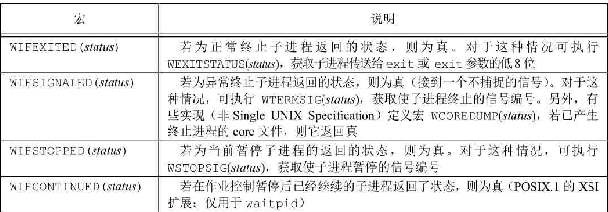
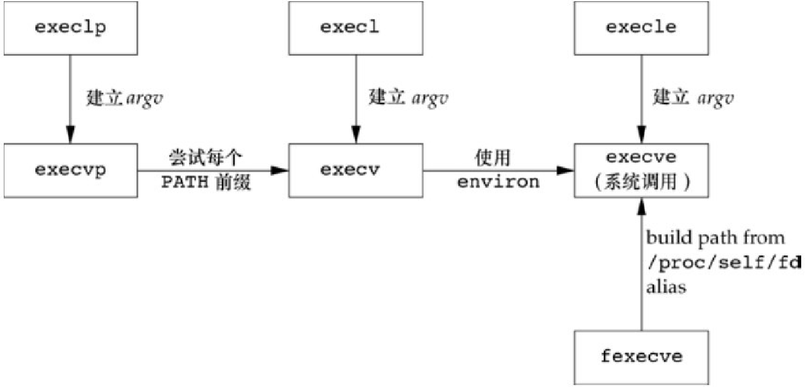
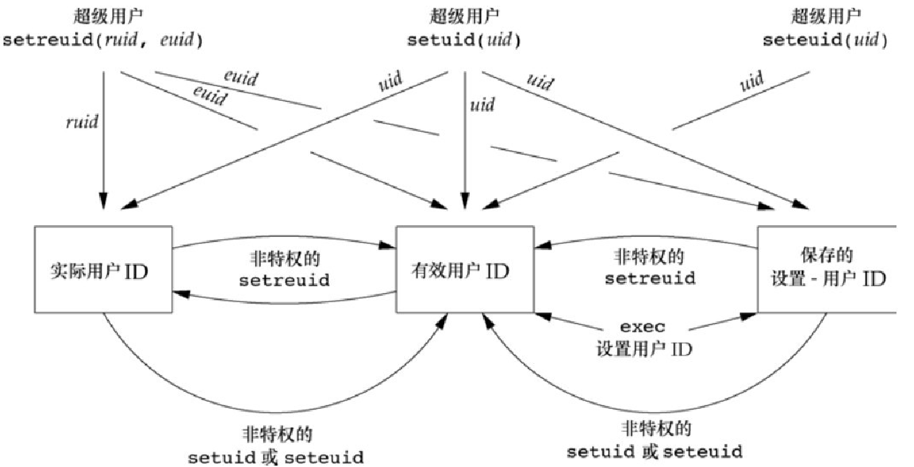
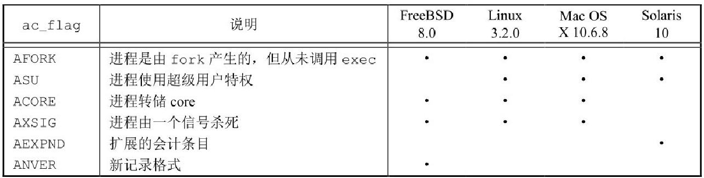

### 进程控制

#### 进程标识

每个进程都有一个非负整型表示的唯一进程 ID ，因为进程 ID 标识符总是唯一的，常将其用作其他标识符的一部分以保证其唯一性。（应用程序有时就把进程 ID 作为名字的一部分来创建一个唯一的文件名） 

虽然是唯一的，但是进程ID是可复用的。当一个进程终止后，其进程 ID 就成为复用的候选者。大多数 `unix` 系统实现延迟复用算法，使得赋予新建进程的 ID 不同于最近终止进程所使用的 ID。这就防止了将新进程误认为是使用同一 ID 的 某个已终止的先前进程

系统中有一些专用进程，但具体细节随实现而不同。ID 为 0 的进程通常是调度进程，被称为交换进程。该进程是内核的一部分，它并不执行任何磁盘上的程序，因此也被称为系统进程。进程 ID 1 通常是 `init` 进程，在自举过程结束时由内核调用。该进程的程序文件在 `unix` 的早期版本中是 `/etc/init` ，在较新版本中是 `/sbin/init` 。该进程负责在自举内核后启动一个 UNIX 系统。  `init` 通常读取与系统有关的初始化文件（`/etc/rc*` 文件或 `/etc/inittab` 文件，以及在 `/etc/init.d` 中的文件），并将系统引导到一个状态（如多用户）。`init` 进程绝不会终止。它是一个普通的用户进程，但是它以超级用户特权运行。

除了进程 ID，每个进程还有一些其他标识符。下列函数返回这些标识符，这些函数都没有出错返回

```c
#include <unistd.h>
// 返回值：调用进程的进程 ID
pid_t getpid(void);
// 返回值：调用进程的父进程 ID
pid_t getppid(void);
// 返回值：调用进程的实际用户 ID
uid_t getuid(void);
// 返回值：调用进程的有效用户 ID 
uid_t geteuid(void);
// 返回值：调用进程的实际组 ID
gid_t getgid(void);
// 返回值：调用进程的有效组 ID
gid_t getegid(void);
```

#### fork

一个现有的进程可以调用 `fork` 函数创建一个新进程

```c
#include <unistd.h>
// 返回值：子进程返回 0,父进程返回子进程ID；若出错，返回 -1
pid_t fork(void);
```

由 `fork` 创建的新进程被称为子进程。`fork` 函数调用一次，返回两次。两次返回的区别是子进程的返回值是 0，而父进程的返回值则是新建子进程的进程 ID。将子进程 ID 返回父进程的理由是：因为一个进程的子进程可以有多个，并且没有一个函数使一个进程可以获得其所有子进程的进程 ID。`fork` 使子进程得到返回值 0 的理由是：一个进程只会有一个父进程，所以子进程总是可以调用 `getppid` 以获得其父进程的进程 ID。 （进程ID 0 总是由交换进程使用，所以一个子进程的进程 ID 不可能为 0）

子进程和父进程继续执行 `fork` 调用之后的指令。子进程是父进程的副本（子进程获得父进程数据空间，堆和栈的副本）父进程和子进程并不共享这些存储空间部分。父进程和子进程共享正文段。

由于在 `fork` 之后经常跟随者 `exec` 所以现在的很多实现并不执行一个父进程数据段、栈和堆的完全副本。作为替代，使用了写时复制（Copy-On-Write），这些区域由父进程和子进程共享，而且内核将它们的访问权限改变为只读。如果父进程和子进程中的任一个试图修改这个区域，则内核只为修改区域的那块内存制作一个副本，通常时虚拟存储系统中的一页。

某些平台提供 fork 函数的几种变体：

* Linux 3.2.0 提供了另一种新进程创建函数 `clone` 系统调用，这是一种 `fork` 的推广 形式，它允许调用者控制哪些由部分由父进程和子进程共享
* Solaris 10 提供了两个线程库：一个用于 POSIX 线程（`pthreads`），另一个用于 Solaris 线程，这两个线程库中，fork 的行为有所不同。对于 POSIX 线程，`fork` 创建一个进程，它仅包含该 `fork` 的线程，对于 Solaris 线程，fork 创建的进程包含了调用线程所在进程的所有线程的副本。

#### 文件共享

在重定向父进程的标准输出时，子进程的标准输出也被重定向。实际上，`fork` 的一个特性是父进程的所有打开文件描述符都被复制到子进程中。因为对每个文件描述符来说，好像执行了 `dup` 函数，父进程和子进程每个相同的打开描述符共享一个文件表项。

一个进程具有 3 个不同的打开文件，它们是标准输入、标准输出和标准错误。在从 `fork` 返回时如下图


父进程和子进程共享同一文件偏移量。如果父进程和子进程写同一描述符指向的文件，但又没有任何形式的同步（如使父进程等待子进程），那么它们的输出就会相互混合（假定所用的描述符是在 `fork` 之前打开的）。虽然这种情况是可能发生的，但这并不是常用的操作模式

在 `fork` 之后处理文件描述符有以下两种常见的情况

1. 父进程等待子进程完成。在这种情况下，父进程无需对其描述符做任何处理。当子进程终止后，它曾进行过读、写操作的任一共享描述符的文件偏移量已做了相应更新

2. 父进程和子进程各自执行不同的程序段。在这种情况下，在 `fork` 之后，父进程和子进程各自关闭它们不需使用的文件描述符，这样就不会干扰对方使用的文件描述符。这种方法是网络进程使用的

**除了打开文件之外，父进程的很多其他属性也由子进程继承，包括：**

实际用户 ID、实际组 ID、有效用户 ID、有效组 ID

附属组 ID

进程组 ID

会话 ID

控制终端

设置用户 ID 标志和设置组 ID 标志

当前工作目录

根目录

文件模式创建屏蔽字

信号屏蔽和安排

对任一打开文件描述符的执行时关闭（close-on-exec）标志

环境

连接的共享存储段

存储映像

资源限制

**父进程和子进程之间的区别具体如下**

`fork` 的返回值不同

进程 ID 不同

这两个进程的父进程 ID 不同：子进程的父进程 ID 是创建它的进程的 ID，而父进程的父进程 ID 则不变

子进程的 `tms_utime`、`tms_stime`、`tms_cutime` 和 `tms_ustime` 的值设置为 0

子进程不继承父进程设置的文件锁

子进程的未处理闹钟被清除

子进程的未处理信号集设置为空集

`fork` 失败的两个主要原因是：系统中已经有了太多的进程；该实际用户 ID 的进程总数超过了系统限制。其中 `CHILD_MAX` 规定了每个实际用户 ID 在任一时刻可拥有的最大进程数

**fork 有以下两种用法**

1. 一个父进程希望复制自己，使父进程和子进程同时执行不同的代码段。这在网络服务进程中是最常见的--父进程等待客户端的服务请求。当这种请求到达时，父进程调用 `fork` ，使子进程处理此请求。父进程则继续等待下一个服务请求
2. 一个进程要执行一个不同的程序。这对 `shell` 是常见的情况。在这种情况下，子进程从 `fork` 返回后立即调用 `exec` ，某些操作系统将两个操作组合成一个操作，spawn（SUS 在高级实时选择组中包括了 spawn）

#### vfork

`vfork` 函数的调用序列和返回值与 `fork` 相同，但两者的语义不同。`vfork` 函数被认为是有瑕疵的，可移植的应用程序不应该使用这个函数

`vfork` 函数用于创建一个新进程，而该新进程的目的是 `exec` 一个新程序。`vfork` 与 `fork` 一样都创建一个子进程，但是它并不将父进程的地址空间完全复制到子进程中，因为子进程会立即调用 `exec`（或 `exit`），于是也就不会引用该地址空间。不过在子进程调用 `exec` 或 `exit` 之前，它在父进程的空间中运行

`vfork` 保证子进程先运行，在它调用 `exec` 或 `exit` 之后父进程才可能被调度运行，当子进程调用这两个函数中的任意一个时，父进程会恢复运行。（如果在调用这两个函数之前子进程依赖于父进程的进一步动作，则会导致死锁）

 #### exit

进程有5种正常终止及3种异常终止方式。5种正常终止如下：

* 在 `main` 函数内执行 `return` 语句。等效于调用 `exit`

* 调用 `exit` 函数，此函数由 ISO C 定义，其操作包括调用各终止处理程序（终止处理程序在调用 `atexit` 函数时登记），然后关闭所有的标准 I/O 流。因为 ISO C 并不处理文件描述符、多进程（父进程和子进程）以及作业控制，所以这一定义对 `unix` 系统而言是不完整的。

* 调用 `_exit` 或 `_Exit` 函数。ISOC 定义 `_Exit`，其目的是为进程提供一种无需运行终止处理程序或信号处理程序而终止的方法。对标准 I/O 流是否冲洗，取决于实现。在 `UNIX` 系统中，`_Exit` 和 `_exit` 是同义的，并不冲洗标准 I/O  流。`_exit` 函数由 `exit` 调用，它处理 `UNIX` 系统特定的细节。

  在大多数UNIX系统实现中，exit(3)是标准C库中的一个函数，而_exit(2)则是一个系统调用。

* 进程的最后一个线程在其启动例程中执行 `return` 语句。但是，该线程的返回值不用作进程的返回值。当最后一个线程从其启动例程返回时，该进程以终止状态 0 返回

* 进程的最后一个线程调用 `pthread_exit` 函数。在这种情况中，进程终止状态总是 0，这与传给 `pthread_exit` 的参数无关

进程异常终止

* 调用 `abort` 。它产生 `SIGABRT` 信号，这是下一种异常终止的一种特例
* 当进程接收到某些信号时。信号可由进程自身（如调用 `abort` 函数）、其他进程或内核产生。
* 最后一个线程对”取消”（cancellation）请求作出响应。默认情况下，“取消”以延迟方式发生：一个线程要求取消另一个线程，若干时间之后，目标线程终止

不管进程如何终止，最后都会执行内核中的同一段代码。这段代码为相应进程关闭所有打开描述符，释放它使用的存储器

对上述任意一种终止情形，我们都希望终止进程能够通知其父进程它是如何终止的。对于 3 个终止函数（`exit`，`_exit` 和 `_Exit`），实现这一点的方法是，将其退出状态作为参数传送给函数。在异常终止情况，内核（不是进程本身）产生一个指示其异常终止原因的终止状态（termination status）。在任意一种情况下，该终止进程的父进程都能用 `wait` 或 `waitpid` 函数取得其终止状态

退出状态（它是传递给向 3 个终止函数的参数，或 `main` 的返回值）在最后调用 `_exit` 时，内核将退出状态转换成终止状态。如果子进程正常终止，则父进程可以获得子进程的退出状态。

如果父进程在子进程之前终止，对于父进程已经终止的所有进程，它们的父进程都改变为 `init` 进程。（当一个进程终止时，内核逐个检查所有活动进程，以判断它是否是正要终止进程的子进程，如果是，则该进程的父进程 ID 就更改为 1（`init` 进程的 ID）。这种处理方法保证了每个进程有一个父进程）

如果子进程在父进程之前终止，那么父进程又如何能在做相应检查时得到子进程的终止状态：如果子进程完全消失了，父进程在最终准备好检查子进程是否终止时是无法获取它的终止状态的。内核为每个终止子进程保存了一定量的信息，所以当终止进程的父进程调用 `wait` 或 `waitpid` 时，可以得到这些信息。这些信息至少包括进程 ID、该进程的终止状态以及该进程使用的 CPU 时间总量。内核可以释放终止进程所使用的所有存储区，关闭其所有打开文件。在 UNIX 中，一个已经终止、但是其父进程尚未对其进行善后处理（获取终止子进程的有关信息、释放它仍占用的资源）的进程被称为僵尸进程。`ps` 命令将僵尸进程的状态打印为 Z。如果编写一个长期运行的程序，它 `fork` 了很多子进程，那么除非父进程等待取得子进程的终止状态，不然这些子进程终止后就会变成僵死进程

`init` 被编写成无论何时只要有一个子进程终止，`init` 就会调用一个 `wait` 函数取得其终止状态。这样也就防止了在系统中塞满僵尸进程。

#### wait 和 waitpid

当一个进程正常或异常终止时，内核就向其父进程发送 `SIGCHLD` 信号。因为子进程终止是个异步事件（可以发生在父进程运行的任何时候），所以这种信号也是内核向父进程发的异步通知。父进程可以选择忽略该信号，或者提供一个该信号发生时即被调用执行的函数（信号处理程序）。对于这种信号的系统默认动作是忽略它。

调用 `wait` 或 `waitpid` 时

* 如果其所有子进程都还在运行，则阻塞
* 如果一个子进程已终止，正等待父进程获取其终止状态，则取得该子进程的终止状态立即返回
* 如果它没有任何子进程，则立即出错返回

如果进程由于接收到 `SIGCHLD` 信号而调用 `wait` ，期望 `wait` 会立即返回。但是如果在随机时间点调用 `wait`,则进程可能会阻塞

```c
#include <sys/wait.h>
// 两个函数返回值：若成功，返回进程ID；若出错，返回 0 或 -1
pid_t wait(int *statloc);
pid_t waitpid(pid_t pid, int *statloc, int options);
```

两个函数的区别是：

* 在一个子进程终止前，`wait` 使其调用者阻塞，而 `waitpid` 有选项，可使调用者不阻塞
* `waitpid` 并不等待在其调用之后的第一个终止子进程，它有若干选项，可以控制它所等待的进程

`waitpid` 函数提供了 `wait` 函数没有提供的 3 个功能：

* `waitpid` 可以等待一个特定的进程，而 `wait` 返回任一终止子进程的状态
* `waitpid` 提供了一个 `wait` 的非阻塞版本，有时希望获取一个子进程的状态，但不想阻塞
* `waitpid` 通过 `WUNTRACED` 和 `WCONTINUED` 选项支持作业控制

如果子进程已经终止，并且是一个僵尸进程，则 `wait` 立即返回并取得该子进程的状态；否则 `wait` 使其调用者阻塞，直到一个子进程终止。如果调用者阻塞而且它有多个子进程，则在其某一个子进程终止时，`wait` 就立即返回。因为 `wait` 返回终止子进程的进程 `ID`，所以它总能了解是那个子进程终止了

参数 `statloc` 是一个整型指针。如果 `statloc` 不是一个空指针，则终止进程的终止状态就存放在它所指向的单元内。如果不关心终止状态，则可将该参数指定为空指针。整型状态字由实现定义的。其中某些位表示退出状态（正常返回），其他位则指示信号编号（异常返回），有一位指示是否产生了 `core` 文件等，POSIX.1 规定，终止状态用定义在 `<sys/wait.h>` 中的各个宏来查看，有 4 个互斥的宏可以用来取得进程终止的原因，它们的名字都以 WIF 开始，基于这 4 个宏中哪一个值为真2，就可选用其他宏来取得退出状态、信号编号等



POSIX.1 定义了 `waipid` 函数以提供等待指定进程，对于 `waitpid` 函数中 `pid` 参数的作用：

* `waitpid` 的 `pid` 参数 `pid == -1` 等待任一子进程。此种情况下，`waitpid` 和 `wait` 等效。

* `pid > 0` 等待进程 ID 与 `pid` 相等的子进程。
* `pid == 0` 等待组 ID 等于调用进程组 ID 的任一子进程
* `pid < -1` 等待组 ID 等于 `pid` 绝对值的任一子进程

`waitpid` 函数返回终止子进程的进程 ID，并将该子进程的终止状态存放在由 `statloc` 指向的存储单元中。对于 `wait`，其唯一的出错是调用进程没有子进程（函数调用被一个信号中断时，也可能返回另一种出错）。对于 `waitpid`，如果指定的进程或进程组不存在，或者参数 `pid` 指定的进程不是调用进程的子进程，都可能出错

`waitpid` 的 `options` 参数控制 `waitpid` 的操作，此参数为 0 或以下常量：

* WCONTINUED

  若实现支持作业控制，那么由 `pid` 指定的任一子进程在停止后已经继续，但其状态尚未报告，则返回其状态（POSIX.1 的 XSI 扩展）

* WNOHANG

  若由 `pid` 指定的子进程并不是立即可用的，则 `waitpid` 不阻塞，此时其返回值为 0

* WUNTRACED

  若某实现支持作业控制，而由 `pid` 指定的任一子进程已处于停止状态，并且其状态自停止以来还未报告过，则返回其状态。WIFSTOPPED 宏确定返回值是否对应于一个停止的子进程

#### waitid

SUS 包括了另一个取得进程终止状态的函数 `waitid`，此函数雷系 `waitpid`，但提供了更多的灵活性

```c
#include <sys/wait.h>
// 返回值若成功，返回 0; 若出错，返回 -1
int waitid(idtype_t idtype, id_t id, siginfo_t *infop, int options);
```

`waitid` 允许一个进程指定要等待的子进程。但它使用两个单独的参数表示要等待的子进程所属的类型，而不是将此与进程 ID 或进程组 ID 组合成一个参数，id 参数的作用与 `idtype` 的值相关，`idtype` 类型常量 ：

* P_PID

  等待一特定进程：id 包含要等待子进程的进程 ID

* P_PGID

  等待一特定进程组的任一子进程：id 包含要等待子进程的进程组 ID

* P_ALL

  等待任一子进程：忽略 id

`options` 参数是下列常量中各标志的按位或运算，这些标志指示调用者关注哪些状态变化

* WCONTINUED

  等待一进程，它以前曾被停止，此后又已继续，但其状态尚未报告

* WEXITED

  等待已退出的进程

* WNOHANG

  如无可用的子进程退出状态，立即返回而非阻塞

* WSTOPPED

  等待一进程，它已经停止，但其状态尚未报告

WCONTINUED、WEXITED、WSTOPPED 这三个常量之一必须在 options 参数中指定

`infop` 参数是指向 `siginfo` 结构的指针。该结构包含了造成子进程状态改变有关信号的详细信息

Linux3.2 支持 `waitid`

#### wait3 和 wait4

大多数 UNIX 系统实现提供了另外两个函数 `wait3` 和 `wait4`，历史上，这两个函数是从 UNIX 系统的 BSD 分支沿袭下来的。它们提供的功能比 POSIX.1 函数 `wait`、`waitpid` 和 `waitid` 所提供功能要多一个，这与附加参数有关，该参数允许内核返回由终止进程及其所有子进程使用的资源概况

```c
#include <sys/types.h>
#include <sys/wait.h>
#include <sys/time.h>
#include <sys/resourc.h>
pid_t wait3(int *statloc, int options, struct rusage *rusage);
pid_t wait4(pid_t pid, int *statloc, int options, struct rusage *rusage);
```

#### 竞争条件

当多个进程都企图对共享数据进行某种处理，而最后的结果又取决于进程运行的顺序时，我们认为发生了竞争条件（race condition）。如果在 `fork` 之后的某种逻辑显示或隐式地依赖于在 `fork` 之后时父进程先运行还是子进程先运行，就会竞争。

#### exec

当进程调用一种 `exec` 函数时，该进程执行的程序完全替换为新程序，而新程序则从其 `main` 函数开始执行。因为调用 `exec` 并不创建新进程，所以前后的进程 ID 并未改变。`exec` 只是用磁盘上的一个新程序替换了当前程序的正文段，数据段，堆段和栈段。基本进程控制原语：`fork` 创建新进程，`exec` 初始执行新的程序。`exit` 函数和 `wait` 函数处理终止和等待终止。

```c
#include <unistd.h>
int execl(const char *pathname, const char *arg0, .../* (char *)0 */);
int execv(const char *pathname, char *const argv[]);
int execle(const char *pathname, const char *arg0, .../* (char *) 0, char *const envp[] */);
// 内核的系统调用
int execve(const char *pathname, char *const argv[], char *const envp[]);
// 如果 filename 中包含 /，则就将其视为路径名，否则就按 PATH 环境变量，在它所指定的各目录中搜寻可执行文件，如果 execlp 或 execvp 找到了一个可执行文件，但该文件不是及其可执行文件，则就认为该文件是一个 shell 脚本，于是调用 /bin/sh，并将该 filename 作为 shell 的输入
int execlp(const char *filename, const char *arg0, .../* (char *)0 */);
int execvp(const char *filename, char *const argv[]);
//调用进程可以使用文件描述符验证所需要的文件并且无竞争地执行该文件。
int fexecve(int fd, char *const argv[], char *const envp[]);
```

*7个 exec 函数之间的关系*



在这种安排中，库函数 `execlp` 和 `execvp` 使用 PATH 环境变量，查找第一个包含名为 `filename` 的可执行文件的路径名前缀。`fexecve` 库函数使用 `/proc` 把文件描述符参数转换成路径名，`execve` 用该路径名去执行程序

#### 更改用户 ID 和更改组 ID

在 `UNIX` 系统中，特权及访问控制是基于用户 ID 和组 ID。当程序需要增加特权，或需要访问当前不允许访问的资源时，需要更换自己的用户 ID 或组 ID，使新 ID 具有合适的特权或访问权限。与此类似，当程序需要降低其特权或阻止对某些资源的访问时，也需要更换用户 ID 或组 ID，新 ID 不具有相应特权或访问这些资源的能力

```c
#include <unistd.h>
// 两个函数返回值，成功返回 0；出错，返回 -1
// 设置实际用户 ID 或有效用户 ID
int setuid(uid_t uid);
// 设置实际组 ID 或有效组 ID
int setgid(gid_t gid); 		
```

更改 ID 及 组 ID 

* 若进程具有超级用户特权，则 `setuid` 函数将实际用户 ID，有效用户 ID 以及保存的设置用户 ID 设置为 `uid`
* 若进程没有超级用户特权，但是 `uid` 等于实际用户 ID 或保存的设置用户 ID，则 `setuid` 只将有效用户设置为 `uid`，不更改实际用户 ID和保存的设置用户ID
* 如果上面两个条件不满足，则 `errno ` 设置为 `EPERM` ，并返回 -1

在 POSIX.1 2001 版中，保存的 ID 是强制性功能，而在较早版本，它们是可选择的。为了弄清楚某些实现是否支持这一功能，应用程序在编译时可以测试常量 `_POSIOX_SAVED_IDS`，或者运行时以 `_SC_SAVED_IDS` 参数调用 `sysconf` 函数

内核所维护的 3个用户 ID：

* 只有超级用户进程可以更改实际用户 ID。实际用户 ID 是在用户登录时。由 `login(1)` 程序设置的，而且绝不会改变它。`login` 是一个超级用户进程，当它调用 `setuid` 时，设置所有 3 个用户 ID
* 仅当对程序文件设置了设置用户 ID 位时，`exec` 函数才设置有效用户 ID。如果设置用户 ID 位没有设置，`exec` 函数不会改变有效用户 ID，而将维持其现有值。任何时候都可以调用 `setuid`，将有效用户 ID 设置为实际用户 ID 或保存的设置用户 ID。自然的，不能将有效用户 ID 设置为任一随机值
* 保存的设置用户 ID 是由 `exec` 复制有效用户 ID 而得到的。如果设置了文件的设置用户 ID 位，则在 `exec` 根据文件的用户 ID 设置了进程的有效用户 ID 以后，这个副本就被保存起来了。

更改 3 个用户 ID 的不同方法


FreeBSD 8.0 和 Linux 3.2.0 提供了 `getresuid` 和 `getresgid` 函数，它们可以分别用于获取保存的设置用户 ID 和保存的设置组 ID

```c
#include <unistd.h>
// 两个函数返回值，若成功，返回 0，若出错，返回 -1。SUS 的 XSI 扩展
// 交换实际用户 ID 和有效用户 ID 的值
int setreuid(uid_t ruid, uid_t euid);
int setregid(gid_t rgid, gid_t egid);
```

如若其中任一参数的值为 -1，则表示相应的 ID 应当保持不变。

一个非特权用户总能交换实际用户 ID 和有效用户 ID，这就允许一个设置用户 ID 程序交换成用户的普通权限，以后又可再次交换回设置用户 ID 权限。POSIX.1 引进了保存的设置用户 ID 特性后，其规则也相应加强，它允许一个非特权用户将其有效用户 ID 设置为保存的设置用户 ID

POSIX.1 包含了 `seteuid` 和 `setegid`，它们类似于 `setuid` 和 `setgid`，但只更改有效用户 ID 和有效组 ID

```c
#include <unistd.h>
int seteuid(uid_t uid);
int setegid(gid_t gid);
```

一个非特权用户可将其有效用户 ID 设置为其实际用户ID 或其保存的设置用户 ID。对于一个特权用户则可将有效用户 ID 设置为 `uid`

*设置不同用户ID的各函数*



#### 解释器文件

现今的 UNIX 系统都支持解释器文件（interpreter file），这种文件是文本文件，其起始行：

```c
#! pathname [optional-argument]
#! /bin/sh
```

pathname 通常是绝对路径名，对它不进行什么特殊的处理。对这种文件的识别是由内核作为 `exec` 系统调用处理的一部分来完成的。内核使调用 `exec` 函数的进程实际执行的并不是该解释器文件，而是该解释器文件第一行中 pathname 所指定的文件。

一定要将解释器文件（文本文件，它以#！开头）和解释器（由该解释器文件第一行中的pathname指定）区分开来。很多系统对解释器文件第一行有长度限制。这包括#！、pathname、可选参数、终止换行符以及空格数（Linux 3.2 为 128 字节）

常见 SHELL 文件程序

#### system

ISO C 定义了 system 函数，但是其操作对系统的依赖性很强。POSIX.1 包括了 system 接口，它扩展了 ISO C 定义，描述 system 在 POSIX.1 环境中的运行行为

```c
#include <stdlib.h>
// 如果 cmdstring 是一个空指针，仅当命令处理程序可用时，system 返回非 0 值
//因为system在其实现中调用了fork、exec和waitpid，因此有3种返回值
//fork失败或者waitpid返回除EINTR之外的出错，则system返回−1，并且设置errno以指示错误类型
//如果 exec失败（表示不能执行 shell），则其返回值如同 shell执行了 exit(127)一样。
//否则所有3个函数（fork、exec和waitpid）都成功，那么system的返回值是shell的终止状态，其格式已在waitpid中说明。
int system(const char *cmdstring);
```

如果在一个设置用户 ID 程序中调用 system，这是一个安全性方面的漏洞，决不应当这样做

#### 进程会计

大多数 UNIX 系统提供了一个选项以进行进程会计（process accounting）处理，启用该选项后，每当进程结束时内核就写一个会计记录。典型的会计记录包含总量较小的二进制数据，一般包括命令名，所使用的 CPU 时间总量，用户 ID 和组 ID，启动时间等。

函数 `acct` 启用和禁用进程会计。唯一使用这一函数的是 `accton` 命令（这是在几种平台上都类似的少数几条命令中的一条）。超级用户执行一个带路径名参数的 `accton` 命令启用会计处理。会计记录写到指定的文件中，在FreeBSD和Mac OS X中，该文件通常是 `/var/account/acct` ；在Linux中，该文件是 `/var/account/pacct`；在Solaris中，该文件是`/var/adm/pacct`。执行不带任何参数的 `accton` 命令则停止会计处理。

会计记录定义在头文件 `<sys/acct.h>` 中，基本样式：

```c
typedef u_short comp_t;
struct acct {
    char ac_flag;		// floag
    char ac_stat; 		// termination status(signal & core flag only), Solaris only
    uid_t ac_uid;		// real user Id
    gid_t ac_gid;		// real group Id
    dev_t ac_tty;		// controlling terminal
    time_t ac_btime;	// starting calendar time
    comp_t ac_utime;	// user CPU time
    comp_t ac_stime;	// system CPU time
    comp_t ac_etime;	// elapsed time
    comp_t ac_mem;		// average memory usage
    comp_t ac_io;		// bytes transferred (by read and write)
    comp_t ac_rw;		// blocks read or written
    char ac_comm[8];	// command name [8] for solaris, [17] for linux
}
```

在大多数的平台上，时间是以时钟滴答数记录的，但FreeBSD以微秒进行记录的。ac_flag成员记录了进程执行期间的某些事件。这些事件:

*进程会计记录中 ac_flag 值*



会计记录所需的各个数据（各CPU时间、传输的字符数等）都由内核保存在进程表中，并在一个新进程被创建时初始化（如fork之后在子进程中）。进程终止时写一个会计记录。这产生两个后果：

* 我们不能获取永远不终止的进程的会计记录。像 `init` 这样的进程在系统生命周期中一直在运行，并不产生会计记录。这也同样适合于内核守护进程，它们通常不会终止
* 在会计文件中记录的顺序对应于进程终止的顺序，而不是它们启动的顺序。为了确定启动顺序，需要读全部会计文件，并按启动日历时间进行排序，

会计记录对应于进程而不是程序。在 `fork` 之后，内核为子进程初始化一个记录，而不是在一个新程序被执行时初始化。虽然 `exec` 并不创建一个新的会计记录，但相应记录中的命令名改变了，`AFORK` 标志则被清除。这意味着，如果一个进程顺序执行了3个程序（A exec B、B exec C，最后是C exit），只会写一个会计记录。在该记录中的命令名对应于程序C，但CPU时间是程序A、B和C之和。

#### 进程调度

NIX 系统历史上对进程提供的只是基于调度优先级的粗粒度的控制。调度策略和调度优先级是由内核确定的。进程可以通过调整 `nice` 值选择以更低优先级运行（通过调整 `nice` 值降低它对CPU的占有，因此该进程是“友好的”）。只有特权进程允许提高调度权限

SUS 中 nice 值的范围在 0～(2*NZERO)-1 之间，有些实现支持 0～2*NZERO。nice值越小，优先级越高。定义 NZERO 的头文件因系统而异，除了头文件，Linux 3.2 可以通过非标准的 `sysconf` 参数 `_SC_NZERO` 来访问 NZERO 的值，进程可以通过 `nice` 函数获取或更改它的 nice 值，使用该函数，进程只能影响自己的 nice 值，不能影响任何其他进程的 nice 值

```c
#include <unistd.h>
// 成功，返回新的 nice 值，出错返回 - 1
int nice(int incr);
```

