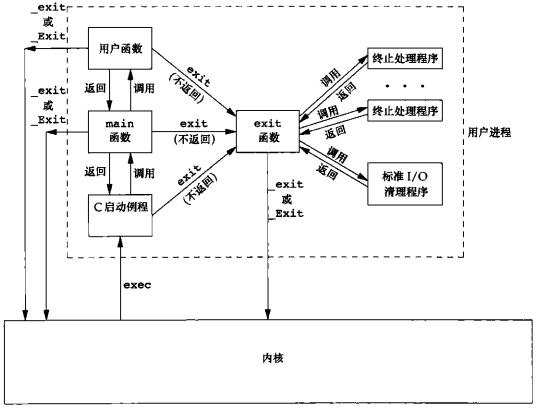
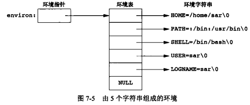

### 进程环境

#### main 函数

c 程序总是从 `main` 函数开始执行。

`int main(int argc, char *argv[]);`

`argc` 是命令行参数的数目，`argv` 是指向参数的各个指针所构成的数组。

当内核执行 C 程序时（使用一个 `exec` 函数），在调用 `main` 前先调用一个特殊的启动例程。可执行程序文件将此启动例程指定为程序的起始地址（由编辑器设置的，而连接编辑器则由 C 编译器调用。启动例程从内核取得命令行参数和环境变量值，然后为调用 `main` 函数做好安排）

ISO C  和 POSIX.1 定义 `main` 函数的返回值为带符号整型

#### 进程终止

有 8 种方式使进程终止，其中 5 种为正常终止

* 从 `main` 返回
* 调用 `exit`
* 调用 `_exit` 或 `_Exit`
* 最后一个线程从其启动例程返回
* 从最后一个线程调用 `pthread_exit` 

异常终止 3 种

* 调用 abort
* 接到一个信号
* 最后一个线程对取消请求做出响应

##### 退出函数

以下 3 个函数用于正常终止一个程序：`_exit` 和 `_Exit` 立即进入内核，`exit` 则先执行一些清理处理，然后返回内核

```c
#include <stdlib.h>
// ISO C 
void exit(int status);
void _Exit(int status);
#include <unistd.h>
// POSIX.1
void _exit(int status);
```

`exit` 函数总是执行一个标准 I/O  库的清理关闭操作：对于所有打开流调用 `fclose` 函数（将输出缓冲中的所有数据都被冲洗）

3 个函数都带一个整型参数，为终止状态。大多数 `UNIX` 系统 `shell` 都提供检查进程终止状态的方法。如果调用这些函数时不带终止状态，或 `main` 执行了一个无返回值的 `return` 语句，或 `main` 没有声明返回类型为整型，则该进程的终止状态是未定义的。但是，若 `main` 的返回类型是整型，并且 `main` 执行到最后一条语句时返回（隐式返回），那么该进程的终止状态是 0

`main` 函数返回一个整型值与用该值调用 `exit` 是等价的。在 `main` 函数中 `exit(0)` 等价于 `return(0)`

##### 函数 atexit

按照 ISO C 的规定，一个进程可以登记多至 32 个函数，这些函数将由 `exit` 自动调用。这些函数为终止处理程序，并调用 `atexit` 函数来登记这些函数

```c
#include <stdlib.h>
// 返回值：若成功，返回 0；若出错，返回非 0
int atexit(void (*func)(void));
```

`atexit` 的参数是一个函数地址，当调用此函数时无需向它传递任何参数，也不期望它返回一个值。`exit` 调用这些函数的顺序与它们登记时候的顺序相反。用以函数如登记多次，也会被调用多次，为了确定一个给定的平台支持的最大终止处理程序数，可以使用 `sysconf` 函数

根据 ISO C 和 POSIX.1，`exit` 首先调用各终止处理程序，然后关闭（通过 `fclose` ）所有打开流。如若程序调用 `exec` 函数族中的任一函数，则将清除所有已安装的终止处理程序。

*c程序的启动和终止*



内核使程序执行的唯一方法是调用一个 `exec` 函数。进程自愿终止的唯一方法是显式或隐式（通过调用 `exit`）调用 `_exit` 或 `_Exit` 。进程也可非自愿地由一个信号使其终止

#### 命令行参数

当执行一个程序时，调用 exec 的进程可将命令行参数传递给新程序。这是 UNIX shell 的一部分常规操作，ISO C 和 POSIX.1 要求 `argv[argc]` 是一个空指针

#### 环境表

每个程序都接收到一张环境表。与参数表一样，环境表也是一个字符指针数组，其中每个指针包含一个以 `null` 结束的 c 字符串的地址。全局变量 `environ` 则包含了该指针数组的地址 `extern char **environ`

如果该环境包含 5 个字符串，那么它看起来下图中所示。其中，每个字符串的结尾处都显示地有一个 `null` 字节。`environ` 为环境指针，指针数组为环境表，其中个指针指向的字符串为环境字符串



按照惯例，环境由 `name = value` 这样的字符串组成，大多数预定义名完全由大写字母组成，但这只是一个惯例。

在历史上，大多数 UNIX 系统支持 main 函数带 3 个参数，其中第三个参数就是环境表地址

```c
int main(int argc, char *argv[], char *envp[]);
```

因为 ISO C 规定 `main` 函数只有两个参数，而且第三个参数与全局变量 `environ` 相比也没有带来更多益处，所以 POSIX.1 也规定应使用 `environ` 而不使用第 3 个参数。通常用 `getenv` 和 `putenv` 函数来访问特定的环境变量，而不是用 `environ` 变量。如果要查看整个环境，则必须使用 `environ` 指针

#### C 程序的存储空间布局

C 程序一直由下列几部分组成：

* **正文段:** 由 CPU 执行的机器指令部分。通常，正文段是可共享的，所以即使是频繁执行的程序（如文本编辑器、C 编译器和 `shell` 等）在存储器中也只需有一个副本，正文段常常是只读的，以防止程序由于意外而修改其指令
* **初始化数据段：** 通常将此段称为数据段，它包含了程序中需明确地赋初值地变量。例如，C 程序中任何函数之外的声明：`int maxcount = 99`，使此变量以其初始值存放在初始化数据段中
* **未初始化数据段：** 通常将此段称为 `bss` 段，意思是由符号开始地块，在程序开始执行前，内核将此段中地数据初始化为 0 或空指针，函数外的声明：`long sum[1000]` 使此变量存放在非初始化数据段中。
* **栈：** 自动变量以及每次函数调用时所需保存地信息都存放在此段中，每次函数调用时，其返回地址以及调用者的环境信息（如某些机器寄存器的值）都存放在栈中。然后，最近被调用的函数在栈上为其自动和临时变量分配空间。通过以这种方式使用栈，C 递归函数可以工作。递归函数每次调用自身时，就用一个新的栈帧，因此一次函数调用实例中的变量集不会影响另一次函数调用实例中的变量
* **堆：** 在堆中进行动态存储分配。堆位于初始化数据段和栈之间

`a.out` 中还有若干其他类型的段，如包含符号表的段、包含调试信息的段以及包含动态共享库链接表的段等。这些部分并不装载到进程执行的程序映像中。

对于 32 位 `Intel x86` 处理器上的 `linux` ，正文段从 `0x08048000` 单元开始，栈底则在 `0xC0000000` 之下开始。堆顶和栈顶之间未用的虚拟地址空间很大

存储空间图


未初始化数据段的内容并不存放在磁盘程序文件中。其原因是，内核在程序开始运行前将它们都设置为 0。需要存放在磁盘程序文件中的段只有正文段和初始化数据段

#### 共享库

现在，大多数 `unix` 系统支持共享库。共享库使得可执行文件中不需要包含公用的库函数，而只需在所有进程都可引用的存储区中保存这种库例程的一个副本。程序第一次执行或者第一次调用某个库函数时，用动态链接方法将程序与共享库函数相链接。这减少了每个可执行文件的长度，但增加了一些运行时间开销。这种时间开销发生在该程序第一次被执行时，或者每个共享库函数第一被调用时。共享库的另一个优点是可以用库函数的新版本代替老版本而无需对使用该库的程序重新连接编辑（假定参数的数目和类型都没有发生改变）

```shell
// 不使用共享库
gcc -static hello.c
```

#### 存储空间分配

ISO C 说明了 3 个用于存储空间动态分配的函数：

* `malloc` ，分配指定字节数的存储区。此存储区中的初始值不确定
* `calloc` ，为指定数量指定长度的对象分配存储空间。该空间中的每一位（bit）都初始化为 0
* `realloc`，增加或减少以前分配区的长度。当增加长度时，可能需将以前分片区的内容移到另一个足够大的区域，以便在尾端提供增加的存储区，而新增区域内的初始值则不确定

```c
#include <stdio.h>
void *malloc(size_t size);
void *calloc(size_t nobj, size_t size);
void *realloc(void *ptr, size_t newsize);
void free(void *ptr);
```

3 个函数返回值：若成功，返回非空指针；若出错，返回 null。这 3 个分配函数所返回的指针一定是适当对齐的，使其可用于任何数据对象。（例如，在一个特定的系统上，如果最苛刻的对齐要求是，`double` 必须在 8 的倍数地址单元处开始，那么这 3 个函数返回的指针都应这样对齐）

因为这 3 个 `alloc` 函数都返回通用指针 `void *`，所有如果在程序中包括了 `#include <stdlib.h>` ，那么将这些函数返回的指针赋予一个不同类型的指针时，就不需要显示地执行强制类型转换。未声明函数的默认返回值 `int`，所以使用没有正确函数声明的强制类型转换可能会隐藏系统错误，因为 `int` 类型的长度与函数返回类型值的长度不同。

函数 `free` 释放 `ptr` 指向的存储空间。被释放的空间通常被送入可用存储区池，以后，可在调用上述 3 个分配函数时再分配。

`realloc` 函数使我们可以增、减以前分配的存储区的长度（最常见的用法是增加该区），如果先为一个数组分配存储空间，该数组长度为 512，然后在运行时填充它，但运行一段时间后发现该数组原先的长度不够用，此时可以调用 `realloc` 扩充相应存储空间。如果在该存储区后有足够的空间可供扩充，则可在原存储区位置上向高地址方向扩充，无需移动任何原先的内容，并返回与传给它相同的指针值。如果在原存储区后没有足够的空间，则 `realloc` 分配另一个足够大的存储区，将现存的 512 个元素数组的内容复制到新分配的存储区。然后，释放原存储区，返回新分配区的指针。因为这种存储区可能会移动位置，所以不应当使任何指针指在该区中。

`realloc` 的最后一个参数是存储区的新长度，不是新、旧存储区长度之差。作为一个特例，若 `ptr` 是一个空指针，则 `realloc` 的功能与 `malloc` 相同，用于分配一个指定长度为 `newsize` 的存储区。

这些分配例程通常用 `sbrk` 系统调用实现，该系统调用扩充或缩小进程的堆。虽然 `sbrk` 可以扩充或缩小进程的存储空间，但是大多数 `malloc` 和 `free` 的实现都不减少进程的存储空间。释放的空间可供以后再分配，但将它们保持在 `malloc` 池中而不返回给内核。大多数实现所分配的存储空间比所要求的要稍大一些，额外的空间用来记录管理信息（分配块的长度、指向下一个分配块的指针等，这意味着，如果超过一个已分配区的尾端或者在已分配区起始位置之前进行写操作，则会改写另一块的管理记录信息。这种类型的错误是灾难性的，但是因为这种错误不会很快就暴露出来，所以也就很难发现）

在动态分配的缓存区前或后进行写操作，破坏的可能不仅仅是该区的管理记录信息。在动态分配的缓冲区前后的存储空间很可能用于其他动态分配的对象。这些对象与破坏它们的可能无关，这造成寻求信息破坏的源头更加困难

其他可能产生的致命性的错误是：释放一个已经释放了的块；调用 `free` 时所用的指针不是 3 个 `alloc` 函数的返回值等。如果一个进程调用 `malloc` 函数，但却忘记调用 `free` 函数，那么该进程占用的存储空间就会连续增加，这被称为泄露。如果不调用 `free` 函数释放不再使用的空间，那么进程地址空间长度就会慢慢增加，这被称为泄露（leakage）。如果不调用 `free` 函数释放不再使用的空间，那么进程地址空间长度就会慢慢增加，直致不再有空闲空间，此时，由于过度的换页开销，会造成新能下降。

因为存储空间分配出错很难追踪，所以某些系统提供了这些函数的另一个实现版本。每次调用这 3 个分配函数中的任意一个或 `free` 时，他们都进行附加的检错。在调用连接编辑器时指定一个专用库，在程序中就可以使用这种版本的函数。此外还有公共可用的资源，在对其进行编译时使用一个特殊标志就会使附加的运行时检查生效。

##### 替代的存储空间分配程序

有很多可替代 malloc 和 free 的函数。某些系统已经提供替代存储空间分配函数的库。另一些系统只提供标准的存储空间分配程序

* libmalloc

  它提供了一套与 ISO C 存储空间分配函数相匹配的接口，libmalloc 库包括 `mallopt` 函数，它使进程可以设置一些变量，并用它们来控制存储空间分配程序的操作，还可使用另外一个名为 `malinfo` 的函数，以对存储空间分配程序的操作进行统计

* vmalloc

  它允许进程对于不同的存储区使用不同的技术。除了一些vmalloc特有的函数外，该库也提供了ISO C存储空间分配函数的仿真器

* quick-fit

  标准 malloc 算法是最佳适配或首次适配存储分配策略，快速适配算法比上述两种算法快，但可能使用较多存储空间。该算法基于将存储空间分裂成各种长度的缓冲区，并将未使用的缓冲区按其长度组成不同的空闲区列表。现在许多分配程序都基于快速适配

* jemalloc

  是 FreeBSD 8.0 中的默认存储空间分配程序，它是库函数 malloc 族在 FreeBSD 中的实现。可用于多处理器系统中使用多线程的应用程序

* TCMalloc

  TCMalloc 函数用于替代 malloc 函数族以提供高性能、高扩展性和高存储效率。从高速缓存中分配缓冲区以及释放缓冲区到高速缓存中时，它使用线程-本地高速缓存来避免锁开销。它还有内置的堆检查程序和堆分析程序帮助调试和分析动态存储的使用。TCMalloc库是开源可用的，是Google-perftools工具中的一个

* alloca

  它的调用序列与malloc相同，但是它是在当前函数的栈帧上分配存储空间，而不是在堆中。其优点是：当函数返回时，自动释放它所使用的栈帧，所以不必再为释放空间而费心。其缺点是：alloca 函数增加了栈帧的长度，而某些系统在函数已被调用后不能增加栈帧长度，于是也就不能支持alloca函数。尽管如此，很多软件包还是使用alloca函数，也有很多系统实现了该函数

#### 环境变量

环境字符串的形式是典型 `key=vale`，unix 内核并不查看这些字符串，它们的解释完全取决于各个应用程序。ISO C 定义了一个函数 `getenv`，可以用其获取环境变量值

```c
#include <stdlib.h>
// 返回指向 name 关联的 value 指针，若未定义，返回 NULL
char *getenv(const char *name);
// 成功返回0，出错返回非 0
// 取形式为 name=value 的字符串，将其放到环境表中。如果 name 已存在，则先删除其原来定义
int putenv(char *str);
// 将 name 设置为 value，如果在环境中 name 已存在，若 rewrite 非 0，则先删除其现有定义，若 rewrite = 0，则不删除其现有定义（name 不设置为新的 value，而且不出错）
int setenv(const char *name, const char *value, int rewrite);
// 删除 name 的定义，即使不存在对应值也不算出错
int unsetenv(const char *name);
```

`putenv` 和 `setenv` 之间的差别，`setenv` 必须分配存储空间，以便依据其参数创建 `name=value` 字符串，`putenv` 可以自由地将传递给它地参数字符串直接放到环境中。因此，将存放在栈中地字符串作为参数传递给 `putenv` 就会发生错误（从当前函数返回时，其栈帧占用地存储区可能将被重用）

删除一个字符串只要先在环境表中找到该指针，然后将所有后续指针都指向环境表首部顺次移动一个位置。环境表和环境字符串通常占用地是进程地址空间地顶部，所以它不能再向高地址方向（向上）扩展，同时也不能移动它之下地各种帧，它也不能向低地址方法（向下）扩展，两者使该空间地长度不能再增加

* 如果修改一个现有地 name

  如果新 value 的长度少于或等于现有 value 的长度，则只要将新字符串复制到原字符串所用的空间中

  如果新 value 的长度大于原长度，则必须调用 malloc 为新字符串分配空间，然后将新字符串复制到该空间中，接着使环境表中针对 name 的指针指向新分配区

* 如果新增加一个 name

  首先必须调用 malloc 为 `name=value` 字符串分配空间，然后将字符串复制到此空间，

  如果这是第一次增加一个新 name，则必须调用 malloc 为新的指针分配空间。接着，将原来的环境表复制到新分配区，并将指向 `name=value` 字符串的指针存放再该指针表的表尾部，然后又将一个空指针存放再其后，最后使 environ 指向新指针表，如果原来的环境表位于栈顶之上，那么必须将此表移到堆中，但是，此表中的大多数指针仍指向栈顶上的各 `name=value` 字符串

  如果不是第一次新增加一个 name，则只需调用 realloc，以分配比原空间多存放一个指针的空间，然后将指向新 `name=value` 字符串的指针存放再该表表尾，后面跟一个空指针

#### setjmp 和 longjmp

在  C  中，goto 语句是不能跨越函数的，而执行这种类型跳转功能是函数 `setjmp` 和 `longjmp`，这两个函数对于处理发生在很深层嵌套函数调用的出错情况非常有用

```c
#include <setjmp.h>
int setjmp(jmp_buf env);
void longjmp(jmp_buf env, int val);
```

在希望返回到的位置调用setjmp，setjmp 参数 env 的类型是一个特殊类型 jmp_buf。这一数据类型是某种形式的数组，其中存放在调用 longjmp 时能用来恢复栈状态的所有信息。因为需在另一个函数中引用 env 变量，所以通常将 env 变量定义为全局变量。

#### getrlimit 和 setrlimit

每个进程都有一组资源限制，其中一些可以用 `getrlimit` 和 `setrlimit` 函数查询和更改

```c
#include <sys/resource.h>
// 成功返回 0，出错返回非 0
int getrlimit(int resource, struct rlimit *rlptr);
int setrlimit(int resource, const struct rlimit *rlptr);
struct rlimit {
    rlim_t rlim_cur; /* soft limit: current limit */
    rlim_t rlim_max; /* hard limit: maximum value for rlim_cur */
}
```

更改资源限制时，须遵循下列三条规则：

* 任何一个进程都可将一个软限制值更改为小于或等于其硬限制值
* 任何一个进程都可降低其硬限制值，但它必须大于或等于其软限制值，这种降低，对普通用户而言是不可逆的
* 只有超级用户进程可以提供硬限制值

常量 RLIM_INFINITY 指定了一个无限量的限制，这两个函数的 resource 取下列值之一：

* RLIM_AS

  进程总的可用存储空间的最大长度（字节），这影响 sbrk 和 mmap 函数

* RLIMIT_CORE

  core 文件的最大字节数，若其值为 0 则阻止创建 core 文件

* RLIMIT_CPU

  CPU 时间的最大量值（秒），当超过此软限制时，向该进程发送 SIGXCPU 信号

* RLIMIT_DATA

  数据段的最大字节长度

* RLIMIT_FSIZE

  可创建的文件的最大字节长度，当超过此软限制时，则向该进程发送 SIGXFSZ 信号

* RLIMIT_MEMLOCK

  一个进程使用 mlock(2) 能够锁定在存储空间中的最大字节长度

* RLIMIT_MSGQUEUE

  进程为 POSIX 消息队列可分配的最大存储字节数

* RLIMIT_NICE

  进程 nice 值可设置的最大限制

* RLIMIT_NOFILE

  每个进程能打开的最多文件数，更改此限制将影响到 sysconf 函数在参数 _SC_OPEN_MAX 中返回的值

* RLIMIT_NPROC

  每个时间用户 ID 可拥有的最大子进程数。更改将影响 sysconf 才 _SC_CHILD_MAX 中返回的值

* RLIMIT_NPTS

  用户可同时打开的伪终端的最大数量

* RLIMIT_RSS

  最大驻内存集字节长度（resident set size in bytes, RSS），如果可用的物理存储器非常少，则内核将从进程处取回超过 RSS 的部分

* RLIMIT_SBSIZE

  在任一给定时刻，一个用户可以占用的套接字缓冲区的最大长度（字节）

* RLIMIT_SIGPENDING

  一个进程可排队的信号最大数量，这个限制时 sigqueue 函数实施的

* RLIMIT_STACK

  栈的最大字节长度

* RLIMIT_SWAP

  用户可消耗的交换空间的最大字节数

* RLIMIT_VMEM

  RLIMIT_AS 同义词

资源限制影响到调用进程并由其子进程继承