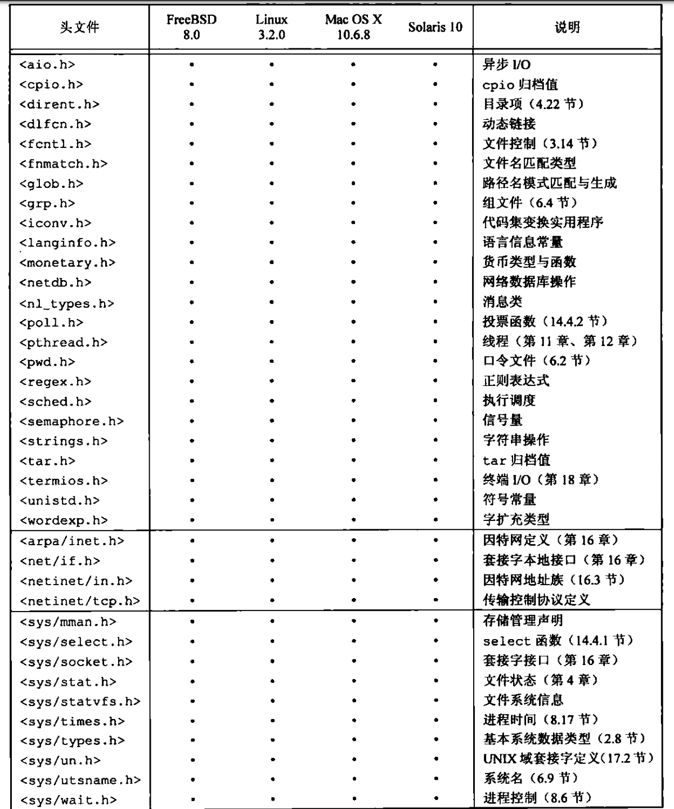
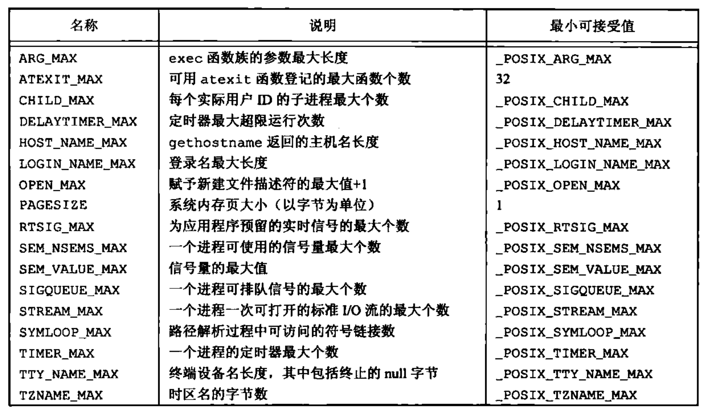
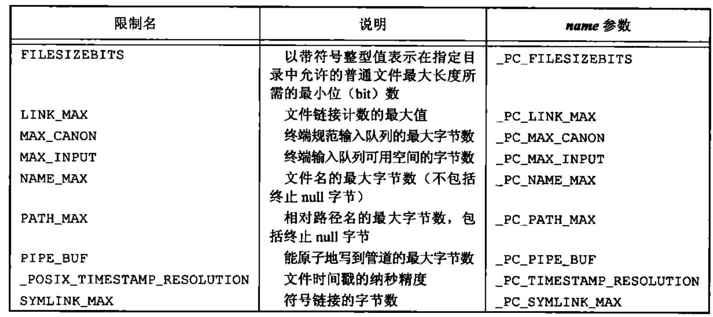

## Unix 基础知识

### 口令文件

* `/etc/passwd`

* 冒号分隔的字段的组成依次是：**登录名，加密口令，数字用户ID，数字组ID，注释字段，起始目录，shell 程序**

  `root:x:0:0:root:/root:/bin/bash`

### 输入输出

* **文件描述符:**（file descriptor) 是一个小的非负整数，内核用以标识一个特定进程正在访问的文件。当内核打开一个现有文件或创建一个新文件时，它都返回一个文件描述符。在读，写文件时，可以使用这个文件描述符
* **标准输入输出和错误:** 每当运行一个新程序时，所有的 `shell` 都为其打开 3 个文件描述符，即，标准输入，标准输出，标准错误。如果不做特殊处理，则 3 个描述符都链接向终端。大多数 `shell` 都提供一种方法，使其中任何一个或所有这 3 个描述符都能重新定向到某个文件
* **不带缓冲的 I/O:** 函数 `open`，`read`， `write`， `lseek` ，`close` 提供了不带缓冲的 I/O。这些函数都使用文件描述符
* **标准I/O:** 标准 I/O 函数为那些不带缓冲的 I/O 函数提供了一个带缓冲的接口。使用标准 I/O 函数无需担心如何选取最佳的缓冲区大小。

### 程序与进程

* **程序:** 是一个存储在磁盘上的某个目录的可执行文件，内核使用 `exec` 函数，将程序读入内存，并执行程序
* **进程和进程ID:** 程序的执行实例。`unix` 确保每个进程都有一个唯一的数字标识符，为进程ID，进程ID是一个非负整数
* **进程控制函数:** 有 3 个用于进程控制的主要函数：`fork`， `exec`(`exec` 函数有 7 种变体)，`waitpid`
* **线程和线程ID:** 一个进程内的所有线程共享同一地址空间，文件描述符，栈及与进程相关的属性。因为他们能访问同一存储区，所以各线程在访问共享数据时需要采取同步措施以避免不一致性。与进程相同，线程也用 ID 标识。但是线程 ID 只在它所属的进程内起作用。

### 用户标识

* **用户ID:** 是一个整数，它向系统标识各个不同的用户。
* **组ID:** 是一个整数。组用于将若干用户集合到项目或部门中去。组文件 `/etc/group`
* **附属组ID:** 除了在口令文件中对一个登录名指定一个组 ID 外，大多数 UNIX 系统版本还允许一个用户属于另外一些组。

### 信号

信号用于通知进程发生了某种情况。进程有以下 3 种处理信号的方式

* **忽略信号:** 有些信号表示硬件异常
* **按系统默认方式处理:** 通常是终止该进程
* **提供一个函数:** 信号发生时调用该函数，捕捉该信号。通过提供自编的函数。能指定什么时候产生了信号，并按期望的方式处理它

### 时间值

UNIX 系统使用两种不同的时间值

* 日历时间。该值是协调时间以来经过的秒数累计，系统基本数据类型 `time_t` 用于保存这种时间值

* 进程时间（CPU时间），用以度量进程使用的中央处理器资源。进程时间以时钟滴答计算。每秒中曾经取为 50，60，100个时钟滴答，系统基本数据类型 `clock_t` 保存这种时间值。使用 `sysconf` 函数得到每秒的时钟滴答数

* 进程执行时间：`unix` 系统为一个进程维护 3 个进程时间值，使用 `time` 获取 (`time -p`)

  1.时钟时间：进程运行的时间总量（其值与系统中同时运行的进程数有关）

  2.用户 CPU 时间：执行用户指令所用的时间量

  3.系统 CPU 时间：该进程执行内核程序所经历的时间
  
### 系统调用和库函数

* **系统调用：** 操作系统提供的服务入口点，由此程序向内核请求服务（提供一种最小接口）。用 C 语言定义，与具体系统如何调用一个系统调用的实现技术无关。

* **库函数：** `unix` 为每个系统调用在标准 C 库中设置一个具有相同名字的函数。用户进程用标准 C 调用序列来调用这些函数，然后，函数又用系统所要求的技术调用相应的内核服务。

### 各种 UNIX 标准及实现

#### 标准实现必须的头文件

*ISO C 标准定义的头文件*


POSIX 标准定义的必须的头文件*




#### POSIX 涉及的系统实现限制常量

*limits.h中的POSIX.1最小值*


*limits.h中的POSIX.1运行时不变值*



*limits.h中的XSI最小值*


#### 函数 sysconf、pathconf、fpathconf

运行时限制可调用下面 3 个函数之一获得

```c
#include <unistd.h>
// 所有函数返回值：若成功，返回相应值；若出错，返回 -1
long sysconf(int name);
long pathconf(const char *pathname, int name);
log fpathconf(int fd, int name);
```

后面两个函数的差别是一个用路径名作为其参数，另一个则取文件描述符作为参数

下图为 `sysconf` 函数所使用的 `name` 参数，它用于标识系统限制。以 `_SC_` 开始的常量用作标识运行时限制的`sysconf` 参数

*对sysconf的限制及name参数*


*pathconf和fpathconf函数标识系统限制所使用的name参数*



以上3 个函数的不同的返回值

1. 如果 `name` 参数并不是一个合适的常量，这 3 个函数都返回 -1，并把 `errno` 设置为 `EINVAL` 
2. 有些 `name` 会返回一个变量值（返回值 >= 0）或者提示该值是不确定的。不确定的值通过返回 -1来体现，而不改变 `errno` 的值
3. `_SC_CLK_RCK` 的返回值是每秒的时钟滴答数，用于 `times` 函数的返回值

对于 `pathconf` 的参数 `pathname` 和 `fpathconf` 的参数 `fd` 有很多限制。如果不满足其中任何一个限制，则结果是未定义的。

 1. `_PC_MAX_CANON` 和 `_PC_MAX_INPUT` 引用的文件必须是终端文件

 2. `_PC_LINK_MAX` 和 `_PC_TIMESTAMP_RESOLUTION` 引用的文件可以是文件或目录。如果是目录，则返回值用于目录本身，而不用于目录内的文件名项

 3. `_PC_FILESIZEBITS` 和 `_PC_NAME_MAX` 引用的文件必须是目录，返回值用于该目录中的文件名

 4. `_PC_PATH_MAX` 引用的文件必须是目录。当所指定的目录是工作目录时，返回值是相对路径名的最大长度

 5. `_PC_PIPE_BUF` 引用的文件必须是管道、FIFO或目录。在管道或 FIFO 情况下，返回值是对所引用的管道或 `FIFO` 的限制值。对于目录，返回值是对在该目录中创建的任一 `FIFO` 的限制值

 6. `_PC_SYMLINK_MAX` 引用的文件必须是目录。返回值是该目录中符号链接可包含字符串的最大长度

#### 基本系统数据类型

**基本系统数据类型：** 头文件`<sys/types.h>` 中定义了某些与实现有关的数据类型，还有一些类似数据类型定义在其他头文件中。在头文件中，这些数据类型都是用 C 的 `typedef` 来定义的。大多数都以 `_t` 结尾。用这种方式定义了这些数据类型后，就不需要考虑因系统不同而变化的程序实现细节

*一些常用的基本系统数据类型*


