## 各种 UNIX 标准及实现

### ISO C

ISO（ANSI 是美国国际标准学会的缩写，它是国际标准化组织中代表美国的成员） C 标准的意图是提供 C 程序的可移植性，使其能适合于大量不同的操作系统，而不只是适合 UNIX 系统。此标准不仅定义了 C 程序设计语言的语法和语义，还定义了其标准库。

*ISO C 标准定义的头文件*

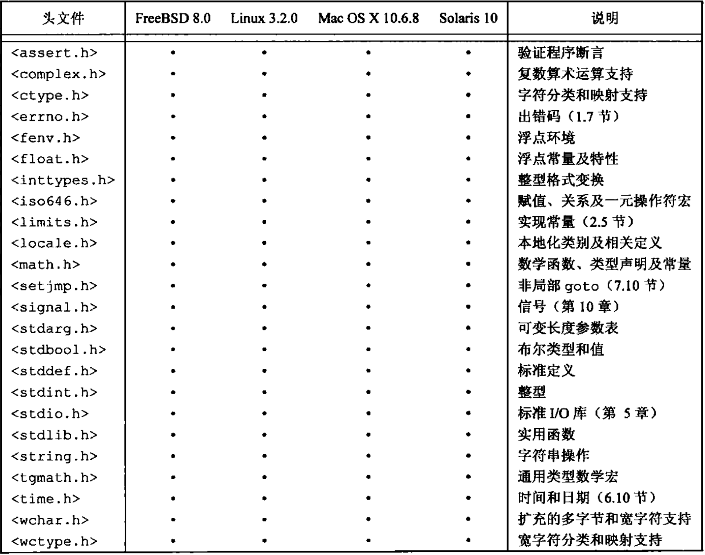

标准库不是 C 语言本身的构成部分，但是支持标准 C 的实现会提供该函数库中的函数声明、类型以及宏定义。可以通过 `#include <header.h>` 的方式访问头文件，头文件的包含顺序是任意的，并可包含多次。头文件必须被包含在任何外部声明或定义之外，并且在使用头文件中任何声明之前必须先包含头文件。头文件不一定是一个源文件

#### 输入输出 <stdio.h>

头文件 `<stdio.h>` 中定义的输入和输出函数、类型及宏的数目几乎占整个标准库的三分之一。

流（stream）是与磁盘或其他外围设备关联的数据的源或目的地。在某些系统（unix）中文本流和二进制流是相同的，但标准库仍然提供了这两种类型的流。

* 文本流是文本行组成的序列，每一行包含 0 个或多个字符，并以 `\n` 结尾。在某些环境中，可能需要将文本流转为其他表示形式（把 `\n` 映射成回车符和换行符），或从其他表示形式转换为文本流
* 二进制流是未经处理的字节构成的序列，这些字节记录着内部数据，并具有下列性质：如果在同一个系统中写入二进制流，然后再读取该二进制流，则读出和写入的内容完全相同

打开一个流，将把该流与一个文件或设备连接起来，关闭流将断开这种连接。打开一个文件将返回一个指向 FILE 类型对象的指针，该指针记录了控制该流的所有必要信息。

程序开始执行时，stdin、stdout、stderr 这三个流已经处理打开状态

##### 文件操作

下列函数用于处理与文件有关的操作。其中 `size_t` 是由运算符 `sizeof` 生成的无符号整型

```c
// 打开 filename 指定的文件，并返回一个与之相关联的流，失败返回 NULL
FILE *fopen(const char *filename, const char *mode)
```

mode 支持：

* `r`：打开文本文件用于读
* `w`：创建文本文件用于写，并删除已存在的文件
* `a`：追加，打开或创建文件，并向文件末尾追加内容
* `r+`：打开文本文件用于更新（读和写）
* `w+`：创建文本文件用于更新，并删除已存在的内容（如果有的话）
* `a+`：追加，打开或创建文本文件用于更新，写文件时追加到文件末尾

更新方式运行对同一文件进行读和写，**在读和写的交叉过程中，必须调用 `fflush` 函数或文件定位函数**，如果在上述访问模式之后加上 `b`，则表示对二进制文件进行操作。

文件名 `filename` 限定为最多为 `FILENAME_MAX = 1024` 个字符（must bu <= OPEN_MAX <sys/syslimits.h>）一次最多打开 `FOPEN_MAX = 20` 个文件（must be <= PATH_MAX <sys/syslimits.h>）

```C
// 以 mode 模式打开 filename 指定的文件，并将该文件关联到 stream 指定的流。返回 stream 流，出错返回 null。freopen 函数一般用于改变与 stdin stdout stderr 相关联的文件
FILE *freopen(const char *filename, const char *mode, FILE *stream)
// 对输出流来说，fflush 函数将已写到缓冲区但尚未写入文件的所有数据写到文件中。对输入流来说，其结果是未定义的。如果在写的过程中发生错误，则返回 EOF，否则返回 0。fflush(NULL) 将清洗所有的输出流
int fflush(FILE *stream)
// 函数将所有未写入的数据写入 stream 中，丢弃缓冲区中的所有未读输入数据，并释放自动分配的全部缓冲区，最后关闭流。若出错返回 EOF，否则返回 0
int fclose(FIEL *stream)
// 删除 filename 指定的文件，后续试图打开该文件的操作都将失败。如果删除操作失败，则返回一个非 0 值
int remove(const char *filename)
// 修改文件的名字。如果操作失败，返回一个非 0 值
int rename(const char *oldname, const char *newname)
// 以 wb+ 模式创建一个临时文件，该文件被关闭或程序正常结束时将被自动删除，创建成功返回一个流，失败返回 NULL
FILE *tmpfile(void)
// 创建一个与现有文件名不同的字符串，并返回一个指向内部静态数组的指针。tmpnam(s) 函数把创建的字符串保存到数组 s 中，并将它作为值返回。s 中执行要有 L_tmpnam 个字符的空间。tmpname 函数在每次被调用时均生成不同的名字。在程序执行过程中，最多只能确保生成 TMP_MAX 个不同的名字，tmpnam 函数只是用于创建一个名字而不是创建一个文件
char *tmpnam(char s[L_tmpnam])
// 控制流 stream 的缓冲，在执行读写以及其他任何操作之前必须调用此函数。当 mode 的值为 _IOFBF 时，将进行完全缓冲，为 _IOLBF 时，对文本文件进行行缓冲，_IONBF 时，不设置缓冲。如果 buf 的值不是 NULL，则将 buf 指向的区域作为流的缓冲区，否则将分配一个缓冲区。size 决定缓冲区的长度。出错返回非 0 值
int setvbuf(FILE *stream, char *buf, int mode, size_t size)
// 如果 buf 的值为 null，则关闭流 stream 的缓冲，否则等价于 （void）setvbuf(stream, buf, _IOFBF, BUFSIZ)
void setbuf(FILE *stream, char *buf)
```

##### 格式化输出

printf 函数提供了格式化输出转换

```c
// 按照 format 说明的格式对输出进行转换，并写到 steam 流中，返回实际写入的字节数，出错返回负值
int fprintf(FILE *stream, const char *format, ...)
```

格式串由两种类型的对象组成：普通字符（将被复制到输出流中）与转换说明（分别决定下一后续参数的转换或打印）每个转换说明均以字符 `%` 开头，以转换字符结束。在 `%` 与转换字符直接可以依次包含下列内容：

* 标志（可以以任意顺序出现），用于修改转换说明

  `-` 指定被转换的参数在其字段内左对齐

  `+` 指定在输出的数前面加上正负号

  空格，如果第一个字符不是正负号，则在其前面加上一个空格

  0 对于数值转换，当输出长度小于字段宽度时，添加前导 0 进行填充

  `#` 指定另一种输出形式。如果为 0 转换，则第一个数字为零；如果为 x 或 X 转换，则指定在输出的非 0 值前加 0x 或 0X；对于 e、E、f、g、G 转换，指定输出总包括一个小数点；对于 g 或 G 转换，指定输出值尾部无意义的 0 将被保留

* 一个数值，用于指定最小字段宽度。转换后的参数输出宽度至少要达到这个数值。如果参数的字符数小于此数值，则在参数左边（如果要求左对齐的话则为右边）填充一些字符。填充字符通常为空格，但是如果设置了 0 填充标志，则填充字符为 0

* 点号，用于分隔字段宽度和精度

* 表示精度的数。对于字符串，它指定打印的字符的最大个数；对于 e、E 或 f 转换，指定打印的小数点后的数字位数；对于 g 或 G 转换，它指定打印的有效数字位数；对于整型数，它指定打印的数字位数（必要时可加填充位 0 以达到要求的宽度）

* 长度修饰符 h、l、L。h 表示将相应的参数按 short 或 unsigned short 类型输出、l 表示将相应的参数按 long 或 unsigned long 类型输出；L 表示将相应的参数按 long double 类型输出

宽度和精度中的任何一个或两者都可以用 * 指定，这种情况下，该值将通过转换下一个参数计算得到（下一个参数必须为 int 类型）

如果 % 后面的字符不是转换字符，则其行为没有定义，支持以下转换字符：

* d, i

  int，有符号十进制表示

* o

  unsigned int，无符号八进制表示（无前导 0）

* x，X

  Unsigned int，无符号十六进制表示（无前导 0x 或 0X）。如果 0x，则使用 abcdef，如果是 0X，则使用 ABCDEF

* u

  int 无符号十进制表示

* c

  int 转换为 unsigned char 类型后为一个字符

* s

  char *，打印字符串中的字符，知道遇到 `\0` 或已打印了由精度指定的字符数

* f

  double，形式为 [-]mmm.ddd 的十进制表示，其中，d 的数目由精度确定，默认精度为 6，精度为 0 时不输出小数点

* e E

  double，形式为 [-]m.dddd e+_xx或[-]m.dddddd E+-XX 的十进制表示。d 的数目由精度确定，默认精度为 6，精度为 0 时不输出小数点

* g G

  double 当指数小于 -4 或大于等于精度时，采用 %e 或%E 的格式，否则采用 %f 的格式，尾部的 0 与小数点不打印

* p

  void *，打印指针值（具体表示方式与实现有关）

* n

  int *，到目前为止，此 printf 调用输出的字符的数目将被写入到相应的参数中，不进行参数转换

* %

  不进行参数转换，打印一个符号 %

```c
// 等价于 fprintf(stdout, ...)
int printf(const char, *format, ...)
// 与 printf 函数基本相同，但其输出将被写入字符串 s 中，并以 \0 结束，s 必须足够大，以足够容纳下输出结果。返回实际输出的字符数，不包括 \0
int sprintf(char *s, const char *format, ...)
// 与 printf 函数等价，但用 arg 代替了可变参数表，arg 由宏 va_start 初始化，也可能由 va_arg 调用初始化
int vprintf(const char *format, va_list arg)
int vfprintf(FILE *stream, const char *format, va_list arg)
int vsprintf(char *s, const char *format, va_list arg)
```

##### 格式化输入

scanf 的函数处理格式化输入转换

```c
// 根据格式串 format 从流 stream 中读取输入，并把转换后的值赋值给后续各个参数，其中的每个参数都必须是一个指针。当格式串 format 用完时，函数返回。如果到达文件的末尾或在转换输入前出错，该函数返回 EOF；否则返回实际被转换并赋值的输入项的数目
int fscanf(FILE *stream, const char *format,...)
```

格式串 format 可以包含下列项目：

* 空格或制表符

* 普通字符（%除外），它将与输入流中下一个非空白字符进行匹配

* 转换说明，由一个 %，一个赋值屏蔽字符 *（可选）、一个指定最大字段宽度的数（可选）、一个指定目标字段宽度的字符（h、l、L）（可选）以及一个转换字符组成

  转换说明决定了一个输入字段的转换方式。通常结果将被保存在由对应参数指向的变量中。如果转换说明中包含赋值屏蔽字符 `*`（如 `%*s`），则将跳过对应的输入字段，并不进行赋值。输入字段是由一个非空白符字符组成的字符串，当遇到下一个空白符或达到最大字段宽度（如果有的话）时，对当前输入字段的读取结束。scanf 函数可以跨越行的边界读取输入，因为换行符也是空白符（空白符包括空格、横向制表符、纵向制表符、换行符、回车符、换页符）对应的参数必须是指针。合法的转换字符类似 printf 函数转换字符

```c
// 等价于 fscanf(stdin, ...)
int scanf(const char *format,...)
// 等价 scanf(...)，输入字符来源于字符串 s
int sscanf(const char *s, const char *format,...)
```

##### 字符输入输出函数

```c
// 返回 stream 流的下一个字符，返回类型为 unsigned char（被转换为 int类型）如果到达文件末尾或发生错误，返回 EOF
int fgetc(FILE *stream)
// 最多将下 n -1 个字符读入到数组 s 中。当遇到换行符时，把换行符读入到数组 s 中，读取过程中止。数组 s 以 \0 结尾。返回数组 s。如果到达文件的末尾或发生错误，返回 null
char *fgets(char *s, int n, FILE *stream)
// 把字符 c 转化为 unsigned char 类型输出到流 stream 中，它返回写入的字符，出错返回 EOF
int fputc(int c, FILE *stream)
// 把字符串 s （不包含 \n）输出到流 stream 中；返回一个非负值，出错返回 EOF
int fputs(const char *, FILE *stream)
// 等价于 fgetc，当 getc 函数定义为宏时，可能多次计算 stream 的值
int getc(FILE *stream)
// 等价于 getc(stdin)
int getchar(void)
// 把下一个输入行读入到数组 s 中，并把末尾的换行符替换为 \0。返回数组 s，如果到达文件的末尾或发生错误，返回null
char *gets(char *s)
// 等价 fputc，当 putc 函数定义为宏时，可能多次计算 stream 的值
int putc(int c, FILE *stream)
// 等价于 putc(c, stdout)
int putchar(int c)
// 把字符串 s 和一个换行符输出到 stdout 中。如果发生错误，则返回 EOF，否则返回一个非负值
int puts(const char *s)
// 把 c 转换为 unsigned char 类型写回到流 stream 中，下次对该流进行读操作时，将返回该字符。对每个流只能写回一个字符，且此字符不能是 EOF。返回被写回的字符，出错返回 EOF
int ungetc(int c, FILE *stream)
```

##### 直接输入输出函数

```c
// fread 函数从流 stream 中读取最多 nobj 个长度为 size 的对象，并保存到 ptr 指向的数组中。它返回读取的对象数目，此返回值可能小于 nobj，必须通过函数 feof 和 ferror 获得结果执行状态
size_t fread(void *ptr, size_t size, size_t nobj, FILE *stream)
// fwrite 函数从 ptr 指向的数组中读取 nobj 个长度为 size 的对象，并输出到流 stream 中，返回输出的对象数目。如果发生错误，返回值会小于 nobj 的值
size_t fwrite(const void *ptr, size_t size, size_t nobj, FILE *stream)
```

##### 文件定位函数

|                 函数                 |             效果              |
| :----------------------------------: | :---------------------------: |
|     `fseek(file, 0L, SEEK_SET)`      |       定位至文件开始处        |
|     `fseek(file, 0L, SEEK_CUR)`      |       保持当前位置不动        |
|     `fseek(file, 0L, SEEK_END)`      |        定位到文件末尾         |
| `fseek(file, ftell(file), SEEK_SET)` | 到距文件开始 ftell 返回值位置 |

fseek 和 ftell 都将文件大小限制在 long 类型范围内。ASCI C 新增了两个处理大文件的新定位函数 fgetpost/fsetpos。这两个函数使用 fpos_t（在文件中指定一个位置，可以实现为结构）

```c
// 设置流 stream 的文件位置，后续的读写操作将从新位置开始。对于二进制文件，此位置被设置为从 origin 开始的第 offset 个字符处。origin 的值可以为 SEEK_SET（文件开始处）、SEEK_CUR（当前位置）或 SEEK_END（文件结束处）。对于文本流 offset 必须设置为 0，或者是由函数 ftell 返回的值（此时 origin 的值必须是 SEEK_SET）出错返回非 0 值, offset 负值时从末尾倒数
int fseek(FILE *steam, long offset, int origin)
// 返回 stream 流的当前文件位置。出错时该函数返回 -1L
long ftell(FILE *stream)
// 等价于 fseek(fp, 0L, SEEK_SET); clearerr(fp) 的执行结果
void rewind(FILE *stream)
// 把 stream 流的当前位置记录在 *ptr 中，供随后的 fsetpos 函数调用使用，出错则返回一个非 0 值
int fgetpos(FILE * restrict stream, fpos_t * restrict ptr);
// 将流 stream 的当前位置设置为 fgetpos 记录在 *ptr 中的位置。若出错则返回一个非 0 值
int fsetpos(FILE *stream, const fpos_t, *ptr)
```

##### 错误处理函数

当发生错误或到达文件末尾时，标准库中的许多函数都会设置状态指示符。这些状态指示符可被显式地设置和测试。整型表达式 errno（`<errno.h>` ）可以包含一个错误编号

```c
// 清除与流 stream 相关的文件结束符和错误指示符
void clearerr(FILE *stream)
// 如果设置了 stream 流相关的错误指示符，feof 返回一个非 0 值
int feof(FILE *stream)
// 如果设置了 stream 流相关的错误指示符，返回一个非 0 值
int ferror(FILE *stream)
// 打印字符 s 以及与 errno 中整型值相应的错误信息，错误信息的具体内容和实现有关，该函数的功能类似于 fprintf(stderr, "%s: %s\n", s, "error message")
void perror(const char *s)
```

#### 字符类别 <ctype.h>

头文件 `<ctype.h>` 中声明了一些测试字符的函数。每个函数的参数均为 int 类型，参数的值必须是 EOF 或可用 unsigned char 类型表示的字符，函数的返回值为 int 类型。如果参数 c 满足指定的条件，则函数返回非 0 值，否则返回 0。

```c
// isalpha(c) 或 isdigit(c) 为真
int isalnum(c)
// isupper(c) 或 islower(c) 为真
int isalpha(c)
// c 为控制字符
int iscntrl(c)
// c 为十进制数字
int isdigit(c)
// c 是除空格外的可打印字符
int isgraph(c)
// c 是小写字母
int islower(c)
// c 是包括空格的可打印字符
int isprint(c)
// c 是除空格、字母和数字外的可打印字符
int ispunct(c)
// c 是空格、换页、换行、回车、制表符
int isspace(c)
// c 是大写字母
int isupper(c)
// c 是十六进制数字
int isxdigit(c)
// 如果 c 是大写字母，返回对应小写字母，否则返回 c
int tolower(int c)
// 如果 c 是小写字母，返回对应大写字母，否则返回 c
int toupper(int c)
```

在 7 位 ASCII 字符集中，可打印字符是从 0x20 (' ') 到 0x7E（'~'）之间的字符；控制字符是从 0（NUL）到 0x1F（US）之间的字符以及字符 0x7F（DEL）

#### 字符串函数 <string.h>

头文件 <string.h> 定义了两组字符串函数，第一组函数的名字以 str 开头；第二组函数的名字以 mem 开头。除函数 memmove 外，其他函数都没有定义重叠对象间的复制行为。比较函数把参数作为 unsigned char 类型数组看待

下列函数中变量 s 和 t 的类型的类型为 `char *`；cs 和 ct 的类型为 `const char *`；n 的类型为 size_t；c 的类型为 int（将被转换为 char 类型）

```c
// 将字符串 ct 包含 \0 复制到字符串 s 中，并返回 s
char *strcpy(s, ct)
// 将字符串 ct 中最多 n 个字符复制到字符串 s 中，并返回 s。如果 ct 中少于 n 个字符，则用 \0 填充
char *strncpy(s, ct, n)
// 将字符串 ct 连接到 s 的尾部，并返回 s
char *strcat(s, ct)
// 将字符串 ct 中最多前 n 个字符连接到字符串 s 的尾部，并以 \0 结束，返回 s
char *strncat(s, ct, n)
// 比较字符串 cs 和 ct，当 cs < ct 时，返回一个负数，等于返回 0，大于返回大于 0
int strcmp(cs, ct)
// 将字符串 cs 中前 n 个字符与字符串 ct 向比较。返回同 strcmp
int strncmp(cs, ct, n)
// 返回指向字符 c 在字符串 cs 中第一次出现的位置的指针；如果 cs 中不包含 c，返回 NULL
char *strchr(cs, c)
// 返回指向字符 c 在字符串 cs 中最后一次出现的位置的指针；如果 cs 中不包含 c，返回 NULL
char *strrchr(cs ,c)
// 返回字符串 cs 中包含 ct 中的字符的前缀的长度
size_t strspn(cs, ct)
// 返回字符串 cs 中不包含 cs 中的字符的前缀的长度
size_t strcspn(cs, ct)
// 返回一个指针，它指向字符串 ct 中的任意字符第一次出现在字符串 CS 中的位置；如果 CS 中没有与 ct 相同的字符，返回 null
size_t strpbrk(cs, ct)
// 返回第一个指针，指向字符串 ct 第一次出现在字符串 cs 中的位置，如果 cs 中不包含字符串 ct，返回 null
char *strstr(cs, ct)
// 返回 cs 长度
size_t strlen(cs)
// 返回一个指针，指向与错误编号 n 对应的错误信息字符串
char *strerror(n)
// strtok 函数在 s 中搜索由 ct 中的字符界定的记号，对该函数进行一系列调用，可以吧字符串 s 分成许多记号，这些记号以 ct 中的字符为分界符。第一次调用时，s 为非空。它搜索 s，找到不包含 ct 中字符的第一个记号，将 s 中的下一个字符替换为 \0，并返回指向记号的指针。随后每次调用 strtok 函数时（由 s 值是否为 null 指示），均返回下一个不包含 ct 中字符的记号。当 s 中没有这样的记号时，返回 NULL。每次调用时字符串 ct 可以不同
char *strtok(s, ct)
```

以 mem 开头的函数按照字符数组的方式操作对象，其主要目的是提供一个高效的函数接口，下列函数中，s 和 t 的类型均为 `void *`，cs 和 ct 的类型均为 `const void *`， n 的类型为`int`（将被转换为 `unsigned char` 类型）

```c
// 将字符串 ct 中的 n 个字符拷贝到 s 中，并返回 s
void *memcpy(s, ct, n)
// 该函数的功能与 memcpy 相似，不同的是当对象重叠时，该函数仍能正确执行
void *memmove(s, ct, n)
// 将 cs 的前 n 个字符与 ct 进行比较，返回与 strcmp 返回值相同
int memcmp(cs, ct, n)
// 返回一个指针，指向 c 在 cs 中第一次出现的位置，如果在 cs 的前 n 个字符中找不到匹配，返回 null
void *memchr(cs, c, n)
// 将 s 中的前 n 个字符替换为 c，并返回 s
void *memset(s, c, n)
```

#### 数学函数 <math.h>

在下列函数中，x 和 y 的类型为 double，n 的类型为 int，所有函数返回值的类型均为 double，三角函数的角度用弧度表示

```c
// x 正弦值
double sin(x)
// x 余弦值
double cos(x)
// x 正切值
double tan(x)
// 幂函数
double exp(x)
// 自然对数 x > 0
double log(x)
// 以10为低对数
double log10(x)
// x 的 y 次方，如果 x = 0 且 y <= 0,获取 x < 0 且 y 不是整型数，将产生定义域错误
double pow(x, y)
// x 的平方根
double sqrt(x)
// 向上取整
double ceil(x)
// 向下取整
double floor(x)
// x 的绝对值
double fabs(x)
// x * 2 的 n 次方
double ldexp(x, n)
double frexp(x, int *exp)
// 把 x 分成整数和小数部分，正负号均与 x 相同，返回小数部分，整数保存在 *ip 中
double modf(x, double *ip)
// x/y 的浮点余数
double fmod(x, y)
```

#### 标准库 <stdlib.h>

```go
// 将字符串 s 转换为 double 类型，等价于 strtod(s, (char**), null)
double atof(const char *s)
// 将字符串 s 转换为 int 类型，等价于 (int) strtol(s, (char**), null 10)
int atoi(const char *s)
// 将字符串 s 转换为 long 类型，等价于 strtol(s, (char**), null, 10)
long atol(const char *s)
// 将字符串 s 的前缀转换为 double 类型，并在转换时跳过 s 的前导空白符。除非 endp 为 NULL，否则该函数将把指向 s 中未转换部分（s 的后缀部分）的指针保存在 *endp 中，如果结果上溢，则该函数返回带有适当符号的 HUGE_VAL；如果结果下溢，则返回 0，在这两种情况下，errno 都将被设置为 ERANGE
double strtod(const char *s, char **endp)
// 将字符串 s 的前缀转换为 long 类型，并在转换时跳过 s 的前导空白符。除非 endp 为 NULL，否则该函数将把指向 s 中未转换部分（s 的后缀部分）的指针保存在 *endp 中，如果 base 的取值在 2～26 之间，则假定输入是以该数为基底的；如果base 为 0，则基底为八进制、十进制、十六进制。以 0 为前缀的是八进制，以 0x 或 0X 为前缀的是十六进制。无论哪种情况下，字母均表示 10 ~ base - 1 之间的数字。如果 base 值是 16，则可以加上前导 0x 或 0X。如果结果上溢，则函数根据结果的符号返回 LONG_MAX 或 LONG_MIN，同时将 errno 的值设置为 ERANGE
long strtol(const char *s, char **endp, int base)
// 与 strtol 函数相同，但其结果为 unsigned long 类型，错误值为 ULONG_MAX
unsigned long strtoul(const char *s, char **endp, int base)
// 产生一个 0 ～ RANG_MAX 之间的伪随机整数，RAND_MAX 的取值至少为 32767
int rand(void)
// 将 seed 作为生成新的伪随机数序列的种子数，种子数 seed 的初值为 1
void srand(unsigned int seed)
// 为由 nobj 个长度为 size 的对象组成的数组分配内存，并返回指向分配区域的指针，若无法满足要求，则返回 null，该空间的初始长度为 0 字节
void *calloc(size_t nobj, size_t size)
// 为长度为 size 的对象分配内存，并返回指向分配区域的指针，若无法满足要求，返回 null，该函数不对分配的内存区域进行初始化
void *malloc(size_t size)
// 将 p 指向的对象的长度修改为 size 个字节，如果新分配的内存比原内存大，则原内存的内容保持不变，增加的空间不进行初始化。如果新分配的内存比原内存小，则新分配内存单元不被初始化。realloc 函数返回指向新分配空间的指针；若无法满足要求，则返回 null，在这种情况下，原指针 p 指向的单元内容保持不变
void *realloc(void *p, size_t size)
// 释放 p 指向的内存空间，当 p 的值为 null 时，该函数不执行任何操作。p 必须指向先前使用动态分配函数 malloc, realloc, calloc 分配的空间
void free(void *p)
// aboort 函数使程序非正常终止，其功能与 raise(SIGABRT) 类似
void abort(void)
// 使程序正常终止，atexit 函数的调用顺序与登记的顺序相反，这种情况下，所有已打开的文件缓冲区将被清洗，所有已打开的流将被关闭，控制也将返回给环境。status 的值如果返回给环境要视具体的实现而定，但 0 值表示终止成功，也可使用值 EXIT_SUCCESS 和 EXIT_FALLURE 为返回值
void exit(int status)
// 登记函数 fcn，该函数将在程序正常终止时被调用。如果登记失败，则返回非 0 值
int atexit(void (*fcn)(void))
// 将字符串 s 传递给执行环境。如果 s 的值为 NULL，并且有命令处理程序，则该函数返回非 0 值。如果 s 的值不是 null，则返回值与具体的实现有关
int system(const char *s)
// 返回与 name 有关的环境字符串，如果该字符串不存在，返回 null，细节与具体实现有关
char *getenv(const char *name)
// 在 base[0] ~ base[n - 1] 之间查找与 *key 匹配的项，在函数 cmp 中，如果第一个参数（查找关键字）小于第二个参数（表项），它必须返回一个负值；如果第一个参数等于第二个参数，返回 0，大于返回正整数。数组 base 中的项必须按升序排列，返回一个指针，执行一个匹配项，如果不存在匹配项，返回 null
void *bsearch(const void *key, const void *base, size_t n, size_t size, int (*cmp)(const void *keryval, const void *datum))
// 对 base[0] ~ base[n - 1] 数组中的对象进行升序排序，数组中每个对象的长度为 size，比较函数 cmp 与 bsearch 函数中的描述相同
void qsort(void *base, size_t n, size_t size, int (*cmp)(const void *, const void *))
// 函数返回 int 类型参数 n 的绝对值
int abs(int n)
// 返回 long 类型参数 n 的绝对值
long labs(long n)
// num/denom 的商和余数，并把结果分别保存在结构类型 div_t 的两个 int 类型的成员 quot 和 rem 中
div_t div(int num, int denom)
// 计算 num/denom 的商和余数，并把结果分别保存在结构类型 ldiv_t 的两个 long 类型的成员 quot 和 rem 中
ldiv_t ldiv(long num, long denom)
```

#### 信号 <signal.h>

处理程序运行期间引发的各种异常条件的功能，比如来源于外部的中断信号或程序执行错误引起的中断信号

```c
void (*signal(int sig, void(*handler)(int)))(int)
```

决定了如何处理后续的信号。如果 handler 的值是 SIG_DFL，则采用由实现定义的默认行为；如果 handler 的值是 SIG_IGN，则忽略该信号；否则调用 handler 指向的函数（以信号作为参数），有效的信号包括：`SIGABRT`，异常终止（如由 abort 引起的终止），`SIGFPE`，算术运算错误，`SIGILL` 非法函数映像（非法指令），`SIGINT`，交互式目的信号，如中断，`SIGSEGV`，非法存储器访问（访问不存在的内存单元），`SIGTERM`，发送给程序的终止请求。

对于特定的信号，signal 将返回 handler 的前一个值；如果出现错误，则返回值 SIG_ERR。当随后碰到信号 sig 时，该信号将恢复为默认行为，随后调用信号处理程序，就好像由 `(*handler)(sig)` 调用一样。信号处理程序返回后，程序将从信号发生的位置重新开始执行。信号的初始状态由具体实现定义

```c
// 向程序发送信号 sig，如果发生不成功，返回非 0 值
int raise(int sig)
```

#### 日期时间 <time.h>

声明了一些处理日期与时间的类型和函数。其中的一些函数用于处理当地时间，因为时区等原因，当地时间与日历时间可能不相同。`clock_t` 和 `time_t` 是两个表示时间的算术类型，`struct tm` 用于保存日历时间的各个构成部分。结构 tm 成员：

```c
struct tm {
  int tm_sec; // 当前分钟开始经过的秒数（0，61）
  int tn_min; // 从当前小时开始经过的分钟数(0，59)
  int tm_hour; // 从午夜开始经过的小时数（0，23）
  int tm_mday; // 当月的天数（1，31）
  int tm_mon; // 从 1 月起经过的月数(0，11)
  int tm_year; // 从 1990 年起经过的年数
  int tm_wday; // 从星期天起经过的天数（0，6）
  int tm_isdst;  // 夏令时标记，使用夏令时是为正，否则为 0，该信息无效，则值为负
}
// 返回程序开始执行后占用的处理器时间，如果无法获取处理器时间，则返回 -1，clock()/CLOCKS_PER_SEC 是以秒为单位表示的时间
clock_t cloct(void)
// 返回当前日历时间，如果无法获取日历时间，返回 -1，如果 tp不是 null，则同时将返回值赋给 *tp
time_t time(time_t *tp)
// 返回 time2-time1的值，以秒为单位
double difftime(time_t time2, time_t time1)
// 将结构 *tp 中的当地时间转换为 time 表示方式相同的日历时间，结构中各成员的值位于上面所示范围之内。mktime 返回转换后得到的日历时间，如果该时间不能表示，则返回 -1
time_t mktime(struct tm *tp)
// 下面四个函数返回可被其他调用覆盖的静态对象的指针
char *asctime(const struct tm *tp) // 将结构 tp 中时间转为 Sun Jan 3 15:14:13 1988\n\0 的字符串形式
// ctime 函数将结构 *tp 中的日历时间转换为当地时间，等价于 asctime(localtime(tp))
char *ctime(const time_t *tp)
// 将 *tp 中的日历时间转换为UTC，如果无法获取 UTC，则该函数返回 NULL。
struct tm *gettime(const time_t *tp)
// 将结构 *tp 中的日历时间转换为当地时间
struct tm *localtime(const time_t *tp)
// 根据 fmt 中的格式把结构 *tp 中的日期与时间转换为指定的格式，并存储到 s 中，返回时间写到 s 中的字符串不包括 \0,如果字符数多于 smax，该函数返回 0
size_t strftime(char *s, size_t smax, const char *fmt, const struct tm *tp)
```

### POSIX 标准

POSIX 是一个最初由 IEEE（Institute of Electrical and Electronics Engineers，电气和电子工程师学会）制定的标准族，POSIX 指的是可移植操作系统接口（Portable Operating System Interface）它原来指的只是 IEEE 标准 1003.1-1988（操作系统接口），后来则扩展成包括很多标记为 1003 的标准及标准草案

*POSIX 标准定义的必须的头文件*

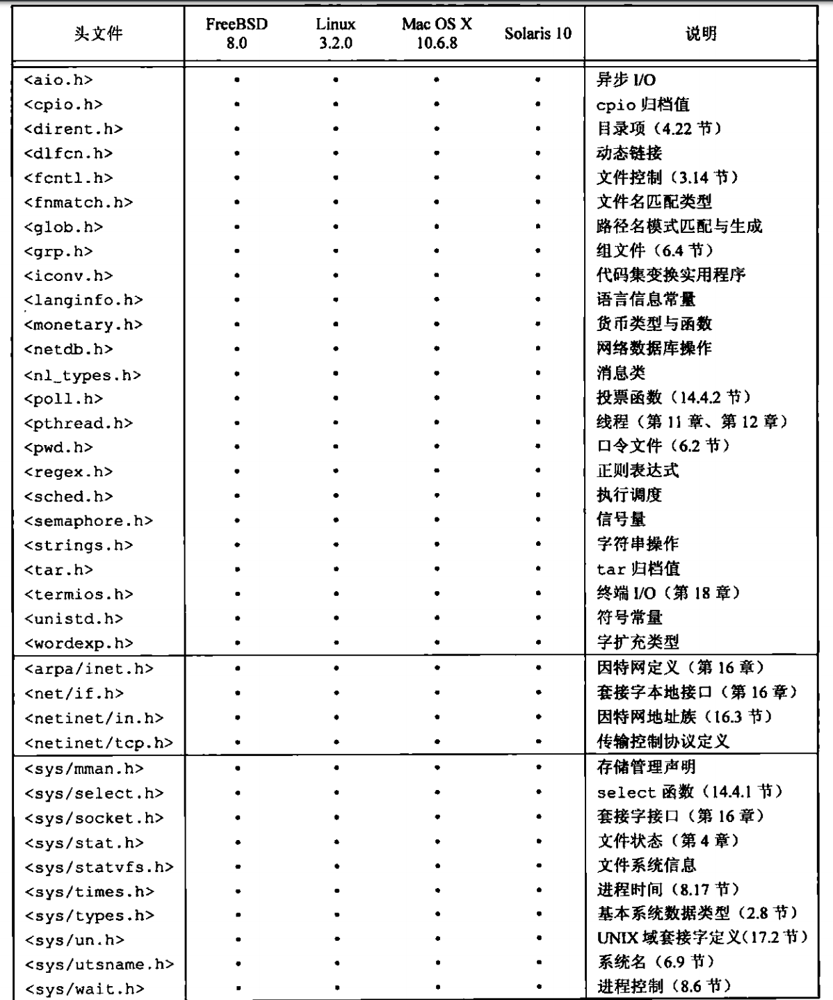

#### POSIX 涉及的系统实现限制常量

*limits.h中的POSIX.1最小值*

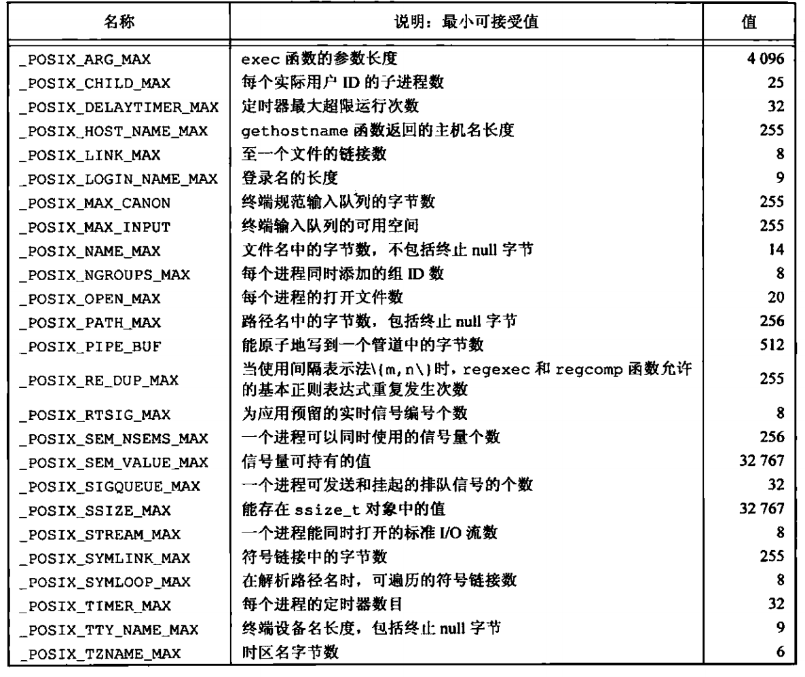

*limits.h中的POSIX.1运行时不变值*

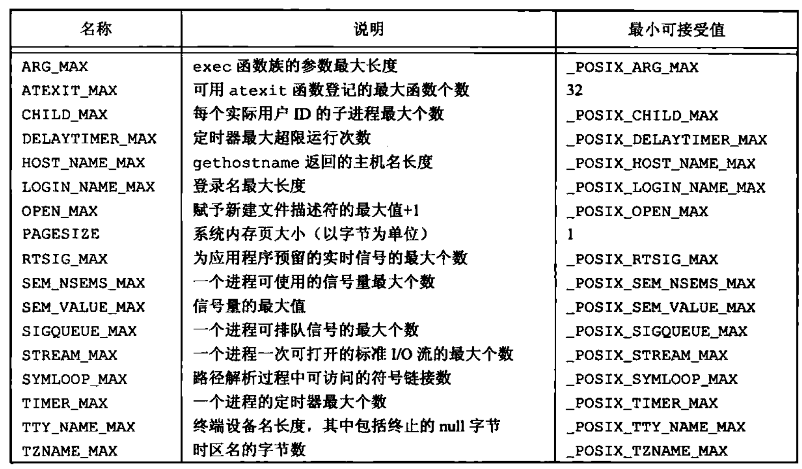

*limits.h中的XSI最小值*

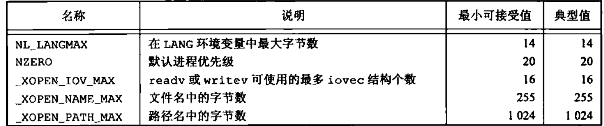

### Single UNIX Specification

SUS（单一UNIX规范）是 POSIX.1 标准的一个超集，它定义了一些附加接口扩展了 POSIX.1 规范提供的功能。POSIX.1 相当于 Single UNIX Specification 中的基本规范部分

POSIX.1 中的 X/Open 系统接口（X/Open System Interface，XSI）选项描述了可选的接口，它定义了遵循 XSI 的实现必须支持 POSIX.1 的那些可选部分。这些必须的支持的部分包括：文件同步、线程栈地址和长度属性、线程进程共享同步以及 `_XOPEN_UNIX` 符号常量。只有遵循 XSI 的实现才能称为 UNIX 系统

### 限制

UNIX 系统实现定义了很多幻数和常量，其中有很多已被硬编码到程序中，或用特定的技术确定。以下两种类型的限制是必须的：

* 编译时限制

  可以头文件中定义，程序在编译时可以包含这些头文件

* 运行时限制

  要求进程调用一个函数获得限制值

某些限制在一个给定的实现中可能是固定的（因此可以静态地在一个头文件中定义），而在另一个实现中则可能是变动的（需要有一个运行时函数调用）。为了解决这类问题，提供了以下三种限制：

* 编译时限制（头文件）
* 与文件或目录的运行时限制（sysconf 函数）
* 与文件或目录有关的运行时限制（pathconf 和 fpathconf 函数）

#### ISO C 限制

ISO C 定义的所有编译时限制都列在头文件 `<limits.h>` 。这些限制常量在一个给定系统中并不会改变。

*<limits.h>中定义的整型值大小*

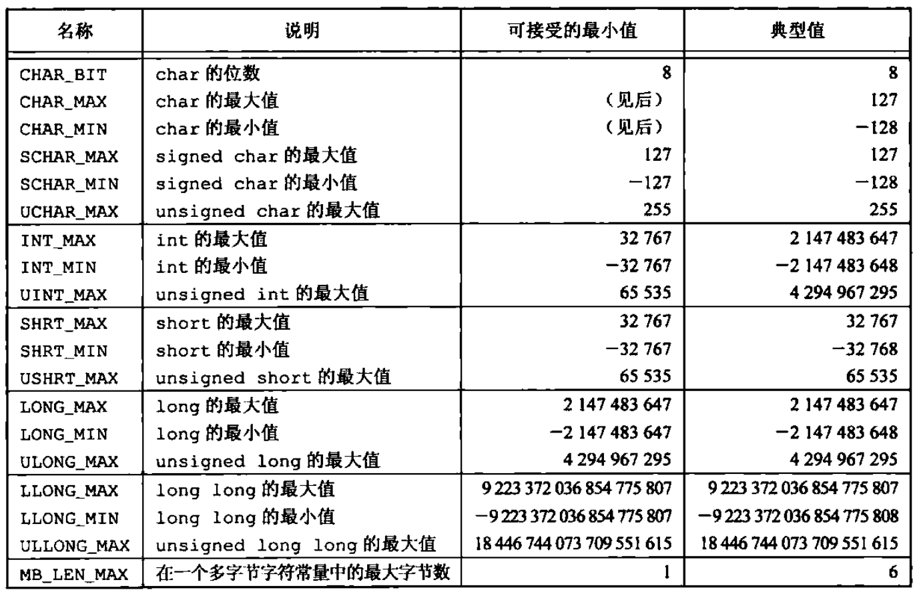

#### POSIX 限制

POSIX.1 定义了很多涉及操作系统实现限制的常量，POSIX.1 定义了大量限制和常量，这些限制和常量分为：

* 数值限制：`LONG_BIT`、`SSIZE_MAX`、`WORD_BIT`

* 最小值：`<limits.h>` 中定义的 POSIX.1 最小值

  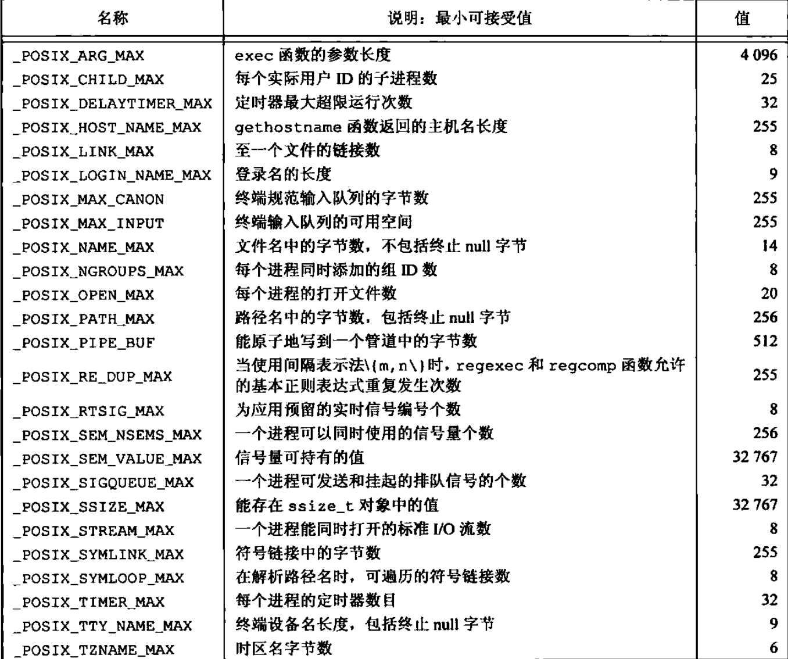

* 最大值：`_POSIX_CLOCKRES_MIN`

* 运行时可以增加的值：`CHARCLASS_NAME_MAX`、`COLL_WEIGHTS_MAX`、`LINE_MAX`、`NGROUPS_MAX`、`RE_DUP_MAX`

* 运行时不变值（可能不确定）：<limits.h> 中的 POSIX.1 运行时不变值

  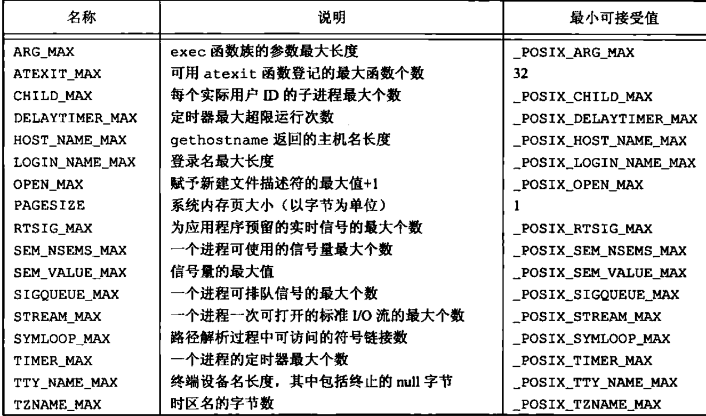

* 其他不变值：`NL_ARGMAX`、`NL_MSGMAX`、`ML_SETMAX`、`NL_TEXTMAX`

* 路径名可变值：`FILESIZEBITS`、`LINK_MAX`、`MAX_CANON`、`MAX_INPUT`、`NAME_MAX`、`PATH_MAX`、`PIPE_BUF`、`SYMLINK_MAX`

#### XSI 限制

XSI 定义了代表实现限制的几个常量

* 最小值

  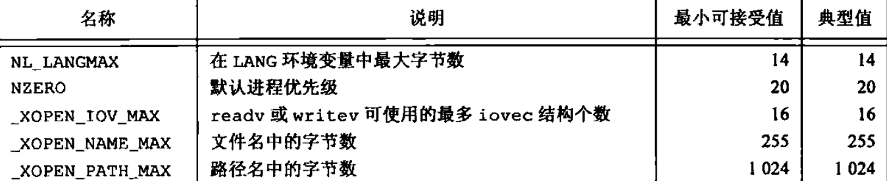

* 运行时不变值（可能不确定）：`IOV_MAX` 和 `PAGE_SIZE`

#### 函数 sysconf、pathconf、fpathconf

运行时限制可调用下面 3 个函数之一获得

```c
#include <unistd.h>
// 所有函数返回值：若成功，返回相应值；若出错，返回 -1
long sysconf(int name);
long pathconf(const char *pathname, int name);
log fpathconf(int fd, int name);
```

后面两个函数的差别是一个用路径名作为其参数，另一个则取文件描述符作为参数

下图为 `sysconf` 函数所使用的 `name` 参数，它用于标识系统限制。以 `_SC_` 开始的常量用作标识运行时限制的`sysconf` 参数

*对sysconf的限制及name参数*

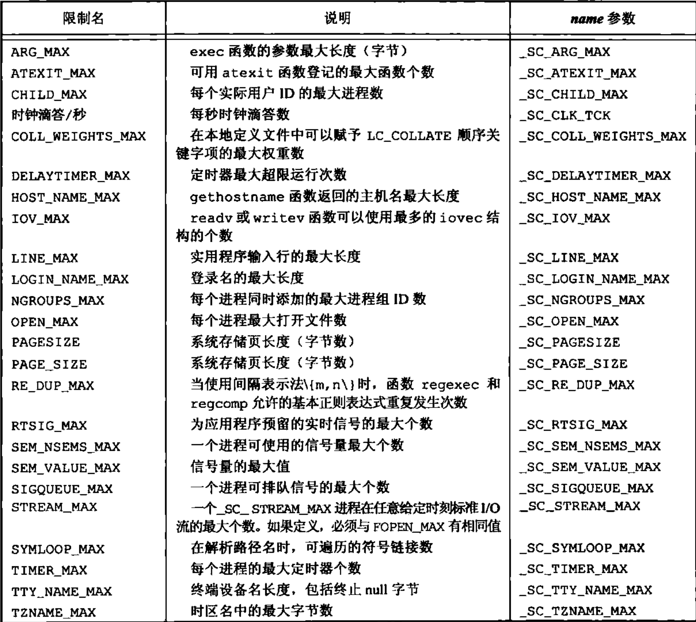

*pathconf和fpathconf函数标识系统限制所使用的name参数*

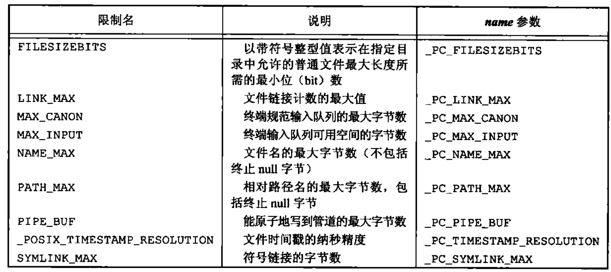

以上3 个函数的不同的返回值

1. 如果 `name` 参数并不是一个合适的常量，这 3 个函数都返回 -1，并把 `errno` 设置为 `EINVAL` 
2. 有些 `name` 会返回一个变量值（返回值 >= 0）或者提示该值是不确定的。不确定的值通过返回 -1来体现，而不改变 `errno` 的值
3. `_SC_CLK_RCK` 的返回值是每秒的时钟滴答数，用于 `times` 函数的返回值

对于 `pathconf` 的参数 `pathname` 和 `fpathconf` 的参数 `fd` 有很多限制。如果不满足其中任何一个限制，则结果是未定义的。

 1. `_PC_MAX_CANON` 和 `_PC_MAX_INPUT` 引用的文件必须是终端文件

 2. `_PC_LINK_MAX` 和 `_PC_TIMESTAMP_RESOLUTION` 引用的文件可以是文件或目录。如果是目录，则返回值用于目录本身，而不用于目录内的文件名项

 3. `_PC_FILESIZEBITS` 和 `_PC_NAME_MAX` 引用的文件必须是目录，返回值用于该目录中的文件名

 4. `_PC_PATH_MAX` 引用的文件必须是目录。当所指定的目录是工作目录时，返回值是相对路径名的最大长度

 5. `_PC_PIPE_BUF` 引用的文件必须是管道、FIFO或目录。在管道或 FIFO 情况下，返回值是对所引用的管道或 `FIFO` 的限制值。对于目录，返回值是对在该目录中创建的任一 `FIFO` 的限制值

 6. `_PC_SYMLINK_MAX` 引用的文件必须是目录。返回值是该目录中符号链接可包含字符串的最大长度

#### 不确定的运行时限制

如果这些限制值没有在头文件 `<limits.h>` 中定义，那么在编译时也就不能使用它们，但是，如果它们的值是不确定的，那么在运行时它们可能也是未定义的。

##### 路径名

很多程序需要为路径名分配存储区，一般来说，在编译时就为其分配了存储区，而且不同的程序使用各种不同的幻数作为数组长度（如 256，512，1024，BUFSIZ），4.3 BSD 头 `<sys/param.h>` 中的常量 `MAXPATHLEN` 才是正确的值，但是很多 4.3 BSD 应用程序并未使用它

##### 最大打开文件数

守护进程中常见操作是关闭所有打开文件。这些代码假定在 `<sys/param.h>` 头文件中定义了常量 `NOFILE`，另外一些程序使用某些 `<stdio.h>` 版本提供的作为上限的常量 `_NFILE/FOPEN_MAX`，某些程序直接将其硬编码为 20。

可以使用 bash 内建命令 ulimit 来更改进程可同时打开文件的个数。

### 选项

如果要编写可移植的应用程序，而这些程序可能会依赖于这些可选的支持的功能，那么就需要一种可移植的方法来判断实现是否支持一个给定的选项。如果对限制的处理，POSIX.1 定义了 3 种处理选项的方法：

* 编译时选项定义在 `<unistd.h>` 中
* 与文件或目录无关的运行时选项用 `sysconf` 函数来判断
* 与文件或目录有关的运行时选项通过调用 `pathconf` 或 `fpathconf` 函数来判断

对于每一个选项，有以下三种可能的平台支持状态：

* 如果符号常量没有定义或定义值为 -1，那么该平台在编译时并不支持相应选项。但是有一种可能，即在已支持该选项的新系统上运行老的应用时，即使该选项在应用编译时未被支持，但如今新系统运行时检查会显示该选项已被支持
* 如果符号常量的定义值大于 0，那么该平台支持相应选项
* 如果符号常量定义值为 0，则必须调用 `sysconf`、`pathconf`、`fpathconf` 来判断相应选项是否受到支持

### 基本系统数据类型

**基本系统数据类型：** 头文件`<sys/types.h>` 中定义了某些与实现有关的数据类型，还有一些类似数据类型定义在其他头文件中。在头文件中，这些数据类型都是用 C 的 `typedef` 来定义的。大多数都以 `_t` 结尾。用这种方式定义了这些数据类型后，就不需要考虑因系统不同而变化的程序实现细节

*一些常用的基本系统数据类型*

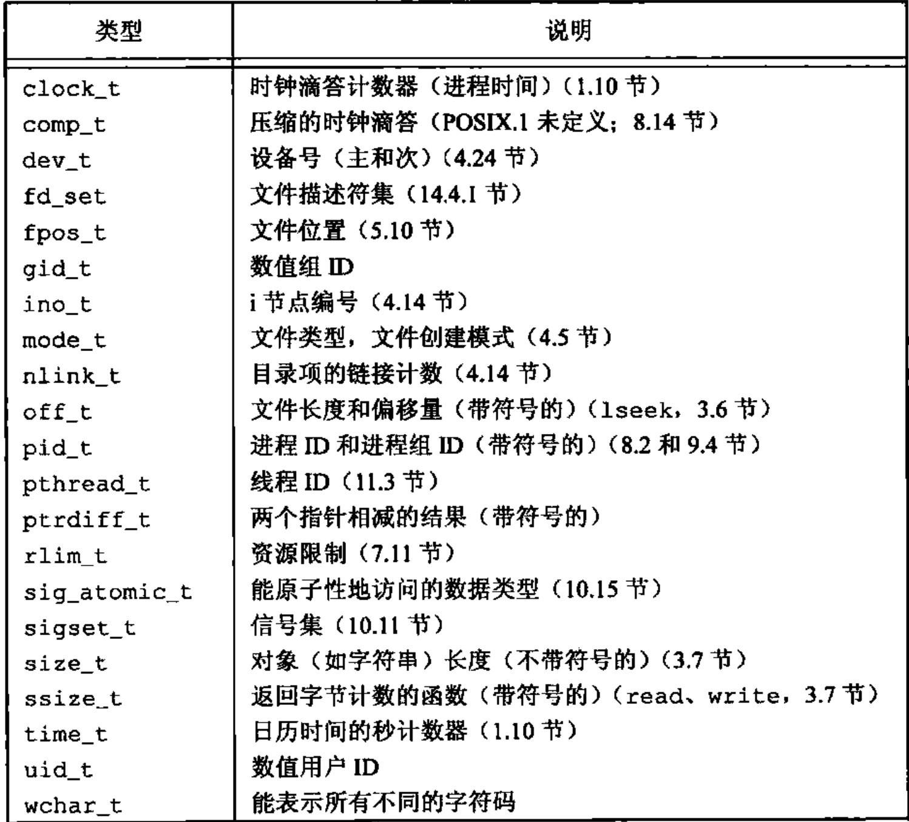

### 标准冲突

SUS 基本与 POSIX.1 一只，当 POSIX.1 标准与 ISO C 标准冲突时，服从 ISO C 标准。

