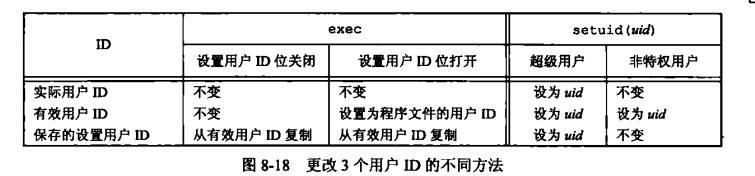

## 进程

### main 函数

c 程序总是从 `main` 函数开始执行。

`int main(int argc, char *argv[]);`

`argc` 是命令行参数的数目，`argv` 是指向参数的各个指针所构成的数组。

当内核执行 C 程序时（使用一个 `exec` 函数），在调用 `main` 前先调用一个特殊的启动例程。可执行程序文件将此启动例程指定为程序的起始地址（由编辑器设置的，而连接编辑器则由 C 编译器调用。启动例程从内核取得命令行参数和环境变量值，然后为调用 `main` 函数做好安排）
### 进程终止

有 8 种方式使进程终止，其中 5 种为正常终止

* 从 `main` 返回
* 调用 `exit`
* 调用 `_exit` 或 `_Exit`
* 最后一个线程从其启动例程返回
* 从最后一个线程调用 `pthread_exit` 

异常终止 3 种

* 调用 abort
* 接到一个信号
* 最后一个线程对取消请求做出响应

#### 退出函数

以下 3 个函数用于正常终止一个程序：`_exit` 和 `_Exit` 立即进入内核，`exit` 则先执行一些清理处理，然后返回内核

```c
#include <stdlib.h>
void exit(int status);
void _Exit(int status);
#include <unistd.h>
void _exit(int status);
```

`exit` 函数总是执行一个标准 I/O  库的清理关闭操作：对于所有打开流调用 `fclose` 函数（将输出缓冲中的所有数据都被冲洗）

3 个函数都带一个整型参数，为终止状态。大多数 `UNIX` 系统 `shell` 都提供检查进程终止状态的方法。如果调用这些函数时不带终止状态，或 `main` 执行了一个无返回值的 `return` 语句，或 `main` 没有声明返回类型为整型，则该进程的终止状态是未定义的。但是，若 `main` 的返回类型是整型，并且 `main` 执行到最后一条语句时返回（隐式返回），那么该进程的终止状态是 0

`main` 函数返回一个整型值与用该值调用 `exit` 是等价的。在 `main` 函数中 `exit(0)` 等价于 `return(0)`

#### 函数 `atexit`

按照 ISO C 的规定，一个进程可以登记多至 32 个函数，这些函数将由 `exit` 自动调用。这些函数为终止处理程序，并调用 `atexit` 函数来登记这些函数

```c
#include <stdlib.h>
// 返回值：若成功，返回 9；若出错，返回非 0
int atexit(void (*func)(void));
```

`atexit` 的参数是一个函数地址，当调用此函数时无需向它传递任何参数，也不期望它返回一个值。`exit` 调用这些函数的顺序与它们登记时候的顺序相反。用以函数如登记多次，也会被调用多次。

`exit` 首先调用各终止处理程序，然后关闭（通过 `fclose` ）所有打开流。如若程序调用 `exec` 函数族中的任一函数，则将清除所有已安装的终止处理程序。

*c程序的启动和终止*


内核使程序执行的唯一方法是调用一个 `exec` 函数。进程自愿终止的唯一方法是显式或隐式（通过调用 `exit`）调用 `_exit` 或 `_Exit` 。进程也可非自愿地由一个信号使其终止

### 环境表

每个程序都接收到一张环境表。与参数表一样，环境表也是一个字符指针数组，其中每个指针包含一个以 `null` 结束的 c 字符串的地址。全局变量 `environ` 则包含了该指针数组的地址 `extern char **environ`

如果该环境包含 5 个字符串，那么它看起来如图 7 - 5 中所示。其中，每个字符串的结尾处都显示地有一个 `null` 字节。`environ` 为环境指针，指针数组为环境表，其中个指针指向的字符串为环境字符串


按照惯例，环境由 `name = value` 这样的字符串组成，大多数预定义名完全由大写字母组成，但这只是一个惯例。通常用 `getenv` 和 `putenv` 函数来访问特定的环境变量，而不是用 `environ` 变量。如果要查看整个环境，则必须使用 `environ` 指针

### C程序的存储空间布局

C 程序一直由下列几部分组成：

* **正文段:** 由 CPU 执行的机器指令部分。通常，正文段是可共享的，所以即使是频繁执行的程序（如文本编辑器、C 编译器和 `shell` 等）在存储器中也只需有一个副本，正文段常常是只读的，以防止程序由于意外而修改其指令
* **初始化数据段：** 通常将此段称为数据段，它包含了程序中需明确地赋初值地变量。例如，C 程序中任何函数之外的声明：`int maxcount = 99`，使此变量以其初始值存放在初始化数据段中
* **未初始化数据段：** 通常将此段称为 `bss` 段，意思是由符号开始地块，在程序开始执行前，内核将此段中地数据初始化为 0 或空指针，函数外的声明：`long sum[1000]` 使此变量存放在非初始化数据段中。
* **栈：** 自动变量以及每次函数调用时所需保存地信息都存放在此段中，每次函数调用时，其返回地址以及调用者的环境信息（如某些机器寄存器的值）都存放在栈中。然后，最近被调用的函数在栈上为其自动和临时变量分配空间。通过以这种方式使用栈，C 递归函数可以工作。递归函数每次调用自身时，就用一个新的栈帧，因此一次函数调用实例中的变量集不会影响另一次函数调用实例中的变量
* **堆：** 在堆中进行动态存储分配。堆位于初始化数据段和栈之间

`a.out` 中还有若干其他类型的段，如包含符号表的段、包含调试信息的段以及包含动态共享库链接表的段等。这些部分并不装载到进程执行的程序映像中。

对于 32 位 `Intel x86` 处理器上的 `linux` ，正文段从 `0x08048000` 单元开始，栈底则在 `0xC0000000` 之下开始。堆顶和栈顶之间未用的虚拟地址空间很大

存储空间图


未初始化数据段的内容并不存放在磁盘程序文件中。其原因是，内核在程序开始运行前将它们都设置为 0。需要存放在磁盘程序文件中的段只有正文段和初始化数据段

### 共享库

现在，大多数 `unix` 系统支持共享库。共享库使得可执行文件中不需要包含公用的库函数，而只需在所有进程都可引用的存储区中保存这种库例程的一个副本。程序第一次执行或者第一次调用某个库函数时，用动态链接方法将程序与共享库函数相链接。这减少了每个可执行文件的长度，但增加了一些运行时间开销。这种时间开销发生在该程序第一次被执行时，或者每个共享库函数第一被调用时。共享库的另一个优点是可以用库函数的新版本代替老版本而无需对使用该库的程序重新连接编辑（假定参数的数目和类型都没有发生改变）

### 存储空间分配

* `malloc` ，分配指定字节数的存储区。此存储区中的初始值不确定
* `calloc` ，为指定数量指定长度的对象分配存储空间。该空间中的每一位（bit）都初始化为 0
* `realloc`，增加或减少以前分配区的长度。当增加长度时，可能需将以前分片区的内容移到另一个足够大的区域，以便在尾端提供增加的存储区，而新增区域内的初始值则不确定

```c
#include <stdio.h>
void *malloc(size_t size);
void *calloc(size_t nobj, size_t size);
void *realloc(void *ptr, size_t newsize);
void free(void *ptr);
```

3 个函数返回值：若成功，返回非空指针；若出错，返回 null。这 3 个分配函数所返回的指针一定是适当对齐的，使其可用于任何数据对象。（例如，在一个特定的系统上，如果最苛刻的对齐要求是，`double` 必须在 8 的倍数地址单元处开始，那么这 3 个函数返回的指针都应这样对齐）

因为这 3 个 `alloc` 函数都返回通用指针 `void *`，所有如果在程序中包括了 `#include <stdlib.h>` ，那么将这些函数返回的指针赋予一个不同类型的指针时，就不需要显示地执行强制类型转换。未声明函数的默认返回值 `int`，所以使用没有正确函数声明的强制类型转换可能会隐藏系统错误，因为 `int` 类型的长度与函数返回类型值的长度不同。

函数 `free` 释放 `ptr` 指向的存储空间。被释放的空间通常被送入可用存储区池，以后，可在调用上述 3 个分配函数时再分配。

`realloc` 函数使我们可以增、减以前分配的存储区的长度（最常见的用法是增加该区），如果先为一个数组分配存储空间，该数组长度为 512，然后在运行时填充它，但运行一段时间后发现该数组原先的长度不够用，此时可以调用 `realloc` 扩充相应存储空间。如果在该存储区后有足够的空间可供扩充，则可在原存储区位置上向高地址方向扩充，无需移动任何原先的内容，并返回与传给它相同的指针值。如果在原存储区后没有足够的空间，则 `realloc` 分配另一个足够大的存储区，将现存的 512 个元素数组的内容复制到新分配的存储区。然后，释放原存储区，返回新分配区的指针。因为这种存储区可能会移动位置，所以不应当使任何指针指在该区中。

`realloc` 的最后一个参数是存储区的新长度，不是新、旧存储区长度之差。作为一个特例，若 `ptr` 是一个空指针，则 `realloc` 的功能与 `malloc` 相同，用于分配一个指定长度为 `newsize` 的存储区。

这些分配例程通常用 `sbrk` 系统调用实现，该系统调用扩充或缩小进程的堆。虽然 `sbrk` 可以扩充或缩小进程的存储空间，但是大多数 `malloc` 和 `free` 的实现都不减少进程的存储空间。释放的空间可供以后再分配，但将它们保持在 `malloc` 池中而不返回给内核。大多数实现所分配的存储空间比所要求的要稍大一些，额外的空间用来记录管理信息（分配块的长度、指向下一个分配块的指针等，这意味着，如果超过一个已分配区的尾端或者在已分配区起始位置之前进行写操作，则会改写另一块的管理记录信息。这种类型的错误是灾难性的，但是因为这种错误不会很快就暴露出来，所以也就很难发现）

在动态分配的缓存区前或后进行写操作，破坏的可能不仅仅是该区的管理记录信息。在动态分配的缓冲区前后的存储空间很可能用于其他动态分配的对象。这些对象与破坏它们的可能无关，这造成寻求信息破坏的源头更加困难

其他可能产生的致命性的错误是：释放一个已经释放了的块；调用 `free` 时所用的指针不是 3 个 `alloc` 函数的返回值等。如果一个进程调用 `malloc` 函数，但却忘记调用 `free` 函数，那么该进程占用的存储空间就会连续增加，这被称为泄露。如果不调用 `free` 函数释放不再使用的空间，那么进程地址空间长度就会慢慢增加，这被称为泄露。如果不调用 `free` 函数释放不再使用的空间，那么进程地址空间长度就会慢慢增加，直致不再有空闲空间，此时，由于过度的换页开销，会造成新能下降。

因为存储空间分配出错很难追踪，所以某些系统提供了这些函数的另一个实现版本。每次调用这 3 个分配函数中的任意一个或 `free` 时，他们都进行附加的检错。在调用连接编辑器时指定一个专用库，在程序中就可以使用这种版本的函数。此外还有公共可用的资源，在对其进行编译时使用一个特殊标志就会使附加的运行时检查生效。

### 进程标识

每个进程都有一个非负整型表示的唯一进程 ID ，因为进程 ID 标识符总是唯一的，常将其用作其他标识符的一部分以保证其唯一性。（应用程序有时就把进程 ID 作为名字的一部分来创建一个唯一的文件名） 

虽然是唯一的，但是进程ID是可复用的。当一个进程终止后，其进程 ID 就成为复用的候选者。大多数 `unix` 系统实现延迟复用算法，使得赋予新建进程的 ID 不同于最近终止进程所使用的 ID。这就防止了将新进程误认为是使用同一 ID 的 某个已终止的先前进程

系统中有一些专用进程，但具体细节随实现而不同。ID 为 0 的进程通常是调度进程，被称为交换进程。该进程是内核的一部分，它并不执行任何磁盘上的程序，因此也被称为系统进程。进程 ID 1 通常是 `init` 进程，在自举过程结束时由内核调用。该进程的程序文件在 `unix` 的早期版本中是 `/etc/init` ，在较新版本中是 `/sbin/init` 。该进程负责在自举内核后启动一个 UNIX 系统。  `init` 通常读取与系统有关的初始化文件（`/etc/rc*` 文件或 `/etc/inittab` 文件，以及在 `/etc/init.d` 中的文件），并将系统引导到一个状态（如多用户）。`init` 进程绝不会终止。它是一个普通的用户进程，但是它以超级用户特权运行。

除了进程 ID，每个进程还有一些其他标识符。下列函数返回这些标识符

```c
#include <unistd.h>
// 返回值：调用进程的进程 ID
pid_t getpid(void);
// 返回值：调用进程的父进程 ID
pid_t getppid(void);
// 返回值：调用进程的实际用户 ID
uid_t getuid(void);
// 返回值：调用进程的有效用户 ID 
uid_t geteuid(void);
// 返回值：调用进程的实际组 ID
gid_t getgid(void);
// 返回值：调用进程的有效组 ID
gid_t getegid(void);
```

### fork

一个现有的进程可以调用 `fork` 函数创建一个新进程

```c
#include <unistd.h>
// 返回值：子进程返回 0,父进程返回子进程ID；若出错，返回 -1
pid_t fork(void);
```

* 由 `fork` 创建的新进程被称为子进程。`fork` 函数调用一次，返回两次。两次返回的区别是子进程的返回值是 0，而父进程的返回值则是新建子进程的进程 ID。将子进程 ID 返回父进程的理由是：因为一个进程的子进程可以有多个，并且没有一个函数使一个进程可以获得其所有子进程的进程 ID。`fork` 使子进程得到返回值 0 的理由是：一个进程只会有一个父进程，所以子进程总是可以调用 `getppid` 以获得其父进程的进程 ID。 
* 子进程和父进程继续执行 `fork` 调用之后的指令。子进程是父进程的副本（子进程获得父进程数据空间，堆和栈的副本）父进程和子进程并不共享这些存储空间部分。父进程和子进程共享正文段。由于在 `fork` 之后经常跟随者 `exec` 所以现在的很多实现并不执行一个父进程数据段，栈和堆的完全副本。作为替代，使用了写时复制，这些区域由父进程和子进程共享，而且内核将它们的访问权限改变为只读。如果父进程和子进程中的任一个视图修改这个区域，则内核只为修改区域的那块内存制作一个副本，通常时虚拟存储系统中的一页。(`linux` 提供了进程创建函数 clone 系统调用。允许调用者控制那些部分由父进程和子进程共享)

#### 文件共享

在重定向父进程的标准输出时，子进程的标准输出也被重定向。实际上，`fork` 的一个特性是父进程的所有打开文件描述符都被复制到子进程中。因为对每个文件描述符来说，好像执行了 `dup` 函数，父进程和子进程每个相同的打开描述符共享一个文件表项。

一个进程具有 3 个不同的打开文件，它们是标准输入、标准输出和标准错误。在从 `fork` 返回时如下图


父进程和子进程共享同一文件偏移量。如果父进程和子进程写同一描述符指向的文件，但又没有任何形式的同步（如使父进程等待子进程），那么它们的输出就会相互混合（假定所用的描述符是在 `fork` 之前打开的）。虽然这种情况是可能发生的，但这并不是常用的操作模式

在 `fork` 之后处理文件描述符有以下两种常见的情况

1. 父进程等待子进程完成。在这种情况下，父进程无需对其描述符做任何处理。当子进程终止后，它曾进行过读、写操作的任一共享描述符的文件偏移量已做了相应更新

2. 父进程和子进程各自执行不同的程序段。在这种情况下，在 `fork` 之后，父进程和子进程各自关闭它们不需使用的文件描述符，这样就不会干扰对方使用的文件描述符。这种方法是网络进程使用的

   **除了打开文件之外，父进程的很多其他属性也由子进程继承，包括：**

   实际用户 ID、实际组 ID、有效用户 ID、有效组 ID

   附属组 ID

   进程组 ID

   会话 ID

   控制终端

   设置用户 ID 标志和设置组 ID 标志

   当前工作目录

   根目录

   文件模式创建屏蔽字

   信号屏蔽和安排

   对任一打开文件描述符的执行时关闭标志

   环境

   连接的共享存储段

   存储映像

   资源限制

   **父进程和子进程之间的区别具体如下**

   `fork` 的返回值不同

   进程 ID 不同

   这两个进程的父进程 ID 不同：子进程的父进程 ID 是创建它的进程的 ID，而父进程的父进程 ID 则不变

   子进程的 `tms_utime`、`tms_stime`、`tms_cutime` 和 `tms_ustime` 的值设置为 0

   子进程不继承父进程设置的文件锁

   子进程的未处理闹钟被清除

   子进程的未处理信号集设置为空集

   `fork` 失败的两个主要原因是：系统中已经有了太多的进程；该实际用户 ID 的进程总数超过了系统限制。其中 `CHILD_MAX` 规定了每个实际用户 ID 在任一时刻可拥有的最大进程数

   **fork 有以下两种用法**

   1. 一个父进程希望复制自己，使父进程和子进程同时执行不同的代码段。这在网络服务进程中是最常见的--父进程等待客户端的服务请求。当这种请求到达时，父进程调用 `fork` ，使子进程处理此请求。父进程则继续等待下一个服务请求
   2. 一个进程要执行一个不同的程序。这对 `shell` 是常见的情况。在这种情况下，子进程从 `fork` 返回后立即调用 `exec` 

### vfork

`vfork` 函数的调用序列和返回值与 `fork` 相同，但两者的语义不同。

* `vfork` 函数用于创建一个新进程，而该新进程的目的是 `exec` 一个新程序。
* `vfork` 与 `fork` 一样都创建一个子进程，但是它并不将父进程的地址空间完全复制到子进程中，因为子进程会立即调用 `exec`（或 `exit`），于是也就不会引用该地址空间。不过在子进程调用 `exec` 或 `exit` 之前，它在父进程的空间中运行
* `vfork` 保证子进程先运行，在它调用 `exec` 或 `exit` 之后父进程才可能被调度运行，当子进程调用这两个函数中的任意一个时，父进程会恢复运行。（如果在调用这两个函数之前子进程依赖于父进程的进一步动作，则会导致死锁）

### exit

#### 进程有5种正常终止及3种异常终止方式。5种正常终止如下：

* 在 `main` 函数内执行 `return` 语句。等效于调用 `exit`
* 调用 `exit` 函数，此函数由 ISO C 定义，其操作包括调用各终止处理程序（终止处理程序在调用 `atexit` 函数时登记），然后关闭所有的标准 I/O 流。因为 ISO C 并不处理文件描述符、多进程（父进程和子进程）以及作业控制，所以这一定义对 `unix` 系统而言是不完整的。
* 调用 `_exit` 或 `_Exit` 函数。ISOC 定义 `_Exit`，其目的是为进程提供一种无需运行终止处理程序或信号处理程序而终止的方法。对标准 I/O 流是否冲洗，取决于实现。在 `UNIX` 系统中，`_Exit` 和 `_exit` 是同义的，并不冲洗标准 I/O  流。`_exit` 函数由 `exit` 调用，它处理 `UNIX` 系统特定的细节。
* 进程的最后一个线程在其启动例程中执行 `return` 语句。但是，该线程的返回值不用作进程的返回值。当最后一个线程从其启动例程返回时，该进程以终止状态 0 返回
* 进程的最后一个线程调用 `pthread_exit` 函数。在这种情况中，进程终止状态总是 0，这与传给 `pthread_exit` 的参数无关

#### 进程异常终止

* 调用 `abort` 。它产生 `SIGABRT` 信号，这是下一种异常终止的一种特例
* 当进程接收到某些信号时。信号可由进程自身（如调用 `abort` 函数）、其他进程或内核产生。
* 最后一个线程对“取消”请求作出响应。默认情况下，“取消”以延迟方式发生：一个线程要求取消另一个线程，若干时间之后，目标线程终止

不管进程如何终止，最后都会执行内核中的同一段代码。这段代码为相应进程关闭所有打开描述符，释放它使用的存储器

对上述任意一种终止情形，我们都希望终止进程能够通知其父进程它是如何终止的。对于 3 个终止函数（`exit`，`_exit` 和 `_Exit`），实现这一点的方法是，将其退出状态作为参数传送给函数。在异常终止情况，内核（不是进程本身）产生一个指示其异常终止原因的终止状态。在任意一种情况下，该终止进程的父进程都能用 `wait` 或 `waitpid` 函数取得其终止状态

退出状态（它是传递给向 3 个终止函数的参数，或 `main` 的返回值）在最后调用 `_exit` 时，内核将退出状态转换成终止状态。如果子进程正常终止，则父进程可以获得子进程的退出状态。

如果父进程在子进程之前终止，对于父进程已经终止的所有进程，它们的父进程都改变为 `init` 进程。（当一个进程终止时，内核逐个检查所有活动进程，以判断它是否是正要终止进程的子进程，如果是，则该进程的父进程 ID 就更改为 1（init 进程的 ID）。这种处理方法保证了每个进程有一个父进程）

如果子进程在父进程之前终止，那么父进程又如何能在做相应检查时得到子进程的终止状态：

如果子进程完全消失了，父进程在最终准备好检查子进程是否终止时是无法获取它的终止状态的。内核为每个终止子进程保存了一定量的信息，所以当终止进程的父进程调用 `wait` 或 `waitpid` 时，可以得到这些信息。这些信息至少包括进程 ID、该进程的终止状态以及该进程使用的 CPU 时间总量。内核可以释放终止进程所使用的所有存储区，关闭其所有打开文件。在 UNIX 中，一个已经终止、但是其父进程尚未对其进行善后处理（获取终止子进程的有关信息、释放它仍占用的资源）的进程被称为僵尸进程。`ps` 命令将僵尸进程的状态打印为 Z。如果编写一个长期运行的程序，它 `fork` 了很多子进程，那么除非父进程等待取得子进程的终止状态，不然这些子进程终止后就会变成僵死进程

`init` 被编写成无论何时只要有一个子进程终止，`init` 就会调用一个 `wait` 函数取得其终止状态。这样也就防止了在系统中塞满僵尸进程。

### wait 和 waitpid

当一个进程正常或异常终止时，内核就向其父进程发送 `SIGCHLD` 信号。因为子进程终止是个异步事件（可以发生在父进程运行的任何时候），所以这种信号也是内核向父进程发的异步通知。父进程可以选择忽略该信号，或者提供一个该信号发生时即被调用执行的函数（信号处理程序）。对于这种信号的系统默认动作是忽略它。

调用 `wait` 或 `waitpid` 时

* 如果其所有子进程都还在运行，则阻塞
* 如果一个子进程已终止，正等待父进程获取其终止状态，则取得该子进程的终止状态立即返回
* 如果它没有任何子进程，则立即出错返回

如果进程由于接收到 `SIGCHLD` 信号而调用 `wait` ，期望 `wait` 会立即返回。但是如果在随机时间点调用 `wait`,则进程可能会阻塞

```c
#include <sys/wait.h>
// 两个函数返回值：若成功，返回进程ID；若出错，返回 0 或 -1
pid_t wait(int *statloc);
pid_t waitpid(pid_t pid, int *statloc, int options);
```

两个函数的区别是：

* 在一个子进程终止前，`wait` 使其调用者阻塞，而 `waitpid` 有选项，可使调用者不阻塞
* `waitpid` 并不等待在其调用之后的第一个终止子进程，它有若干选项，可以控制它所等待的进程

如果子进程已经终止，并且是一个僵尸进程，则 `wait` 立即返回并取得该子进程的状态；否则 `wait` 使其调用者阻塞，直到一个子进程终止。如果调用者阻塞而且它有多个子进程，则在其某一个子进程终止时，`wait` 就立即返回。因为 `wait` 返回终止子进程的进程 `ID`,所以它总能了解是那个子进程终止了

参数 `statloc` 是一个整型指针。如果 `statloc` 不是一个空指针，则终止进程的终止状态就存放在它所指向的单元内。如果不关心终止状态，则可将该参数指定为空指针

`waitpid` 的 `pid` 参数 `pid == -1` 等待任一子进程。此种情况下，`waitpid` 和 `wait` 等效。`pid > 0` 等待进程 ID 与 `pid` 相等的子进程。`pid == 0` 等待组 ID 等于调用进出组 ID的任一子进程， `pid < -1` 等待组 ID 等于 `pid` 绝对值的任一子进程

`waitpid` 的 `options` 参数控制 `waitpid` 的操作。`WCONTINUED` 若实现支持作业控制，那么由 `pid` 指定的任一子进程在停止后已经继续，但其状态尚未报告，则返回其状态。`WNOHANG` 若由 `pid` 指定的子进程并不是立即可用的，则 `waitpid` 不阻塞，此时其返回值为 0，`WUNTRACED` 若某实现支持作业控制，而由 `pid` 指定的任一子进程已处于停止状态，并且其状态自停止以来还未报告过，则返回其状态。

### 竞争条件

当多个进程都企图对共享数据进行某种处理，而最后的结果又取决于进程运行的顺序时，我们认为发生了竞争条件。如果在 `fork` 之后的某种逻辑显示或隐式地依赖于在 `fork` 之后时父进程先运行还是子进程先运行，就会竞争。

### 函数 exec

当进程调用一种 `exec` 函数时，该进程执行的程序完全替换为新程序，而新程序则从其 `main` 函数开始执行。因为调用 `exec` 并不创建新进程，所以前后的进程 ID 并未改变。`exec` 只是用磁盘上的一个新程序替换了当前程序的正文段，数据段，堆段和栈段。基本进程控制原语：`fork` 创建新进程，`exec` 初始执行新的程序。`exit` 函数和 `wait` 函数处理终止和等待终止。

### 更改用户 ID 和更改组 ID

在 `UNIX` 系统中，特权及访问控制是基于用户 ID 和组 ID。当程序需要提高或降低权限时，需要更换用户 ID 和组 ID，新 ID 不具有相应特权或访问这些资源的能力

```c
#include <unistd.h>
// 两个函数返回值，成功返回 0；出错，返回 -1
int setuid(uid_t uid);
int setgid(gid_t gid); 		
```

更改 ID 及 组 ID 

* 若进程具有超级用户特权，则 `setuid` 函数将实际用户 ID，有效用户 ID 以及保存的设置用户 ID 设置为 uid
* 若进程没有超级用户特权，但是 `uid` 等于实际用户 ID 或保存的设置用户 ID，则 `setuid` 只将有效用户设置为 `uid`，不更改实际用户 ID和保存的设置用户ID
* 如果上面两个条件不满足，则 `errno ` 设置为 `EPERM` ，并返回 -1

内核所维护的 3个用户 ID：

* 只有超级用户进程可以更改实际用户 ID。实际用户 ID 是在用户登录时。由 `login(1)` 程序设置的，而且绝不会改变它。`login` 是一个超级用户进程，当它调用 `setuid` 时，设置所有 3 个用户 ID
* 仅当对程序文件设置了设置用户 ID 位时，`exec` 函数才设置有效用户 ID。如果设置用户 ID 位没有设置，`exec` 函数不会改变有效用户 ID，而将维持其现有值。任何时候都可以调用 `setuid`,将有效用户 ID 设置为实际用户 ID 或保存的设置用户 ID。自然的，不能将有效用户 ID 设置为任一随机值
* 保存的设置用户 ID 是由 `exec` 复制有效用户 ID 而得到的。如果设置了文件的设置用户 ID 位，则在 `exec` 根据文件的用户 ID 设置了进程的有效用户 ID 以后，这个副本就被保存起来了。

更改 3 个用户 ID 的不同方法



### 进程会计

大多数 UNIX 系统提供了一个选项以进行进程会计处理，启用该选项后，每当进程结束时内核就写一个会计记录。典型的会计记录包含总量较小的二进制数据，一般包括命令名，所使用的 CPU 时间总量，用户 ID 和组 ID，启动时间等。

### 进程调度

UNIX 系统历史上对进程提供的只是基于调度优先级的粗粒度的控制。调度策略和调度优先级是由内核确定的。进程可以通过调整 `nice` 值选择以更低优先级运行（通过调整 `nice` 值越小，优先级越高，值降低它对 CPU 的占有，因此该进程是“友好的”）。只有特权进程允许提高调度权限。

### 进程组

每个进程除了有一进程 ID 之外，还属于一个进程组，进程组是一个或多个进程的集合，通常，它们是在同一作业中结合起来的，同一进程组中的各进程接收来自同一终端的各种信号。每个进程组有一个唯一的进程组 ID，它是一个正整数。每个进程组有一个组长进程。组长进程的进程组 ID 等于其进程 ID。进程组组长可以创建一个进程组，创建该组中的进程，然后终止。只要在某个进程组中有一个进程存在，则该进程组就存在，这与其组长进程是否终止无关。从进程组创建开始到其中最后一个进程离开为止的时间区间称为进程组的生命期。某个进程组中的最后一个进程可以终止，也可以转移到另一个进程组。进程调用 `setpgid` 可以加入一个现有的进程组或者创建一个新进程组。

```c
#include <unistd.h>
int setpgid(pid_t pid, pid_t pgid); 	// 返回值，成功，0；出错，返回 -1
```

`setpgid` 函数将 `pid` 进程的进程组 ID 设置为 `pgid` 如果这两个参数相等，则由 `pid` 指定的进程变成进程组组长。如果 `pid` 是 0，则使用调用者的进程 ID。如果 `pgid` 是 0，则由 `pid` 指定的进程 ID 用作进程组 ID。一个进程只能为它自己或它的子进程设置进程组 ID。在它的子进程调用了 `exec` 后，它就不再更改该子进程的进程组 ID。

### 会话

会话是一个或多个进程组的集合。通常是由 shell 的管道将几个进程编成一组的


```c
#include <unistd.h>
pid_t setsid(void); 		// 返回值，若成功，返回进程组 ID，若出错，返回 -1
```

如果调用此函数的进程不是一个进程组的组长，则此函数创建一个新会话。会发生以下 3 件事

1.该进程变成新会话的会话首进程（会话首进程是创建该会话的进程），此时，该进程是新会话中的唯一进程

2.该进程成为一个新进程组的组长进程 。新进程组组ID是该调用进程的进程ID

３.该进程没有控制终端。如果在调用 `setsid` 之前该进程有一个控制终端，那么这种联系也被切断

### 控制终端

* 一个会话可以有一个控制终端，通常是终端设备（在终端登录情况下）。或伪终端设备（在网络登录情况下）
* 建立与控制终端连接的会话进程被称为控制进程
* 一个会话中的几个进程组可以被分成一个前台进程组以及一个或多个后台进程组
* 如果一个会话有一个控制终端，则它有一个前台进程组，其他进程组为后台进程组
* 无论何时键入终端的中断键（`Delete`, `Ctrl+C`），都会将中断信号发送至前台进程组的所有进程
* 无论何时键入终端的退出键（`Ctrl+\`),都会将中断信号发送至前台进程组的所有进程
* 如果终端接口检测到调制解调器（或网络）已经断开连接，则将挂断信号发送至控制进程（会话首进程）

* 进程组，会话和控制终端

  

### 作业控制

允许在一个终端上启动多个作业（进程组），它控制哪一个作业可以访问该终端以及那些作用在后台运行


