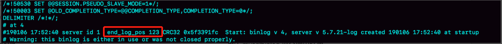

## 一主多从的架构

### 一主多从基本结构

*一主多从基本结构*


即：虚线箭头表示的是主备关系，A 和 `A'` 互为主备，从库 B，C，D 指向的是主库 A。一主多从的设置，一般用于读写分离，主库负责所有的写入和一部分读，其他的读请求则由从库分担

*一主多从基本结构--主备切换*


一主多从结构在切换完成后，`A'` 称为新的主库，从库 B，C，D 也更改连接到 `A'`，由于多了从库 B，C，D 重新指向的这个过程，主备切换的复杂性也相应增加了

### 主备切换过程

#### 基于位点的主备切换

把节点 B 设置成节点 `A'` 的从库的时候，需要执行一条 `change master` 命令

```mysql
CHANGE MASTER TO
MASTER_HOST=$host_name
MASTER_PORT=$port
MASTER_USER=$user_name
MASTER_PASSWORD=$password
MASTER_LOG_FILE=$master_log_name
MASTER_LOG_POS=$master_log_pos
```

这条命令的参数：`MASTER_HOST`，`MASTER_PORT`，`MASTER_USER`，`MASTER_PASSWORD` 四个参数，分别代表了主库 `A'` 的 IP、端口、用户名和密码， `MASTER_LOG_FILE` 和 `MASTER_LOG_POS` 表示，要从主库的 `master_log_name` 文件的 `master_log_pos` 这个位置的日志继续同步。这个位置即是同步位点，即是主库对应的文件名和日志偏移量。

原来节点 B 是 A 的从库，本地记录的是 A 的位点。但是相同的日志，A 的位点和 `A'` 的位点是不同的。因此从库 B 要切换的时候，就需要先经过 “找同步位点” 这个逻辑

但是这个位点很难精确取到，只能取一个大概位置。考虑到切换过程中不能丢数据，所以找位点的时候，总是要找一个“稍微往前”的，然后再通过判断跳过那些在从库 B 上已经执行过的事务

一种取同步位点的方法是这样的：

1.等待新主库 `A'` 把中转日志（`relay log`）全部完成；

2.在 `A'` 上执行 `show master status` 命令，得到当前 `A'` 上最新的 `File` 和 `Position`

3.取原主库的 A 故障的时刻 T

4.用 `mysqlbinlog` 工具解析 `A'` 的 `File`，得到 T 时刻的位点

```mysql
mysqlbinlog File --stop-datetime=T --start-datetime=T
```



`end_log_pos` 的值就是 `A'` 这个实例，在 T 时刻写入新的 `binlog` 的位置。把这个值作为 `$mater_log_pos` ，用在节点 B 的 `change master` 命令中。但是这个值并不精确

假设在 T 这个时刻，主库 A 已经执行完成了一个 `insert` 语句插入了一行数据 `R`，并且已经将 `binlog` 传给了 `A'` 和 B，然后在传完的瞬间主库 A 的主机就掉电了。此时系统的状态为

1.在从库 B 上，由于同步了 `binlog` ，R 这一行已经存在；

2.在新主库 `A'` 上，R 这一行也已经存在，日志是写在 123 这个位置之后

3.在从库 B 上执行 `change master` 命令，指向 `A'` 的 `File` 文件的 123 位置，就会把插入 R 这一行数据的 `binlog` 又同步到从库 B 去执行

此时，从库 B 的同步线程会报告 `Duplicate entry 'id_of_R' for key 'PRIMARY'` 错误，出现了主键冲突，然后停止同步

通常情况下，在切换任务的时候，要先主动跳过这些错误，有两种常用的方法

一种做法是，主动跳过一个事务，跳过命令的写法是

```mysql
set global sql_slave_skip_counter=1;
start slave;
```

因为在切换过程中，可能不会不止重复执行一个事务，所以需要在从库 B 刚开始连接到新主库 `A'` 时，持续观察，每次碰到这些错误就停下来，执行一次跳过命令，直到不再出现停下来的情况，以此来跳过可能涉及的所有事务

另一种方式是，通过设置 `slave_skip_errors` 参数，直接设置跳过指定的错误

在执行主备切换时，会经常遇到这两类错误

* 1062 错误是插入数据时唯一键冲突
* 1032 错误是删除数据时找不到行

因此可以把 `slave_skip_errors` 设置为 “1032,1062”，这样中间碰到这两个错误时就直接跳过。这种直接跳过指定错误的方法，针对的是主备切换时，由于找不到精确的同步位点，所以只能采用这种方法来创建从库和新主库的主备关系。这这种场景中，直接跳过 1032 和 1062 这两类错误是无损的，等到主备间的同步关系建立完成，并稳定执行一段时候之后，还需要把这个参数设置为空，以免之后出现此场景之外的主从数据不一致。

#### GTID

通过 `sql_slave_skip_counter` 跳过事务和通过 `slave_skip_errors` 忽略错误的方法，虽然都最终可以建立从库 B 和新主库 `A'` 的主备关系，但这两种操作都很复杂，而且容易出错。5.6 版本引入了 `GTID` 彻底解决了这个困难。

`GTID` 即 （`Global Transaction Identifier`）全局事务 ID，是一个事务在提交的时候生成的，是这个事务的唯一标识。由两部分组成，格式为：

```mysql
GTID=server_uuid:gno
```

* `server_uuid` 是一个实例第一次启动时自动生成的，是一个全局唯一的值
* `gno` 是一个整数，初始值是 1，每次提交事务的时候分配给这个事务，并加 1

在 `MySQL` 的官方文档里，`GTID` 格式定义是

```config
GTID=source_id:transaction_id
```

`source_id` 是 `server_uuid`；`transaction_id` 在 `MySQL` 指事务 id，事务 id 是在事务执行过程中分配的，如果这个事务回滚了，事务 id 也会递增，而 `gno` 是在事务提交的时候才会分配。从效果上看，`GTID` 往往是连续的。

`GTID` 模式的启动也很简单，只需要在启动一个 `MySQL` 实例的时候，加上参数 `gtid_mode=on` 和 `enforce_gtid_consistency=on` 就可以了。

在 `GTID` 模式下，每个事务都会跟一个 `GTID` 一一对应。这个 `GTID` 有两种生成方式，而使用哪种取决于 `session` 变量 `gtid_next` 的值

1.如果 `gtid_next=automatic`，代表使用默认值。此时，`MySQL` 就会把 `server_uuid:gno` 分配给这个事务。记录 `binlog` 的时候，先记录一行 `SET @@SESSION.GTID_NEXT='server_uuid:gno'`；把这个 `GTID` 加入本实例 `GTID` 集合

2.如果 `gtid_next` 是一个指定的 `GTID` 的值，如果通过 `set gtid_next='current_gtid'` 指定为 `current_gtid`，那么就有两种可能：如果 `current_gtid` 已经存在于实例的 `GTID` 集合中，接下来执行的这个事务会直接被系统忽略；如果 `current_gtid` 没有存在于实例的 `GTID` 集合中，就将这个 `current_gtid` 分配给接下来要执行的事务，也就是说系统不需要给这个事务生成新的 `GTID` ，因此 `gno` 也不用加 1

一个 `current_gtid` 只能给一个事务使用。这个事务提交后，如果要执行下一个事务，就要执行 `set` 命令，把 `gtid_next` 设置成另外一个 `gtid` 或者 `automatic`

这样，每个 `MySQL` 实例都维护了一个 `GTID` 集合，用来对应“这个实例执行过的所有事务”

事务的 `BEGIN` 之前有一条 `SET @@SESSION.GTID_NEXT` 命令。此时，如果实例 X 有从库，那么将 `CREATE TABLE` 的 `insert` 语句的 `binlog` 同步过去执行的话，执行事务之前就会先执行这两个 SET 命令，这样被加入从库 `GTID` 集合的

### 基于 GTID 的主备切换

在 `GTID` 模式下，备库 B 要设置为新主库 `A'` 的从库的语法如下

```mysql
CHANGE MASTER TO
MASTER_HOST=$host_name
MASTER_PORT=$port
MASTER_USER=$user_name
MASTER_PASSWORD=$password
master_auto_position=1
```

`master_auto_position = 1` 表示这个主备关系使用的是 `GTID` 协议。

此时，实例 `A'` 的 `GTID` 集合记为 `set_a`，实例 B 的 `GTID` 集合记为 `set_b`，此时在实例 B 上执行 `start slave` 命令，取 `binlog` 的逻辑是这样的

1.实例 B 指定主库 `A'`，基于主备协议建立连接

2.实例 B 把 `set_b` 发给主库 `A'`

3.实例 `A'` 算出 `set_a` 与 `set_b` 的差集，就是所有存在于 `set_a`，但不存在 `set_b` 的 `GITD` 的集合，判断 `A'` 本地是否包含了这个差集需要的所有 `binlog` 事务

a.如果不包含，表示 `A'` 已经把实例 B 需要的 `binlog` 给删掉了，直接返回错误

b.如果确认全部包含 `A'` 从自己的 `binlog` 文件里面，找出第一个不在  `set_b` 的事务，发给 B

4.之后就从这个事务开始，往后读文件，按顺序取 `binlog` 发给 B 去执行

设计思想是：在基于 `GTID` 的主备关系里，系统认为只要建立主备关系，就必须保证主库发给备库的日志是完整的。因此，如果实例 B 需要的日志已经不存在，`A'` 就拒绝把日志发给 B。这于基于位点的主备协议不同。基于位点的协议，是由备库决定的，备库指定那个位点，主库就发那个位点，不做日志的完整性判断

引入 `GTID` 后，一主多从的切换场景下，主备切换实现：

由于不需要找位点，所以从库 B、C、D 只需要分别执行 `change master` 命令指向实例 `A'` 即可。严格意义上，主备切换不是不找位点，而是找位点这个工作，在主库实例 `A'` 内部已经完成了。但这个工作是自动完成的。之后这个系统就由新主库 `A'` 写入，主库 `A'` 的自己生成的 `binlog` 中的 `GTID` 	集合格式是：`server_uuid_of_A':1-m` 如果之前从库 B 的 `GTID` 集合格式是 `server_uuid_of_A:1-n`，则切换之后 `GTID` 集合的格式就变成了 `server_uuid_of_A:1-N, server_uuid_of_A':1-m`。主库 `A'` 之前也是 A 的备库，因此主库 `A'` 和从库 B 的 `GTID` 集合是一样的。

### GTID 和在线 DDL

如果是由于索引缺失引起的性能问题，可以通过在线加索引来解决。但是，考虑到要避免新增索引对主库性能造成的影响，可以在备库加索引，然后再切换。在双 M 结构下，备库执行的 DDL 语句也会传给主库，为了避免传回后对主库造成影响，要通过 `set sql_log_bin=off` 关掉 `binlog`

假定，这两个互为主备关系的库是实例 X 和实例 Y，且当前主库是 X，并且都打开了 `GTID` 模式。此时主备切换流程为：

* 在实例 X 上执行 `stop slave`

* 在实例 Y 上执行 `DDL` 语句。这里并不需要关闭 `binlog`

* 执行完成后，查出这个 DDL 语句对应的 `GTID`，并记为 `server_uuid_of_Y:gno`

* 到实例 X 上执行以下语句

  ```mysql
  set GTID_NEXT="server_uuid_of_Y:gno";
  begin;
  commit;
  set gtid_next=automatic;
  start slave;
  ```

  这样既可以让实例 `Y` 的更新有 `binlog` 记录，同时也可以确保不会在实例 X 上执行这条更新

* 接下来，执行完主备切换。

如果业务允许主从不一致的情况，那么可以在主上先 `show global variables like 'grid_purged'`；然后在从库上执行 `set global grid_purged = '' `；指定从库从那个 `gtid` 开始同步，`binlog` 缺失那一部分，数据在从库上会丢失，就会造成主从不一致

需要主从一致的话，最好还是通过重新搭建从库来做

如果有其它的从库保留有全量的 `binlog` 的话，可以把从库指定为保留全量 `binlog` 的从库为主库（级联复制）

如果 `binlog` 有备份的情况，可以先在从库上应用缺失的 `binlog`，然后在 `start slave`

### 一主多从架构应用场景—读写分离

读写分离结构基本架构即是一主多从的架构。读写分离的主要目标就是分摊主库的压力。一种结构是客户度主动做负载均衡，这种模式下一般会把数据的连接信息放在客户端的连接层。由客户端来选择后端数据库进行查询；另一种架构是在 `MySQL` 和客户端之间引入一个中间代理层 `proxy`，客户端只连接 `proxy`，由 `proxy` 根据请求类型和上下文决定请求的分发路由

​	*带proxy的读写分离架构*


客户端直连接方案，因为少了一层 `proxy` 转发，所以查询性能稍微好一些，并且整体架构简单，排查问题更方便。但是这种方案，由于要了解后端部署细节，所以在出现主备切换，库迁移等操作的时候，客户端都会感知到，并且需要调整数据库连接信息。一般采用这种结构，都会伴随一个负责管理后端的组件，如 `Zookeeper` 来尽量让业务端只专注于业务逻辑开发

带 `proxy` 的架构，对客户端比较友好。客户端不需要关注后端细节，连接维护、后端信息维护等工作，都是由 `proxy` 完成的。但这样的话，对后端维护团队的要求会更高。`proxy` 架构整体相对复杂

### 解决从库读到过期状态

#### 强制走主库

将查询请求做分类。通常情况下将查询请求分为这两类

1.对于必须要拿到最新结果的请求，强制将其发到主库上。

2.对于可以读到旧数据的请求，才将其发送到从库上。

这个方案的最大的问题在于，有时候会碰到所有查询都不能是过期读的需求，这样的话，就只能放弃读写分离，所有读写压力都在主库，等同于放弃了扩展性

#### sleep 方案

主库更新后，读从库先 `sleep` 一下。类似于执行一条 `select sleep(1)` 命令。

但这个方案存在不精确。这个不精确包含了两层意思

1.如果这个查询请求本来 0.5 秒就可以在从库上拿到正确结果，也会等 1 秒

2.如果延迟超过 1 秒，还是会出现读到过期状态

#### 判断主备无延迟方案

每次从库执行查询请求前，先判断 `seconds_behind_master` 是否已经等于 0。如果还不等于 0，那就必须等待这个参数变为 0 才能进行查询请求。`seconds_behind_master` 单位是秒，如果精度不够的话，还可以采用对比位点和 `GTID` 的方法来确保主备无延迟。

对比位点确保主备无延迟：

​	*show slave status 中位点相关*

​	

* `Master_Log_File` 和 `Read_Master_Log_Pos` ，表示的是读到的主库的最新位点
* `Relay_Master_Log_File` 和 `Exec_Master_Log_Pos`，表示的是备库执行的最新位点

如果 `Mater_Log_File` 和 `Relay_Master_Log_File`，`Read_Master_Log_Pos` 和 `Exec_Master_Log_Pos` 这两组值完全相同，就表示接收到的日志已经同步完成

对比 `GTID` 集合确保主备无延迟：

* `Auto_Position=1`，表示这对主备关系使用了 `GTID` 协议
* `Retrieved_Gtid_Set`，是备库收到的所有日志的 `GTID` 集合
* `Executed_Gtid_Set`，是备库所有已经执行完成的 `GTID` 集合

如果这两个集合相同，表示备库接收到的日志都已经同步完成

#### 配合 semi-sync

一个事务的 `binlog` 在主备库之间的状态：

1.主库执行完成，写入 `binlog`，并反馈给客户度

2.`binlog` 被从库发送给备库，备库收到

3.在备库执行 `binlog` 完成

上面判断主备库无延迟方案的逻辑是 “备库收到的日志都执行完成了”。但是，从 `binlog` 在备库之间状态的分析中，还有一部分日志，处于客户端已经收到提交确认，而备库还没有收到日志的状态

 *备库还没有收到trx3*


此时，主库上执行完成了三个事务 `trx1`，`trx2`，`trx3`，其中

1.`trx1` 和 `trx2` 已经传到从库，并且已经执行完成了

2.`trx3` 在主库执行完成，并且已经回复给客户端，但是还未传到备库

如果此时在从库B上执行查询请求，如果采用判断主备无延迟的话，会认为主备无延迟，但从库还是查不到 `trx3`。即还是出现了读到过期状态情况

