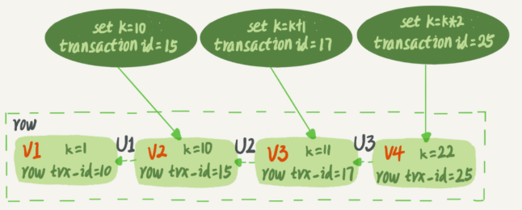
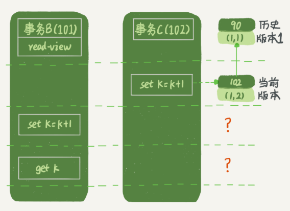
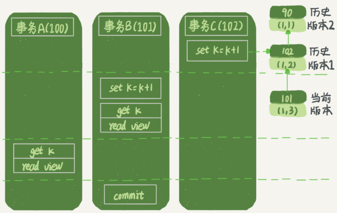

## MySql事务及事务隔离级别

**事务就是要保证一组数据库操作，要么全部成功，要么全部失败，在 `Mysql` 中，事务支持是在引擎层实现的。`MyISAM` 引擎不支持事务**

### 事务隔离性与隔离级别

当数据库上有多个事务同时执行的时候，就可能出现脏读，不可重复读，幻读的问题，为了解决这些问题，就有了 隔离级别的概念。隔离的级别越高，效率就越低。SQL标准的事务隔离级别包括：读未提交（read uncommitted），读提交（read committed），可重复读（repeatable read），串行化（serializable）。并行性能依次降低，安全性依次提高

* **读未提交是指：** 一个事务还没提交时，它做的变更就能被别的事务看到（容易产生脏读）
* **读提交是指：** 一个事务提交之后，它做的变更才会被其他事务看到
* **可重复读是指：** 一个事务执行过程中看到的数据，总是跟这个事务在启动时看到的数据时一致的，在可重复读隔离级别下，未提交的变更对其他事务也是不可见的
* **串行化：** 对于同一行记录，写会加写锁，读会加读锁，当出现读写锁冲突的时候，后访问的事务必须等前一个事务执行完成，才能继续执行

### Mysql事务隔离实现

在实现上，数据库里面会创建一个试图，访问的时候，以视图的逻辑结果为准。在**可重复读**隔离级别下，这个视图是在事务启动时创建的，整个事务存在期间都用这个视图。在**读提交**隔离级别下，这个视图是在每个 SQL 语句开始执行的时候创建的。**读未提交**隔离级别下直接返回记录上的最新值，没有视图概念。**串行化**隔离级别下直接用加锁的方式来避免并行访问。

**查询当前隔离级别 `show variables like 'transaction_isolation`**

不同的隔离级别下，数据库行为是有所不同的。`Oracle` 数据库的默认隔离级别其实就是 “读提交”，配置方式是将启动参数 `transcation-isolation` 的值设置成 `READ-COMMITTED` 。或 `set session transaction isolation level repeatable read`

在 MySQL 中，每条记录在更新的时候都会同时记录一条回滚操作。记录上的最新值，通过回滚操作，都可以得到前一个状态值。

假设一个值从 1 被按顺序改成了 2、3、4，在回滚日志里就会有类似如下的记录


当前值是 4，但是在查询这条记录的时候，不同时刻启动的事务会有不同的 `read-view` 。上图中，视图 A、B、C 里面，这一个记录的值分别是 1、2、4，**同一条记录在系统中可以存在多个版本，就是数据库的多版本并发控制（MVCC）。** 对于 `read-view A`，要得到 1，必须将当前值依次执行图中所有的回滚操作得到。即使现在有另外一个事务正在将 4 改成 5，这个事务跟 `read-view A、B、C` 对应的事务是不会冲突的。系统会判断，当没有事务再需要用到这些回滚日志时，回滚日志会被删除（即当系统里没有比这个回滚日志更早的 `read-view` 的时候）

长事务意味着系统里面会存在很老的事务视图。由于这些事务随时可能访问数据库里面的任何数据，所以这个事务提交之前，数据库里面它可能用到的回滚记录都必须保留，这就会导致大量占用存储空间。

回滚日志是跟数据字典一起放在 `ibdata` 文件里，即使长事务最终提交，回滚段被清理，文件也不会变小。

除了对回滚段的影响，长事务还占用锁资源，也可能拖垮整个库。

### 事务的启动方式

* 显示启动事务语句，`begin` 或 `start transaction` 提交语句 `commit` 回滚语句时 `rollback`

* `set autocommit=0` 这个命令会将这个线程的自动提交关掉。如果只执行一个 `select` 语句，这个事务就启动了，而且不会自动提交。这个事务持续存在直到你主动执行 `commit` 或 `rollback` 语句，或者断开连接。有些客户端连接框架会默认连接成功后先执行 `set autocommit=0` 的命令。这就导致接下来的查询都在事务中，如果是长连接，这就导致了意外的长事务。

* 在 `autocommit` 为 1 的情况下，用 `begin` 显示启动的事务，如果执行 `commit` 则提交事务。如果执行 `commit work and chain` ，则提交事务并自动启动下一个事务，省去了再次执行 `begin`  语句的开销。同时带来的好处是程序开发的角度明确地知道每个语句是否处于事务中。

* 在 `information_schema` 库的 `innodb_trx` 这个表中查询长事务。

  ```mysql
  select * from information_schema.innodb_trx where TIME_TO_SEC(timediff(now(),trx_started)) > 60; // 查询持续时间超过 60s 的事务
  ```

### 事务应用

在开发过程中，尽可能的减少事务范围，少用长事务（从事务开始到提交，期间时间很长），如果无法避免，保证逻辑日志空间足够用，并且支持动态日志空间增长。监控 `Innodb_trx` 表，发现长事务报警

### 避免长事务对业务的影响

#### 从应用开发端

* 确认是否使用了 `set autocommit=0` (把 `MySQL` 的 `general_log` 开起来，然后跑一个业务逻辑，通过 `general_log` 的日志来确认。一般框架会设置这个值，将它设置成 1)
* 确认是否有不必要的只读事务。

* 业务连接数据库的时候，根据业务本身的预估，通过 `SET MAX_EXECUTION_TIME` 命令，来控制每个语句执行的最长时间，避免单个语句意外执行太长时间。

#### 从数据库端

* 监控 `information_schema.Innodb_trx` 表，设置长事务阈值，超过就报警或者 `kill`
* `Percona` 的 `pt-kill` 工具
* 在业务功能测试阶段输出所有的 `general_log` ，分析日志行为
* 如果使用的是 5.6 及更高版本，把 `innodb_undo_tablespaces` 设置成 2（或更大值），如果真的出现大事务导致回滚段过大，这样设置后清理起来更方便

### 事务隔离实例

* 流程图

  

* 不同的隔离级别下，事务 A 的不同返回结果
  1. **读未提交：** 则 `v1` 的值是 2。这时候事务 B 虽然没提交，但结果已经被 A 看到了。因此 `v2`, `v3` 都是 2
  2. **读已提交:**  `v1` 是 1， `v2` 是 2，事务 B 的更新在提交后才能被 A 看到，所以 `v3` 值是 2
  3. **可重复读：** `v1`, `v2` 是 1， `v3` 是 2 `v2` 是 1 是遵循事务在执行期间看到的数据前后必须一致
  4. **串行化:**  事务 B 执行将 1 改成 2 的时候，会被锁住。直到事务 A 提交后，事务 B 才可以继续执行。从 A 的角度看，`v1`, `v2` 值是 1， `v3` 值是 2

### “快照”在 MVCC 里是怎么工作的

如果是可重复读隔离级别，事务 T 启动的时候会创建一个视图 `read-view`，之后事务 T 执行期间，即使有其他事务修改了数据，事务 T 看到的仍然跟在启动时看到的一样。但是，一个事务要更新一行，如果刚好有另外一个事务拥有这一行的行锁，它就会被锁住，进入等待状态。进入等待状态，等到这个事务自己获取到行锁要更新数据的时候，它读到的值是？

事务的启动时机。`begin/start transaction` 命令并不是一个事务的起点，在执行到它们之后的第一个操作 `InnoDB` 表的语句，事务才真正启动。如果想马上启动一个事务，可以使用 `start transaction with consistent snapshot` 这个命令。

**在 MySQL 里，有两个“视图”的概念：**

* 一个是 `view` 。它是用查询语句定义的虚拟表，在调用的时候执行查询语句并生成结果。创建视图的语法是 `create view ...`，视图的查询方法与表一样
* 另一个是 `InnoDB` 在实现 `MVCC` 时用到的一致性读视图，即 `consistent read view`，用于支持 `RC(Read Committed)` 读提交和 `RR(Repeatable Read)`可重复读隔离级别的实现。

在可重复读隔离级别下，事务在启动的时候就“拍了个快照”。这个快照是基于整库的。`InnoDB` 里面每个事务有一个唯一的事务 ID，即 `transaction id`。它是在事务开始的时候向 `InnoDB` 的事务系统申请的，是按申请顺序严格递增的。

而每行数据也都是有多个版本的。每次事务更新数据的时候，都会生成一个新的数据版本，并且把 `transaction id` 赋值给这个数据版本的事务 ID，为 `row trx_id`。同时，旧的数据版本要保留，并且在新的数据版本中，能够有信息可以直接拿到它。也就是说，数据表中的一行记录，其实可能有多个版本（row），每个版本有自己的 `row trx_id`。

​		  *行状态变更图*



上图中虚线框里是用一行数据的 4 个版本，当前最新版本是 `v4`，`k` 的值是 22，它是被 `transaction id`  为 25 的事务更新的，因此它的 `row trx_id` 是 25。语句更新会生成 `undo log` (回滚日志），上图中的三个虚线箭头，就是 `undo log`；而 `v1`、`v2`、`v3` 并不是物理上真实存在的，而是每次需要的时候根据当前版本和 `undo log` 计算出来的。如需要 `v2` 的时候，就是通过 `v4` 依次执行 `U3`、`U2` 算出来。

按照可重复读的定义，一个事务启动的时候，能够看到所有已经提交的事务结果。但是之后，这个事务执行期间，其他事务的更新对它不可见。

因此，一个事务只需要在启动的时候声明说，“以我启动的时刻为准，如果一个数据版本是在我启动之前生成的，就认；如果是我启动以后才生成的，就不认，必须找到它的上一个版本，如果上一个版本也不可见，就继续往前找。如果是这个事务自己更新的数据，它自己还是要认的”。

在实现上，`InnoDB` 为每个事务构造了一个数组，用来保存这个事务启动瞬间，当前正在“活跃”的所有事务 ID。“活跃”  即是：启动了但还没提交的事务。数组里面事务 ID 的最小值记为低水位，当前系统里面已经创建过的事务 ID 的最大值加 1 记为高水位。这个视图数组和高水位，就组成了当前事务的一致性视图（`read-view`）。

而数据版本的可见性规则，就是基于数据的 `row trx_id` 和这个一致性视图的对比结构得到的。这个视图数组把所有的 `row trx_id` 分成了几种不同的情况。


对于当前事务的启动瞬间来说，一个数据版本的 `row trx_id`，有以下几种可能：

1. 如果落在绿色部分，表示这个版本是已提交的事务或者是当前事务自己生成的，这个数据是可见的；

2. 如果落在红色部分，表示这个版本是由将来启动的事务生成的，是肯定不可见的；

3. 如果落在黄色部分，那就包括两种情况

   a.若 `row trx_id` 在数组中，表示这个版本是由还没提交的事务生成的，不可见；

   b.若 `row trx_id` 不在数组中，表示这个版本是已经提交了的事务生成的，可见。

**`InnoDB` 利用了所有数据都有多个版本的这个特性，实现了秒级创建快照的能力 **

一个数据版本，对于一个事务视图来说，除了自己的更新总是可见以外，有三种情况：

1. 版本未提交，不可见；
2. 版本已提交，但是是在视图创建后提交的，不可见
3. 版本已提交，而且是在视图创建前提交的，可见

### 事务更新逻辑



事务 B 的视图数组是先生成的，之后事务 C 才提交，不是应该看不见（1，2），但结果是 （1，3）。

如果事务 B 在更新之前查询一次数据，这个查询返回的 K 的值确实是 1。但是，当它要去更新数据的时候，就不能再在历史版本上更新了，否则事务 C 的更新就丢失了。因此，事务 B 此时的 `set k=k+1` 是在（1，2）的基础上进行的操作。即：**更新数据都是先读后写的，而这个读，只能读当前的值，称为“当前读”。**

因此，在更新的时候，当前读拿到的数据是（1，2），更新后生成了新版本的数据（1，3），这个新版本的 `row trx_id` 是 101。所以，在执行事务 B 查询语句的时候，一看自己的版本号是 101，最新数据版本号也是 101，是自己的更新，可以直接使用，所以查询得到的 k 的值是 3。

**当前读：**除了 `update` 语句外，`select` 语句如果加锁，也是当前读。如果把事务 B 的查询语句 `select * from t where id = 1` 改成 `select k from t where id=1 lock in share mode`（共享锁） 或 `select k from t where id=1 for update`（排它锁） ，也都可以读到版本号是 101 的数据，返回的 k 的值是 3。

### 事务的可重复读能力

可重复读的核心就是一致性读（`consistent read`）；而事务更新数据的时候，只能用当前读。如果当前的记录的行锁被其他事务占用的话，就需要进入锁等待。

而读提交的逻辑和可重复读的逻辑类似，区别是：

* 在可重复读隔离级别下，只需要在事务开始的时候创建一致性视图，之后事务里的其他查询都共用这个一致性视图；
* 在读提交隔离级别下，每一个语句执行前都会重新算出一个新的视图

`start transaction with consistent snapshot` 的意思是从这个语句开始，创建一个持续整个事务的一致性快照。所以，在读提交隔离级别下，这个用法就没意义了，等效于普通的 `start transaction`

*读提交隔离级别下的事务状态图*



在读提交的隔离级别下，事务 A 的查询语句的视图数组是在执行这个语句时创建的，时序（1，2）、（1，3）的生成时间都在创建这个视图数组的时刻之前。但是，在这个时刻：

* （1，3）还没提交，属于情况 1，不可见；
* （1，2）提交了，属于情况下 3，可见

即，事务 A 查询语句返回的是 k = 2，事务 B 查询结果是 k = 3

`InnoDB` 的行数据有多个版本，每个数据版本有自己的 `row trx_id`，每个事务或者语句有自己的一致性视图。普通查询语句是一致性读，一致性读会根据 `row trx_id` 和一致性视图确定数据版本的可见性。

- 对于可重复读，查询只承认在事务启动前就已经提交完成的数据
- 对于读提交，查询只承认在语句启动前就已经提交完成的数据

而当前读，总是读取已经提交完成的最新版本。

