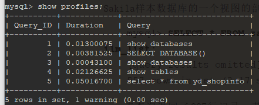
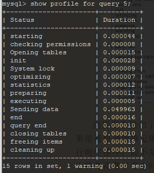
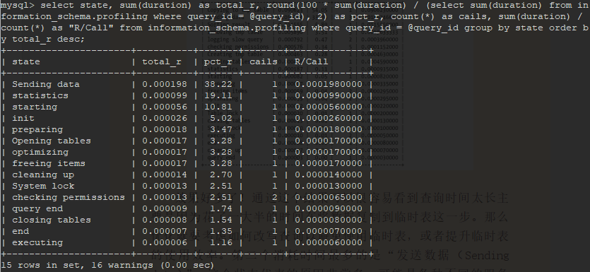

## 性能剖析相关

### 剖析单条查询

在定位到需要优化的单条查询后，可以针对此查询获取更多的信息，确认为什么会花费这么长的时间执行，以及需要如何去优化。在实际应用中，可以使用 `show status`，`show profile`，检查慢查询日志的条目（必须是 `Percona Sever` ，官方版本的慢查询日志缺少了很多附加信息）。

#### 使用 show profile

`show profile` 命令是在 `MySQL 5.1` 以后的版本中引入的。默认是禁用的，可以通过服务器变量在会话级别动态地修改

```mysql
mysql> set profiling = 1;
```

然后在服务器上执行的所有语句，都会测量其耗费的时间和其他一些查询执行状态变更相关的数据。这个功能在未来版本中可能会被 `Performance Schema` 所取代。当一条查询提交给服务器时，此工具会记录剖析信息到一张临时表，并且给查询赋予一个从 1 开始的整肃标识符，执行完成后

* 查看 `profiles` 记录。

  ```mysql
  mysql> show profiles;
  ```

  *show profiles 结果*



* 查看单个 `profile` 记录

  ```mysql
  mysql> show profile for query 5;
  ```

  *show_profile查看单条分析语句.png*

  

  剖析报告给出了查询执行的每个步骤及其花费的时间，看结果很难快速地确定那个步骤花费的时间最多。因为输出时按照执行顺序排序，而不是按花费的时间排序的--如果不使用 `show profile` 命令而是直接查询 `INFORMATION_SCHEMA` 中对应的表，则可以按照需要格式化输出：

  ```mysql
  mysql> set @query_id = 1;
  mysql> select state, sum(duration) as total_r, round(100 * sum(duration) / (select sum(duration) from information_schema.profiling where query_id = @query_id), 2) as pct_r, count(*) as cails, sum(duration) / count(*) as "R/Call" from information_schema.profiling where query_id = @query_id group by state order by total_r desc;
  ```

  *information_schema分析profiling.png*

  

  `Sending data` 这个状态代表的原样非常多，可能是各种不同的服务器活动，包括在关联时搜索匹配的行记录等，这部分很难说优化节省多少消耗时间。

剖析报告能帮助我们定位到那些活动花费了最多的时间，但并不会告诉为什么会这样。要弄清楚为什么还必须深入下去。

#### show status

`MySQL` 的 `SHOW STATUS` 命令返回了一些计数器。既有服务器级别的全局计数器，也有基于某个连接的会话级别的计算器。如果执行 `SHOW GLOBAL STATUS` 则可以查看服务器级别的从服务器启动时开始计算的查询次数统计。不同计数器的可见范围不一样，不过全局的计算器也会出现在 `SHOW STATUS` 的结果中，容易被误认为是会话级别的。

`SHOW STATUS` 是一个有用的工具，但并不是一款剖析工具。`SHOW STATUS` 的大部分结果都只是一个计数器，可以显示某些活动如读索引的频繁程度，但无法给出消耗了多少时间。`SHOW STATUS` 的结果中只有一条指的是操作的时间 `Innodb_row_lock_time`，而且只能是全局级的，所以还是无法测量会话级别的工作

尽管 `SHOW STATUS` 无法提供基于时间的统计，但对于在执行完查询后观察某些计数器的值还是有帮助的。有时候可以猜测那些操作代价比较高或者消耗的时间比较多。最有用的计数器包括句柄计数器、临时文件和表计算器。

重置会话级别计数器，然后查询

```mysql
mysql> flush status;
mysql> select * from yd_shopinfo where status = 1;
mysql> show status where variable_name like 'Handler%' or variable_name like 'Created%';
```

*show_status分析查询执行.png*


通过 `explain` 查看查询的执行计划也可以获取大部分相同的信息，但 `EXPLAIN` 是通过估计得到的结果，而通过计数器则是实际的测量结果。

### 单条查询问题还是服务器问题

首先要确认是单条查询的问题，还是服务器的问题。如果服务器上所有的程序都突然变慢，又突然变好，每一条查询也都变慢了，那么慢查询可能就不一定是原因，而是由于其他问题导致的结果。反过来说，如果服务器整体运行没有问题，只有某条查询偶尔变慢，就需要将注意力放到这条特定的查询上面

如何判断是单条查询问题还是服务器问题，如果问题不停周期性出现，那么可以在某次活动中观察到：或者整夜运行脚本收集数据，第二天来分析结果。大多数情况下都可以通过三种技术来确定

#### 使用 show global status

这个方法实际上就是以较高的频率如一秒一次执行 `SHOW GLOBAL STATUS` 命令捕获数据，问题出现时，则可以通过某些计数器（如：`Threads_running`，`Threads_connected`，`Questions` 和 `Queries` ）的尖刺或凹陷来发现。这个方法很简单，对服务器的影响也很小。

#### 使用 show processlist

这个方法是通过不同地捕获 `show processlist` 的输出，来观察是否有大量线程处于不正常的状态或者其他不正常的特征。例如查询很少会长时间处于 `statistics` 状态，这个状态一般是指服务器在查询优化截断如果确定表关联的顺序--通常是非常快的。

查看 state 列状态，如果要查看不同的列，只需要修改 `grep` 的模式即可。

```shell
mysql -e 'show processlist\G' | grep State: | sort | uniq -c | sort -rn
```

如果 MySQL 服务器版本较新，可以直接查询 `INFORMATION_SCHEMA` 中的 `PROCESSLIST` 表

#### 使用查询日志

如果要通过查询日志发现问题，需要开启慢查询日志并在全局级别设置 `long_query_time` 为 0，并且要确认所有的连接都采用了新的设置。如果不能设置慢查询日志记录所有的查询，也可以通过 `tcpdump` 和 `pt_query_digest` 工具来模拟替代。要注意找到吞吐量突然下降时间段的日志。查询是在完成阶段才写入到慢查询日志的，所以堆积会造成大量查询处于完成阶段，直到阻塞其他查询的资源占用者释放资源后，其他的查询才能执行完成。这种行为特征的一个好处是，当遇到吞吐量突然下降时，可以归咎于吞吐量下降后完成的第一个查询（有时候也不一定是第一个查询。当某些查询被阻塞时，其他查询可以不受影响继续运行，所以不能完成依赖这个经验）

