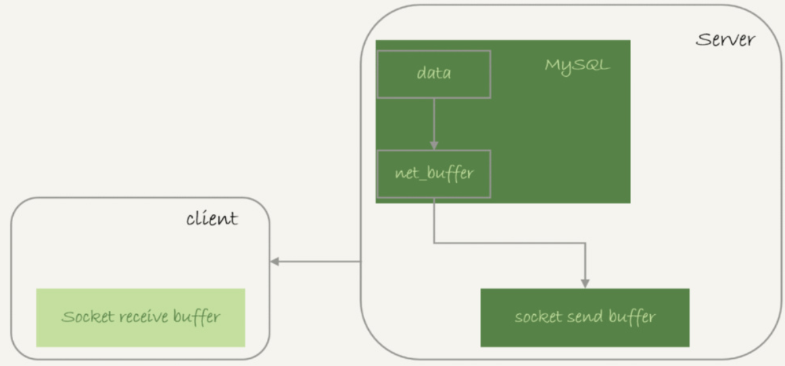
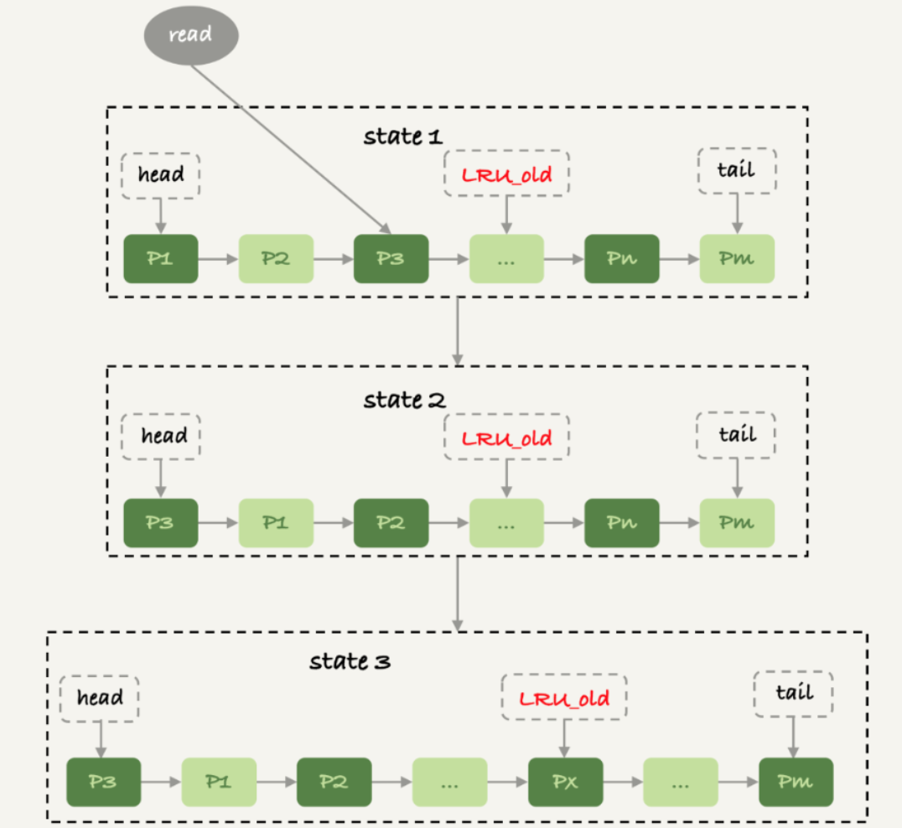

## MySQL 服务端相关

### 查询数据与数据库内存

#### 全表扫描对 server 层的影响

假设，需要对一个 200 G 的 InnoDB 表 db1.t，执行一个全表扫描。把扫描结果保存在客户端，会使用如下类似命令

```shell
mysql -h$host -P$port -u$user -$pwd -e "select * from db1.t" > $target_file
```

这条查询语句由于没有其他判断条件，所以查到的每一行都可以直接放到结果集里面，然后返回给客户端

实际上，服务端并不需要保存一个完整的结果集。取数据和发数据的流程是：

1.获取一行，写到 `net_buffer` 中。这块内存的大小是由参数 `net_buffer_length` 定义的，默认是 16k

2.重复获取行，直到 `net_buffer` 写满，调用网络接口发出去

3.如果发送成功，就清空 `net_buffer` ，然后继续取下一行，并写入 `net_buffer`

4.如果发送函数返回 `EAGAIN` 或 `WSAEWOULDBLOCK`，就表示本地网络栈（`socket send buffer`）写满了，进入等待。直到网络栈重新可写，再继续发送

*查询结果发送流程*



一个查询在发送过程中，占用的 `MySQL` 内部的内存最大就是 `net_buffer_length` 这个大。`socket send buffer` 默认定义在 `/proc/sys/net/core/wmem_default`，如果 `socket send buffer` 被写满，就会暂停读数据的流程。即是，MySQL 是边读边发的，即，如果客户端接收得慢，会导致 `MySQL` 服务端由于结果发不出去，这个事务的执行时间变长。

如果 `show processlist` 的 `State` 的值一直处于 `Sending to client` ，就表示服务器端的网络栈写满了。

一个查询语句的状态变化是：

* MySql 查询语句进入执行阶段后，首先把状态设置成 `Sending data`
* 然后，发送执行结果的列相关的信息给客户端
* 再继续执行语句的流程
* 执行完成后，把状态设置成空字符串

对于一个 MySQL 连接，或者一个线程，任何时刻都有一个状态，该状态表示了 MySQL 当前正在做什么，`SHOW FULL PROCESSLIST` 命令返回结果的 `Command` 列就表示当前的状态。在一个查询的生命周期中，状态会变化很多次：`Sleep` 线程正在等待客户端发送新的请求，`Query` 线程正在执行查询或者正在将结果发送给客户端，`Locked` 在 MySQL 服务器层，该线程正在等待表锁。在存储引擎级别的锁，如 `InnoDB` 的行锁，并不会体现在线程状态中。对于 `MyISAM` 来说这是一个比较典型的状态，但在其他没有行锁的引擎中也经常会出现。`Analyzing and statistics`  线程正在收集存储引擎的统计信息，并生成查询的执行计划。`Copying to tmp table [on disk]` 线程正在执行查询，并且将其结果集都复制到一个临时表中，这种状态一般要么是在 `GROUP BY` 操作，要么是文件排序操作，或者是 `UNION` 操作。如果这个状态后面有 `on disk` 标记，那表示 MySQL 正在将一个内存临时表放到磁盘上 `Sorting result` 线程正在对结果集进行排序，33`Sending data` 表示多种情况：线程可能在多个状态之间传送数据，或者在生成结果集，或者在向客户端发送数据

对于正常的线上业务来说，如果一个查询的返回结果不会很多的话，都建议使用 `mysql_store_result` 这个接口，直接把查询结果保存到本地内存。

#### 全表扫描对 `InnoDB` 的影响

`InnoDB` 内存的一个作用是保存更新的结果，再配合 `redo log`，避免了随机写盘。内存的数据页是在 `Buffer Pool` 中管理的，在`WAL` 里 `Buffer Pool` 起到了加速更新的作用。而实际上，`Buffer Pool` 还有一个更重要的作用，就是加速查询（如果查询的数据页在内存中，直接从内存返回，不会读磁盘）

而 `Buffer Pool` 对查询的加速效果，依赖于一个重要的指标，内存命中率。可以在 `show engine innodb status` 结果中，查看一个系统当前的 `BP` 命中率（`Buffer pool hit rate`）一般情况下，一个稳定服务的线上系统，要保证响应时间符号要求的话，内存命中率要在 99% 以上。

如果所有查询需要的数据页都能直接从内存得到，对应的命中率就是 100 %。但几乎很难做到。`InnoDB Buffer Pool` 的大小是由参数 `innodb_buffer_pool_size` 确定的，一般建议设置成可用物理内存的 60 ~ 80。`innodb_buffer_pool_size` 小于磁盘的数据量是很常见的。如果一个 `Buffer Pool` 满了，而又要从磁盘读入一个数据页，那肯定要淘汰一个旧数据页。

`InnoDB` 内存淘汰策略是最近最少使用（LRU），管理 `Buffer Pool` 的 LRU 算法，是用链表来实现的。`InnoDB` 对 LRU 算法做了改进。实现上，按照 5:3 的比例把整个 LRU 链表分成了 `young` 区域和 `old` 区域。改进后的 LRU 算法执行流程：

*改进的LRU算法*执行图



1）状态 1，要访问数据页 P3，由于 P3 在 `young` 区域，因此和优化前的 `LRU` 算法一样，将其移到链表头部，变成状态 2

2）之后要访问一个新的不存在于当前链表的数据页，这时候依然是淘汰掉数据页 Pm，但是新插入的数据页 Px，是放在 LRU_old 处

3）处于 old 区域的数据页，每次被访问的时候都要做下面这个判断：

* 若这个数据页在 LRU 链表中存在的时间超过了 1 秒，就把它移动到链表头部；
* 如果这个数据页在 LRU 链表中存在的时间短于 1 秒，位置保持不变。1 秒这个时间，是由参数 `innodb_old_blocks_time` 控制的。默认值是 1000，单位毫秒。


