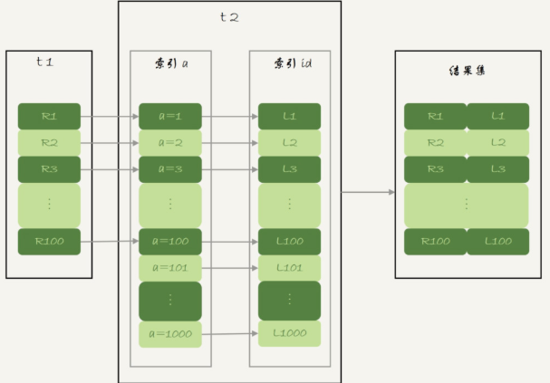
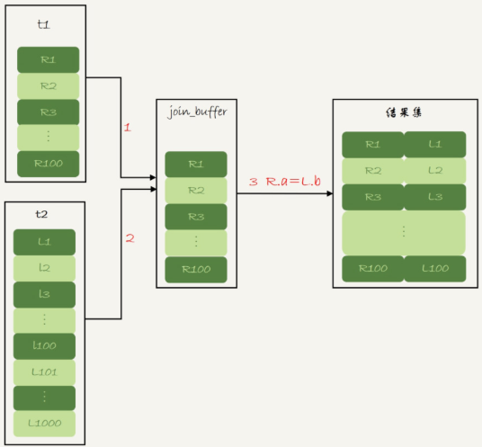
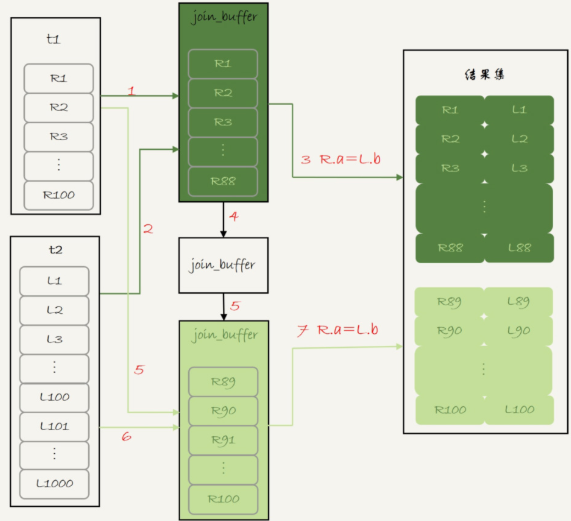
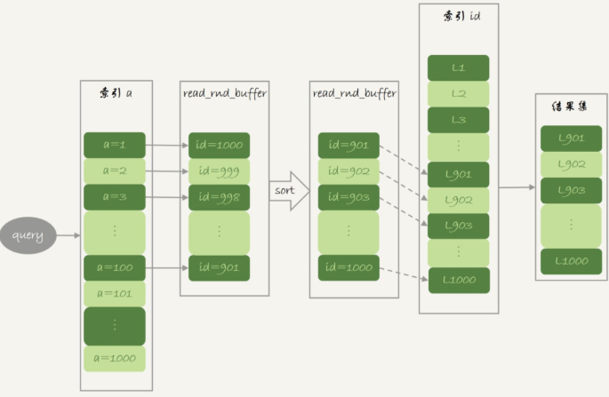
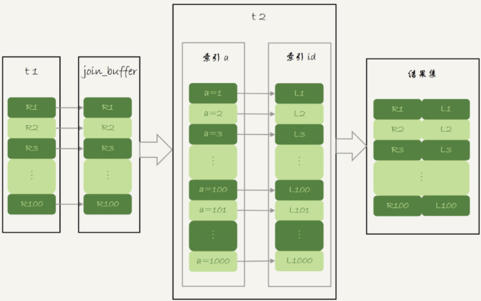

## MySQL 查询 join 相关

### join 相关

在实际生产中，关于 join 语句使用的问题，一般会集中在以下两类

1.使用 join 有什么问题？

2.如果有两个大小不同的表做 join，应该用那个表做驱动表？

```mysql
select * from t1 inner join t2 on (t1.a=t2.a);
```

如果直接使用 `join` 语句，MySQL 优化器可能会选择表 `t1` 或 `t2` 作为驱动表。

#### 能使用被驱动表索引

使用 `straight_join` 让 `MySQL` 使用固定的连接方式执行查询，这样优化器只会按照我们指定的方式去 `join`。

```mysql
// 指定 t1 是驱动表，t2 是被驱动表
select * from t1 straight_join t2 on (t1.a=t2.a)
```

*使用索引字段join的explain结果*


这个语句里，被驱动表 t2 的字段 a 上有索引，`join` 过程用上了这个索引，因此这个语句的执行流程是这样的：

1.从表 t1 中读入一行数据 R；

2.从数据行 R 中，取出 a 字段到表 t2 里去查找

3.取出表 t2 中满足条件的行，跟 R 组成一行，作为结果集的一部分

4.重复执行步骤 1 到 3，直到表 t1 的末尾循环结束

这个过程是先遍历表 t1，然后根据从表 t1 中取出的每行数据中的 a 值，去表 t2 中查找满足条件的记录。在形式上，这个过程与写程序时的嵌套查询类似，并且可以用上被驱动表的索引，称为 `Index Nested-Loop Join` ，简称 NLJ。

对应的流程图是：

​			*Index Nested-Loop Join 算法的执行流程*



在这个流程里：

1.对驱动表 t1 做了全表扫描，这个需要扫描 100 行；

2.而对于每一行 R，根据 a 字段去表 t2 查找，走的是树搜索过程。由于构造的数据都是一一对应，因此每次的搜索过程都是只扫描一行，也是总共扫描 100 行；

3.所以，整个执行流程，总扫描行数是 200

假设不使用 join，那只能用单表查询。

1.执行 `select * from t1`，查出表 `t1` 的所有数据，这里有 100 行；

2.循环遍历这 100 行数据：

​    	从每一行 R 取出字段 a 的值 $R.a;

​	执行 `select * from t2 where a = $R.a`

​	把返回的结果和 R 构成结果集的一行

在，这个查询过程，也是扫描了 200 行，但是总共执行了 101 条语句，比直接 `join` 多了 100 次交互。除此之外，客户端还要自己拼接 SQL 语句和结果。

因此用不用索引还要看具体情况

在这个 join 语句执行过程中，驱动表是走全表扫描，而被驱动表是走树搜索

假设被驱动表的行数是 M。每次在被驱动表查一行数据，要先搜索索引 a，再搜索主键索引。每次搜索一棵树近似复杂度是以 2 为底的 M 的对数，记为 `log2M`，所以在被驱动表上查一行的时间复杂度是 `2 * log2M`

假设驱动表的行数是 N，执行过程就要扫描驱动表 N 行，然后对于每一行，到被驱动表上匹配一次。因此整个执行过程，近似复杂度是 `N + N * 2 * log2M`。即，N 对扫描行数的影响更大（N 扩大 1000 倍的话，扫描行数就会扩大 1000 倍；而  M 扩大 1000 倍，扫描行数扩大不到 10 倍），因此应该让**小表来做驱动表**

**在可以使用被驱动表的索引情况下：使用 join 语句，性能比强行拆成多个单表执行 SQL 语句的性能要好；如果使用 join 语句的话，需要让小表做驱动表**

#### 被驱动表用不上索引的情况

```mysql
select * from t1 straight_join t2 on (t1.a=t2.b)
```

由于表 t2 的字段 b 上没有索引，因此每次到 t2 去匹配的时候，就要做一次全表扫描。

Block Nested-Loop Join 算法

这时候，被驱动表上没有可用的索引，算法的流程是这样的：

1.把表 t1 的数据读入线程内存 `join_buffer` 中，由于是 `select *`，因此是把整个表 t1 放入了内存

2.扫描表 t2，把表 t2 中的每一行取出来，跟 `join_buffer` 中的数据做对比，满足 `join` 条件的，作为结果集的一部分返回

​				*Block Nested-Loop Join 算法的执行流程*




在这个过程中，对表 t1 和 t2 都做了一次全表扫描，因此总的扫描行数是 1100。由于 `join_buffer` 是以无序数组的方式组织的，因此对表 t2 中的每一行，都要做 100 次判断，总共需要在内存中做的判断次数是 `100 * 1000 = 100000`。如果使用 `Simple Nested-Loop Join` 算法进行查询，扫描行数也是 10 万行。从时间复杂度上来说，这两个算法是一样的。但是，`Block Nested-Loop Join` 算法的这 10 万次判断是内存操作，速度上会快很多，性能也更好。

假设小表的行数是 N，大表的行数是 M，在这个算法里：两个表都做一次全表扫描，所以总的扫描行数是 M + N；内存中判断次数是 M * N。调换这两个算式中的 M 和 N 没差别，因此这时候选择大表还是小表做驱动表执行耗时是一样的。

`join_buffer` 的大小是由参数 `join_buffer_size` 设定的，默认值是 256k。如果放不下表 t1 的所有数据，就会分段放。

执行过程就变成了：

1.扫描表 t1，顺序读取数据行放入 `join_buffer` 中，到 `join_buffer` 满了，继续第二步

2.扫描表 t2，把 t2 中的每一行取出来，跟 `join_buffer` 中的数据做对比，满足 `join` 条件的，作为结果集的一部分返回；

3.清空 `join_buffer`

4.继续扫描表 `t1`，顺序读取最后的 12 行数据放入 `join_buffer` 中，继续执行第二步

​				*BlockNested-LoopJoin--分块执行*



上图中的步骤 4 和 5，表示清空 `join_buffer` 再复用

假设，驱动表的数据行数是 N，需要分 K 段才能完成算法流程，被驱动表的数据行数是 M。这里的 K 不是常数，N 越大 K 就会越大，因此把 K 表示 `λ*N`，显然λ的取值范围是 (0,1)。所以，在这个算法的执行过程中：

1.扫描行数是 `N+λ*N*M`

2.内存判断是 N * M 次

显然，内存判断次数是不受选择哪个表作为驱动表影响的。而考虑到扫描行数，在 M 和 N 大小确定的情况下，N 小一些，整个算式的结果会更小。即，应该让小表当驱动表

如果 `join` 语句很慢，就把 `join_buffer_size` 改大。

#### join语句使用场景判断

* 如果可以使用 `Index Nested-Loop Join` 算法，即可以用上被驱动表上的索引，此时使用 `join` 会提升效率
* 如果使用 `Block Nested-Loop Join` 算法，扫描行数就会过多。尤其是在大表上的 `join` 操作，这样可能要扫描被驱动表很多次，会占用大量的系统资源。所以这种 `join` 尽量不要用。即观察 `explain` 结果里面，`Extra` 字段里面有没有出现 `Block Nested Loop` 

#### join驱动表选择

如果要使用 `join`，应该选择大表做驱动表还是选择小表做驱动表

1.如果是 `Index Nested-Loop Join` 算法，应该选择小表做驱动表

2.如果是 `Block Nested-Loop Join` 算法：

​	在 `join_buffer_size` 足够大地时候，是一样地

​	在 `join_buffer_size` 不够大地时候，应该选择小表做驱动表

**在决定那个表做驱动表地时候，应该是两个表按照各自地条件过滤，过滤完成之后，计算参与 join 的各个字段的总数据量，数据量小的那个表，就是小表，应该作为驱动表**

MySQL 执行 `join` 语句的两种可能算法，这两种算法是由能否使用被驱动表的索引决定的。而能否用上被驱动表的索引，对 `join` 语句的性能影响很大

如果可以使用被驱动表的索引，`join` 语句还是有其优势的

不能使用被驱动表的索引，只能使用 `Block Nested-Loop Join` 算法，这样的语句就尽量不要使用

在使用 `join` 的时候，应该让小表做驱动表

### join 语句优化

#### Multi-Range Read 优化

Multi-Range Read 优化，这个优化的主要目的是尽量使用顺序读盘。

大多数的数据都是按照主键递增顺序插入得到的，如果按照主键的递增顺序查询的话，对磁盘的读比较接近顺序读，能够提升读性能

根据 MRR 优化的设计思路。此时，语句的执行流程变成了这样：

1.根据索引 a，定位到满足条件的记录，将 id 值放入 `read_rnd_buffer` 中；

2.将 `read_rnd_buffer` 中的 id 进行递增排序

3.排序后的 id 数组，依次到主键 id 索引中查记录，并作为结果返回

`read_rnd_buffer` 的大小是由 `read_rnd_buffer_size` 参数控制的。如果在第一步中，`read_rnd_buffer` 放满了，就会先执行完步骤 2 和 3，然后清空 `read_rnd_buffer`。之后继续找索引 a 的下个记录，并继续循环

如果想要稳定地使用 MRR 优化地话，需要设置 `set optimizer_switch="mrr_cost_based=off"`（现在地优化器策略，判断消耗地时候，会更倾向于不使用 MRR，把 `mrr_cost_based` 设置成 `off`，就是固定使用 MRR）

​		*MRR执行流程*



​		*explain分析MRR执行流程*


explain 结果中给，`Extra`  字段多了 `Using MRR`，表示用上了 `MRR` 优化 。由于在 `read_rnd_buffer` 中按照 `id` 做了排序，所以最后得到地结果集是按照主键 id 递增顺序地

MRR 能够提升性能地核心在于，在这条查询语句在索引 a 上做地是一个范围查询（多值查询），可以得到足够多地主键id。这样通过排序以后，再去主键索引查数据，才能体现出顺序性地优势

#### Batched Key Access

MySQL 在 5.6 版本后开始引入地 `Batched Key Acess(BKA)` 算法。如果要使用 BKA 优化算法，需要在执行 SQL 语句之前，先设置

```mysql
set optimizer_switch='mrr=on,mrr_cost_based=off,batched_key_access=on';
```

`BKA` 算法的优化依赖于 MRR。

*Batched key Acess 流程*



上图中，`join_buffer` 中放入的数据是 `P1~P100`，表示的是只会取查询需要的字段。当然，如果 `join buffer` 放不下 `P1~P100` 的所有数据，就会把这 100 行数据分成多段执行上面的流程

MRR与BKA优化都是针对被驱动表上能使用索引的情况，即 `NLJ` 算法的优化

#### BNL 算法的性能问题

如果被驱动表是一个大的冷数据表，除了会导致 IO 压力大以外。由于 `InnoDB` 对 `Buffer Poll` 的 LRU 算法做了优化，即：第一次从磁盘读入内存的数据页，会先放在 `old` 区域。如果 1 秒之后这个数据页不再被访问了，就不会移动到 LRU 链表头部，这样对 `Buffer Pool` 的命中率影响就不大

但是，如果一个使用 BNL 算法的 `join` 语句，多次扫描一个冷表，而且这个语句执行时间超过 1 秒，就会在再次扫描冷表的时候，把冷表的数据页移到 LRU 链表头部。

此中情况下，冷表的数据量小于整个 `Buffer Pool` 的 3 / 8，能够完全放入 `old` 区域的情况。如果这个冷表很大，就会出现另外一种情况，业务正常访问的数据页，没有机会进入 `young` 区域。

由于优化机制的存在，一个正常访问的数据页，要进入 `young` 区域，需要隔 1 秒后再次被访问到。但是，由于 `join` 语句在循环读磁盘和淘汰内存页，进入 `old` 区域的数据页，很可能 1 秒之内就被淘汰了。这样，就会导致这个 `MySQL` 实例的 `Buffer Pool` 在这段时间内，`young` 区域的数据页没有被合理地淘汰。

即，这两种情况都会影响 `Buffer Pool` 的正常运作。**大表 `join` 操作虽然对 IO 有影响，但是在语句执行结束后，对 IO 的影响也就结束了。但是，对 `Buffer Pool` 的影响就是持续性的，需要依靠后续的查询请求慢慢恢复内存命中率**。为了减少这种影响，可以考虑增大 `join_buffer_size` 的值，减少对被驱动表的扫描次数。也就是说，BNL 算法对系统的影响主要包括三个方面：

1.可能会多次扫描被驱动表，占用磁盘 IO 资源；

2.判断 `join` 条件需要执行 M * N 次对比（M，N 分别是两张表的行数），如果是大表就会占用非常多的 CPU 资源；

3.可能会导致 `Buffer Pool` 的热数据被淘汰，影响内存命中率

执行语句之前，需要通过理论分析和查看 `explain` 结果的方式，确认是否要使用 BNL 算法。如果确认优化器会使用 BNL 算法，就需要做优化。优化的常见做法是，给被驱动表的 `join` 字段加上索引，把 BNL 算法转成 BKA 算法

#### BNL 转 BKA

一些情况下，可以直接在被驱动表上建索引，这时可以直接转成 BKA 算法了。但是，有时候确实会碰到一些不适合在被驱动表上建索引的情况。

```mysql
select * from t1 join t2 on (t1.b=t2.b) where t2.b >= 1 and t2.b <= 2000;
```

表 t2 中有 100 万行数据，但是经过 `where` 条件过滤后，需要参与 `join` 的只有 `2000` 行数据。如果这条语句同时是一个低频 SQL 语句，那么为这个语句在表 t2 的字段 b 上创建一个索引就很浪费了。但是，如果使用 BNL 算法来 `join` 的话，这个语句的执行流程是这样的：

1.把表 t1 的所有字段取出来，存入 `join_buffer` 中，这个表只有 1000 行，`join_buffer_size` 默认值是 256k，可以完成存入

2.扫描表 t2，取出每一行数据跟 `join_buffer` 中的数据进行对比

​	如果不满足 `t1.b=t2.b` ，则跳过

​	如果满足 `t1.b=t2.b`，再判断其他条件（t2.b 处于 [1, 2000]），如果是，就作为结果集的一部分返回，否则跳过

对于表 t2 的每一行，判断 `join` 是否满足的时候，都需要遍历 `join_buffer` 中的所有行。因此判断等值条件的次数是 1000 * 100 万 = 10 亿次，这个判断的工作量很大，执行时间会很长

在表 t2 的字段 b 上创建索引会浪费资源，但是不创建索引的话这个语句的等值条件要判断 10 亿次。此时可以考虑使用临时表。使用临时表的大致思路是：

1.把表 t2 中满足条件的数据放在临时表 `tmp_t` 中

2.为了让 `join` 使用 BKA 算法，给临时表 `tmp_t` 的字段 b 加上索引；

3.让表 t1 和 `tmp_t` 做 `join` 操作

对应的 SQL 语句的写法如下：

```mysql
create temporary table temp_t(id int primary key, a int, b int, index(b)) engine=innodb;
insert into temp_t select * from t2 where b >= 1 and b <= 2000;
select * from t1 join temp_t on (t1.b=temp_t.b);
```

*使用临时表来进行join的执行效果*


整个过程 3 个语句执行时间的总和还不到 1 秒，相比于前面的 1 分 11 秒，性能得到了大幅提升。此过程的消耗如下：

1.执行 `insert` 语句构造 `temp_t` 表并插入数据的过程中，对表 `t2` 做了全表扫描，这里扫描行数是 100 万。

2.之后的 `join` 语句，扫描表 t1，这里的扫描行数是 1000；`join` 比较过程中，做了 1000 次带索引的查询。相比于优化前的 `join` 语句需要做 10 亿次条件判断，优化效果很明显

总体来看，不论是在原表上加索引，还是用索引的临时表，都是让 `join` 语句能够用上被驱动表上的索引，来触发 BKA 算法，提升查询性能

#### 扩展 -hash join

如果 `join_buffer` 里面维护的不是一个无序数组，而是一个哈希表的话，那么就不是 10 亿次判断，而是 100 万次 hash 查找。这样的话，整条语句的执行速度就快多了。但 MySQL 的优化器和执行器不支持哈希 `join`。这个优化思路，可以自己实现在业务端。实现流程大致如下：

1.`select * from t1` ；取得表 `t1` 的全部 1000 行数据，在业务端存入一个 hash 结构。

2.`select * from t2 where b >= 1 and b <= 2000`；获取表 t2 中满足条件的 2000 行数据

3.把这2000行数据，一行一行地取到业务端，到 hash 结构的数据表中寻找匹配的数据。满足匹配的条件的这行数据，就作为结果集的一行

#### join 优化

在这些优化方法中：

1.BKA 优化是 MySQL 已经内置支持的，建议默认使用

2.BNL 算法效率低，建议都尽量转成 BKA 算法。优化的方向就是给被驱动表的关联字段加上索引

3.基于临时表的改进方案，对于能够提前过滤出小数据的 `join` 语句来说，效果还是很好的

4.MySQL 目前的版本还不支持 `hash join`，但是可以在应用端自己模拟，理论上效果好于临时表的方案

