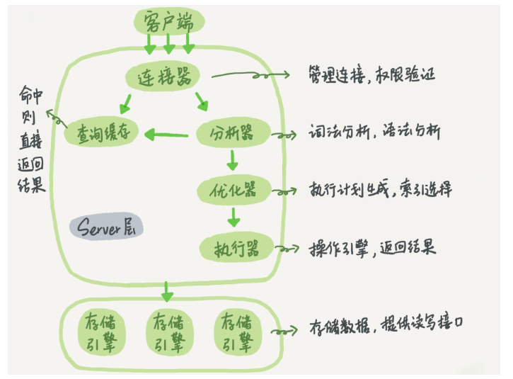

## MySql 语句执行流程及基础架构

### Mysql 基本架构

#### Server 层

**包含 Mysql 的大多数核心服务功能，及所有内置函数，所有跨存储引擎的功能都在这一层实现（存储过程，触发器，试图）**

* 连接器：管理连接，权限验证,负责跟客户端建立连接，获取权限，维持和管理连接

  ```shell
  mysql -h$ip -P$port -u$user -p
  ```

  1.连接命令中 `mysql` 是客户端工具，用来跟服务端建立连接。本机可以使用 `Unix` 域套接字连进行连接。指定 `IP` 则使用 `tcp` 进行连接。

  2.认证身份，如果用户名密码错误，会报错 `Access denied for user` ，然后客户端程序结束执行。如果认证通过，连接器会到权限表里查出拥有的权限。此后连接里的权限判断逻辑，都将依赖于此时读到到权限。（一个用户成功建立连接后，即使对该用户权限做了修改，也不会影响到已存在的连接的权限。修改完成后，再新建的连接才会使用新的权限设置）

  3.查看连接 `show processlist` 中 `Command` 列显示 `Sleep` 的文空闲连接。连接器自动断开 `Sleep` 的时间值为 `wait_timeout` ，默认 8 小时

  4.长连接：全部使用长连接会使 `MySQL` 占用内存涨的特别快，因为（`Mysql` 在执行过程中临时使用的内存是管理在连接对象里面的，这些资源会在连接断开的时候才释放。如果长连接累积起来，可能导致内存占用太大，被系统强行杀掉（`OOM`），导致 `Mysql` 异常重启。（定期断开长连接，使用一段时间，或者程序里面判断执行过一个占用内存的大查询后。如果使用`MySQL5.7`及以后版本，可以在每次执行一个比较大的操作后，执行 `mysql_reset_connection` 来重新初始化连接资源，这个过程不需要重连和重新做权限验证，但是会将连接恢复到刚刚创建完时的状态）

* 查询缓存：命中则直接返回结果，更新表数据则整个表的缓存都失效，8.0废除

  `MySQL` 提供了按需缓存，将参数 `query_cache_type` 设置成 `DEMAND` ，这样对默认的 `SQL` 语句都不使用查询缓存。而对于确定要使用查询缓存的语句，可以用 `SQL_CACHE` 显式指定

  ```sql
  select SQL_CACHE * from T where ID = 10
  ```

* 分析器：词法分析，语法分析

  1.词法分析

  2.语法分析，根据词法分析的结果，语法分析器会根据语法规则判断输入的 `SQL` 语句是否满足 `Mysql` 语法，如果语法不对会提示 `You have an error in your SQL syntax` ，语法错误会提示第一个出现错误的位置，即紧接 `use near` 的内容

* 优化器：执行计划生成，索引选择

  优化器是在表里面有多个索引的时候，决定使用那个索引，或者在一个语句有多表关联的时候，决定各个表的连接顺序。

* 执行器：操作引擎，返回结果

  1.开始执行的时候，会先判断对这个表是否有相应的`SQL` 语句权限。如果没有就会返回没有权限的错误

  ```mysql
  mysql> select * from T where ID=10;
  
  ERROR 1142 (42000): SELECT command denied to user 'b'@'localhost' for table 'T'
  ```

  2.如果有权限，就打开表继续执行。打开表的时候，执行器就会根据表的引擎定义，去使用这个引擎提供的接口（数据库的慢查询日志中的 `rows_examined` 字段，表示这个语句执行过程中扫描了多少行。这个值就是在执行器每次调用引擎获取数据行的时候累加的，有些时候，执行器调用一次，在引擎内部则扫描了多行，因此引擎扫描行数跟 `rows_examined` 并不是完全相同的）

  3.执行器执行查询流程：无索引则逐行扫描第一行直到最后一行，有索引则取满足条件的第一行，将所有满足条件的行组成记录集返回给客户端

#### 存储引擎层

**负责数据的存储和提取。架构模式是插件式的，支持 InnoDB、 MyISAM、Memory 等多个存储引擎，5.5开始默认存储引擎是 InnoDB**

#### Mysql 逻辑架构图



### 日志模块

#### redo log(InnoDB 引擎日志)

* `redo log` 是物理日志，记录的是 “在某个数据页上做了什么修改”
* WAL: `write-ahead-logging` 先写日志，再写磁盘。（当有一条记录需要更新的时候，`InnoDB` 引擎会先把记录写到 `redo log` 里面，并更新内存，这个时候更新就算完成了。`InnoDB` 引擎会在系统空闲时将操作记录更新到磁盘里面）
* `redo log` 是固定大小的。（从头开始写，写到末尾就又回到开头循环写，`write pos` 是当前记录的位置，一边写一边后移。循环写。`checkpoint` 是当前要擦除的位置，也是往后推移并且循环的。擦除记录前要把记录更新到数据文件），有了 `redo log`，`InnoDB` 就可以保证即使数据库发生异常重启，之前提交的记录都不会丢失，这个能力称为 `crash-safe`
* `Innodb_flush_log_at_trx_commit` 参数设置 1 时，表示每次事务的 `redo log` 都直接持久化到磁盘。可以保证 `mysql` 异常重启之后数据不丢失

#### binlog （server 层归档日志）

#### `redo log` 与 `binlog` 区别

1. `redo log` 是 `InnoDB` 引擎特有的；`binlog` 是 MySQL 的 `Server` 层实现的，所有引擎都可以使用
2. `redo log` 是物理日志，记录的是 `在某个数据页上做了什么修改`；`binlog` 是逻辑日志，记录的是这个语句的原始逻辑，比如 `给 ID = 2 这一行的 c 字段加 1`
3. `redo log` 是循环写的，空间固定会用完；`binlog` 是可以追加写入的（即 `binlog` 文件写到一定大小后会切换到下一个）

* `binlog` 是逻辑日志，记录的是这个语句的原始逻辑。
* `binlog` 是追加写入的。
* `sync_binlog` 这个参数设置成 1 时，表示每次事务的 `binlog` 都持久化到磁盘。这样可以保证 `mysql` 异常重启后 `binlog` 不丢失
* `binlog` 有两种模式，`statement` 格式记录的是 `sql` 语句，`row` 格式会记录行的内容，记两条，更新前和更新后都有。

### InnoDB 更新语句流程

#### 执行器和 `InnoDB` 引擎在执行 `update` 语句时的内部流程

```mysql
mysql> update T set c=c+1 where ID=2;
```

1. 执行器从引擎取 `ID=2` 这一行。ID 是主键，引擎直接用树搜索找到这一行。如果 ID = 2 这一行所在的数据页本来就在内存中，就直接返回给执行器；否则，先从磁盘读入内存，然后再返回
2. 执行器拿到引擎返回的行数据，把这个值加 1，得到新的一行数据，再调用引擎接口写入这行新数据
3. 引擎将这行新数据更新到内存中，同时将这个更新操作记录到 `redo log` 里面，此时 `redo log` 处理 `prepare` 状态。然后告知执行器执行完成了，随时可以提交事务
4. 执行器生成这个操作的 `binlog` 并把 `binlog` 写入磁盘
5. 执行器调用引擎的提交事务接口，引擎把写入的 `redo log` 改成提交 `commit` 状态，更新完成

*update语句的执行流程图*


** 浅色框表示是在 `InnoDB` 内部执行的，深色框表示在执行器中执行的 **

#### 两阶段提交

将 `redo log` 的写入拆成两个步骤：`prepare` 和 `commit` ，这就是两阶段提交

`binlog` 会记录所有的逻辑操作，并且是采用 `追加写` 的形式。如果 `DBA` 承诺说半个月内可以恢复，那么备份系统中一定会保存最近半个月的所有 `binlog`，同时系统会定期做整库备份（时间取决于系统的重要性，可以是一天一备份，也可以是一周一备份）

当需要恢复到指定的某一秒时，比如某天下午两点有一次误删表，需要找回数据，可以这么做

* 首先，找到最近的一次全量备份，从这个备份恢复到临时库
* 然后，从备份的时间点开始，将备份的 `binlog` 依次取出来，重放到中午误删表之前的那个时刻
* 这样临时库就跟误删之前的线上库一样了，然后可以把表数据从临时库取出来，按需要恢复到线上库区

由于 `redo log` 和 `binlog` 是两个独立的逻辑，如果不用两阶段提交而使用如下方式提交：

假定当前 ID = 2 的行，字段 c 的值是 0，再假设执行 `update` 语句过程中在写完第一个日志后，第二个日志还没有写完期间发生了 `crash`，会出现如下情况：

1. 先写 `redo log` 后写 `binlog`。假设在 `redo log` 写完，`binlog` 还没有写完的时候，MySQL 进程异常重启。`redo log` 写完之后，系统即使崩溃，仍能把数据恢复回来，所以恢复后这一行的 c 的值是 1。由于 `binlog` 还没写完就 `crash` 了，这时候 `binlog` 里面就没有记录这个语句。因此，之后备份日志的时候，存起来的 `binlog` 里面就没有这条语句。如果需要用这个 `binlog` 来恢复临时库的话，由于这个语句的 `binlog` 丢失，这个临时库就会少了这一次更新，恢复出来的这一行 c 的值就是 0，与原库不同。
2. 先写 `binlog` 后写 `redo log`。如果在 `binlog` 写完之后 `crash`，由于 `redo log` 还没写，崩溃恢复以后这个事务无效，所以这一行的值是 0。但是 `binlog` 里面已经记录了 `把 c 从 0 改成 1` 这个日志。所以，在之后用 `binlog` 来恢复的时候就多了一个事务出来，恢复出来的这一行 c 的值就是 1，与原库的值不同。

如果不使用`两阶段提交`，那么数据库的状态就有可能和用它的日志恢复出来的库的状态不一致。同类场景除恢复临时库之外，当需要扩容的时候，也就是需要再多搭建一些备库来增加系统的读能力的时候，现在常见的做法也是用全量备份加上应用 `binlog` 来实现的，这个不一致就会导致线上出现主从数据库不一致的情况。即 `redo log` 和 `binlog` 都可以用于表示事务的提交状态，而两阶段提交就是让这两个状态保持逻辑上的一致

* `redo log` 用于保证 `crash-safe` 能力。`innodb_flush_log_at_trx_commit` 这个参数设置成 1 的时候，表示每次事务的 `redo log` 都直接持久化到磁盘。这样可以保证 MySQL 异常重启之后数据不丢失；
* `sync_binlog` 这个参数设置成 1 的时候，表示每次事务的 `binlog` 都持久化到磁盘。这个参数设置成 1 的时候，可以保证 MySQL 异常重启之后的 `binlog` 不丢失。

### `InnoDB`Flush相关

#### `SQL` 语句为什么会间歇性变慢

一条 `SQL` 语句，正常执行的时候特别快，但是有时会变得特别慢，而且场景难复现，随机且持续时间短

`InnoDB` 在处理更新语句的时候，只做了写日志这一次磁盘操作。这个日志即 `redo log` ，在更新内存写完 `redo log` 后，就返回给客户度，本次更新成功

**当内存数据页跟磁盘数据页内容不一致的时候，这个内存也即为“脏页“。内存数据写入到磁盘后，内存和磁盘上的数据页的内容就一致了，称为“干净页”，不论不论脏页还是干净页，都在内存中。**

平时执行很快的更新操作，其实就是在写内存和日志，而 MySQL 偶尔抖一下的那个瞬间，可能是在刷脏页（`flush`）

* 当 `redo log` 写满了，要 `flush` 脏页，这种情况是 `InnoDB` 要尽量避免的，因为出现这种情况的时候，整个系统就不能再接受更新了，所有的更新都必须堵住。这时候更新数会跌为 0.

* 当内存不足时，要先将脏页写到磁盘。这种情况是比较常见的，**InnoDB 用缓冲池 `buffer pool` 管理内存，缓冲池中的内存页有三种状态：**

  第一种是，还没有使用的

  第二种是，使用了并且是干净页

  第三种是，使用了并且是脏页

  `InnoDB` 的策略是尽量使用内存，因此对于一个长时间运行的库来说，未被使用的页面很少。当要读入的数据页没有在内存的时候，就必须到缓冲池中申请一个数据页。这时候只能把最久不使用的数据页从内存中淘汰掉：如果要淘汰的是一个干净页，就直接释放出来复用；但如果是脏页，就必须将脏页先刷到磁盘，变成干净页后才能复用。

  刷脏页虽然是常态，但出现以下这两种情况，会明显影响性能

  1.一个查询要淘汰的脏页个数太多，会导致查询的响应时间明显变长；

  2.日志写满，更新全部堵住，写性能跌为 0，这种情况对敏感业务来说，是不能接受的

#### InnoDB 刷脏页的控制策略

首先，要告知 `InnoDB` 所在主机的 IO 能力，这样 `InnoDB` 才能知道需要全力刷脏页的时候，可以刷多快，使用 `innodb_io_capacity` 这个参数，可以配置 `InnoDB` 的磁盘能力。建议设置成磁盘的 `IOPS`

使用 `fio` 工具测试磁盘随机读写的命令

```shell
fio -filename=$filename -direct=1 -iodepth 1 -thread -rw=randrw -ioengine=psync -bs=16k -size=500M -numjobs=10 -runtime=10 -group_reporting -name=mytest
```

`InnoDb` 的刷盘速度的参考因素是：脏页比例与 `redo log` 写盘速度。`InnoDB` 会根据这两个因素先单独算出两个数字

参数 `innodb_max_dirty_pages_pct` 是脏页比例上限，默认值是 75%。`InnoDB` 会根据当前的脏页比例（假定为 M），算出一个范围在 0 到 100 之间的数字。`InnoDB` 每次写入的日志都有一个序号，当前写入的序号跟 `checkpoint` 对应的序号之间的差值，假设为 N。`InnoDB` 会根据这个 N 算出一个范围在 0 到 100 之间的数字，这个计算公式可以记为 F2(N)。N 越大，算出来的值越大。**根据上述算得的F1(M)和F2(N)两个值，取其中较大的值记为R，之后引擎就可以按照 innodb_io_capacity 定义的能力乘以 R% 来控制刷脏页的速度**

脏页比例是通过 `Innodb_buffer_pool_pages_dirty/Innodb_buffer_pool_pages_total` 得到的

```mysql
select VARIABLE_VALUE into @a from global_status where VARIABLE_NAME = 'Innodb_buffer_pool_pages_dirty';
select VARIABLE_VALUE into @b from global_status where VARIABLE_NAME = 'Innodb_buffer_pool_pages_total';
select @a/@b;
```

一旦一个查询请求需要在执行过程中先 `flush` 掉一个脏页时，这个查询就可能要比平时慢了。而 `MySQL` 中的一个机制，可能会让查询更慢：在准备刷一个脏页的时候，如果这个数据页旁边的数据页刚好是脏页，就会把这个旁边的脏页一起刷掉，而且会一致继续，即相邻的脏页的旁边的脏页也会被刷掉

在 `InnoDB` 中，`innodb_flush_neighbors` 参数就是用来控制这个行为的，值为 1 的时候会有上述刷新相邻的脏页机制，为 0 时即关闭该机制，只刷当前脏页

如果使用的是 SSD 这类 IOPS 比较高的设备的话，将 `innodb_flush_neighbors` 的值设置成 0。因为此时 IOPS 往往不是瓶颈，而只刷自己，就能更快执行完必要的刷脏页操作，减少 SQL 语句响应时间，8.0 种，默认值为 0；

