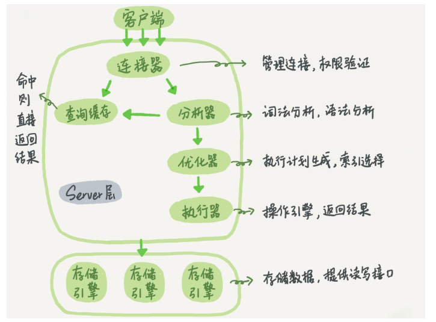

## MySql 执行流程

### Mysql 基本架构

#### Server 层

**包含 Mysql 的大多数核心服务功能，及所有内置函数，所有跨存储引擎的功能都在这一层实现（存储过程，触发器，试图）**

* 连接器：管理连接，权限验证,负责跟客户端建立连接，获取权限，维持和管理连接

  ```shell
  mysql -h$ip -P$port -u$user -p
  ```

  1.连接命令中 `mysql` 是客户端工具，用来跟服务端建立连接。本机可以使用 `Unix` 域套接字连进行连接。指定 `IP` 则使用 `tcp` 进行连接。

  2.认证身份，如果用户名密码错误，会 `Access denied for user` ，然后客户端程序结束执行。如果认证通过，连接器会到权限表里查出拥有的权限。此后连接里的权限判断逻辑，都将依赖于此时读到到权限。（一个用户成功建立连接后，即使对该用户权限做了修改，也不会影响到已存在的连接的权限。修改完成后，只有再新建的连接才会使用新的权限设置）

  3.查看连接 `show processlist` 中 `Command` 列显示 `Sleep` 的文空闲连接。连接器自动断开 `Sleep` 的时间值为 `wait_timeout` ，默认 8 小时

  4.长连接：全部使用长连接会使 `MySQL` 占用内存涨的特别块，因为（`Mysql` 在执行过程中临时使用的内存是管理在连接对象里面的，这些资源会在连接断开的时候才释放。如果长连接累积起来，可能导致内存占用太大，被系统强行杀掉（`OOM`），导致 `Mysql` 异常重启。（定期断开长连接，使用一段时间，或者程序里面判断执行过一个占用内存的大查询后。如果使用`MySQL5.7`及以后版本，可以在每次执行一个比较大的操作后，执行 `mysql_reset_connection` 来重新初始化连接资源，这个过程不需要重连和重新做权限验证，但是会将连接恢复到刚刚创建完时的状态）

* 查询缓存：命中则直接返回结果，更新表数据则整个表的缓存都失效，8.0废除

  `MySQL` 提供了按需缓存，将参数 `query_cache_type` 设置成 `DEMAND` ，这样对默认的 `SQL` 语句都不使用查询缓存。而对于确定要使用查询缓存的语句，可以用 `SQL_CACHE` 显式指定

  ```sql
  select SQL_CACHE * from T where ID = 10
  ```

* 分析器：词法分析，语法分析

  1.词法分析

  2.语法分析，根据词法分析的结果，语法分析器会根据语法规则判断输入的 `SQL` 语句是否满足 `Mysql` 语法，如果语法不对会提示 `You have an error in your SQL syntax` ，语法错误会提示第一个出现错误的位置，所以要关注的是紧接 `use near` 的内容

* 优化器：执行计划生成，索引选择

  优化器是在表里面有多个索引的时候，决定使用那个索引，或者在一个语句有多表关联的时候，决定各个表的连接顺序。

* 执行器：操作引擎，返回结果

  1.开始执行的时候，会先判断对这个表是否有相应的`SQL` 语句权限。如果没有就会返回没有权限的错误

  ```mysql
  mysql> select * from T where ID=10;
  
  ERROR 1142 (42000): SELECT command denied to user 'b'@'localhost' for table 'T'
  ```

  2.如果有权限，就打开表继续执行。打开表的时候，执行器就会根据表的引擎定义，去使用这个引擎提供的接口（数据库的慢查询日志中的 `rows_examined` 字段，表示这个语句执行过程中扫描了多少行。这个值就是在执行器）

#### 存储引擎层

**负责数据的存储和提取。架构模式是插件式的，支持 InnoDB, MyISAM, Memory 等多个存储引擎，5.5开始默认存储引擎是 InnoDB**

#### Mysql 逻辑架构图



