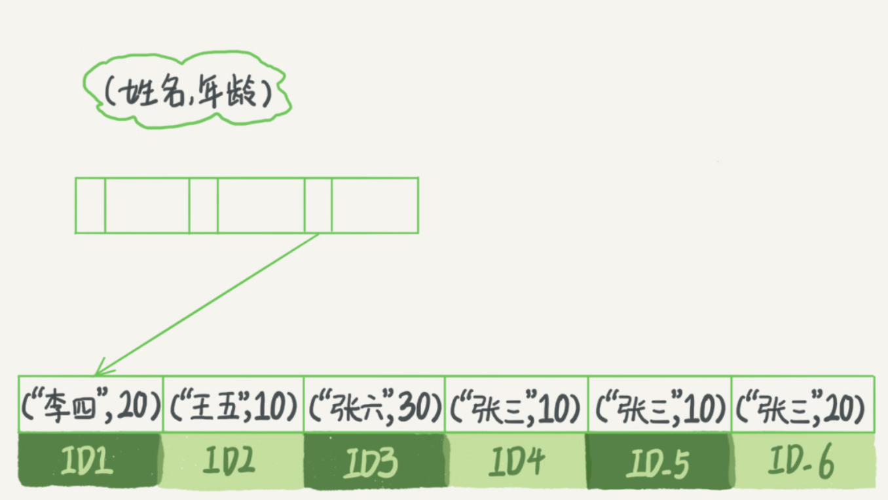

## `Mysql`索引

在 `Mysql` 中，索引是在存储引擎层实现地，并没有统一地索引标准，不同存储引擎索引地工作方式不一样。即使多个存储引擎支持同一种类型地索引，其底层地实现也可能不同。

### `InnoDB`索引模型

在 `InnoDB` 中，表都是根据主键顺序以索引地形式存放地，这种存储方式的表称为索引组织表。`InnoDB` 使用了 `B+` 树索引模型，数据都是存储在 `B+` 树中的，每一个索引在 `InnoDB` 里对应一棵 `B+` 树

* 主键索引的叶子节点存的是整行数据。在 `InnoDB` 里，主键索引也被称为聚簇索引（clustered index）
* 非主键索引的叶子节点内容是主键的值。在 `InnoDB` 中，非主键索引也被称为二级索引（secondary index）

#### 主键索引和普通索引的查询区别

* `select * from T where ID=500` 只需要搜索 `ID` 这个 `B+` 树
* `select * from T where K=5` 要先搜索 `K` 索引树，得到主键值，再在主键索引树上索引一次，过程称为回表，基于非主键索引的查询需要多扫描一棵索引树，尽量使用主键查询

#### 索引维护

B+ 树为了维护索引有序性，在插入新值会进行维护。如果插入位置的数据页满了，则需要申请一个新的数据页，然后挪动部分数据过去。这个过程称为页分裂。在这种情况下，性能会受影响，页分裂操作还影响数据页的利用率。原本放在一个页的数据，现在分到两个页中，整体空间利用率降低大约 50%。当相邻两个页由于删除了数据，利用率很低后，会将数据页做合并（分裂过程的逆向过程）。索引可能因为删除，或者页分裂等原因，导致数据页有空洞，重建索引的过程会创建一个新的索引，把数据按顺序插入，这样页面的利用率最高，即索引更紧凑，更省空间。

* 自增主键：自增主键的插入数据模式，是追加操作，不涉及到挪动其他记录，不会触发叶子节点的分裂，而用逻辑字段做主键，则往往不容易保证有序插入，这样写数据成本相对较高。由于每个非主键索引的叶子节点上都是主键的值。如果用整型做主键，则只要 4 字节，如果是长整型则是 8 字节。主键长度越小，普通索引的叶子节点就越小，普通索引占用的空间也就越小
* 典型的 `KV` 场景适合用业务字段直接做主键（即：只有一个索引；该索引必须是唯一索引）
* 删除，新建主键索引，都会讲整个表重建。会同时去修改普通索引对应的主键索引，性能消耗比较大，可以使用 `alter table T engine=InnoDb` 代替。

### 索引的查询流程

** 尽量少地访问资源是数据库设计的重要原则之一。在使用数据库的时候，尤其在设计表结构时，也要以减少资源消耗作为目标 **

```mysql
mysql> create table T (
ID int primary key,
k int NOT NULL DEFAULT 0, 
s varchar(16) NOT NULL DEFAULT '',
index k(k))
engine=InnoDB;
insert into T values(100,1, 'aa'),(200,2,'bb'),(300,3,'cc'),(500,5,'ee'),(600,6,'ff'),(700,7,'gg');

```

`select * from T where k between 3 and 5`，需要执行几次树的搜索操作，会扫描多少行？

这条 SQL 查询语句的执行流程

1. 在 k 索引树上找到 k = 3 的记录，取得 ID = 300；
2. 再到ID 索引树查询 ID = 300 对应的 R3；
3. 在 K 索引树取下一个值 k = 5，取得 ID = 500
4. 再回到 ID 索引树查到 ID = 500 对应的 R4；
5. 在 k 索引树取下一个值 k = 6，不满足条件，循环结束

在这个过程中，回到主键索引树搜索的过程，成为回表。这个查询读了 k 索引树的 3 条记录（步骤1，3 和 5），回表了两次（步骤 2 和 4）。

在这个查询语句中，由于查询结果所需要的数据只在主键索引上有，所以不得不回表。可以经过索引优化，避免回表过程

#### 覆盖索引

如果执行的语句是 `select ID  from T where k between 3 and 5`，这时只需要查 ID 的值，而 ID 的值已经在 k 索引树上了，因此可以直接提供结果，不需要回表。即在这个查询里面，索引 k 已经覆盖了查询需求，即为覆盖索引。

** 由于覆盖索引可以减少树的搜索次数，显著提升查询性能，所以使用覆盖索引是一个常用的性能优化手段 **

在引擎内部使用覆盖索引在索引 k 上其实读了 3 个记录，R3-R5（对应的索引 k 上的记录项），但是对于 Mysql 的 Server 层来说，它就是找引擎拿到了两条记录，因此 Mysql 认为扫描行数是 2。

因为索引字段的维护总是有代价的，在建立冗余索引来支持覆盖索引时要权衡考虑。

#### 最左前缀原则

B+ 树这种索引结构，可以利用索引的”最左前缀“，来定位记录

```c
create table `tuser` (
	`id` int(11) not null,
	`id_card` varchar(32) default null,
	`name` varchar(32) default null,
	`age` int(11) default null,
	`ismale` tinyint(1) default null,
	primary key (`id`),
	key `id_card` (`id_card`),
	key `name_age` (`name`, `age`)
) ENGINE = InnoDB
```

*name，age 索引图*



 可以看到，索引项时按照索引定义里面出现的字段属性排序的。

当逻辑需求时查到所有名字是 “张三” 的人时，可以快速定位到 ID4，然后向后遍历得到所有需要的结果。如果要查的是所有名字第一个字是 “张” 的人，SQL 语句 `where name like '张%'。这时，也能够用上这个索引，查找到第一个符合条件的记录是 ID3，然后向后遍历，直到不满足条件为止。

不只是索引的全部定义，只需要满足最左前缀，就可以利用索引来加速检索。这个最左前缀可以是联合索引的最左 N 个字段，也可以是字符串索引的最左 M 个字符

在建立联合索引的时候，如何安排索引内的字段顺序。

评估的标准是，索引的复用能力。因为可以支持最左前缀，所以当已经有了（a，b) 这个联合索引后，一般就不需要单独在 a 上建立索引了。因此，** 第一原则是，如果通过调整顺序，可以少维护一个索引，那么这个顺序往往就是需要优先考虑采用的。 **

如果既有联合查询，又有基于 a，b 各自的查询，而查询条件里只有 b 的语句，是无法使用 a，b 这个联合索引的，这时候不得不同时维护（a，b)、（b) 这两个索引。这个时候考虑的原则就是空间了。

#### 索引下推

`select * from tase where name like '张%' and age = 10 and issmale = 1`

依据前缀索引规则，该语句在搜索索引树的时候，只能用 “张”，找到第一个满足条件的记录 ID3。然后是判断其他条件是否满足。在 MySQL 5.6 之前，只能从 ID3 开始一个个回表。到主键索引上找出数据行，再对比字段值。而 MySQL 5.6 引入的索引下推优化（index condition pushdown)，可以在索引遍历过程中，对索引中包含的字段先做判断，直接过滤掉不满足条件的记录，减少回表次数。