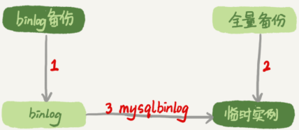
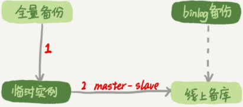

## 数据恢复

### Mysql 相关的误删数据

* 使用 `delete` 语句误删数据行
* 使用 `drop table` 或者 `truncate table` 语句误删数据表
* 使用 `drop database` 语句误删数据库
* 使用  `rm` 命令误删整个 `Mysql` 实例

### 误删行数据

如果是使用 `delete` 语句误删了数据行，可以用 `Flashback` 工具通过闪回把数据恢复回来。`Flashback` 恢复数据的原理，是修改 `binlog` 的内容，拿回源库重放。而能够使用这个方案的前提是，需要确保 `binlog_format=row` 和 `binlog_row_image=FULL`

具体恢复数据时，对单个事务做如下处理：

1.对于 `insert` 语句，对应的 `binlog event` 类型是 `Write_rows_event`，把它改成 `Delete_rows event` 极客

2.对于 `delete` 语句，将 `Delete_rows event` 改为 `Write_rows event`

3.如果是 `Update_rows` 的话，`binlog` 里面记录了数据行修改前和修改后的只，对调这两行位置即可

如果误删数据设计了多个事务的话，需要将事务的顺序调过来再执行

恢复数据比较安全的做法，是恢复出一个备份，或者找一个从库作为临时库，在这个临时库上执行这些操作，然后再将确认过的数据，恢复回主库（因为，一个在执行线上逻辑的主库，数据状态的变更往往是有关联的。可能由于发现数据问题的时候晚了一点儿，就导致已经在之前误操作的基础上，业务代码逻辑又继续修改了其他数据。所以，如果这时候单独恢复这几行数据，而又未经确认的话，就可能出现对数据的二次破坏

#### 事前预防删除

把 `sql_safe_updates` 参数设置为 on。这样一来，如果忘记 `delete` 或者 `update` 语句中写 `where` 条件，或者 `where` 条件里面没有包含索引字段的话，这个语句的执行就会报错

代码上线前，必须经过 SQL 审计

### 使用 `drop table` 或者 `truncate table` 语句删数据表

即使配置了 `binlog_format=row`，执行这三个命令时，记录的 `binlog` 还是 `statement` 格式。`binlog` 里面就只有一个 `truncate/drop` 语句，这些信息是恢复不出数据的。

### 误删库/表

这种情况下，要想恢复数据，就需要使用全量备份，加增量日志的方式了。这个方案要求线上有定期的全量备份，并且实时备份 `binlog`

这两个条件具备的情况下，假如中午12点误删了一个库，恢复数据的流程如下：

1.取最近一次全量备份，假设这个库是一天一备，上次备份是当天 0 点

2.用备份恢复出一个临时库

3.从日志备份里面，取出凌晨 0 点以后的日志

4.把这些日志，除了误删除数据的语句外，全部应用到临时库

*数据恢复流程-MySQLbinlog方法*

这个过程中，

为了加速数据恢复，如果这个临时库上有多个数据库，可以在使用 `mysqlbinlog` 命令时，加上一个 `database` 参数，用来指定误删除表所在的库。这样可以避免在恢复数据时还要应用其他库日志的情况

在应用日志的时候，需要跳过 12 点误操作的那个语句的 `binlog`:

如果原实例没有使用 `GTID` 模式，只能在应用到包含 12 点的 `binlog` 文件的时候，先用 `stop-position` 参数执行到误操作之前的日志，然后再用 `-start-position` 从误操作之后的日志继续执行

如果实例使用 `GTID` 模式，就方便了。假设误操作命令的 `GTID` 是  `gtid1`，那么只需要执行 `set gtid_next=gtid1;begin;commit;` 先把这个 `GTID` 加到临时实例的 `GTID` 集合，之后按顺序执行 `binlog` 的时候，就会自动跳过误操作的语句

即使这样，使用 `mysqlbinlog` 方法恢复数据还是不够快，主要原因有两个

1.如果是误删表，最好就是只恢复出这张表，也就是只重放这张表的操作，但是 `mysqlbinlog` 工具并不能指定只解析一个表的日志

2.用 `mysqlbinlog` 解析出日志应用，应用日志的过程就只能单线程。

一种加速的方法是，在用备份恢复出临时实例之后，将这个临时实例设置成线上备考的从库，这样：

1.在 `start slave` 之前，先通过执行 `change replication filter replicate_do_table = (tbl_name)` 命令，就可以让临时表只同步误操作的表

2.这样做也可以用并行复制技术，来加速整个数据恢复过程

​						*数据恢复流程-master-slave*

图中 `binlog` 备份系统到线上备库有一条虚线，是指如果时间太久，备库上已经删除了临时实例需要的 `binlog` 的话，可以从 `binlog` 备份系统中找到需要的 `binlog` 再放回备库中

假设，当前临时实例需要的 `binlog` 是从 `master.000005` 开始的，但是再备库上执行 `show binlogs` 显示的最小的 `binlog` 文件是  `master.000007` ，意味着少了两个 `binlog` 文件，这是，需要从 `binlog` 备份系统中找到这两个文件。

把之前删除掉的 `binlog` 放回备库的操作步骤，是这样的

1.从备份系统下载 `master.000005` 和 `master.000006` 这两个文件，放到备库的日志目录下

2.打开日志目录下的 `master.index` 文件，再文件开头加入两行，`./master.000005` 和 `./master.000006` 

3.重启备库，目的是要让备库重新识别这两个日志文件

4.现在这个备库上就有了临时库需要的所有 `binlog` 了，建立主备关系，就可以正常同步了

无论是 `mysqlbinlog` 工具解析出的 `binlog` 文件应用到临时表，还是把临时库连接到备库上，这两个方案的共同点是：误删库或者表后，恢复数据的思路主要是通过备份，再加上应用 `binlog` 的方式

也就是说，这两个方案都要求备份系统定期备份全量日志，而且需要确保 `binlog` 在被从本地删除之前已经做了备份

### 预防误删

账号分离，避免写错命令

* 只给业务开发人员 DML 权限，而不给 `truncate/drop` 权限。如果有 DDL 需求的话，也可以通过管理系统得到支持
* 即使是 DBA 团队成功，日常也都规定只使用只读账号，必要的时候才使用有更新权限的账号

制定操作规范，是避免写错要删除的表名

* 在删除数据表之前，必须先对表做改名操作，然后观察一段时间，确保对业务无影响以后再删除这张表

* 改表名的时候，要求给表名加固定的后缀 (如 `to_be_deleted`) ，然后删除表的动作必须通过管理系统执行。并且，管理删除表的时候，只能删除固定后缀的表
