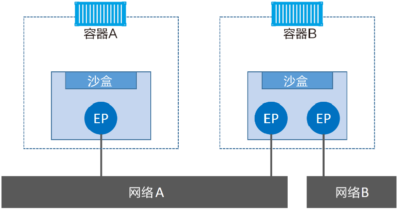
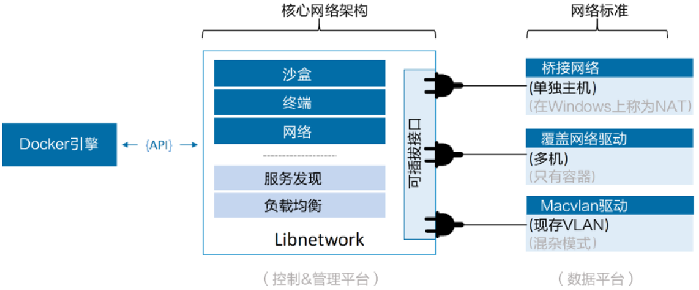

### Docker 网络

Docker 在容器内部运行应用，这些应用之间的交换依赖于大量不同的网络，Docker 对于容器之间、容器与外部网络和 VLAN 之间的连接均有相应的解决方案。

Docker 网络架构源自一种叫做容器网络模型（CNM）的方案，该方案是开源的并且支持插接式连接。`Libnetwork` 是 Docker 对 CNM 的一种实现，提供了 Docker 核心网络架构的全部功能。不同的驱动可以通过插拔的方式接入 `Libnetwork` 来提供定制化的网络拓扑。

为了实现开箱即用的，Docker 封装了一系列本地驱动，覆盖了大部分常见的网络需求。其中包括单机桥接网络（Single-Host Bridge Network）、多机覆盖网络（Multi-Host Overlay）、并且支持接入现有 VLAN。`Libnetwork` 提供了本地服务发现和基础的容器负载均衡解决方案

#### 底层设计

在顶层设计中，Docker 网络架构由 3 个主要部分构成：`CNM`、`Libnetwork`、`Drive`

`CNM` 是设计标准，在 CNM 中，规定了 Docker 网络架构的基础组成要素；`Libnetwork` 是 `CNM` 的具体实现，并且被 Docker 采用，`Libnetwork` 通过 Go 语言编写，并实现了 `CNM` 中列举的核心组件，`Drive` 通过实现特定网络拓扑的方式来拓展该模型的能力

##### CNM

CNM 定义了 3 个基本要素：

* 沙盒（Sandbox）

  是一个独立的网络栈，其中包括以太网接口、端口、路由表以及 DNS 配置

* 终端（Endpoint）

  是虚拟网络接口，就像普通网络接口一样，终端主要职责是负责创建连接，在 CNM 中，终端负责将沙盒连接到网络。终端与常见的网络适配器类似，终端只能接入某一个网络，如果容器需要接入到多个网络，就需要多个终端

* 网络（Network）

  是802.1d网桥（类似交换机）的软件实现。因此，网络就是需要交互的终端的集合，并且终端之间相互独立。

*CNM组件与容器进行关联，沙盒被放置在容器内部，为容器提供网络连接*



##### Libnetwork

CNM 是设计规范，`Libnetwork` 是标准的实现，它采用 Go 语言编写，是跨平台的。Docker 将网络部分从 daemon 中拆分，并重构为一个 `Libnetwork` 的外部类库。现在 docker 的核系网络架构代码都在 `Libnetwork` 中

`Libnetwork` 实现了 CNM 中定义的全部 3 个组件，还实现了本地服务发现（Service Discovery）、基于 Ingress 的容器负载均很，以及网络控制层和管理层功能

##### Drive

如果说 `Libnetwork` 实现了控制层和管理层功能，那么驱动就负责实现数据层。驱动层实际创建网络对象。Docker 封装了若干内置驱动，通常被称为原生驱动或者本地驱动。在 Linux 上包括 Bridge、Overlay、Macvlan，在 Windows 上包括 NAT、Overlay、Transport、L2 Bridge

*控制层管理层数据层关系*



每个驱动都负责其上所有网络资源的创建和管理，`Linnetwork` 支持同时激活多个网络驱动

#### 单机桥接网络

最简单的 docker 网络模型，只能在单个 docker 主机上运行，并且只能与所在 docker 主机上的容器进行连接。Linux Docker创建单机桥接网络采用内置的桥接驱动，而Windows Docker创建时使用内置的NAT驱动。实际上，这两种驱动工作起来毫无差异

docker 服务启动时会首先在主机上自动创建一个 docker0 虚拟网桥（Linux网桥）同时分配一个本地未占用的私有网段中的一个地址给 docker0 接口（典型：网段172.17.0.0/16掩码255.255.0.0）此后启动的容器内的网口也会自动分配一个该网段的地址。

当创建一个 docker 容器的时候，同时会创建一对 `veth pair` 互联接口，当向任一接口发送包时，另外一个接口自动收到相同的包。忽略接口的一端位于容器内，即 `eth0`；另一端在本地并被挂载 `docker0` 网桥（`veth` 开头）。通过这种方式，主机可以与容器通信，容器之间也可以互相通信。如此，docker 就创建了在主机和所有容器之间一个虚拟共享网络

*docker 网络连接原理*


从 1.7.0 开始 Docker 正式把网络与存储着两部分的功能实现都以插件化形式剥离出来，剥离出来的独立容器网络项目即为 `libnetwork` 项目

#### 多机覆盖网络

覆盖网络适用于多机环境。它允许单个网络包含多个主机，这样不同主机上的容器间就可以在链路层实现通信。覆盖网络是理想的容器间通信方式，支持完全容器化的应用，并且具备良好的伸缩性。Docker为覆盖网络提供了本地驱动。这使得创建覆盖网络非常简单，只需要在docker network create命令中添加--d overlay参数。

#### 容器网络模型

libnetwork 中容器网络模型（Container Networking Model，CNM）十分简洁和抽象，可以让其上层使用网络功能的容器最大程度地忽略底层具体实现，CNM 的典型生命周期：首先，驱动注册自己到网络控制器，网络控制器使用驱动类型，来创建网络；然后再创建的网络上创建接口；最后把容器连接到接口上即可。销毁过程则正好相反，先把容器从接入口上卸载，然后删除接入口和网络即可

*CNM的典型生命周期*


目前 CNM 支持的驱动类型有四种：Null、Bridge、Overlay、Remote

* Null：不提供网络服务，容器启动后无网络连接
* Bridge：传统默认用 Linux 网桥和 Iptables 实现的单机网络
* Overlay：用 vxlan 隧道实现的跨主机容器网络
* Remote：扩展类型，预留给外部实现的方案

在 `libnetwork` 支持下，Docker 网络相关操作都作为 network 子命令出现，包括以下命令：

* create 创建一个网络

  Docker 内置了 bridge（默认使用）和 overlay 两种驱动，分别支持单主机和多主机场景。Docker 服务在启动后，会默认创建一个 bridge 类型的网桥 bridge。不同网络之间默认相互隔离。

  `docker network create[OPTIONS]NETWORK`

  `-attachable[=false]`：支持手动容器挂载

  `-aux-address=map[]`：辅助的 IP 地址

  `-config-from=""`：从某个网络复制配置数据

  `-config-only[=false]`：启用仅可配置模式

  `-d,-driver="bridge"`：网络驱动类型，如 bridge 或 overlay

  `-gateway=[]`：网关地址

  `-ingress[=false]`：创建一个 Swarm 可路由的网状网络用于负载均衡，可将对某个服务的请求自动转发给一个合适的副本

  `-internal[=false]`：内部模式，禁止外部对所创建网络的访问

  `-ip-range=[]`：指定分配 IP 地址范围

  `-ipam-driver="default"`：IP 地址管理的插件类型

  `-ipam-opt=map[]`：IP地址管理插件的选项

  `-ipv6[=false]`：支持 IPv6 地址

  `-label value`：为网络添加元标签信息

  `-o,-opt=map[]`：网络驱动所支持的选项

  `-scope=""`：指定网络范围

  `-subnet=[]`：网络地址段，CIDR 格式，如：172.17.0.0/16

* connect 将容器接入网络

  connect 命令将一个容器连接到一个已存在的网络上。连接到网络上的容器可以跟同一网络中其他容器互通，同一容器可以同时接入多个网络。可以在执行 docker run 命令时候通过 -net 参数指定容器启动后自动接入的网络

  `docker network connect[OPTIONS]NETWORK CONTAINER`

  `alias=[]`：为容器添加一个别名，此别名仅在所添加网络上可见

  `-ip=""`：指定IP地址，需要注意不能跟已接入的容器地址冲突

  `-ip6=""`：指定IPv6地址

  `-link value`：添加连接到另一个容器

  `-link-local-ip=[]`：为容器添加一个链接地址

* disconnect 把容器从网络上断开

  `docker network disconnect[OPTIONS]NETWORK CONTAINER`

  `-f,-force`：强制把容器从网络上移除

* inspect 查看网络的详细信息

  inspect 命令用户查看一个网络的具体信息（JSON格式），包括接入的容器，网络配置信息等

  `docker network inspect[OPTIONS]NETWORK[NETWORK...]`

  `-f,-format=""`：给定一个 Golang 模板字符串，对输出结果进行格式化

  `-v,-verbose[=false]`：输出调试信息

* ls 列出所有的网络

  `docker network ls[OPTIONS]`

  `-f, -filter=""`：指定输出过滤器，如 `driver=bridge`

  `-format=""`：给定一个 golang 模板字符串，对输出结果进行格式化

  `-no-trunc[=false]`：不截断地输出内容

  `-q,-quiet[=false]`：安静模式，只打印网络 ID

* prune 清理无用的网络资源

  `docker network prune[OPTIONS][flags]`

  `-filter=""`：指定选项过滤器

  `-f,-force`：强制清理资源

* rm 删除一个网络

  当网络上没有容器连接上时，才会成功删除

  `docker network rm NETWORK[NETWORK...]`

```shell
# 创建网络 backend -d 指定驱动
docker network create -d overlay overnet # 创建名为 overnet 的覆盖网络
docker network create backend
# 列出本地 Docker 主机上的全部网络
docker network ls
# 查看网络详情
docker network inspect
# 删除主机上全部未使用的网络
docker network prune
# 删除指定网络
docker network rm
# 创建 container1/2 并加入 backend
docker run -it --name container1 --net backend busybox
docker run -it --name container2 --net backend busybox
# 在容器内测试容器连通性
ping container2
# 将 container2 加入 frontend 网络 network connect 会创建新的网卡来完成连接
docker network connect fronted container2
```

#### 服务与容器网络相关参数

##### 启动服务时配置重启生效

* 指定容器挂载的网桥

  `-b BRIDGE or --bridge=BRIDGE`

* 指定 docker0 的掩码

  `--bip=CIDR`

* docker 服务端接收命令通道

  `-H SOCKET --host=socket`

* 是否支持容器之间进行通信

  `--icc=true|false`

* 启用 net.ipv4.ip_forward，打开转发功能

  `--ip-forward=true|false`

* 禁止 docker 添加 iptables 规则

  `--iptables=true|false`

* 容器网络中的 MTU

  `--mtu=BYTES`

##### 启动服务时容器启动时

* 使用指定的 DNS 服务器

  `--dns=IP_ADDRESS`

* 指定 DNS 选项

  `--dns-opt=""`

* 指定 DNS 搜索域

  `--dns-search=DOMAIN`

##### 容器启动时生效

* 配置容器主机名

  `-h HOSTNAME or --hostname=HOSTNAME`

* 指定容器内接口的 IP 地址

  `-ip=""`

* 添加到另一个容器的连接

  `--link=CONTAINER_NAME:ALIAS`

* 配置容器的桥接模式

  `--net=bridge|none|container:NAME_or_ID|host|user_defined_network`

  支持五种模式：

  `--net=bridge`：默认配置，为容器创建独立的网络命名空间，分配网卡、IP 地址等网络配置，并通过 veth 接口对将容器挂载到一个虚拟网桥（默认 docker0）上

  `--net=none`：为容器创建独立的网络命名空间，但不进行网络配置，容器内没有创建网卡，IP 地址等

  `--net=container:NAME_or_ID`：新创建的容器共享指定的已存在容器的网络命名空间，两个容器内的网络配置共享，其他资源隔离

  `--net=host`：不为容器创建独立的网络命名空间，容器内看到的网络配置（网卡，路由表，Iptables规则）与主机上保持一致

  `--net=user_defined_network`：用户自行用 network 相关命令创建一个网络，同一个网络内的容器彼此可见，可以采用更多类型的网络插件

* 容器在网络中的别名

  `--network-alias`

* 映射容器端口到宿主主机

  `-p SPEC or --publish=SPEC`

* 映射容器所有端口到宿主主机

  `-P or --publish-all=true|false`

#### 端口映射

##### 从外部访问容器应用

在启动容器时，如果不指定对应参数，在容器外部时无法通过网络来访问容器内的网络应用和服务的， `-P` ，docker 会随机映射一个 49000 ~ 49900 的端口到内部容器开发的网络端口，`-f` 指定要映射的端口，且在一个指定端口上只可以绑定一个容器，支持的格式有 `IP:HostPort:ContainerPort|IP:ContainerPort|HostPort:ContainerPort`，多次使用 `-p` 标记可以绑定多个端口

### 容器间通信

通过容器向外界进行端口映射的方式可以实现通信，但不够安全，其需要 NAT，效率不高。docker 的连接系统可以在两个容器之间建立一个安全的通道。

#### 传统 link 通信

1.9 之后，网络操作独立成为一个命令组，link 系统也与原来不同，若容器使用默认的 bridge 模式网络，则会默认使用传统的 link 系统；而使用用户自定义的网络，则会使用新的 link 系统

##### 使用 link 通信

link 是在容器创建过程中通过 `--link <name or id>:alias` 参数创建的

```shell
# 创建数据库服务容器
docker run -d --name db training/postgres
# 创建 web 并连接到 db 上
docker run -d -P --name web --link db:webdb traiging/webapp python app.py
```

`db` 容器为源容器或子容器，`web` 容器为接收容器或父容器，一个接收容器可以设置多个源容器，一个源容器也可以有多个接收容器。docker 在容器创建的 link 阶段会进行如下工作

* 设置接收容器的环境变量

  没有一个源容器，接收容器就会设置一个名为 `<alias>_NAME` 环境变量，`alias` 为源容器的别名

* 更新接收容器的 `/etc/hosts` 文件

  Docker 容器的 IP 地址是不固定的，容器重启后 IP 地址可能就不同了，在有 link 关系的两个容器中，虽然接收方容器中包含源容器 IP 的环境变量，但如果源容器重启，接收方容器中的环境变量不会自动更新。因此 link 操作除了将 link 信息保存在接收容器中，还在 `/etc/hosts` 中添加了源容器的 IP 和别名。当一个容器重启后，自身的 hosts 文件和以自己为源容器的接收容器的 hosts 文件都会更新，保证了 link 系统的正常工作

* 建立 iptables 规则通信

#### 新 link 通信

相对于传统的 link 系统提供的名字和别名的解析、容器间网络隔离以及环境变量的注入，1.9 之后为用户提供了自定义网络提供了 DNS 自动名字解析，同一个网络中容器间的隔离，可以动态加入或者退出多个网络、支持 `--link` 为源容器设定别名等服务。在新的网络模型中，link 系统只是源容器起了一个别名，并且这个别名只对接收容器有效。新 link 系统在创建一个 link 时并不要求源容器已经创建或启动。

```shell
# 创建自定义网络 isolated_nw
docker network create isolated_nw
# 运行容器 container1 并加入 isolated_nw 并链接另一个容器 container2
docker run --net=isolated_nw -it --name=container1 --link container2:c2 busybox
# 创建 container2
docker run --net=isolated_nw -itd --name=container2 busybox
```

