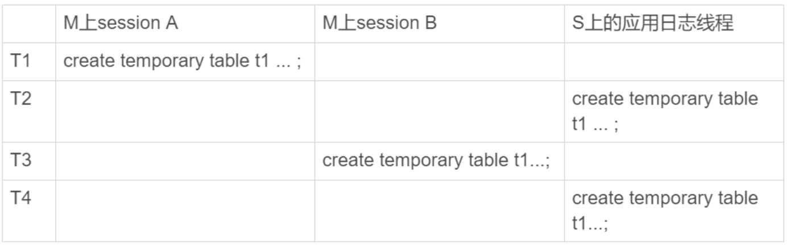
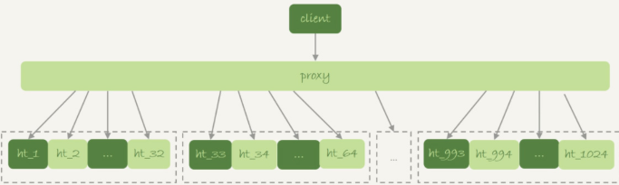
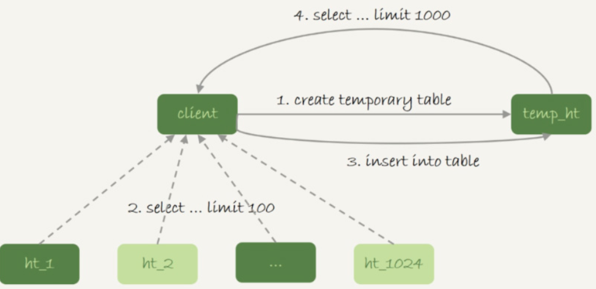
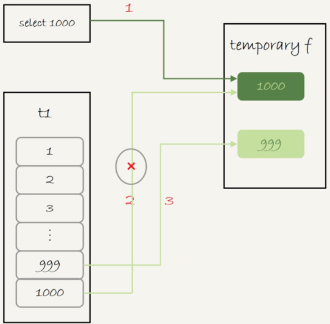
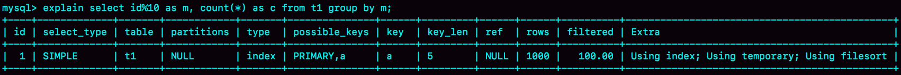
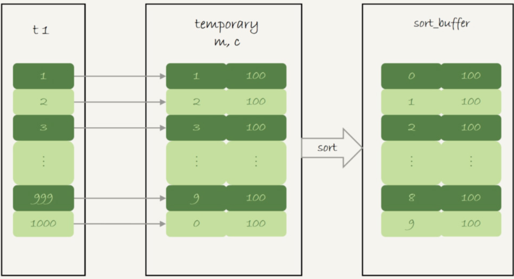

## MySQL 临时表

### 临时表

#### 临时表于内存表区别

* 内存表，指的是使用 `Memory` 引擎的表，建表语法是 `create table ...engine=memory`。这种表的数据都保存在内存里，系统重启的时候会被清空，但是表结构还在。其余特性与普通表一致
* 而临时表，可以使用各种引擎类型。如果是使用 `InnoDB` 引擎或者 `MyISAM` 引擎的临时表，写数据的时候是写到磁盘上的。

#### 临时表的特性

临时表在使用上有以下几个特点

1.建表语法是 `create temporary table ...`

2.一个临时表只能被创建它的 `session` 访问，对其他线程不可见。

3.临时表可以与普通表同名

4.一个 `session` 内有同名的临时表和普通表的时候，`show create` 语句，以及增删改查语句访问的是临时表

5.`show tables` 命令不显示临时表

由于临时表只能被创建它的 `session` 访问，所以这个 `session` 结束的时候，会自动删除临时表。因为这个特性，临时表特别适合 `join` 优化的场景

不同 session 的临时表是可以重名的，如果有多个 session 同时执行 join 优化，不需要担心表名重复导致建表失败的问题。不需要担心数据删除问题。如果使用普通表，在流程执行过程中客户端发生了异常断开。或者数据库发生异常重启，还需要专门来清理中间过程中生成的数据表。而临时表由于会自动回收，所以不需要这个额外的操作

执行 `create temporary table temp_t(id int primary key) engine=innodb`，这个语句的时候，MySQL 要给这个 `InnoDB` 表创建一个 `frm` 文件保存表结构定义，还要有地方保存表数据

这个 `frm` 文件放在临时文件目录（`/tmp`）下，文件名的后缀是 `.frm`，前缀是 “#sql{进程 id}_{线程 id}_序列号”。可以使用 `select @@tmpdir` 命令，来查看实例的临时文件目录

对于临时表中数据的存放方式，在不同的 MySQL 版本中有着不同的处理方式：

- 在 5.6 以及之前的版本里，MySQL 会在临时文件目录下创建一个相同前缀、以 `.ibd` 为后缀的文件，用来存放数据文件
- 而从 5.7 版本开始，MySQL 引入了一个临时文件表空间，专门用来存放临时文件的数据，不会再创建 `idb` 文件了

创建一个叫作 `t1` 的 `InnoDB` 临时表，`MySQL` 在存储上认为创建的临时表表名和普通表是不同的，因此同一个库下面，可以在已经有普通表 `t1` 的情况下，还是可以再创建一个临时表 `t1` 的

MySQL 维护数据表，除了物理上要有文件外，内存里面也有一套机制区别不同的表，每个表都对应一个 `table_def_key`

* 一个普通表的`table_def_key` 的值是由“库名 + 表名”得到的，因此如果要在同一个库下面创建两个同名的普通表，创建第二个表的过程中就会发现 `table_def_key` 已经存在了
* 而对于临时表，`table_def_key` 在 “库名 + 表名” 的基础上，又加入了 `server_id + thread_id`

即，`session A` 和 `session B` 创建的两个临时表 `t1`，它们的 `table_def_key` 不同，磁盘文件名也不同，因此可以并存

在实现上，每个线程都维护了自己的临时表链表。这样每次 `session` 内操作表的时候，先遍历链表，检查是否有这个名字的临时表，如果有就优先操作临时表，如果没有再操作普通表；在 `session` 结束的时候，对链表里的每个临时表，执行 `DROP TEMPORARY TABLE + 表名` 操作

`binlog` 中也记录了 `DROP TEMPORARY TABLE` 这条命令

#### 临时表和主备复制

在主库上执行下列语句

 ```mysql
create table t_normal(id int primary key, c int) engine=innodb;
create temporary table temp_t like t_normal;
insert into temp_t values(1, 1);
insert into t_normal select * from temp_t;
 ```

如果关于临时表的操作都不记录，那么在备库就只有 `create table t_normal` 表和 `insert into t_normal select * from temp_t`  这两个语句的 `binlog` 日志，备库在执行行 `insert into t_normal` 的时候，就会报错“表 temp_t 不存在“。

如果当前的 `binlog_format=row` ，那么跟临时表有关的语句，就不会记录到 `binlog` 里。即只有在 `binlog_format=statment/mixed` 的时候，`binlog` 中才会记录临时表的操作

这种情况下，创建临时表的语句会传到备库执行，因此备库的同步线程就会创建这个临时表。主库在线程退出的时候，会自动删除临时表，但是备库同步线程是持续在运行的。所以，这时候需要在主库上再写一个 `DROP TEMPORARY TABLE` 传给备库执行

主库上不同线程创建同名的临时表是没关系的，传到备库执行流程

*主备关系中的临时表操作*



主库 M 上的两个 `session` 创建了同名的临时表 `t1`，这两个 `create temporary table t1` 语句都会被传到备库 S 上。

但是，备库的应用日志线程是共用的，即要在应用线程里先后执行这个 `create` 语句两次（即是开了多线程复制，也可能被分配到从库的同一个 `worker` 中执行）。备库线程在执行的时候，要把这两个 `t1` 表当做两个不同的临时表来处理。（MySQL 在记录 `binlog` 的时候，会把主库执行这个语句的线程 id 写到 `binlog` 中，这样，在备库的应用线程就能够知道执行每个语句的主库线程 id，并利用这个线程 id 来构造临时表的 `table_def_key`:

1. `session A` 的临时表 `t1`，在备库的 `table_def_key` 就是：库名 + t1 + “M 的 serverid“ + ”session A 的 thread_id“；
2. `session B` 的临时表 `t1`，在备库的 `table_def_key` 就是：库名 +  t1 + “M 的 serverid“ + “session B 的 thread_id“

由于 `table_def_key` 不同，所以这两个表在备库的应用线程里面是不会冲突的

#### 临时表的应用

由于不用担心线程之间的重名冲突，临时表经常会被用在复杂查询的优化过程中。其中，分库分表系统的跨库查询就是一个典型的使用场景。

一般分库分表的场景，就是要把一个逻辑上的大表分散到不同的数据库实例上。如将一个大表 ht，按照字段 f，拆分成 1024 个分表，然后分布到 32 个数据库实例上。

*分库分表简图*



一般情况下，这种分库分表系统都有一个中间层 `proxy`。不过，也有一些方案会让客户端直接连接数据库，即，没有 `proxy` 这一层。在这个架构中，分区 `key` 的选择是以 "减少跨库和跨表查询" 为依据的。如果大部分语句都会包含 f 的等值条件，那么就要用 f 做分区键。这样，在 `proxy` 这一层解析完 SQL 语句以后，就能确定将这条语句路由到那个分表做查询

```mysql
select v from ht where f=N
```

这时，可以通过分表规则（如，N%1024）来确认需要的数据被放在那个分表上。这种语句只需要访问一个分表，是分库分表方案最欢迎的语句形式了。

但是，如果这个表上还有另外一个索引k，并且查询语句是这样的：

```mysql
select v from ht where k >= M order by t_modified desc limit 100;
```

此时，由于查询条件里面没有用到分区字段 f，只能到所有的分区中去查找满足条件的所有行，然后统一做 `order by` 操作。这种情况下，有两种比较常用的思路

第一种思路是，在 `proxy` 层的进程代码中实现排序

这种方式的优势是处理速度快，拿到分库的数据以后，直接在内存中参与计算。不过，这个方案的缺点也比较明显

1.需要的开发工作量比较大。如果涉及到复杂的如：`group by`，`join` 这样的操作。对中间层的开发能力要求比较高

2.对 `proxy` 端的压力比较大，很容易出现内存不够用和 CPU 瓶颈问题

另一种思路是，把各个分库拿到的数据，汇总到一个 MySQL 实例的一个表中，然后在这个汇总实例上做逻辑操作

此时上面语句的执行流程是：

* 在汇总表上创建一个临时表 `temp_ht`，表里包含三个字断 `v` ，`k`，`t_modified`；

* 在各个分库上执行

  ```mysql
  select v,k,t_modified from ht_x where k >= M order by t_modified desc limit 100;
  ```

* 把分库执行的结果插入到 `temp_ht` 表中；

* 执行 `select v from temp_ht order by t_modified desc lime 100;` 得到结果

*跨库查询使用临时表流程图*



在实践中，往往每个分库的计算量都不饱和，所以会直接把临时表 `temp_ht` 放到 32 个分库中的某一个上。

### 内部临时表使用场景

#### union 执行流程

```mysql
(select 1000 as f) union (select id from t1 order by id desc limit 2)
```

这条语句用到了 `union`，他的语义是，取这两个子查询结果的并集（重复的行只保留一行）

*union语句 explain 结果*


* 第二行的 `key=PRIMARY`，说明第二个子句用到了索引 id
* 第三行的 `Extra` 字断，表示在对子查询的结果集做  `union` 的时候，使用了临时表 （`Using temporary`）

这个语句的执行流程是这样的：

1.创建一个内存临时表，这个临时表只有一个整型字断 f，并且 f 是是主键字段

2.执行第一个子查询，得到 1000 这个值，并存入临时表中

3.执行第二个子查询：

​	拿到第一行 `id=1000`，试图插入临时表中。但由于 1000 这个值已经存在于临时表了，违反了唯一性约束，所以插入失败，然后继续执行

​	取得第二行 `id=999`，插入临时表成功。

4.从临时表中按行取出数据，返回结果，并删除临时表，结果中包含两行数据分别是 1000 和 999

*union执行流程*



`union` 这里的内存临时表起到了暂存数据的作用，而且计算过程还用上了临时表主键 id 的唯一性约束，实现 `union` 的语义。如果把上面这个语句中的 `union` 改成 `union all` 的话，就没有“去重“的语义。这样执行的时候，就依次执行子查询，得到的结果直接作为结果集的一部分，发给客户端。因此不需要临时表

*union all 的 explain 结果*


第二行的 `Extra` 字断显示的是 `Using index`，表示只使用了覆盖索引，没有用临时表了。

#### group by 执行流程

另一个常见的临时表的场景是 `group by`

```mysql
select id%10 as m, count(*) as c from t1 group by m;
```

这个语句的逻辑是把表 t1 里的数据，按照 id%10 进行分组统计，并按照 m 的结果排序后输出。它的 `explain` 结果如下：

*explain分析 group by 结果*



在 Extra 里：

* `Using index`，表示这个语句使用了覆盖索引，选择了索引 a，不需要回表
* `Using temporary` ，表示使用了临时表
* `Using filesort`，表示需要排序

这个语句的执行流程是这样的：

1. 创建内存临时表，表里有两个字段 m 和 c，主键是 m

2. 扫描表 t1 的索引 a，依次取出叶子节点上的 id 值，计算 id%10 的结果，记为 x；

   如果临时表中没有主键为 x 的行，就插入一个记录（x,1)

   如果表中有主键为 x 的行，就将 x 这一行的 c 值加 1；

3. 遍历完成后，再根据字断 m 做排序，得到结果集返回给客户端

*group by 执行流程*



如果不需要对结果进行排序，在 SQL 末尾增加 `order by null`

```mysql
select id%10 as m, count(*) as c from t1 group by m order by null;
```

这样可以跳过最后排序阶段，直接从临时表中取数据返回。

如果内存临时表放不下数据，（内存临时表大小参数 `tmp_table_size`）默认是 16777216 (16m)

```mysql
set tmp_table_size=1024;
select id%100 as m, count(*) as c from t1 group by m order by null limit 10;
```

此时把内存临时表的大小限制为最大 1024 字节，使用返回结果超过内存临时表上限。这时候就会把内存临时表转成磁盘临时表，磁盘临时表默认使用的引擎 `InnoDB`。

#### group by 优化方法 -- 索引

无论是磁盘临时表还是内存临时表，`group by` 逻辑都需要构造一个带唯一索引的表，执行代价都是比较高的。如果表的数据量比较大，`group by` 语句执行起来就会很慢。`group by` 的语义逻辑，是统计不同的值出现的个数。但是，由于每一行的结果是无序的，所以需要一个临时表，来记录并统计结果。

如果可以确保数据的是有序的，那么计算 `group by` 的时候，就只需要从左到右，顺序扫描，依次累加。

在 MySQL 5.7 版本支持了 `generated column` 机制，用来实现列数据的关联更新。可以用下面的方法创建一个列 z，然后在 z 列上创建一个索引（5.6 及之前的版本，可以创建普通列和索引，来解决这个问题）

```mysql
alter table t1 add column z int generated always as(id % 100), add index(z);
```

这样，索引 z 上的数据就是有序的。`group by` 语句可以改成

```mysql
select z, count(*) as c from t1 group by z;
```

优化后的 `group by` 语句的 `explain` 结果，不再需要临时表，也不需要排序了

在 `group by` 语句中加入 `SQL_BIG_RESULT` 这个提示，就可以告诉优化器：这个语句涉及的数据量很大，请直接用磁盘临时表

```mysql
select SQL_BIG_RESULT id%100 as m, count(*) as c from t1 group by m;
```

的执行流程是：

1.初始化 `sort_buffer`，确定放入一个整型字断，记为 m;

2.扫描表 t1 的索引 a，依次取出里面的 `id` 值，将 `id%100` 的值存入 `sort_buffer` 中；

3.扫描完成后，对 `sort_buffer` 的字断 m 做排序（如果 `sort_buffer` 内存不够用，就会利用磁盘临时文件辅助排序）

4.排序完成后，就得到一个有序数组

根据有序数组，得到数组里面的不同值，以及每个值的出现次数。

即对 `group by` 的良好实践是：

1.如果对 `group by` 语句的结果没有排序要求，要在语句后面加 `order by null`;

2.尽量让 `group by` 过程用上表的索引，确认方法是 `explain` 结果里没有 `Using temporary` 和 `Using filesort`

3.如果 `group by` 需要统计的数据量不大，尽量只使用内存临时表；也可以通过适当调大 `tmp_table_size` 参数，来避免用到磁盘临时表

4.如果数据量是在太大，使用 `SQL_BIG_RESULT` 这个提示，来告诉优化器直接使用排序算法得到 `group by` 的结果

#### 临时表使用场景如下：

1.如果语句执行过程可以一边读数据，一边直接得到结果，是不需要额外内存的，否则就需要额外的内存，来保存中间结果

2.`join_buffer` 是无序数组，`sort_buffer` 是有序数组，临时表是二维表结构

3.如果执行逻辑需要用到二维表特性，就会优先考虑使用临时表。