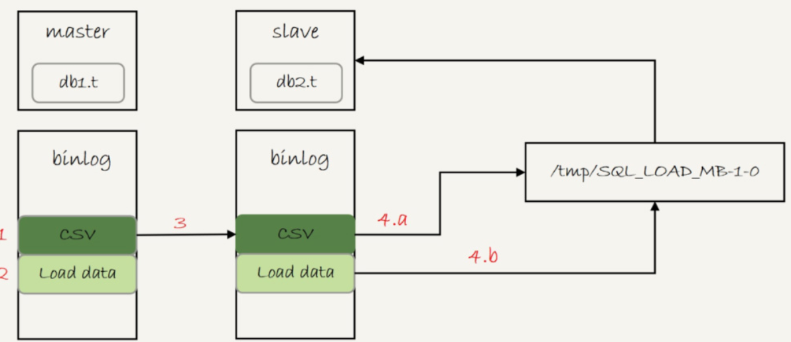
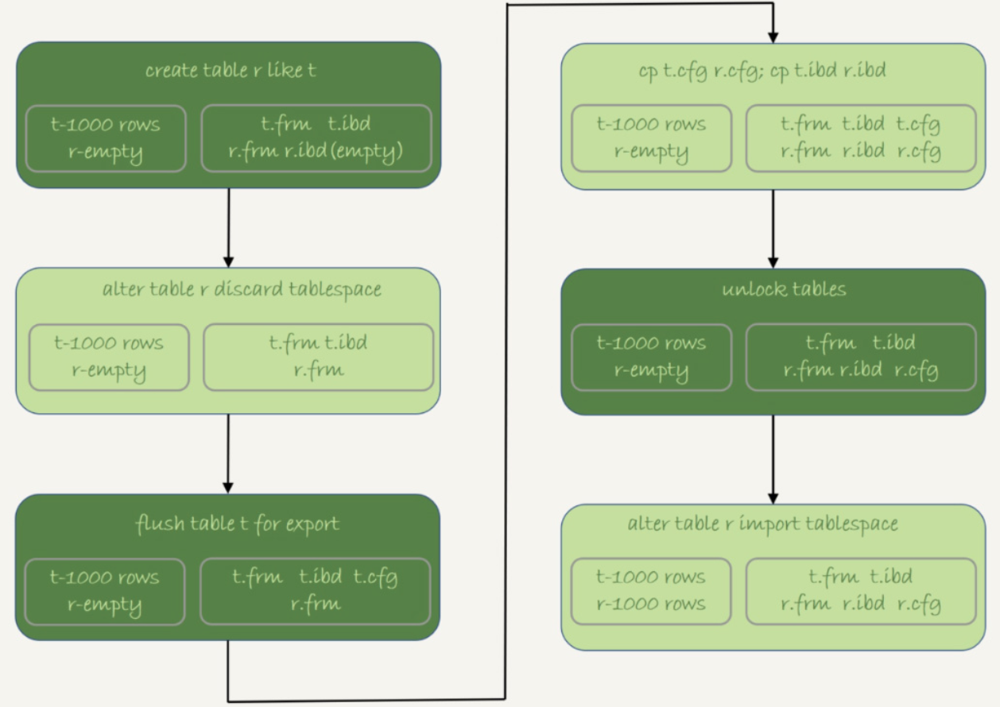

## 数据相关

### 数据恢复

#### Mysql 相关的误删数据

* 使用 `delete` 语句误删数据行
* 使用 `drop table` 或者 `truncate table` 语句误删数据表
* 使用 `drop database` 语句误删数据库
* 使用  `rm` 命令误删整个 `Mysql` 实例

#### 误删行数据

如果是使用 `delete` 语句误删了数据行，可以用 `Flashback` 工具通过闪回把数据恢复回来。`Flashback` 恢复数据的原理，是修改 `binlog` 的内容，拿回源库重放。而能够使用这个方案的前提是，需要确保 `binlog_format=row` 和 `binlog_row_image=FULL`

具体恢复数据时，对单个事务做如下处理：

1.对于 `insert` 语句，对应的 `binlog event` 类型是 `Write_rows_event`，把它改成 `Delete_rows event` 极客

2.对于 `delete` 语句，将 `Delete_rows event` 改为 `Write_rows event`

3.如果是 `Update_rows` 的话，`binlog` 里面记录了数据行修改前和修改后的只，对调这两行位置即可

如果误删数据设计了多个事务的话，需要将事务的顺序调过来再执行

恢复数据比较安全的做法，是恢复出一个备份，或者找一个从库作为临时库，在这个临时库上执行这些操作，然后再将确认过的数据，恢复回主库（因为，一个在执行线上逻辑的主库，数据状态的变更往往是有关联的。可能由于发现数据问题的时候晚了一点儿，就导致已经在之前误操作的基础上，业务代码逻辑又继续修改了其他数据。所以，如果这时候单独恢复这几行数据，而又未经确认的话，就可能出现对数据的二次破坏

##### 事前预防删除

把 `sql_safe_updates` 参数设置为 on。这样一来，如果忘记 `delete` 或者 `update` 语句中写 `where` 条件，或者 `where` 条件里面没有包含索引字段的话，这个语句的执行就会报错

代码上线前，必须经过 SQL 审计

#### 使用 drop 或者 truncate 语句删数据表

即使配置了 `binlog_format=row`，执行这三个命令时，记录的 `binlog` 还是 `statement` 格式。`binlog` 里面就只有一个 `truncate/drop` 语句，这些信息是恢复不出数据的。

#### 误删库/表

这种情况下，要想恢复数据，就需要使用全量备份，加增量日志的方式了。这个方案要求线上有定期的全量备份，并且实时备份 `binlog`

这两个条件具备的情况下，假如中午12点误删了一个库，恢复数据的流程如下：

1.取最近一次全量备份，假设这个库是一天一备，上次备份是当天 0 点

2.用备份恢复出一个临时库

3.从日志备份里面，取出凌晨 0 点以后的日志

4.把这些日志，除了误删除数据的语句外，全部应用到临时库

*数据恢复流程-MySQLbinlog方法*


这个过程中，

为了加速数据恢复，如果这个临时库上有多个数据库，可以在使用 `mysqlbinlog` 命令时，加上一个 `database` 参数，用来指定误删除表所在的库。这样可以避免在恢复数据时还要应用其他库日志的情况

在应用日志的时候，需要跳过 12 点误操作的那个语句的 `binlog`:

如果原实例没有使用 `GTID` 模式，只能在应用到包含 12 点的 `binlog` 文件的时候，先用 `stop-position` 参数执行到误操作之前的日志，然后再用 `-start-position` 从误操作之后的日志继续执行

如果实例使用 `GTID` 模式，就方便了。假设误操作命令的 `GTID` 是  `gtid1`，那么只需要执行 `set gtid_next=gtid1;begin;commit;` 先把这个 `GTID` 加到临时实例的 `GTID` 集合，之后按顺序执行 `binlog` 的时候，就会自动跳过误操作的语句

即使这样，使用 `mysqlbinlog` 方法恢复数据还是不够快，主要原因有两个

1.如果是误删表，最好就是只恢复出这张表，也就是只重放这张表的操作，但是 `mysqlbinlog` 工具并不能指定只解析一个表的日志

2.用 `mysqlbinlog` 解析出日志应用，应用日志的过程就只能单线程。

一种加速的方法是，在用备份恢复出临时实例之后，将这个临时实例设置成线上备考的从库，这样：

1.在 `start slave` 之前，先通过执行 `change replication filter replicate_do_table = (tbl_name)` 命令，就可以让临时表只同步误操作的表

2.这样做也可以用并行复制技术，来加速整个数据恢复过程

​						*数据恢复流程-master-slave*


图中 `binlog` 备份系统到线上备库有一条虚线，是指如果时间太久，备库上已经删除了临时实例需要的 `binlog` 的话，可以从 `binlog` 备份系统中找到需要的 `binlog` 再放回备库中

假设，当前临时实例需要的 `binlog` 是从 `master.000005` 开始的，但是再备库上执行 `show binlogs` 显示的最小的 `binlog` 文件是  `master.000007` ，意味着少了两个 `binlog` 文件，这是，需要从 `binlog` 备份系统中找到这两个文件。

把之前删除掉的 `binlog` 放回备库的操作步骤，是这样的

1.从备份系统下载 `master.000005` 和 `master.000006` 这两个文件，放到备库的日志目录下

2.打开日志目录下的 `master.index` 文件，再文件开头加入两行，`./master.000005` 和 `./master.000006` 

3.重启备库，目的是要让备库重新识别这两个日志文件

4.现在这个备库上就有了临时库需要的所有 `binlog` 了，建立主备关系，就可以正常同步了

无论是 `mysqlbinlog` 工具解析出的 `binlog` 文件应用到临时表，还是把临时库连接到备库上，这两个方案的共同点是：误删库或者表后，恢复数据的思路主要是通过备份，再加上应用 `binlog` 的方式

也就是说，这两个方案都要求备份系统定期备份全量日志，而且需要确保 `binlog` 在被从本地删除之前已经做了备份

### 预防误删

账号分离，避免写错命令

* 只给业务开发人员 DML 权限，而不给 `truncate/drop` 权限。如果有 DDL 需求的话，也可以通过管理系统得到支持
* 即使是 DBA 团队成功，日常也都规定只使用只读账号，必要的时候才使用有更新权限的账号

制定操作规范，是避免写错要删除的表名

* 在删除数据表之前，必须先对表做改名操作，然后观察一段时间，确保对业务无影响以后再删除这张表

* 改表名的时候，要求给表名加固定的后缀 (如 `to_be_deleted`) ，然后删除表的动作必须通过管理系统执行。并且，管理删除表的时候，只能删除固定后缀的表

## 数据拷贝

#### mysqldump 方法

使用 mysqldump 命令将数据导出成一组 INSERT 语句。

```shell
mysqldump -h$host -P$port -u$user --add-locks=0 --no-create-info --single-transaction  --set-gtid-purged=OFF db1 t --where="a>900" --result-file=/client_tmp/t.sql
```

把结果输出到临时文件。主要参数含义如下：

* `--single-transaction` 的作用是，在导出数据的时候不需要对表 `db1.t` 加表锁，而是使用 `START TRANSACTION WITH CONSISTENT SNAPSHOT` 的方法

* `--add-locks` 设置为 0，表示在输出的文件结果里，不增加 `LOCK TABLE t WRITE;`;
* `--no-create-info` 的意思是，不需要导出表结构
* `--set-gtid-purged=off` 表示的是，不输出跟 `GTID` 相关的信息
* `--result-file` 指定了输出文件的路径，其中 `client` 表示生产文件是在客户端机器上
* `--skip-extended-insert` 参数指定一条 `insert` 语句只插入一行数据

将 `INSERT` 语句放到 db2 库里去执行

```shell
mysql -h$host -P$port -u$user db2 -e "source /client_tmp/t.sql"
```

`source` 并不是一条 SQL 语句，而是一个客户端命令。mysql 客户端执行这个命令的流程是：

1.打开文件，默认以分号为结尾读取一条条的 SQL 语句

2.将 SQL 语句发送到服务端执行。

即，服务端执行的并不是 `source t.sql`语句，而是 `INSERT` 语句。所以，不论是在慢查询日志（slow log），还是在 `binlog`，记录的都是这些要被真正执行的 INSERT 语句

#### 导出 CSV 文件

mysql 提供了直接将结果导出成 `.csv` 文件，用来将查询结果导出到服务端本地目录

```mysql
select * from db1.t where a > 900 into outfile '/server_tmp/t.csv'
```

* 这条语句会将结果保存在服务端。如果执行命令的客户端和 MySQL 服务端不在同一个机器上，客户端机器的临时目录下是不会生成 `t.csv` 文件的

* `into outfile` 指定了文件的生成位置，这个位置必须受参数 `secure_file_priv` 的限制。（参数 `secure_file_priv` 为 empty 时，表示不限制文件生成的位置，这是不安全的设置；如果为一个表示路径的字符串，就要求生成的文件只能放在这个指定的目录，或者它的子目录；如果为 null，表示禁止在这个 MySQL 实例上执行 `select ... into outfile` 操作）
* 这条命令不会覆盖文件，执行语句时会因为有同名文件的存在而报错
* 生成的文本文件中，原则上一个数据行对应文本文件的一行。但是，如果字断中包含换行符，在生成的文本中也会有换行符。不过会在类似换行符、制表符这类符号前加上 `\` 转义符，这样就可以跟字断之间，数据行之间的分隔符区分开

`select ... into outfile` 方法不会生成表结构文件，在导出数据时还需要单独的命令得到表结构定义。`mysqldump` 提供了一个 `--tab` 参数，可以同时导出表结构定义文件和 `csv` 数据文件。这条命令的使用方法如下：

```shell
mysqldump -h$host -P$port -u$user ---single-transaction  --set-gtid-purged=OFF db1 t --where="a>900" --tab=$secure_file_priv
```

这条命令会在 `$secure_file_priv` 定义的目录下，创建一个 `t.sql` 文件保存建表语句，同时创建一个 `t.txt` 文件保存 CSV 数据

将 `.csv` 文件使用 `load data` 命令导入到目标数据表

```mysql
load data infile '/server_tmp/t.csv' into table db2.t'
```

这条语句的执行流程是：

1.打开文件 `/server_tmp/t.csv`，以制表符（`\t`）作为字段间的分隔符，以换行符（`\n`）作为记录之间的分隔符，进行数据读取；

2.启动事务

3.判断每一行的字段数与表 db2.t 是否相同：若不相同，则直接报错，事务回滚，若相同，则构造成一行，调用 `InnoDB` 引擎接口，写入到表中

4.重复步骤 3，直到 `/server_tmp/t.csv` 整个文件读入完成，提交事务

如果 `binlog_format=statement`，这个 `load` 语句记录到 `binlog` 里以后，在备库执行机制是：

由于 `/server_tmp/t.csv` 文件只保存在主库所在的主机上，如果只是把这条语句原文写到 `binlog` 中，在备库执行的时候，备库的本地机器上没有这个文件，就会导致主备同步停止。所以，这条语句执行的完整流程，是下面这样的：

1.主库执行完成后，将 `/server_tmp/t.csv` 文件的内容直接写到 `binlog` 文件中

2.往 `binlog` 文件中写入语句 `load data local infield '/tmp/SQL_LOAD_MB-1-0' INTO TABLE db2.t`

3.把这个 `binlog` 日志传到备库

4.备库的 `apply` 线程在执行这个事务日志时：

​	  a.先将 `binlog` 中 `t.csv` 文件的内容读出来，写入到本地临时目录 `/tmp/SQL_LOAD_MB-1-0` 中；

​	b.再执行 `load data` 语句，往备库的 `db2.t` 表中插入跟主库相同的数据

*load data 的同步流程*



这里备库执行的 `load data` 语句里面，多了一个 `local`。它的意思是将执行这条命令的客户端所在机器的本地文件 `/tmp/SQL_LOAD_MB-1-0` 的内容，加载到目标表 `db2.t` 中

即，load data 命令有两种用法：

1.不加 `local`，是读取服务端的文件，这个文件必须在 `secure_file_priv` 指定的目录或子目录下

2.加上 `local`，读取的是客户端的文件，只要 `mysql` 客户端有访问这个文件的权限即可。这时候，MySQL 客户端会先把本地文件传给服务端，然后执行上述的 `load data` 流程

#### 物理拷贝方法

一个 InnoDB 表，除了包含这两个物理文件外，还需要在数据字典中注册。直接拷贝这两个文件的话，因为数据字典中没有 `db2.t` 这个表，系统是不会识别和接受它们的。在 5.6 版本引入了可传输表空间的方法，可以通过导出 + 导入表空间的方式，实现物理拷贝表的功能

假设目标是在 db1 库下，复制一个跟表 t 相同的表 r，具体的执行步骤如下：

1.执行 `create table r like t`，创建一个相同表结构的空表

2.执行 `alter table r discard tablespace`，这时候 `r.ibd` 文件会被删除；

3.执行 `flush table t for export`，这时候 `db1` 目录下会生成一个 `t.cfg` 文件

4.在 `db1` 目录下执行 `cp t.cfg r.cfg; cp t.idb r.ibd`；这两个命令（拷贝得到的两个文件，MySQL 进程要有读写权限）

5.执行 `unlock tables` ，这时候 `t.cfg` 文件就会被删除

6.执行 `alter table r import tablespace`，将这个 `r.ibd` 文件作为表 `r` 的新的表空间，由于这个文件的数据内容和 `t.ibd` 是相同的，所以表 r 中就有了和表 t 相同的数据

*物理拷贝表流程*



在第 3 步执行完 `flush table` 命令之后，`db1.t` 整个表处于只读状态，直到执行 `unlock tables` 命令后才释放读锁；

在执行 `import tablespace` 的时候，为了让文件里的表空间 id 和数据字典中的一致，会修改 `r.ibd` 的表空间 id。而这个表空间 id 存在于每一个数据页中。因此，如果是一个很大的文件（TB）级别，每个数据页都需要修改，所以这个 `import` 语句的执行是需要一些时间的。当然，相比于逻辑导入的方法，import 语句的耗时是非常短的

#### 数据拷贝方法对比

* 物理拷贝的方式速度最快，尤其对于大表拷贝来说是最快的方法。如果出现误删表的情况，用备份恢复出误删之前的临时库，然后再把临时库中的表拷贝到生产库上，是恢复数据最快的方法。但是，这种方法的使用有一定的局限性：必须是全表拷贝，不能只拷贝部分数据；需要到服务器上拷贝数据，在用户无法登录数据库主机的场景下无法使用；由于是通过拷贝物理文件实现的，源表和目标表都使用 `InnoDB` 引擎时才能使用

* 用 `mysqldump` 生成包含INSERT 语句文件的方法，可以在 where 参数增加过滤条件，来实现只导出部分数据。这个方式不能使用 `join` 这种比较复杂的 `where` 条件写法，可以跨引擎使用。

* 用 `select ... into outfile` 的方法是最灵活的，支持所有的 SQL 写法。但，这个方法每次只能导出一张表的数据，而且表结构也需要另外的语句单独备份，可以跨引擎使用

  