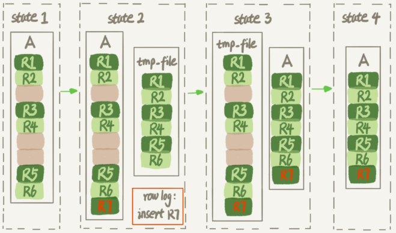

## 数据库表的空间回收

### `InnoDB` 表结构

一个 `InnoDB` 表包含两部分，即：表结构定义和数据。在 MySQL 8.0 版本之前，表结构是存在以 `.frm` 为后缀的文件里。而 MySQL 8.0 版本，则已经允许把表结构定义放在系统数据表中了。因为表结构定义占用的空间很小。

#### 参数 `innodb_file_per_table`

表数据既可以存在共享表空间里，也可以是单独的文件。这个行为是由参数 `innodb_file_per_table` 控制的：

* 这个参数设置为 `OFF` 表示的是，表的数据放在系统共享表空间与数据字典放在一起
* 这个参数设置为 `ON` 表示的是，每个 `InnoDB` 表数据存储在一个以 `.ibd` 为后缀的文件中

从 `MySQL` 5.6.6 版本开始，默认值为 `ON`，一个表单独存储为一个文件更容易管理，而且在不需要这个表的时候，通过 `drop table` 命令，系统就会直接删除这个文件。而如果存放在共享表空间中，即使表删掉了，空间也是不会回收的。

#### 数据删除流程

`InnoDB` 里的数据都是 B+ 树的结构组织的，如果要删除某条记录，`InnoDB` 引擎只会把这个记录标记为删除。如果之后要再插入一个记录，可能会复用这个位置。但是，磁盘文件的大小并不会缩小。

`InnoDB` 的数据页是按页存储的，如果删掉了一个数据页上的所有记录，整个数据页就可以被复用了。但 **数据页的复用跟记录的复用是不同的** 

**记录的复用：** 只限于符合范围条件的数据。而当整个页从 B+ 树里面摘掉以后，可以复用任何位置。如果将数据页 `page A` 上的所有记录删除以后，`page A` 会被标记为可复用。这时候如果插入记录需要使用新页的时候，`page A` 是可以被复用的。如果相邻的两个数据页利用率都很小，系统就会把这两个页上的数据合到其中一个页上，另外一个数据页就被标记为可复用。

如果用 `delete` 命令把整个表的数据删除，结果是，所有的数据页都会被标记为可复用。但是磁盘上，文件不会变小。

`delete` 命令只是把记录位置，或者数据页标记为“可复用”，但磁盘文件的大小是不会改变的。通过 `delete` 命令是不能回收表空间的。这些可以复用，而没有被使用的空间，看起来就像是“空洞”，**不止是删除数据会造成空洞，插入数据也会**。如果数据是按照索引递增顺序插入的，那么索引是紧凑的。但是如果数据是随机插入的，就可能造成索引的数据页分裂。更新索引上的值，可以理解为删除一个旧的值，再插入一个新值。这也是会造成空洞的。即，经过大量增删改的表，都是可能存在空洞的。想要搜索表空间，就重建表。

### 重建表

收缩表空间的过程为：新建一个与表 A 结构相同的表 B，然后按照主键 ID递增的顺序，把数据一行一行地从表 A 里读出来再插入到表 B 中。由于表 B 是新建的表，所以表 A 主键索引上的空洞，在表 B 中就都不存在了。显然地，表 B 的主键索引更紧凑，数据页的利用率更高。如果把表 B 作为临时表，数据表 A 导入表 B 的操作完成后，用表 B 替换 A，从效果上看，就起到了收缩表 A 空间的作用

使用 `alter table A engine=InnoDB` 命令来重建表。在 MySQL 5.5 版本之前，这个命令的执行流程与上述一致，区别是这个临时表 B 不需要自己创建，MySQL 会自动完成转存数据、交换表名、删除旧表的操作。

在往临时插入数据的过程中，有新的数据要写入到表 A 的话，就会造成数据丢失。因此在整个 DDL 过程中，表 A 中不能有更新。即这个 `DDL` 不是 `Online` 的

**`MySQL 5.6` 版本开始引入的 `Online DDL`**

引入 `Online DDL` 之后，重建表的流程：

*Online DDL流程*



1. 建立一个临时文件，扫描表 A 主键的所有数据页
2. 用数据页中表 A 的记录生成 B+ 树，存储到临时文件中
3. 生成临时文件的过程中，将所有对 A 的操作记录在一个日志文件中（`row log`）中，对应的是上图中 `state2` 的状态
4. 临时文件生成后，将日志文件中的操作应用到临时文件，得到一个逻辑数据上与表 A 相同的数据文件，对应上图中 `state3` 的状态
5. 用临时文件替换表 A 的数据文件

因为日志文件记录和重放操作这个功能的存在，这个方案在重建表的过程中，允许对表 A 做增删改操作。`alter` 语句在启动的时候需要获取 `MDL` 写锁，但是这个写锁在真正拷贝数据之前就退化成读锁了。（退化的原因是为了实现 `Online`，`MDL` 读锁不会阻塞增删改操作，但又不能直接解锁，需要确保其他线程对这个表同时做 `DDL`）对于一个大表来说，`Online DDL` 最耗时的过程就是拷贝数据到临时表的过程，这个步骤的执行期间可以接受增删改操作。所以，相对于整个 `DDL` 过程来说，锁的时间非常短。对业务员来说，就可以认为是 `Online` 的。

重建会扫描原表数据和构建临时文件。对于很大的表来说，这个操作是很消耗 I/O 和 CPU 资源的。因此，对于线上服务，要很小心地控制操作时间，如果想要比较安全的操作，可以使用 `github` 开源的 `gh-ost` 来做。

#### `Online` 和 `inplace`

`Online DDL` 之前，重建表时，源表的数据导出来的存放位置是 `tmp_table` 。是一个临时表，是在 `server` 层创建的；而 `Online DDL` 根据源表重建处理的数据是放在 `tmp_file` 里的，这个临时文件是 `InnoDB` 在内部创建出来的，整个 `DDL` 过程都在 `InnoDB` 内部完成。对于 `sever` 层来说，没有把数据挪动到临时表，是一个 “原地” 操作，即是 `inplace` 。

重建表语句 `alter table t engine=InnoDB` 隐含地意思是：

```mysql
alter table t engine=innodb, ALGORITHM=implace;
```

跟 `inplace` 对应的就是拷贝表的方式，用法是：

```mysql
alter table t engine=innodb, ALGORITHM=copy
```

当使用 `ALGORITHM=copy` 的时候，表示的是强制拷贝表，对应的流程非 `Online DDL` 的操作过程。

如果要给 `InnoDB` 表的一个字段加全文索引，写法是：

```mysql
alter table add FULLTEXT(field_name);
```

这个过程是 `inplace` 的，但会阻塞增删改操作，是非 `Online` 的

两者逻辑之间的关系是：

* `DDL` 过程如果是 `Online` 的，就一定是 `inplace` 的
* `inplace` 的 `DDL`，有可能不是 `Online` 的。到 8.0，添加全文索引和空间索引就是这种情况

如果要收缩一个表，只是 `delete` 掉表里面不用的数据，表文件的大小是不会变的，需要通过 `alter table` 命令重建表，才能达到表文件变小的目的。5.6 版本的 `Online DDL` 方式可以在业务低峰期使用，而 5.5 及之前的版本，这个命令是会阻塞 `DML` 的。

* `optimize table t` 等于 `recreate` + `analyze`
* `alter table t engine = InnoDB` 即是 `recreate`
* `analyze table t` 是对表的索引信息做重新统计，没有修改数据，这个过程中加了 `MDL` 读锁

